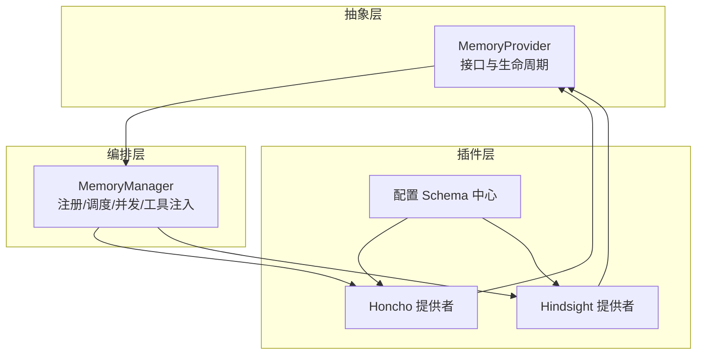
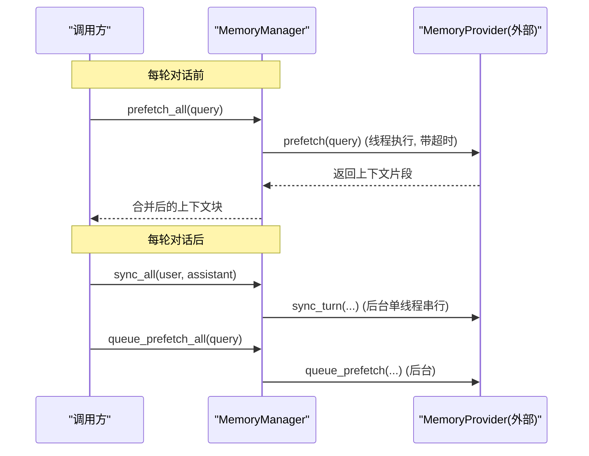
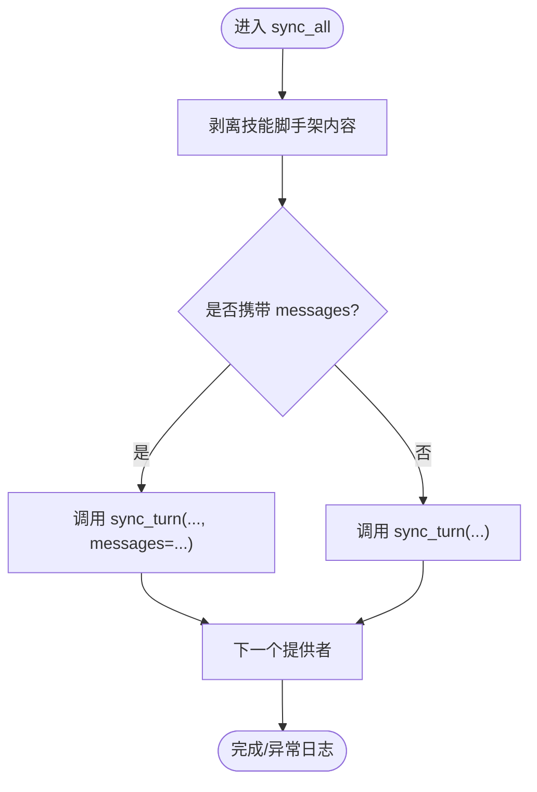
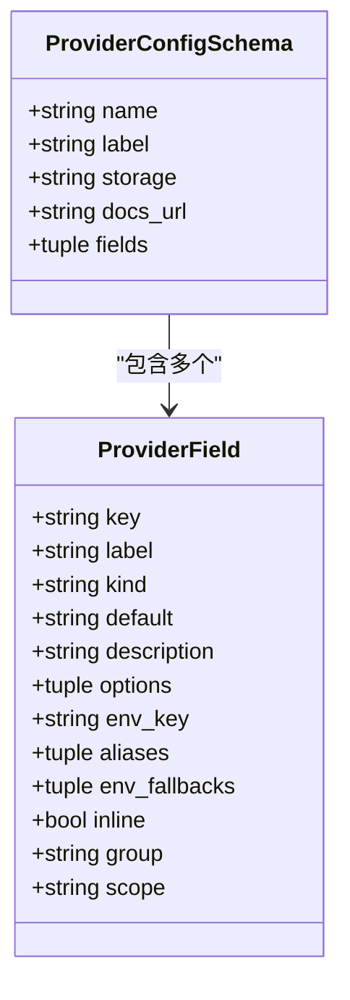
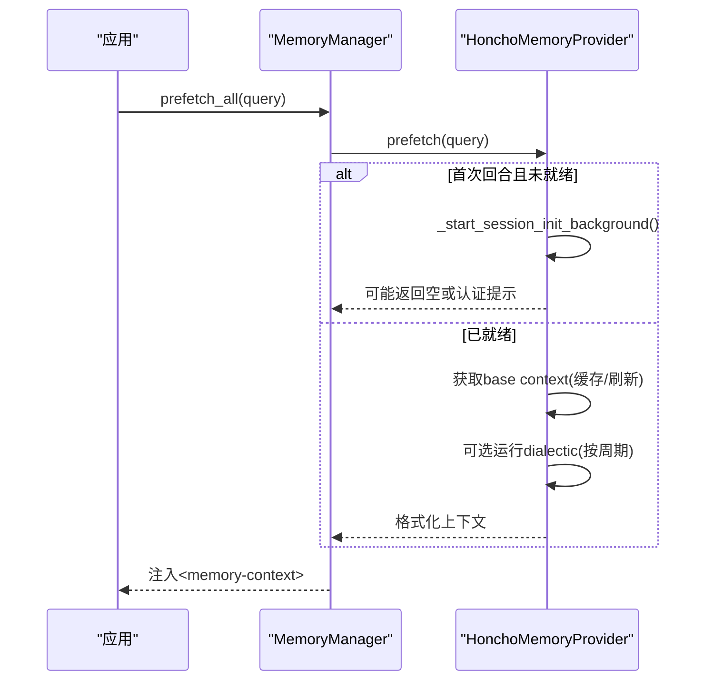
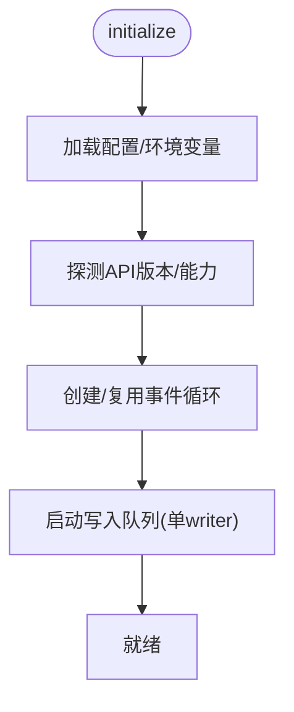
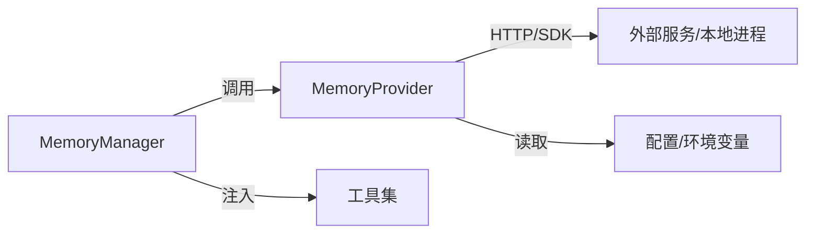

# 记忆提供者框架

<cite>
**本文引用的文件**
- [agent/memory_provider.py](file://agent/memory_provider.py)
- [agent/memory_manager.py](file://agent/memory_manager.py)
- [plugins/memory/config_schema.py](file://plugins/memory/config_schema.py)
- [plugins/memory/honcho/__init__.py](file://plugins/memory/honcho/__init__.py)
- [plugins/memory/honcho/config_schema.py](file://plugins/memory/honcho/config_schema.py)
- [plugins/memory/hindsight/__init__.py](file://plugins/memory/hindsight/__init__.py)
- [plugins/memory/hindsight/config_schema.py](file://plugins/memory/hindsight/config_schema.py)
</cite>

## 目录
1. [简介](#简介)
2. [项目结构](#项目结构)
3. [核心组件](#核心组件)
4. [架构总览](#架构总览)
5. [详细组件分析](#详细组件分析)
6. [依赖关系分析](#依赖关系分析)
7. [性能考虑](#性能考虑)
8. [故障排查指南](#故障排查指南)
9. [结论](#结论)
10. [附录](#附录)

## 简介
本文件系统性阐述 Hermes Agent 的记忆提供者框架：从抽象接口、工具模式注册与生命周期管理，到 MemoryManager 的预取/同步调度与错误处理；并覆盖配置系统（声明式 schema、环境变量、动态加载）、典型实现（Honcho、Hindsight）以及性能优化（连接池、请求去重、缓存策略）。文末提供自定义提供者开发指南与测试方法。

## 项目结构
记忆提供者框架由三层组成：
- 抽象层：MemoryProvider 定义统一接口与生命周期钩子
- 编排层：MemoryManager 负责注册、调度、并发控制、工具注入与上下文清洗
- 插件层：具体提供者（如 Honcho、Hindsight）实现接口，并通过 config_schema 声明配置项

图表来源
- [agent/memory_provider.py:81-358](file://agent/memory_provider.py#L81-L358)
- [agent/memory_manager.py:364-800](file://agent/memory_manager.py#L364-L800)
- [plugins/memory/config_schema.py:94-145](file://plugins/memory/config_schema.py#L94-L145)
- [plugins/memory/honcho/__init__.py:237-336](file://plugins/memory/honcho/__init__.py#L237-L336)
- [plugins/memory/hindsight/__init__.py:681-753](file://plugins/memory/hindsight/__init__.py#L681-L753)

章节来源
- [agent/memory_provider.py:81-358](file://agent/memory_provider.py#L81-L358)
- [agent/memory_manager.py:364-800](file://agent/memory_manager.py#L364-L800)
- [plugins/memory/config_schema.py:94-145](file://plugins/memory/config_schema.py#L94-L145)

## 核心组件
- MemoryProvider 抽象基类
  - 生命周期：is_available → initialize → system_prompt_block → prefetch/queue_prefetch → sync_turn → shutdown
  - 可选钩子：on_turn_start、on_session_end、on_session_switch、on_pre_compress、on_delegation、on_memory_write、backup_paths
  - 配置：get_config_schema、save_config
  - 工具：get_tool_schemas、handle_tool_call
- MemoryManager 编排器
  - 注册：add_provider（仅允许一个外部提供者），工具名冲突与保留名保护
  - 系统提示：build_system_prompt
  - 预取：prefetch_all（外部提供者线程化+超时），queue_prefetch_all（后台队列）
  - 同步：sync_all（单工作线程串行化写入，避免阻塞主流程）
  - 工具注入：inject_memory_provider_tools（规范化 schema，去重，过滤保留名）
  - 上下文清洗：sanitize_context、StreamingContextScrubber、build_memory_context_block
- 配置 Schema 系统
  - ProviderField/ProviderConfigSchema 声明字段类型、是否密钥、存储后端、分组等
  - get_provider_config_schema 按路径动态加载 provider 的 config_schema.py 并缓存

章节来源
- [agent/memory_provider.py:81-358](file://agent/memory_provider.py#L81-L358)
- [agent/memory_manager.py:50-157](file://agent/memory_manager.py#L50-L157)
- [agent/memory_manager.py:364-800](file://agent/memory_manager.py#L364-L800)
- [plugins/memory/config_schema.py:43-145](file://plugins/memory/config_schema.py#L43-L145)

## 架构总览
记忆提供者通过“抽象 + 编排 + 插件”解耦：
- 抽象层定义最小契约，屏蔽不同后端差异
- 编排层保证并发安全、超时保护、工具注入与上下文隔离
- 插件层专注业务逻辑与数据源集成，并以声明式 schema 暴露配置

图表来源
- [agent/memory_manager.py:525-595](file://agent/memory_manager.py#L525-L595)
- [agent/memory_manager.py:638-694](file://agent/memory_manager.py#L638-L694)
- [agent/memory_provider.py:132-170](file://agent/memory_provider.py#L132-L170)

## 详细组件分析

### MemoryProvider 抽象基类
- 职责
  - 暴露 name、is_available、initialize、system_prompt_block、prefetch、queue_prefetch、sync_turn、get_tool_schemas、handle_tool_call、shutdown
  - 可选钩子用于会话级事件、压缩前提取、委派观察、内置记忆写入镜像、备份路径等
  - 配置：get_config_schema/save_config 支持 CLI 与桌面端向导
- 设计要点
  - prefetch 应快速返回，实际召回在后台进行
  - sync_turn 必须非阻塞，必要时入队
  - handle_tool_call 返回 JSON 字符串
  - backup_paths 声明外部路径以便备份命令捕获

章节来源
- [agent/memory_provider.py:81-358](file://agent/memory_provider.py#L81-L358)

### MemoryManager 编排器
- 注册与工具路由
  - add_provider 限制仅一个外部提供者，记录工具名→提供者映射，拒绝与核心保留名冲突的工具
  - inject_memory_provider_tools 将提供者工具注入到 agent 的工具集，自动规范化 schema 并去重
- 预取与同步
  - prefetch_all：对每个提供者调用 _prefetch_provider，外部提供者使用独立线程并设置超时，失败不阻断其他提供者
  - queue_prefetch_all：将下一轮的预取任务提交到后台执行器
  - sync_all：通过单工作线程串行化所有提供者的 sync_turn，避免网络/守护进程阻塞导致主流程卡住
- 上下文清洗与注入
  - sanitize_context 移除内部标记与系统提示
  - StreamingContextScrubber 流式清理跨分片标签
  - build_memory_context_block 将预取结果包装为带系统说明的内存上下文块
- 后台任务与关闭
  - _submit_background 使用 DaemonThreadPoolExecutor 确保进程退出不被阻塞
  - flush_pending 用于会话边界或测试中等待队列排空

图表来源
- [agent/memory_manager.py:638-694](file://agent/memory_manager.py#L638-L694)

章节来源
- [agent/memory_manager.py:50-157](file://agent/memory_manager.py#L50-L157)
- [agent/memory_manager.py:364-800](file://agent/memory_manager.py#L364-L800)

### 配置系统（声明式 Schema）
- 字段模型
  - ProviderField：key、label、kind（text/select/secret/bool/number/json）、默认值、描述、占位符、选项、env_key、别名、环境回退、分组、作用域等
  - ProviderConfigSchema：name、label、storage（flat_json/honcho_host_block）、docs_url、fields
- 动态加载
  - get_provider_config_schema 按路径导入 provider 的 config_schema.py，缓存并按名称返回 CONFIG_SCHEMA
- 典型实现
  - Honcho：包含连接、身份、会话、消息写入、辩证推理、召回模式等多组配置
  - Hindsight：mode、api_key、api_url、bank_id、recall_budget 等基础配置

图表来源
- [plugins/memory/config_schema.py:43-107](file://plugins/memory/config_schema.py#L43-L107)

章节来源
- [plugins/memory/config_schema.py:94-145](file://plugins/memory/config_schema.py#L94-L145)
- [plugins/memory/honcho/config_schema.py:27-325](file://plugins/memory/honcho/config_schema.py#L27-L325)
- [plugins/memory/hindsight/config_schema.py:12-77](file://plugins/memory/hindsight/config_schema.py#L12-L77)

### 典型提供者实现

#### Honcho 提供者
- 能力
  - 多工具：profile、search、reasoning、context、conclude
  - 三种召回模式：context/tools/hybrid
  - 会话初始化可延迟（tools-only 模式）或启动时预热
  - 首回合预算控制与上下文缓存
- 生命周期
  - is_available：检查启用与凭据
  - initialize：解析配置、会话键、迁移、预热（可选）
  - prefetch：组合 base context 与 dialectic 补充，尊重注入频率与预算
  - system_prompt_block：根据模式输出静态指令
  - save_config：写入 $HERMES_HOME/honcho.json
- 配置
  - 通过 config_schema 暴露连接、身份、会话、消息写入、辩证推理、召回等字段

图表来源
- [plugins/memory/honcho/__init__.py:237-336](file://plugins/memory/honcho/__init__.py#L237-L336)
- [plugins/memory/honcho/__init__.py:699-800](file://plugins/memory/honcho/__init__.py#L699-L800)

章节来源
- [plugins/memory/honcho/__init__.py:237-336](file://plugins/memory/honcho/__init__.py#L237-L336)
- [plugins/memory/honcho/config_schema.py:27-325](file://plugins/memory/honcho/config_schema.py#L27-L325)

#### Hindsight 提供者
- 能力
  - 长期记忆：知识图谱、实体解析、多策略检索
  - 云端与本地模式，支持嵌入式守护进程
  - 异步 retain 与操作状态轮询，保障读后写一致性
- 生命周期
  - initialize：加载配置、探测 API 能力、准备事件循环与写入队列
  - prefetch/sync_turn：基于配置选择 recall/reflect，维护文档/银行 ID
  - 配置：通过 config_schema 暴露 mode、api_key、api_url、bank_id、recall_budget
- 关键机制
  - 能力探测：/version 判断是否支持 update_mode='append'
  - 事件循环：长驻后台线程复用 asyncio 事件循环，避免泄漏
  - 写入队列：单 writer 线程顺序消费，避免并发竞态

图表来源
- [plugins/memory/hindsight/__init__.py:166-253](file://plugins/memory/hindsight/__init__.py#L166-L253)
- [plugins/memory/hindsight/__init__.py:255-294](file://plugins/memory/hindsight/__init__.py#L255-L294)
- [plugins/memory/hindsight/__init__.py:681-753](file://plugins/memory/hindsight/__init__.py#L681-L753)

章节来源
- [plugins/memory/hindsight/__init__.py:166-253](file://plugins/memory/hindsight/__init__.py#L166-L253)
- [plugins/memory/hindsight/__init__.py:255-294](file://plugins/memory/hindsight/__init__.py#L255-L294)
- [plugins/memory/hindsight/__init__.py:681-753](file://plugins/memory/hindsight/__init__.py#L681-L753)
- [plugins/memory/hindsight/config_schema.py:12-77](file://plugins/memory/hindsight/config_schema.py#L12-L77)

## 依赖关系分析
- 模块耦合
  - MemoryManager 依赖 MemoryProvider 接口，同时依赖工具集注册表与守护线程池
  - 各提供者依赖各自的 SDK/客户端与环境变量
  - 配置 Schema 被 UI 与 Web Server 动态加载，避免引入运行时依赖
- 外部依赖点
  - 网络 API（Honcho/Hindsight Cloud）
  - 本地守护进程（Hindsight embedded）
  - 文件系统（配置文件、备份路径）

图表来源
- [agent/memory_manager.py:110-157](file://agent/memory_manager.py#L110-L157)
- [plugins/memory/honcho/__init__.py:237-336](file://plugins/memory/honcho/__init__.py#L237-L336)
- [plugins/memory/hindsight/__init__.py:681-753](file://plugins/memory/hindsight/__init__.py#L681-L753)

章节来源
- [agent/memory_manager.py:110-157](file://agent/memory_manager.py#L110-L157)
- [plugins/memory/config_schema.py:112-145](file://plugins/memory/config_schema.py#L112-L145)

## 性能考虑
- 并发与超时
  - 外部提供者 prefetch 使用独立线程并设置超时，避免阻塞主流程
  - sync_all 使用单工作线程串行化写入，防止乱序与资源争用
- 缓存与预算
  - Honcho 维护 base context 缓存与注入频率控制，减少重复网络调用
  - 首回合预算控制（first-turn base timeout）平衡响应速度与信息量
- 连接与事件循环
  - Hindsight 复用长驻事件循环，避免频繁创建导致的资源泄漏
  - 嵌入守护进程的端口健康检查窗口可调，降低误杀概率
- 请求去重与一致性
  - Hindsight 探测 API 能力以决定是否使用 append 模式，减少重复写入
  - 异步 retain 完成后通过操作状态轮询确保下一次 recall 可见性
- 上下文清洗
  - 流式 scrubber 避免跨分片标签泄露，提升 UI 显示质量

[本节为通用性能建议，无需特定文件引用]

## 故障排查指南
- 常见症状与定位
  - 预取超时：检查外部提供者线程是否仍在运行，确认超时阈值与后端健康度
  - 工具冲突：若出现核心工具名冲突，需重命名提供者工具以避免覆盖
  - 配置无效：确认 config_schema 中的 env_key/env_fallbacks 与实际环境变量一致
  - 写入阻塞：检查 sync_all 后台任务是否堆积，必要时调整 flush_pending 或使用单 writer 模式
- 诊断步骤
  - 查看 MemoryManager 日志中的 provider 名称与异常堆栈
  - 验证 is_available 返回是否符合预期（凭据/依赖是否就绪）
  - 对于 Hindsight，检查 /version 探测与端口健康检查窗口
  - 对于 Honcho，确认 session 初始化是否成功，关注认证失败的一次性提示

章节来源
- [agent/memory_manager.py:547-595](file://agent/memory_manager.py#L547-L595)
- [agent/memory_manager.py:638-694](file://agent/memory_manager.py#L638-L694)
- [plugins/memory/hindsight/__init__.py:188-253](file://plugins/memory/hindsight/__init__.py#L188-L253)
- [plugins/memory/honcho/__init__.py:343-410](file://plugins/memory/honcho/__init__.py#L343-L410)

## 结论
Hermes 记忆提供者框架通过清晰的抽象、健壮的编排与声明式配置，实现了多后端记忆的即插即用与高可用运行。MemoryProvider 定义了最小契约，MemoryManager 提供了并发、超时、工具注入与上下文清洗等横切能力，而 Honcho 与 Hindsight 展示了两种不同的实现风格与优化策略。开发者可据此快速构建自定义提供者，并在生产环境中获得稳定、可观测、易维护的记忆能力。

## 附录

### 自定义记忆提供者开发指南
- 步骤
  1. 继承 MemoryProvider，实现必要方法与可选钩子
  2. 在 get_tool_schemas 中声明工具，并在 handle_tool_call 中实现分发
  3. 在 initialize 中建立连接/会话，注意 cron/flush 场景跳过写入
  4. 在 prefetch 中返回轻量上下文，复杂计算放入 queue_prefetch
  5. 在 sync_turn 中异步持久化，避免阻塞
  6. 提供 config_schema.py 声明配置项，便于 UI 与 CLI 引导
  7. 实现 backup_paths 以纳入备份范围
- 最佳实践
  - 保持 prefetch 快速返回，必要时使用缓存
  - 对网络调用设置合理超时与重试
  - 使用单 writer 或队列避免并发写入竞争
  - 对敏感信息使用 secret 字段与 env_key
  - 在 on_session_switch/on_session_end 中清理/迁移状态

章节来源
- [agent/memory_provider.py:81-358](file://agent/memory_provider.py#L81-L358)
- [plugins/memory/config_schema.py:43-145](file://plugins/memory/config_schema.py#L43-L145)

### 测试方法
- 单元测试要点
  - 验证 is_available 在不同配置下的行为
  - 模拟网络失败与超时，校验 prefetch/sync 的错误处理
  - 断言工具注入后不会覆盖核心工具名
  - 验证配置 schema 渲染与保存路径正确
- 集成测试要点
  - 端到端会话：prefetch → 调用 → sync → 下一轮 prefetch 可见性
  - 多提供者共存：仅一个外部提供者生效，另一个被拒绝
  - 关闭流程：flush_pending 能等待队列排空，无僵尸线程

章节来源
- [agent/memory_manager.py:404-470](file://agent/memory_manager.py#L404-L470)
- [agent/memory_manager.py:759-781](file://agent/memory_manager.py#L759-L781)
- [plugins/memory/honcho/config_schema.py:27-325](file://plugins/memory/honcho/config_schema.py#L27-L325)
- [plugins/memory/hindsight/config_schema.py:12-77](file://plugins/memory/hindsight/config_schema.py#L12-L77)