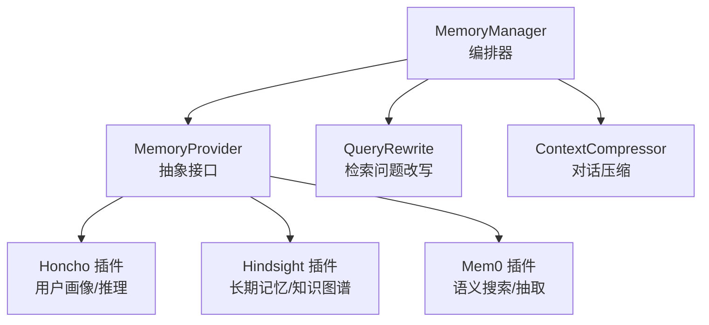
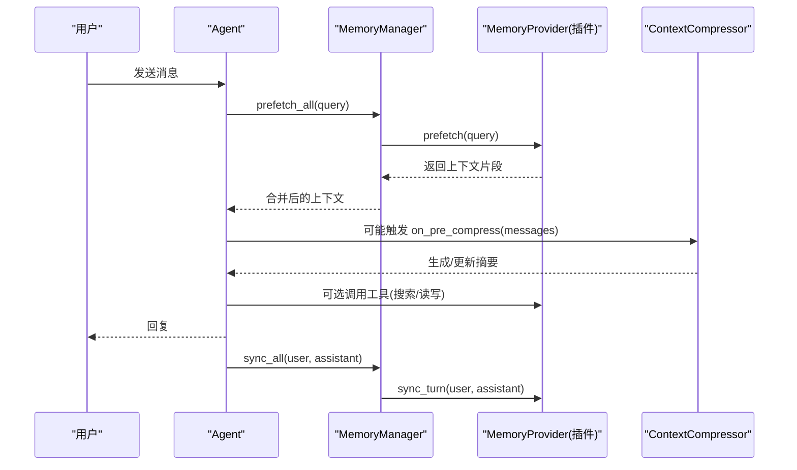
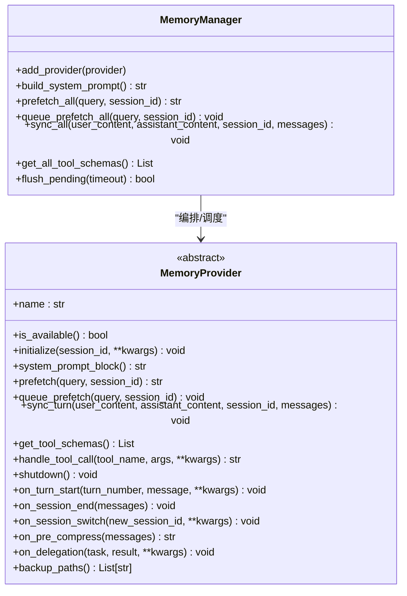
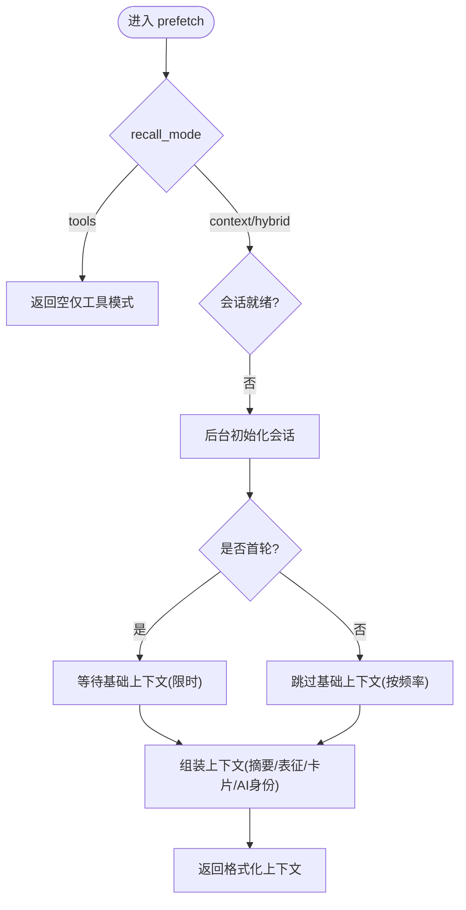
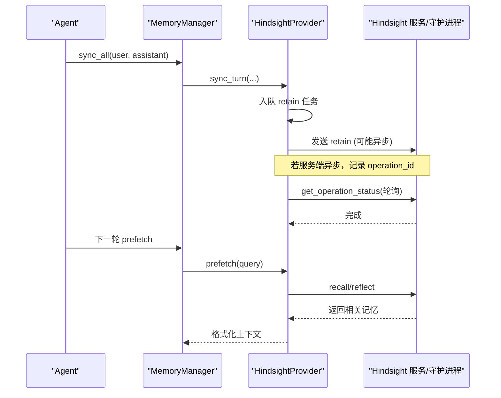
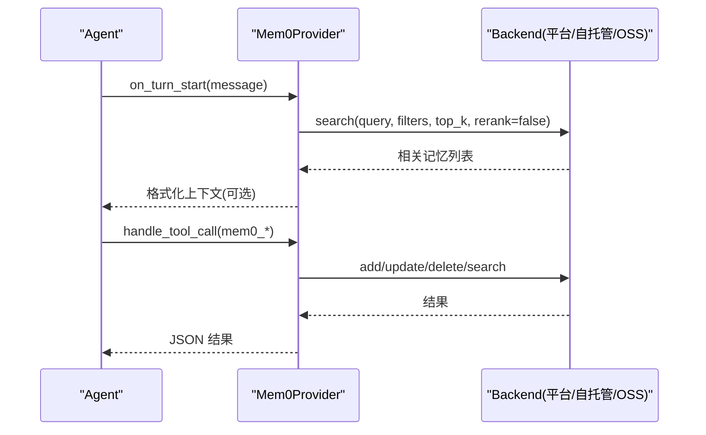
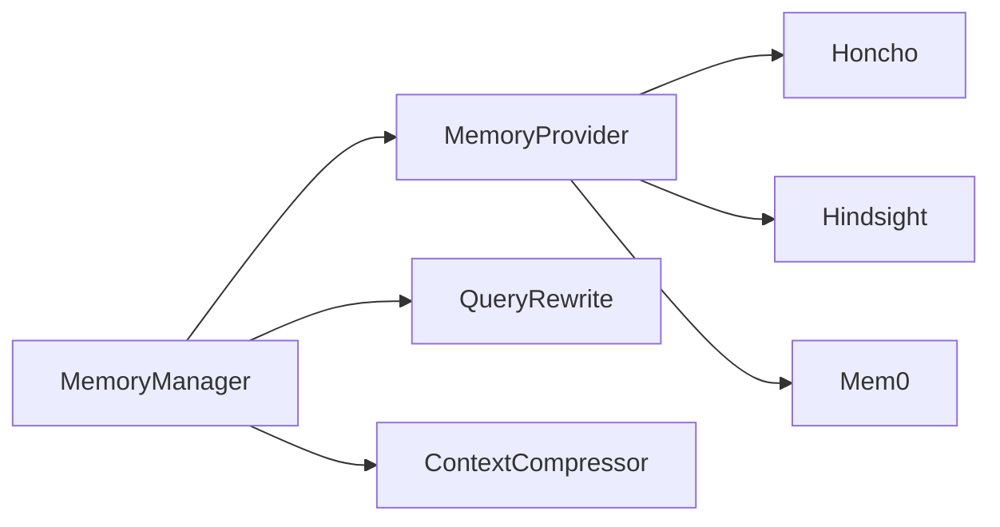

# 记忆系统集成

<cite>
**本文引用的文件**
- [memory_manager.py](file://agent/memory_manager.py)
- [memory_provider.py](file://agent/memory_provider.py)
- [config_schema.py](file://plugins/memory/config_schema.py)
- [query_rewrite.py](file://plugins/memory/query_rewrite.py)
- [__init__.py（Honcho）](file://plugins/memory/honcho/__init__.py)
- [__init__.py（Hindsight）](file://plugins/memory/hindsight/__init__.py)
- [__init__.py（Mem0）](file://plugins/memory/mem0/__init__.py)
- [context_compressor.py](file://agent/context_compressor.py)
</cite>

## 目录
1. [简介](#简介)
2. [项目结构](#项目结构)
3. [核心组件](#核心组件)
4. [架构总览](#架构总览)
5. [详细组件分析](#详细组件分析)
6. [依赖关系分析](#依赖关系分析)
7. [性能考量](#性能考量)
8. [故障排查指南](#故障排查指南)
9. [结论](#结论)
10. [附录：集成与扩展指南](#附录：集成与扩展指南)

## 简介
本文件面向 Hermes Agent 的记忆系统集成，系统性阐述短期记忆、长期记忆与用户画像管理的架构设计；解释上下文引擎的工作原理（向量检索、语义检索、知识图谱构建）；说明对话压缩算法、上下文提取策略与记忆持久化机制；提供记忆查询/更新/删除的使用路径与示例定位；并给出索引构建、缓存策略与内存管理等性能优化建议，帮助开发者完成记忆系统的集成与扩展。

## 项目结构
记忆系统由“统一编排层 + 抽象接口 + 多实现插件”构成：
- 编排层：MemoryManager 负责注册/调度多个 MemoryProvider，统一注入工具、组装系统提示、执行预取与同步。
- 抽象接口：MemoryProvider 定义生命周期、预取、同步、工具暴露、会话钩子等标准能力。
- 插件实现：Honcho（用户画像/对话式推理）、Hindsight（长期记忆/知识图谱/多策略检索）、Mem0（服务端抽取/语义搜索）。
- 配置与重写：config_schema 声明各插件可配置项；query_rewrite 将最新用户消息改写为高质量检索问题。
- 上下文压缩：context_compressor 在长对话中压缩历史，并通过 on_pre_compress 钩子保留关键记忆。

图表来源
- [memory_manager.py:364-800](file://agent/memory_manager.py#L364-L800)
- [memory_provider.py:81-188](file://agent/memory_provider.py#L81-L188)
- [__init__.py（Honcho）:237-231](file://plugins/memory/honcho/__init__.py#L237-L231)
- [__init__.py（Hindsight）:681-800](file://plugins/memory/hindsight/__init__.py#L681-L800)
- [__init__.py（Mem0）:194-225](file://plugins/memory/mem0/__init__.py#L194-L225)
- [query_rewrite.py:109-140](file://plugins/memory/query_rewrite.py#L109-L140)
- [context_compressor.py:1-180](file://agent/context_compressor.py#L1-L180)

章节来源
- [memory_manager.py:1-158](file://agent/memory_manager.py#L1-L158)
- [memory_provider.py:1-80](file://agent/memory_provider.py#L1-L80)
- [config_schema.py:1-145](file://plugins/memory/config_schema.py#L1-L145)
- [query_rewrite.py:1-140](file://plugins/memory/query_rewrite.py#L1-L140)

## 核心组件
- MemoryManager：单点编排，限制仅一个外部插件同时运行；提供系统提示拼装、预取合并、后台同步、工具注入与流式上下文清洗。
- MemoryProvider：抽象基类，定义 is_available/initialize/system_prompt_block/prefetch/sync_turn/get_tool_schemas/handle_tool_call/shutdown 及可选钩子（on_turn_start/on_session_end/on_session_switch/on_pre_compress/on_delegation/backup_paths）。
- Honcho：用户画像（卡片/表征/总结）、对话式推理、混合检索；支持 context/tools/hybrid 模式与首次-turn 预热。
- Hindsight：长期记忆、实体解析、知识图谱、多策略检索（语义+关键词+图遍历+重排）；支持云端/本地嵌入守护进程；异步 retain 与操作状态等待。
- Mem0：服务端 LLM 事实抽取、语义搜索、自动去重；支持平台/自托管/OSS 三种后端；内置熔断器与轮询等待。
- QueryRewrite：调用辅助模型将最新用户消息改写为单一检索问题，过滤指令泄露与无效输出。
- ContextCompressor：滚动/批量压缩，保护头尾，维护摘要前缀与结束标记，通过 on_pre_compress 让记忆插件参与摘要。

章节来源
- [memory_manager.py:364-800](file://agent/memory_manager.py#L364-L800)
- [memory_provider.py:81-358](file://agent/memory_provider.py#L81-L358)
- [__init__.py（Honcho）:237-800](file://plugins/memory/honcho/__init__.py#L237-L800)
- [__init__.py（Hindsight）:681-800](file://plugins/memory/hindsight/__init__.py#L681-L800)
- [__init__.py（Mem0）:194-629](file://plugins/memory/mem0/__init__.py#L194-L629)
- [query_rewrite.py:1-140](file://plugins/memory/query_rewrite.py#L1-L140)
- [context_compressor.py:1-180](file://agent/context_compressor.py#L1-L180)

## 架构总览
记忆系统采用“插件化 + 统一编排”的架构：
- 统一入口：MemoryManager 管理所有 MemoryProvider，屏蔽差异，保证只允许一个外部插件以避免工具冲突。
- 预取与同步：每轮对话前 prefetch 召回相关上下文；每轮结束后 sync_turn 持久化到后端；两者均走后台线程或队列，避免阻塞主流程。
- 工具暴露：provider 声明工具 schema，manager 注入到 agent 的工具集，供模型按需调用（如搜索、新增、更新、删除）。
- 上下文增强：prefetch 结果被包裹为 <memory-context> 块，配合 StreamingContextScrubber 在流式输出中安全剥离内部上下文片段。
- 压缩协同：压缩前触发 on_pre_compress，使记忆插件能提取即将被丢弃的消息要点，融入摘要。

图表来源
- [memory_manager.py:525-694](file://agent/memory_manager.py#L525-L694)
- [memory_provider.py:132-188](file://agent/memory_provider.py#L132-L188)
- [context_compressor.py:258-340](file://agent/context_compressor.py#L258-L340)

## 详细组件分析

### 编排器：MemoryManager
- 职责：注册 provider、收集工具 schema、注入系统提示、执行预取与同步、后台任务调度、流式上下文清洗。
- 关键特性：
  - 仅允许一个外部 provider，避免工具名冲突与 schema 膨胀。
  - 外部 provider 的 prefetch 使用独立线程并带超时，失败不阻塞其他 provider。
  - sync_turn 通过单工作线程序列化写入，确保 turn N 先于 turn N+1 落地。
  - 流式 scrubber 处理跨分片的 <memory-context> 标签，防止泄露内部上下文。
  - 提供 flush_pending 用于测试或会话边界等待后台任务完成。

图表来源
- [memory_manager.py:364-800](file://agent/memory_manager.py#L364-L800)
- [memory_provider.py:81-358](file://agent/memory_provider.py#L81-L358)

章节来源
- [memory_manager.py:1-158](file://agent/memory_manager.py#L1-L158)
- [memory_manager.py:364-800](file://agent/memory_manager.py#L364-L800)

### 抽象接口：MemoryProvider
- 生命周期：initialize → system_prompt_block → prefetch → sync_turn → shutdown。
- 可选钩子：on_turn_start、on_session_end、on_session_switch、on_pre_compress、on_delegation、backup_paths。
- 工具契约：get_tool_schemas 返回 OpenAI function 格式；handle_tool_call 处理具体调用。
-  trivial prompt 过滤：is_trivial_prompt 识别无意义输入，跳过网络往返。

章节来源
- [memory_provider.py:1-80](file://agent/memory_provider.py#L1-L80)
- [memory_provider.py:81-358](file://agent/memory_provider.py#L81-L358)

### 插件：Honcho（用户画像与对话式推理）
- 能力：用户画像（card/representation/summary）、对话式推理（reasoning_level 控制深度）、混合检索（context/tools/hybrid）。
- 预取策略：首次-turn 可等待基础上下文；后续按 cadence 刷新；支持 query rewrite 开关。
- 工具：honcho_profile、honcho_search、honcho_reasoning、honcho_context、honcho_conclude（增删查结论）。
- 初始化：支持懒加载（tools-only 模式），后台初始化会话，失败时降级。

图表来源
- [__init__.py（Honcho）:699-800](file://plugins/memory/honcho/__init__.py#L699-L800)
- [__init__.py（Honcho）:237-231](file://plugins/memory/honcho/__init__.py#L237-L231)

章节来源
- [__init__.py（Honcho）:237-800](file://plugins/memory/honcho/__init__.py#L237-L800)

### 插件：Hindsight（长期记忆与知识图谱）
- 能力：长期记忆存储（retain）、语义/关键词/图谱检索（recall/reflect）、观察层聚合、实体解析。
- 配置：云端 API 或本地嵌入守护进程；支持 bank_id 模板、预算级别、保留标签与作用域。
- 异步写入：retain 入队，writer 线程顺序消费；对服务端异步 retain 会轮询操作状态以确保下次 recall 可见。
- 版本探测：/version 探测是否支持 update_mode='append'，以决定是否追加而非覆盖。

图表来源
- [__init__.py（Hindsight）:681-800](file://plugins/memory/hindsight/__init__.py#L681-L800)
- [memory_manager.py:638-694](file://agent/memory_manager.py#L638-L694)

章节来源
- [__init__.py（Hindsight）:1-800](file://plugins/memory/hindsight/__init__.py#L1-L800)

### 插件：Mem0（服务端抽取与语义搜索）
- 能力：服务端 LLM 抽取事实、语义搜索、自动去重；支持平台/自托管/OSS 三种后端。
- 工具：mem0_search、mem0_add、mem0_update、mem0_delete。
- 容错：熔断器（连续失败后冷却），轮询等待短暂延迟，错误分类区分客户端错误与服务端错误。
- 预取：on_turn_start 启动后台搜索，prefetch 短等待热路径，失败则回退到工具调用。

图表来源
- [__init__.py（Mem0）:194-629](file://plugins/memory/mem0/__init__.py#L194-L629)

章节来源
- [__init__.py（Mem0）:1-629](file://plugins/memory/mem0/__init__.py#L1-L629)

### 检索问题改写：QueryRewrite
- 目标：将最新用户消息改写为单一英文检索问题，聚焦用户历史/偏好/上下文。
- 约束：截断过长输入、清理指令泄露、强制以疑问句结尾、长度上限。
- 调用：通过 auxiliary_client 调用辅助模型，失败时回退为空字符串。

章节来源
- [query_rewrite.py:1-140](file://plugins/memory/query_rewrite.py#L1-L140)

### 上下文压缩：ContextCompressor
- 目标：长对话中压缩中间历史，保护首尾，维持摘要前缀与结束标记，避免模型误读。
- 策略：结构化摘要模板、工具输出裁剪、预算分配、滚动微压缩、失败回退。
- 记忆集成：on_pre_compress 钩子让记忆插件提取即将丢弃的消息要点，融入摘要。

章节来源
- [context_compressor.py:1-180](file://agent/context_compressor.py#L1-L180)
- [context_compressor.py:258-340](file://agent/context_compressor.py#L258-L340)

## 依赖关系分析
- MemoryManager 依赖 MemoryProvider 抽象，解耦具体实现。
- 插件之间相互独立，通过统一接口与 manager 交互，避免直接耦合。
- 工具 schema 经 normalize_tool_schema 标准化，避免重复包装导致 name 缺失。
- 配置 schema 集中声明，UI 与 Web 通用渲染，降低定制成本。

图表来源
- [memory_manager.py:364-800](file://agent/memory_manager.py#L364-L800)
- [memory_provider.py:81-358](file://agent/memory_provider.py#L81-L358)
- [config_schema.py:1-145](file://plugins/memory/config_schema.py#L1-L145)

章节来源
- [memory_manager.py:364-800](file://agent/memory_manager.py#L364-L800)
- [config_schema.py:1-145](file://plugins/memory/config_schema.py#L1-L145)

## 性能考量
- 预取与同步异步化：
  - 外部 provider 的 prefetch 使用独立线程并设置超时，避免阻塞主流程。
  - sync_turn 通过单工作线程序列化写入，保证顺序且不会拖慢响应。
- 缓存策略：
  - Honcho 维护 base context cache，按 cadence 刷新。
  - Hindsight 对 /version 探测结果进行进程级缓存，减少重复请求。
  - Mem0 使用熔断器与短等待热路径，失败快速回退。
- 索引与检索：
  - Hindsight 支持语义+关键词+图谱的多策略检索，结合 re-ranking 提升相关性。
  - Mem0 服务端抽取与去重，减少冗余记忆。
- 内存与资源：
  - 流式 scrubber 避免泄露内部上下文，降低 UI 噪音。
  - 压缩阶段严格红敏信息，避免敏感数据持久化。
  - 守护进程/事件循环复用，避免频繁创建销毁带来的开销。

[本节为通用性能指导，无需特定文件引用]

## 故障排查指南
- 外部 provider 预取超时：检查网络/服务健康，必要时增大 external_prefetch_timeout。
- 工具名冲突：确认 provider 未使用保留工具名（如 clarify、delegate_task），否则会被拒绝。
- 会话初始化失败：查看 Honcho/Hindsight/Mem0 的初始化日志，关注认证失败或服务不可用。
- 压缩失败：检查辅助模型配额/鉴权错误，系统会自动降级并保留必要锚点。
- 异步 retain 可见性：Hindsight 会在下一次 prefetch 前轮询操作状态，确保写入可见。

章节来源
- [memory_manager.py:547-595](file://agent/memory_manager.py#L547-L595)
- [memory_manager.py:638-694](file://agent/memory_manager.py#L638-L694)
- [__init__.py（Hindsight）:188-252](file://plugins/memory/hindsight/__init__.py#L188-L252)
- [__init__.py（Mem0）:294-336](file://plugins/memory/mem0/__init__.py#L294-L336)

## 结论
Hermes 记忆系统通过统一的编排器与抽象接口，实现了短期记忆（会话内上下文）、长期记忆（跨会话事实/图谱）与用户画像（角色/偏好/行为模式）的有机结合。借助异步预取/同步、流式清洗、压缩协同与多策略检索，系统在可用性、可扩展性与性能方面达到平衡。开发者可按需启用不同插件，并通过配置 schema 与工具接口灵活扩展。

[本节为总结，无需特定文件引用]

## 附录：集成与扩展指南

### 如何启用记忆功能
- 在 agent 初始化时创建 MemoryManager，并添加一个外部 provider（或仅使用内置）。
- 将 manager 的系统提示块拼接到系统提示中。
- 每轮对话前调用 prefetch_all 获取上下文；每轮结束后调用 sync_all 持久化。
- 如需后台预取，可在回合完成后调用 queue_prefetch_all。

章节来源
- [memory_manager.py:10-23](file://agent/memory_manager.py#L10-L23)
- [memory_manager.py:525-623](file://agent/memory_manager.py#L525-L623)

### 如何使用记忆工具（查询/更新/删除）
- 查询：
  - Honcho：honcho_search（原始片段）、honcho_reasoning（综合回答）。
  - Hindsight：hindsight_recall（多策略检索）、hindsight_reflect（综合推理）。
  - Mem0：mem0_search（语义搜索，可 rerank）。
- 更新/新增：
  - Honcho：honcho_conclude（写结论）。
  - Hindsight：hindsight_retain（存储信息，自动抽取/解析）。
  - Mem0：mem0_add（存储事实）、mem0_update（按 ID 更新）。
- 删除：
  - Honcho：honcho_conclude（delete_id）。
  - Mem0：mem0_delete（按 ID 删除）。

章节来源
- [__init__.py（Honcho）:36-231](file://plugins/memory/honcho/__init__.py#L36-L231)
- [__init__.py（Hindsight）:305-354](file://plugins/memory/hindsight/__init__.py#L305-L354)
- [__init__.py（Mem0）:117-187](file://plugins/memory/mem0/__init__.py#L117-L187)

### 配置与自定义
- 使用 config_schema 声明插件配置字段（文本/选择/密钥/布尔/数字/JSON），支持别名与环境变量回退。
- 通过 save_config 将非密钥配置写入插件原生位置（如 honcho.json、mem0.json）。
- 通过 get_config_schema 与 post_setup 引导用户完成配置。

章节来源
- [config_schema.py:1-145](file://plugins/memory/config_schema.py#L1-L145)
- [__init__.py（Honcho）:315-342](file://plugins/memory/honcho/__init__.py#L315-L342)
- [__init__.py（Mem0）:236-265](file://plugins/memory/mem0/__init__.py#L236-L265)

### 扩展开发方法
- 实现 MemoryProvider 接口，提供 is_available/initialize/system_prompt_block/prefetch/sync_turn/get_tool_schemas/handle_tool_call/shutdown。
- 可选实现 on_turn_start/on_session_end/on_session_switch/on_pre_compress/on_delegation/backup_paths 以增强生命周期行为。
- 在 plugins/memory/<your_provider>/ 下组织代码，并在 __init__.py 中注册 provider。
- 提供 config_schema.py 声明配置项，便于 UI/Web 渲染与保存。

章节来源
- [memory_provider.py:81-358](file://agent/memory_provider.py#L81-L358)
- [config_schema.py:1-145](file://plugins/memory/config_schema.py#L1-L145)