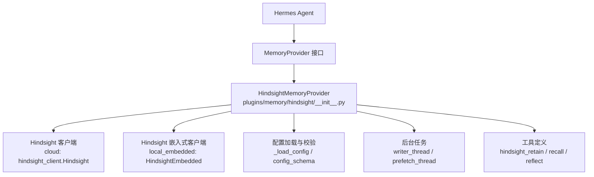
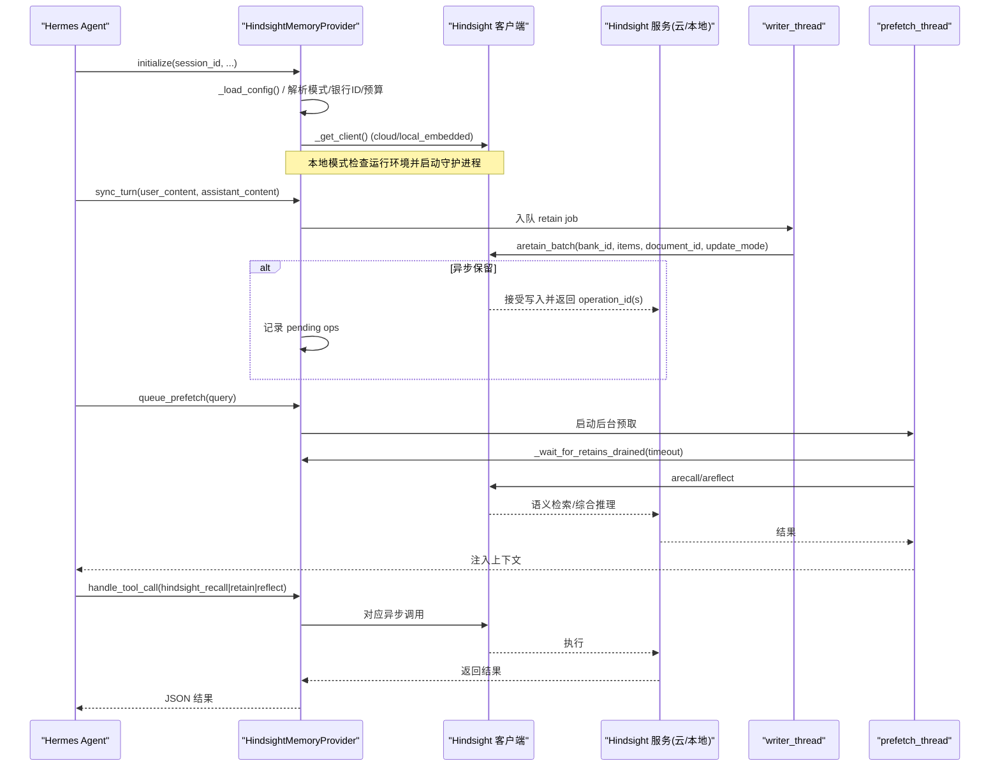
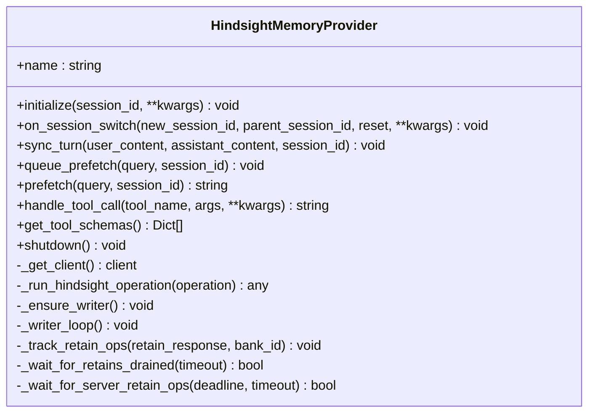
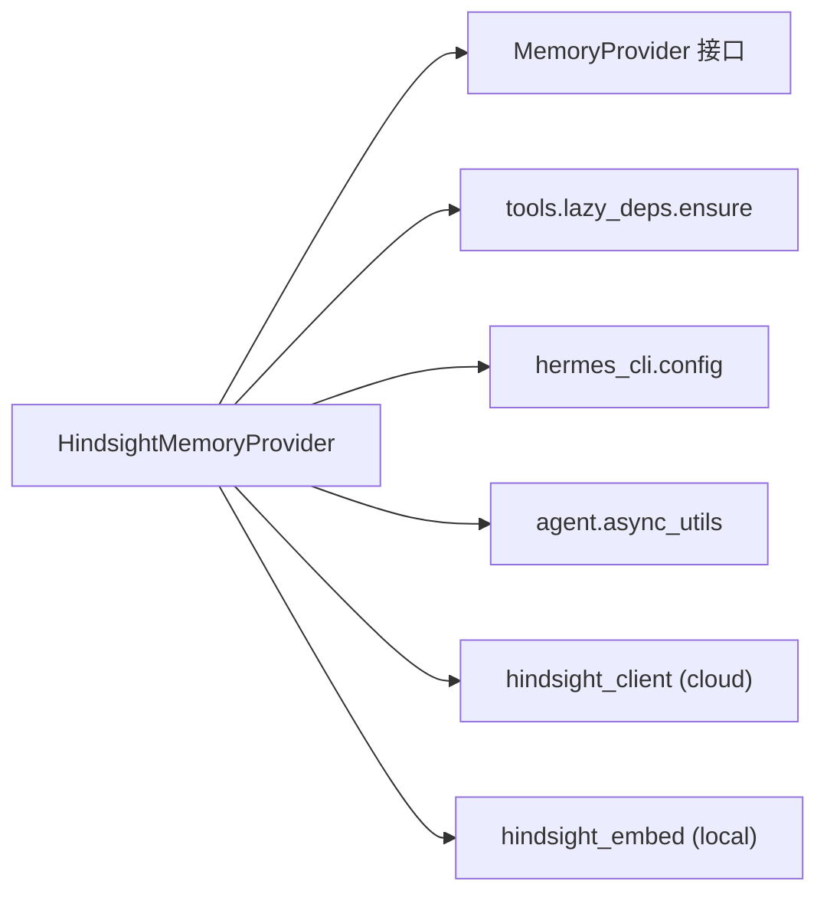

# Hindsight 记忆后端

<cite>
**本文引用的文件**
- [plugins/memory/hindsight/__init__.py](file://plugins/memory/hindsight/__init__.py)
- [plugins/memory/hindsight/config_schema.py](file://plugins/memory/hindsight/config_schema.py)
- [plugins/memory/config_schema.py](file://plugins/memory/config_schema.py)
- [tests/plugins/memory/test_hindsight_provider.py](file://tests/plugins/memory/test_hindsight_provider.py)
</cite>

## 目录
1. [简介](#简介)
2. [项目结构](#项目结构)
3. [核心组件](#核心组件)
4. [架构总览](#架构总览)
5. [详细组件分析](#详细组件分析)
6. [依赖关系分析](#依赖关系分析)
7. [性能与优化](#性能与优化)
8. [故障排除指南](#故障排除指南)
9. [结论](#结论)
10. [附录：配置项速查](#附录：配置项速查)

## 简介
Hindsight 是 Hermes Agent 的长期记忆后端插件，提供“知识图谱 + 实体解析 + 多策略检索”的能力。它支持云端模式（通过 API Key 连接 Hindsight Cloud）和本地模式（本地嵌入式守护进程或外部实例）。在对话过程中，Hindsight 自动抽取关键信息、维护结构化事实并支持语义检索与综合推理。

本文件面向希望集成、调优和排障 Hindsight 的用户与开发者，涵盖：
- 向量数据库集成与语义搜索机制
- 用户画像构建与标签体系
- 配置选项详解（API 密钥、存储路径、搜索参数等）
- 使用示例（初始化、检索、管理数据）
- 记忆提取机制（对话分析、关键信息抽取、知识图谱维护）
- 性能优化建议（批量操作、缓存策略、索引优化）
- 故障排除（常见问题与解决方案）

## 项目结构
Hindsight 以插件形式集成到 Hermes 的记忆系统中，核心实现位于 plugins/memory/hindsight 目录下，并通过统一的 MemoryProvider 接口暴露能力。

图表来源
- [plugins/memory/hindsight/__init__.py:681-1152](file://plugins/memory/hindsight/__init__.py#L681-L1152)
- [plugins/memory/hindsight/config_schema.py:12-76](file://plugins/memory/hindsight/config_schema.py#L12-L76)
- [plugins/memory/config_schema.py:43-103](file://plugins/memory/config_schema.py#L43-L103)

章节来源
- [plugins/memory/hindsight/__init__.py:1-120](file://plugins/memory/hindsight/__init__.py#L1-L120)
- [plugins/memory/hindsight/config_schema.py:1-76](file://plugins/memory/hindsight/config_schema.py#L1-L76)
- [plugins/memory/config_schema.py:1-145](file://plugins/memory/config_schema.py#L1-L145)

## 核心组件
- HindsightMemoryProvider：实现 MemoryProvider 接口，负责初始化、会话切换、自动保留/召回、工具调用处理、后台写入与预取。
- 配置系统：支持 profile-scoped 配置文件与环境变量；提供桌面端可渲染的配置 schema。
- 客户端抽象：根据 mode 选择 cloud 或 local_embedded 客户端；统一异步执行与超时控制。
- 后台线程：单写者 writer_thread 串行处理 retain；prefetch_thread 异步预取上下文。
- 工具层：暴露 hindsight_retain、hindsight_recall、hindsight_reflect 三个工具。

章节来源
- [plugins/memory/hindsight/__init__.py:681-800](file://plugins/memory/hindsight/__init__.py#L681-L800)
- [plugins/memory/hindsight/__init__.py:1101-1152](file://plugins/memory/hindsight/__init__.py#L1101-L1152)
- [plugins/memory/hindsight/__init__.py:1962-2038](file://plugins/memory/hindsight/__init__.py#L1962-L2038)

## 架构总览
Hindsight 的运行时由“配置加载 → 客户端创建 → 会话生命周期 → 后台写入/预取 → 工具调用”构成。云端模式下通过 HTTP 调用 Hindsight Cloud API；本地模式下启动嵌入式守护进程并使用本地嵌入模型进行向量化与检索。

图表来源
- [plugins/memory/hindsight/__init__.py:1454-1623](file://plugins/memory/hindsight/__init__.py#L1454-L1623)
- [plugins/memory/hindsight/__init__.py:1716-1786](file://plugins/memory/hindsight/__init__.py#L1716-L1786)
- [plugins/memory/hindsight/__init__.py:1862-1961](file://plugins/memory/hindsight/__init__.py#L1862-L1961)
- [plugins/memory/hindsight/__init__.py:1962-2038](file://plugins/memory/hindsight/__init__.py#L1962-L2038)

## 详细组件分析

### 配置系统与模式
- 模式选择：cloud、local_external、local_embedded（兼容 legacy “local”）。
- 配置来源优先级：$HERMES_HOME/hindsight/config.json → ~/.hindsight/config.json → 环境变量。
- 安全：敏感字段（如 API Key）通过 secret 机制读取；本地嵌入式模式的 LLM 密钥写入受保护的 .env 文件（权限 0600）。
- 动态 Bank ID：支持模板 {profile}/{workspace}/{platform}/{user}/{session}，并对非法字符做安全清洗。

章节来源
- [plugins/memory/hindsight/__init__.py:361-404](file://plugins/memory/hindsight/__init__.py#L361-L404)
- [plugins/memory/hindsight/__init__.py:521-620](file://plugins/memory/hindsight/__init__.py#L521-L620)
- [plugins/memory/hindsight/__init__.py:622-675](file://plugins/memory/hindsight/__init__.py#L622-L675)
- [plugins/memory/hindsight/config_schema.py:12-76](file://plugins/memory/hindsight/config_schema.py#L12-L76)

### 客户端与连接管理
- 云端：使用 hindsight_client.Hindsight，支持 base_url、timeout、api_key。
- 本地嵌入式：使用 HindsightEmbedded，支持 llm_provider、llm_model、llm_base_url、idle_timeout；自动检测运行环境并在必要时重启守护进程。
- 健康探测：对本地守护进程的 /health 设置 grace timeout，避免资源紧张时被误杀。
- 版本探测：通过 /version 判断是否支持 update_mode='append'，从而决定文档追加策略。

章节来源
- [plugins/memory/hindsight/__init__.py:1101-1152](file://plugins/memory/hindsight/__init__.py#L1101-L1152)
- [plugins/memory/hindsight/__init__.py:1624-1693](file://plugins/memory/hindsight/__init__.py#L1624-L1693)
- [plugins/memory/hindsight/__init__.py:188-252](file://plugins/memory/hindsight/__init__.py#L188-L252)

### 会话生命周期与文档管理
- initialize：生成 per-process document_id（session_id+时间戳），解析模式、银行、预算、标签、上下文等。
- on_session_switch：在会话切换时先 flush 旧会话的缓冲内容，再重置状态，避免跨会话覆盖或丢失。
- append 模式：当服务端支持 update_mode='append' 时，仅发送新增 turn，减少带宽与重复计算。

章节来源
- [plugins/memory/hindsight/__init__.py:1454-1623](file://plugins/memory/hindsight/__init__.py#L1454-L1623)
- [plugins/memory/hindsight/__init__.py:2040-2168](file://plugins/memory/hindsight/__init__.py#L2040-L2168)
- [plugins/memory/hindsight/__init__.py:1433-1452](file://plugins/memory/hindsight/__init__.py#L1433-L1452)

### 记忆保留（Retain）与批处理
- 单写者队列：所有 retain 请求进入 _retain_queue，由 writer_thread 串行执行，避免并发写入冲突。
- 元数据与标签：为每次保留附加 metadata（retained_at、message_count、turn_index、source、session_id、platform、user_*、chat_*、thread_id、agent_identity）与 lineage tags（session:*、parent:*）。
- 异步保留：默认 retain_async=True，服务端返回 operation_id(s)，后续通过 get_operation_status 等待完成。

章节来源
- [plugins/memory/hindsight/__init__.py:1173-1219](file://plugins/memory/hindsight/__init__.py#L1173-L1219)
- [plugins/memory/hindsight/__init__.py:1359-1380](file://plugins/memory/hindsight/__init__.py#L1359-L1380)
- [plugins/memory/hindsight/__init__.py:1803-1860](file://plugins/memory/hindsight/__init__.py#L1803-L1860)
- [plugins/memory/hindsight/__init__.py:1862-1961](file://plugins/memory/hindsight/__init__.py#L1862-L1961)

### 语义检索与预取（Recall/Reflect）
- 预取流程：queue_prefetch 在后台线程中执行，可选择 arecall 或 areflect；支持 tags/tags_match/types 过滤。
- 读后写保障：prefetch_waits_for_retain=True 时，预取会等待本地队列清空且服务端异步操作完成，确保下一轮 recall 可见最新保留。
- 结果注入：prefetch 结果以固定 preamble 注入系统提示，供模型直接消费。

章节来源
- [plugins/memory/hindsight/__init__.py:1716-1786](file://plugins/memory/hindsight/__init__.py#L1716-L1786)
- [plugins/memory/hindsight/__init__.py:1244-1357](file://plugins/memory/hindsight/__init__.py#L1244-L1357)

### 工具调用
- hindsight_retain：存储自由文本到记忆库，支持 context、tags。
- hindsight_recall：按 query 检索相关记忆，支持 budget、max_tokens、tags、types。
- hindsight_reflect：基于记忆进行综合推理回答。

章节来源
- [plugins/memory/hindsight/__init__.py:305-354](file://plugins/memory/hindsight/__init__.py#L305-L354)
- [plugins/memory/hindsight/__init__.py:1962-2038](file://plugins/memory/hindsight/__init__.py#L1962-L2038)

### 类图（代码级）

图表来源
- [plugins/memory/hindsight/__init__.py:681-1152](file://plugins/memory/hindsight/__init__.py#L681-L1152)
- [plugins/memory/hindsight/__init__.py:1173-1380](file://plugins/memory/hindsight/__init__.py#L1173-L1380)
- [plugins/memory/hindsight/__init__.py:1716-1786](file://plugins/memory/hindsight/__init__.py#L1716-L1786)
- [plugins/memory/hindsight/__init__.py:1962-2038](file://plugins/memory/hindsight/__init__.py#L1962-L2038)

## 依赖关系分析
- 外部依赖：
  - 云端：hindsight_client（通过 lazy_deps.ensure 按需安装）
  - 本地：hindsight-all（包含 embedding 模型与守护进程）
- 内部依赖：
  - agent.memory_provider.MemoryProvider（接口）
  - hermes_constants.get_hermes_home（路径）
  - tools.lazy_deps.ensure（依赖管理）
  - hermes_cli.config（配置读写）
  - agent.async_utils.safe_schedule_threadsafe（共享事件循环调度）

图表来源
- [plugins/memory/hindsight/__init__.py:47-53](file://plugins/memory/hindsight/__init__.py#L47-L53)
- [plugins/memory/hindsight/__init__.py:155-164](file://plugins/memory/hindsight/__init__.py#L155-L164)
- [plugins/memory/hindsight/__init__.py:269-293](file://plugins/memory/hindsight/__init__.py#L269-L293)

章节来源
- [plugins/memory/hindsight/__init__.py:47-53](file://plugins/memory/hindsight/__init__.py#L47-L53)
- [plugins/memory/hindsight/__init__.py:155-164](file://plugins/memory/hindsight/__init__.py#L155-L164)
- [plugins/memory/hindsight/__init__.py:269-293](file://plugins/memory/hindsight/__init__.py#L269-L293)

## 性能与优化
- 批量写入：使用 aretain_batch 将一轮对话的多个 turn 合并提交，减少网络往返。
- 增量追加：在服务端支持 update_mode='append' 时，仅发送新增 turn，降低带宽与重复计算。
- 后台预取：queue_prefetch 在独立线程执行，不阻塞回复路径；支持等待 retain 完成以保证一致性。
- 标签与类型过滤：通过 tags/tags_match/types 缩小检索范围，提高召回质量与速度。
- 超时与重试：统一超时控制；本地嵌入式连接失败时自动重建客户端并重试一次。
- 健康探测：port_health_grace_timeout 防止守护进程被误杀，提升稳定性。

章节来源
- [plugins/memory/hindsight/__init__.py:1158-1171](file://plugins/memory/hindsight/__init__.py#L1158-L1171)
- [plugins/memory/hindsight/__init__.py:1244-1357](file://plugins/memory/hindsight/__init__.py#L1244-L1357)
- [plugins/memory/hindsight/__init__.py:1433-1452](file://plugins/memory/hindsight/__init__.py#L1433-L1452)
- [plugins/memory/hindsight/__init__.py:1716-1786](file://plugins/memory/hindsight/__init__.py#L1716-L1786)

## 故障排除指南
- 本地模式不可用：
  - 现象：initialize 日志提示 local runtime unavailable。
  - 原因：导入 embedding 栈失败（例如 NumPy/sentence_transformers 缺失或不兼容）。
  - 解决：确认依赖已安装；或在云端模式运行。
- 守护进程无法启动：
  - 现象：本地嵌入式模式启动失败，日志中出现 PostgreSQL initdb 拒绝 root。
  - 原因：以 root 用户运行导致数据目录初始化失败。
  - 解决：以非 root 用户运行；或切换到 cloud/local_external 模式。
- 连接中断与重连：
  - 现象：arecall/aretain 报连接错误。
  - 行为：provider 自动重建客户端并重试一次。
  - 排查：检查本地端口健康与防火墙；调整 idle_timeout。
- 异步保留未生效：
  - 现象：下一轮 recall 未看到刚保留的内容。
  - 原因：retain_async=True 时，服务端需要时间完成持久化。
  - 解决：启用 prefetch_waits_for_retain 并合理设置 prefetch_retain_drain_timeout。
- 配置权限问题：
  - 现象：写入 .env/profile.env 时报权限错误。
  - 行为：provider 强制 0600 权限；若失败则删除临时文件并抛出异常。
  - 解决：确保当前用户对目标目录有写权限。

章节来源
- [plugins/memory/hindsight/__init__.py:130-153](file://plugins/memory/hindsight/__init__.py#L130-L153)
- [plugins/memory/hindsight/__init__.py:1624-1693](file://plugins/memory/hindsight/__init__.py#L1624-L1693)
- [plugins/memory/hindsight/__init__.py:1158-1171](file://plugins/memory/hindsight/__init__.py#L1158-L1171)
- [plugins/memory/hindsight/__init__.py:1716-1786](file://plugins/memory/hindsight/__init__.py#L1716-L1786)
- [plugins/memory/hindsight/__init__.py:565-620](file://plugins/memory/hindsight/__init__.py#L565-L620)

## 结论
Hindsight 提供了成熟的长期记忆能力，结合知识图谱与多策略检索，能够在对话中持续抽取与复用关键信息。其设计强调：
- 清晰的配置与模式隔离（cloud/local）
- 安全的密钥管理与权限控制
- 高可靠性的后台写入与一致性保证（append 模式 + 异步操作完成等待）
- 可扩展的工具接口与灵活的检索过滤

在生产环境中，建议：
- 使用 append 模式与合理的 retain_every_n_turns 平衡延迟与成本
- 开启 prefetch_waits_for_retain 以确保下一轮 recall 的一致性
- 通过 tags/types 精确控制检索范围，提升召回质量
- 监控守护进程健康与超时，避免资源竞争导致的抖动

## 附录：配置项速查
- 模式与连接
  - mode：cloud / local_external / local_embedded
  - api_url：Hindsight API 地址（云端默认 https://api.hindsight.vectorize.io；本地默认 http://localhost:8888）
  - api_key：Hindsight API 密钥（云端必需）
- 银行与预算
  - bank_id：静态银行标识
  - bank_id_template：动态模板（{profile}/{workspace}/{platform}/{user}/{session}）
  - recall_budget：low/mid/high
- 保留与检索
  - auto_retain / auto_recall：是否自动保留/召回
  - retain_every_n_turns：每 N 轮保留一次
  - retain_context：保留时的上下文描述
  - retain_tags / observation_scopes：保留标签与观察范围
  - recall_max_tokens / recall_max_input_chars：召回 token 上限与输入查询长度限制
  - recall_types：召回事实类型（默认 observation-only）
  - recall_prompt_preamble：召回结果的提示前缀
- 异步与一致性
  - retain_async：是否异步保留
  - prefetch_waits_for_retain：预取是否等待 retain 完成
  - prefetch_retain_drain_timeout：等待 retain 完成的超时
- 本地嵌入式
  - llm_provider / llm_model / llm_base_url / llm_api_key：LLM 配置
  - idle_timeout：守护进程空闲超时（0 禁用自动关闭）
  - port_health_grace_timeout：守护进程健康探测宽限时间

章节来源
- [plugins/memory/hindsight/__init__.py:1057-1099](file://plugins/memory/hindsight/__init__.py#L1057-L1099)
- [plugins/memory/hindsight/config_schema.py:12-76](file://plugins/memory/hindsight/config_schema.py#L12-L76)
- [plugins/memory/config_schema.py:43-103](file://plugins/memory/config_schema.py#L43-L103)