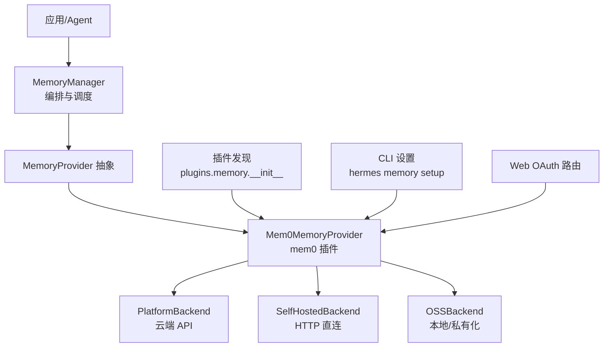
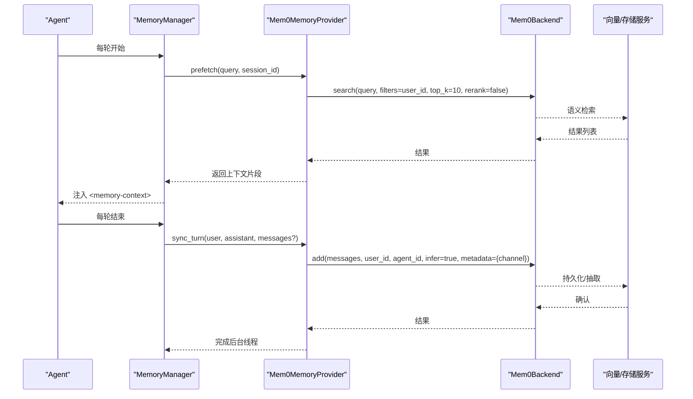
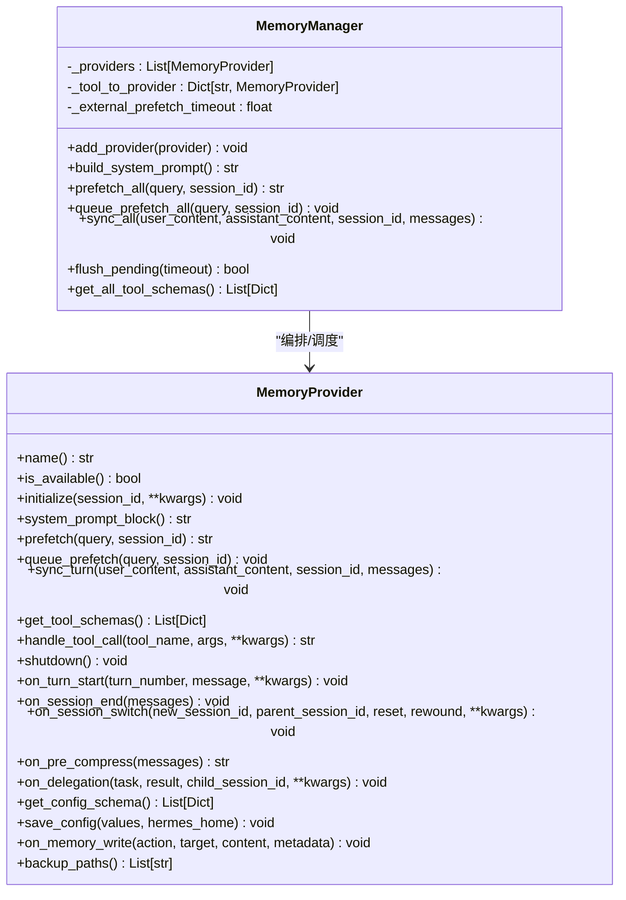
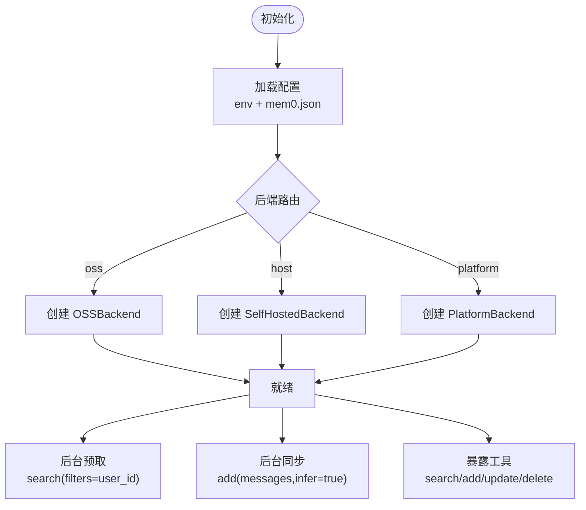
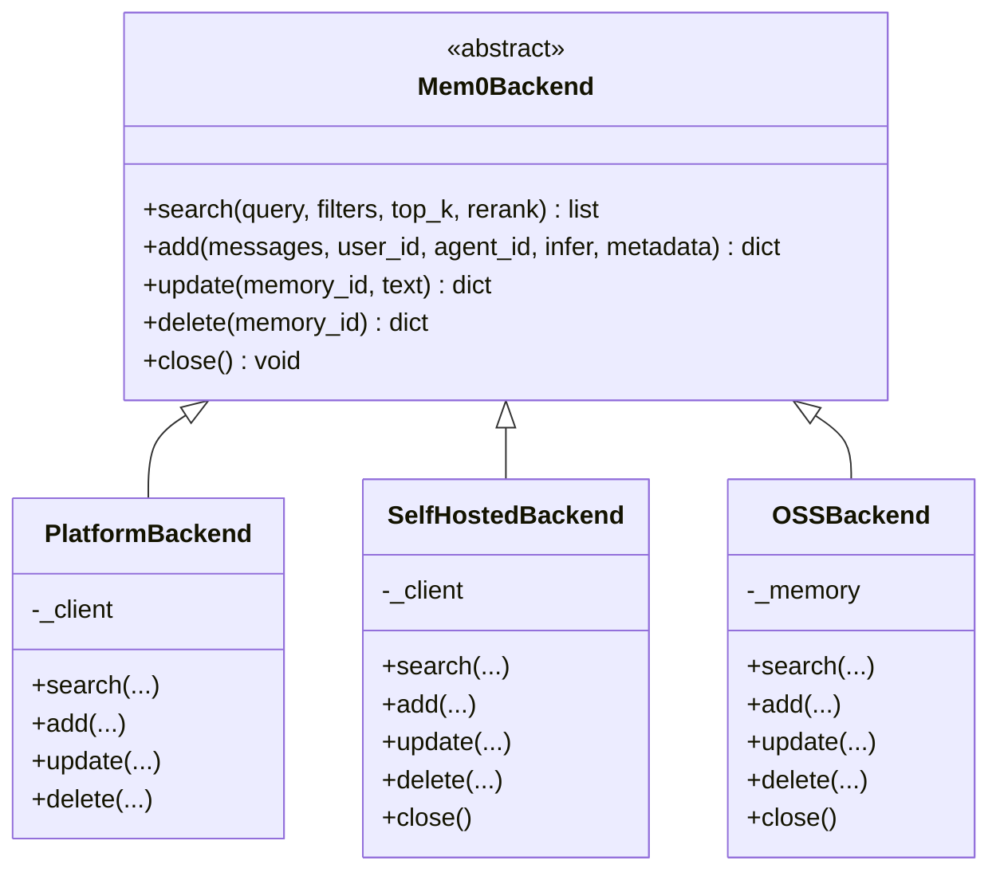
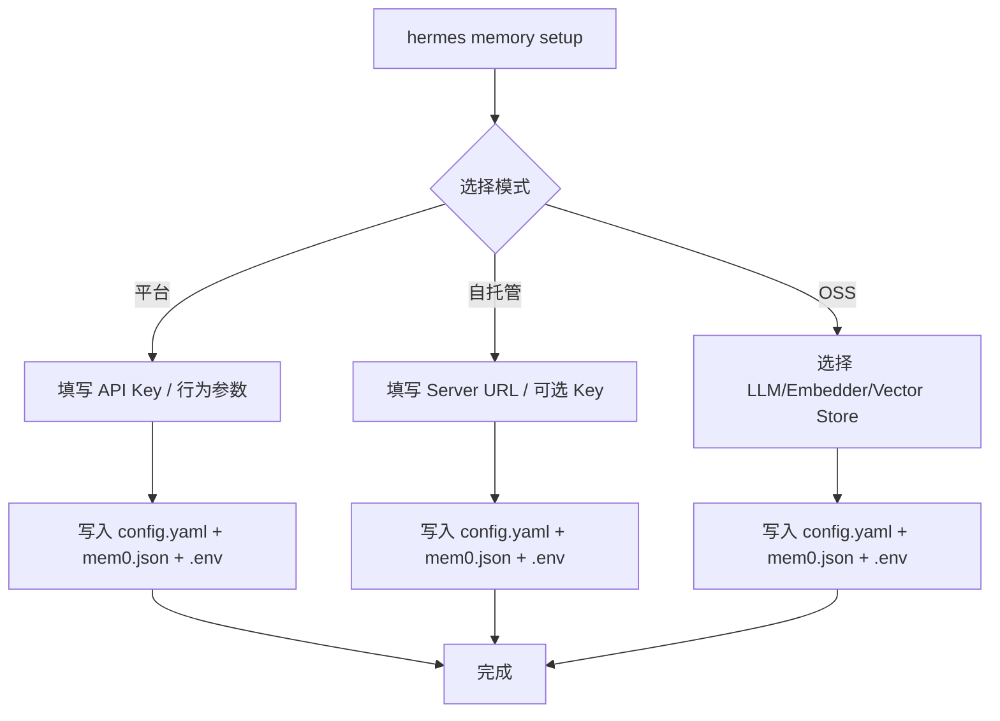
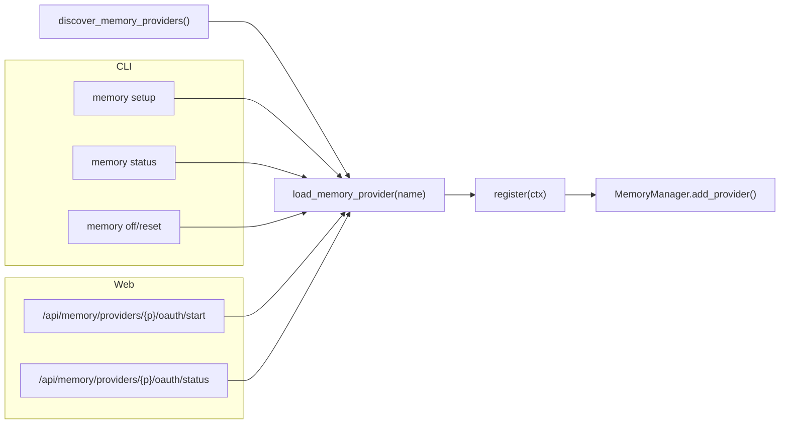
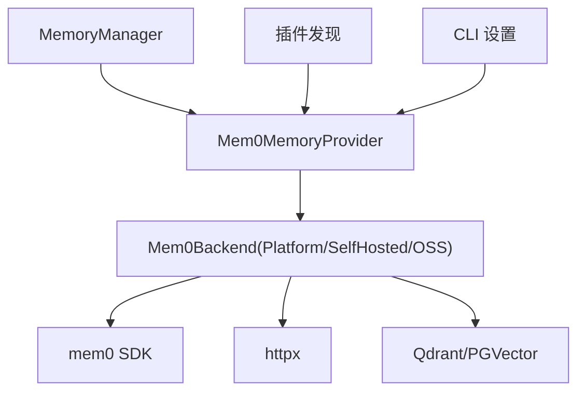

# Mem0 记忆后端

<cite>
**本文引用的文件**
- [memory_provider.py](file://agent/memory_provider.py)
- [memory_manager.py](file://agent/memory_manager.py)
- [__init__.py（插件发现）](file://plugins/memory/__init__.py)
- [mem0 插件主实现](file://plugins/memory/mem0/__init__.py)
- [mem0 后端抽象与实现](file://plugins/memory/mem0/_backend.py)
- [mem0 配置与安装向导](file://plugins/memory/mem0/_setup.py)
- [mem0 OSS 提供者定义](file://plugins/memory/mem0/_oss_providers.py)
- [记忆设置 CLI](file://hermes_cli/memory_setup.py)
- [记忆子命令解析器](file://hermes_cli/subcommands/memory.py)
- [记忆 OAuth 路由](file://hermes_cli/memory_oauth.py)
</cite>

## 目录
1. [简介](#简介)
2. [项目结构](#项目结构)
3. [核心组件](#核心组件)
4. [架构总览](#架构总览)
5. [详细组件分析](#详细组件分析)
6. [依赖关系分析](#依赖关系分析)
7. [性能考虑](#性能考虑)
8. [故障排查指南](#故障排查指南)
9. [结论](#结论)
10. [附录](#附录)

## 简介
本文件面向 Mem0 记忆后端的集成与使用，系统性说明其在 Hermes Agent 中的架构设计、配置流程、运行时行为、工具接口、部署与高可用要点、性能调优以及监控日志。Mem0 作为可插拔的外部记忆提供者，支持三种运行模式：
- Platform（云端 API）：通过 MemoryClient 调用 Mem0 平台服务，具备服务端抽取与可选重排序能力。
- Self-hosted（HTTP 直连）：直接访问自托管的 Mem0 FastAPI 服务器，使用 X-API-Key 鉴权。
- OSS（本地/私有化）：基于 mem0.Memory 与向量存储（Qdrant/PGVector），LLM/Embedder 可本地或远程。

系统通过统一的 MemoryProvider 抽象与 MemoryManager 编排，确保仅有一个外部记忆提供者同时生效，并在每个对话轮次进行异步预取与同步持久化，提供语义检索、版本控制（更新/删除）、以及跨会话的记忆聚合。

## 项目结构
围绕 Mem0 的关键代码分布在以下位置：
- 抽象与编排层：MemoryProvider 抽象、MemoryManager 编排、工具注入与上下文清洗。
- 插件发现与加载：扫描内置与用户安装的 memory 插件，按名称选择并实例化。
- Mem0 插件实现：提供三种后端适配、工具定义、配置读取、后台线程与熔断保护。
- 配置与安装向导：交互式/命令行方式完成 Provider 选择、依赖安装、环境变量写入与配置文件保存。
- CLI 与 Web 集成：记忆子命令、OAuth 连接路由等。

图表来源
- [memory_manager.py:364-470](file://agent/memory_manager.py#L364-L470)
- [memory_provider.py:81-192](file://agent/memory_provider.py#L81-L192)
- [mem0 插件主实现:194-629](file://plugins/memory/mem0/__init__.py#L194-L629)
- [mem0 后端抽象与实现:9-316](file://plugins/memory/mem0/_backend.py#L9-L316)
- [插件发现:1-462](file://plugins/memory/__init__.py#L1-L462)
- [记忆设置 CLI:245-425](file://hermes_cli/memory_setup.py#L245-L425)
- [记忆 OAuth 路由:18-84](file://hermes_cli/memory_oauth.py#L18-L84)

章节来源
- [memory_provider.py:1-358](file://agent/memory_provider.py#L1-L358)
- [memory_manager.py:1-800](file://agent/memory_manager.py#L1-L800)
- [__init__.py（插件发现）:1-462](file://plugins/memory/__init__.py#L1-L462)
- [mem0 插件主实现:1-629](file://plugins/memory/mem0/__init__.py#L1-L629)
- [mem0 后端抽象与实现:1-316](file://plugins/memory/mem0/_backend.py#L1-L316)
- [mem0 配置与安装向导:1-800](file://plugins/memory/mem0/_setup.py#L1-L800)
- [mem0 OSS 提供者定义:1-89](file://plugins/memory/mem0/_oss_providers.py#L1-L89)
- [记忆设置 CLI:1-579](file://hermes_cli/memory_setup.py#L1-L579)
- [记忆子命令解析器:1-54](file://hermes_cli/subcommands/memory.py#L1-L54)
- [记忆 OAuth 路由:1-84](file://hermes_cli/memory_oauth.py#L1-L84)

## 核心组件
- MemoryProvider 抽象：定义生命周期方法（initialize/system_prompt_block/prefetch/sync_turn/get_tool_schemas/handle_tool_call/shutdown）及可选钩子（on_turn_start/on_session_end/on_session_switch/on_pre_compress/on_delegation）。
- MemoryManager：注册唯一外部提供者；统一收集系统提示块；在每个 turn 前执行 prefetch_all（含超时与并发保护）；在 turn 后执行 sync_all（后台串行化写入）；注入工具 schema 并处理冲突。
- Mem0MemoryProvider：实现三种后端路由；提供 mem0_search/add/update/delete 工具；后台线程做 prefetch 与 sync；熔断器避免雪崩；user_id/agent_id/channel 元数据标注。
- 后端抽象 Mem0Backend：统一 search/add/update/delete/close 接口；PlatformBackend/SelfHostedBackend/OSSBackend 分别封装 SDK 或 HTTP 客户端。
- 插件发现与 CLI：自动扫描 plugins/memory 与用户目录；交互式或命令行完成 provider 选择、依赖安装、环境变量与配置文件写入；支持 OAuth 启动与状态查询。

章节来源
- [memory_provider.py:81-358](file://agent/memory_provider.py#L81-L358)
- [memory_manager.py:364-800](file://agent/memory_manager.py#L364-L800)
- [mem0 插件主实现:194-629](file://plugins/memory/mem0/__init__.py#L194-L629)
- [mem0 后端抽象与实现:9-316](file://plugins/memory/mem0/_backend.py#L9-L316)
- [__init__.py（插件发现）:146-462](file://plugins/memory/__init__.py#L146-L462)
- [记忆设置 CLI:245-579](file://hermes_cli/memory_setup.py#L245-L579)

## 架构总览
下图展示从 Agent 到 Mem0 后端的完整调用链，包括预取、同步、工具调用与后端路由。

图表来源
- [memory_manager.py:525-694](file://agent/memory_manager.py#L525-L694)
- [mem0 插件主实现:414-512](file://plugins/memory/mem0/__init__.py#L414-L512)
- [mem0 后端抽象与实现:49-147](file://plugins/memory/mem0/_backend.py#L49-L147)

## 详细组件分析

### 抽象与编排：MemoryProvider 与 MemoryManager
- 生命周期与钩子：provider 负责连接、预热、系统提示、预取、同步、工具暴露与关闭；可选钩子用于会话边界事件、压缩前提取、委派观察等。
- 单外部提供者约束：MemoryManager 仅允许一个非内置 provider，避免工具 schema 膨胀与后端冲突。
- 预取与同步：prefetch_all 对每个 provider 并行调用，外部 provider 使用独立线程并带超时；sync_all 通过单工作线程串行化写入，保证顺序且不影响主循环。
- 工具注入与冲突：normalize_tool_schema 兼容不同形状的工具定义；核心工具名保留优先，避免被覆盖。

图表来源
- [memory_provider.py:81-358](file://agent/memory_provider.py#L81-L358)
- [memory_manager.py:364-800](file://agent/memory_manager.py#L364-L800)

章节来源
- [memory_provider.py:81-358](file://agent/memory_provider.py#L81-L358)
- [memory_manager.py:364-800](file://agent/memory_manager.py#L364-L800)

### Mem0 插件：Mem0MemoryProvider
- 配置加载：从环境变量与 $HERMES_HOME/mem0.json 合并读取；mode/host/api_key/user_id/agent_id/rerank 等关键项。
- 后端路由：优先级 oss > host > platform；根据配置动态创建对应后端实例。
- 预取策略：后台线程搜索，短等待热路径；失败记录并触发熔断器；成功则缓存供当前轮次消费。
- 同步策略：后台线程将对话消息提交给后端进行服务端抽取（云端为异步队列，本地/自托管为同步）。
- 工具集：mem0_search（支持 top_k、rerank）、mem0_add（verbatim 存储）、mem0_update（按 ID 替换）、mem0_delete（按 ID 删除）。
- 身份与元数据：user_id 优先采用操作者配置，否则回退到网关原生 id；metadata.channel 标记来源渠道。

图表来源
- [mem0 插件主实现:78-111](file://plugins/memory/mem0/__init__.py#L78-L111)
- [mem0 插件主实现:267-293](file://plugins/memory/mem0/__init__.py#L267-L293)
- [mem0 插件主实现:414-512](file://plugins/memory/mem0/__init__.py#L414-L512)
- [mem0 插件主实现:514-609](file://plugins/memory/mem0/__init__.py#L514-L609)

章节来源
- [mem0 插件主实现:1-629](file://plugins/memory/mem0/__init__.py#L1-L629)

### 后端抽象与实现：Mem0Backend
- 统一接口：search/add/update/delete/close。
- PlatformBackend：封装 MemoryClient，调用云端 API。
- SelfHostedBackend：httpx.Client 直连自托管服务器，使用 X-API-Key 头；/search 与 /memories 路由。
- OSSBackend：封装 mem0.Memory，支持 Qdrant/PGVector；当嵌入维度变化时自动重建集合；关闭时释放资源。

图表来源
- [mem0 后端抽象与实现:9-316](file://plugins/memory/mem0/_backend.py#L9-L316)

章节来源
- [mem0 后端抽象与实现:1-316](file://plugins/memory/mem0/_backend.py#L1-L316)

### 配置与安装向导
- 交互式/命令行：支持选择 provider、安装依赖、写入 .env 与 mem0.json、激活 provider。
- 平台模式：引导输入 API key、user_id、agent_id、rerank；清理 host 字段以避免误路由。
- 自托管模式：引导输入 server URL、可选 API key、user_id、agent_id；检查可达性。
- OSS 模式：选择 LLM/Embedder/Vector Store；自动拉起 pgvector 容器或 Ollama；生成配置并校验。

图表来源
- [记忆设置 CLI:245-425](file://hermes_cli/memory_setup.py#L245-L425)
- [mem0 配置与安装向导:234-494](file://plugins/memory/mem0/_setup.py#L234-L494)
- [mem0 配置与安装向导:441-800](file://plugins/memory/mem0/_setup.py#L441-L800)

章节来源
- [记忆设置 CLI:245-579](file://hermes_cli/memory_setup.py#L245-L579)
- [mem0 配置与安装向导:1-800](file://plugins/memory/mem0/_setup.py#L1-L800)

### 插件发现与 CLI 集成
- 插件发现：扫描内置与用户目录，按名称去重（内置优先），加载 __init__.py 并实例化 provider。
- CLI 子命令：提供 memory setup/status/off/reset 等子命令；支持直接指定 provider 跳过选择。
- OAuth 路由：/api/memory/providers/{provider}/oauth/start 与 status，按约定导入 provider 的 oauth_flow 模块。

图表来源
- [__init__.py（插件发现）:146-462](file://plugins/memory/__init__.py#L146-L462)
- [记忆子命令解析器:12-54](file://hermes_cli/subcommands/memory.py#L12-L54)
- [记忆 OAuth 路由:18-84](file://hermes_cli/memory_oauth.py#L18-L84)

章节来源
- [__init__.py（插件发现）:1-462](file://plugins/memory/__init__.py#L1-L462)
- [记忆子命令解析器:1-54](file://hermes_cli/subcommands/memory.py#L1-L54)
- [记忆 OAuth 路由:1-84](file://hermes_cli/memory_oauth.py#L1-L84)

## 依赖关系分析
- 内部依赖：
  - MemoryManager 依赖 MemoryProvider 抽象，管理工具 schema 注入与冲突。
  - Mem0MemoryProvider 依赖 _backend 模块与 _setup 模块，按需懒加载依赖。
  - 插件发现模块依赖 hermes_cli.config 与 hermes_constants。
- 外部依赖：
  - PlatformBackend 依赖 mem0.MemoryClient。
  - SelfHostedBackend 依赖 httpx。
  - OSSBackend 依赖 mem0.Memory 及向量存储客户端（qdrant-client/psycopg2-binary）。
  - 安装向导可能调用 Docker、Ollama、pgvector 等外部服务。

图表来源
- [memory_manager.py:364-800](file://agent/memory_manager.py#L364-L800)
- [mem0 插件主实现:267-293](file://plugins/memory/mem0/__init__.py#L267-L293)
- [mem0 后端抽象与实现:49-316](file://plugins/memory/mem0/_backend.py#L49-L316)
- [__init__.py（插件发现）:146-462](file://plugins/memory/__init__.py#L146-L462)
- [记忆设置 CLI:107-187](file://hermes_cli/memory_setup.py#L107-L187)

章节来源
- [memory_manager.py:364-800](file://agent/memory_manager.py#L364-L800)
- [mem0 插件主实现:267-293](file://plugins/memory/mem0/__init__.py#L267-L293)
- [mem0 后端抽象与实现:49-316](file://plugins/memory/mem0/_backend.py#L49-L316)
- [__init__.py（插件发现）:146-462](file://plugins/memory/__init__.py#L146-L462)
- [记忆设置 CLI:107-187](file://hermes_cli/memory_setup.py#L107-L187)

## 性能考虑
- 预取超时与并发控制：外部 provider 的 prefetch 使用独立线程并限制超时，避免阻塞主循环；同一 provider 重复查询会跳过已运行的任务。
- 写入串行化：sync_all 通过单工作线程串行化，保证 turn N 先于 turn N+1 落地，避免乱序。
- 熔断器：连续失败达到阈值后暂停 API 调用一段时间，降低雪崩风险；成功调用重置计数器。
- 连接池与重试：SelfHostedBackend 使用 httpx.HTTPTransport(retries=2) 平滑瞬时抖动；OSSBackend 在 close 时释放资源。
- 内存与线程：后台线程为 daemon，进程退出时不会阻塞；必要时 flush_pending 等待队列排空。
- 查询优化：mem0_search 支持 top_k 限制与 rerank（平台模式）；filters 限定 user_id，减少无关结果。

章节来源
- [memory_manager.py:547-595](file://agent/memory_manager.py#L547-L595)
- [memory_manager.py:638-757](file://agent/memory_manager.py#L638-L757)
- [mem0 插件主实现:294-335](file://plugins/memory/mem0/__init__.py#L294-L335)
- [mem0 后端抽象与实现:94-108](file://plugins/memory/mem0/_backend.py#L94-L108)
- [mem0 后端抽象与实现:298-316](file://plugins/memory/mem0/_backend.py#L298-L316)

## 故障排查指南
- 无法找到 provider：确认 plugins/memory 或用户目录下存在有效 __init__.py，且包含 register_memory_provider 或 MemoryProvider 子类。
- 配置未生效：检查 config.yaml 中 memory.provider；确认 mem0.json 与 .env 正确写入；注意 MEM0_HOST 会覆盖平台模式。
- 连接失败：
  - 平台模式：确认 MEM0_API_KEY 有效。
  - 自托管模式：确认 server URL 可达，X-API-Key 正确（若启用鉴权）。
  - OSS 模式：确认向量存储（Qdrant/PGVector）与 LLM/Embedder 可达；必要时使用向导自动拉起 pgvector 或 Ollama。
- 工具不可用：确认 memory toolsets 未被禁用；检查工具名是否被核心工具覆盖。
- 预取/同步失败：查看日志中的 provider 名称与错误信息；熔断器触发时会提示冷却时间；检查网络与后端服务状态。
- OAuth 问题：确认 provider 实现了 oauth_flow 模块；通过 /api/memory/providers/{provider}/oauth/start 与 status 跟踪流程。

章节来源
- [__init__.py（插件发现）:74-121](file://plugins/memory/__init__.py#L74-L121)
- [mem0 插件主实现:227-235](file://plugins/memory/mem0/__init__.py#L227-L235)
- [mem0 插件主实现:294-335](file://plugins/memory/mem0/__init__.py#L294-L335)
- [mem0 后端抽象与实现:94-153](file://plugins/memory/mem0/_backend.py#L94-L153)
- [记忆设置 CLI:478-559](file://hermes_cli/memory_setup.py#L478-L559)
- [记忆 OAuth 路由:21-84](file://hermes_cli/memory_oauth.py#L21-L84)

## 结论
Mem0 记忆后端通过清晰的抽象与编排，提供了稳定、可扩展、高性能的记忆能力。其支持云端、自托管与本地化三种模式，配合插件系统与 CLI 向导，简化了配置与运维。通过预取与异步同步、熔断保护与连接重试，系统在可用性、一致性与性能之间取得良好平衡。结合监控与日志，开发者可有效跟踪状态并快速定位问题。

## 附录

### 配置选项速查
- 环境变量（敏感）：
  - MEM0_API_KEY：Mem0 平台 API Key（平台模式必需）。
  - MEM0_HOST：自托管 Mem0 服务器地址（覆盖平台模式）。
  - MEM0_USER_ID：统一用户标识（可选，默认回退网关原生 id）。
  - MEM0_AGENT_ID：代理标识（默认 hermes）。
- 行为配置（$HERMES_HOME/mem0.json）：
  - mode：platform/oss（oss 需 vector_store）。
  - host：自托管服务器 URL。
  - user_id/agent_id：同上。
  - rerank：是否启用重排序（平台模式）。
  - oss：{ llm, embedder, vector_store } 三段配置。

章节来源
- [mem0 插件主实现:78-111](file://plugins/memory/mem0/__init__.py#L78-L111)
- [mem0 插件主实现:251-261](file://plugins/memory/mem0/__init__.py#L251-L261)
- [mem0 配置与安装向导:128-188](file://plugins/memory/mem0/_setup.py#L128-L188)
- [mem0 OSS 提供者定义:8-64](file://plugins/memory/mem0/_oss_providers.py#L8-L64)

### 使用示例（步骤指引）
- 建立连接：
  - 运行 hermes memory setup，选择 provider（mem0），按向导完成配置。
  - 或通过 flags 直接配置（如 --mode oss --oss-vector qdrant ...）。
- 执行记忆操作：
  - 在对话中使用模型工具：mem0_search、mem0_add、mem0_update、mem0_delete。
  - 或在后台通过 sync_turn 自动持久化对话内容。
- 处理异步任务：
  - 预取与同步均在后台线程执行；可通过 flush_pending 等待队列排空（测试或边界场景）。

章节来源
- [记忆设置 CLI:245-425](file://hermes_cli/memory_setup.py#L245-L425)
- [mem0 插件主实现:514-609](file://plugins/memory/mem0/__init__.py#L514-L609)
- [memory_manager.py:759-780](file://agent/memory_manager.py#L759-L780)

### 部署与高可用建议
- 本地部署：
  - 使用 OSS 模式，选择 Qdrant（本地文件）或 PGVector（Docker 拉起）。
  - 使用向导自动拉取模型与依赖，减少手动配置。
- 云服务集成：
  - 平台模式：仅需配置 API Key；利用服务端抽取与可选重排序。
  - 自托管模式：部署 Mem0 FastAPI 服务器，配置 X-API-Key 鉴权。
- 高可用：
  - 合理设置预取超时与熔断冷却时间，避免级联失败。
  - 向量存储建议使用有副本/备份能力的方案（如远程 Qdrant/PG）。
  - 定期备份 mem0.json 与 .env，并使用 hermes backup/import 管理外部路径。

章节来源
- [mem0 配置与安装向导:345-494](file://plugins/memory/mem0/_setup.py#L345-L494)
- [mem0 配置与安装向导:441-800](file://plugins/memory/mem0/_setup.py#L441-L800)
- [memory_provider.py:341-358](file://agent/memory_provider.py#L341-L358)

### 监控与日志
- 日志位置：Python 标准 logging，关注 memory_manager 与 mem0 插件相关日志。
- 关键指标：
  - 预取耗时与超时次数。
  - 同步失败率与熔断器触发次数。
  - 后端连接错误（连接拒绝/超时/404）。
- 诊断步骤：
  - 检查 is_available 返回值与 get_status_config（如有）。
  - 验证 OAuth 流程状态（/api/memory/providers/{provider}/oauth/status）。
  - 核对配置优先级（env > mem0.json > 默认值）。

章节来源
- [memory_manager.py:486-503](file://agent/memory_manager.py#L486-L503)
- [mem0 插件主实现:294-335](file://plugins/memory/mem0/__init__.py#L294-L335)
- [记忆 OAuth 路由:57-84](file://hermes_cli/memory_oauth.py#L57-L84)