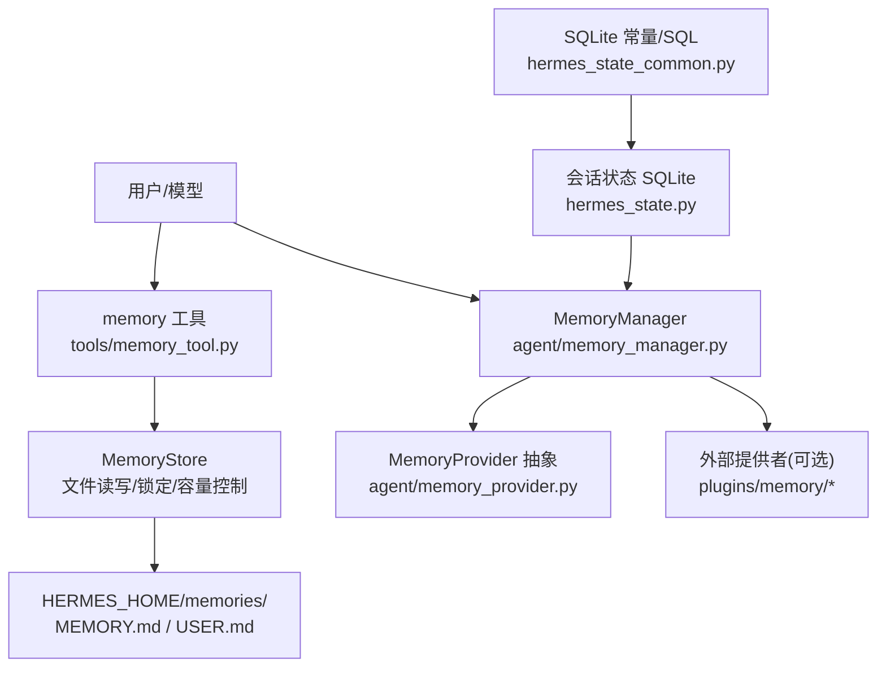
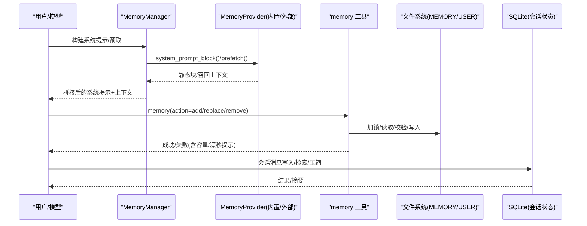
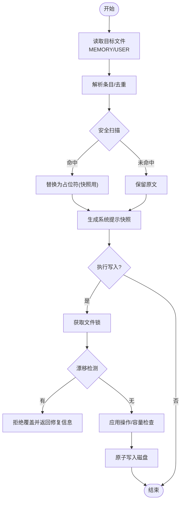
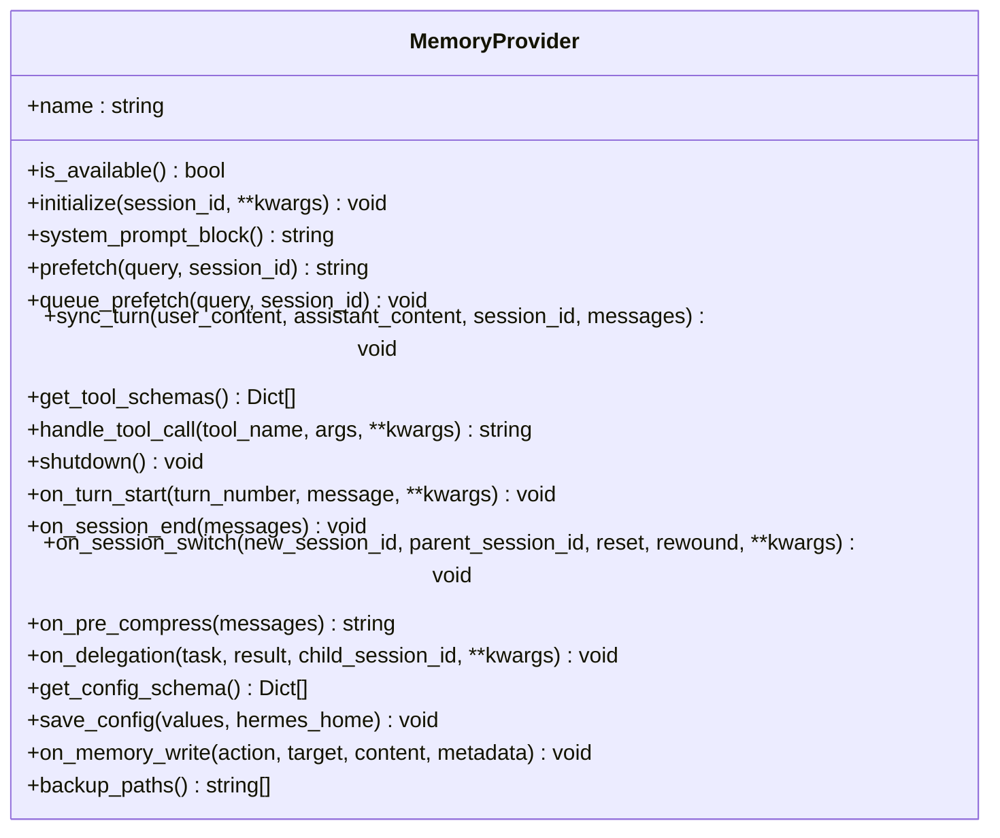
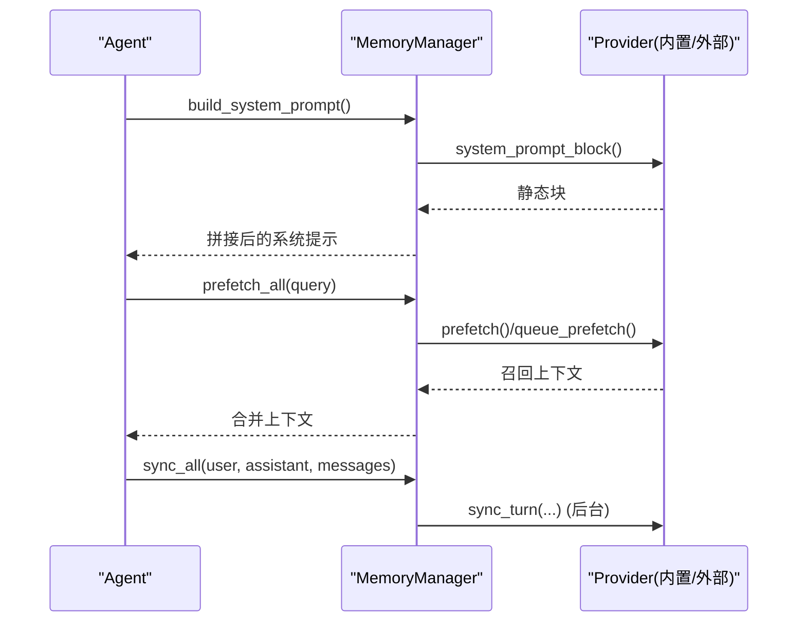
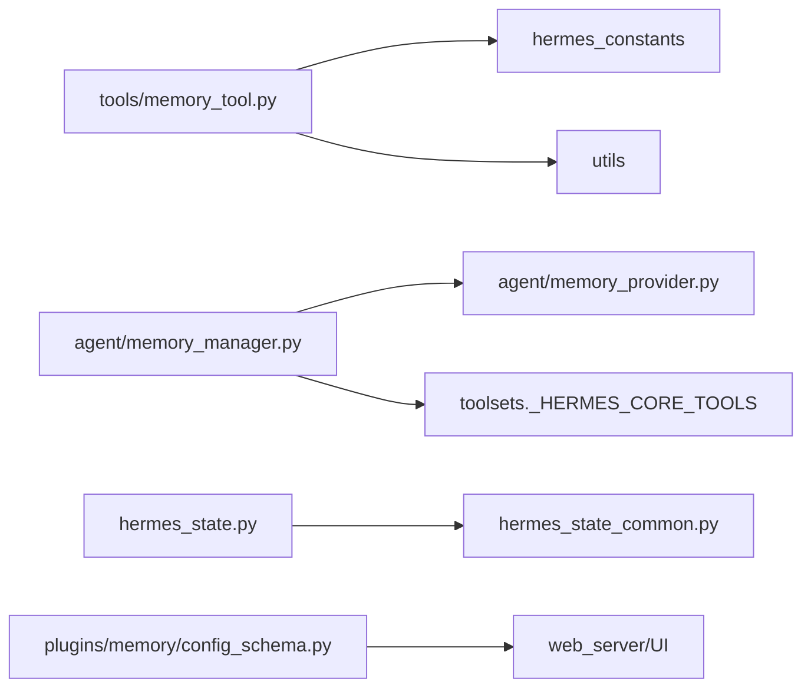

# 内置记忆存储

<cite>
**本文引用的文件**
- [tools/memory_tool.py](file://tools/memory_tool.py)
- [agent/memory_provider.py](file://agent/memory_provider.py)
- [agent/memory_manager.py](file://agent/memory_manager.py)
- [hermes_state.py](file://hermes_state.py)
- [hermes_state_common.py](file://hermes_state_common.py)
- [plugins/memory/config_schema.py](file://plugins/memory/config_schema.py)
</cite>

## 目录
1. [简介](#简介)
2. [项目结构](#项目结构)
3. [核心组件](#核心组件)
4. [架构总览](#架构总览)
5. [详细组件分析](#详细组件分析)
6. [依赖关系分析](#依赖关系分析)
7. [性能考虑](#性能考虑)
8. [故障排查指南](#故障排查指南)
9. [结论](#结论)
10. [附录](#附录)

## 简介
本文件系统性说明 Hermes Agent 的“内置记忆存储”能力：以文件为持久化载体（MEMORY.md、USER.md），在会话启动时冻结快照注入系统提示，并在会话期间通过工具进行增删改查；同时提供与外部记忆插件的统一编排接口。文档覆盖多层设计（文件系统、内存缓存、SQLite 会话状态）、数据结构、配置方法、工具用法、自动压缩与优化机制、备份恢复以及性能优化建议。

## 项目结构
内置记忆由以下关键部分构成：
- 工具层：统一的 memory 工具，封装 add/replace/remove/batch 操作，负责文件读写、冲突检测、容量控制与安全扫描。
- 提供者抽象：MemoryProvider 定义统一生命周期与工具暴露方式，便于接入外部记忆后端。
- 编排器：MemoryManager 统一管理内置与至多一个外部提供者，协调系统提示、预取、同步与工具路由。
- 会话状态：SQLite 持久化会话消息、元数据与全文检索索引，支撑上下文压缩与历史管理。
- 配置模式：声明式 provider 配置 schema，驱动 UI 与 Web API 完成设置。

图表来源
- [tools/memory_tool.py:148-800](file://tools/memory_tool.py#L148-L800)
- [agent/memory_manager.py:364-800](file://agent/memory_manager.py#L364-L800)
- [agent/memory_provider.py:81-358](file://agent/memory_provider.py#L81-L358)
- [hermes_state.py:1-200](file://hermes_state.py#L1-L200)
- [hermes_state_common.py:170-200](file://hermes_state_common.py#L170-L200)

章节来源
- [tools/memory_tool.py:148-800](file://tools/memory_tool.py#L148-L800)
- [agent/memory_manager.py:364-800](file://agent/memory_manager.py#L364-L800)
- [agent/memory_provider.py:81-358](file://agent/memory_provider.py#L81-L358)
- [hermes_state.py:1-200](file://hermes_state.py#L1-L200)
- [hermes_state_common.py:170-200](file://hermes_state_common.py#L170-L200)

## 核心组件
- MemoryStore（内置记忆）
  - 双目标存储：MEMORY.md（个人笔记/观察）、USER.md（用户画像/偏好）。
  - 会话级冻结快照：加载时生成系统提示块，会话内不变更，保证前缀缓存稳定。
  - 原子写入与并发安全：使用 .lock 文件锁 + 原子替换，避免并发写破坏。
  - 容量限制与合并引导：按字符数限制，超限返回合并建议并限制每轮重试次数。
  - 内容安全扫描：严格模式威胁检测，阻止注入/泄露。
  - 外部漂移保护：检测到非解析格式或条目过大时拒绝覆盖并给出修复指引。
- MemoryProvider（提供者抽象）
  - 统一生命周期：initialize、system_prompt_block、prefetch、sync_turn、get_tool_schemas、handle_tool_call、shutdown。
  - 可选钩子：on_turn_start、on_session_end、on_session_switch、on_pre_compress、on_delegation、backup_paths。
  - 配置描述：get_config_schema/save_config 支持声明式配置与保存。
- MemoryManager（编排器）
  - 仅允许一个外部提供者，内置提供者始终优先。
  - 系统提示拼装、跨提供者预取聚合、回合后异步同步。
  - 工具路由：收集并注入外部提供者工具，过滤保留核心工具名。
  - 后台任务：单工作线程序列化写入，超时保护与优雅关闭。
- SQLite 会话状态
  - WAL 模式、FTS5 全文检索、会话拆分链（parent_session_id）。
  - 安全上限：最大可恢复/导出消息数，防止超大上下文导致崩溃。
- 配置模式
  - 声明式 Provider 字段类型、存储位置、是否密钥、分组与帮助文本。
  - 通过 Web API 与桌面 UI 渲染通用配置面板。

章节来源
- [tools/memory_tool.py:148-800](file://tools/memory_tool.py#L148-L800)
- [agent/memory_provider.py:81-358](file://agent/memory_provider.py#L81-L358)
- [agent/memory_manager.py:364-800](file://agent/memory_manager.py#L364-L800)
- [hermes_state.py:1-200](file://hermes_state.py#L1-L200)
- [hermes_state_common.py:170-200](file://hermes_state_common.py#L170-L200)
- [plugins/memory/config_schema.py:1-145](file://plugins/memory/config_schema.py#L1-L145)

## 架构总览
内置记忆采用“文件持久化 + 内存快照 + 会话状态 SQLite”的分层设计：
- 文件系统层：MEMORY.md/USER.md 作为事实源，提供强一致性与可移植性。
- 内存缓存层：会话启动时读取并生成冻结快照，用于系统提示注入；工具操作直接更新内存与磁盘。
- 会话状态层：SQLite 记录会话消息与元数据，配合 FTS5 实现快速检索与上下文压缩。
- 编排层：MemoryManager 将内置与外部提供者统一接入，屏蔽差异，保障稳定性与可扩展性。

图表来源
- [agent/memory_manager.py:486-595](file://agent/memory_manager.py#L486-L595)
- [tools/memory_tool.py:390-670](file://tools/memory_tool.py#L390-L670)
- [hermes_state.py:1-200](file://hermes_state.py#L1-L200)

## 详细组件分析

### 内置记忆存储（MemoryStore）
- 数据结构
  - memory_entries/user_entries：列表形式存储条目，去重保持顺序。
  - _system_prompt_snapshot：会话启动时生成的只读快照，用于系统提示注入。
  - 容量限制：memory_char_limit/user_char_limit，按字符计数而非 token。
- 关键流程
  - 加载：从 MEMORY.md/USER.md 读取、去重、安全扫描、渲染系统提示块。
  - 写入：add/replace/remove/batch，带文件锁、漂移检测、容量检查、批量原子提交。
  - 快照：format_for_system_prompt 返回冻结快照，确保会话内稳定。
- 并发与一致性
  - 使用 .lock 文件锁，结合原子替换，避免并发写导致的损坏。
  - 外部漂移保护：当文件包含无法 round-trip 的内容时拒绝覆盖，并提供备份路径与修复建议。
- 安全
  - 严格模式威胁扫描，阻止注入/泄露；加载时对命中项替换为占位符，但保留原始以便用户清理。

图表来源
- [tools/memory_tool.py:203-241](file://tools/memory_tool.py#L203-L241)
- [tools/memory_tool.py:322-367](file://tools/memory_tool.py#L322-L367)
- [tools/memory_tool.py:390-670](file://tools/memory_tool.py#L390-L670)

章节来源
- [tools/memory_tool.py:148-800](file://tools/memory_tool.py#L148-L800)

### 记忆提供者抽象（MemoryProvider）
- 职责
  - 定义统一生命周期：初始化、系统提示块、预取、回合同步、工具暴露、关闭。
  - 可选钩子：会话切换、压缩前提取、委派观察、备份路径等。
  - 配置描述：声明式字段与保存逻辑，适配 Web/UI。
- 约束
  - 仅允许一个外部提供者，避免工具膨胀与冲突。
  - 工具名称不得与核心工具冲突，否则被忽略。

图表来源
- [agent/memory_provider.py:81-358](file://agent/memory_provider.py#L81-L358)

章节来源
- [agent/memory_provider.py:81-358](file://agent/memory_provider.py#L81-L358)

### 记忆编排器（MemoryManager）
- 功能
  - 注册内置与至多一个外部提供者，维护工具路由表。
  - 构建系统提示块，聚合各提供者预取上下文。
  - 回合后异步同步，单工作线程序列化写入，避免阻塞主循环。
  - 注入外部提供者工具到模型工具集，过滤保留核心工具名。
- 健壮性
  - 外部预取超时保护，避免慢提供者卡住对话。
  - 关闭时等待后台任务耗尽，报告丢弃的任务数量。

图表来源
- [agent/memory_manager.py:486-695](file://agent/memory_manager.py#L486-L695)

章节来源
- [agent/memory_manager.py:364-800](file://agent/memory_manager.py#L364-L800)

### SQLite 会话状态（hermes_state）
- 特性
  - WAL 模式提升并发读性能。
  - FTS5 全文检索加速跨会话消息搜索。
  - 会话拆分链（parent_session_id）支持压缩触发与历史管理。
  - 安全上限：最大可恢复/导出消息数，防止超大上下文。
- 与记忆的关系
  - 会话压缩前可调用 on_pre_compress 钩子，让记忆提供者提取要点，避免重要信息丢失。

章节来源
- [hermes_state.py:1-200](file://hermes_state.py#L1-L200)
- [hermes_state_common.py:170-200](file://hermes_state_common.py#L170-L200)

### 配置模式（plugins/memory/config_schema.py）
- 作用
  - 声明 provider 的可配置字段、类型、默认值、是否密钥、分组与帮助文本。
  - 通过 Web API 与桌面 UI 渲染通用配置面板，无需定制组件。
- 存储
  - 支持 flat_json 与特定 host-block 存储，根据 provider 选择。

章节来源
- [plugins/memory/config_schema.py:1-145](file://plugins/memory/config_schema.py#L1-L145)

## 依赖关系分析
- tools/memory_tool.py 依赖 hermes_constants 获取 HERMES_HOME，依赖 utils 进行原子写入。
- agent/memory_manager.py 依赖 agent/memory_provider.py 抽象，依赖 toolsets 核心工具名集合。
- hermes_state.py 依赖 hermes_state_common 中的 SQL 常量与版本信息。
- plugins/memory/config_schema.py 提供纯数据声明，供 web_server 与 UI 消费。

图表来源
- [tools/memory_tool.py:31-35](file://tools/memory_tool.py#L31-L35)
- [agent/memory_manager.py:437-456](file://agent/memory_manager.py#L437-L456)
- [hermes_state.py:48-78](file://hermes_state.py#L48-L78)
- [plugins/memory/config_schema.py:112-145](file://plugins/memory/config_schema.py#L112-L145)

章节来源
- [tools/memory_tool.py:31-35](file://tools/memory_tool.py#L31-L35)
- [agent/memory_manager.py:437-456](file://agent/memory_manager.py#L437-L456)
- [hermes_state.py:48-78](file://hermes_state.py#L48-L78)
- [plugins/memory/config_schema.py:112-145](file://plugins/memory/config_schema.py#L112-L145)

## 性能考虑
- 文件系统层
  - 使用 .lock 文件锁与原子替换，减少竞争与损坏风险。
  - 条目去重与字符计数限制，避免无限增长。
  - 外部漂移检测，避免覆盖不可逆内容。
- 内存层
  - 会话级冻结快照，避免系统提示频繁变化导致前缀缓存失效。
  - 预取与同步分离，外部预取超时保护，避免阻塞。
- SQLite 层
  - WAL 模式提升并发读性能。
  - FTS5 全文检索加速跨会话搜索。
  - 会话拆分链支持压缩，降低上下文大小。
- 建议
  - 合理设置 memory_char_limit/user_char_limit，定期合并冗余条目。
  - 使用 batch 操作一次性完成多条变更，减少往返与冲突。
  - 对大会话启用压缩，利用 on_pre_compress 钩子保留关键记忆。
  - 监控 SQLite 文件大小与 FTS5 索引健康，必要时优化存储。

[本节为通用指导，不直接分析具体文件]

## 故障排查指南
- 写入失败（容量超限）
  - 现象：返回当前用量与限制，提示合并或移除条目。
  - 处理：在同一轮中先 remove/replace 释放空间，再 retry add。
  - 参考路径：[tools/memory_tool.py:428-447](file://tools/memory_tool.py#L428-L447)
- 外部漂移保护
  - 现象：拒绝覆盖，返回 .bak 备份路径与修复建议。
  - 处理：手动整合 .bak 内容，重写为干净 § 分隔列表。
  - 参考路径：[tools/memory_tool.py:91-118](file://tools/memory_tool.py#L91-L118)
- 文件不可读
  - 现象：存在但无法读取（权限/编码/锁），拒绝写入以防丢失。
  - 处理：稍后重试或修复权限/编码。
  - 参考路径：[tools/memory_tool.py:128-145](file://tools/memory_tool.py#L128-L145)
- 预取超时
  - 现象：外部提供者预取超时，跳过该轮预取。
  - 处理：检查外部服务状态或调整超时。
  - 参考路径：[agent/memory_manager.py:547-595](file://agent/memory_manager.py#L547-L595)
- 会话过大
  - 现象：超过最大可恢复/导出消息数限制。
  - 处理：导出会话或调整配置上限。
  - 参考路径：[hermes_state.py:91-125](file://hermes_state.py#L91-L125)

章节来源
- [tools/memory_tool.py:91-145](file://tools/memory_tool.py#L91-L145)
- [tools/memory_tool.py:428-447](file://tools/memory_tool.py#L428-L447)
- [agent/memory_manager.py:547-595](file://agent/memory_manager.py#L547-L595)
- [hermes_state.py:91-125](file://hermes_state.py#L91-L125)

## 结论
Hermes 内置记忆以文件为可靠持久化载体，结合内存快照与 SQLite 会话状态，提供了安全、稳定且可扩展的记忆体系。通过统一提供者抽象与编排器，既能满足本地场景的快速迭代，也能无缝接入外部记忆后端。配合容量控制、漂移保护、安全扫描与压缩优化，可在大规模历史数据下保持良好性能与可靠性。

[本节为总结性内容，不直接分析具体文件]

## 附录

### 配置示例与启用
- 启用内置记忆
  - 无需额外配置，内置提供者始终可用。
  - 系统提示块会在会话启动时自动注入。
  - 参考路径：[agent/memory_manager.py:486-503](file://agent/memory_manager.py#L486-L503)
- 启用外部记忆提供者
  - 通过 memory.provider 配置指定单一外部提供者。
  - 使用 get_config_schema/save_config 完成声明式配置。
  - 参考路径：[agent/memory_manager.py:404-428](file://agent/memory_manager.py#L404-L428)
  - 参考路径：[agent/memory_provider.py:283-320](file://agent/memory_provider.py#L283-L320)
  - 参考路径：[plugins/memory/config_schema.py:94-107](file://plugins/memory/config_schema.py#L94-L107)

### 记忆工具用法
- 添加条目
  - action=add，content=新条目；自动去重与容量检查。
  - 参考路径：[tools/memory_tool.py:390-447](file://tools/memory_tool.py#L390-L447)
- 替换条目
  - action=replace，old_text=旧片段，new_content=新内容；模糊匹配首个匹配项。
  - 参考路径：[tools/memory_tool.py:449-518](file://tools/memory_tool.py#L449-L518)
- 删除条目
  - action=remove，old_text=旧片段；模糊匹配首个匹配项。
  - 参考路径：[tools/memory_tool.py:520-560](file://tools/memory_tool.py#L520-L560)
- 批量操作
  - action=batch，operations=[{action, content/old_text}]；原子提交，任一失败则全部回滚。
  - 参考路径：[tools/memory_tool.py:562-670](file://tools/memory_tool.py#L562-L670)

### 自动压缩与优化
- 压缩前钩子
  - 调用 on_pre_compress 提取即将被压缩的消息要点，确保记忆不丢失。
  - 参考路径：[agent/memory_provider.py:258-268](file://agent/memory_provider.py#L258-L268)
- 会话拆分
  - 通过 parent_session_id 链管理压缩产生的子会话，保持历史可追溯。
  - 参考路径：[hermes_state.py:1-200](file://hermes_state.py#L1-L200)

### 备份与恢复
- 外部提供者额外路径
  - 通过 backup_paths 声明不在 HERMES_HOME 下的存储路径，纳入 hermes backup/import。
  - 参考路径：[agent/memory_provider.py:341-357](file://agent/memory_provider.py#L341-L357)
- 内置记忆文件
  - MEMORY.md/USER.md 位于 HERMES_HOME/memories，随备份一起归档。
  - 参考路径：[tools/memory_tool.py:49-56](file://tools/memory_tool.py#L49-L56)

### 性能优化建议
- 索引策略
  - 使用 SQLite FTS5 进行全文检索，避免全表扫描。
  - 参考路径：[hermes_state.py:1-200](file://hermes_state.py#L1-L200)
- 查询优化
  - 限制查询长度，避免恶意输入导致性能问题。
  - 参考路径：[hermes_state_common.py:181-184](file://hermes_state_common.py#L181-L184)
- 存储空间管理
  - 定期合并冗余条目，控制字符限额，避免文件膨胀。
  - 参考路径：[tools/memory_tool.py:379-388](file://tools/memory_tool.py#L379-L388)