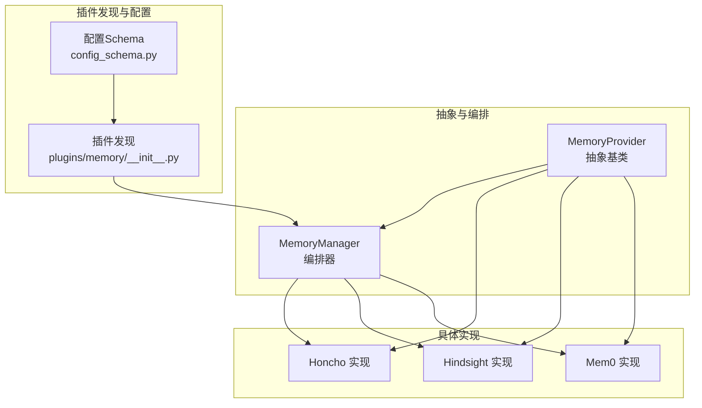
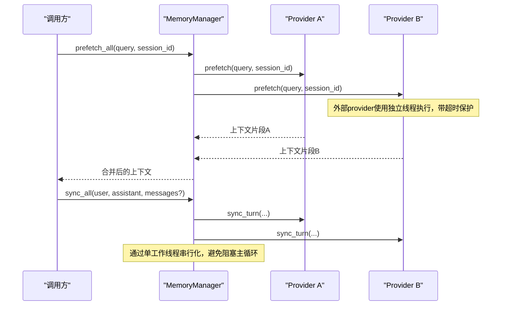
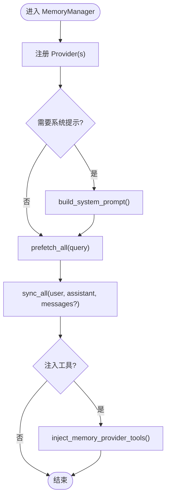
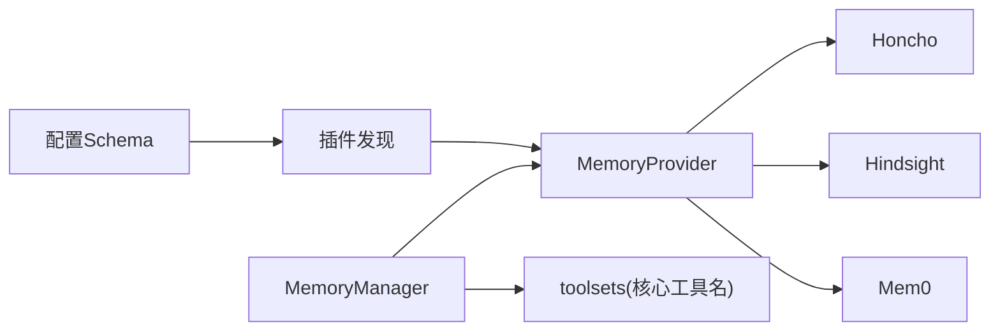

# 记忆提供者接口

<cite>
**本文引用的文件**
- [agent/memory_provider.py](file://agent/memory_provider.py)
- [agent/memory_manager.py](file://agent/memory_manager.py)
- [plugins/memory/__init__.py](file://plugins/memory/__init__.py)
- [plugins/memory/config_schema.py](file://plugins/memory/config_schema.py)
- [plugins/memory/honcho/__init__.py](file://plugins/memory/honcho/__init__.py)
- [plugins/memory/hindsight/__init__.py](file://plugins/memory/hindsight/__init__.py)
- [plugins/memory/mem0/__init__.py](file://plugins/memory/mem0/__init__.py)
</cite>

## 目录
1. [简介](#简介)
2. [项目结构](#项目结构)
3. [核心组件](#核心组件)
4. [架构总览](#架构总览)
5. [详细组件分析](#详细组件分析)
6. [依赖关系分析](#依赖关系分析)
7. [性能考量](#性能考量)
8. [故障排查指南](#故障排查指南)
9. [结论](#结论)
10. [附录](#附录)

## 简介
本文件面向 Hermes Agent 的记忆提供者（MemoryProvider）抽象与编排机制，系统性说明 MemoryProvider 基类的设计理念、生命周期管理、会话处理、上下文预取、工具集成、配置与注册机制，以及与 MemoryManager 的协作方式。文档同时提供实现自定义记忆提供者的最佳实践、错误处理策略与性能优化建议，帮助开发者快速构建可扩展、可插拔且高可靠的记忆后端。

## 项目结构
围绕记忆系统的关键位置如下：
- 抽象与编排
  - agent/memory_provider.py：定义 MemoryProvider 抽象基类及通用辅助（如 trivial prompt 过滤）。
  - agent/memory_manager.py：MemoryManager 负责注册、调度、超时保护、工具注入、后台任务编排等。
- 插件发现与配置
  - plugins/memory/__init__.py：扫描并加载内置/用户安装的 memory provider 插件。
  - plugins/memory/config_schema.py：声明式配置 schema，驱动 UI 与 Web API 的配置读写。
- 具体实现示例
  - plugins/memory/honcho/__init__.py：基于 Honcho 的用户画像与推理工具集。
  - plugins/memory/hindsight/__init__.py：知识图谱与多策略检索的长期记忆。
  - plugins/memory/mem0/__init__.py：服务端 LLM 事实抽取与语义搜索。

图表来源
- [agent/memory_provider.py:81-358](file://agent/memory_provider.py#L81-L358)
- [agent/memory_manager.py:364-800](file://agent/memory_manager.py#L364-L800)
- [plugins/memory/__init__.py:1-300](file://plugins/memory/__init__.py#L1-L300)
- [plugins/memory/config_schema.py:1-145](file://plugins/memory/config_schema.py#L1-L145)

章节来源
- [agent/memory_provider.py:1-358](file://agent/memory_provider.py#L1-L358)
- [agent/memory_manager.py:1-800](file://agent/memory_manager.py#L1-L800)
- [plugins/memory/__init__.py:1-300](file://plugins/memory/__init__.py#L1-L300)
- [plugins/memory/config_schema.py:1-145](file://plugins/memory/config_schema.py#L1-L145)

## 核心组件
- MemoryProvider（抽象基类）
  - 生命周期：initialize、shutdown、is_available
  - 系统提示：system_prompt_block
  - 上下文预取：prefetch、queue_prefetch
  - 回合同步：sync_turn
  - 工具集成：get_tool_schemas、handle_tool_call
  - 可选钩子：on_turn_start、on_session_end、on_session_switch、on_pre_compress、on_delegation、on_memory_write、backup_paths、get_config_schema、save_config
- MemoryManager（编排器）
  - 注册与限制：仅允许一个外部 provider；保留核心工具名不被覆盖
  - 系统提示聚合：build_system_prompt
  - 预取编排：prefetch_all（外部 provider 线程化+超时）、queue_prefetch_all
  - 同步编排：sync_all（单工作线程串行化，避免阻塞主循环）
  - 工具注入：inject_memory_provider_tools、get_all_tool_schemas
  - 后台任务与关闭：flush_pending、shutdown 保护
- 插件发现与配置
  - 插件扫描：discover_memory_providers/load_memory_provider
  - 配置 Schema：ProviderField/ProviderConfigSchema，支持文本、选择、密钥、布尔、数字、JSON 等字段类型与存储后端

章节来源
- [agent/memory_provider.py:81-358](file://agent/memory_provider.py#L81-L358)
- [agent/memory_manager.py:364-800](file://agent/memory_manager.py#L364-L800)
- [plugins/memory/__init__.py:146-300](file://plugins/memory/__init__.py#L146-L300)
- [plugins/memory/config_schema.py:43-145](file://plugins/memory/config_schema.py#L43-L145)

## 架构总览
MemoryProvider 定义了统一的记忆能力契约；MemoryManager 作为单一集成点，负责将多个 provider 的能力组合为一致的运行时体验。插件发现机制从内置与用户目录加载 provider，并通过配置 schema 暴露可配置的键值。

图表来源
- [agent/memory_manager.py:525-695](file://agent/memory_manager.py#L525-L695)
- [agent/memory_provider.py:132-170](file://agent/memory_provider.py#L132-L170)

## 详细组件分析

### MemoryProvider 抽象基类
- 设计理念
  - 以最小必要方法暴露持久化记忆能力，确保“上下文预取”和“回合写入”两条关键路径清晰、可替换。
  - 通过可选钩子扩展生命周期事件（会话切换、压缩前提取、委派观察等），使 provider 能适配复杂场景。
  - 工具集成采用 OpenAI function calling 风格 schema，便于统一注入到模型的工具集中。
- 核心方法与职责
  - is_available：启动时检查可用性与依赖，不应发起网络请求。
  - initialize：按 session_id 初始化资源，接收 hermes_home、platform、agent_context、agent_identity、user_id 等上下文。
  - system_prompt_block：返回静态系统提示片段（非动态召回内容）。
  - prefetch：每次调用前召回相关上下文，应快速返回（推荐后台线程预热）。
  - queue_prefetch：在回合结束后排队下一次预取，默认空实现。
  - sync_turn：异步持久化本轮对话，支持传入 messages 以便 provider 自行解析。
  - get_tool_schemas / handle_tool_call：声明并实现 provider 提供的工具。
  - on_session_switch / on_session_end / on_pre_compress / on_delegation / on_memory_write：可选钩子用于状态迁移、压缩前提取、委派观察、镜像内置记忆写入等。
  - backup_paths / get_config_schema / save_config：备份路径声明与配置管理。
- 参数与返回值要点
  - initialize(session_id, **kwargs)：无返回值；kwargs 包含平台与身份上下文。
  - prefetch(query, session_id="") -> str：返回注入上下文字符串或空串。
  - queue_prefetch(query, session_id="") -> None：排队下一次预取。
  - sync_turn(user_content, assistant_content, session_id="", messages=None) -> None：异步写入。
  - get_tool_schemas() -> List[Dict]：OpenAI function schema 列表。
  - handle_tool_call(tool_name, args, **kwargs) -> str：返回 JSON 字符串结果。
- 使用场景
  - 跨会话记忆：通过 prefetch 将历史知识注入当前 turn。
  - 工具增强：通过 get_tool_schemas 暴露搜索/画像/结论等工具。
  - 会话边界处理：on_session_end/on_session_switch 维护 per-session 状态一致性。
  - 配置与备份：get_config_schema/save_config/backup_paths 配合 CLI/Web 完成配置与迁移。

章节来源
- [agent/memory_provider.py:81-358](file://agent/memory_provider.py#L81-L358)

### MemoryManager 编排器
- 设计要点
  - 只允许一个外部 provider，避免工具 schema 膨胀与冲突。
  - 外部 provider 的 prefetch 使用独立线程并设置超时，防止慢/卡死 provider 阻塞主流程。
  - sync_turn 与 queue_prefetch 通过单工作线程串行化，保证顺序与稳定性。
  - 工具注入时自动规范化 schema，跳过无 name 的条目，避免污染请求。
- 关键流程
  - 注册：add_provider 校验名称冲突与核心工具保留。
  - 系统提示：build_system_prompt 聚合各 provider 的静态提示块。
  - 预取：prefetch_all 收集所有 provider 的上下文；_prefetch_provider 对非 builtin 使用线程+超时。
  - 同步：sync_all 将每轮对话写入所有 provider，失败不阻断其他 provider。
  - 工具注入：inject_memory_provider_tools 将 provider 工具追加到 agent 的工具表面。
- 错误与健壮性
  - 外部预取超时：记录警告并跳过该 provider 本次结果。
  - 工具 schema 异常：normalize_tool_schema 过滤无效 schema，避免整个请求失败。
  - 关闭期任务：flush_pending 等待队列排空；关闭中拒绝新任务提交。

图表来源
- [agent/memory_manager.py:404-470](file://agent/memory_manager.py#L404-L470)
- [agent/memory_manager.py:486-503](file://agent/memory_manager.py#L486-L503)
- [agent/memory_manager.py:525-695](file://agent/memory_manager.py#L525-L695)
- [agent/memory_manager.py:110-156](file://agent/memory_manager.py#L110-L156)

章节来源
- [agent/memory_manager.py:1-800](file://agent/memory_manager.py#L1-L800)

### 插件发现与配置管理
- 插件发现
  - 扫描内置 plugins/memory/<name>/ 与用户目录 $HERMES_HOME/plugins/<name>/。
  - 同名冲突时内置优先；通过 _load_provider_from_dir 动态导入模块并实例化 provider。
  - discover_memory_providers 会尝试调用 is_available 判断可用性。
- 配置 Schema
  - 通过 ProviderField/ProviderConfigSchema 声明字段类型、是否密钥、默认值、取值范围等。
  - 由 Web 服务与桌面端渲染统一配置界面，读取/写入对应存储后端（flat_json、honcho_host_block 等）。
- 与 provider 的关系
  - provider 可通过 get_config_schema/save_config 参与配置流程；backup_paths 声明额外备份路径。

章节来源
- [plugins/memory/__init__.py:1-300](file://plugins/memory/__init__.py#L1-L300)
- [plugins/memory/config_schema.py:1-145](file://plugins/memory/config_schema.py#L1-L145)

### 具体实现示例

#### Honcho 记忆提供者
- 特点
  - 提供用户画像（profile）、搜索（search）、推理（reasoning）、快照（context）、结论（conclude）等工具。
  - 强调跨会话的用户建模与问答式推理，适合需要长期理解用户偏好的场景。
- 工具集成
  - 通过 get_tool_schemas 暴露 honcho_* 系列工具，handle_tool_call 分发到对应逻辑。
- 典型用法
  - 在 prefetch 中快速召回近期相关片段；在 sync_turn 中沉淀对话事实；在 on_session_end 生成总结。

章节来源
- [plugins/memory/honcho/__init__.py:1-200](file://plugins/memory/honcho/__init__.py#L1-L200)

#### Hindsight 记忆提供者
- 特点
  - 知识图谱与多策略检索，支持云端/本地嵌入式/本地外部模式。
  - 具备 retain/observe 写入与 recall/reflect 召回策略，支持标签与银行（bank）隔离。
- 配置与安装
  - 支持 post_setup 引导选择模式与依赖安装；save_config 写入 $HERMES_HOME/hindsight/config.json。
- 典型用法
  - 通过 prefetch 进行回忆；通过 sync_turn 写入观察；通过 on_session_end 做长程摘要。

章节来源
- [plugins/memory/hindsight/__init__.py:680-900](file://plugins/memory/hindsight/__init__.py#L680-L900)

#### Mem0 记忆提供者
- 特点
  - 服务端 LLM 事实抽取与语义搜索，支持 Platform（云）与 OSS（自托管）模式。
  - 提供 search/add/update/delete 工具，便于直接操作记忆条目。
- 配置
  - 通过环境变量与 mem0.json 管理 mode/host/user_id/agent_id 等；支持断路与熔断保护。
- 典型用法
  - 在 sync_turn 中增量写入事实；在 prefetch 中进行语义检索；在工具层直接增删改查。

章节来源
- [plugins/memory/mem0/__init__.py:1-200](file://plugins/memory/mem0/__init__.py#L1-L200)

## 依赖关系分析
- 耦合与内聚
  - MemoryProvider 与 MemoryManager 松耦合：后者通过统一接口调度前者，屏蔽实现差异。
  - 插件发现与配置解耦：providers 无需感知 UI/Web 细节，只需声明 schema。
- 外部依赖
  - 工具注入依赖 toolsets 的核心工具名白名单，避免命名冲突。
  - 后台任务依赖线程池/守护线程，确保进程退出时不会阻塞。
- 潜在风险
  - 外部 provider 的 prefetch 若未控制耗时，会被超时保护丢弃，需关注降级策略。
  - 工具 schema 不规范会导致注入失败或被严格 provider 拒绝，需遵循 normalize_tool_schema 约束。

图表来源
- [agent/memory_manager.py:437-470](file://agent/memory_manager.py#L437-L470)
- [plugins/memory/__init__.py:219-300](file://plugins/memory/__init__.py#L219-L300)
- [plugins/memory/config_schema.py:94-145](file://plugins/memory/config_schema.py#L94-L145)

章节来源
- [agent/memory_manager.py:437-470](file://agent/memory_manager.py#L437-L470)
- [plugins/memory/__init__.py:219-300](file://plugins/memory/__init__.py#L219-L300)
- [plugins/memory/config_schema.py:94-145](file://plugins/memory/config_schema.py#L94-L145)

## 性能考量
- 预取路径
  - 外部 provider 的 prefetch 使用独立线程并设置超时，避免阻塞主循环；建议在 provider 内部实现后台预热与缓存命中。
  - 对于 trivial prompt（简短问候/命令），可在上层跳过预取以减少开销。
- 同步路径
  - sync_turn 通过单工作线程串行化，保证顺序且不阻塞主循环；provider 应避免在 sync_turn 中做长时间阻塞 I/O。
- 工具注入
  - 规范化 schema，跳过无 name 的条目，减少无效工具带来的请求失败风险。
- 关闭期
  - flush_pending 等待后台任务排空；关闭中拒绝新任务，避免悬垂线程。

章节来源
- [agent/memory_manager.py:547-595](file://agent/memory_manager.py#L547-L595)
- [agent/memory_manager.py:638-757](file://agent/memory_manager.py#L638-L757)
- [agent/memory_provider.py:61-79](file://agent/memory_provider.py#L61-L79)

## 故障排查指南
- 常见症状与定位
  - 预取超时：检查外部 provider 的网络/依赖；确认超时阈值合理。
  - 工具注入失败：核对 get_tool_schemas 返回的 schema 是否包含顶层 name；避免与核心工具重名。
  - 同步阻塞：确认 sync_turn 非阻塞；必要时改为队列+后台写入。
  - 会话切换问题：确保 on_session_switch 更新 per-session 状态（document_id、turn counter 等）。
- 调试建议
  - 启用日志：关注 MemoryManager 的 warning/debug 输出。
  - 使用 flush_pending：在测试或会话边界等待后台任务完成，确保确定性。
  - 验证配置：通过 config_schema 与 Web/CLI 校验必填项与密钥。

章节来源
- [agent/memory_manager.py:547-595](file://agent/memory_manager.py#L547-L595)
- [agent/memory_manager.py:638-757](file://agent/memory_manager.py#L638-L757)
- [plugins/memory/config_schema.py:94-145](file://plugins/memory/config_schema.py#L94-L145)

## 结论
MemoryProvider 提供了稳定、可扩展的记忆能力抽象；MemoryManager 将其编排为高性能、健壮的运行时体验。通过插件发现与声明式配置，开发者可以快速接入新的记忆后端，并在不破坏现有流程的前提下增强系统的长期记忆与工具能力。遵循本文的最佳实践与性能建议，可实现低延迟、高可用的跨会话记忆系统。

## 附录

### 自定义记忆提供者实现清单（步骤与要点）
- 继承 MemoryProvider，实现必需方法：is_available、initialize、get_tool_schemas、handle_tool_call（如需工具）。
- 实现可选方法：prefetch、queue_prefetch、sync_turn、on_session_switch、on_session_end、on_pre_compress、on_delegation、on_memory_write、backup_paths、get_config_schema、save_config。
- 在 plugins/memory/<your_provider>/__init__.py 中提供类或 register 函数，供插件发现机制加载。
- 通过 get_config_schema 声明配置字段，save_config 持久化非密钥配置；secret 走 .env。
- 在 prefetch 中尽量快速返回缓存结果；在 queue_prefetch 中安排后台预取；在 sync_turn 中异步写入。
- 注意工具 schema 规范与核心工具名避让；避免阻塞主循环。

章节来源
- [agent/memory_provider.py:81-358](file://agent/memory_provider.py#L81-L358)
- [plugins/memory/__init__.py:219-300](file://plugins/memory/__init__.py#L219-L300)
- [plugins/memory/config_schema.py:94-145](file://plugins/memory/config_schema.py#L94-L145)