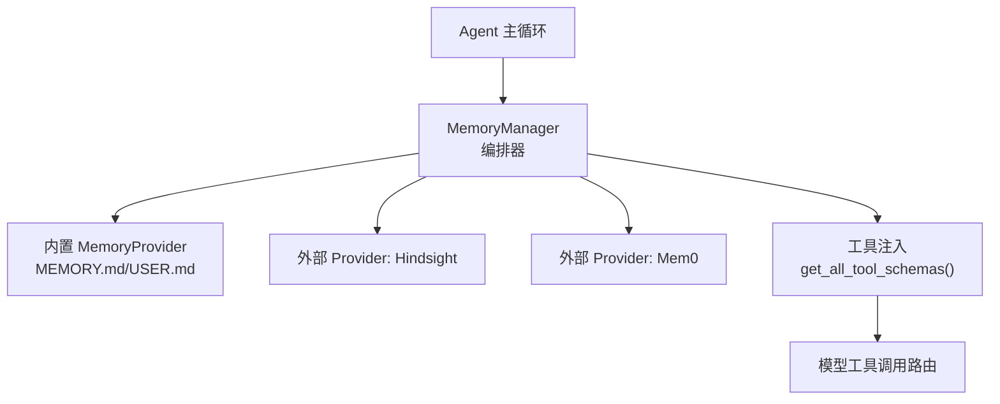
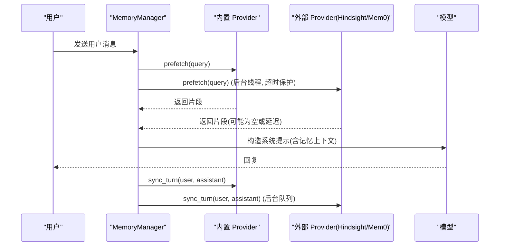
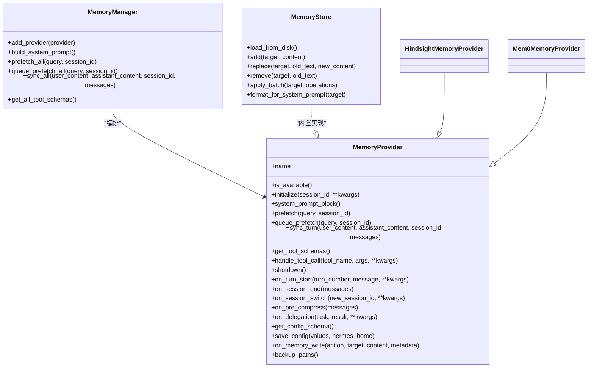

# 长期记忆存储

<cite>
**本文引用的文件**
- [agent/memory_provider.py](file://agent/memory_provider.py)
- [agent/memory_manager.py](file://agent/memory_manager.py)
- [tools/memory_tool.py](file://tools/memory_tool.py)
- [plugins/memory/hindsight/__init__.py](file://plugins/memory/hindsight/__init__.py)
- [plugins/memory/mem0/__init__.py](file://plugins/memory/mem0/__init__.py)
- [hermes_cli/memory_setup.py](file://hermes_cli/memory_setup.py)
</cite>

## 目录
1. [简介](#简介)
2. [项目结构](#项目结构)
3. [核心组件](#核心组件)
4. [架构总览](#架构总览)
5. [详细组件分析](#详细组件分析)
6. [依赖关系分析](#依赖关系分析)
7. [性能考量](#性能考量)
8. [故障排查指南](#故障排查指南)
9. [结论](#结论)
10. [附录](#附录)

## 简介
本文件系统性说明 Hermes Agent 的“长期记忆”子系统：包括抽象接口、编排器、内置文件型记忆、以及多种外部插件（Hindsight、Mem0）的集成方式。重点覆盖持久化机制、向量/语义检索、用户画像管理、工具模式定义、数据同步策略、索引构建与知识图谱维护、批量写入与增量更新、缓存策略，以及自定义后端的开发指南与最佳实践。

## 项目结构
长期记忆由“抽象接口 + 编排器 + 内置实现 + 插件生态”构成：
- 抽象接口：MemoryProvider 定义了生命周期、预取、同步、工具暴露等契约。
- 编排器：MemoryManager 负责注册、调度、超时控制、工具注入、并发安全。
- 内置实现：基于文件的 MEMORY.md / USER.md，提供会话级快照与跨会话持久化。
- 插件生态：Hindsight（知识图谱+多策略检索）、Mem0（服务端抽取+语义搜索），均可通过 CLI 配置与激活。

图表来源
- [agent/memory_manager.py:364-470](file://agent/memory_manager.py#L364-L470)
- [agent/memory_provider.py:81-192](file://agent/memory_provider.py#L81-L192)

章节来源
- [agent/memory_manager.py:1-24](file://agent/memory_manager.py#L1-L24)
- [agent/memory_provider.py:1-32](file://agent/memory_provider.py#L1-L32)

## 核心组件
- MemoryProvider（抽象基类）
  - 生命周期：initialize、system_prompt_block、prefetch、queue_prefetch、sync_turn、shutdown
  - 工具：get_tool_schemas、handle_tool_call
  - 可选钩子：on_turn_start、on_session_end、on_session_switch、on_pre_compress、on_delegation、backup_paths、get_config_schema、save_config、on_memory_write
- MemoryManager（编排器）
  - 仅允许一个外部 provider；内置 provider 始终存在
  - 统一系统提示块拼接、预取合并、后台同步队列、工具去重与注入
  - 外部预取线程隔离与超时保护、单工作线程串行化写入
- 内置 MemoryStore（文件型记忆）
  - 双存储：MEMORY.md（个人笔记）、USER.md（用户画像）
  - 会话启动时冻结系统提示快照，避免前缀缓存失效
  - 原子写入、漂移检测、内容扫描防护、批操作一致性
- 插件实现
  - Hindsight：知识图谱、实体解析、多策略检索（recall/reflect）、本地/云端模式、保留标签与观察范围
  - Mem0：服务端 LLM 抽取、语义搜索、去重、平台/自托管/OSS 三种后端

章节来源
- [agent/memory_provider.py:81-358](file://agent/memory_provider.py#L81-L358)
- [agent/memory_manager.py:364-800](file://agent/memory_manager.py#L364-L800)
- [tools/memory_tool.py:148-800](file://tools/memory_tool.py#L148-L800)
- [plugins/memory/hindsight/__init__.py:681-800](file://plugins/memory/hindsight/__init__.py#L681-L800)
- [plugins/memory/mem0/__init__.py:194-370](file://plugins/memory/mem0/__init__.py#L194-L370)

## 架构总览
长期记忆在每次对话轮次中经历“预取 → 生成 → 同步”的闭环：
- 预取：MemoryManager 为每个 provider 调用 prefetch，外部 provider 使用独立线程并带超时，结果以 fenced 上下文注入到模型输入。
- 同步：每轮结束后，MemoryManager 将用户/助手消息异步写入各 provider，保证顺序且不影响响应路径。
- 工具：provider 可暴露工具（如 hindsight_retain/recall/reflect、mem0_search/add/update/delete），由 MemoryManager 统一收集并注入到模型工具集。

图表来源
- [agent/memory_manager.py:525-694](file://agent/memory_manager.py#L525-L694)
- [agent/memory_provider.py:132-170](file://agent/memory_provider.py#L132-L170)

## 详细组件分析

### MemoryProvider 接口设计
- 名称与可用性：name、is_available
- 生命周期：initialize(session_id, **kwargs)、shutdown()
- 系统提示：system_prompt_block()
- 预取：prefetch(query, session_id)、queue_prefetch(query, session_id)
- 同步：sync_turn(user_content, assistant_content, session_id, messages)
- 工具：get_tool_schemas()、handle_tool_call(tool_name, args, **kwargs)
- 扩展钩子：on_turn_start、on_session_end、on_session_switch、on_pre_compress、on_delegation、backup_paths、get_config_schema、save_config、on_memory_write

关键要点
- 外部 provider 必须实现 is_available、initialize、get_tool_schemas；其他方法可默认空实现。
- 预取应快速返回缓存结果，实际检索应在后台进行。
- 同步应为非阻塞，必要时排队处理。
- 工具名不得与核心工具冲突，MemoryManager 会拒绝重复或保留名。

章节来源
- [agent/memory_provider.py:81-358](file://agent/memory_provider.py#L81-L358)

### MemoryManager 编排器
职责
- 注册 provider：仅允许一个外部 provider；内置 provider 始终优先。
- 系统提示：聚合所有 provider 的 system_prompt_block。
- 预取：并行调用外部 provider 的 prefetch，带超时与线程复用；内置 provider 直接同步调用。
- 同步：将所有 provider 的 sync_turn 放入单工作线程队列，确保顺序且不阻塞主流程。
- 工具注入：收集所有 provider 的工具 schema，去重并注入到 agent 工具集。

并发与容错
- 外部预取使用独立线程，失败不阻断其他 provider。
- 单工作线程串行化写入，避免竞态。
- 关闭时等待后台任务耗尽，避免进程挂起。

章节来源
- [agent/memory_manager.py:364-800](file://agent/memory_manager.py#L364-L800)

### 内置记忆：文件型持久化（MEMORY.md / USER.md）
设计原则
- 两个目标：memory（个人笔记）、user（用户画像）。
- 会话启动时加载并冻结系统提示快照，保持前缀缓存稳定。
- 中间会话的写入立即落盘但不改变当前系统提示，下一会话生效。
- 严格字符预算与去重，防止无限增长。
- 读写加锁与漂移检测，避免并发编辑导致的数据丢失。
- 内容扫描：对注入系统提示的内容执行威胁模式扫描，拦截注入/泄露。

数据结构与复杂度
- 条目列表：add/replace/remove 均为 O(n) 匹配与替换，n 为条目数。
- 批操作 apply_batch：先验证再一次性提交，最终预算检查，整体 O(n)。
- 序列化：按分隔符分割/拼接，线性时间。

安全与健壮性
- 文件锁：跨平台兼容（fcntl/msvcrt）。
- 漂移备份：当检测到外部修改无法 round-trip 时，拒绝写入并给出修复指引。
- 读取失败保护：存在但不可读的文件不会被视为空，避免误删。

章节来源
- [tools/memory_tool.py:148-800](file://tools/memory_tool.py#L148-L800)

### Hindsight 插件（知识图谱 + 多策略检索）
能力
- 支持云端与本地嵌入模式，自动探测 API 版本与能力（如 update_mode='append'）。
- 工具：hindsight_retain（保存）、hindsight_recall（检索）、hindsight_reflect（推理式回答）。
- 配置：profile-scoped config.json、环境变量、遗留 ~/.hindsight/config.json。
- 保留标签与观察范围：支持 per_tag/combined/all_combinations 或自定义 tag-lists。
- 事件循环：专用后台事件循环用于异步调用，避免泄漏 aiohttp 会话。
- 文档 ID：为避免旧版 API 覆盖问题，使用进程唯一 document_id 或 append 模式。

初始化与运行
- initialize：加载配置、解析 bank_id 模板、准备嵌入环境、设置 retain/prefetch 参数。
- prefetch：后台线程检索，结果以 fenced 上下文注入。
- sync_turn：入队 retain 队列，单写者线程顺序写入，必要时等待服务端完成信号。

章节来源
- [plugins/memory/hindsight/__init__.py:1-800](file://plugins/memory/hindsight/__init__.py#L1-L800)

### Mem0 插件（服务端抽取 + 语义搜索）
能力
- 后端模式：Platform（云）、Self-hosted（HTTP）、OSS（自托管向量库）。
- 工具：mem0_search、mem0_add、mem0_update、mem0_delete。
- 用户画像：user_id 优先级（显式配置 > 网关原生 ID > 默认占位），跨渠道统一记忆。
- 熔断器：连续失败触发冷却，避免雪崩。
- 预取：后台线程检索，短等待热路径，失败降级为工具查询兜底。

初始化与运行
- initialize：加载配置、创建后端、注册 atexit 清理。
- prefetch：后台检索并缓存结果，prefetch 函数尝试消费。
- sync_turn：后台线程调用后端 add（服务端抽取），记录成功/失败。

章节来源
- [plugins/memory/mem0/__init__.py:1-629](file://plugins/memory/mem0/__init__.py#L1-L629)

### 配置与启用（CLI）
- hermes memory setup：交互式选择 provider，安装依赖，引导填写配置，写入 config.yaml/.env。
- hermes memory status：查看当前 provider、可用性与缺失项提示。
- 插件发现：从 plugins/memory/<name>/ 自动发现，读取 plugin.yaml 声明的 pip_dependencies。

章节来源
- [hermes_cli/memory_setup.py:1-579](file://hermes_cli/memory_setup.py#L1-L579)

## 依赖关系分析
- MemoryManager 依赖 MemoryProvider 抽象，聚合多个实现。
- 内置 MemoryStore 依赖文件系统与锁机制，提供强一致写入。
- Hindsight 依赖客户端/嵌入运行时，具备异步事件循环与守护进程管理。
- Mem0 依赖后端 SDK（平台/自托管/OSS），具备熔断与重试逻辑。
- CLI 层依赖插件发现与懒加载依赖安装。

图表来源
- [agent/memory_provider.py:81-358](file://agent/memory_provider.py#L81-L358)
- [agent/memory_manager.py:364-800](file://agent/memory_manager.py#L364-L800)
- [tools/memory_tool.py:148-800](file://tools/memory_tool.py#L148-L800)
- [plugins/memory/hindsight/__init__.py:681-800](file://plugins/memory/hindsight/__init__.py#L681-L800)
- [plugins/memory/mem0/__init__.py:194-370](file://plugins/memory/mem0/__init__.py#L194-L370)

章节来源
- [agent/memory_manager.py:364-800](file://agent/memory_manager.py#L364-L800)
- [agent/memory_provider.py:81-358](file://agent/memory_provider.py#L81-L358)

## 性能考量
- 预取优化
  - 外部 provider 使用独立线程，带超时保护，避免阻塞主循环。
  - 内置 trivial prompt 过滤，跳过无意义请求。
  - Mem0 短等待热路径，失败降级为工具查询。
- 写入优化
  - 单工作线程串行化写入，保证顺序且减少锁竞争。
  - Hindsight 使用队列与单写者线程，必要时等待服务端完成信号。
  - Mem0 后台线程写入，熔断器避免雪崩。
- 缓存策略
  - 内置 MemoryStore 会话级快照，避免频繁重建系统提示。
  - Hindsight/Mem0 内部缓存最近预取结果，减少重复网络开销。
- 批量与增量
  - 内置 apply_batch 原子提交，最终预算检查。
  - Hindsight 支持 update_mode='append' 增量追加（若 API 支持）。
- I/O 安全
  - 文件锁与原子写入，漂移检测与备份，读取失败保护。

[本节为通用性能指导，无需特定文件引用]

## 故障排查指南
常见问题与定位
- 外部 provider 预取超时
  - 现象：prefetch 线程未在规定时间内返回。
  - 处理：MemoryManager 记录警告并跳过该 provider 本轮预取，后续轮次重试。
  - 建议：检查网络、API 可用性、provider 配置。
- 同步写入失败
  - 现象：sync_turn 抛出异常被捕获并记录。
  - 处理：后台线程继续执行，不影响主流程；关注日志定位 provider 错误。
- 内置文件读写失败
  - 现象：文件存在但不可读或编码错误。
  - 处理：MemoryStore 拒绝写入并返回错误信息，避免数据丢失。
  - 建议：检查权限、编码、并发访问。
- 工具名冲突
  - 现象：provider 工具名与核心工具冲突。
  - 处理：MemoryManager 拒绝注册并记录警告。
  - 建议：重命名 provider 工具。
- 插件不可用
  - 现象：is_available 返回 False。
  - 处理：CLI status 显示缺失配置项与环境变量。
  - 建议：按提示补全配置或安装依赖。

章节来源
- [agent/memory_manager.py:525-694](file://agent/memory_manager.py#L525-L694)
- [tools/memory_tool.py:91-146](file://tools/memory_tool.py#L91-L146)
- [hermes_cli/memory_setup.py:478-558](file://hermes_cli/memory_setup.py#L478-L558)

## 结论
Hermes 的长期记忆子系统通过清晰的抽象接口与编排器，实现了内置文件型记忆与多种外部插件的统一接入。其设计强调：
- 可扩展：MemoryProvider 抽象允许灵活接入不同后端。
- 高可用：后台线程、超时保护、熔断器、串行写入保障稳定性。
- 安全：内容扫描、文件锁、漂移检测、权限控制。
- 易用：CLI 向导简化配置与启用。
开发者可据此快速集成新的记忆后端，遵循接口契约与最佳实践，获得一致的体验与强大的长期记忆能力。

[本节为总结性内容，无需特定文件引用]

## 附录

### 配置与使用示例（路径参考）
- 启用内置记忆：无需额外配置，默认启用 MEMORY.md/USER.md。
  - 参考：[tools/memory_tool.py:148-240](file://tools/memory_tool.py#L148-L240)
- 启用 Hindsight：
  - 通过 CLI 配置 provider 与凭据，支持云端/本地模式。
  - 参考：[plugins/memory/hindsight/__init__.py:361-404](file://plugins/memory/hindsight/__init__.py#L361-L404)
  - 参考：[hermes_cli/memory_setup.py:283-425](file://hermes_cli/memory_setup.py#L283-L425)
- 启用 Mem0：
  - 配置 API Key 或自托管地址，选择模式（platform/oss/self-hosted）。
  - 参考：[plugins/memory/mem0/__init__.py:78-110](file://plugins/memory/mem0/__init__.py#L78-L110)
  - 参考：[hermes_cli/memory_setup.py:283-425](file://hermes_cli/memory_setup.py#L283-L425)

### 自定义记忆后端开发指南
步骤
- 实现 MemoryProvider 接口：至少实现 name、is_available、initialize、get_tool_schemas。
- 实现工具：如需暴露工具，提供 get_tool_schemas 与 handle_tool_call。
- 预取与同步：prefetch 快速返回缓存，queue_prefetch 后台预取；sync_turn 异步写入。
- 配置：实现 get_config_schema 与 save_config，配合 CLI 向导。
- 钩子：按需实现 on_turn_start、on_session_end、on_session_switch、on_pre_compress、on_delegation、backup_paths、on_memory_write。
- 测试：确保 is_available 正确判断可用性，prefetch/sync_turn 具备超时与错误处理。

最佳实践
- 避免阻塞主循环：所有网络/IO 操作放入后台线程或队列。
- 资源管理：initialize 中创建的资源需在 shutdown 中释放。
- 安全：敏感信息通过 .env 或 secret 管理，避免硬编码。
- 兼容性：尊重 MemoryManager 的工具名保留规则与唯一外部 provider 限制。

章节来源
- [agent/memory_provider.py:81-358](file://agent/memory_provider.py#L81-L358)
- [hermes_cli/memory_setup.py:283-425](file://hermes_cli/memory_setup.py#L283-L425)