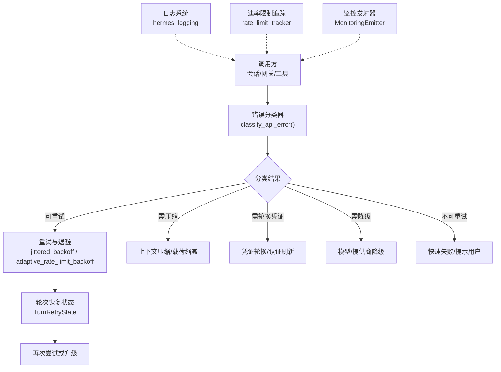
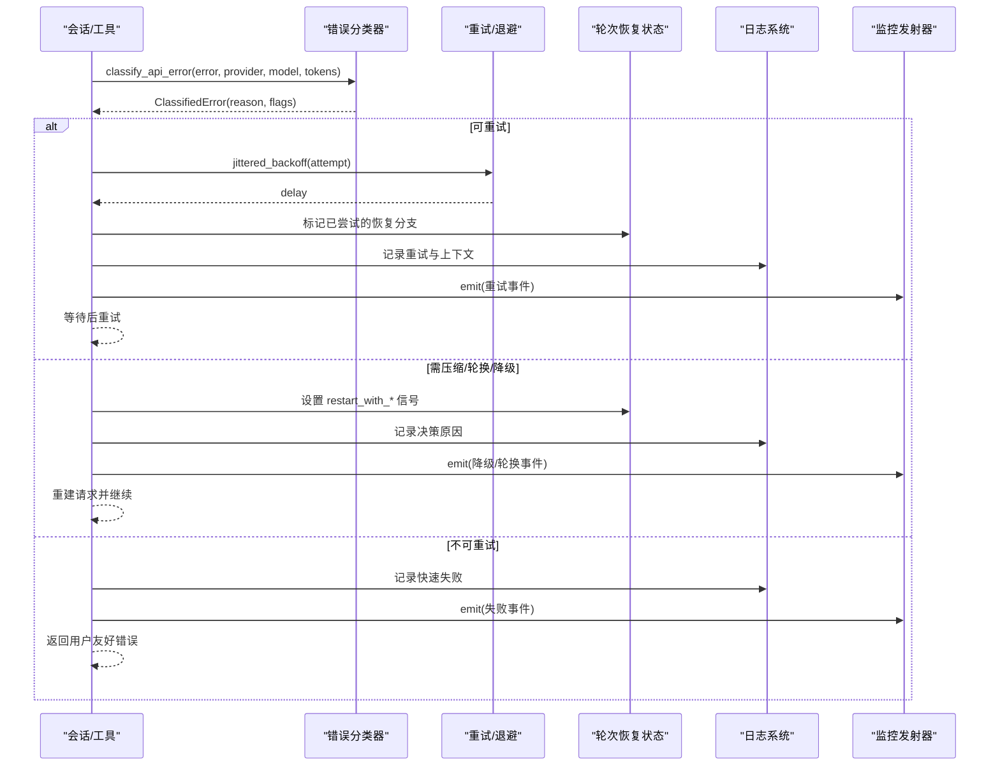
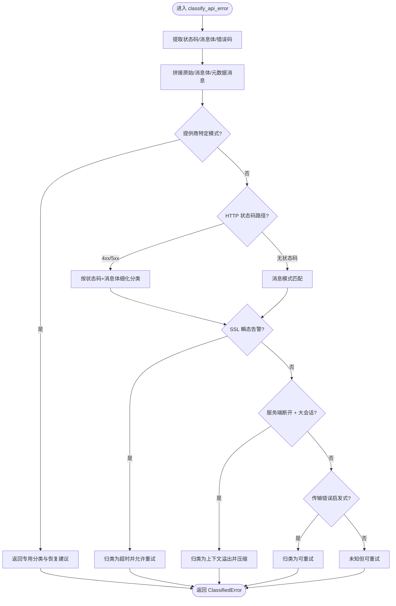
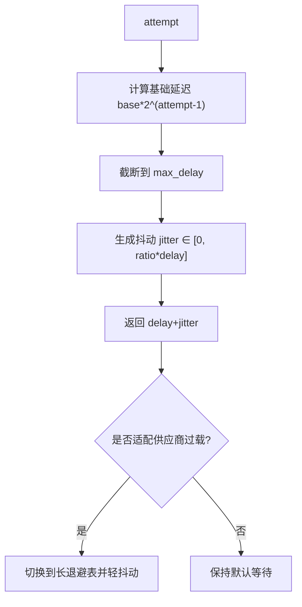
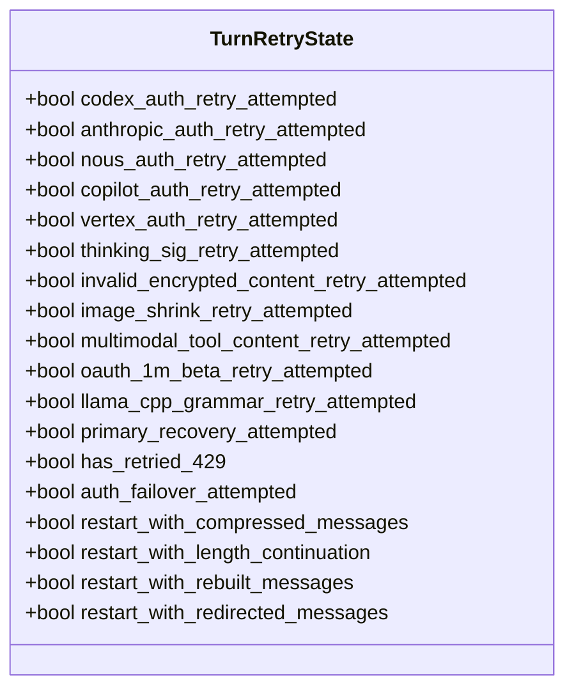
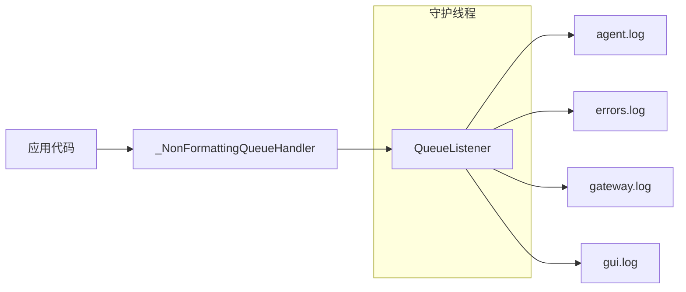
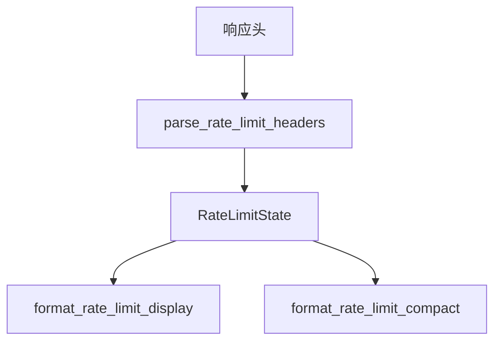
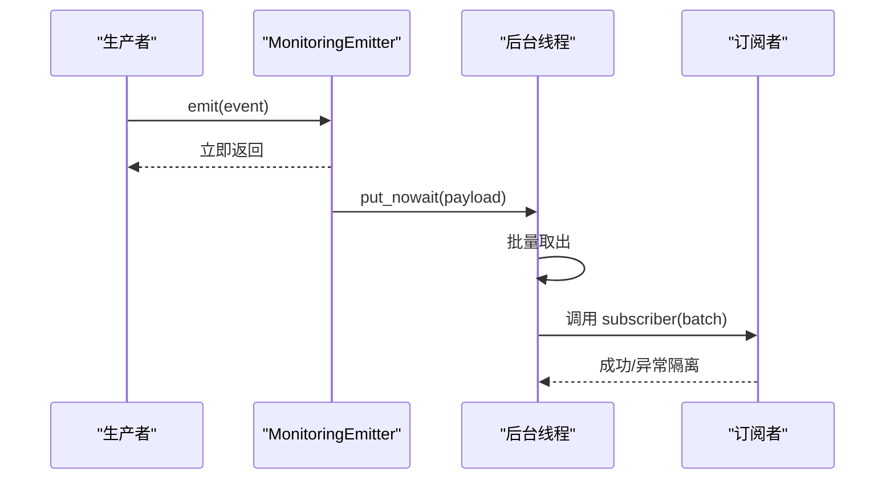
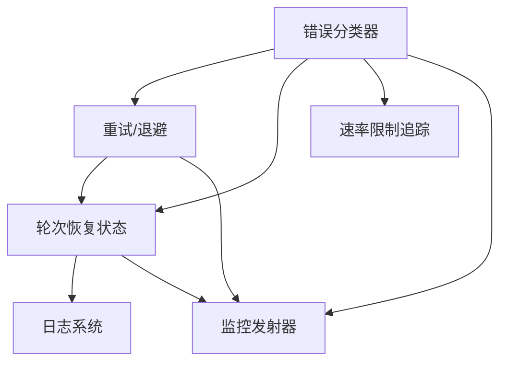

# 错误处理和恢复

<cite>
**本文引用的文件**
- [agent/error_classifier.py](file://agent/error_classifier.py)
- [agent/retry_utils.py](file://agent/retry_utils.py)
- [agent/turn_retry_state.py](file://agent/turn_retry_state.py)
- [hermes_logging.py](file://hermes_logging.py)
- [agent/rate_limit_tracker.py](file://agent/rate_limit_tracker.py)
- [agent/monitoring/emitter.py](file://agent/monitoring/emitter.py)
- [tests/tools/test_terminal_error_redaction.py](file://tests/tools/test_terminal_error_redaction.py)
- [tests/gateway/test_adapter_connect_is_reconnect_contract.py](file://tests/gateway/test_adapter_connect_is_reconnect_contract.py)
</cite>

## 目录
1. [简介](#简介)
2. [项目结构](#项目结构)
3. [核心组件](#核心组件)
4. [架构总览](#架构总览)
5. [详细组件分析](#详细组件分析)
6. [依赖关系分析](#依赖关系分析)
7. [性能考虑](#性能考虑)
8. [故障排查指南](#故障排查指南)
9. [结论](#结论)
10. [附录](#附录)

## 简介
本文件系统性梳理 Hermes Agent 的错误处理与恢复机制，覆盖错误分类、重试策略（指数退避、抖动、熔断式降级）、日志记录、诊断信息收集、故障转移以及工具执行失败和会话异常的处理。文档面向开发者与运维人员，提供从原理到实践的完整实现指南与调试技巧。

## 项目结构
围绕错误处理的关键模块分布在 agent 层与可观测性层：
- 错误分类：agent/error_classifier.py
- 重试与退避：agent/retry_utils.py
- 轮次内恢复状态：agent/turn_retry_state.py
- 日志系统：hermes_logging.py
- 速率限制追踪：agent/rate_limit_tracker.py
- 监控事件发射器：agent/monitoring/emitter.py
- 终端工具错误脱敏测试：tests/tools/test_terminal_error_redaction.py
- 平台适配器重连契约测试：tests/gateway/test_adapter_connect_is_reconnect_contract.py

图表来源
- [agent/error_classifier.py:624-718](file://agent/error_classifier.py#L624-L718)
- [agent/retry_utils.py:90-128](file://agent/retry_utils.py#L90-L128)
- [agent/turn_retry_state.py:32-88](file://agent/turn_retry_state.py#L32-L88)
- [hermes_logging.py:259-376](file://hermes_logging.py#L259-L376)
- [agent/rate_limit_tracker.py:92-129](file://agent/rate_limit_tracker.py#L92-L129)
- [agent/monitoring/emitter.py:36-77](file://agent/monitoring/emitter.py#L36-L77)

章节来源
- [agent/error_classifier.py:1-100](file://agent/error_classifier.py#L1-L100)
- [agent/retry_utils.py:1-209](file://agent/retry_utils.py#L1-L209)
- [agent/turn_retry_state.py:1-93](file://agent/turn_retry_state.py#L1-L93)
- [hermes_logging.py:1-800](file://hermes_logging.py#L1-L800)
- [agent/rate_limit_tracker.py:1-247](file://agent/rate_limit_tracker.py#L1-L247)
- [agent/monitoring/emitter.py:1-212](file://agent/monitoring/emitter.py#L1-L212)

## 核心组件
- 错误分类器：将任意 API 异常结构化归类为 FailoverReason，并附带是否可重试、是否需要压缩、是否需要轮换凭证、是否需要降级等恢复建议。
- 重试与退避：提供带抖动的指数退避，以及针对特定供应商过载的自适应长退避；支持解析 Retry-After 头。
- 轮次恢复状态：以 TurnRetryState 集中管理一次 API 调用内的“一次性”恢复开关与重启信号，避免重复分支与死循环。
- 日志系统：统一配置多文件输出、按组件分流、会话上下文注入、异步队列落盘与跨进程旋转安全。
- 速率限制追踪：解析 x-ratelimit-* 响应头，生成可读展示与紧凑摘要，辅助前端/CLI 显示与告警。
- 监控发射器：热路径零阻塞的事件发射器，后台线程批量分发至 OTLP 等订阅者，失败隔离且永不抛错。

章节来源
- [agent/error_classifier.py:22-100](file://agent/error_classifier.py#L22-L100)
- [agent/retry_utils.py:38-128](file://agent/retry_utils.py#L38-L128)
- [agent/turn_retry_state.py:32-88](file://agent/turn_retry_state.py#L32-L88)
- [hermes_logging.py:259-376](file://hermes_logging.py#L259-L376)
- [agent/rate_limit_tracker.py:30-129](file://agent/rate_limit_tracker.py#L30-L129)
- [agent/monitoring/emitter.py:36-77](file://agent/monitoring/emitter.py#L36-L77)

## 架构总览
错误处理贯穿“捕获—分类—决策—执行—反馈”闭环：
- 捕获：工具、传输层、会话循环抛出异常。
- 分类：error_classifier 基于 HTTP 状态码、消息体、错误码、模式匹配进行优先级判定。
- 决策：根据 ClassifiedError 的 flags 决定重试、压缩、轮换凭证、降级或快速失败。
- 执行：retry_utils 计算退避时间；TurnRetryState 控制一次性恢复分支；必要时触发提供商/模型切换。
- 反馈：hermes_logging 持久化日志；rate_limit_tracker 更新限额视图；MonitoringEmitter 上报遥测。

图表来源
- [agent/error_classifier.py:624-718](file://agent/error_classifier.py#L624-L718)
- [agent/retry_utils.py:90-128](file://agent/retry_utils.py#L90-L128)
- [agent/turn_retry_state.py:32-88](file://agent/turn_retry_state.py#L32-L88)
- [hermes_logging.py:259-376](file://hermes_logging.py#L259-L376)
- [agent/monitoring/emitter.py:53-77](file://agent/monitoring/emitter.py#L53-L77)

## 详细组件分析

### 错误分类器（API 错误分类与恢复建议）
- 分类维度：认证/授权、计费/配额、服务器过载、传输超时/TLS、上下文溢出、载荷过大、图片过大、模型不存在、提供商策略拦截、内容策略拦截、格式错误、提供商特定问题（如思考块签名、长上下文层级门限、OAuth Beta 头拒绝、llama.cpp 语法模式）。
- 优先级流程：先匹配提供商特定模式，再结合 HTTP 状态码与消息体细化，最后回退到未知但可重试。
- 输出：ClassifiedError 包含 reason、status_code、provider、model、message、error_context 及 recovery flags（retryable、should_compress、should_rotate_credential、should_fallback）。

图表来源
- [agent/error_classifier.py:624-718](file://agent/error_classifier.py#L624-L718)
- [agent/error_classifier.py:719-800](file://agent/error_classifier.py#L719-L800)

章节来源
- [agent/error_classifier.py:22-100](file://agent/error_classifier.py#L22-L100)
- [agent/error_classifier.py:624-718](file://agent/error_classifier.py#L624-L718)
- [agent/error_classifier.py:719-800](file://agent/error_classifier.py#L719-L800)

### 重试机制（指数退避、抖动、熔断式降级）
- 指数退避与抖动：jittered_backoff 使用 base_delay * 2^(attempt-1) 上限 max_delay，并叠加随机抖动防止雪崩。
- 自适应长退避：adaptive_rate_limit_backoff 对特定供应商过载（如 Z.AI Coding Plan GLM-5.2）在短重试后切换到渐进式长等待表，降低持续冲击。
- Retry-After 解析：parse_retry_after_seconds 支持数值与 HTTP-date，确保尊重上游限速指示。
- 熔断式降级：当连续失败达到阈值或检测到确定性拒绝（如内容策略拦截），通过 should_fallback 与 should_rotate_credential 触发模型/提供商切换或凭证轮换，避免无效重试。

图表来源
- [agent/retry_utils.py:90-128](file://agent/retry_utils.py#L90-L128)
- [agent/retry_utils.py:162-191](file://agent/retry_utils.py#L162-L191)
- [agent/retry_utils.py:38-87](file://agent/retry_utils.py#L38-L87)

章节来源
- [agent/retry_utils.py:1-209](file://agent/retry_utils.py#L1-L209)

### 轮次恢复状态（TurnRetryState）
- 一次性恢复守卫：每个分支（如 OAuth 刷新、思考块签名修复、图片缩小、多模态工具内容降级、llama.cpp 语法回退、1M Beta 头处理）仅触发一次，避免同一轮次内重复执行。
- 重启信号：restart_with_compressed_messages、restart_with_length_continuation、restart_with_rebuilt_messages、restart_with_redirected_messages 由外层循环读取并重建请求。
- 认证失败升级：auth_failover_attempted 防止在同一轮次内反复走认证失败降级链。

图表来源
- [agent/turn_retry_state.py:32-88](file://agent/turn_retry_state.py#L32-L88)

章节来源
- [agent/turn_retry_state.py:1-93](file://agent/turn_retry_state.py#L1-L93)

### 日志记录与诊断（hermes_logging）
- 多文件输出：agent.log（主活动日志）、errors.log（警告及以上快速定位）、gateway.log（网关组件）、gui.log（GUI/TUI 组件）。
- 会话上下文：set_session_context/clear_session_context 注入 session_tag，便于过滤与关联。
- 异步队列落盘：QueueListener 将文件写入移出热路径，避免事件循环阻塞；Windows 下使用并发旋转处理器避免锁竞争。
- 外部旋转检测：ManagedRotatingFileHandler 检测 inode 变化并自动重开流，防止外部 logrotate 导致静默丢日志。
- 敏感信息脱敏：RedactingFormatter 确保日志不落地密钥。

图表来源
- [hermes_logging.py:575-644](file://hermes_logging.py#L575-L644)
- [hermes_logging.py:721-760](file://hermes_logging.py#L721-L760)
- [hermes_logging.py:259-376](file://hermes_logging.py#L259-L376)

章节来源
- [hermes_logging.py:1-800](file://hermes_logging.py#L1-L800)

### 速率限制追踪（rate_limit_tracker）
- 解析 x-ratelimit-* 响应头，构建 RateLimitState（请求/令牌，分钟/小时窗口）。
- 提供人类可读展示与紧凑摘要，用于 CLI/GUI 显示与告警。
- 剩余时间估算：remaining_seconds_now 考虑 elapsed 时间修正。

图表来源
- [agent/rate_limit_tracker.py:92-129](file://agent/rate_limit_tracker.py#L92-L129)
- [agent/rate_limit_tracker.py:182-247](file://agent/rate_limit_tracker.py#L182-L247)

章节来源
- [agent/rate_limit_tracker.py:1-247](file://agent/rate_limit_tracker.py#L1-L247)

### 监控事件发射器（MonitoringEmitter）
- 热路径不变式：emit() 必须 O(微秒) 返回，不阻塞磁盘/网络，绝不抛错。
- 环形缓冲：满时丢弃最旧事件，保证内存可控。
- 后台分发：daemon 线程批量投递给订阅者（OTLP 流），单个订阅者失败不影响其他。
- 生命周期：flush/close/stats 便于测试与优雅关闭。

图表来源
- [agent/monitoring/emitter.py:36-77](file://agent/monitoring/emitter.py#L36-L77)
- [agent/monitoring/emitter.py:91-116](file://agent/monitoring/emitter.py#L91-L116)

章节来源
- [agent/monitoring/emitter.py:1-212](file://agent/monitoring/emitter.py#L1-L212)

### 工具执行失败与错误脱敏
- 终端工具在执行失败时将异常文本与回溯中的敏感信息（如密钥）进行脱敏，确保错误结果不包含明文凭据。
- 测试覆盖前台/后台启动失败、导入错误、外层异常等场景，验证 error/traceback 字段被正确脱敏。

章节来源
- [tests/tools/test_terminal_error_redaction.py:1-154](file://tests/tools/test_terminal_error_redaction.py#L1-L154)

### 平台适配器重连契约
- 网关重连监视器在每次重试时向所有适配器 connect() 传递 is_reconnect=True。若适配器未接受该关键字参数，首次重连即崩溃并永久离线。
- 静态 AST 检查确保所有 *Adapter.connect() 接受 is_reconnect 关键字，防止回归。

章节来源
- [tests/gateway/test_adapter_connect_is_reconnect_contract.py:1-145](file://tests/gateway/test_adapter_connect_is_reconnect_contract.py#L1-L145)

## 依赖关系分析
- 错误分类器依赖 HTTP 状态码、消息体、错误码与模式库，输出结构化恢复建议。
- 重试模块依赖分类结果与供应商特征，计算退避并可能触发长退避表。
- 轮次恢复状态被上层会话循环读写，协调一次性恢复分支与重启信号。
- 日志系统与速率限制追踪作为横切关注点，被各层调用以记录与展示。
- 监控发射器独立于业务逻辑，仅接收事件并分发给订阅者。

图表来源
- [agent/error_classifier.py:624-718](file://agent/error_classifier.py#L624-L718)
- [agent/retry_utils.py:90-128](file://agent/retry_utils.py#L90-L128)
- [agent/turn_retry_state.py:32-88](file://agent/turn_retry_state.py#L32-L88)
- [hermes_logging.py:259-376](file://hermes_logging.py#L259-L376)
- [agent/rate_limit_tracker.py:92-129](file://agent/rate_limit_tracker.py#L92-L129)
- [agent/monitoring/emitter.py:53-77](file://agent/monitoring/emitter.py#L53-L77)

## 性能考虑
- 日志级别控制：通过 setup_logging 的 log_level 与 _NOISY_LOGGERS 抑制第三方噪音；errors.log 仅 WARNING+ 便于快速定位。
- 异步队列落盘：QueueListener 将文件 I/O 移出事件循环，避免 WebSocket 客户端掉线。
- 抖动与长退避：jittered_backoff 与 adaptive_rate_limit_backoff 降低重试风暴风险，保护上游服务。
- 错误聚合：MonitoringEmitter 批量分发，减少网络/磁盘开销；队列满时丢弃最旧事件，保证内存稳定。
- 资源清理：ManagedRotatingFileHandler 检测外部旋转并重开流；flush/drain_log_queue 保障退出时尽可能写尽日志。

[本节为通用性能指导，无需具体文件引用]

## 故障排查指南
- 快速定位错误类型：查看 errors.log 与 agent.log，结合会话标签过滤；关注分类结果中的 reason 与 status_code。
- 重试行为诊断：检查 retry_utils 的退避计算与 Retry-After 解析；确认是否命中供应商过载长退避表。
- 上下文溢出与压缩：若出现 context_overflow/payload_too_large/image_too_large，检查 should_compress 与消息长度。
- 认证与计费问题：auth/auth_permanent/billing 分类触发凭证轮换或立即降级；核对凭证池与订阅额度。
- 内容策略拦截：content_policy_blocked 不应重试相同请求，应切换模型/提供商或提示用户修改输入。
- 工具错误脱敏：终端工具错误与回溯已脱敏；如需自定义脱敏规则，参考测试用例中 redact 的使用方式。
- 平台适配器重连：确保 connect() 接受 is_reconnect 关键字，否则重连会失败。

章节来源
- [hermes_logging.py:259-376](file://hermes_logging.py#L259-L376)
- [agent/retry_utils.py:38-128](file://agent/retry_utils.py#L38-L128)
- [agent/error_classifier.py:719-800](file://agent/error_classifier.py#L719-L800)
- [tests/tools/test_terminal_error_redaction.py:1-154](file://tests/tools/test_terminal_error_redaction.py#L1-L154)
- [tests/gateway/test_adapter_connect_is_reconnect_contract.py:1-145](file://tests/gateway/test_adapter_connect_is_reconnect_contract.py#L1-L145)

## 结论
Hermes Agent 的错误处理体系以“分类—决策—执行—反馈”为核心，结合结构化分类、智能重试、一次性恢复守卫、异步日志与监控发射器，实现了高可用与可观测性。通过速率限制追踪与错误脱敏，系统在复杂外部环境下仍能保持稳定与安全的用户体验。开发者可据此扩展新的错误模式、定制恢复策略，并利用日志与监控数据进行高效排障。

[本节为总结性内容，无需具体文件引用]

## 附录
- 自定义错误处理器建议：
  - 在分类阶段新增模式匹配，返回合适的 FailoverReason 与恢复 flags。
  - 在重试阶段接入供应商特定的长退避表或熔断条件。
  - 在轮次恢复状态中添加一次性恢复守卫，避免重复分支。
  - 通过 hermes_logging 记录关键决策与上下文，便于审计与回放。
  - 使用 MonitoringEmitter 上报错误事件，供下游系统消费。

[本节为实践建议，无需具体文件引用]