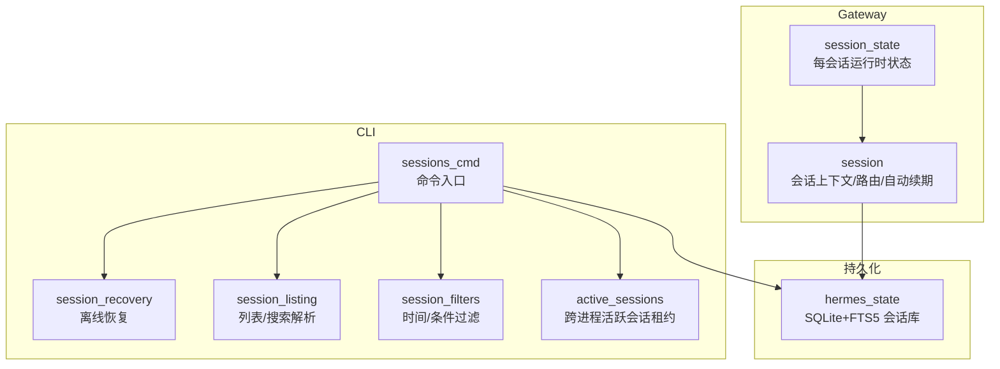
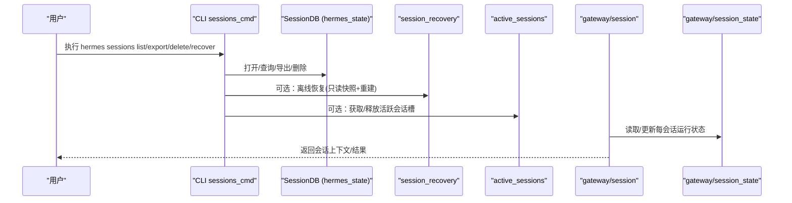
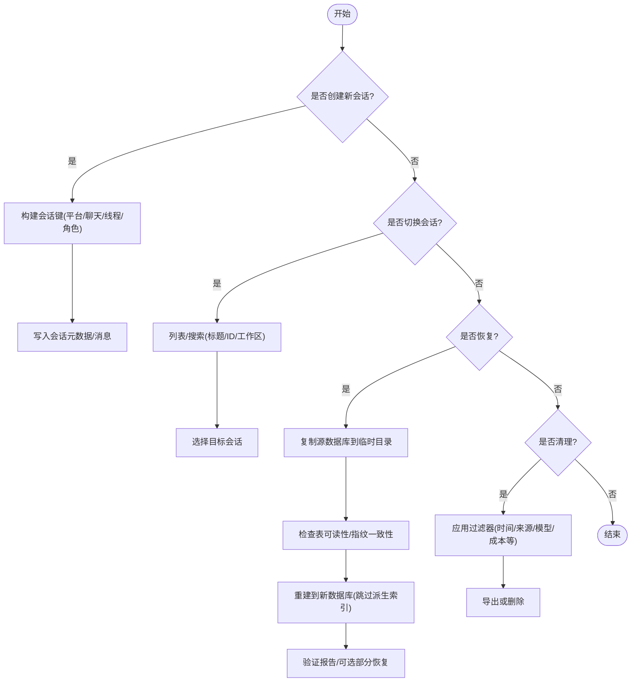
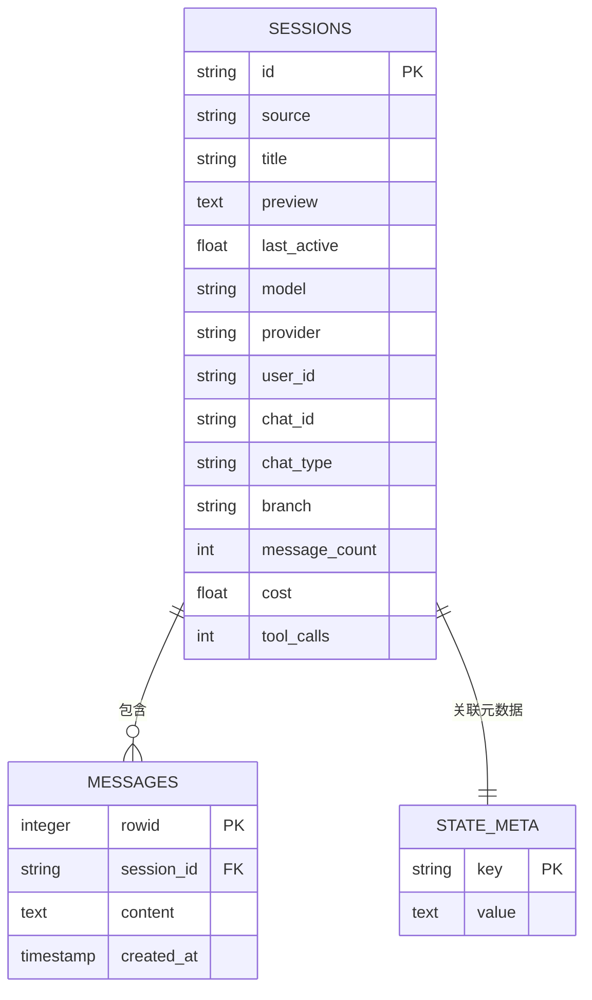
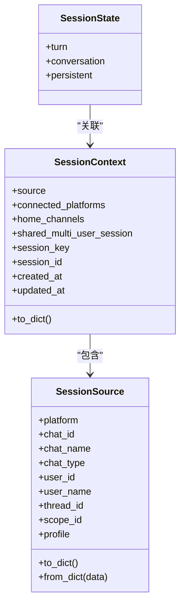
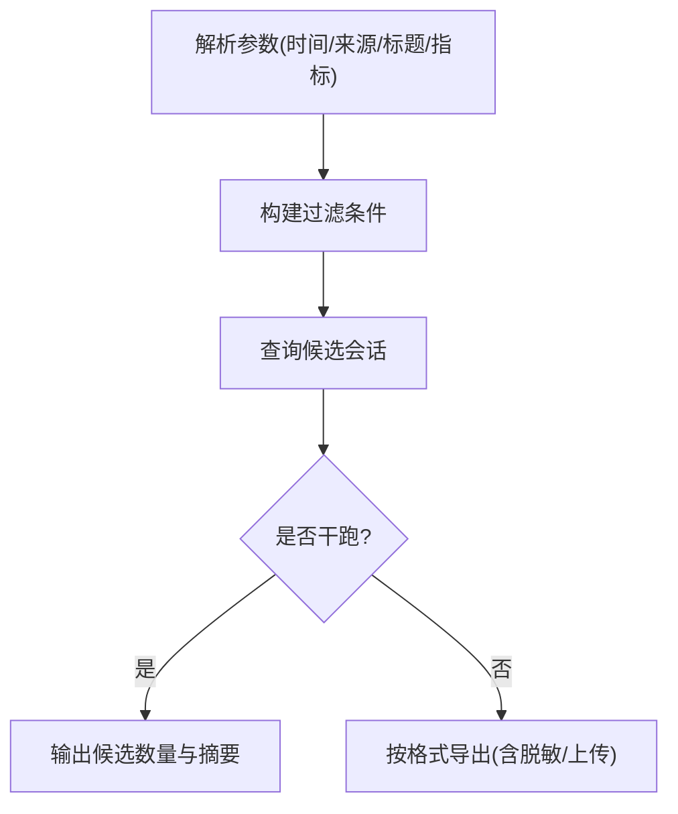
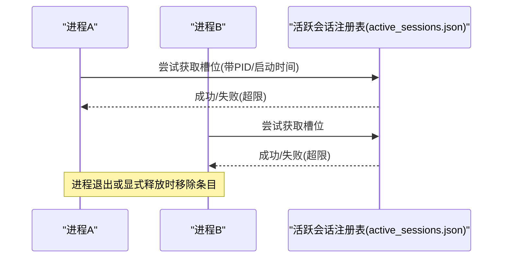
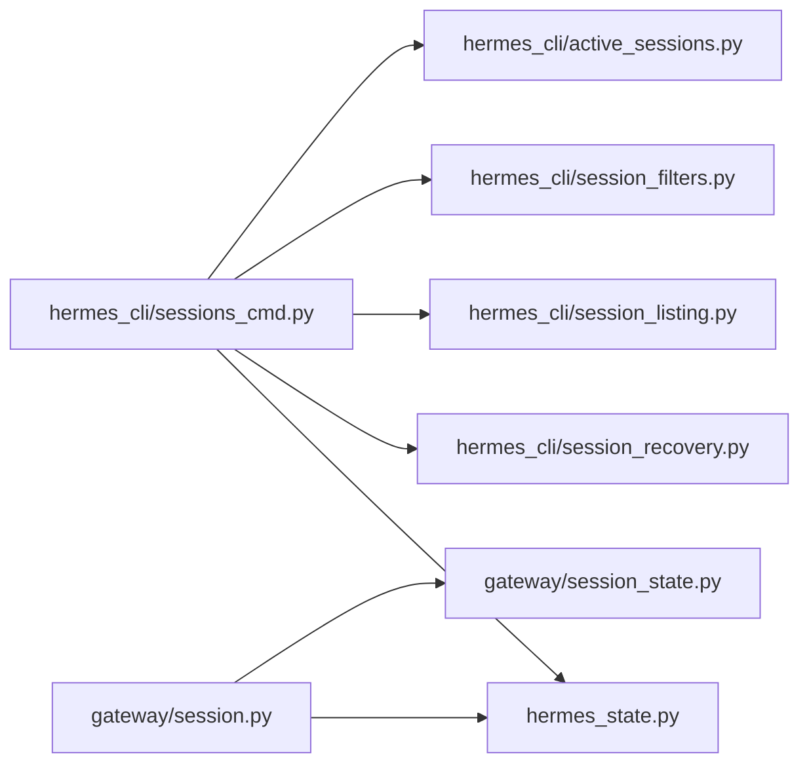

# 会话管理

<cite>
**本文引用的文件**
- [hermes_cli/sessions_cmd.py](file://hermes_cli/sessions_cmd.py)
- [hermes_cli/session_recovery.py](file://hermes_cli/session_recovery.py)
- [hermes_cli/session_listing.py](file://hermes_cli/session_listing.py)
- [hermes_cli/session_filters.py](file://hermes_cli/session_filters.py)
- [hermes_cli/active_sessions.py](file://hermes_cli/active_sessions.py)
- [gateway/session.py](file://gateway/session.py)
- [gateway/session_state.py](file://gateway/session_state.py)
- [hermes_state.py](file://hermes_state.py)
</cite>

## 目录
1. [简介](#简介)
2. [项目结构](#项目结构)
3. [核心组件](#核心组件)
4. [架构总览](#架构总览)
5. [详细组件分析](#详细组件分析)
6. [依赖关系分析](#依赖关系分析)
7. [性能与扩展性](#性能与扩展性)
8. [故障排查指南](#故障排查指南)
9. [结论](#结论)
10. [附录：使用示例与开发指导](#附录使用示例与开发指导)

## 简介
本文件面向 Hermes CLI 的“会话管理”能力，系统性说明会话生命周期（创建、切换、恢复、清理）、存储结构与元数据管理、状态持久化、搜索与过滤、多会话并行处理、会话间隔离、权限控制、超时与自动清理机制，并提供可操作的使用示例与扩展开发指导（自定义存储后端与会话分析工具）。

## 项目结构
Hermes 的会话管理由 CLI 层、网关层与持久化层共同协作：
- CLI 层负责用户命令、导出/恢复、列表与过滤、活跃会话租约。
- 网关层负责会话上下文、路由、运行时状态与自动续期策略。
- 持久化层基于 SQLite + FTS5 提供会话元数据、消息历史、全文检索与压缩链。

**图表来源**
- [hermes_cli/sessions_cmd.py:58-233](file://hermes_cli/sessions_cmd.py#L58-L233)
- [hermes_cli/session_recovery.py:1-129](file://hermes_cli/session_recovery.py#L1-L129)
- [hermes_cli/session_listing.py:8-88](file://hermes_cli/session_listing.py#L8-L88)
- [hermes_cli/session_filters.py:82-180](file://hermes_cli/session_filters.py#L82-L180)
- [hermes_cli/active_sessions.py:271-334](file://hermes_cli/active_sessions.py#L271-L334)
- [gateway/session.py:1-121](file://gateway/session.py#L1-L121)
- [gateway/session_state.py:172-178](file://gateway/session_state.py#L172-L178)
- [hermes_state.py:1-15](file://hermes_state.py#L1-L15)

**章节来源**
- [hermes_cli/sessions_cmd.py:58-233](file://hermes_cli/sessions_cmd.py#L58-L233)
- [hermes_cli/session_recovery.py:1-129](file://hermes_cli/session_recovery.py#L1-L129)
- [hermes_cli/session_listing.py:8-88](file://hermes_cli/session_listing.py#L8-L88)
- [hermes_cli/session_filters.py:82-180](file://hermes_cli/session_filters.py#L82-L180)
- [hermes_cli/active_sessions.py:271-334](file://hermes_cli/active_sessions.py#L271-L334)
- [gateway/session.py:1-121](file://gateway/session.py#L1-L121)
- [gateway/session_state.py:172-178](file://gateway/session_state.py#L172-L178)
- [hermes_state.py:1-15](file://hermes_state.py#L1-L15)

## 核心组件
- 会话数据库与导出/恢复：通过 hermes_state 提供的 SessionDB 进行会话查询、导出、删除；通过 session_recovery 实现离线、非破坏性恢复。
- 会话列表与搜索：session_listing 提供统一解析与查询策略，支持按来源、标题、ID 搜索与限制数量。
- 会话过滤：session_filters 将用户友好的时间/条件参数转换为数据库过滤条件。
- 活跃会话租约：active_sessions 维护跨进程活跃会话槽位，防止并发过载。
- 网关会话上下文：gateway/session 定义会话来源、上下文注入、安全校验与自动续期窗口。
- 运行时状态：gateway/session_state 将每会话状态按“轮次/对话/持久”三层组织，避免边界漂移与竞态。

**章节来源**
- [hermes_state.py:1-15](file://hermes_state.py#L1-L15)
- [hermes_cli/session_recovery.py:1-129](file://hermes_cli/session_recovery.py#L1-L129)
- [hermes_cli/session_listing.py:8-88](file://hermes_cli/session_listing.py#L8-L88)
- [hermes_cli/session_filters.py:82-180](file://hermes_cli/session_filters.py#L82-L180)
- [hermes_cli/active_sessions.py:271-334](file://hermes_cli/active_sessions.py#L271-L334)
- [gateway/session.py:1-121](file://gateway/session.py#L1-L121)
- [gateway/session_state.py:172-178](file://gateway/session_state.py#L172-L178)

## 架构总览
下图展示 CLI 命令到持久化的调用路径，以及网关侧会话上下文与状态如何协同工作。

**图表来源**
- [hermes_cli/sessions_cmd.py:58-233](file://hermes_cli/sessions_cmd.py#L58-L233)
- [hermes_cli/session_recovery.py:357-378](file://hermes_cli/session_recovery.py#L357-L378)
- [hermes_cli/active_sessions.py:271-334](file://hermes_cli/active_sessions.py#L271-L334)
- [gateway/session.py:1-121](file://gateway/session.py#L1-L121)
- [gateway/session_state.py:172-178](file://gateway/session_state.py#L172-L178)

## 详细组件分析

### 会话生命周期管理（创建、切换、恢复、清理）
- 创建：CLI 通过 SessionDB 写入会话元数据与消息；网关在收到新消息时根据来源构建会话键并路由到对应会话。
- 切换：CLI 支持按 ID/标题/工作区筛选后选择目标会话；网关通过会话键区分不同聊天通道与线程。
- 恢复：提供离线恢复流程，复制源数据库及其 WAL/SHM/Journal 到临时目录，仅对副本进行可读性检查与数据重建，输出新的数据库供安装验证。
- 清理：支持按过滤器批量导出或删除；活跃会话租约会在进程退出或显式释放时回收；过期/损坏的条目会被修剪。

**图表来源**
- [hermes_cli/sessions_cmd.py:58-233](file://hermes_cli/sessions_cmd.py#L58-L233)
- [hermes_cli/session_recovery.py:240-378](file://hermes_cli/session_recovery.py#L240-L378)
- [hermes_cli/session_filters.py:82-180](file://hermes_cli/session_filters.py#L82-L180)

**章节来源**
- [hermes_cli/sessions_cmd.py:58-233](file://hermes_cli/sessions_cmd.py#L58-L233)
- [hermes_cli/session_recovery.py:240-378](file://hermes_cli/session_recovery.py#L240-L378)
- [hermes_cli/session_filters.py:82-180](file://hermes_cli/session_filters.py#L82-L180)

### 会话存储结构与元数据管理
- 存储介质：SQLite，WAL 模式，支持并发读与单写；FTS5 全文检索用于快速搜索。
- 会话元数据：包含来源、标题、预览、最后活跃时间、模型/提供者、用户/聊天标识、分支等。
- 消息历史：完整消息记录，支持导出为 JSONL/Markdown/HTML/Trace。
- 压缩与分片：压缩触发会话拆分，通过 parent_session_id 链管理。

**图表来源**
- [hermes_state.py:1-15](file://hermes_state.py#L1-L15)
- [hermes_cli/sessions_cmd.py:239-312](file://hermes_cli/sessions_cmd.py#L239-L312)

**章节来源**
- [hermes_state.py:1-15](file://hermes_state.py#L1-L15)
- [hermes_cli/sessions_cmd.py:239-312](file://hermes_cli/sessions_cmd.py#L239-L312)

### 会话状态持久化与自动续期
- 自动续期窗口：网关维护一个“自动继续新鲜度窗口”，断开的会话在窗口内可被自动恢复。
- 会话上下文：包含来源、连接平台、家庭频道、会话键/ID、创建/更新时间等，用于动态系统提示注入。
- 运行时状态：按轮次、对话、持久三层组织，避免边界漂移与竞态。

**图表来源**
- [gateway/session.py:148-310](file://gateway/session.py#L148-L310)
- [gateway/session_state.py:172-178](file://gateway/session_state.py#L172-L178)

**章节来源**
- [gateway/session.py:1-121](file://gateway/session.py#L1-L121)
- [gateway/session.py:148-310](file://gateway/session.py#L148-L310)
- [gateway/session_state.py:172-178](file://gateway/session_state.py#L172-L178)

### 会话搜索与过滤
- 列表与搜索：支持按来源、标题、ID、工作区、未命名会话显示等；支持 search/find 关键字解析。
- 过滤条件：支持 older_than/newer_than/before/after/source/title/end_reason/cwd/min/max 系列指标（消息数、token、成本、工具调用次数等）。
- 导出：支持 JSONL/Markdown/HTML/Trace 多种格式，并可上传或本地保存。

**图表来源**
- [hermes_cli/session_listing.py:8-88](file://hermes_cli/session_listing.py#L8-L88)
- [hermes_cli/session_filters.py:82-180](file://hermes_cli/session_filters.py#L82-L180)
- [hermes_cli/sessions_cmd.py:313-779](file://hermes_cli/sessions_cmd.py#L313-L779)

**章节来源**
- [hermes_cli/session_listing.py:8-88](file://hermes_cli/session_listing.py#L8-L88)
- [hermes_cli/session_filters.py:82-180](file://hermes_cli/session_filters.py#L82-L180)
- [hermes_cli/sessions_cmd.py:313-779](file://hermes_cli/sessions_cmd.py#L313-L779)

### 多会话并行处理与会话隔离
- 活跃会话租约：跨进程维护当前活跃会话槽位，达到上限时拒绝新请求并给出持有者信息。
- 会话键隔离：网关依据平台/聊天/线程/角色等维度生成唯一会话键，确保不同渠道互不干扰。
- 运行时状态隔离：每会话独立 Turn/Conversation/Persistent 状态，避免全局字典漂移。

**图表来源**
- [hermes_cli/active_sessions.py:271-334](file://hermes_cli/active_sessions.py#L271-L334)
- [hermes_cli/active_sessions.py:337-417](file://hermes_cli/active_sessions.py#L337-L417)

**章节来源**
- [hermes_cli/active_sessions.py:271-334](file://hermes_cli/active_sessions.py#L271-L334)
- [hermes_cli/active_sessions.py:337-417](file://hermes_cli/active_sessions.py#L337-L417)
- [gateway/session.py:100-146](file://gateway/session.py#L100-L146)
- [gateway/session_state.py:172-178](file://gateway/session_state.py#L172-L178)

### 权限控制与会话超时
- 权限控制：会话来源包含 role_authorized、delivered_via_upstream_relay 等信任信号；平台特定行为与工具可用性在会话上下文中注入。
- 会话超时：自动续期新鲜度窗口控制断开会话的恢复范围；活跃会话租约结合进程存活检测清理僵尸条目。

**章节来源**
- [gateway/session.py:148-310](file://gateway/session.py#L148-L310)
- [gateway/session.py:31-58](file://gateway/session.py#L31-L58)
- [hermes_cli/active_sessions.py:205-247](file://hermes_cli/active_sessions.py#L205-L247)

### 资源自动清理机制
- 活跃会话清理：进程退出或显式释放时移除条目；长期服务中定期清理孤儿租约。
- 数据库恢复：离线恢复过程中对源数据库保持只读，避免污染；输出新数据库前进行完整性验证。
- 导出后删除：支持导出成功后按策略删除原会话（需显式确认）。

**章节来源**
- [hermes_cli/active_sessions.py:390-417](file://hermes_cli/active_sessions.py#L390-L417)
- [hermes_cli/session_recovery.py:240-378](file://hermes_cli/session_recovery.py#L240-L378)
- [hermes_cli/sessions_cmd.py:648-745](file://hermes_cli/sessions_cmd.py#L648-L745)

## 依赖关系分析
- CLI 依赖 hermes_state 进行会话读写与导出；依赖 session_recovery 进行离线恢复；依赖 active_sessions 进行并发控制。
- 网关依赖 session 与 session_state 管理会话上下文与运行时状态；最终落盘到 hermes_state。
- 过滤与列表逻辑解耦，便于在不同界面复用。

**图表来源**
- [hermes_cli/sessions_cmd.py:58-233](file://hermes_cli/sessions_cmd.py#L58-L233)
- [hermes_cli/session_recovery.py:1-129](file://hermes_cli/session_recovery.py#L1-L129)
- [hermes_cli/session_listing.py:8-88](file://hermes_cli/session_listing.py#L8-L88)
- [hermes_cli/session_filters.py:82-180](file://hermes_cli/session_filters.py#L82-L180)
- [hermes_cli/active_sessions.py:271-334](file://hermes_cli/active_sessions.py#L271-L334)
- [gateway/session.py:1-121](file://gateway/session.py#L1-L121)
- [gateway/session_state.py:172-178](file://gateway/session_state.py#L172-L178)
- [hermes_state.py:1-15](file://hermes_state.py#L1-L15)

**章节来源**
- [hermes_cli/sessions_cmd.py:58-233](file://hermes_cli/sessions_cmd.py#L58-L233)
- [hermes_cli/session_recovery.py:1-129](file://hermes_cli/session_recovery.py#L1-L129)
- [hermes_cli/session_listing.py:8-88](file://hermes_cli/session_listing.py#L8-L88)
- [hermes_cli/session_filters.py:82-180](file://hermes_cli/session_filters.py#L82-L180)
- [hermes_cli/active_sessions.py:271-334](file://hermes_cli/active_sessions.py#L271-L334)
- [gateway/session.py:1-121](file://gateway/session.py#L1-L121)
- [gateway/session_state.py:172-178](file://gateway/session_state.py#L172-L178)
- [hermes_state.py:1-15](file://hermes_state.py#L1-L15)

## 性能与扩展性
- 并发与锁：SQLite WAL 提升并发读；活跃会话注册表使用文件锁保证跨进程一致。
- 恢复性能：离线恢复采用分块拷贝与行号范围二分，避免全表扫描；跳过派生索引重建，降低开销。
- 可扩展点：
  - 自定义存储后端：可通过 hermes_state 的接口扩展（如替换底层存储或增加索引），注意兼容 FTS5 与迁移脚本。
  - 会话分析工具：基于导出与 Trace 格式，构建统计、审计与可视化。
  - 过滤扩展：在 session_filters 中新增字段映射，并在 CLI 暴露相应参数。

[本节为通用指导，不直接分析具体文件]

## 故障排查指南
- 数据库不可用：优先使用修复命令检查并修复 schema；若失败，使用离线恢复生成新数据库并验证。
- 活跃会话超限：查看活跃会话注册表，识别占用者；必要时终止空闲进程或调整最大并发配置。
- 恢复失败：检查磁盘空间、源数据库完整性、工作目录与输出路径保护规则；阅读恢复报告中的跳过范围与错误。

**章节来源**
- [hermes_cli/sessions_cmd.py:67-120](file://hermes_cli/sessions_cmd.py#L67-L120)
- [hermes_cli/session_recovery.py:91-129](file://hermes_cli/session_recovery.py#L91-L129)
- [hermes_cli/active_sessions.py:99-114](file://hermes_cli/active_sessions.py#L99-L114)

## 结论
Hermes CLI 的会话管理以“CLI 命令 + 网关上下文 + SQLite/FTS5 持久化”为核心，提供了健壮的创建、切换、恢复与清理能力；通过活跃会话租约与网关会话键实现多会话并行与隔离；丰富的过滤与导出能力支撑运维与审计；离线恢复保障数据韧性。开发者可在现有扩展点上定制存储后端与分析工具，进一步提升系统能力。

[本节为总结，不直接分析具体文件]

## 附录：使用示例与开发指导

### 常用命令示例
- 列出会话：
  - 基本列表：`hermes sessions list`
  - 按工作区筛选：`hermes sessions list --workspace <repo-or-dir>`
  - 显示未命名会话：`hermes sessions list --full`
- 搜索特定会话：
  - 通过 `/sessions search <关键词>` 或 CLI 的标题/来源过滤组合。
- 恢复断开会话：
  - 检查可恢复性：`hermes sessions recover --source <path> --inspect-only`
  - 重建新数据库：`hermes sessions recover --source <path> --output recovered-state.db`
- 导出会话：
  - JSONL：`hermes sessions export --format jsonl --output out.jsonl`
  - Markdown：`hermes sessions export --format md --output ./exports`
  - HTML：`hermes sessions export --format html --output report.html`
  - Trace：`hermes sessions export --format trace --upload`（默认脱敏）

**章节来源**
- [hermes_cli/sessions_cmd.py:239-312](file://hermes_cli/sessions_cmd.py#L239-L312)
- [hermes_cli/sessions_cmd.py:313-779](file://hermes_cli/sessions_cmd.py#L313-L779)
- [hermes_cli/sessions_cmd.py:122-225](file://hermes_cli/sessions_cmd.py#L122-L225)

### 开发指导：自定义存储后端
- 目标：在不破坏现有 CLI/Gateway 行为的前提下，替换或增强会话存储。
- 步骤建议：
  - 在 hermes_state 中实现新的存储适配器，保持对外 API 一致（会话增删改查、导出、FTS 兼容）。
  - 在 session_recovery 中适配新存储的快照与拷贝策略，确保离线恢复安全。
  - 在 session_filters 中为新字段添加过滤映射与描述。
  - 在 active_sessions 中如需分布式锁，可替换文件锁为远程锁服务。
- 注意事项：
  - 保持 WAL 模式与并发读语义。
  - 保留 FTS5 或等效全文检索能力。
  - 确保迁移脚本与 schema 版本兼容。

**章节来源**
- [hermes_state.py:1-15](file://hermes_state.py#L1-L15)
- [hermes_cli/session_recovery.py:240-378](file://hermes_cli/session_recovery.py#L240-L378)
- [hermes_cli/session_filters.py:82-180](file://hermes_cli/session_filters.py#L82-L180)
- [hermes_cli/active_sessions.py:129-180](file://hermes_cli/active_sessions.py#L129-L180)

### 开发指导：会话分析工具
- 输入：JSONL/Markdown/HTML/Trace 导出文件。
- 能力：
  - 统计：会话数量、消息量、Token/成本分布、工具调用频次。
  - 审计：敏感信息脱敏校验、异常会话定位。
  - 可视化：会话树、时间线、来源分布。
- 集成：通过 CLI 导出接口接入自动化流水线，定时生成报告。

**章节来源**
- [hermes_cli/sessions_cmd.py:313-779](file://hermes_cli/sessions_cmd.py#L313-L779)