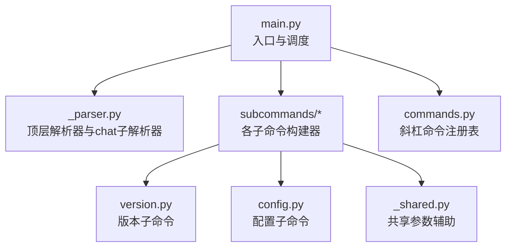
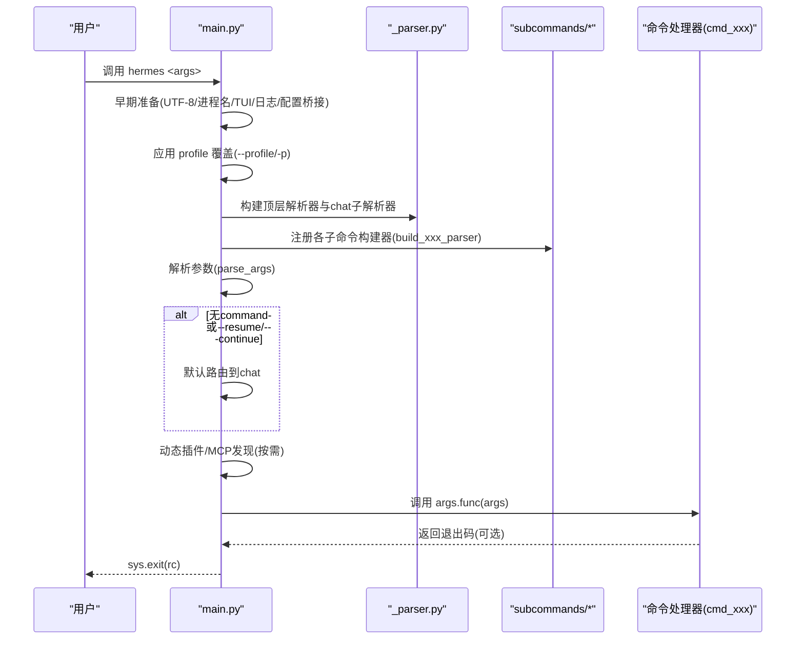
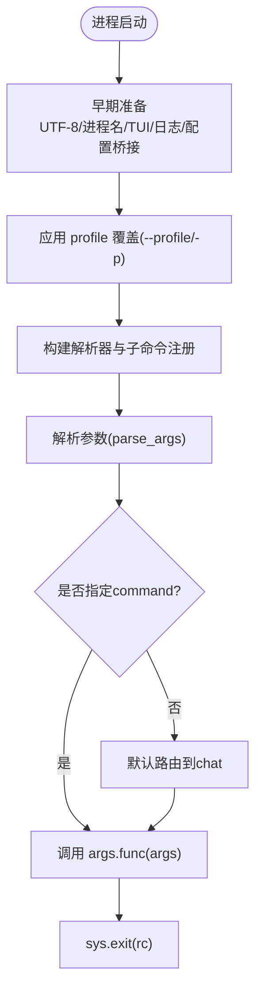
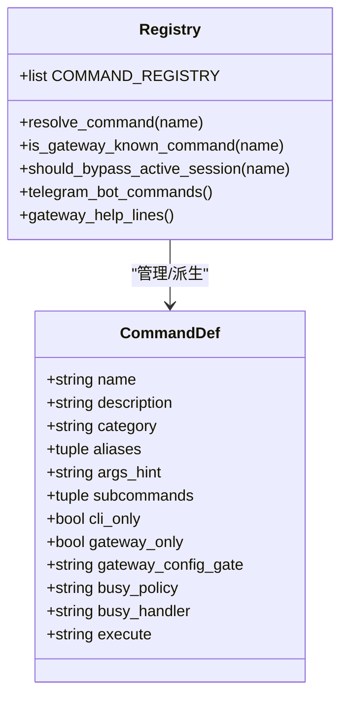
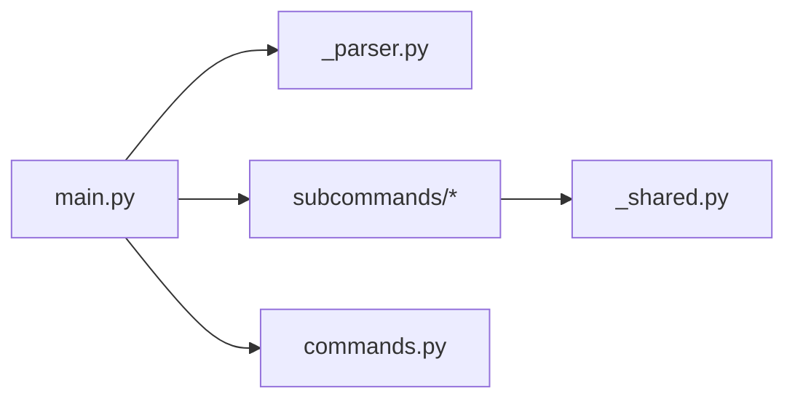

# 命令系统架构

<cite>
**本文引用的文件**
- [hermes_cli/main.py](file://hermes_cli/main.py)
- [hermes_cli/_parser.py](file://hermes_cli/_parser.py)
- [hermes_cli/commands.py](file://hermes_cli/commands.py)
- [hermes_cli/subcommands/version.py](file://hermes_cli/subcommands/version.py)
- [hermes_cli/subcommands/config.py](file://hermes_cli/subcommands/config.py)
- [hermes_cli/subcommands/_shared.py](file://hermes_cli/subcommands/_shared.py)
</cite>

## 目录
1. [简介](#简介)
2. [项目结构](#项目结构)
3. [核心组件](#核心组件)
4. [架构总览](#架构总览)
5. [详细组件分析](#详细组件分析)
6. [依赖关系分析](#依赖关系分析)
7. [性能考量](#性能考量)
8. [故障排查指南](#故障排查指南)
9. [结论](#结论)
10. [附录：扩展指南与最佳实践](#附录扩展指南与最佳实践)

## 简介
本文件系统性阐述 Hermes CLI 的命令系统架构，覆盖命令解析器设计、主命令注册机制、子命令发现与管理、参数验证流程、argparse 使用方式、命令别名支持、动态命令加载机制，以及从参数解析到命令执行的完整生命周期。文档同时提供添加新命令、定义参数与选项、处理命令结果的具体示例路径，并解释命令间的依赖与共享功能（错误处理、日志记录、配置加载等），为开发者扩展命令系统提供规范与最佳实践。

## 项目结构
Hermes CLI 的命令系统由“顶层入口 + 顶层解析器 + 子命令构建器 + 斜杠命令注册表”组成：
- 顶层入口与调度：hermes_cli/main.py
- 顶层解析器与 chat 子解析器：hermes_cli/_parser.py
- 子命令构建器：hermes_cli/subcommands/*（每个子命令组一个模块）
- 斜杠命令注册表（用于网关/平台/帮助等）：hermes_cli/commands.py

图表来源
- [hermes_cli/main.py:10645-10844](file://hermes_cli/main.py#L10645-L10844)
- [hermes_cli/_parser.py:87-300](file://hermes_cli/_parser.py#L87-L300)
- [hermes_cli/subcommands/version.py:12-19](file://hermes_cli/subcommands/version.py#L12-L19)
- [hermes_cli/subcommands/config.py:12-69](file://hermes_cli/subcommands/config.py#L12-L69)
- [hermes_cli/subcommands/_shared.py:15-30](file://hermes_cli/subcommands/_shared.py#L15-L30)

章节来源
- [hermes_cli/main.py:10645-10844](file://hermes_cli/main.py#L10645-L10844)
- [hermes_cli/_parser.py:87-300](file://hermes_cli/_parser.py#L87-L300)
- [hermes_cli/subcommands/version.py:12-19](file://hermes_cli/subcommands/version.py#L12-L19)
- [hermes_cli/subcommands/config.py:12-69](file://hermes_cli/subcommands/config.py#L12-L69)
- [hermes_cli/subcommands/_shared.py:15-30](file://hermes_cli/subcommands/_shared.py#L15-L30)

## 核心组件
- 顶层入口与启动流程（main.py）
  - 负责早期环境准备（UTF-8、进程名、TUI 快速判断）、配置文件桥接、日志初始化、插件/MCP 发现、容器模式路由、argparse 解析与分发执行。
  - 关键职责：
    - 应用 profile 覆盖（--profile/-p）并在 argparse 前设置 HERMES_HOME。
    - 早期读取配置以桥接安全/网络开关（如 redact_secrets、force_ipv4）。
    - 统一日志初始化（CLI/GUI 模式）。
    - 动态插件与平台命令发现（按需延迟导入，避免冷启动开销）。
    - 解析参数后按 command 分发到对应 cmd_* 处理器。
- 顶层解析器（_parser.py）
  - 构建顶层 ArgumentParser 与 chat 子解析器，集中声明可继承的顶层标志（如 --model/--provider/--reasoning 等），并通过 _inherited_flag 标记以便 relaunch 时携带。
  - 通过 subparsers.add_parser("chat", ...) 创建 chat 子命令解析器，并将重复标志在子解析器中设为 SUPPRESS，避免覆盖顶层值。
- 子命令构建器（subcommands/*）
  - 每个子命令组提供一个 build_xxx_parser(subparsers, ...) 函数，向顶层 subparsers 注册子命令及子子命令，并绑定 func=cmd_xxx。
  - 共享参数（如 --accept-hooks）通过 _shared.add_accept_hooks_flag 注入，保证跨子命令一致行为。
- 斜杠命令注册表（commands.py）
  - 集中维护 COMMAND_REGISTRY，描述所有斜杠命令的名称、描述、分类、别名、子命令、可用范围（cli_only/gateway_only）、忙时策略（busy_policy）等。
  - 提供 resolve_command、is_gateway_known_command、telegram_bot_commands、gateway_help_lines 等派生能力，供网关、Telegram、Slack、帮助系统等消费。

章节来源
- [hermes_cli/main.py:10645-10844](file://hermes_cli/main.py#L10645-L10844)
- [hermes_cli/_parser.py:87-300](file://hermes_cli/_parser.py#L87-L300)
- [hermes_cli/subcommands/_shared.py:15-30](file://hermes_cli/subcommands/_shared.py#L15-L30)
- [hermes_cli/commands.py:46-95](file://hermes_cli/commands.py#L46-L95)
- [hermes_cli/commands.py:102-345](file://hermes_cli/commands.py#L102-L345)
- [hermes_cli/commands.py:352-403](file://hermes_cli/commands.py#L352-L403)
- [hermes_cli/commands.py:422-500](file://hermes_cli/commands.py#L422-L500)
- [hermes_cli/commands.py:552-600](file://hermes_cli/commands.py#L552-L600)

## 架构总览
下图展示从命令行输入到命令执行的端到端流程，包括参数解析、动态命令发现、分发执行与退出码传播。

图表来源
- [hermes_cli/main.py:12516-12658](file://hermes_cli/main.py#L12516-L12658)
- [hermes_cli/_parser.py:87-300](file://hermes_cli/_parser.py#L87-L300)
- [hermes_cli/subcommands/version.py:12-19](file://hermes_cli/subcommands/version.py#L12-L19)
- [hermes_cli/subcommands/config.py:12-69](file://hermes_cli/subcommands/config.py#L12-L69)

章节来源
- [hermes_cli/main.py:12516-12658](file://hermes_cli/main.py#L12516-L12658)
- [hermes_cli/_parser.py:87-300](file://hermes_cli/_parser.py#L87-L300)

## 详细组件分析

### 顶层入口与调度（main.py）
- 启动阶段
  - 早期 UTF-8 兼容、进程名设置、TUI 快速判断、venv 自愈、配置文件桥接、日志初始化。
  - 应用 profile 覆盖（--profile/-p），在 argparse 之前设置 HERMES_HOME，并从 argv 剥离该标志。
- 子命令注册
  - 通过 import 各子命令组的 build_xxx_parser 函数，将子命令注册到顶层 subparsers；每个子命令最终 set_defaults(func=cmd_xxx)。
  - 对复杂子命令（如 secrets、egress、migrate、sessions 等）采用子子命令与分派函数组合。
- 参数解析与分发
  - 预处理 argv（合并多词会话名、容器模式路由、防御性 subparsers.required 调整）。
  - parse_args 后处理 --version、--yolo、--oneshot、--resume/--continue 快捷路由。
  - 若未指定 command，则默认进入 chat。
  - 调用 args.func(args)，并将返回值作为进程退出码。
- 动态命令加载
  - 基于 _first_positional_argv 与 _BUILTIN_SUBCOMMANDS 集合，决定是否进行插件发现，减少冷启动开销。
  - 对平台命令采用延迟注册（deferred platform CLI command），仅在需要时触发导入。

图表来源
- [hermes_cli/main.py:10645-10844](file://hermes_cli/main.py#L10645-L10844)
- [hermes_cli/main.py:12516-12658](file://hermes_cli/main.py#L12516-L12658)

章节来源
- [hermes_cli/main.py:10645-10844](file://hermes_cli/main.py#L10645-L10844)
- [hermes_cli/main.py:12516-12658](file://hermes_cli/main.py#L12516-L12658)

### 顶层解析器与 chat 子解析器（_parser.py）
- 顶层 ArgumentParser
  - 定义全局标志：--version、--oneshot、--usage-file、--model/--provider、--reasoning、--toolsets、--resume/--continue、--worktree、--accept-hooks、--skills、--yolo、--pass-session-id、--ignore-user-config、--ignore-rules、--safe-mode、--tui/--cli/--dev 等。
  - 通过 _inherited_flag 标记某些标志在 relaunch 时自动携带。
- chat 子解析器
  - 提供 -q/--query、--image、--verbose、--quiet、--resume/-r、--no-restore-cwd、--in、--continue/-c、--worktree、--checkpoints、--max-turns 等参数。
  - 对与顶层同名的标志使用 default=argparse.SUPPRESS，避免覆盖顶层已设置的值。
- 子命令注册点
  - 通过 subparsers.add_subparsers(dest="command") 创建子命令空间，后续由 main.py 在各子命令组中注册具体子命令。

章节来源
- [hermes_cli/_parser.py:87-300](file://hermes_cli/_parser.py#L87-L300)
- [hermes_cli/_parser.py:293-504](file://hermes_cli/_parser.py#L293-L504)

### 子命令构建器与共享参数（subcommands/*）
- 版本子命令（version.py）
  - 注册 hermes version，绑定 cmd_version。
- 配置子命令（config.py）
  - 注册 hermes config 及其子命令 show/edit/get/set/unset/path/env-path/check/migrate，并绑定 cmd_config。
- 共享参数（_shared.py）
  - add_accept_hooks_flag 为任意子解析器注入 --accept-hooks，确保跨子命令一致行为。

章节来源
- [hermes_cli/subcommands/version.py:12-19](file://hermes_cli/subcommands/version.py#L12-L19)
- [hermes_cli/subcommands/config.py:12-69](file://hermes_cli/subcommands/config.py#L12-L69)
- [hermes_cli/subcommands/_shared.py:15-30](file://hermes_cli/subcommands/_shared.py#L15-L30)

### 斜杠命令注册表（commands.py）
- CommandDef 数据模型
  - name、description、category、aliases、args_hint、subcommands、cli_only、gateway_only、gateway_config_gate、busy_policy、busy_handler、execute。
- 中央注册表 COMMAND_REGISTRY
  - 集中声明所有斜杠命令，包含别名、子命令提示、忙时策略、执行器键等。
- 派生查找与工具
  - resolve_command(name)：解析名称或别名到 CommandDef。
  - is_gateway_known_command(name)：判断是否为网关可分派的斜杠命令（含插件命令）。
  - should_bypass_active_session(command_name)：识别应绕过活动会话的斜杠命令。
  - telegram_bot_commands() / gateway_help_lines()：生成 Telegram BotCommands 与帮助行。
  - _resolve_config_gates()：根据配置门控决定命令可用性。

图表来源
- [hermes_cli/commands.py:46-95](file://hermes_cli/commands.py#L46-L95)
- [hermes_cli/commands.py:102-345](file://hermes_cli/commands.py#L102-L345)
- [hermes_cli/commands.py:352-403](file://hermes_cli/commands.py#L352-L403)
- [hermes_cli/commands.py:422-500](file://hermes_cli/commands.py#L422-L500)
- [hermes_cli/commands.py:552-600](file://hermes_cli/commands.py#L552-L600)

章节来源
- [hermes_cli/commands.py:46-95](file://hermes_cli/commands.py#L46-L95)
- [hermes_cli/commands.py:102-345](file://hermes_cli/commands.py#L102-L345)
- [hermes_cli/commands.py:352-403](file://hermes_cli/commands.py#L352-L403)
- [hermes_cli/commands.py:422-500](file://hermes_cli/commands.py#L422-L500)
- [hermes_cli/commands.py:552-600](file://hermes_cli/commands.py#L552-L600)

## 依赖关系分析
- main.py 依赖
  - _parser.py：顶层解析器与 chat 子解析器。
  - subcommands/*：各子命令构建器，向 subparsers 注册子命令并绑定 func。
  - commands.py：斜杠命令注册表（主要用于网关/平台/帮助等场景）。
  - 其他模块：日志、配置、插件、MCP、容器模式等。
- 子命令构建器之间解耦
  - 通过统一的 build_xxx_parser(subparsers, ...) 接口注册，降低耦合度。
  - 共享参数通过 _shared.py 暴露，避免重复实现。
- 动态加载
  - 插件与平台命令按需发现与延迟注册，减少启动时间。
  - 对未知顶级命令进行慢路径处理，必要时触发插件发现。

图表来源
- [hermes_cli/main.py:10645-10844](file://hermes_cli/main.py#L10645-L10844)
- [hermes_cli/_parser.py:87-300](file://hermes_cli/_parser.py#L87-L300)
- [hermes_cli/subcommands/_shared.py:15-30](file://hermes_cli/subcommands/_shared.py#L15-L30)

章节来源
- [hermes_cli/main.py:10645-10844](file://hermes_cli/main.py#L10645-L10844)
- [hermes_cli/_parser.py:87-300](file://hermes_cli/_parser.py#L87-L300)
- [hermes_cli/subcommands/_shared.py:15-30](file://hermes_cli/subcommands/_shared.py#L15-L30)

## 性能考量
- 启动优化
  - 早期 TUI 判断与鼠标残留抑制，避免不必要的 UI 初始化。
  - 仅当检测到可能调用插件命令时才进行插件发现（_plugin_cli_discovery_needed）。
  - 平台命令延迟注册，避免导入所有平台 SDK。
- 解析优化
  - 对已知子命令启用 subparsers.required=True 的防御性路由，减少误判。
  - 合并多词会话名参数，减少解析歧义。
- I/O 与配置
  - 早期读取配置并缓存，减少多次 YAML 解析。
  - 日志初始化尽早完成，确保全链路可观测。

[本节为通用性能讨论，不直接分析具体文件]

## 故障排查指南
- 常见问题定位
  - 子命令未识别：检查是否在 main.py 中正确注册 build_xxx_parser，并确保 set_defaults(func=...) 绑定到处理器。
  - 参数冲突：确认顶层与子解析器同名标志使用 default=argparse.SUPPRESS，避免覆盖顶层值。
  - 插件命令不可用：确认 _plugin_cli_discovery_needed 逻辑与平台命令延迟注册是否正确触发。
  - 退出码异常：确保命令处理器返回 int 类型退出码，main.py 会将其传播至 sys.exit。
- 调试建议
  - 使用 hermes --help 与各子命令 --help 验证参数定义。
  - 在 main.py 的 parse_args 前后打印 argv 与 args，定位解析问题。
  - 检查日志文件（agent.log/errors.log）获取早期错误信息。

章节来源
- [hermes_cli/main.py:12516-12658](file://hermes_cli/main.py#L12516-L12658)
- [hermes_cli/_parser.py:293-504](file://hermes_cli/_parser.py#L293-L504)

## 结论
Hermes CLI 的命令系统以 main.py 为核心，结合 _parser.py 的顶层解析器与 subcommands/* 的子命令构建器，形成清晰的分层与解耦架构。通过动态插件发现与延迟注册，系统在保持强大扩展性的同时兼顾启动性能。commands.py 的斜杠命令注册表为网关与多平台提供了统一的命令元数据源。遵循本文档的扩展指南与最佳实践，开发者可以高效地添加新命令、定义参数与选项、处理命令结果，并复用共享功能。

[本节为总结性内容，不直接分析具体文件]

## 附录：扩展指南与最佳实践

### 如何添加新命令
- 步骤
  1. 在 hermes_cli/subcommands/ 下新建模块（例如 my_cmd.py），实现 build_my_cmd_parser(subparsers, ...)。
  2. 在该函数中：
     - 使用 subparsers.add_parser("my_cmd", help="...") 注册子命令。
     - 如需子子命令，继续 add_subparsers 并注册。
     - 使用 parser.set_defaults(func=cmd_my_cmd) 绑定处理器。
  3. 在 main.py 中 import 并调用 build_my_cmd_parser(subparsers, ...)。
  4. 在命令处理器中返回 int 退出码（可选），main.py 会传播至 sys.exit。
- 参考示例路径
  - 版本子命令：[hermes_cli/subcommands/version.py:12-19](file://hermes_cli/subcommands/version.py#L12-L19)
  - 配置子命令：[hermes_cli/subcommands/config.py:12-69](file://hermes_cli/subcommands/config.py#L12-L69)

章节来源
- [hermes_cli/subcommands/version.py:12-19](file://hermes_cli/subcommands/version.py#L12-L19)
- [hermes_cli/subcommands/config.py:12-69](file://hermes_cli/subcommands/config.py#L12-L69)
- [hermes_cli/main.py:10645-10844](file://hermes_cli/main.py#L10645-L10844)

### 定义参数与选项
- 顶层参数
  - 在 _parser.py 中通过 parser.add_argument(...) 定义，并使用 _inherited_flag 标记可在 relaunch 时携带的参数。
  - 对于与子解析器同名的参数，使用 default=argparse.SUPPRESS 避免覆盖顶层值。
- 子命令参数
  - 在对应子命令构建器中使用 add_argument(...) 定义位置参数与选项。
  - 共享参数（如 --accept-hooks）通过 _shared.add_accept_hooks_flag 注入。
- 参考示例路径
  - 顶层参数与 chat 子解析器：[hermes_cli/_parser.py:87-300](file://hermes_cli/_parser.py#L87-L300)
  - 共享参数：[hermes_cli/subcommands/_shared.py:15-30](file://hermes_cli/subcommands/_shared.py#L15-L30)

章节来源
- [hermes_cli/_parser.py:87-300](file://hermes_cli/_parser.py#L87-L300)
- [hermes_cli/subcommands/_shared.py:15-30](file://hermes_cli/subcommands/_shared.py#L15-L30)

### 处理命令结果
- 返回值约定
  - 命令处理器返回 None 表示成功（exit 0）。
  - 返回 int 非零表示失败，main.py 会调用 sys.exit(rc)。
- 参考路径
  - 分发与退出码传播：[hermes_cli/main.py:12643-12658](file://hermes_cli/main.py#L12643-L12658)

章节来源
- [hermes_cli/main.py:12643-12658](file://hermes_cli/main.py#L12643-L12658)

### 命令间依赖与共享功能
- 错误处理
  - 主入口捕获异常并输出到日志；命令处理器内部应妥善处理异常并返回合适的退出码。
- 日志记录
  - 通过 hermes_logging.setup_logging 初始化日志；命令处理器可使用标准 logging 模块。
- 配置加载
  - 通过 hermes_cli.config 提供的 read_raw_config/load_config 等接口读取配置；注意早期桥接与缓存。
- 参考路径
  - 日志初始化：[hermes_cli/main.py:746-763](file://hermes_cli/main.py#L746-L763)
  - 配置桥接与缓存：[hermes_cli/main.py:702-745](file://hermes_cli/main.py#L702-L745)

章节来源
- [hermes_cli/main.py:702-763](file://hermes_cli/main.py#L702-L763)

### 动态命令加载机制
- 插件发现
  - 基于 _first_positional_argv 与 _BUILTIN_SUBCOMMANDS 判断是否需要插件发现，减少冷启动开销。
- 平台命令延迟注册
  - 平台命令通过 platform_registry.get(name) 延迟导入，仅在需要时生效。
- 参考路径
  - 插件发现决策：[hermes_cli/main.py:10735-10753](file://hermes_cli/main.py#L10735-L10753)
  - 平台命令延迟注册：[hermes_cli/main.py:10756-10783](file://hermes_cli/main.py#L10756-L10783)

章节来源
- [hermes_cli/main.py:10735-10753](file://hermes_cli/main.py#L10735-L10753)
- [hermes_cli/main.py:10756-10783](file://hermes_cli/main.py#L10756-L10783)

### 最佳实践
- 保持子命令构建器独立且可测试，避免在构建期引入重依赖。
- 使用 _inherited_flag 标记需要在 relaunch 时携带的参数，确保一致性。
- 对复杂子命令使用子子命令与分派函数组合，提升可读性与可维护性。
- 在命令处理器中明确返回退出码，便于上层脚本集成。
- 复用 _shared.py 中的共享参数，避免重复实现。
- 谨慎使用动态加载，确保在需要时才触发插件/平台导入。

[本节为通用指导，不直接分析具体文件]