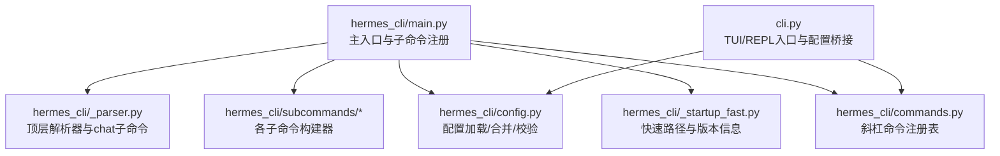
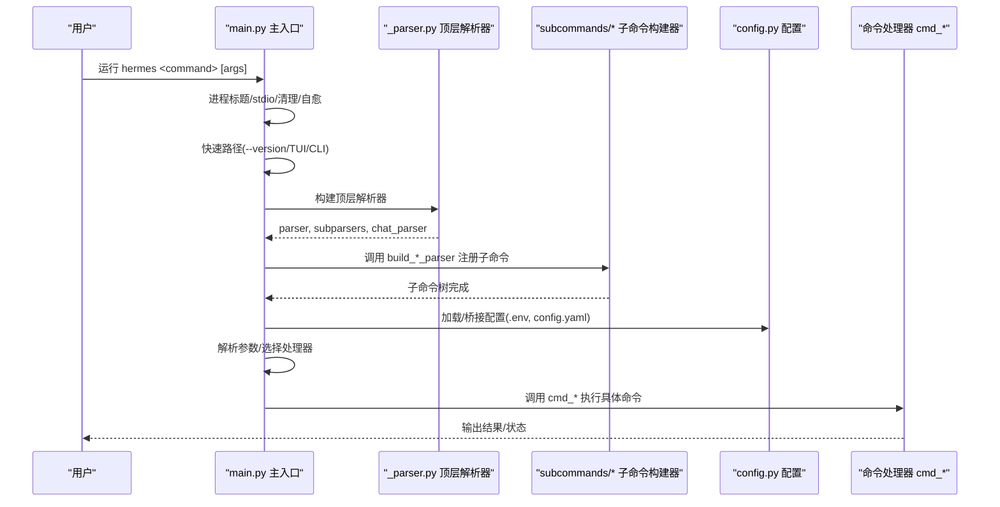
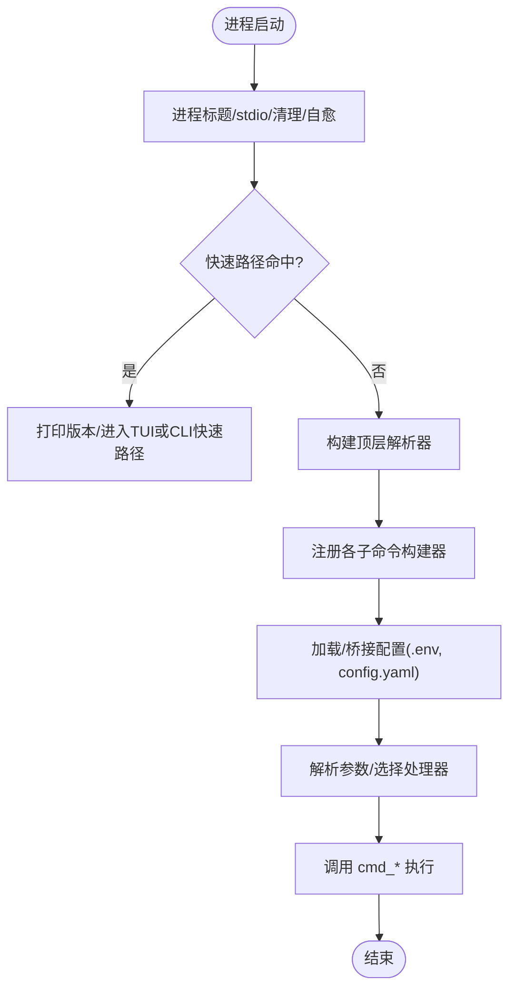
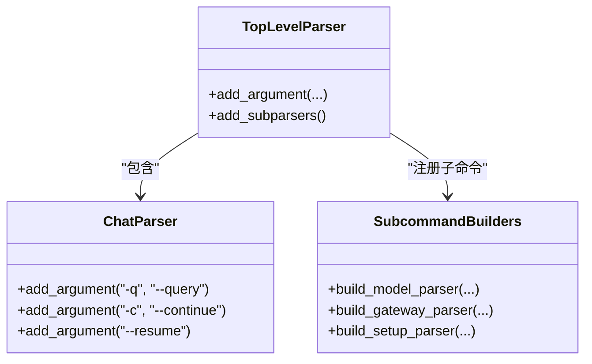
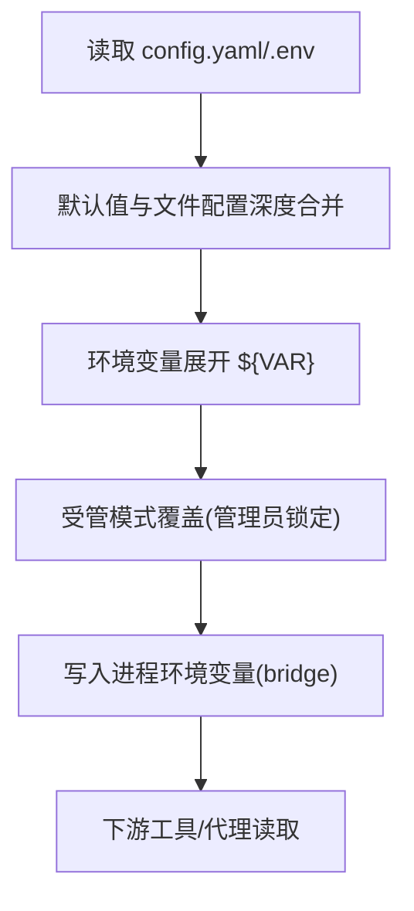
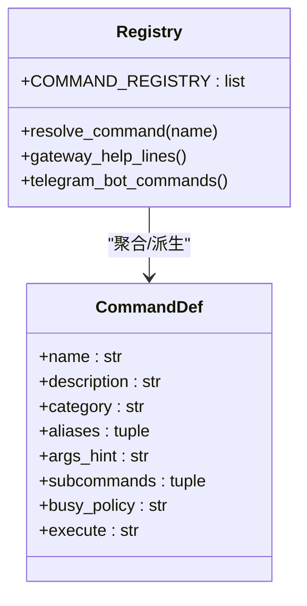
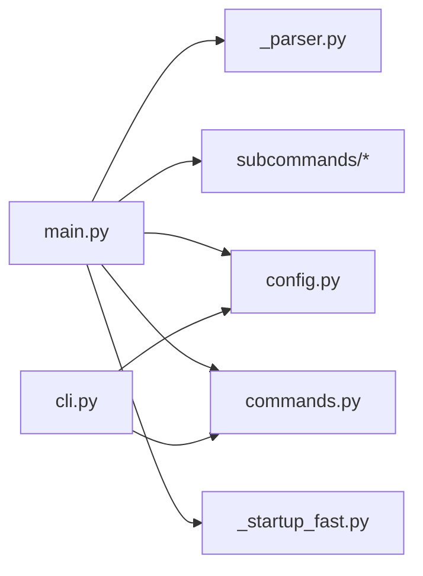

# 命令行界面架构

<cite>
**本文引用的文件**
- [hermes_cli/main.py](file://hermes_cli/main.py)
- [hermes_cli/_parser.py](file://hermes_cli/_parser.py)
- [hermes_cli/config.py](file://hermes_cli/config.py)
- [hermes_cli/commands.py](file://hermes_cli/commands.py)
- [hermes_cli/_startup_fast.py](file://hermes_cli/_startup_fast.py)
- [hermes_cli/subcommands/_shared.py](file://hermes_cli/subcommands/_shared.py)
- [cli.py](file://cli.py)
</cite>

## 目录
1. [简介](#简介)
2. [项目结构](#项目结构)
3. [核心组件](#核心组件)
4. [架构总览](#架构总览)
5. [详细组件分析](#详细组件分析)
6. [依赖关系分析](#依赖关系分析)
7. [性能考量](#性能考量)
8. [故障排查指南](#故障排查指南)
9. [结论](#结论)
10. [附录：使用示例与扩展指南](#附录使用示例与扩展指南)

## 简介
本文件系统性梳理 Hermes CLI 的接口架构，覆盖命令解析、子命令系统、配置管理、用户交互流程、主入口启动流程、命令注册机制、参数验证与错误处理。文档还说明 CLI 与代理核心的集成方式、配置加载与验证过程、用户输入处理管道，并提供常见命令的使用示例以及扩展 CLI 功能（自定义命令与插件）的指导。

## 项目结构
Hermes CLI 采用“顶层入口 + 子命令分组”的组织方式：
- 顶层入口 hermes_cli/main.py 负责进程初始化、快速路径优化、日志与配置桥接、子命令注册与分发。
- 顶层解析器定义在 hermes_cli/_parser.py，集中声明全局选项与 chat 子命令。
- 子命令按功能分组，各自模块提供 build_<group>_parser 函数，由 main 组装到统一子命令树。
- 配置管理集中在 hermes_cli/config.py，提供加载、合并、校验、备份与受管模式支持。
- 斜杠命令（运行时 /cmd）通过 hermes_cli/commands.py 的中央注册表统一管理，供 CLI、网关、平台等消费。
- 早期启动优化在 hermes_cli/_startup_fast.py，避免重依赖导入导致的冷启动延迟。
- cli.py 是交互式 TUI/REPL 入口之一，承载会话级配置桥接与环境变量映射。

**图表来源**
- [hermes_cli/main.py:11231-11500](file://hermes_cli/main.py#L11231-L11500)
- [hermes_cli/_parser.py:87-503](file://hermes_cli/_parser.py#L87-L503)
- [hermes_cli/config.py:1-16](file://hermes_cli/config.py#L1-L16)
- [hermes_cli/commands.py:1-10](file://hermes_cli/commands.py#L1-L10)
- [hermes_cli/_startup_fast.py:1-24](file://hermes_cli/_startup_fast.py#L1-L24)
- [cli.py:1-13](file://cli.py#L1-L13)

**章节来源**
- [hermes_cli/main.py:11231-11500](file://hermes_cli/main.py#L11231-L11500)
- [hermes_cli/_parser.py:87-503](file://hermes_cli/_parser.py#L87-L503)
- [hermes_cli/config.py:1-16](file://hermes_cli/config.py#L1-L16)
- [hermes_cli/commands.py:1-10](file://hermes_cli/commands.py#L1-L10)
- [hermes_cli/_startup_fast.py:1-24](file://hermes_cli/_startup_fast.py#L1-L24)
- [cli.py:1-13](file://cli.py#L1-L13)

## 核心组件
- 主入口与启动流程：进程标题设置、Windows stdio 配置、字节码清理、虚拟环境自愈、快速 TUI/CLI 启动分支、日志初始化、IPv4 偏好应用、配置文件桥接、子命令注册与分发。
- 顶层解析器：全局选项（--version、--oneshot、--model、--provider、--resume、--continue、--worktree、--safe-mode、--tui/--cli 等），chat 子命令及其继承标志。
- 子命令系统：按组拆分 parser 构建逻辑，main 中调用 build_*_parser 将子命令挂载到统一子命令树，并绑定 cmd_* 处理器。
- 配置管理：config.yaml/.env 加载、深度合并、环境变量展开、受管模式覆盖、损坏备份、线程安全缓存、容器/NixOS 检测。
- 斜杠命令：COMMAND_REGISTRY 作为单一事实源，派生帮助文本、自动补全、网关可用性与忙时策略。
- 快速启动：仅标准库的轻量探测，提前处理 --version、Termux/TUI 决策、容器模式判断，避免重依赖导入。

**章节来源**
- [hermes_cli/main.py:11231-11500](file://hermes_cli/main.py#L11231-L11500)
- [hermes_cli/_parser.py:87-503](file://hermes_cli/_parser.py#L87-L503)
- [hermes_cli/config.py:1-16](file://hermes_cli/config.py#L1-L16)
- [hermes_cli/commands.py:102-345](file://hermes_cli/commands.py#L102-L345)
- [hermes_cli/_startup_fast.py:47-223](file://hermes_cli/_startup_fast.py#L47-L223)

## 架构总览
下图展示从进程启动到命令分发的关键路径，包括快速路径、配置桥接、子命令注册与执行。

**图表来源**
- [hermes_cli/main.py:11231-11500](file://hermes_cli/main.py#L11231-L11500)
- [hermes_cli/_parser.py:87-503](file://hermes_cli/_parser.py#L87-L503)
- [hermes_cli/config.py:1-16](file://hermes_cli/config.py#L1-L16)

## 详细组件分析

### 主入口启动流程与命令分发
- 启动阶段：设置进程名、Windows stdio、清理旧二进制与字节码、修复中断安装、快速 TUI/CLI 分支、初始化日志、应用 IPv4 偏好、加载 .env 与 config.yaml 桥接。
- 解析阶段：构建顶层解析器，注册 chat 子命令；调用各子命令组的 build_*_parser 将子命令挂载到 subparsers。
- 分发阶段：根据解析后的 args.command 与 func 属性，调用对应 cmd_* 处理器执行具体任务。

**图表来源**
- [hermes_cli/main.py:11231-11500](file://hermes_cli/main.py#L11231-L11500)
- [hermes_cli/_startup_fast.py:199-223](file://hermes_cli/_startup_fast.py#L199-L223)

**章节来源**
- [hermes_cli/main.py:11231-11500](file://hermes_cli/main.py#L11231-L11500)
- [hermes_cli/_startup_fast.py:199-223](file://hermes_cli/_startup_fast.py#L199-L223)

### 命令解析与子命令系统
- 顶层解析器集中定义全局选项与 chat 子命令，并通过 _inherited_flag 标记可随 relaunch 继承的标志。
- 子命令按组拆分：每个子命令组提供 build_<group>_parser(subparsers, ...)，由 main 统一装配，避免单文件膨胀。
- 共享标志：如 --accept-hooks 通过 subcommands/_shared.py 暴露给所有 agent 子命令。

**图表来源**
- [hermes_cli/_parser.py:87-503](file://hermes_cli/_parser.py#L87-L503)
- [hermes_cli/subcommands/_shared.py:15-29](file://hermes_cli/subcommands/_shared.py#L15-L29)

**章节来源**
- [hermes_cli/_parser.py:87-503](file://hermes_cli/_parser.py#L87-L503)
- [hermes_cli/subcommands/_shared.py:15-29](file://hermes_cli/subcommands/_shared.py#L15-L29)

### 配置管理与验证
- 配置来源：~/.hermes/config.yaml 与项目级 cli-config.yaml；.env 用于密钥与环境变量。
- 加载与合并：默认值、文件配置深度合并、环境变量展开、受管模式覆盖（管理员锁定值）。
- 健壮性：损坏配置自动备份为 .bak；并发读取加锁；缓存减少重复解析；容器/NixOS 检测与更新提示。
- 桥接：将配置项映射到进程环境变量（如 TERMINAL_*、AUXILIARY_*、HERMES_REDACT_SECRETS），确保下游工具正确读取。

**图表来源**
- [hermes_cli/config.py:1-16](file://hermes_cli/config.py#L1-L16)
- [cli.py:409-793](file://cli.py#L409-L793)

**章节来源**
- [hermes_cli/config.py:1-16](file://hermes_cli/config.py#L1-L16)
- [cli.py:409-793](file://cli.py#L409-L793)

### 用户交互流程与斜杠命令
- 斜杠命令注册表 COMMAND_REGISTRY 是单一事实源，派生帮助、自动补全、网关可用性与忙时策略。
- 命令分类：Session、Configuration、Tools & Skills、Info、Exit 等；支持别名、子命令、busy_policy（dispatch/reject/interrupt_then_dispatch）。
- 多端复用：CLI、网关、Telegram/Discord/Slack 等平台均基于该注册表生成菜单与路由。

**图表来源**
- [hermes_cli/commands.py:46-90](file://hermes_cli/commands.py#L46-L90)
- [hermes_cli/commands.py:102-345](file://hermes_cli/commands.py#L102-L345)

**章节来源**
- [hermes_cli/commands.py:46-90](file://hermes_cli/commands.py#L46-L90)
- [hermes_cli/commands.py:102-345](file://hermes_cli/commands.py#L102-L345)

### CLI 与代理核心集成
- 配置桥接：cli.py 将配置项转换为环境变量（TERMINAL_*、AUXILIARY_*、BROWSER_*、SESSION_* 等），供代理核心与工具链读取。
- 会话上下文：通过 resume/continue/worktree/in 等参数控制工作目录与会话恢复；TUI/CLI 入口加载 .env 与用户配置。
- 运行时行为：斜杠命令在代理忙碌时的策略由 busy_policy 决定，保证 /stop、/new、/model 等关键命令的正确调度。

**章节来源**
- [cli.py:409-793](file://cli.py#L409-L793)
- [hermes_cli/commands.py:102-345](file://hermes_cli/commands.py#L102-L345)

## 依赖关系分析
- main.py 依赖 _parser.py 构建顶层解析器，依赖 subcommands/* 进行子命令注册，依赖 config.py 进行配置桥接，依赖 commands.py 获取斜杠命令元数据。
- cli.py 依赖 config.py 进行配置加载与环境变量映射，依赖 commands.py 提供斜杠命令能力。
- _startup_fast.py 被 main.py 在极早阶段导入，提供无重依赖的快速路径。

**图表来源**
- [hermes_cli/main.py:11231-11500](file://hermes_cli/main.py#L11231-L11500)
- [hermes_cli/_parser.py:87-503](file://hermes_cli/_parser.py#L87-L503)
- [hermes_cli/config.py:1-16](file://hermes_cli/config.py#L1-L16)
- [hermes_cli/commands.py:1-10](file://hermes_cli/commands.py#L1-L10)
- [hermes_cli/_startup_fast.py:1-24](file://hermes_cli/_startup_fast.py#L1-L24)
- [cli.py:1-13](file://cli.py#L1-L13)

**章节来源**
- [hermes_cli/main.py:11231-11500](file://hermes_cli/main.py#L11231-L11500)
- [hermes_cli/_parser.py:87-503](file://hermes_cli/_parser.py#L87-L503)
- [hermes_cli/config.py:1-16](file://hermes_cli/config.py#L1-L16)
- [hermes_cli/commands.py:1-10](file://hermes_cli/commands.py#L1-L10)
- [hermes_cli/_startup_fast.py:1-24](file://hermes_cli/_startup_fast.py#L1-L24)
- [cli.py:1-13](file://cli.py#L1-L13)

## 性能考量
- 快速路径：--version、Termux/TUI 决策、容器模式判断均在 _startup_fast.py 中以标准库实现，避免 yaml/argparse/第三方库导入带来的冷启动开销。
- 配置缓存：config.py 对已加载配置进行缓存，基于文件 mtime/size 失效；并发读取使用 RLock 保护 libyaml 与缓存字典。
- 环境变量桥接：一次性将配置映射到进程环境变量，减少后续多次读取与解析成本。
- 日志与 I/O：尽早初始化日志，避免后续模块导入时重复设置；Windows 下提前配置 stdio 防止 Unicode 编码错误。

[本节为通用性能建议，不直接分析具体文件]

## 故障排查指南
- 配置解析失败：config.py 会备份损坏的 config.yaml 为 .bak，并在 stderr 与日志中警告；修复 YAML 后重启即可恢复。
- 受管模式限制：NixOS/包管理器管理的安装禁止直接修改配置，需通过相应包管理器更新或编辑配置.nix。
- 容器模式：在容器中应使用 docker pull 更新镜像；CLI 会给出明确指引。
- 权限问题：Docker 部署中 HERMES_UID/HERMES_GID 影响目录所有权；若出现 PermissionError，检查 UID/GID 设置与 chown 逻辑。

**章节来源**
- [hermes_cli/config.py:45-156](file://hermes_cli/config.py#L45-L156)
- [hermes_cli/config.py:613-635](file://hermes_cli/config.py#L613-L635)
- [hermes_cli/config.py:576-610](file://hermes_cli/config.py#L576-L610)
- [hermes_cli/config.py:706-794](file://hermes_cli/config.py#L706-L794)

## 结论
Hermes CLI 以清晰的层次化设计实现了可扩展的命令系统：主入口负责启动与分发，解析器集中管理全局选项，子命令按组拆分便于维护，配置管理提供健壮加载与桥接，斜杠命令作为运行时能力的统一抽象。快速路径与缓存机制保障了启动性能，错误处理与受管模式提升了稳定性与可运维性。开发者可通过子命令构建器与斜杠命令注册表轻松扩展功能。

[本节为总结性内容，不直接分析具体文件]

## 附录：使用示例与扩展指南

### 常用命令示例
- 启动交互聊天：hermes
- 单次查询：hermes -z "你的问题"
- 恢复最近会话：hermes -c
- 指定模型/提供商：hermes -m anthropic/claude-sonnet-4 --provider openrouter
- 查看配置：hermes config
- 编辑配置：hermes config edit
- 设置配置项：hermes config set model gpt-4
- 运行网关：hermes gateway
- 查看日志：hermes logs
- 调试上传：hermes debug share
- 控制台：hermes console
- 更新：hermes update
- 仪表盘：hermes dashboard

以上用法参考顶层解析器的 epilog 与 help 文本。

**章节来源**
- [hermes_cli/_parser.py:40-84](file://hermes_cli/_parser.py#L40-L84)

### 配置文件结构与环境变量
- 配置文件位置：~/.hermes/config.yaml（用户配置）、./cli-config.yaml（项目配置，回退用）。
- 密钥与环境变量：~/.hermes/.env；支持 ${ENV_VAR} 展开。
- 重要键示例：
  - model.default/base_url/provider
  - terminal.env_type/cwd/lifetime_seconds/docker_image 等
  - browser.inactivity_timeout/engine
  - compression.enabled/threshold/min_tail_user_messages
  - agent.max_turns/system_prompt/prefill_messages_file/reasoning_effort/service_tier
  - display.skin/show_reasoning/streaming/busy_input_mode
  - auxiliary.vision/web_extract 的 provider/model/base_url/api_key
  - security.redact_secrets
  - sessions.cjk_fts/search_slow_ms
- 环境变量桥接：TERMINAL_*、AUXILIARY_*、BROWSER_*、HERMES_REDACT_SECRETS、HERMES_CJK_FTS、HERMES_SEARCH_SLOW_MS 等。

**章节来源**
- [cli.py:409-793](file://cli.py#L409-L793)
- [hermes_cli/config.py:1-16](file://hermes_cli/config.py#L1-L16)

### 扩展 CLI 功能：自定义命令与插件
- 添加斜杠命令：在 COMMAND_REGISTRY 中添加 CommandDef，设置 name/description/category/args_hint/subcommands/busy_policy/execute 等字段；支持别名与子命令。
- 添加子命令：在 hermes_cli/subcommands/<group>.py 中实现 build_<group>_parser(subparsers, ...)，并在 main.py 中调用注册；处理器函数 cmd_* 在 main.py 中绑定。
- 插件集成：通过 hermes_cli.plugins.PluginContext.register_command 注册斜杠命令，可在 Telegram/Discord/Slack 等平台菜单中可见；commands.py 会懒加载插件命令。

**章节来源**
- [hermes_cli/commands.py:102-345](file://hermes_cli/commands.py#L102-L345)
- [hermes_cli/commands.py:571-600](file://hermes_cli/commands.py#L571-L600)
- [hermes_cli/main.py:11231-11500](file://hermes_cli/main.py#L11231-L11500)