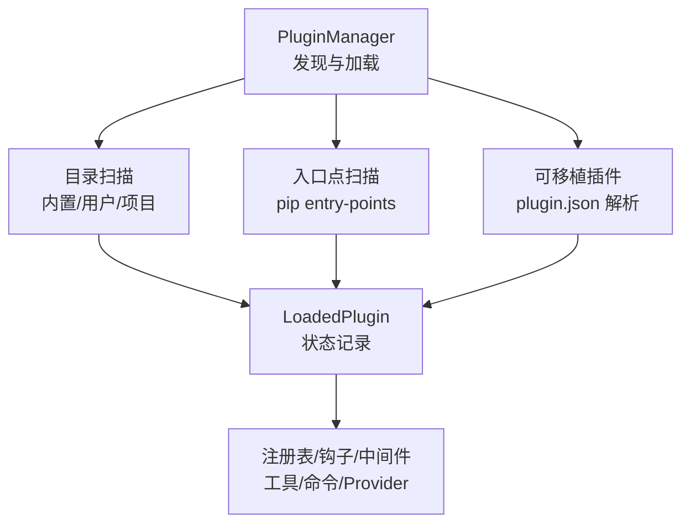
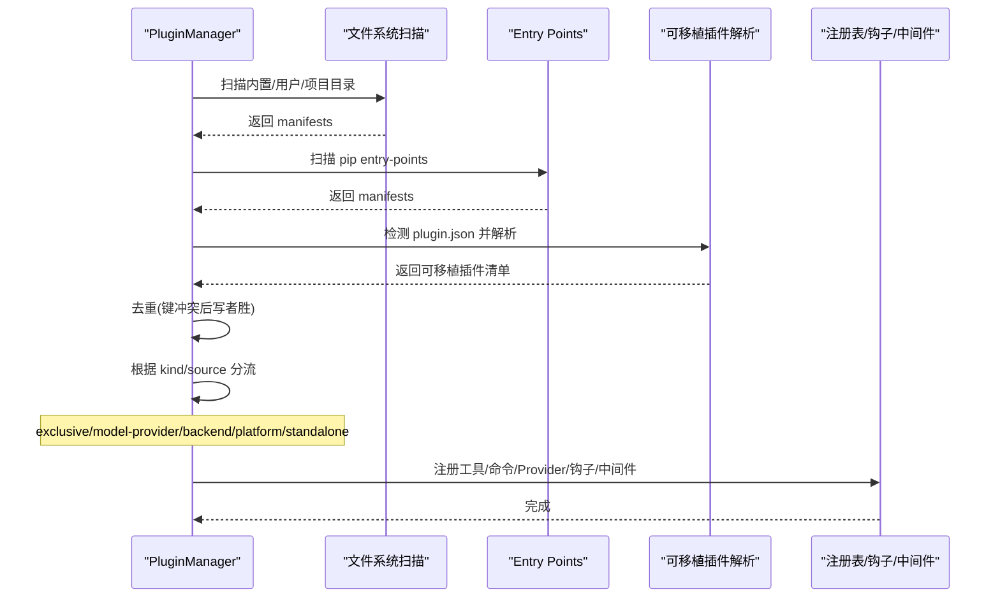
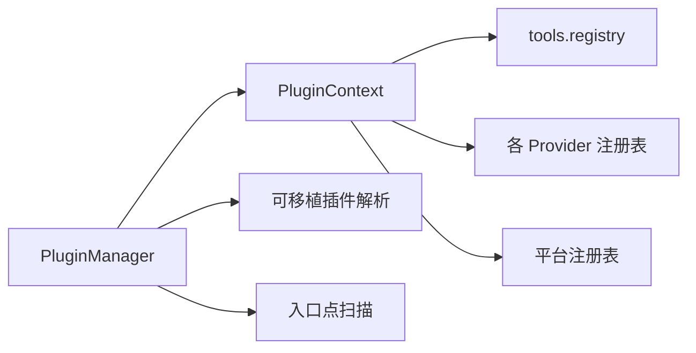

# 插件架构

<cite>
**本文引用的文件**
- [hermes_cli/plugins.py](file://hermes_cli/plugins.py)
- [hermes_cli/agent_plugins.py](file://hermes_cli/agent_plugins.py)
- [plugins/model-providers/README.md](file://plugins/model-providers/README.md)
- [providers/base.py](file://providers/base.py)
- [hermes_cli/providers.py](file://hermes_cli/providers.py)
- [plugins/plugin_utils.py](file://plugins/plugin_utils.py)
</cite>

## 目录
1. [简介](#简介)
2. [项目结构](#项目结构)
3. [核心组件](#核心组件)
4. [架构总览](#架构总览)
5. [详细组件分析](#详细组件分析)
6. [依赖关系分析](#依赖关系分析)
7. [性能考量](#性能考量)
8. [故障排查指南](#故障排查指南)
9. [结论](#结论)
10. [附录](#附录)

## 简介
本文件系统性阐述 Hermes CLI 的插件架构，覆盖插件发现、加载流程、生命周期管理、接口规范（提供商插件、模型插件、技能插件）、配置与依赖解析、插件间通信机制、版本兼容与安全校验、以及打包发布与维护最佳实践。文档面向希望扩展 Hermes 能力的开发者，提供从设计到落地的完整指南。

## 项目结构
Hermes 插件系统围绕“集中式管理器 + 多来源发现 + 统一注册表”的模式组织：
- 插件来源
  - 内置插件：仓库内的 plugins/ 目录（排除 memory、context_engine、platforms、model-providers 等由各自子系统管理的类别）
  - 用户插件：~/.hermes/plugins/
  - 项目插件：./.hermes/plugins/（需显式启用）
  - Pip 插件：通过 entry-point 组 hermes_agent.plugins 暴露
- 可插拔能力
  - 工具注册、CLI 子命令、斜杠命令
  - 生命周期钩子（pre/post 系列、会话、网关分发、审批、看板任务等）
  - 中间件（请求改写、执行包装）
  - 各类 Provider（图像生成、视频生成、网页搜索/抓取、浏览器、TTS、STT、Secret Source、平台适配器）
  - 上下文引擎替换、辅助 LLM 任务、MCP 服务器、技能（Skill）
- 可移植插件（Agent Plugins v1）
  - 以 plugin.json 描述，支持 skills 与 mcpServers 声明，无需导入 Python 代码即可被识别和集成



图表来源
- [hermes_cli/plugins.py:1341-1495](file://hermes_cli/plugins.py#L1341-L1495)
- [hermes_cli/plugins.py:1496-1716](file://hermes_cli/plugins.py#L1496-L1716)
- [hermes_cli/plugins.py:1813-1837](file://hermes_cli/plugins.py#L1813-L1837)
- [hermes_cli/plugins.py:1903-1989](file://hermes_cli/plugins.py#L1903-L1989)

章节来源
- [hermes_cli/plugins.py:1-32](file://hermes_cli/plugins.py#L1-L32)
- [hermes_cli/plugins.py:1341-1495](file://hermes_cli/plugins.py#L1341-L1495)

## 核心组件
- PluginManifest：插件清单，包含 name、version、kind、source、key、portable、skill_namespace 等元数据
- LoadedPlugin：运行时实例，记录模块、已注册的工具/钩子/中间件/命令、是否启用、错误信息、是否延迟加载
- PluginContext：插件初始化时获得的上下文，提供注册工具、命令、Provider、钩子、中间件、技能、辅助任务等能力
- PluginManager：中央管理器，负责发现、去重、加载、延迟加载、统计与诊断

关键职责
- 发现：扫描目录与 entry-points，合并并去重（后者优先）
- 加载：按 kind/source 分流（exclusive、model-provider、backend、platform、standalone），调用 register(ctx)
- 注册：将插件能力注入全局注册表（工具、命令、Provider、平台适配器等）
- 钩子/中间件：收集回调并在合适时机触发
- 可移植插件：仅读取 manifest 与声明，不导入 Python 代码，安全且快速

章节来源
- [hermes_cli/plugins.py:307-362](file://hermes_cli/plugins.py#L307-L362)
- [hermes_cli/plugins.py:368-1303](file://hermes_cli/plugins.py#L368-L1303)
- [hermes_cli/plugins.py:1309-1336](file://hermes_cli/plugins.py#L1309-L1336)

## 架构总览
下图展示插件从发现到注册的端到端流程，包括不同来源的优先级、特殊 kind 的处理、以及延迟加载策略。



图表来源
- [hermes_cli/plugins.py:1380-1495](file://hermes_cli/plugins.py#L1380-L1495)
- [hermes_cli/plugins.py:1496-1716](file://hermes_cli/plugins.py#L1496-L1716)
- [hermes_cli/plugins.py:1813-1837](file://hermes_cli/plugins.py#L1813-L1837)
- [hermes_cli/plugins.py:1903-1989](file://hermes_cli/plugins.py#L1903-L1989)

## 详细组件分析

### 插件发现与加载流程
- 目录扫描
  - 支持扁平与分类两种布局，深度限制为两层
  - 跳过特定顶层目录（如 memory、context_engine、platforms、model-providers）
  - 同时支持 plugin.yaml/yml 与可移植的 plugin.json
- 入口点扫描
  - 通过 importlib.metadata 查找 hermes_agent.plugins 组
- 去重与优先级
  - 后发现的 manifest 覆盖先前的同名 key（路径派生 key，避免 category 下同名冲突）
- 特殊 kind 处理
  - exclusive：交由类别专属发现（如 memory）
  - model-provider：交由 providers/__init__.py 懒加载注册
  - backend（内置）：自动加载
  - platform（内置）：延迟加载，首次使用时才导入重型 SDK
  - standalone/用户后端/entry-point：默认 opt-in，需在配置中启用
- 加载
  - 非可移植插件：导入模块并调用 register(ctx)
  - 可移植插件：仅解析 manifest 与声明，不导入 Python 代码

```mermaid
flowchart TD
Start(["开始"]) --> ScanDir["扫描目录<br/>内置/用户/项目"]
ScanDir --> ScanEP["扫描入口点"]
ScanEP --> Merge["合并与去重"]
Merge --> Kind{"kind/source?"}
Kind --> |exclusive| SkipE["跳过(类别专属)"]
Kind --> |model-provider| SkipM["跳过(提供者懒加载)"]
Kind --> |backend(内置)| LoadB["立即加载"]
Kind --> |platform(内置)| DeferP["延迟加载"]
Kind --> |standalone/其他| EnableCheck{"在 enabled 列表?"}
EnableCheck --> |否| SkipA["跳过(未启用)"]
EnableCheck --> |是| LoadS["立即加载"]
SkipE --> End(["结束"])
SkipM --> End
LoadB --> End
DeferP --> End
SkipA --> End
LoadS --> End
```

图表来源
- [hermes_cli/plugins.py:1380-1495](file://hermes_cli/plugins.py#L1380-L1495)
- [hermes_cli/plugins.py:1496-1716](file://hermes_cli/plugins.py#L1496-L1716)
- [hermes_cli/plugins.py:1813-1837](file://hermes_cli/plugins.py#L1813-L1837)
- [hermes_cli/plugins.py:1903-1989](file://hermes_cli/plugins.py#L1903-L1989)

章节来源
- [hermes_cli/plugins.py:1380-1495](file://hermes_cli/plugins.py#L1380-L1495)
- [hermes_cli/plugins.py:1496-1716](file://hermes_cli/plugins.py#L1496-L1716)
- [hermes_cli/plugins.py:1813-1837](file://hermes_cli/plugins.py#L1813-L1837)
- [hermes_cli/plugins.py:1903-1989](file://hermes_cli/plugins.py#L1903-L1989)

### 插件接口规范
- 插件清单（plugin.yaml / plugin.json）
  - 名称、版本、描述、作者、requires_env、provides_tools、provides_hooks、source、path、kind、key、portable、skill_namespace
  - 可移植插件使用 schema 约束的 plugin.json，支持 skills 与 mcpServers 声明
- 插件模块接口
  - 每个目录插件必须包含 __init__.py 并提供 register(ctx) 函数
  - 通过 ctx 提供的 API 注册工具、命令、Provider、钩子、中间件、技能、辅助任务等
- 提供商插件（Provider Profile）
  - 通过 providers.base.ProviderProfile 声明身份、认证、端点、能力、默认值等
  - 新增提供商：在 plugins/model-providers/<name>/__init__.py 中创建并注册；plugin.yaml 标记 kind=model-provider
- 技能插件（Skill）
  - 通过 ctx.register_skill 注册只读技能，命名空间基于插件名，不会进入全局索引，需显式加载

章节来源
- [hermes_cli/plugins.py:307-362](file://hermes_cli/plugins.py#L307-L362)
- [hermes_cli/plugins.py:368-1303](file://hermes_cli/plugins.py#L368-L1303)
- [hermes_cli/agent_plugins.py:97-155](file://hermes_cli/agent_plugins.py#L97-L155)
- [hermes_cli/agent_plugins.py:192-252](file://hermes_cli/agent_plugins.py#L192-L252)
- [plugins/model-providers/README.md:1-71](file://plugins/model-providers/README.md#L1-L71)
- [providers/base.py:38-239](file://providers/base.py#L38-L239)

### 生命周期钩子与中间件
- 生命周期钩子（VALID_HOOKS）
  - 工具前后、终端输出转换、工具结果转换、LLM 输出/调用前后、验证前、API 请求前后、会话生命周期、子代理生命周期、网关分发前、审批前后、看板任务生命周期等
- 中间件（VALID_MIDDLEWARE）
  - 行为变更型中间件，允许改写有效负载或包装真实回调
- 注册方式
  - 通过 ctx.register_hook 与 ctx.register_middleware 注册
  - 未知钩子/中间件会警告但保留，保证向前兼容

章节来源
- [hermes_cli/plugins.py:136-219](file://hermes_cli/plugins.py#L136-L219)
- [hermes_cli/plugins.py:1214-1250](file://hermes_cli/plugins.py#L1214-L1250)

### 插件间通信机制
- 工具调度
  - ctx.dispatch_tool 通过全局工具注册表调度，自动注入父代理上下文（CLI 模式）
- 消息注入
  - ctx.inject_message 可将外部消息注入活跃对话（空闲时排队，运行中断并注入）
- 辅助任务
  - ctx.register_auxiliary_task 声明新的 LLM 侧任务，具备独立配置与环境变量桥接
- 平台适配器
  - ctx.register_platform 注册网关平台适配器，支持延迟加载与依赖探测

章节来源
- [hermes_cli/plugins.py:522-660](file://hermes_cli/plugins.py#L522-L660)
- [hermes_cli/plugins.py:979-1039](file://hermes_cli/plugins.py#L979-L1039)
- [hermes_cli/plugins.py:1103-1212](file://hermes_cli/plugins.py#L1103-L1212)

### 配置管理与依赖解析
- 启用/禁用列表
  - disabled：黑名单，优先于 enabled
  - enabled：白名单，默认 opt-in（None 表示无启用项）
- 项目插件开关
  - HERMES_ENABLE_PROJECT_PLUGINS 控制项目级插件扫描
- 安全模式
  - HERMES_SAFE_MODE=1 跳过插件发现
- 可移植插件数据目录
  - 使用 ${PLUGIN_ROOT}/${PLUGIN_DATA} 占位符进行路径展开与隔离
- 环境变量要求
  - requires_env 声明插件所需的环境变量，便于前置检查与提示

章节来源
- [hermes_cli/plugins.py:231-275](file://hermes_cli/plugins.py#L231-L275)
- [hermes_cli/plugins.py:1398-1487](file://hermes_cli/plugins.py#L1398-L1487)
- [hermes_cli/agent_plugins.py:255-287](file://hermes_cli/agent_plugins.py#L255-L287)

### 版本兼容性检查与安全验证
- 可移植插件清单校验
  - 严格校验 $schema、字段类型、名称正则、SKILL.md frontmatter、mcpServers 结构与头部合法性
  - 对未知字段忽略并记录诊断，对致命错误抛出异常
- 工具覆盖保护
  - 覆盖内置工具需显式授权（allow_tool_override），内置插件默认信任，第三方插件需配置放行
- 安全路径与头校验
  - 可移植插件路径必须在根目录下，防止逃逸；远程 MCP 头部进行严格格式校验

章节来源
- [hermes_cli/agent_plugins.py:97-155](file://hermes_cli/agent_plugins.py#L97-L155)
- [hermes_cli/agent_plugins.py:158-252](file://hermes_cli/agent_plugins.py#L158-L252)
- [hermes_cli/agent_plugins.py:290-307](file://hermes_cli/agent_plugins.py#L290-L307)
- [hermes_cli/plugins.py:439-520](file://hermes_cli/plugins.py#L439-L520)

### 提供商插件与模型插件
- 提供商插件（Provider Profile）
  - 通过 providers.base.ProviderProfile 声明 identity、auth、endpoints、capabilities、defaults
  - 新增提供商：在 plugins/model-providers/<name>/__init__.py 中注册；plugin.yaml 指定 kind=model-provider
  - 运行时由 providers/__init__.py 懒加载，get_provider_profile/list_providers 触发
- 模型路由与传输
  - hermes_cli/providers.py 维护 overlays、aliases、transport→api_mode 映射，决定 wire protocol
  - determine_api_mode 根据主机强制协议、provider 传输、直接检查确定最终 API 模式

章节来源
- [plugins/model-providers/README.md:1-71](file://plugins/model-providers/README.md#L1-L71)
- [providers/base.py:38-239](file://providers/base.py#L38-L239)
- [hermes_cli/providers.py:31-248](file://hermes_cli/providers.py#L31-L248)
- [hermes_cli/providers.py:445-704](file://hermes_cli/providers.py#L445-L704)

### 技能插件（Skills）
- 注册方式
  - ctx.register_skill(name, path, description, frontmatter) 注册只读技能
  - 命名空间基于插件名，qualified name 形如 "<plugin>:<name>"
- 可移植技能
  - 可移植插件的 skills/ 目录下的 SKILL.md 会被发现并转换为内部 Skill 对象
  - frontmatter 校验 name/description/license/compatibility/metadata/allowed-tools

章节来源
- [hermes_cli/plugins.py:1254-1303](file://hermes_cli/plugins.py#L1254-L1303)
- [hermes_cli/agent_plugins.py:192-252](file://hermes_cli/agent_plugins.py#L192-L252)

### 并发与资源管理
- 线程安全单例
  - lazy_singleton 装饰器与 SingletonSlot 类提供线程安全的懒加载单例，避免竞态与资源泄漏
- 建议
  - 插件内长连接/客户端应使用上述工具封装，确保多线程安全与可重置

章节来源
- [plugins/plugin_utils.py:1-136](file://plugins/plugin_utils.py#L1-L136)

## 依赖关系分析
- 组件耦合
  - PluginManager 与 PluginContext 强耦合（注册期交互）
  - 各 Provider 子系统（image_gen、video_gen、web_search、browser、tts、stt、secret_sources、platforms）通过各自的注册表解耦
  - 可移植插件与主程序弱耦合（仅读取 JSON/YAML，不导入 Python 代码）
- 外部依赖
  - importlib.metadata（entry points）
  - PyYAML（可选，用于解析 plugin.yaml）
  - urllib_security（安全 URL 访问）
- 潜在循环依赖
  - 通过延迟导入（lazy import）避免循环，例如在 register_* 方法中按需导入对应模块



图表来源
- [hermes_cli/plugins.py:1309-1336](file://hermes_cli/plugins.py#L1309-L1336)
- [hermes_cli/plugins.py:1903-1989](file://hermes_cli/plugins.py#L1903-L1989)
- [hermes_cli/plugins.py:1813-1837](file://hermes_cli/plugins.py#L1813-L1837)

章节来源
- [hermes_cli/plugins.py:1309-1336](file://hermes_cli/plugins.py#L1309-L1336)
- [hermes_cli/plugins.py:1813-1837](file://hermes_cli/plugins.py#L1813-L1837)
- [hermes_cli/plugins.py:1903-1989](file://hermes_cli/plugins.py#L1903-L1989)

## 性能考量
- 延迟加载平台插件
  - 内置平台插件采用延迟加载，避免启动时导入重型 SDK，减少冷启动时间
- 最小化导入
  - 可移植插件不导入 Python 代码，仅解析清单，提升扫描速度
- 缓存与复用
  - 单例与懒加载避免重复初始化昂贵资源
- 日志与调试
  - HERMES_PLUGINS_DEBUG=1 输出详细发现日志，便于定位问题

[本节为通用指导，不直接分析具体文件]

## 故障排查指南
- 插件未生效
  - 检查是否在 plugins.enabled 白名单中，或被 plugins.disabled 黑名单屏蔽
  - 确认插件 source/kind 是否符合预期（exclusive/model-provider/backend/platform/standalone）
- 加载失败
  - 查看 LoadedPlugin.error 与日志，确认 register(ctx) 是否存在及是否抛出异常
  - 对于可移植插件，检查 plugin.json 与 SKILL.md/mcp.json 的校验诊断
- 工具覆盖被拒
  - 如需覆盖内置工具，需在 config.yaml 中设置 allow_tool_override
- 平台适配器连接失败
  - 确保 connect() 接受 is_reconnect 关键字参数（测试用例强制校验）
- 并发问题
  - 使用 lazy_singleton/SingletonSlot 管理共享资源，避免竞态条件

章节来源
- [hermes_cli/plugins.py:1398-1487](file://hermes_cli/plugins.py#L1398-L1487)
- [hermes_cli/plugins.py:1903-1989](file://hermes_cli/plugins.py#L1903-L1989)
- [hermes_cli/agent_plugins.py:97-155](file://hermes_cli/agent_plugins.py#L97-L155)
- [plugins/plugin_utils.py:43-81](file://plugins/plugin_utils.py#L43-L81)

## 结论
Hermes 插件架构通过统一的发现与加载机制、严格的清单校验与权限控制、以及丰富的扩展点（工具、命令、Provider、钩子、中间件、技能、平台适配器），实现了高内聚、低耦合的可扩展体系。可移植插件进一步提升了安全性与启动性能。遵循本文档的接口规范与实践建议，开发者可以安全、高效地扩展 Hermes 的能力。

[本节为总结性内容，不直接分析具体文件]

## 附录

### 开发自定义插件的步骤
- 目录插件
  - 在 ~/.hermes/plugins/<name>/ 或 ./ .hermes/plugins/<name>/ 创建 plugin.yaml 与 __init__.py
  - 在 __init__.py 实现 register(ctx)，通过 ctx 注册工具、命令、Provider、钩子、中间件、技能等
  - 若为 model-provider，设置 kind=model-provider，并由 providers 子系统懒加载
- 可移植插件
  - 创建 plugin.json，声明 name/version/description 等，可选 skills/ 与 mcp.json
  - 使用 ${PLUGIN_ROOT}/${PLUGIN_DATA} 进行路径展开，遵守安全约束
- 发布与维护
  - 使用 entry-points 组 hermes_agent.plugins 暴露插件（pip 包）
  - 在 config.yaml 中通过 plugins.enabled/disabled 管理启用状态
  - 遵循版本兼容与安全校验规则，定期更新清单与依赖

章节来源
- [hermes_cli/plugins.py:1398-1487](file://hermes_cli/plugins.py#L1398-L1487)
- [hermes_cli/plugins.py:1607-1716](file://hermes_cli/plugins.py#L1607-L1716)
- [hermes_cli/agent_plugins.py:97-155](file://hermes_cli/agent_plugins.py#L97-L155)
- [plugins/model-providers/README.md:28-71](file://plugins/model-providers/README.md#L28-L71)