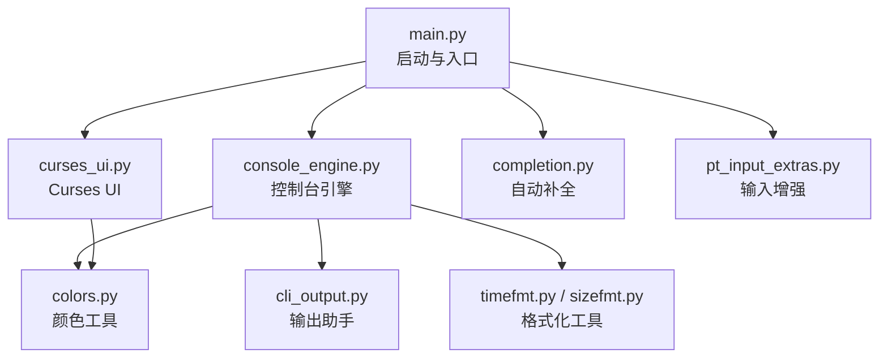
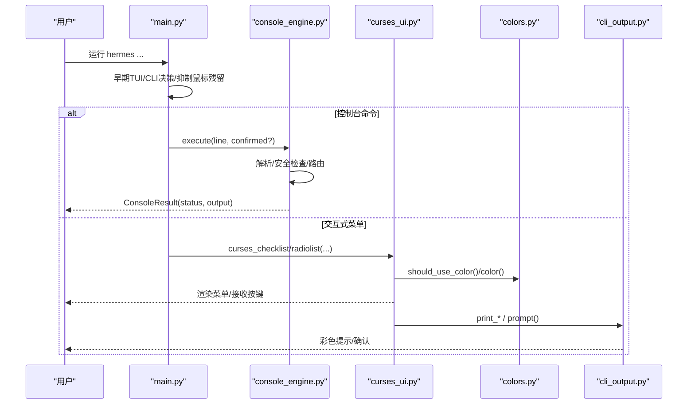
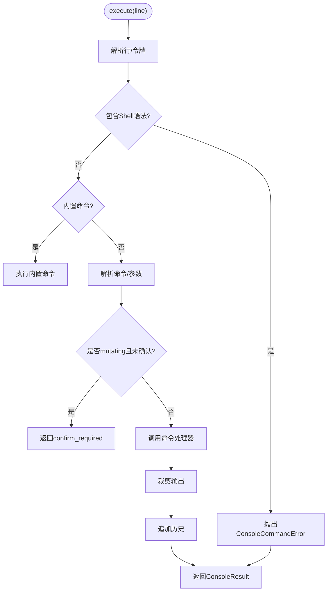
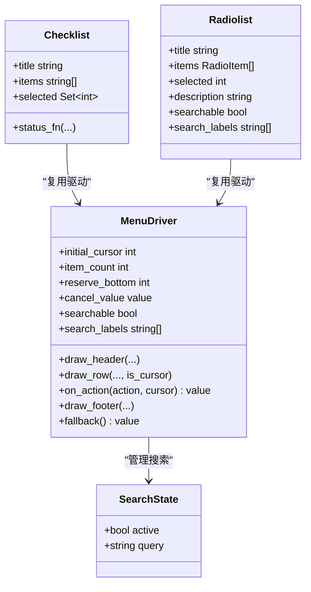
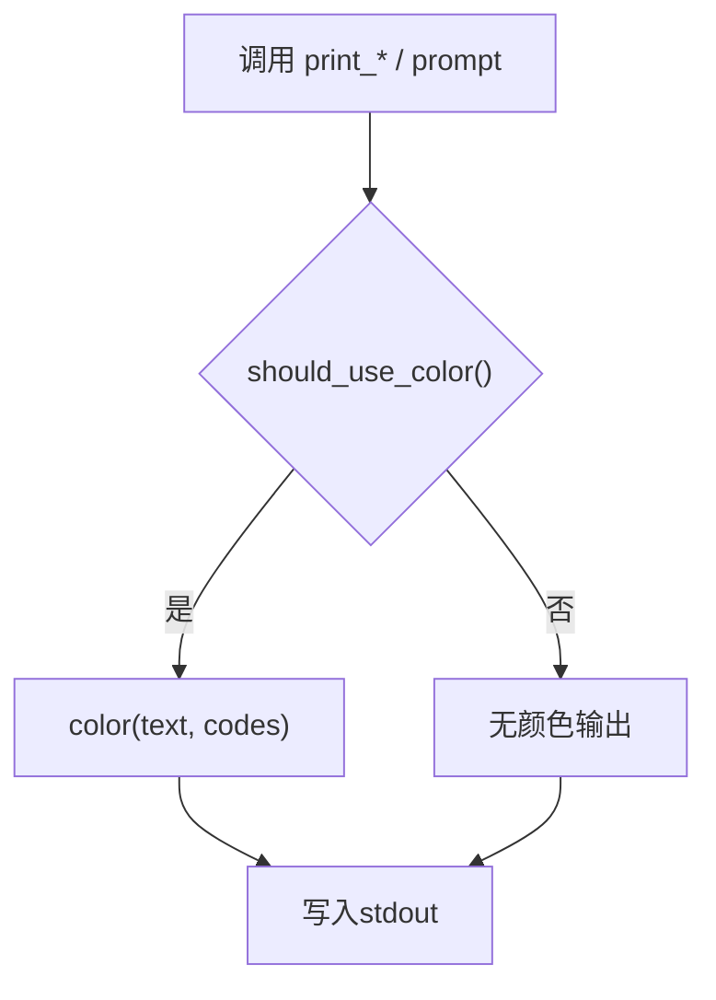
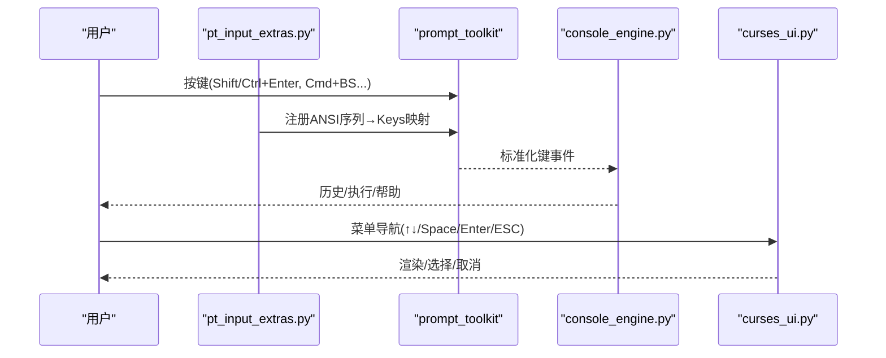
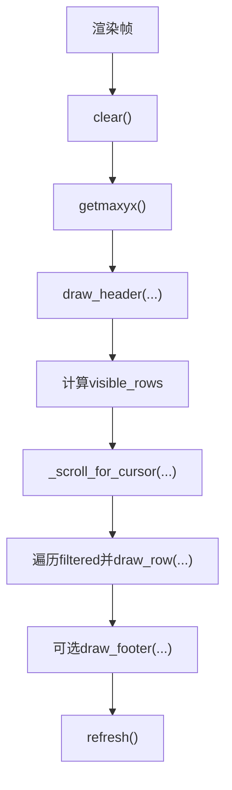
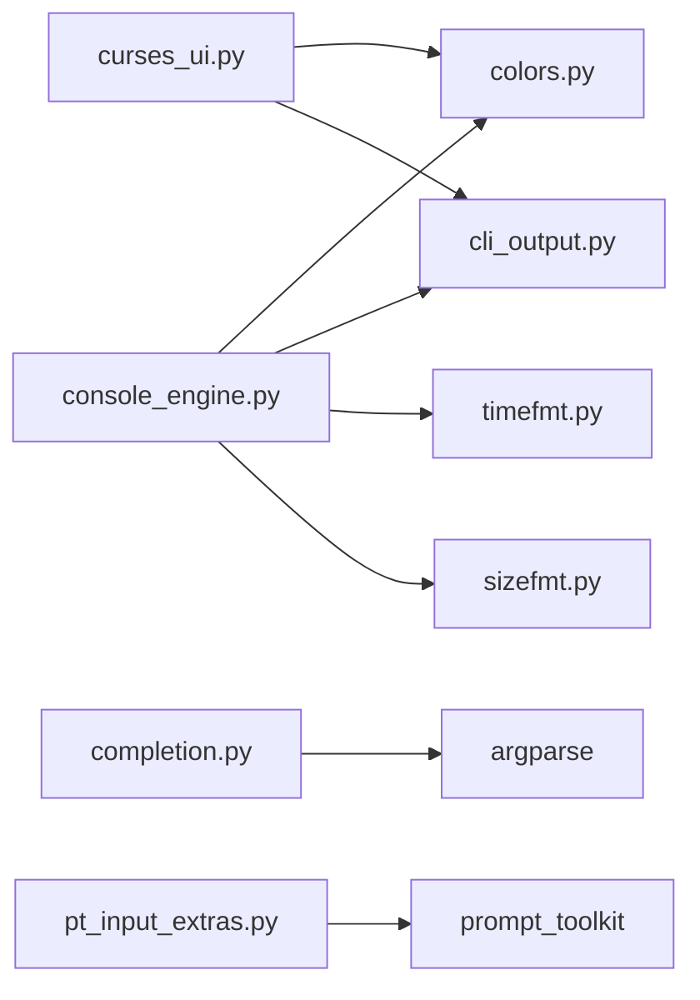

# 用户界面交互

<cite>
**本文引用的文件**
- [hermes_cli/console_engine.py](file://hermes_cli/console_engine.py)
- [hermes_cli/curses_ui.py](file://hermes_cli/curses_ui.py)
- [hermes_cli/colors.py](file://hermes_cli/colors.py)
- [hermes_cli/cli_output.py](file://hermes_cli/cli_output.py)
- [hermes_cli/completion.py](file://hermes_cli/completion.py)
- [hermes_cli/pt_input_extras.py](file://hermes_cli/pt_input_extras.py)
- [hermes_cli/main.py](file://hermes_cli/main.py)
- [hermes_cli/sizefmt.py](file://hermes_cli/sizefmt.py)
- [hermes_cli/timefmt.py](file://hermes_cli/timefmt.py)
</cite>

## 目录
1. [简介](#简介)
2. [项目结构](#项目结构)
3. [核心组件](#核心组件)
4. [架构总览](#架构总览)
5. [详细组件分析](#详细组件分析)
6. [依赖关系分析](#依赖关系分析)
7. [性能考虑](#性能考虑)
8. [故障排查指南](#故障排查指南)
9. [结论](#结论)
10. [附录](#附录)

## 简介
本文件面向 Hermes CLI 的用户界面与交互子系统，聚焦终端界面的设计模式、控制台引擎工作原理、Curses UI 实现细节、输出格式化与颜色支持、交互式输入处理（命令历史、自动补全、快捷键）、响应式界面更新与进度显示、错误信息格式化输出，以及跨平台兼容性与终端检测机制。同时提供扩展指导：如何开发自定义渲染器与主题定制。

## 项目结构
Hermes CLI 的界面交互由多个模块协作完成：
- 控制台引擎：提供安全、可审计的命令执行与结果封装，屏蔽 shell 语法，统一错误与确认流程。
- Curses UI：提供基于 curses 的多选/单选菜单、模糊搜索、滚动与键盘导航，并具备非 TTY 或 curses 不可用时的降级方案。
- 颜色与输出：统一的 ANSI 颜色控制与打印助手，确保在管道或非彩色终端下行为一致。
- 自动补全：从 argparse 解析树动态生成 bash/zsh/fish 补全脚本。
- 输入增强：为 prompt_toolkit 注册键位映射，解决不同终端协议下的按键差异。
- 启动与入口：早期决定是否进入 TUI/CLI，抑制鼠标残留序列，加载配置与环境。
- 格式化工具：时间、字节等通用格式化函数，用于状态与进度展示。

**图表来源**
- [hermes_cli/main.py:311-339](file://hermes_cli/main.py#L311-L339)
- [hermes_cli/console_engine.py:491-539](file://hermes_cli/console_engine.py#L491-L539)
- [hermes_cli/curses_ui.py:446-624](file://hermes_cli/curses_ui.py#L446-L624)
- [hermes_cli/completion.py:55-139](file://hermes_cli/completion.py#L55-L139)
- [hermes_cli/pt_input_extras.py:15-51](file://hermes_cli/pt_input_extras.py#L15-L51)
- [hermes_cli/colors.py:7-39](file://hermes_cli/colors.py#L7-L39)
- [hermes_cli/cli_output.py:15-78](file://hermes_cli/cli_output.py#L15-L78)
- [hermes_cli/timefmt.py:15-31](file://hermes_cli/timefmt.py#L15-L31)
- [hermes_cli/sizefmt.py:19-37](file://hermes_cli/sizefmt.py#L19-L37)

**章节来源**
- [hermes_cli/main.py:311-339](file://hermes_cli/main.py#L311-L339)
- [hermes_cli/console_engine.py:491-539](file://hermes_cli/console_engine.py#L491-L539)
- [hermes_cli/curses_ui.py:446-624](file://hermes_cli/curses_ui.py#L446-L624)
- [hermes_cli/completion.py:55-139](file://hermes_cli/completion.py#L55-L139)
- [hermes_cli/pt_input_extras.py:15-51](file://hermes_cli/pt_input_extras.py#L15-L51)
- [hermes_cli/colors.py:7-39](file://hermes_cli/colors.py#L7-L39)
- [hermes_cli/cli_output.py:15-78](file://hermes_cli/cli_output.py#L15-L78)
- [hermes_cli/timefmt.py:15-31](file://hermes_cli/timefmt.py#L15-L31)
- [hermes_cli/sizefmt.py:19-37](file://hermes_cli/sizefmt.py#L19-L37)

## 核心组件
- 控制台引擎（HermesConsoleEngine）
  - 负责命令解析、路由、执行、历史维护、输出限制与安全校验（禁止 shell 语法）。
  - 将子命令以“提取/注册/构建器/添加器”四种方式接入，支持变更操作确认。
  - 提供 help_text 与 execute 接口，返回统一的结果对象。
- Curses UI
  - 提供多选/单选菜单、模糊搜索、滚动、键盘导航、状态栏。
  - 对非 TTY 或 curses 异常进行降级到编号列表；提供 flush_stdin 清理遗留输入。
- 颜色与输出
  - 统一 ANSI 颜色常量与 color 包装；print_info/success/warning/error/prompt 等便捷方法。
- 自动补全
  - 从 argparse 解析树生成 bash/zsh/fish 补全脚本，包含 profile 名称补全。
- 输入增强
  - 为 prompt_toolkit 注册 Shift/Ctrl+Enter、Cmd+Backspace/Delete 等键位映射，忽略焦点报告噪声。
- 启动与入口
  - 早期判断是否进入 TUI/CLI，抑制鼠标残留序列，加载 .env 与日志。
- 格式化工具
  - relative_time、format_bytes 等轻量函数用于状态与进度展示。

**章节来源**
- [hermes_cli/console_engine.py:491-539](file://hermes_cli/console_engine.py#L491-L539)
- [hermes_cli/curses_ui.py:446-624](file://hermes_cli/curses_ui.py#L446-L624)
- [hermes_cli/colors.py:7-39](file://hermes_cli/colors.py#L7-L39)
- [hermes_cli/cli_output.py:15-78](file://hermes_cli/cli_output.py#L15-L78)
- [hermes_cli/completion.py:55-139](file://hermes_cli/completion.py#L55-L139)
- [hermes_cli/pt_input_extras.py:15-51](file://hermes_cli/pt_input_extras.py#L15-L51)
- [hermes_cli/main.py:311-339](file://hermes_cli/main.py#L311-L339)
- [hermes_cli/timefmt.py:15-31](file://hermes_cli/timefmt.py#L15-L31)
- [hermes_cli/sizefmt.py:19-37](file://hermes_cli/sizefmt.py#L19-L37)

## 架构总览
下图展示了从命令行入口到控制台引擎与 Curses UI 的关键调用链路与数据流。

**图表来源**
- [hermes_cli/main.py:311-339](file://hermes_cli/main.py#L311-L339)
- [hermes_cli/console_engine.py:491-539](file://hermes_cli/console_engine.py#L491-L539)
- [hermes_cli/curses_ui.py:446-624](file://hermes_cli/curses_ui.py#L446-L624)
- [hermes_cli/colors.py:7-39](file://hermes_cli/colors.py#L7-L39)
- [hermes_cli/cli_output.py:15-78](file://hermes_cli/cli_output.py#L15-L78)

## 详细组件分析

### 控制台引擎（HermesConsoleEngine）
- 设计要点
  - 安全执行：禁止 shell 语法，捕获 SystemExit/异常，统一转换为 ConsoleCommandError。
  - 命令注册：内置命令 + 广泛暴露的非管理员命令族，支持 mutating 标记与确认消息。
  - 输出限制：统一裁剪输出长度，避免刷屏。
  - 帮助系统：从 argparse 树抽取摘要，提供 help_text(subject?)。
- 关键流程
  - execute：解析行 → 检查 shell 语法 → 内置命令优先 → 解析命令 → 变更确认 → 执行 → 记录历史 → 返回结果。
  - _register_broad_cli_surface：集中注册大量子命令族，标注哪些路径为 mutating。
- 复杂度与优化
  - 使用 lru_cache 缓存命令摘要提取，减少重复 import/parse。
  - 通过 _capture_output 统一捕获 stdout/stderr 与退出码。

**图表来源**
- [hermes_cli/console_engine.py:500-539](file://hermes_cli/console_engine.py#L500-L539)
- [hermes_cli/console_engine.py:563-606](file://hermes_cli/console_engine.py#L563-L606)
- [hermes_cli/console_engine.py:607-800](file://hermes_cli/console_engine.py#L607-L800)

**章节来源**
- [hermes_cli/console_engine.py:29-79](file://hermes_cli/console_engine.py#L29-L79)
- [hermes_cli/console_engine.py:491-539](file://hermes_cli/console_engine.py#L491-L539)
- [hermes_cli/console_engine.py:563-606](file://hermes_cli/console_engine.py#L563-L606)
- [hermes_cli/console_engine.py:607-800](file://hermes_cli/console_engine.py#L607-L800)

### Curses UI（菜单、搜索、滚动、键盘）
- 功能要点
  - 多选 checklist 与单选 radiolist，支持描述行、状态栏、模糊搜索。
  - 键盘标准化：read_menu_key/_decode_menu_key 将箭头、ESC、q、空格等归一化为动作。
  - 搜索状态：_SearchState 管理 active/query，支持 ESC 停止并清空查询。
  - 滚动与光标对齐：_scroll_for_cursor/_reconcile_cursor 保证可见性。
  - 降级策略：非 TTY 直接返回取消值；curses 异常时回退到编号列表。
  - 输入清理：flush_stdin 防止后续 input() 被遗留转义序列污染。
- 颜色与样式
  - 根据 has_colors 初始化颜色对；cursor 行强制高亮；dim/yellow 样式用于状态与标签。
- 事件循环
  - _run_curses_menu 统一管理 clear/getmaxyx/refresh、绘制头/行/尾、按键分发、回调 on_action。

**图表来源**
- [hermes_cli/curses_ui.py:259-338](file://hermes_cli/curses_ui.py#L259-L338)
- [hermes_cli/curses_ui.py:372-439](file://hermes_cli/curses_ui.py#L372-L439)
- [hermes_cli/curses_ui.py:446-624](file://hermes_cli/curses_ui.py#L446-L624)
- [hermes_cli/curses_ui.py:627-716](file://hermes_cli/curses_ui.py#L627-L716)
- [hermes_cli/curses_ui.py:718-800](file://hermes_cli/curses_ui.py#L718-L800)

**章节来源**
- [hermes_cli/curses_ui.py:25-108](file://hermes_cli/curses_ui.py#L25-L108)
- [hermes_cli/curses_ui.py:110-257](file://hermes_cli/curses_ui.py#L110-L257)
- [hermes_cli/curses_ui.py:340-439](file://hermes_cli/curses_ui.py#L340-L439)
- [hermes_cli/curses_ui.py:446-624](file://hermes_cli/curses_ui.py#L446-L624)
- [hermes_cli/curses_ui.py:627-800](file://hermes_cli/curses_ui.py#L627-L800)

### 输出格式化与颜色支持
- 颜色控制
  - should_use_color 尊重 NO_COLOR、TERM=dumb、非 TTY。
  - Colors 提供 ANSI 常量；color(text, *codes) 仅在合适环境注入颜色。
- 打印助手
  - print_info/success/warning/error/header 统一前缀与颜色。
  - prompt/prompt_yes_no 支持默认值、密码掩码、Ctrl-C/EOF 处理。
- 尺寸与时间
  - format_bytes 友好显示字节数；relative_time 显示相对时间。

**图表来源**
- [hermes_cli/colors.py:7-39](file://hermes_cli/colors.py#L7-L39)
- [hermes_cli/cli_output.py:15-78](file://hermes_cli/cli_output.py#L15-L78)
- [hermes_cli/timefmt.py:15-31](file://hermes_cli/timefmt.py#L15-L31)
- [hermes_cli/sizefmt.py:19-37](file://hermes_cli/sizefmt.py#L19-L37)

**章节来源**
- [hermes_cli/colors.py:7-39](file://hermes_cli/colors.py#L7-L39)
- [hermes_cli/cli_output.py:15-78](file://hermes_cli/cli_output.py#L15-L78)
- [hermes_cli/timefmt.py:15-31](file://hermes_cli/timefmt.py#L15-L31)
- [hermes_cli/sizefmt.py:19-37](file://hermes_cli/sizefmt.py#L19-L37)

### 交互式输入处理（历史、自动补全、快捷键）
- 命令历史
  - 引擎在执行成功后将原始行加入 history；help/history/clear 不记录。
- 自动补全
  - 从 argparse 解析树递归提取子命令与标志，生成 bash/zsh/fish 脚本；支持 profile 名称补全。
- 快捷键支持
  - pt_input_extras 将多种终端协议的按键映射到 prompt_toolkit 已知键，如 Shift/Ctrl+Enter、Cmd+Backspace/Delete，忽略焦点报告噪声。
  - curses 层 read_menu_key/_decode_menu_key 将箭头、ESC、q、空格等归一化。

**图表来源**
- [hermes_cli/pt_input_extras.py:15-51](file://hermes_cli/pt_input_extras.py#L15-L51)
- [hermes_cli/pt_input_extras.py:54-83](file://hermes_cli/pt_input_extras.py#L54-L83)
- [hermes_cli/pt_input_extras.py:86-126](file://hermes_cli/pt_input_extras.py#L86-L126)
- [hermes_cli/pt_input_extras.py:129-164](file://hermes_cli/pt_input_extras.py#L129-L164)
- [hermes_cli/completion.py:55-139](file://hermes_cli/completion.py#L55-L139)
- [hermes_cli/console_engine.py:500-539](file://hermes_cli/console_engine.py#L500-L539)
- [hermes_cli/curses_ui.py:372-439](file://hermes_cli/curses_ui.py#L372-L439)

**章节来源**
- [hermes_cli/console_engine.py:500-539](file://hermes_cli/console_engine.py#L500-L539)
- [hermes_cli/completion.py:55-139](file://hermes_cli/completion.py#L55-L139)
- [hermes_cli/pt_input_extras.py:15-51](file://hermes_cli/pt_input_extras.py#L15-L51)
- [hermes_cli/pt_input_extras.py:54-83](file://hermes_cli/pt_input_extras.py#L54-L83)
- [hermes_cli/pt_input_extras.py:86-126](file://hermes_cli/pt_input_extras.py#L86-L126)
- [hermes_cli/pt_input_extras.py:129-164](file://hermes_cli/pt_input_extras.py#L129-L164)
- [hermes_cli/curses_ui.py:372-439](file://hermes_cli/curses_ui.py#L372-L439)

### 响应式界面更新与进度显示
- 响应式更新
  - Curses 每帧 clear/getmaxyx/refresh，结合滚动偏移与可视行数计算，保持光标可见。
  - 搜索状态下实时更新过滤结果与滚动位置。
- 进度显示
  - 通过 status_fn 在底部状态栏显示聚合信息（如估计 token 数），使用 dim 颜色呈现。
  - 时间/大小格式化函数可用于进度条文本（如“2h ago”、“1.2 MB”）。

**图表来源**
- [hermes_cli/curses_ui.py:446-624](file://hermes_cli/curses_ui.py#L446-L624)
- [hermes_cli/curses_ui.py:627-716](file://hermes_cli/curses_ui.py#L627-L716)
- [hermes_cli/timefmt.py:15-31](file://hermes_cli/timefmt.py#L15-L31)
- [hermes_cli/sizefmt.py:19-37](file://hermes_cli/sizefmt.py#L19-L37)

**章节来源**
- [hermes_cli/curses_ui.py:446-624](file://hermes_cli/curses_ui.py#L446-L624)
- [hermes_cli/curses_ui.py:627-716](file://hermes_cli/curses_ui.py#L627-L716)
- [hermes_cli/timefmt.py:15-31](file://hermes_cli/timefmt.py#L15-L31)
- [hermes_cli/sizefmt.py:19-37](file://hermes_cli/sizefmt.py#L19-L37)

### 错误信息的格式化输出
- 控制台引擎
  - 捕获 ConsoleCommandError 并返回 error 状态的 ConsoleResult，便于上层统一渲染。
- 终端工具错误脱敏
  - 测试覆盖表明终端工具的错误/回溯会进行敏感信息脱敏，避免泄露密钥。
- 颜色与提示
  - print_error 使用红色与 ✗ 前缀；prompt 支持 Ctrl-C/EOF 安全退出。

**章节来源**
- [hermes_cli/console_engine.py:500-539](file://hermes_cli/console_engine.py#L500-L539)
- [tests/tools/test_terminal_error_redaction.py:47-154](file://tests/tools/test_terminal_error_redaction.py#L47-L154)
- [hermes_cli/cli_output.py:30-38](file://hermes_cli/cli_output.py#L30-L38)

### 跨平台兼容性与终端检测
- 启动期决策
  - main.py 早期判断 TUI/CLI，依据显式参数、环境变量、TTY 状态与配置；抑制鼠标残留序列以避免终端乱码。
- 颜色与 TTY
  - colors.should_use_color 尊重 NO_COLOR、TERM=dumb、非 TTY。
- 输入兼容性
  - pt_input_extras 适配 Kitty/xterm modifyOtherKeys 等协议；curses 层处理 ESC 序列与箭头键。
- 降级策略
  - curses 不可用时回退到编号列表；非 TTY 直接返回取消值。

**章节来源**
- [hermes_cli/main.py:311-339](file://hermes_cli/main.py#L311-L339)
- [hermes_cli/colors.py:7-39](file://hermes_cli/colors.py#L7-L39)
- [hermes_cli/pt_input_extras.py:15-51](file://hermes_cli/pt_input_extras.py#L15-L51)
- [hermes_cli/curses_ui.py:340-439](file://hermes_cli/curses_ui.py#L340-L439)
- [hermes_cli/curses_ui.py:446-624](file://hermes_cli/curses_ui.py#L446-L624)

### 扩展指导：自定义渲染器与主题定制
- 自定义渲染器
  - 复用 _run_curses_menu 的回调约定：实现 draw_header/draw_row/on_action，必要时提供 draw_footer。
  - 使用 searchable/search_labels 启用模糊搜索；利用 _filter_indices 与评分逻辑保持一致排序。
  - 通过 extra_color_pairs 启用额外颜色对（如 dim 灰）用于状态栏。
- 主题定制
  - 基于 Colors 与 color 包装统一颜色注入；遵循 should_use_color 的环境检测。
  - 在 Curses 中通过 curses.init_pair 定义配色对，并在 _curses_style_attr 中映射样式。
- 示例思路
  - 创建新的菜单类型：继承 checklist/radiolist 的绘制逻辑，替换 items 与 on_action 行为。
  - 集成进度反馈：在 status_fn 中计算并返回状态文本，渲染到底部状态栏。

**章节来源**
- [hermes_cli/curses_ui.py:446-624](file://hermes_cli/curses_ui.py#L446-L624)
- [hermes_cli/curses_ui.py:627-800](file://hermes_cli/curses_ui.py#L627-L800)
- [hermes_cli/colors.py:7-39](file://hermes_cli/colors.py#L7-L39)

## 依赖关系分析
- 模块耦合
  - console_engine 依赖 colors/cli_output/timefmt/sizefmt 进行输出与格式化。
  - curses_ui 依赖 colors 进行颜色控制，并通过 cli_output 提供交互提示。
  - completion 依赖 argparse 解析树，与主入口的 subcommands 构建紧密相关。
  - pt_input_extras 仅依赖 prompt_toolkit 内部表，低耦合。
- 外部依赖
  - curses（可选，存在降级）。
  - prompt_toolkit（可选，用于输入增强）。
  - argparse（标准库）。
- 潜在循环
  - 未见明显循环依赖；各模块职责清晰，通过回调与数据类解耦。

**图表来源**
- [hermes_cli/console_engine.py:491-539](file://hermes_cli/console_engine.py#L491-L539)
- [hermes_cli/curses_ui.py:446-624](file://hermes_cli/curses_ui.py#L446-L624)
- [hermes_cli/completion.py:55-139](file://hermes_cli/completion.py#L55-L139)
- [hermes_cli/pt_input_extras.py:15-51](file://hermes_cli/pt_input_extras.py#L15-L51)

**章节来源**
- [hermes_cli/console_engine.py:491-539](file://hermes_cli/console_engine.py#L491-L539)
- [hermes_cli/curses_ui.py:446-624](file://hermes_cli/curses_ui.py#L446-L624)
- [hermes_cli/completion.py:55-139](file://hermes_cli/completion.py#L55-L139)
- [hermes_cli/pt_input_extras.py:15-51](file://hermes_cli/pt_input_extras.py#L15-L51)

## 性能考虑
- 启动优化
  - 早期 TUI/CLI 决策与鼠标残留抑制，减少不必要的导入与终端噪声。
  - 使用 fast-path 读取配置与版本信息，降低冷启动开销。
- 运行时优化
  - 控制台引擎使用 lru_cache 缓存命令摘要提取，避免重复 import/parse。
  - Curses 渲染采用增量刷新与滚动优化，避免整屏重绘。
- I/O 安全
  - flush_stdin 防止遗留转义序列污染后续输入。
  - 颜色输出在非 TTY 或禁用环境下自动降级，避免无效写入。

[本节为通用性能建议，不直接分析具体文件]

## 故障排查指南
- 常见问题
  - 菜单无法交互：检查是否为非 TTY；若 curses 不可用，应回退到编号列表。
  - 按键无效：确认 pt_input_extras 已安装相应映射；检查终端协议（Kitty/xterm modifyOtherKeys）。
  - 颜色不生效：检查 NO_COLOR、TERM=dumb、stdout 是否重定向。
  - 输入污染：在 curses.wrapper 返回后调用 flush_stdin，再调用 input()/getpass。
- 调试步骤
  - 使用 help_text(subject?) 查看命令帮助与用法。
  - 观察 ConsoleResult.status 与 output，定位错误来源。
  - 在 Curses 中启用 extra_color_pairs 以便区分状态栏颜色。

**章节来源**
- [hermes_cli/curses_ui.py:340-439](file://hermes_cli/curses_ui.py#L340-L439)
- [hermes_cli/curses_ui.py:446-624](file://hermes_cli/curses_ui.py#L446-L624)
- [hermes_cli/colors.py:7-39](file://hermes_cli/colors.py#L7-L39)
- [hermes_cli/console_engine.py:500-539](file://hermes_cli/console_engine.py#L500-L539)

## 结论
Hermes CLI 的界面交互子系统通过控制台引擎、Curses UI、颜色与输出、自动补全、输入增强与启动入口的协同，提供了稳定、可移植、可扩展的终端体验。其设计强调安全性（禁止 shell 语法、变更确认）、健壮性（降级与清理）、一致性（统一颜色与输出）与可维护性（模块化与回调约定）。开发者可基于现有组件快速构建自定义界面与主题，满足多样化交互需求。

[本节为总结，不直接分析具体文件]

## 附录
- 使用示例（概念性说明）
  - 创建自定义菜单：实现 draw_header/draw_row/on_action，传入 _run_curses_menu；使用 searchable/search_labels 启用搜索。
  - 处理用户输入事件：在 on_action 中根据 action（select/toggle/cancel）更新状态并返回结果或继续循环。
  - 富文本输出：使用 color 包装文本，结合 print_* 助手；在 Curses 中使用 curses.init_pair 与 _curses_style_attr 映射样式。
  - 进度显示：在 status_fn 中计算并返回状态文本，渲染至底部状态栏；使用 timefmt/sizefmt 格式化数值。
  - 跨平台适配：遵循 should_use_color 与 TTY 检测；在 curses 异常时回退到编号列表；确保 flush_stdin 调用。

[本节为概念性内容，不直接分析具体文件]