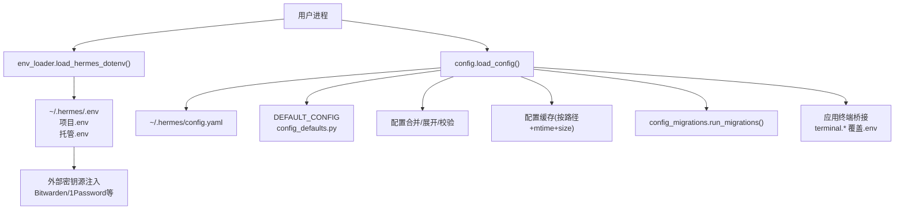
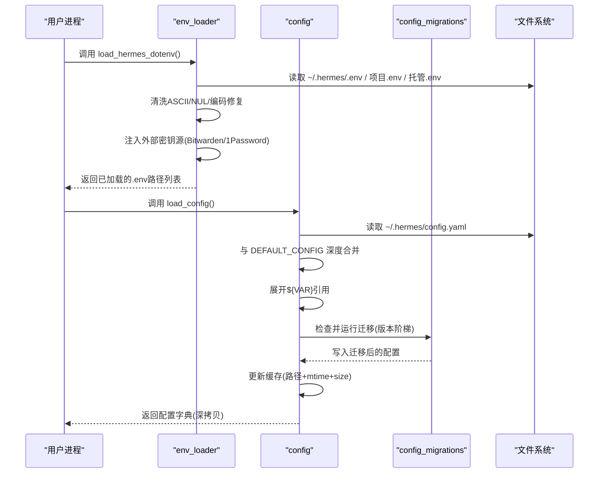
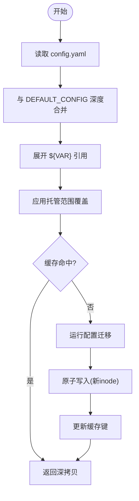
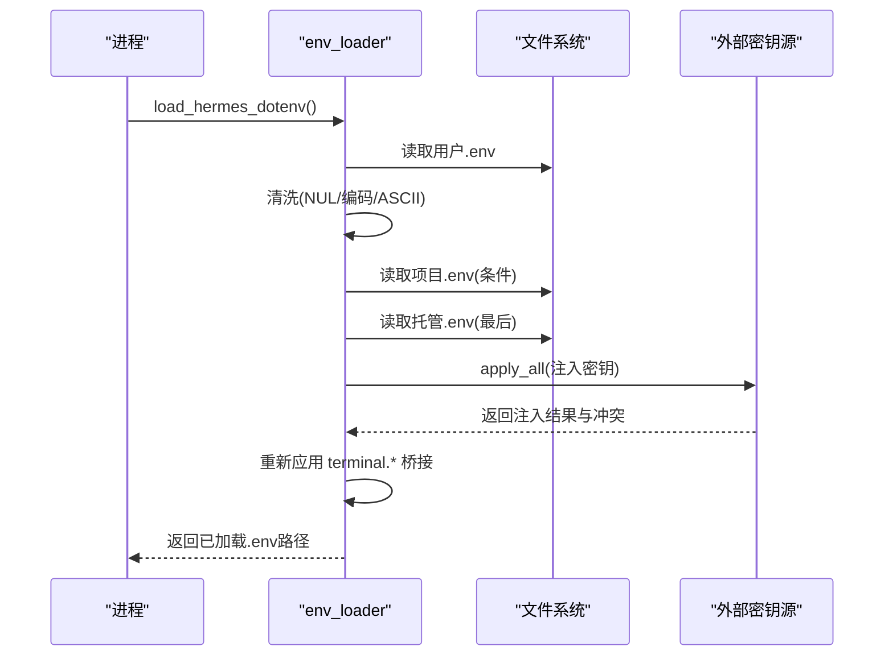
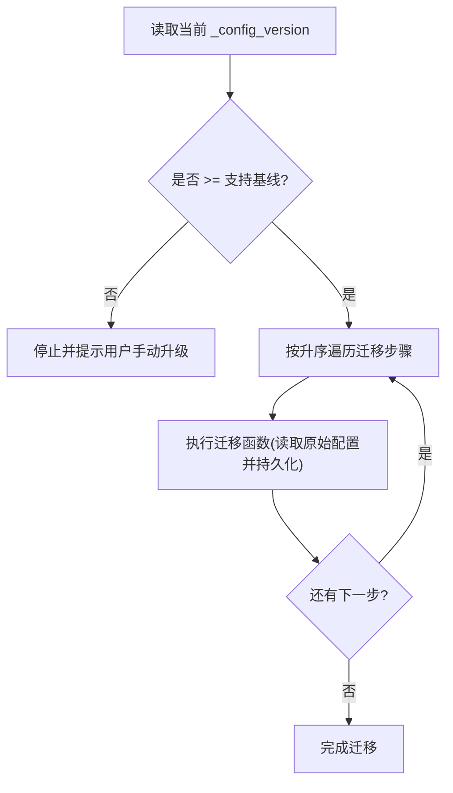
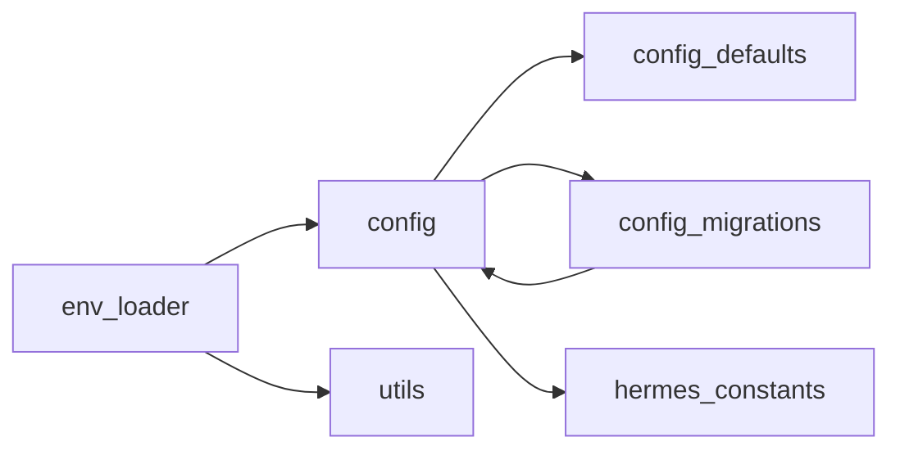

# 配置管理系统

<cite>
**本文引用的文件**
- [hermes_cli/config.py](file://hermes_cli/config.py)
- [hermes_cli/config_defaults.py](file://hermes_cli/config_defaults.py)
- [hermes_cli/config_migrations.py](file://hermes_cli/config_migrations.py)
- [hermes_cli/env_loader.py](file://hermes_cli/env_loader.py)
- [cli-config.yaml.example](file://cli-config.yaml.example)
</cite>

## 目录
1. [简介](#简介)
2. [项目结构](#项目结构)
3. [核心组件](#核心组件)
4. [架构总览](#架构总览)
5. [详细组件分析](#详细组件分析)
6. [依赖关系分析](#依赖关系分析)
7. [性能考虑](#性能考虑)
8. [故障排查指南](#故障排查指南)
9. [结论](#结论)
10. [附录：使用示例与最佳实践](#附录：使用示例与最佳实践)

## 简介
本文件系统性说明 Hermes CLI 的配置管理机制，覆盖配置文件层次、优先级规则、环境变量加载、.env 处理、默认值管理、配置验证与类型转换、热重载、迁移机制、版本兼容、备份恢复，以及开发者扩展自定义配置项的指南。目标是帮助使用者和开发者准确理解并安全高效地管理 Hermes 的配置。

## 项目结构
Hermes 的配置由以下关键模块协同完成：
- 配置定义与合并：config.py（加载、合并、缓存、校验、持久化）
- 默认值与可选环境变量清单：config_defaults.py（DEFAULT_CONFIG、OPTIONAL_ENV_VARS）
- 环境变量加载与 .env 处理：env_loader.py（用户/项目/托管环境加载、密钥清洗、外部密钥源注入）
- 配置迁移与版本兼容：config_migrations.py（按版本阶梯式迁移）
- 配置模板与文档：cli-config.yaml.example（可复制为 ~/.hermes/config.yaml 的完整示例）

图表来源
- [hermes_cli/env_loader.py:462-529](file://hermes_cli/env_loader.py#L462-L529)
- [hermes_cli/config.py:694-700](file://hermes_cli/config.py#L694-L700)
- [hermes_cli/config_defaults.py:7-277](file://hermes_cli/config_defaults.py#L7-L277)
- [hermes_cli/config_migrations.py:671-686](file://hermes_cli/config_migrations.py#L671-L686)

章节来源
- [hermes_cli/config.py:694-700](file://hermes_cli/config.py#L694-L700)
- [hermes_cli/config_defaults.py:7-277](file://hermes_cli/config_defaults.py#L7-L277)
- [hermes_cli/env_loader.py:462-529](file://hermes_cli/env_loader.py#L462-L529)
- [hermes_cli/config_migrations.py:671-686](file://hermes_cli/config_migrations.py#L671-L686)

## 核心组件
- 配置加载与合并
  - 读取用户 config.yaml，与 DEFAULT_CONFIG 深度合并，展开 ${VAR} 引用，应用受管范围覆盖，返回深拷贝结果。
  - 提供 read_raw_config() 获取原始磁盘值（不含默认值），便于迁移与诊断。
- 默认值与可选环境变量
  - DEFAULT_CONFIG 提供全量默认键；OPTIONAL_ENV_VARS 描述可通过 setup 流程管理的密钥变量。
- 环境变量加载
  - 按顺序加载用户 .env、项目 .env、托管 .env，并进行 ASCII 清洗、NUL 清理、UTF-16/32 检测修复。
  - 支持外部密钥源（如 Bitwarden、1Password）注入，并在进程内去重与溯源。
- 配置迁移
  - 基于版本号的阶梯式迁移，保证向后兼容，记录变更与警告。
- 安全与权限
  - 写 .env 时拒绝危险的环境变量名（如 LD_PRELOAD、PATH、HERMES_HOME 等）。
  - 目录权限控制（0700 或托管模式 0750），Docker UID/GID 对齐。

章节来源
- [hermes_cli/config.py:45-156](file://hermes_cli/config.py#L45-L156)
- [hermes_cli/config.py:198-233](file://hermes_cli/config.py#L198-L233)
- [hermes_cli/config.py:235-260](file://hermes_cli/config.py#L235-L260)
- [hermes_cli/config_defaults.py:7-277](file://hermes_cli/config_defaults.py#L7-L277)
- [hermes_cli/env_loader.py:298-353](file://hermes_cli/env_loader.py#L298-L353)
- [hermes_cli/env_loader.py:355-460](file://hermes_cli/env_loader.py#L355-L460)
- [hermes_cli/env_loader.py:591-687](file://hermes_cli/env_loader.py#L591-L687)

## 架构总览
下图展示从启动到最终生效配置的完整链路，包括 .env 加载、外部密钥注入、config.yaml 解析、默认值合并、迁移执行、缓存与热重载。

图表来源
- [hermes_cli/env_loader.py:462-529](file://hermes_cli/env_loader.py#L462-L529)
- [hermes_cli/config.py:235-260](file://hermes_cli/config.py#L235-L260)
- [hermes_cli/config_migrations.py:671-686](file://hermes_cli/config_migrations.py#L671-L686)

## 详细组件分析

### 配置加载、合并与缓存
- 加载路径
  - 主配置：~/.hermes/config.yaml
  - 环境变量：~/.hermes/.env、项目 .env、托管 .env
- 合并策略
  - 以 DEFAULT_CONFIG 为基础，深度合并用户配置；受管范围（managed scope）在 env_loader 末尾以 override=True 应用，确保最高优先级。
- 缓存机制
  - 对已加载配置进行 (path, mtime_ns, size) 键控缓存；保存/迁移通过原子替换产生新 inode，自动失效缓存。
- 线程安全
  - 使用 RLock 串行化所有读/写路径，避免 libyaml 并发问题。

图表来源
- [hermes_cli/config.py:235-260](file://hermes_cli/config.py#L235-L260)
- [hermes_cli/config.py:694-700](file://hermes_cli/config.py#L694-L700)
- [hermes_cli/env_loader.py:559-589](file://hermes_cli/env_loader.py#L559-L589)

章节来源
- [hermes_cli/config.py:235-260](file://hermes_cli/config.py#L235-L260)
- [hermes_cli/config.py:694-700](file://hermes_cli/config.py#L694-L700)
- [hermes_cli/env_loader.py:559-589](file://hermes_cli/env_loader.py#L559-L589)

### 环境变量加载与 .env 处理
- 加载顺序与优先级
  - 用户 .env（override=True）→ 项目 .env（仅在用户 .env 不存在时覆盖）→ 托管 .env（最后，override=True，最高优先级）。
- 安全清洗
  - 去除 NUL、处理 UTF-16/32 BOM、ASCII 密钥清洗（_API_KEY/_TOKEN/_SECRET/_KEY 后缀）。
- 外部密钥源
  - 支持 Bitwarden、1Password 等，按注册表顺序注入，记录来源与冲突提示。
- 终端桥接
  - 在 dotenv 加载后重新应用 config.yaml 的 terminal.* 键，确保配置优先于 .env。

图表来源
- [hermes_cli/env_loader.py:462-529](file://hermes_cli/env_loader.py#L462-L529)
- [hermes_cli/env_loader.py:298-353](file://hermes_cli/env_loader.py#L298-L353)
- [hermes_cli/env_loader.py:591-687](file://hermes_cli/env_loader.py#L591-L687)

章节来源
- [hermes_cli/env_loader.py:462-529](file://hermes_cli/env_loader.py#L462-L529)
- [hermes_cli/env_loader.py:298-353](file://hermes_cli/env_loader.py#L298-L353)
- [hermes_cli/env_loader.py:591-687](file://hermes_cli/env_loader.py#L591-L687)

### 配置验证、类型转换与默认值管理
- 默认值来源
  - DEFAULT_CONFIG 提供全量默认键（模型、代理、终端、压缩、浏览器等）。
- 类型与约束
  - 部分字段有内置约束（如压缩阈值、超时秒数、布尔开关），在合并与运行时校验；不合法值会被拒绝或回退。
- 可选环境变量
  - OPTIONAL_ENV_VARS 列出可由 setup 流程管理的密钥变量；_EXTRA_ENV_KEYS 包含平台/提供商相关键。
- 写保护
  - 写 .env 时拒绝危险变量名（LD_*、PYTHON*、NODE_*、PATH、SHELL、BROWSER、EDITOR、HERMES_* 定位变量等）。

章节来源
- [hermes_cli/config_defaults.py:7-277](file://hermes_cli/config_defaults.py#L7-L277)
- [hermes_cli/config.py:198-233](file://hermes_cli/config.py#L198-L233)
- [hermes_cli/config.py:261-327](file://hermes_cli/config.py#L261-L327)

### 配置热重载机制
- 触发点
  - 文件 watcher 监听 config.yaml 变化；MCP 自动重载（mcp.auto_reload_on_config_change）。
- 行为
  - 检测到变更后重建工具集与提示缓存；为避免频繁重建，提供 /reload-mcp 手动重载入口。
- 影响
  - 会破坏 provider 提示缓存前缀，带来额外成本；可在高延迟/大上下文场景下谨慎调整。

章节来源
- [hermes_cli/config_defaults.py:531-543](file://hermes_cli/config_defaults.py#L531-L543)

### 配置迁移与版本兼容
- 支持基线
  - SUPPORT_FLOOR_VERSION=12；低于该版本的配置不再自动迁移，需用户手动升级或重新生成。
- 迁移步骤
  - 按目标版本严格升序执行；每步读取原始配置并持久化，后续步骤可观测前面步骤的写入。
- 常见迁移
  - custom_providers → providers 字典、清理废弃 .env 键、stt.model 迁移至 provider 子段、插件启用白名单、verify_on_stop 默认关闭等。

图表来源
- [hermes_cli/config_migrations.py:43-66](file://hermes_cli/config_migrations.py#L43-L66)
- [hermes_cli/config_migrations.py:647-686](file://hermes_cli/config_migrations.py#L647-L686)

章节来源
- [hermes_cli/config_migrations.py:43-66](file://hermes_cli/config_migrations.py#L43-L66)
- [hermes_cli/config_migrations.py:647-686](file://hermes_cli/config_migrations.py#L647-L686)

### 配置备份与恢复
- 损坏配置备份
  - 当 config.yaml 无法解析时，尝试将其复制到带时间戳的 .bak 文件，保留用户内容以便修复。
- 原子写入
  - 保存配置使用原子替换，避免中间态导致的不一致。
- 权限与安全
  - 目录权限设置为 0700（托管模式 0750），必要时对齐 Docker UID/GID。

章节来源
- [hermes_cli/config.py:45-96](file://hermes_cli/config.py#L45-L96)
- [hermes_cli/config.py:765-794](file://hermes_cli/config.py#L765-L794)

### 开发者指南：自定义配置项
- 新增配置项建议
  - 在 DEFAULT_CONFIG 中声明默认值与类型；在 config.py 的合并/校验逻辑中添加约束与转换。
  - 若涉及环境变量，加入 OPTIONAL_ENV_VARS 或 _EXTRA_ENV_KEYS，并在 env_loader 中处理加载与清洗。
- 文档与模板
  - 在 cli-config.yaml.example 中补充注释与示例，便于用户参考。
- 迁移与兼容性
  - 如需废弃旧键或改变语义，添加迁移步骤（config_migrations.py），记录变更与提示。
- 测试与验证
  - 为新增键编写单元测试，覆盖边界值、非法输入、迁移路径与热重载场景。

章节来源
- [hermes_cli/config_defaults.py:7-277](file://hermes_cli/config_defaults.py#L7-L277)
- [hermes_cli/config.py:261-327](file://hermes_cli/config.py#L261-L327)
- [hermes_cli/config_migrations.py:647-686](file://hermes_cli/config_migrations.py#L647-L686)
- [cli-config.yaml.example:1-800](file://cli-config.yaml.example#L1-L800)

## 依赖关系分析
- 模块耦合
  - env_loader 依赖 config（用于终端桥接与原始配置读取）、utils（原子替换、安全加载）。
  - config 依赖 config_defaults（默认值）、config_migrations（迁移）、hermes_constants（路径与容器检测）。
  - config_migrations 通过延迟导入避免循环依赖，并通过 _cfg() 访问 config 模块能力。
- 外部依赖
  - python-dotenv 用于 .env 解析；libyaml 用于 YAML 解析（需线程锁保护）。
- 潜在风险
  - 并发读写同一配置文件可能导致竞争；已通过 RLock 解决。
  - 外部密钥源失败不应阻塞启动；已采用 fail-open 策略。

图表来源
- [hermes_cli/env_loader.py:462-529](file://hermes_cli/env_loader.py#L462-L529)
- [hermes_cli/config.py:235-260](file://hermes_cli/config.py#L235-L260)
- [hermes_cli/config_migrations.py:69-73](file://hermes_cli/config_migrations.py#L69-L73)

章节来源
- [hermes_cli/env_loader.py:462-529](file://hermes_cli/env_loader.py#L462-L529)
- [hermes_cli/config.py:235-260](file://hermes_cli/config.py#L235-L260)
- [hermes_cli/config_migrations.py:69-73](file://hermes_cli/config_migrations.py#L69-L73)

## 性能考虑
- 配置缓存
  - 基于 (path, mtime_ns, size) 的缓存避免重复解析与合并；保存/迁移通过原子替换自然失效缓存。
- 解析优化
  - 使用 fast_safe_load 与 libyaml；对并发访问加锁，减少开销。
- 环境变量加载
  - 仅对凭据类变量做 ASCII 清洗；.env 文件先做轻量扫描与修复，降低异常开销。
- 热重载成本
  - MCP 自动重载会重建工具集与提示缓存，建议在长上下文/高推理模型场景中评估频率。

[本节为通用指导，无需具体文件分析]

## 故障排查指南
- 配置解析失败
  - 现象：config.yaml 无法解析，系统回退到默认配置并输出警告。
  - 处理：查看日志与 stderr 提示；检查最近编辑；如有备份 .bak，对比修复。
- .env 编码问题
  - 现象：UTF-16/32 BOM、NUL 字节导致崩溃或无效密钥。
  - 处理：env_loader 会自动修复或拒绝 UTF-32；确保使用 UTF-8 文本编辑器。
- 外部密钥源错误
  - 现象：Bitwarden/1Password 注入失败或冲突。
  - 处理：查看 stderr 中的来源错误与建议；必要时重置密钥源缓存。
- 权限问题
  - 现象：Docker 部署下子目录属主 root 导致后续 worker 权限错误。
  - 处理：确保 HERMES_UID/HERMES_GID 设置正确；目录权限由 _secure_dir 管理。

章节来源
- [hermes_cli/config.py:99-156](file://hermes_cli/config.py#L99-L156)
- [hermes_cli/env_loader.py:355-460](file://hermes_cli/env_loader.py#L355-L460)
- [hermes_cli/env_loader.py:591-687](file://hermes_cli/env_loader.py#L591-L687)
- [hermes_cli/config.py:706-794](file://hermes_cli/config.py#L706-L794)

## 结论
Hermes 的配置管理系统以“默认值 + 用户配置 + 环境变量 + 托管覆盖”的分层模型为核心，结合严格的 .env 清洗、外部密钥注入、版本迁移与原子写入，提供了健壮、安全且高性能的配置体验。通过热重载与缓存机制，系统在保持灵活性的同时兼顾了稳定性与效率。开发者可按指南扩展自定义配置项，并确保迁移与文档同步更新。

[本节为总结性内容，无需具体文件分析]

## 附录：使用示例与最佳实践
- 设置全局/用户/项目配置
  - 将 cli-config.yaml.example 复制为 ~/.hermes/config.yaml，按需修改 model、terminal、compression 等键。
  - 在项目根目录放置 .env 作为开发备用；用户级 ~/.hermes/.env 优先级更高。
- 通过命令行覆盖
  - 使用 hermes config set/get/unset 管理用户配置；--model/--provider 等参数可临时覆盖。
- 使用配置文件模板
  - 参考 cli-config.yaml.example 的注释与示例，快速搭建常用场景（本地终端、SSH、Docker、Modal、Daytona）。
- 环境变量与密钥
  - 在 ~/.hermes/.env 中设置 OPENAI_API_KEY、ANTHROPIC_API_KEY 等；或通过外部密钥源注入。
- 迁移与兼容
  - 升级后若出现旧键告警，遵循迁移提示；低于支持基线的配置需手动升级或重新生成。
- 备份与恢复
  - 解析失败时自动生成 .bak 备份；使用原子写入保障一致性；必要时手动比对修复。

章节来源
- [cli-config.yaml.example:1-800](file://cli-config.yaml.example#L1-L800)
- [hermes_cli/config.py:45-96](file://hermes_cli/config.py#L45-L96)
- [hermes_cli/config_migrations.py:647-686](file://hermes_cli/config_migrations.py#L647-L686)