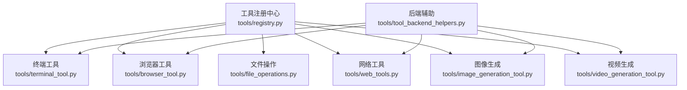
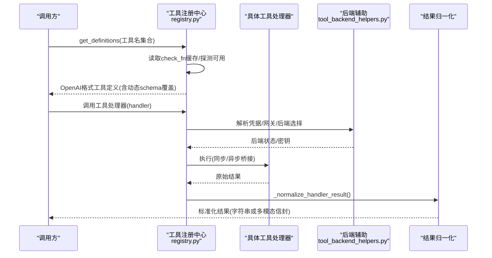
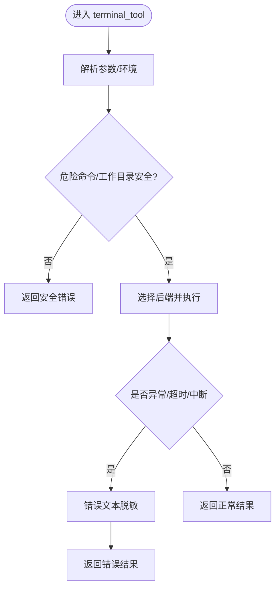
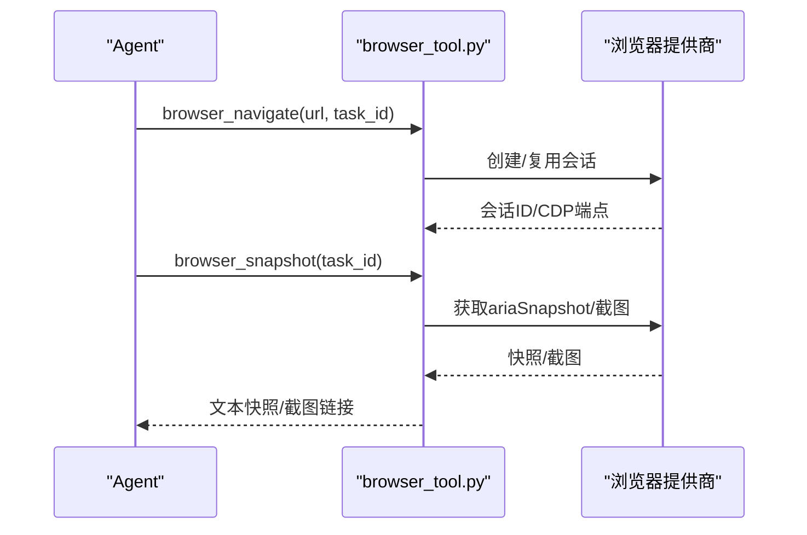
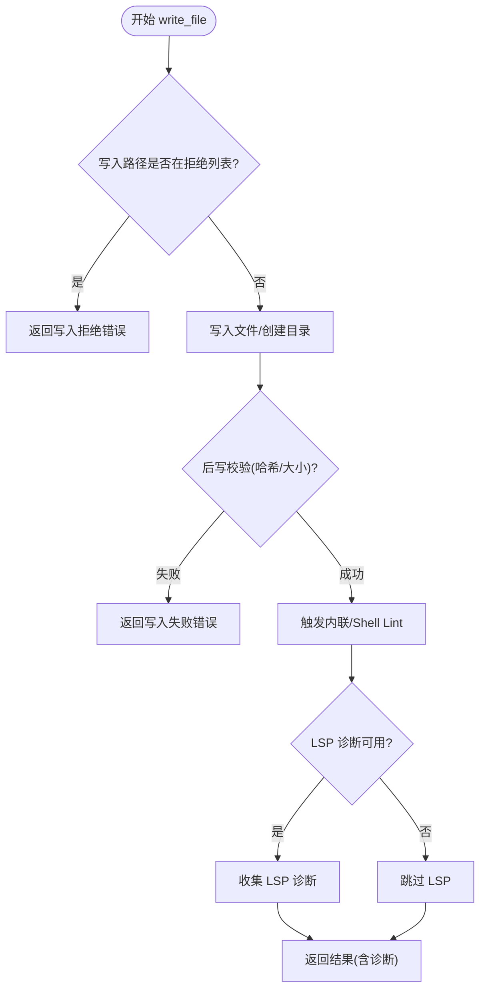
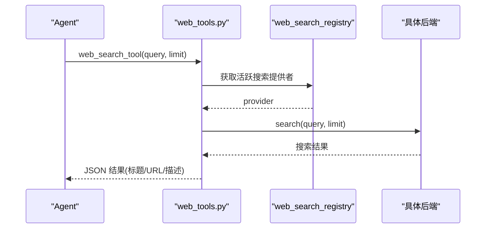
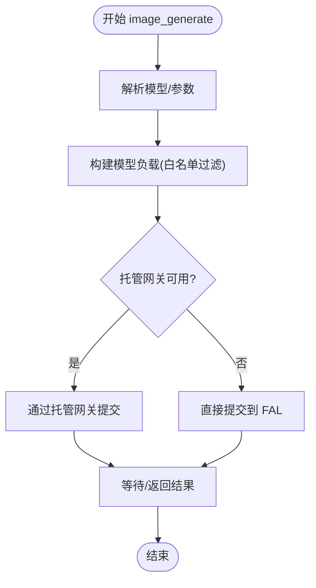
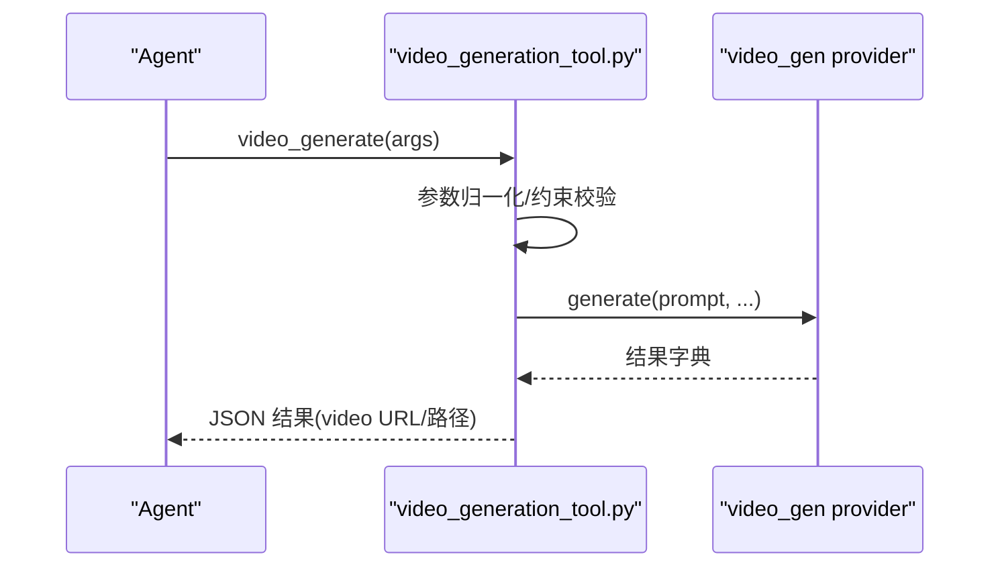
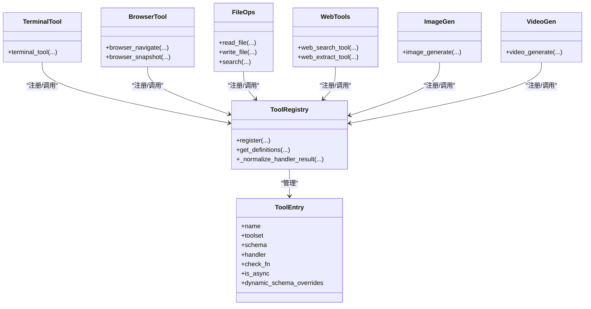

# 内置工具集合

<cite>
**本文引用的文件**
- [tools/registry.py](file://tools/registry.py)
- [tools/tool_backend_helpers.py](file://tools/tool_backend_helpers.py)
- [tools/file_operations.py](file://tools/file_operations.py)
- [tools/web_tools.py](file://tools/web_tools.py)
- [tools/terminal_tool.py](file://tools/terminal_tool.py)
- [tools/browser_tool.py](file://tools/browser_tool.py)
- [tools/image_generation_tool.py](file://tools/image_generation_tool.py)
- [tools/video_generation_tool.py](file://tools/video_generation_tool.py)
</cite>

## 目录
1. [简介](#简介)
2. [项目结构](#项目结构)
3. [核心组件](#核心组件)
4. [架构总览](#架构总览)
5. [详细组件分析](#详细组件分析)
6. [依赖关系分析](#依赖关系分析)
7. [性能考量](#性能考量)
8. [故障排查指南](#故障排查指南)
9. [结论](#结论)
10. [附录](#附录)

## 简介
本文件系统性梳理 Hermes 的内置工具集合，覆盖终端执行、浏览器自动化、文件操作、网络请求、图像生成与视频生成等能力。文档聚焦以下方面：
- 工具注册与发现机制（统一入口、动态 schema、可用性检查）
- 异步执行支持与结果规范化
- 错误恢复、敏感信息脱敏与输出限长
- 工具间协作模式与组合使用建议
- 配置项、环境变量与凭据解析策略
- 性能优化与常见问题定位

## 项目结构
Hermes 的工具以“自注册”方式集中管理：每个工具模块在导入时调用注册中心登记自身元数据与处理器；运行时通过注册中心分发调用并统一处理结果。关键目录与职责：
- tools/registry.py：工具注册中心、发现缓存、check_fn 缓存、schema 组装、结果归一化
- tools/tool_backend_helpers.py：后端选择、凭据解析、网关偏好判断
- tools/terminal_tool.py：跨环境终端执行（本地/Docker/Modal/Vercel Sandbox 等）
- tools/browser_tool.py：浏览器自动化（本地 Chromium、Browserbase、Browser Use、Firecrawl）
- tools/file_operations.py：文件读写、补丁、搜索、Lint、LSP 诊断
- tools/web_tools.py：网页搜索与内容提取（Exa、Parallel、Tavily、Firecrawl、SearXNG 等）
- tools/image_generation_tool.py：图像生成（FAL.ai 多模型、托管网关直连切换）
- tools/video_generation_tool.py：视频生成（插件化 provider 抽象，统一入口）

图表来源
- [tools/registry.py:414-764](file://tools/registry.py#L414-L764)
- [tools/tool_backend_helpers.py:20-141](file://tools/tool_backend_helpers.py#LL20-L141)

章节来源
- [tools/registry.py:1-159](file://tools/registry.py#L1-L159)
- [tools/tool_backend_helpers.py:1-141](file://tools/tool_backend_helpers.py#L1-L141)

## 核心组件
- 工具注册中心（ToolRegistry）
  - 负责工具发现、注册、去重、别名映射、并发安全快照、动态 schema 覆盖
  - check_fn 缓存与“最近成功容错窗口”，避免瞬时失败导致工具不可用
  - 结果归一化：仅允许字符串或特定多模态信封，其他类型转为结构化错误
- 后端辅助（tool_backend_helpers）
  - 凭据解析优先级：显式配置 > 作用域环境变量 > .env/凭证池
  - 网关偏好与托管能力检测（Nous Tool Gateway）
  - Modal 模式选择（direct/managed/auto）
- 终端工具（terminal_tool）
  - 多后端执行、后台任务、危险命令审批、sudo 交互与缓存、磁盘用量告警
  - 错误文本强制脱敏，避免泄露密钥
- 浏览器工具（browser_tool）
  - 多后端（本地 Chromium/Browserbase/Browser Use/Firecrawl），CDP 覆盖、会话隔离、截图与摘要
  - 超时控制、路径安全、子进程最小化凭据透传
- 文件操作（file_operations）
  - 读/写/补丁/删除/移动/搜索/Lint/LSP 诊断
  - 行尾与 BOM 保留、写入拒绝列表、分页限制、超时与诊断分离
- 网络工具（web_tools）
  - 搜索与提取的统一入口，按配置/凭据自动选择后端
  - 页面截断与全文缓存、base64 图片占位替换
- 图像生成（image_generation_tool）
  - 多模型目录、参数白名单过滤、可选上采样、托管网关直连切换
- 视频生成（video_generation_tool）
  - 统一 schema，动态描述反映当前后端能力，provider 契约校验

章节来源
- [tools/registry.py:201-764](file://tools/registry.py#L201-L764)
- [tools/tool_backend_helpers.py:144-312](file://tools/tool_backend_helpers.py#L144-L312)
- [tools/terminal_tool.py:57-115](file://tools/terminal_tool.py#L57-L115)
- [tools/browser_tool.py:125-141](file://tools/browser_tool.py#L125-L141)
- [tools/file_operations.py:154-345](file://tools/file_operations.py#L154-L345)
- [tools/web_tools.py:121-353](file://tools/web_tools.py#L121-L353)
- [tools/image_generation_tool.py:76-657](file://tools/image_generation_tool.py#L76-L657)
- [tools/video_generation_tool.py:62-160](file://tools/video_generation_tool.py#L62-L160)

## 架构总览
下图展示从“工具定义”到“执行与结果返回”的主流程，以及注册中心的缓存与动态 schema 机制。

图表来源
- [tools/registry.py:717-800](file://tools/registry.py#L717-L800)
- [tools/tool_backend_helpers.py:158-252](file://tools/tool_backend_helpers.py#L158-L252)

章节来源
- [tools/registry.py:717-800](file://tools/registry.py#L717-L800)

## 详细组件分析

### 终端工具（Terminal Tool）
- 功能特性
  - 支持 local、docker、modal、vercel_sandbox 等多后端
  - 前台/后台任务、交互式 sudo 密码、危险命令审批、磁盘用量告警
  - 错误文本强制脱敏，避免泄露密钥
- 关键实现要点
  - 凭据与作用域：通过 tool_backend_helpers 解析凭据，支持 multiplex 场景下的 profile 隔离
  - 超时与中断：前台最大超时可配，支持全局中断事件终止长时间运行
  - 安全：工作目录字符白名单、Docker 卷挂载主机路径检测、命令审查
- 典型用法
  - 前台执行：传入命令与可选超时
  - 后台执行：返回任务 ID，后续查询状态
  - 交互式 sudo：提供回调或 TTY 输入，失败自动清理缓存

图表来源
- [tools/terminal_tool.py:375-420](file://tools/terminal_tool.py#L375-L420)
- [tools/terminal_tool.py:486-605](file://tools/terminal_tool.py#L486-L605)

章节来源
- [tools/terminal_tool.py:1-115](file://tools/terminal_tool.py#L1-L115)
- [tools/terminal_tool.py:375-420](file://tools/terminal_tool.py#L375-L420)
- [tools/terminal_tool.py:486-605](file://tools/terminal_tool.py#L486-L605)

### 浏览器工具（Browser Tool）
- 功能特性
  - 本地 Chromium 与云端（Browserbase、Browser Use、Firecrawl）统一接口
  - 基于无障碍树（ariaSnapshot）的文本快照、元素交互、截图与摘要
  - CDP 覆盖、会话隔离、超时控制、子进程最小化凭据透传
- 关键实现要点
  - 后端选择：优先本地，其次云提供商；支持 CDP 直连
  - 安全：URL 安全校验、敏感查询参数识别、日志脱敏
  - 性能：截图清理节流、首开超时放宽、命令超时可配
- 典型用法
  - 导航与快照：navigate + snapshot
  - 点击与输入：click/type
  - 截图与分析：screenshot + vision 模型分析

图表来源
- [tools/browser_tool.py:125-141](file://tools/browser_tool.py#L125-L141)
- [tools/browser_tool.py:286-342](file://tools/browser_tool.py#L286-L342)
- [tools/browser_tool.py:497-556](file://tools/browser_tool.py#L497-L556)

章节来源
- [tools/browser_tool.py:1-177](file://tools/browser_tool.py#L1-L177)
- [tools/browser_tool.py:286-342](file://tools/browser_tool.py#L286-L342)
- [tools/browser_tool.py:497-556](file://tools/browser_tool.py#L497-L556)

### 文件操作（File Operations）
- 功能特性
  - 读/写/补丁/删除/移动/搜索/Lint/LSP 诊断
  - 行尾与 BOM 保留、写入拒绝列表、分页限制、超时与诊断分离
- 关键实现要点
  - 安全：写入路径拒绝列表、BOM 处理、行尾一致性
  - 质量：内联 Lint（JSON/YAML/TOML/Python）、Shell Lint 降级为跳过而非错误
  - 搜索：rg/grep 输出清洗、上下文行解析、超时提示
- 典型用法
  - 分页读取：offset/limit
  - 补丁替换：模糊匹配、V4A 补丁
  - 搜索：内容/文件名模式、上下文行数、限制与偏移

图表来源
- [tools/file_operations.py:149-152](file://tools/file_operations.py#L149-L152)
- [tools/file_operations.py:623-723](file://tools/file_operations.py#L623-L723)
- [tools/file_operations.py:724-767](file://tools/file_operations.py#L724-L767)

章节来源
- [tools/file_operations.py:154-345](file://tools/file_operations.py#L154-L345)
- [tools/file_operations.py:623-723](file://tools/file_operations.py#L623-L723)
- [tools/file_operations.py:724-767](file://tools/file_operations.py#L724-L767)

### 网络工具（Web Tools）
- 功能特性
  - 网页搜索与内容提取，支持 Exa、Parallel、Tavily、Firecrawl、SearXNG 等
  - 页面截断与全文缓存、base64 图片占位替换
  - 凭据/配置驱动的后端选择，支持托管网关
- 关键实现要点
  - 后端选择：优先 web.search_backend/web.extract_backend，否则回退到共享 backend
  - 安全：URL 安全校验、敏感查询参数识别
  - 性能：页面截断阈值、全文存储上限、调试会话记录
- 典型用法
  - 搜索：query + limit
  - 提取：urls + format + char_limit

图表来源
- [tools/web_tools.py:223-353](file://tools/web_tools.py#L223-L353)
- [tools/web_tools.py:618-739](file://tools/web_tools.py#L618-L739)

章节来源
- [tools/web_tools.py:121-353](file://tools/web_tools.py#L121-L353)
- [tools/web_tools.py:618-739](file://tools/web_tools.py#L618-L739)

### 图像生成（Image Generation）
- 功能特性
  - 多模型目录（FLUX、GPT Image、Ideogram、Recraft、Qwen、Seedream 等）
  - 参数白名单过滤、可选上采样、托管网关直连切换
- 关键实现要点
  - 模型解析：config.yaml 或环境变量，未知模型回退默认
  - 负载构建：将统一输入（prompt、aspect_ratio）转换为模型特定负载
  - 托管网关：当未配置 FAL_KEY 或用户偏好时使用 Nous 托管队列
- 典型用法
  - 文生图：prompt + aspect_ratio
  - 编辑：image_urls + prompt（部分模型支持）

图表来源
- [tools/image_generation_tool.py:764-796](file://tools/image_generation_tool.py#L764-L796)
- [tools/image_generation_tool.py:686-759](file://tools/image_generation_tool.py#L686-L759)

章节来源
- [tools/image_generation_tool.py:76-657](file://tools/image_generation_tool.py#L76-L657)
- [tools/image_generation_tool.py:686-759](file://tools/image_generation_tool.py#L686-L759)

### 视频生成（Video Generation）
- 功能特性
  - 统一入口 video_generate，支持文生视频、图生视频、参考图引导
  - 动态 schema 描述反映当前后端能力（分辨率、时长范围、音频、负向提示等）
- 关键实现要点
  - 可用性检查：插件发现 + provider.is_available()
  - 参数归一化：duration/resolution/audio/seed/model 等
  - 契约校验：provider.generate 签名过窄则返回明确错误
- 典型用法
  - 文生视频：prompt + duration + aspect_ratio + resolution
  - 图生视频：prompt + image_url
  - 参考图引导：reference_image_urls

图表来源
- [tools/video_generation_tool.py:199-244](file://tools/video_generation_tool.py#L199-L244)
- [tools/video_generation_tool.py:310-410](file://tools/video_generation_tool.py#L310-L410)

章节来源
- [tools/video_generation_tool.py:62-160](file://tools/video_generation_tool.py#L62-L160)
- [tools/video_generation_tool.py:199-244](file://tools/video_generation_tool.py#L199-L244)
- [tools/video_generation_tool.py:310-410](file://tools/video_generation_tool.py#L310-L410)

## 依赖关系分析
- 注册中心与工具模块
  - 工具模块在导入时调用 registry.register() 声明 schema、handler、check_fn、requires_env、is_async 等
  - 注册中心维护 ToolEntry，支持动态 schema 覆盖与并发安全快照
- 后端辅助与各工具
  - 凭据解析、网关偏好、Modal 模式选择在各工具中复用
- 插件系统
  - 浏览器、网络、视频生成均通过插件注册器发现 provider，保持扩展性

图表来源
- [tools/registry.py:201-644](file://tools/registry.py#L201-L644)
- [tools/terminal_tool.py:1-115](file://tools/terminal_tool.py#L1-L115)
- [tools/browser_tool.py:1-177](file://tools/browser_tool.py#L1-L177)
- [tools/file_operations.py:154-345](file://tools/file_operations.py#L154-L345)
- [tools/web_tools.py:121-353](file://tools/web_tools.py#L121-L353)
- [tools/image_generation_tool.py:76-657](file://tools/image_generation_tool.py#L76-L657)
- [tools/video_generation_tool.py:62-160](file://tools/video_generation_tool.py#L62-L160)

章节来源
- [tools/registry.py:201-644](file://tools/registry.py#L201-L644)

## 性能考量
- 工具发现缓存
  - 基于文件 mtime+size 的发现缓存，减少 AST 扫描开销
- check_fn 缓存与容错
  - 30 秒 TTL 与“最近成功容错窗口”，避免瞬时失败导致工具不可用
- 结果归一化与限长
  - 错误体限长，防止无限增长；JSON 中的 error 字段也受控
- 浏览器与网络
  - 截图清理节流、页面截断与全文存储上限、命令超时可配
- 文件操作
  - 内联 Lint 微秒级、Shell Lint 降级为跳过、搜索超时提示

[本节为通用指导，不直接分析具体文件]

## 故障排查指南
- 工具不可用
  - 检查 check_fn 缓存与最近成功时间戳，必要时刷新配置
  - 查看日志中关于 check_fn 失败的警告
- 凭据问题
  - 确认凭据解析顺序：显式配置 > 作用域环境变量 > .env/凭证池
  - 对于语音/图像/视频工具，注意专用键与通用键的区别
- 浏览器超时
  - 调整 command_timeout，首次 open 使用更高下限
  - 检查 CDP 覆盖与代理设置
- 文件写入失败
  - 检查写入拒绝列表与路径合法性
  - 查看 Lint/LSP 诊断信息
- 网络请求失败
  - 确认后端选择与 API Key
  - 查看页面截断与全文存储情况

章节来源
- [tools/registry.py:233-387](file://tools/registry.py#L233-L387)
- [tools/tool_backend_helpers.py:158-252](file://tools/tool_backend_helpers.py#L158-L252)
- [tools/browser_tool.py:298-342](file://tools/browser_tool.py#L298-L342)
- [tools/file_operations.py:623-723](file://tools/file_operations.py#L623-L723)
- [tools/web_tools.py:223-353](file://tools/web_tools.py#L223-L353)

## 结论
Hermes 内置工具集合通过统一的注册中心与后端辅助层，实现了高内聚、低耦合的工具生态。其设计强调：
- 可扩展：插件化 provider、动态 schema、别名与覆盖
- 健壮性：check_fn 缓存与容错、结果归一化、错误限长
- 安全性：凭据作用域隔离、敏感信息脱敏、URL/路径安全校验
- 高性能：发现缓存、超时控制、截断与存储上限

建议在实际使用中：
- 根据任务选择合适的工具与后端（如浏览器本地 vs 云端）
- 合理配置凭据与网关偏好，避免不必要的网络调用
- 关注工具日志与诊断信息，快速定位问题

[本节为总结性内容，不直接分析具体文件]

## 附录
- 工具选择指南
  - 终端执行：需要跨环境命令执行、后台任务、sudo 交互
  - 浏览器自动化：需要网页交互、截图、无障碍树快照
  - 文件操作：需要读写、补丁、搜索、Lint/LSP 诊断
  - 网络请求：需要网页搜索与内容提取
  - 图像生成：需要高质量图像生成与编辑
  - 视频生成：需要文生视频、图生视频、参考图引导
- 组合使用示例
  - 先 web_search_tool 找到资源，再用 web_extract_tool 提取内容，最后 file_operations.write_file 保存
  - 使用 browser_tool 进行页面交互，截图后用 image_generation_tool 做视觉增强
  - 通过 terminal_tool 执行脚本，结合 file_operations 修改配置后重启服务

[本节为概念性内容，不直接分析具体文件]