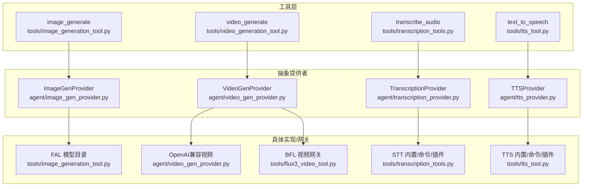
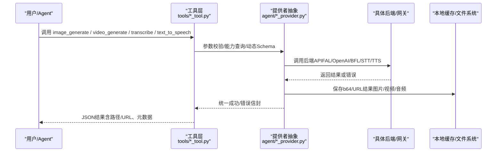
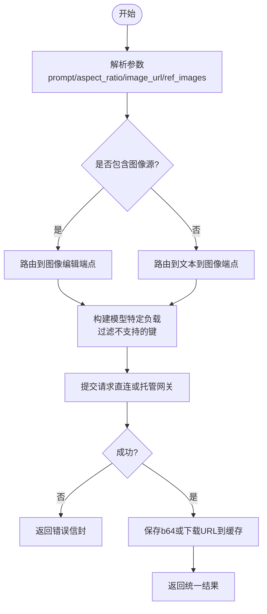
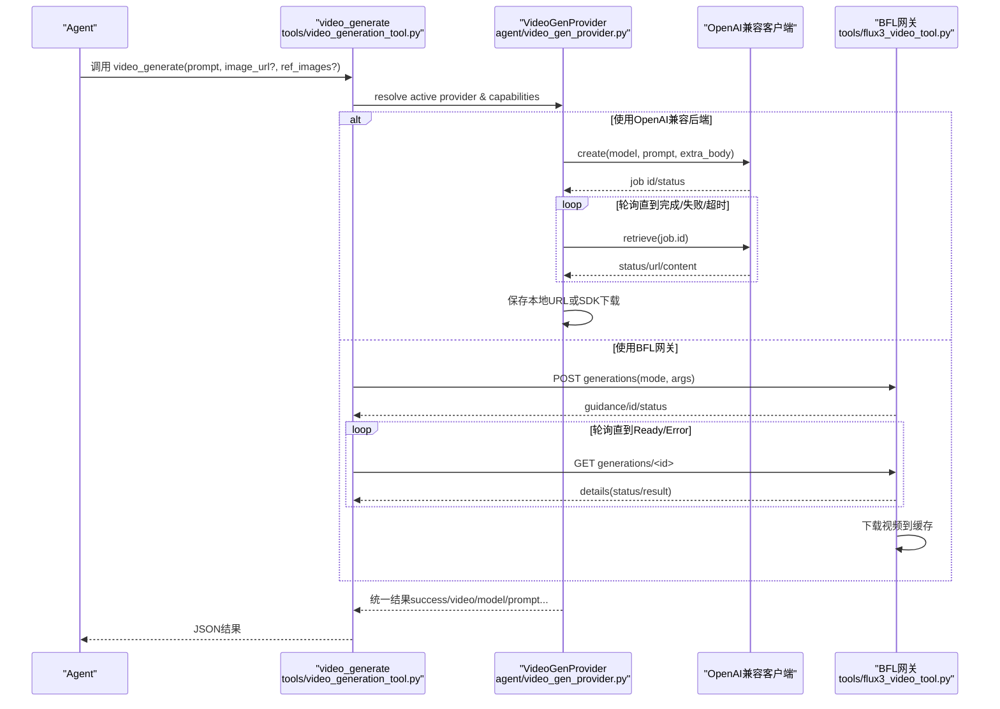
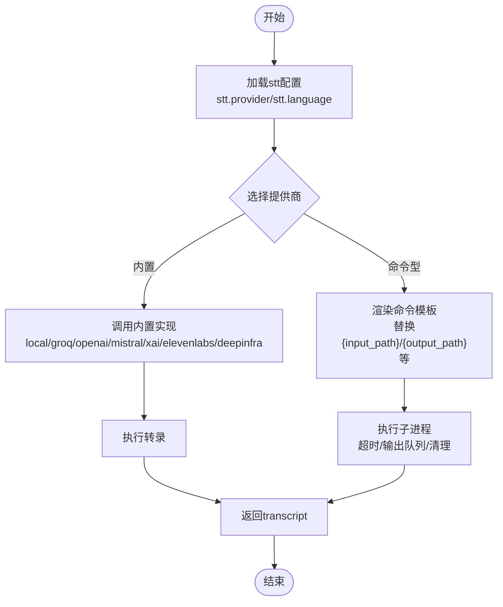
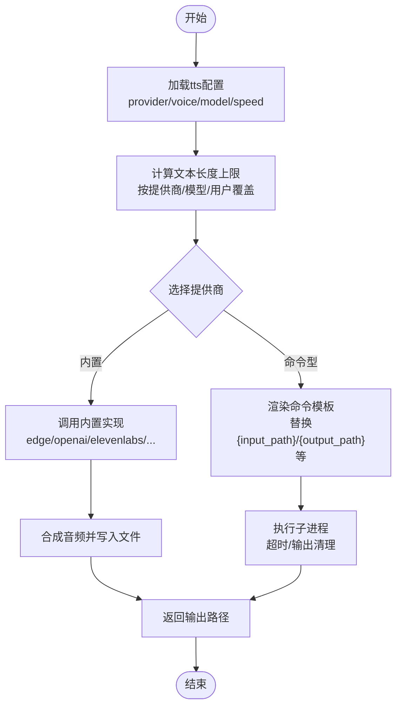
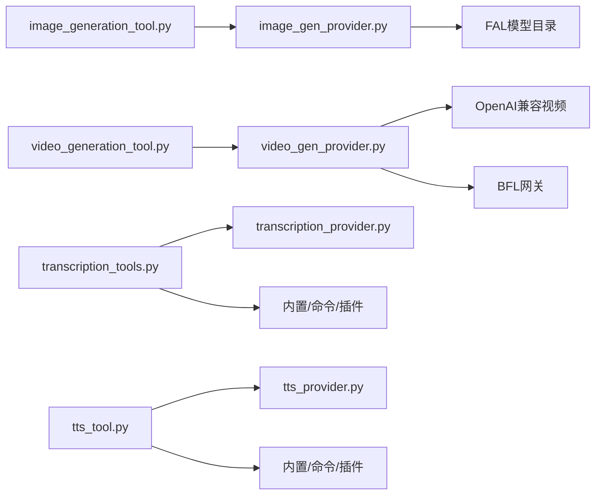

# 媒体生成工具

<cite>
**本文引用的文件**
- [agent/image_gen_provider.py](file://agent/image_gen_provider.py)
- [agent/video_gen_provider.py](file://agent/video_gen_provider.py)
- [tools/image_generation_tool.py](file://tools/image_generation_tool.py)
- [tools/video_generation_tool.py](file://tools/video_generation_tool.py)
- [tools/flux3_video_tool.py](file://tools/flux3_video_tool.py)
- [agent/transcription_provider.py](file://agent/transcription_provider.py)
- [tools/transcription_tools.py](file://tools/transcription_tools.py)
- [agent/tts_provider.py](file://agent/tts_provider.py)
- [tools/tts_tool.py](file://tools/tts_tool.py)
</cite>

## 目录
1. [简介](#简介)
2. [项目结构](#项目结构)
3. [核心组件](#核心组件)
4. [架构总览](#架构总览)
5. [详细组件分析](#详细组件分析)
6. [依赖关系分析](#依赖关系分析)
7. [性能考量](#性能考量)
8. [故障排查指南](#故障排查指南)
9. [结论](#结论)
10. [附录](#附录)

## 简介
本文件面向“媒体生成工具”的完整技术文档，覆盖图像生成、视频制作与音频处理（语音转文字、文字转语音）三大能力。重点说明：
- AI模型调用方式与多提供商集成（FAL、OpenAI兼容接口、Nous托管网关、BFL等）
- 参数调优策略（分辨率、时长、宽高比、种子、负向提示、质量等级等）
- 批量处理与工作流编排（统一工具入口、动态Schema、提供者能力探测）
- 结果优化机制（本地缓存、URL转存、下载限速与大小限制、失败回退）
- 质量控制流程（输入校验、能力声明、错误信封、超时与重试边界）
- 配置参数、成本控制与最佳实践

## 项目结构
媒体生成相关代码采用“统一工具 + 抽象提供者 + 具体实现”的分层设计：
- 抽象提供者定义在 agent/*_provider.py，提供统一的接口与响应格式
- 工具层在 tools/*_tool.py，负责参数归一化、路由、动态Schema、错误封装
- 具体后端通过插件或内置实现接入（如 FAL、OpenAI兼容、BFL、本地命令等）

图表来源
- [tools/image_generation_tool.py:97-654](file://tools/image_generation_tool.py#L97-L654)
- [agent/video_gen_provider.py:75-196](file://agent/video_gen_provider.py#L75-L196)
- [tools/flux3_video_tool.py:1-27](file://tools/flux3_video_tool.py#L1-L27)
- [tools/transcription_tools.py:1-28](file://tools/transcription_tools.py#L1-L28)
- [tools/tts_tool.py:1-35](file://tools/tts_tool.py#L1-L35)

章节来源
- [tools/image_generation_tool.py:97-654](file://tools/image_generation_tool.py#L97-L654)
- [agent/video_gen_provider.py:75-196](file://agent/video_gen_provider.py#L75-L196)
- [tools/flux3_video_tool.py:1-27](file://tools/flux3_video_tool.py#L1-L27)
- [tools/transcription_tools.py:1-28](file://tools/transcription_tools.py#L1-L28)
- [tools/tts_tool.py:1-35](file://tools/tts_tool.py#L1-L35)

## 核心组件
- 图像生成
  - 统一入口：image_generate 工具，支持文本到图像与图像编辑（参考图/掩码）
  - 模型目录：FAL_MODELS 集中管理各模型尺寸、默认参数、是否上采样、编辑端点等
  - 提供者抽象：ImageGenProvider 定义 generate()、capabilities()、list_models() 等
  - 结果缓存：save_b64_image/save_url_image 将结果持久化到本地缓存目录
- 视频生成
  - 统一入口：video_generate 工具，支持文本到视频与图像到视频
  - OpenAI兼容视频提供者：通用 create/poll/download 流程，带硬超时与轮询间隔控制
  - BFL 视频工具：通过 Nous 托管网关提交任务并轮询，自动上传本地媒体、下载成品
- 音频处理
  - 语音转文字（STT）：内置多种提供商（local、groq、openai、mistral、xai、elevenlabs、deepinfra），支持命令型自定义STT
  - 文字转语音（TTS）：内置多种提供商（edge、openai、elevenlabs、minimax、mistral、gemini、xai、neutts、kittentts、piper、deepinfra），支持命令型自定义TTS

章节来源
- [agent/image_gen_provider.py:64-188](file://agent/image_gen_provider.py#L64-L188)
- [tools/image_generation_tool.py:97-654](file://tools/image_generation_tool.py#L97-L654)
- [agent/video_gen_provider.py:75-196](file://agent/video_gen_provider.py#L75-L196)
- [tools/video_generation_tool.py:62-160](file://tools/video_generation_tool.py#L62-L160)
- [tools/flux3_video_tool.py:1-27](file://tools/flux3_video_tool.py#L1-L27)
- [agent/transcription_provider.py:61-194](file://agent/transcription_provider.py#L61-L194)
- [tools/transcription_tools.py:1-28](file://tools/transcription_tools.py#L1-L28)
- [agent/tts_provider.py:64-255](file://agent/tts_provider.py#L64-L255)
- [tools/tts_tool.py:1-35](file://tools/tts_tool.py#L1-L35)

## 架构总览
媒体生成的整体工作流遵循“工具层 -> 提供者抽象 -> 具体后端/网关”的路径。工具层负责参数归一化、能力探测、动态Schema；提供者抽象保证跨后端一致性；具体后端负责实际API调用与结果落盘。

图表来源
- [tools/image_generation_tool.py:718-796](file://tools/image_generation_tool.py#L718-L796)
- [agent/video_gen_provider.py:379-591](file://agent/video_gen_provider.py#L379-L591)
- [tools/flux3_video_tool.py:115-182](file://tools/flux3_video_tool.py#L115-L182)
- [tools/transcription_tools.py:164-210](file://tools/transcription_tools.py#L164-L210)
- [tools/tts_tool.py:469-495](file://tools/tts_tool.py#L469-L495)

## 详细组件分析

### 图像生成（Image Generation）
- 统一工具：image_generate
  - 支持文本到图像与图像编辑（参考图/掩码）
  - 模型目录 FAL_MODELS 集中管理尺寸映射、默认参数、是否上采样、编辑端点、最大参考图数量等
- 提供者抽象：ImageGenProvider
  - generate() 接收 prompt、aspect_ratio、可选 image_url/reference_image_urls
  - capabilities() 声明支持的模态（text/image）、最大参考图数
  - success_response/error_response 统一返回形状
- 结果优化
  - save_b64_image/save_url_image 将结果写入 $HERMES_HOME/cache/images/
  - URL下载带内容类型推断、大小上限保护、空响应拒绝

图表来源
- [tools/image_generation_tool.py:97-654](file://tools/image_generation_tool.py#L97-L654)
- [agent/image_gen_provider.py:165-188](file://agent/image_gen_provider.py#L165-L188)
- [agent/image_gen_provider.py:239-338](file://agent/image_gen_provider.py#L239-L338)

章节来源
- [tools/image_generation_tool.py:97-654](file://tools/image_generation_tool.py#L97-L654)
- [agent/image_gen_provider.py:64-188](file://agent/image_gen_provider.py#L64-L188)
- [agent/image_gen_provider.py:239-338](file://agent/image_gen_provider.py#L239-L338)

### 视频生成（Video Generation）
- 统一工具：video_generate
  - 支持文本到视频与图像到视频
  - 动态Schema根据当前提供者能力（模态、分辨率、时长范围、是否支持音频/负向提示/参考图）生成描述
- OpenAI兼容视频提供者
  - 通用 create/poll/download 流程，带轮询间隔与硬超时
  - 支持 extra_body 透传 provider-specific 字段（negative_prompt、aspect_ratio、seed等）
- BFL 视频工具
  - 通过 Nous 托管网关提交任务，轮询状态，自动上传本地媒体，下载成品到缓存
  - 严格的时间预算与重试策略，避免长时间阻塞

图表来源
- [tools/video_generation_tool.py:62-160](file://tools/video_generation_tool.py#L62-L160)
- [agent/video_gen_provider.py:379-591](file://agent/video_gen_provider.py#L379-L591)
- [tools/flux3_video_tool.py:115-182](file://tools/flux3_video_tool.py#L115-L182)

章节来源
- [tools/video_generation_tool.py:62-160](file://tools/video_generation_tool.py#L62-L160)
- [agent/video_gen_provider.py:379-591](file://agent/video_gen_provider.py#L379-L591)
- [tools/flux3_video_tool.py:115-182](file://tools/flux3_video_tool.py#L115-L182)

### 语音转文字（Speech-to-Text, STT）
- 内置提供商：local（faster-whisper）、groq、openai、mistral、xai、elevenlabs、deepinfra
- 命令型提供商：通过 tts.providers.<name>: type: command 声明任意CLI
- 语言与模型解析：优先从 stt.<provider>.language 读取，其次全局 stt.language，最后环境变量
- 音频预处理：必要时使用ffmpeg转码为m4a（16kHz单声道AAC），提升兼容性

图表来源
- [tools/transcription_tools.py:164-210](file://tools/transcription_tools.py#L164-L210)
- [tools/transcription_tools.py:263-286](file://tools/transcription_tools.py#L263-L286)
- [tools/transcription_tools.py:710-800](file://tools/transcription_tools.py#L710-L800)

章节来源
- [agent/transcription_provider.py:61-194](file://agent/transcription_provider.py#L61-L194)
- [tools/transcription_tools.py:164-210](file://tools/transcription_tools.py#L164-L210)
- [tools/transcription_tools.py:263-286](file://tools/transcription_tools.py#L263-L286)
- [tools/transcription_tools.py:710-800](file://tools/transcription_tools.py#L710-L800)

### 文字转语音（Text-to-Speech, TTS）
- 内置提供商：edge（默认免费）、openai、elevenlabs、minimax、mistral、gemini、xai、neutts、kittentts、piper、deepinfra
- 命令型提供商：通过 tts.providers.<name>: type: command 声明任意CLI
- 文本长度限制：按提供商维度设置上限，支持用户覆盖
- 输出格式：Opus用于语音气泡（Telegram等），MP3用于其他场景

图表来源
- [tools/tts_tool.py:469-495](file://tools/tts_tool.py#L469-L495)
- [tools/tts_tool.py:274-297](file://tools/tts_tool.py#L274-L297)
- [tools/tts_tool.py:581-630](file://tools/tts_tool.py#L581-L630)

章节来源
- [agent/tts_provider.py:64-255](file://agent/tts_provider.py#L64-L255)
- [tools/tts_tool.py:469-495](file://tools/tts_tool.py#L469-L495)
- [tools/tts_tool.py:274-297](file://tools/tts_tool.py#L274-L297)
- [tools/tts_tool.py:581-630](file://tools/tts_tool.py#L581-L630)

## 依赖关系分析
- 工具层依赖提供者抽象，确保跨后端一致性与可扩展性
- 具体后端通过插件或内置实现接入，工具层不关心底层细节
- 动态Schema使模型能根据当前提供者能力调整调用参数，减少无效尝试
- 错误处理统一通过 success/error 信封，便于上层消费与诊断

图表来源
- [tools/image_generation_tool.py:97-654](file://tools/image_generation_tool.py#L97-L654)
- [agent/video_gen_provider.py:379-591](file://agent/video_gen_provider.py#L379-L591)
- [tools/flux3_video_tool.py:1-27](file://tools/flux3_video_tool.py#L1-L27)
- [tools/transcription_tools.py:1-28](file://tools/transcription_tools.py#L1-L28)
- [tools/tts_tool.py:1-35](file://tools/tts_tool.py#L1-L35)

章节来源
- [tools/image_generation_tool.py:97-654](file://tools/image_generation_tool.py#L97-L654)
- [agent/video_gen_provider.py:379-591](file://agent/video_gen_provider.py#L379-L591)
- [tools/flux3_video_tool.py:1-27](file://tools/flux3_video_tool.py#L1-L27)
- [tools/transcription_tools.py:1-28](file://tools/transcription_tools.py#L1-L28)
- [tools/tts_tool.py:1-35](file://tools/tts_tool.py#L1-L35)

## 性能考量
- 图像生成
  - 模型目录中每个模型有 speed/price/strengths 标注，便于选择性价比最优
  - 上采样（upscale）对部分模型可能增加延迟，按需启用
  - URL下载带大小上限与内容类型校验，避免大文件或无效响应
- 视频生成
  - OpenAI兼容视频提供者使用固定轮询间隔与硬超时，防止无限等待
  - BFL视频工具采用时间预算与多次短轮询，降低阻塞风险
  - 本地缓存避免重复下载，提高后续访问速度
- 音频处理
  - STT/TTS支持懒加载与按需安装，减少启动开销
  - 音频转码（ffmpeg）统一规格，提升兼容性并减小体积
  - 文本长度限制按提供商维度设置，避免超长请求导致失败

[本节为通用指导，无需特定文件来源]

## 故障排查指南
- 图像生成
  - 检查 image_gen.provider 与 image_gen.model 配置是否正确
  - 若使用托管网关，确认 Nous Portal 已启用对应模型
  - 查看缓存目录是否存在有效文件，确认URL下载是否成功
- 视频生成
  - 确认 video_gen.provider 已启用且可用
  - 检查 OpenAI 兼容后端的 API Key 与 base_url
  - BFL 视频工具需登录 Nous Portal，否则无法上传/下载
- 音频处理
  - STT：确认 ffmpeg 可用（如需转码），检查提供商API Key
  - TTS：确认提供商API Key与模型支持的语言/音色
  - 命令型提供商：检查命令模板占位符与环境变量传递

章节来源
- [tools/image_generation_tool.py:718-796](file://tools/image_generation_tool.py#L718-L796)
- [agent/video_gen_provider.py:416-417](file://agent/video_gen_provider.py#L416-L417)
- [tools/flux3_video_tool.py:59-62](file://tools/flux3_video_tool.py#L59-L62)
- [tools/transcription_tools.py:263-286](file://tools/transcription_tools.py#L263-L286)
- [tools/tts_tool.py:469-495](file://tools/tts_tool.py#L469-L495)

## 结论
本媒体生成工具通过统一接口与抽象提供者，实现了图像、视频、音频的多提供商集成与灵活编排。工具层负责参数归一化、动态Schema与错误封装，提供者抽象保证一致性，具体后端负责实际调用与结果优化。通过本地缓存、大小限制、超时控制与失败回退，系统在稳定性与性能之间取得平衡。建议在生产环境中：
- 明确选择性价比最优的模型与提供商
- 合理配置超时与轮询策略，避免长时间阻塞
- 使用本地缓存与转码提升效率与兼容性
- 监控成本与质量，定期评估模型与提供商表现

[本节为总结，无需特定文件来源]

## 附录
- 配置参数速查
  - 图像生成：image_gen.provider、image_gen.model、aspect_ratio、reference_image_urls
  - 视频生成：video_gen.provider、video_gen.model、duration、resolution、audio、negative_prompt
  - STT：stt.provider、stt.language、stt.<provider>.model、stt.<provider>.language
  - TTS：tts.provider、tts.voice、tts.model、tts.speed、tts.output_format
- 成本控制建议
  - 选择 speed/price 更优的模型（如 FLUX Klein、Nano Banana Lite）
  - 避免不必要的上采样与高分辨率
  - 使用托管网关时注意模型白名单与计费层级
- 最佳实践
  - 使用动态Schema减少无效调用
  - 合理设置超时与重试边界
  - 利用本地缓存与转码提升效率
  - 监控错误信封中的 error_type 与 provider 信息，快速定位问题

[本节为补充信息，无需特定文件来源]