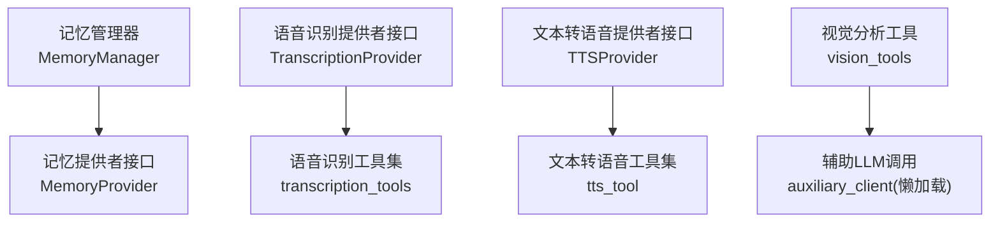
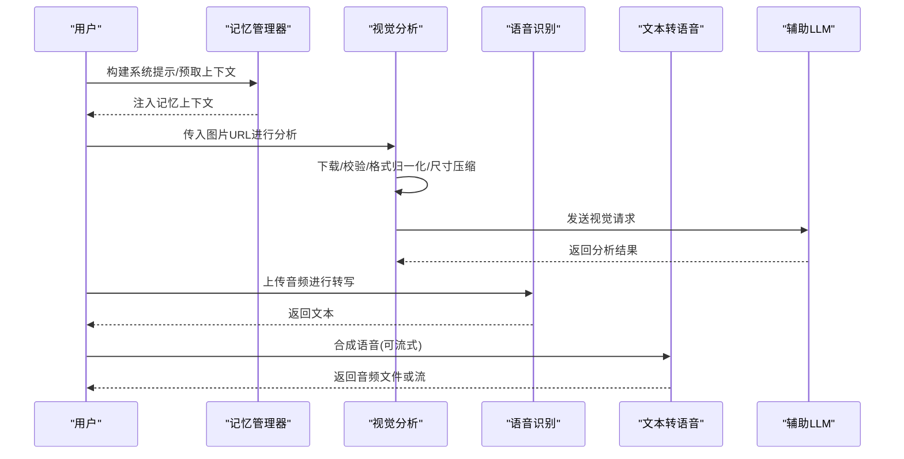
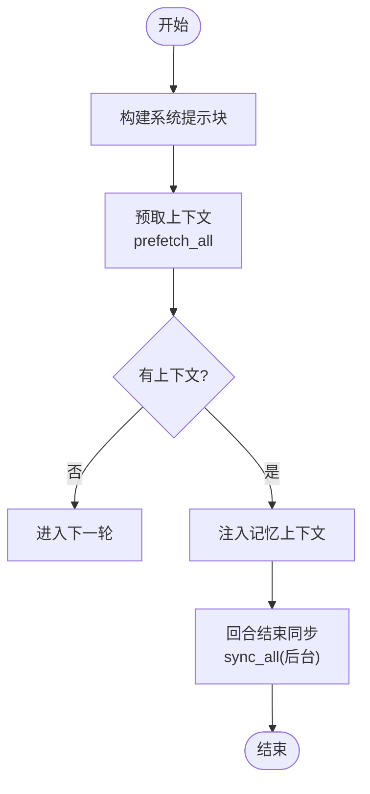
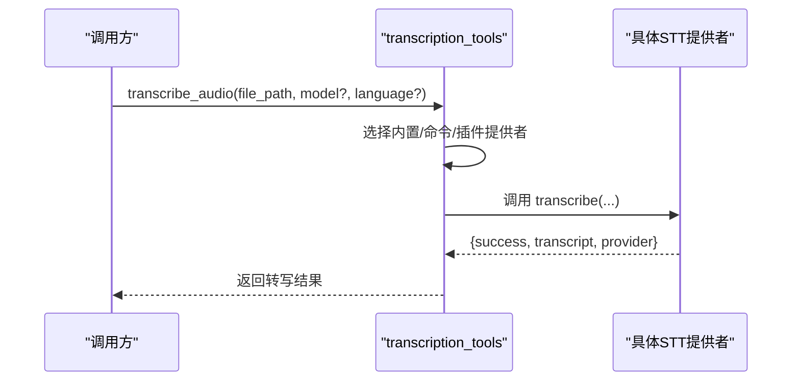
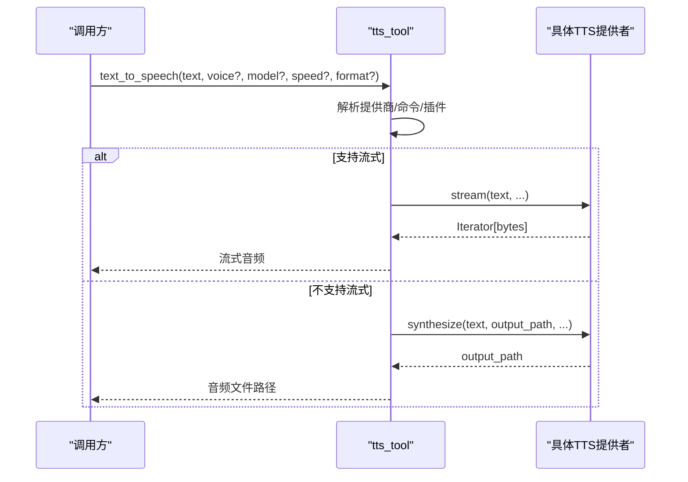
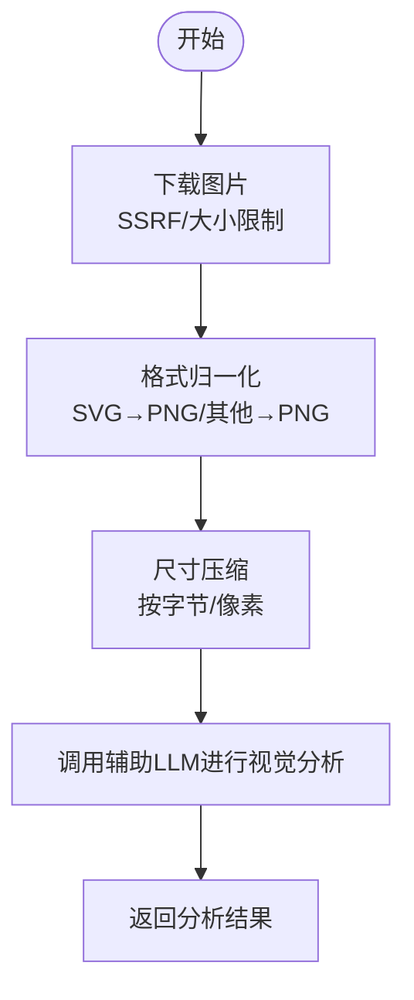
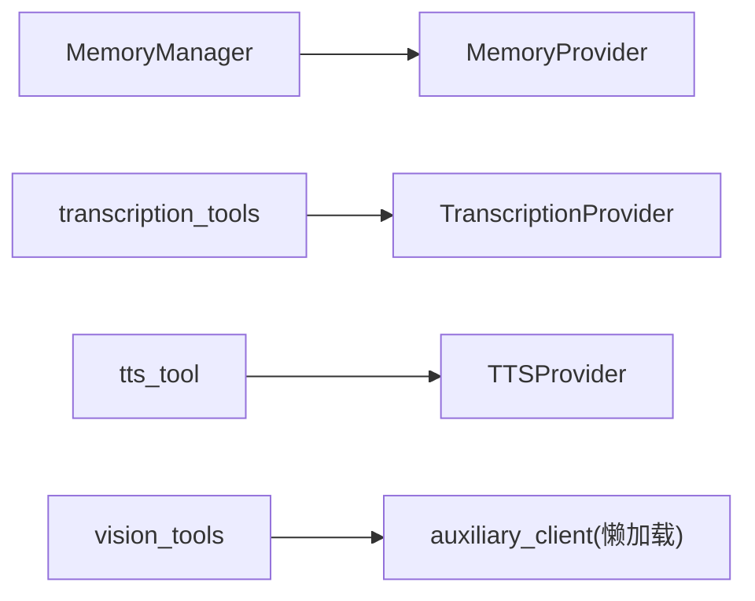

# 实用工具集

<cite>
**本文引用的文件**
- [agent/memory_manager.py](file://agent/memory_manager.py)
- [agent/memory_provider.py](file://agent/memory_provider.py)
- [agent/transcription_provider.py](file://agent/transcription_provider.py)
- [agent/tts_provider.py](file://agent/tts_provider.py)
- [tools/transcription_tools.py](file://tools/transcription_tools.py)
- [tools/tts_tool.py](file://tools/tts_tool.py)
- [tools/vision_tools.py](file://tools/vision_tools.py)
</cite>

## 目录
1. [简介](#简介)
2. [项目结构](#项目结构)
3. [核心组件](#核心组件)
4. [架构总览](#架构总览)
5. [详细组件分析](#详细组件分析)
6. [依赖关系分析](#依赖关系分析)
7. [性能考量](#性能考量)
8. [故障排查指南](#故障排查指南)
9. [结论](#结论)
10. [附录](#附录)

## 简介
本文件面向 Hermes Agent 的“实用工具集”，聚焦记忆存储、语音识别（STT）、文本转语音（TTS）与视觉分析四大能力，覆盖多模态数据处理、实时流处理与离线推理支持。文档以代码级视角梳理各模块的职责边界、数据流转、配置参数与性能调优要点，并通过序列图/流程图帮助理解工具间的协作模式。

## 项目结构
围绕实用工具集的关键路径如下：
- 记忆：MemoryManager 协调内置与外部记忆提供者；MemoryProvider 定义插件接口。
- 语音识别：TranscriptionProvider 抽象 STT 后端；transcription_tools 提供多种内置实现与命令型提供者。
- 文本转语音：TTSProvider 抽象 TTS 后端；tts_tool 提供多种内置实现、命令型提供者与流式输出。
- 视觉分析：vision_tools 负责图像下载、安全校验、格式归一化、尺寸压缩与调用辅助 LLM 进行视觉理解。

图表来源
- [agent/memory_manager.py:364-800](file://agent/memory_manager.py#L364-L800)
- [agent/memory_provider.py:81-192](file://agent/memory_provider.py#L81-L192)
- [agent/transcription_provider.py:61-194](file://agent/transcription_provider.py#L61-L194)
- [tools/transcription_tools.py:373-414](file://tools/transcription_tools.py#L373-L414)
- [agent/tts_provider.py:64-256](file://agent/tts_provider.py#L64-L256)
- [tools/tts_tool.py:609-798](file://tools/tts_tool.py#L609-L798)
- [tools/vision_tools.py:52-68](file://tools/vision_tools.py#L52-L68)

章节来源
- [agent/memory_manager.py:364-800](file://agent/memory_manager.py#L364-L800)
- [agent/memory_provider.py:81-192](file://agent/memory_provider.py#L81-L192)
- [agent/transcription_provider.py:61-194](file://agent/transcription_provider.py#L61-L194)
- [tools/transcription_tools.py:373-414](file://tools/transcription_tools.py#L373-L414)
- [agent/tts_provider.py:64-256](file://agent/tts_provider.py#L64-L256)
- [tools/tts_tool.py:609-798](file://tools/tts_tool.py#L609-L798)
- [tools/vision_tools.py:52-68](file://tools/vision_tools.py#L52-L68)

## 核心组件
- 记忆管理
  - MemoryManager：统一编排内置与至多一个外部记忆提供者；负责系统提示注入、预取上下文、回合同步与后台任务调度；对外暴露工具 schema 注入。
  - MemoryProvider：插件化记忆后端接口，定义生命周期钩子、预取/写入、工具暴露等。
- 语音识别
  - TranscriptionProvider：STT 插件抽象，要求实现 transcribe 并返回标准信封。
  - transcription_tools：内置 STT 实现（local/fast whisper、Groq、OpenAI、Mistral、xAI、ElevenLabs 等），以及命令型提供者运行器、音频转码与本地模型缓存/空闲卸载。
- 文本转语音
  - TTSProvider：TTS 插件抽象，支持 synthesize 与可选 stream；默认输出格式 mp3，流式默认 opus。
  - tts_tool：内置 TTS 实现（Edge、OpenAI、ElevenLabs、MiniMax、Mistral、Gemini、xAI、NeuTTS、KittenTTS、Piper 等），命令型提供者、流式读取与字节上限保护。
- 视觉分析
  - vision_tools：URL 下载（SSRF 防护、重定向校验、大小限制）、格式归一化（SVG 光栅化、非支持格式转 PNG）、尺寸压缩（按字节与像素维度）、并发 CPU 限流、调用辅助 LLM 完成视觉理解。

章节来源
- [agent/memory_manager.py:364-800](file://agent/memory_manager.py#L364-L800)
- [agent/memory_provider.py:81-192](file://agent/memory_provider.py#L81-L192)
- [agent/transcription_provider.py:61-194](file://agent/transcription_provider.py#L61-L194)
- [tools/transcription_tools.py:373-414](file://tools/transcription_tools.py#L373-L414)
- [agent/tts_provider.py:64-256](file://agent/tts_provider.py#L64-L256)
- [tools/tts_tool.py:609-798](file://tools/tts_tool.py#L609-L798)
- [tools/vision_tools.py:52-68](file://tools/vision_tools.py#L52-L68)

## 架构总览
下图展示从用户输入到多模态工具协同的整体流程：记忆预取注入上下文，视觉分析将图片转为受支持的格式并调用 LLM，语音识别与文本转语音分别处理音频输入与语音输出。

图表来源
- [agent/memory_manager.py:486-545](file://agent/memory_manager.py#L486-L545)
- [tools/vision_tools.py:477-572](file://tools/vision_tools.py#L477-L572)
- [tools/transcription_tools.py:373-414](file://tools/transcription_tools.py#L373-L414)
- [tools/tts_tool.py:709-798](file://tools/tts_tool.py#L709-L798)

## 详细组件分析

### 记忆存储（MemoryManager + MemoryProvider）
- 职责与协作
  - MemoryManager 维护注册表，仅允许一个外部提供者；收集系统提示块；在每轮对话前预取上下文，并在回合结束后异步同步写入。
  - 通过 normalize_tool_schema 统一 provider 的工具 schema，避免重复或冲突；对保留的核心工具名做拦截。
  - 提供 StreamingContextScrubber 清理流式响应中的内部标记片段，确保 UI 不泄露内部上下文。
- 关键流程
  - 预取：prefetch_all 串行调用各 provider 的 prefetch，失败不阻塞其他 provider。
  - 同步：sync_all 使用单工作线程序列化写入，避免跨轮次乱序；超时与守护线程保证进程退出安全。
- 配置与扩展
  - 通过 add_provider 注册；get_all_tool_schemas 暴露工具给模型；build_system_prompt 拼接系统提示。

图表来源
- [agent/memory_manager.py:486-545](file://agent/memory_manager.py#L486-L545)
- [agent/memory_manager.py:638-694](file://agent/memory_manager.py#L638-L694)

章节来源
- [agent/memory_manager.py:364-800](file://agent/memory_manager.py#L364-L800)
- [agent/memory_provider.py:81-192](file://agent/memory_provider.py#L81-L192)

### 语音识别（STT）
- 提供者抽象与内置实现
  - TranscriptionProvider 定义 name、transcribe 等契约；transcription_tools 提供 local/fast-whisper、Groq、OpenAI、Mistral、xAI、ElevenLabs 等内置实现，以及命令型提供者。
  - 内置实现支持自动转码为 m4a（16kHz 单声道 AAC），提升兼容性；本地模型单例缓存与空闲卸载降低长驻内存占用。
- 命令型提供者
  - 通过 stt.providers.<name>: type: command 声明任意 CLI 管道；支持占位符替换、环境透传、进程树终止与超时控制。
- 语言与模型解析
  - 统一的语言解析优先级：provider 级别 > 全局 stt.language > 环境变量 > 自动检测；模型名称在不同提供商间做兼容映射。

图表来源
- [agent/transcription_provider.py:61-194](file://agent/transcription_provider.py#L61-L194)
- [tools/transcription_tools.py:373-414](file://tools/transcription_tools.py#L373-L414)

章节来源
- [agent/transcription_provider.py:61-194](file://agent/transcription_provider.py#L61-L194)
- [tools/transcription_tools.py:373-414](file://tools/transcription_tools.py#L373-L414)

### 文本转语音（TTS）
- 提供者抽象与内置实现
  - TTSProvider 定义 name、synthesize、可选 stream 等；tts_tool 内置 Edge、OpenAI、ElevenLabs、MiniMax、Mistral、Gemini、xAI、NeuTTS、KittenTTS、Piper 等。
  - 支持命令型提供者（type: command），通过模板渲染与 shell 安全转义执行；流式读取时限制响应体大小，防止 OOM。
- 配置与策略
  - 每个提供商有最大文本长度限制，支持按 provider 覆盖；平台差异决定输出格式（如 Telegram 需要 Opus）。
  - 插件分发优先级：内置 > 命令型 > 插件；同名冲突时内置优先。

图表来源
- [agent/tts_provider.py:64-256](file://agent/tts_provider.py#L64-L256)
- [tools/tts_tool.py:709-798](file://tools/tts_tool.py#L709-L798)

章节来源
- [agent/tts_provider.py:64-256](file://agent/tts_provider.py#L64-L256)
- [tools/tts_tool.py:609-798](file://tools/tts_tool.py#L609-L798)

### 视觉分析（Vision Tools）
- 功能要点
  - 安全下载：SSRF 防护、重定向目标校验、内容长度与流式大小限制。
  - 格式归一化：SVG 光栅化为 PNG；非支持格式尝试 Pillow 转换；严格限制媒体类型以避免会话卡死。
  - 尺寸压缩：按字节与像素维度主动缩放，避免超过提供商限制；失败后降级重试。
  - CPU 并发限流：基于宿主可用核心数限制 encode/resize 并发，避免事件循环饥饿。
  - 辅助 LLM 调用：懒加载 auxiliary_client，按需发起视觉理解请求。
- 典型流程

图表来源
- [tools/vision_tools.py:477-572](file://tools/vision_tools.py#L477-L572)
- [tools/vision_tools.py:324-379](file://tools/vision_tools.py#L324-L379)
- [tools/vision_tools.py:745-800](file://tools/vision_tools.py#L745-L800)
- [tools/vision_tools.py:52-68](file://tools/vision_tools.py#L52-L68)

章节来源
- [tools/vision_tools.py:477-572](file://tools/vision_tools.py#L477-L572)
- [tools/vision_tools.py:324-379](file://tools/vision_tools.py#L324-L379)
- [tools/vision_tools.py:745-800](file://tools/vision_tools.py#L745-L800)
- [tools/vision_tools.py:52-68](file://tools/vision_tools.py#L52-L68)

## 依赖关系分析
- 记忆
  - MemoryManager 依赖 MemoryProvider 接口；通过 toolsets 核心工具名集合避免命名冲突；懒加载 daemon 线程池用于后台同步。
- 语音识别
  - transcription_tools 依赖 hermes_cli.config 获取配置与环境变量；通过 lazy_deps 按需安装 faster-whisper；ffmpeg 用于转码。
- 文本转语音
  - tts_tool 依赖 hermes_cli.config、lazy_deps、sounddevice（可选）与各提供商 SDK；命令型提供者通过 subprocess 执行。
- 视觉分析
  - vision_tools 依赖 httpx、Pillow（软依赖）、辅助 LLM 客户端；通过 url_safety 进行 SSRF 防护。

图表来源
- [agent/memory_manager.py:364-800](file://agent/memory_manager.py#L364-L800)
- [agent/memory_provider.py:81-192](file://agent/memory_provider.py#L81-L192)
- [tools/transcription_tools.py:373-414](file://tools/transcription_tools.py#L373-L414)
- [agent/transcription_provider.py:61-194](file://agent/transcription_provider.py#L61-L194)
- [tools/tts_tool.py:609-798](file://tools/tts_tool.py#L609-L798)
- [agent/tts_provider.py:64-256](file://agent/tts_provider.py#L64-L256)
- [tools/vision_tools.py:52-68](file://tools/vision_tools.py#L52-L68)

章节来源
- [agent/memory_manager.py:364-800](file://agent/memory_manager.py#L364-L800)
- [tools/transcription_tools.py:373-414](file://tools/transcription_tools.py#L373-L414)
- [tools/tts_tool.py:609-798](file://tools/tts_tool.py#L609-L798)
- [tools/vision_tools.py:52-68](file://tools/vision_tools.py#L52-L68)

## 性能考量
- 记忆
  - 外部预取超时与后台队列：避免慢/卡住的 provider 阻塞主流程；单工作线程序列化写入保证顺序。
  - 流式上下文清洗：StreamingContextScrubber 在分片边界正确处理 memory-context 标签，减少 UI 噪音。
- 语音识别
  - 本地模型缓存与空闲卸载：降低长驻进程内存占用；ffmpeg 转码统一容器与采样率，提高兼容性。
  - 命令型提供者超时与进程树终止：防止僵尸进程与资源泄漏。
- 文本转语音
  - 流式响应体限制：防止超大响应导致 OOM；按平台选择合适输出格式（如 Telegram 用 Opus）。
  - 提供商文本长度限制：按 provider 动态计算上限，避免无效请求。
- 视觉分析
  - CPU 并发限流：基于宿主核心数限制 encode/resize 并发，保障事件循环健康。
  - 下载与嵌入双重限制：下载阶段限制文件大小，嵌入阶段限制 base64 字节与像素维度，避免会话卡死。

章节来源
- [agent/memory_manager.py:364-800](file://agent/memory_manager.py#L364-L800)
- [tools/transcription_tools.py:373-414](file://tools/transcription_tools.py#L373-L414)
- [tools/tts_tool.py:609-798](file://tools/tts_tool.py#L609-L798)
- [tools/vision_tools.py:133-194](file://tools/vision_tools.py#L133-L194)
- [tools/vision_tools.py:624-650](file://tools/vision_tools.py#L624-L650)

## 故障排查指南
- 记忆
  - 若外部 provider 预取超时或被跳过，检查 external_prefetch_timeout 与 provider 网络/依赖；查看日志中关于超时与失败的警告。
  - 若工具 schema 被拒绝，确认 provider 返回的 schema 包含可解析的 name；必要时调整 provider 工具命名。
- 语音识别
  - 若转写失败，检查 ffmpeg 是否可用、音频格式是否需转码；确认提供商 API Key 与模型名称是否正确；命令型提供者检查命令模板与超时。
  - 本地模型未加载或占用过高，关注空闲卸载逻辑与首次加载耗时。
- 文本转语音
  - 若合成失败，检查提供商密钥、模型与文本长度限制；命令型提供者检查命令模板与输出路径；流式场景注意响应体限制。
  - 平台语音气泡格式不正确，确认输出格式与平台要求（如 Telegram 需要 Opus）。
- 视觉分析
  - 若下载失败，检查 URL 安全性、重定向目标与网络状态；确认 Content-Length 与实际大小一致。
  - 若格式不被支持，安装 Pillow 或转换为 PNG；SVG 需安装 cairosvg/svglib/rsvg-convert/inkscape 之一。
  - 若会话因图片过大卡死，检查嵌入阶段的字节与像素限制，必要时调整配置。

章节来源
- [agent/memory_manager.py:364-800](file://agent/memory_manager.py#L364-L800)
- [tools/transcription_tools.py:373-414](file://tools/transcription_tools.py#L373-L414)
- [tools/tts_tool.py:609-798](file://tools/tts_tool.py#L609-L798)
- [tools/vision_tools.py:477-572](file://tools/vision_tools.py#L477-L572)
- [tools/vision_tools.py:324-379](file://tools/vision_tools.py#L324-L379)

## 结论
Hermes Agent 的实用工具集通过统一的提供者抽象与工具层封装，实现了记忆、语音、视觉等多模态能力的可扩展与高可用。MemoryManager 保障上下文一致性，STT/TTS 提供丰富的内置与命令型实现，视觉分析在安全与性能之间取得平衡。合理配置与调优可显著提升用户体验与系统稳定性。

## 附录
- 常见配置项参考
  - 记忆：external_prefetch_timeout、memory.provider、enabled/disabled toolsets。
  - 语音识别：stt.enabled、stt.provider、stt.<provider>.language/model、HERMES_LOCAL_STT_COMMAND。
  - 文本转语音：tts.provider、tts.<provider>.model/voice/speed/output_format、tts.providers.<name>.command。
  - 视觉分析：auxiliary.vision.download_timeout、auxiliary.vision.max_concurrency、HERMES_VISION_DOWNLOAD_TIMEOUT、HERMES_VISION_MAX_CONCURRENCY。

章节来源
- [agent/memory_manager.py:364-800](file://agent/memory_manager.py#L364-L800)
- [tools/transcription_tools.py:373-414](file://tools/transcription_tools.py#L373-L414)
- [tools/tts_tool.py:609-798](file://tools/tts_tool.py#L609-L798)
- [tools/vision_tools.py:77-94](file://tools/vision_tools.py#L77-L94)
- [tools/vision_tools.py:146-181](file://tools/vision_tools.py#L146-L181)