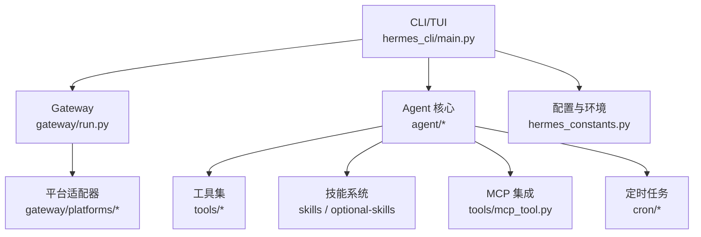
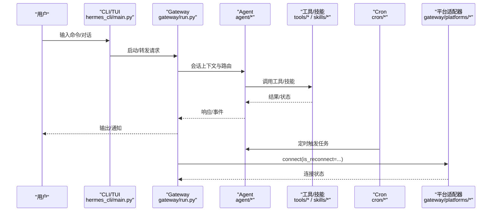
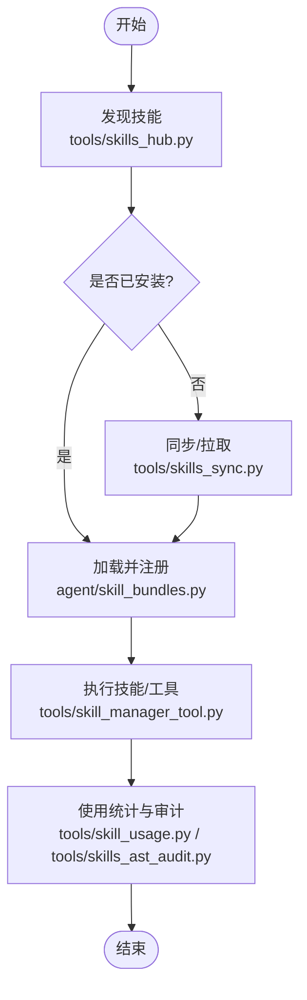
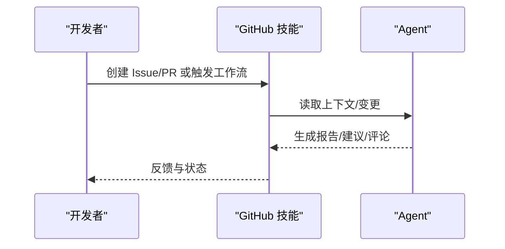
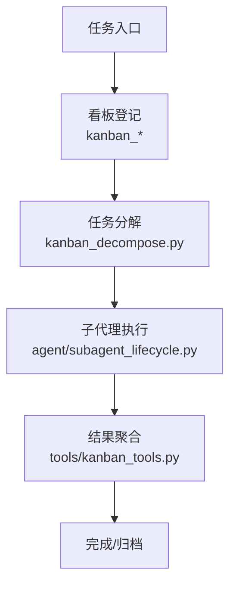
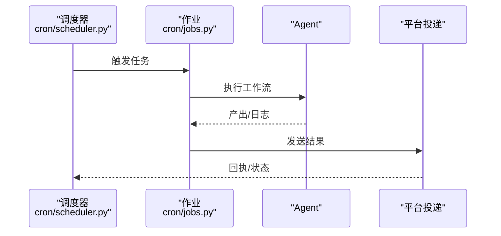
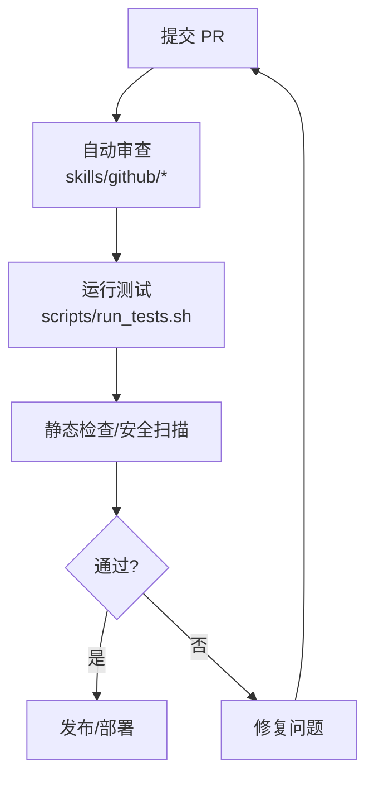
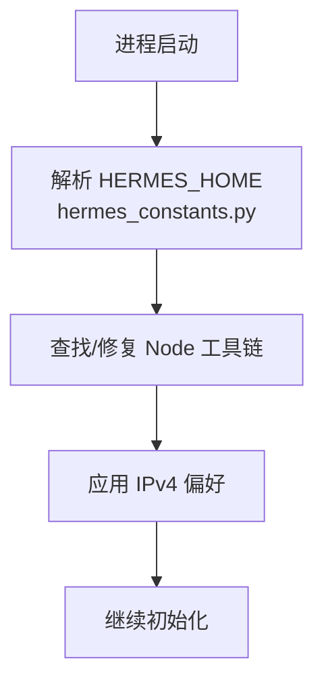
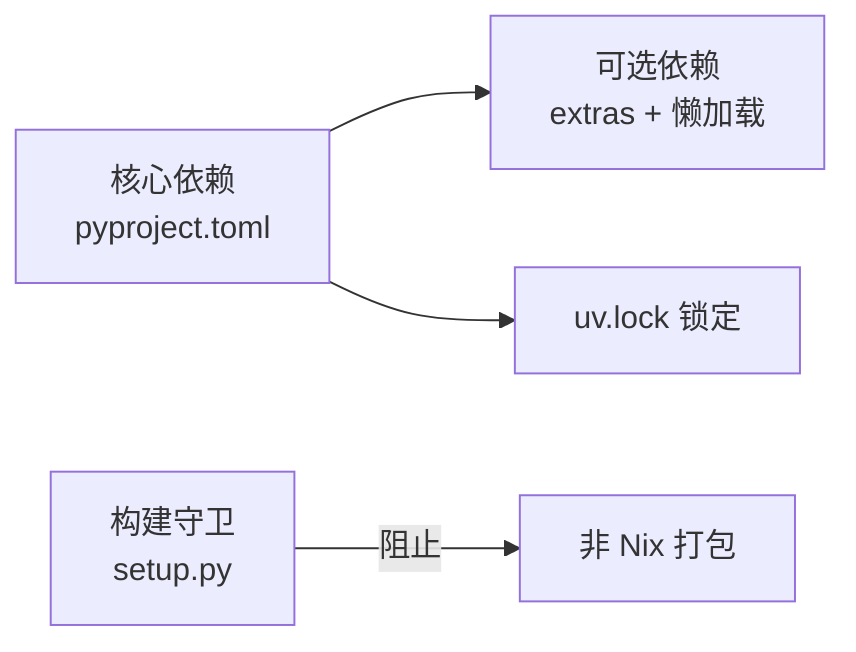

# 开发辅助工具

<cite>
**本文引用的文件**
- [README.md](file://README.md)
- [pyproject.toml](file://pyproject.toml)
- [setup.py](file://setup.py)
- [hermes_constants.py](file://hermes_constants.py)
- [cli.py](file://cli.py)
- [hermes_cli/main.py](file://hermes_cli/main.py)
- [tools/skills_hub.py](file://tools/skills_hub.py)
- [tools/skills_sync.py](file://tools/skills_sync.py)
- [tools/skill_manager_tool.py](file://tools/skill_manager_tool.py)
- [hermes_cli/skills_config.py](file://hermes_cli/skills_config.py)
- [agent/skill_bundles.py](file://agent/skill_bundles.py)
- [agent/skill_commands.py](file://agent/skill_commands.py)
- [agent/skill_utils.py](file://agent/skill_utils.py)
- [cron/jobs.py](file://cron/jobs.py)
- [cron/scheduler.py](file://cron/scheduler.py)
- [gateway/run.py](file://gateway/run.py)
- [tests/gateway/test_adapter_connect_is_reconnect_contract.py](file://tests/gateway/test_adapter_connect_is_reconnect_contract.py)
- [scripts/run_tests.sh](file://scripts/run_tests.sh)
- [.github/workflows/ci.yml](file://.github/workflows/ci.yml)
</cite>

## 目录
1. [简介](#简介)
2. [项目结构](#项目结构)
3. [核心组件](#核心组件)
4. [架构总览](#架构总览)
5. [详细组件分析](#详细组件分析)
6. [依赖分析](#依赖分析)
7. [性能考虑](#性能考虑)
8. [故障诊断指南](#故障诊断指南)
9. [结论](#结论)
10. [附录](#附录)

## 简介
本文件面向“开发辅助工具”的使用与扩展，聚焦技能管理、项目协作、任务跟踪与工作流编排。文档覆盖：
- 技能市场集成（Skills Hub）、版本控制、依赖管理与团队协作机制
- 代码审查、测试执行、部署流水线与质量保证流程
- 常见开发场景的代码示例路径、工具链集成方式与扩展点
- 配置选项、性能优化与故障诊断指南

Hermes Agent 提供 CLI/TUI、Gateway、Cron、Skills/Tools、MCP 等能力，支持多平台消息通道与云端运行时，适合在本地或远端构建自动化工作流。

**章节来源**
- [README.md:19-31](file://README.md#L19-L31)

## 项目结构
仓库采用分层与按功能域组织的方式：
- 入口与启动：CLI/TUI、Gateway、ACP Adapter
- 智能体与工具：agent、tools、plugins
- 技能与插件：skills、optional-skills、plugins
- 调度与持久化：cron、hermes_state
- 前端与桌面：apps/desktop、web、ui-tui
- 脚本与CI：scripts、.github/workflows

**图表来源**
- [hermes_cli/main.py:439-485](file://hermes_cli/main.py#L439-L485)
- [gateway/run.py:1-200](file://gateway/run.py#L1-L200)
- [hermes_constants.py:114-199](file://hermes_constants.py#L114-L199)

**章节来源**
- [hermes_cli/main.py:439-485](file://hermes_cli/main.py#L439-L485)
- [hermes_constants.py:114-199](file://hermes_constants.py#L114-L199)

## 核心组件
- 技能管理：技能发现、安装/同步、使用统计、审计与保护
- 项目协作：GitHub 技能、PR 工作流、Issue 管理
- 任务跟踪：看板（Kanban）与分解、子代理委派
- 工作流编排：Cron 调度、平台投递、会话内工具链串联
- 质量保障：测试套件、CI 流水线、安全扫描与依赖锁定

**章节来源**
- [tools/skills_hub.py:1-200](file://tools/skills_hub.py#L1-L200)
- [tools/skills_sync.py:1-200](file://tools/skills_sync.py#L1-L200)
- [cron/jobs.py:1-200](file://cron/jobs.py#L1-L200)
- [cron/scheduler.py:1-200](file://cron/scheduler.py#L1-L200)

## 架构总览
下图展示从 CLI 到 Gateway、Agent、Tools/Skills、Cron 的端到端调用关系，以及平台适配器的连接与重连契约。

**图表来源**
- [hermes_cli/main.py:439-485](file://hermes_cli/main.py#L439-L485)
- [gateway/run.py:1-200](file://gateway/run.py#L1-L200)
- [tests/gateway/test_adapter_connect_is_reconnect_contract.py:114-145](file://tests/gateway/test_adapter_connect_is_reconnect_contract.py#L114-L145)

## 详细组件分析

### 技能管理（Skills Hub、同步、使用与审计）
- 技能市场集成：通过 Skills Hub 发现、安装与更新技能；支持索引缓存与离线回退。
- 版本控制：技能包遵循约定式目录结构与清单，便于版本追踪与回滚。
- 依赖管理：按需懒加载第三方依赖，避免冷启动膨胀；通过 extras 与 uv.lock 锁定版本。
- 团队协作：多人共享技能库，结合权限与安全策略（skills_guard）限制危险操作。

**图表来源**
- [tools/skills_hub.py:1-200](file://tools/skills_hub.py#L1-L200)
- [tools/skills_sync.py:1-200](file://tools/skills_sync.py#L1-L200)
- [agent/skill_bundles.py:1-200](file://agent/skill_bundles.py#L1-L200)
- [tools/skill_manager_tool.py:1-200](file://tools/skill_manager_tool.py#L1-L200)

**章节来源**
- [tools/skills_hub.py:1-200](file://tools/skills_hub.py#L1-L200)
- [tools/skills_sync.py:1-200](file://tools/skills_sync.py#L1-L200)
- [agent/skill_bundles.py:1-200](file://agent/skill_bundles.py#L1-L200)
- [tools/skill_manager_tool.py:1-200](file://tools/skill_manager_tool.py#L1-L200)
- [hermes_cli/skills_config.py:1-200](file://hermes_cli/skills_config.py#L1-L200)

### 项目协作（GitHub 技能与 PR 工作流）
- GitHub 技能：仓库检查、Issue 管理、PR 工作流模板与参考文档。
- 协作机制：基于技能的指令驱动，将重复性协作任务标准化为可复用流程。

**图表来源**
- [skills/github/github-pr-workflow/SKILL.md:1-200](file://skills/github/github-pr-workflow/SKILL.md#L1-L200)
- [skills/github/github-code-review/SKILL.md:1-200](file://skills/github/github-code-review/SKILL.md#L1-L200)

**章节来源**
- [skills/github/github-pr-workflow/SKILL.md:1-200](file://skills/github/github-pr-workflow/SKILL.md#L1-L200)
- [skills/github/github-code-review/SKILL.md:1-200](file://skills/github/github-code-review/SKILL.md#L1-L200)

### 任务跟踪与委派（看板、分解与子代理）
- 看板与分解：将复杂任务拆解为子任务，分配给不同子代理并行处理。
- 委派与并发：子代理隔离执行，结果汇总后进入主会话。

**图表来源**
- [hermes_cli/kanban_decompose.py:1-200](file://hermes_cli/kanban_decompose.py#L1-L200)
- [tools/kanban_tools.py:1-200](file://tools/kanban_tools.py#L1-L200)
- [agent/subagent_lifecycle.py:1-200](file://agent/subagent_lifecycle.py#L1-L200)

**章节来源**
- [hermes_cli/kanban_decompose.py:1-200](file://hermes_cli/kanban_decompose.py#L1-L200)
- [tools/kanban_tools.py:1-200](file://tools/kanban_tools.py#L1-L200)
- [agent/subagent_lifecycle.py:1-200](file://agent/subagent_lifecycle.py#L1-L200)

### 工作流编排（Cron 调度与平台投递）
- Cron 调度：声明式任务定义与调度器驱动，支持周期性与一次性任务。
- 平台投递：将结果发送到各平台（Telegram/Discord/Slack 等），实现无人值守自动化。

**图表来源**
- [cron/scheduler.py:1-200](file://cron/scheduler.py#L1-L200)
- [cron/jobs.py:1-200](file://cron/jobs.py#L1-L200)

**章节来源**
- [cron/scheduler.py:1-200](file://cron/scheduler.py#L1-L200)
- [cron/jobs.py:1-200](file://cron/jobs.py#L1-L200)

### 代码审查与质量保证
- 代码审查：通过 GitHub 技能与内置提示模板，自动生成审查意见与改进建议。
- 测试执行：本地脚本与 CI 并行执行，确保回归稳定。
- 依赖锁定：pyproject.extras 与 uv.lock 精确锁定，降低供应链风险。

**图表来源**
- [scripts/run_tests.sh:1-200](file://scripts/run_tests.sh#L1-L200)
- [.github/workflows/ci.yml:1-200](file://.github/workflows/ci.yml#L1-L200)
- [pyproject.toml:310-352](file://pyproject.toml#L310-L352)

**章节来源**
- [scripts/run_tests.sh:1-200](file://scripts/run_tests.sh#L1-L200)
- [.github/workflows/ci.yml:1-200](file://.github/workflows/ci.yml#L1-L200)
- [pyproject.toml:310-352](file://pyproject.toml#L310-L352)

### 配置与环境（HERMES_HOME、Node 工具链、IPv4 偏好）
- 环境解析：统一解析 HERMES_HOME、profile、可选技能/MCP 目录。
- Node 工具链：自动检测/修复/升级 Hermes 管理的 Node/npm/npx。
- 网络偏好：早期应用 IPv4 强制，避免 DNS/双栈导致的连接问题。

**图表来源**
- [hermes_constants.py:114-199](file://hermes_constants.py#L114-L199)
- [hermes_constants.py:325-377](file://hermes_constants.py#L325-L377)
- [hermes_constants.py:589-667](file://hermes_constants.py#L589-L667)
- [hermes_cli/main.py:711-744](file://hermes_cli/main.py#L711-L744)

**章节来源**
- [hermes_constants.py:114-199](file://hermes_constants.py#L114-L199)
- [hermes_constants.py:325-377](file://hermes_constants.py#L325-L377)
- [hermes_constants.py:589-667](file://hermes_constants.py#L589-L667)
- [hermes_cli/main.py:711-744](file://hermes_cli/main.py#L711-L744)

## 依赖分析
- 核心依赖：严格精确锁定，减少供应链攻击面；仅包含每个会话必需的基础包。
- 可选依赖：通过 extras 与懒加载按需安装，避免冷启动膨胀。
- 构建守卫：禁止非 Nix 环境直接打包 wheel/sdist，保证产物一致性。

**图表来源**
- [pyproject.toml:19-155](file://pyproject.toml#L19-L155)
- [pyproject.toml:157-352](file://pyproject.toml#L157-L352)
- [setup.py:1-75](file://setup.py#L1-L75)

**章节来源**
- [pyproject.toml:19-155](file://pyproject.toml#L19-L155)
- [pyproject.toml:157-352](file://pyproject.toml#L157-L352)
- [setup.py:1-75](file://setup.py#L1-L75)

## 性能考虑
- 冷启动优化：CLI/TUI 快速路径、早读配置、抑制鼠标残留、最小化导入。
- 懒加载：第三方 SDK 与可选后端首次使用时再安装/导入。
- 资源隔离：终端/容器/云沙箱环境隔离，避免相互干扰。
- 日志与监控：集中日志、OTLP 导出（可选），便于定位瓶颈。

[本节为通用指导，不直接分析具体文件]

## 故障诊断指南
- 平台适配器重连契约：所有平台的 connect() 必须接受 is_reconnect 关键字参数，否则首次断线后无法恢复。
- 环境变量与配置：确认 HERMES_HOME、profile、IPv4 偏好是否正确设置。
- Node 工具链：若 npm/node 不可用，系统将尝试修复或重新下载。
- 测试与 CI：使用本地脚本与 CI 验证改动；关注失败用例与日志。

**章节来源**
- [tests/gateway/test_adapter_connect_is_reconnect_contract.py:114-145](file://tests/gateway/test_adapter_connect_is_reconnect_contract.py#L114-L145)
- [hermes_cli/main.py:711-744](file://hermes_cli/main.py#L711-L744)
- [hermes_constants.py:589-667](file://hermes_constants.py#L589-L667)
- [scripts/run_tests.sh:1-200](file://scripts/run_tests.sh#L1-L200)

## 结论
本开发辅助工具以“技能+工具+调度”为核心，配合严格的依赖管理与跨平台网关，形成从本地到云端的完整工作流闭环。通过标准化的技能市场、任务分解与自动化流水线，显著提升研发效率与质量。建议在团队中推广技能复用与自动化编排，并结合 CI/CD 与监控体系持续优化。

[本节为总结性内容，不直接分析具体文件]

## 附录
- 常用命令参考：交互式聊天、模型选择、工具配置、网关启动、诊断与健康检查等。
- 配置项速查：终端/浏览器/压缩/代理/安全等关键开关。
- 扩展点：自定义技能、MCP 服务器、平台适配器、Cron 作业。

**章节来源**
- [README.md:105-183](file://README.md#L105-L183)
- [cli.py:409-790](file://cli.py#L409-L790)