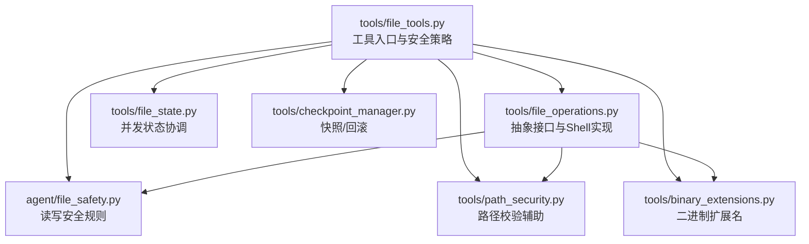
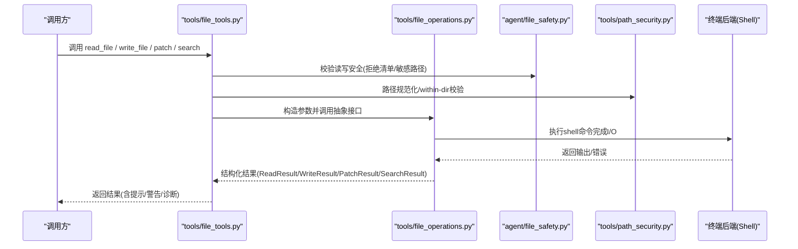
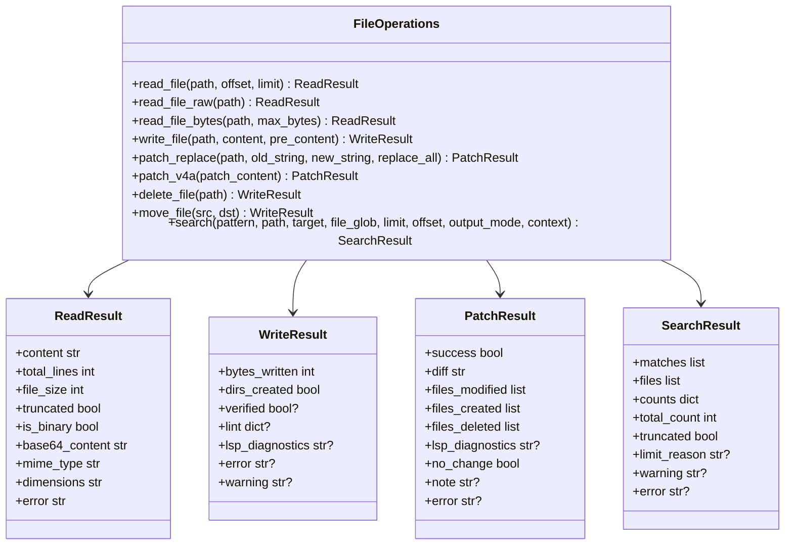
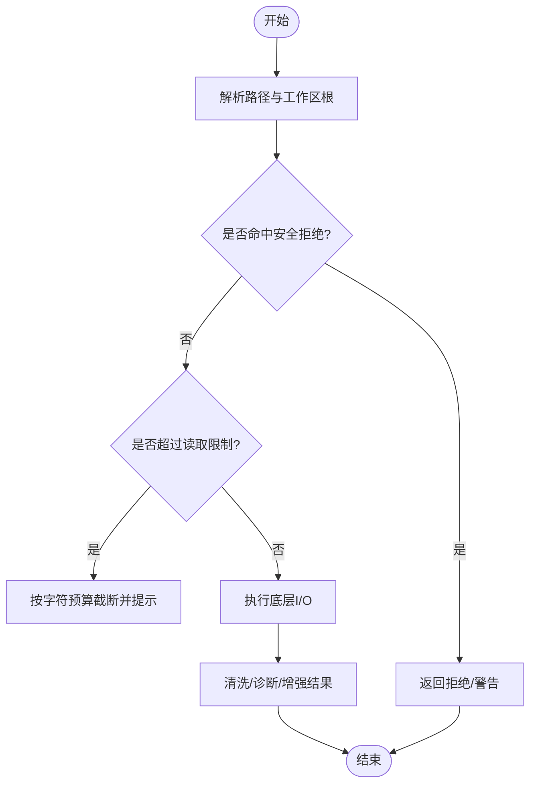
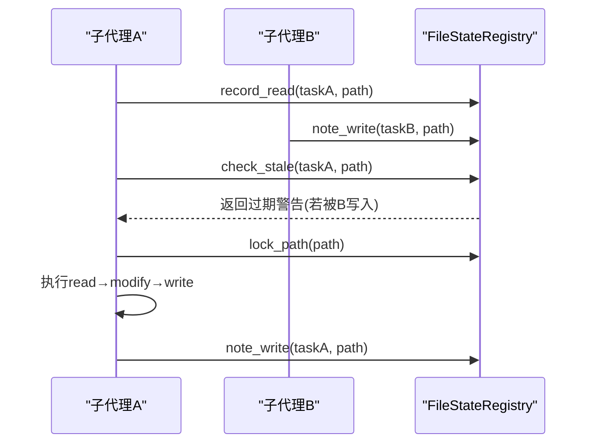
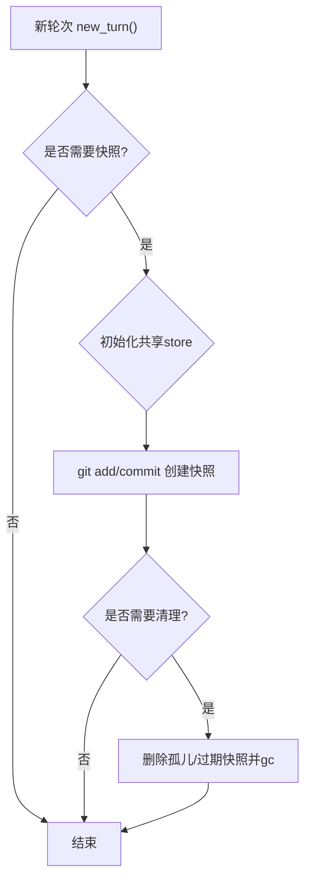
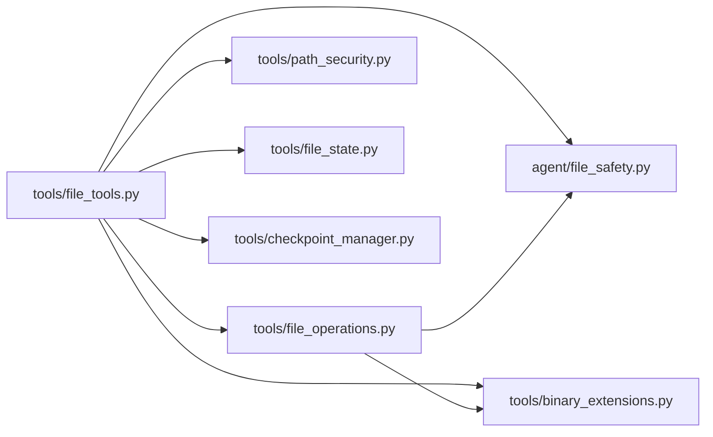

# 文件操作工具

<cite>
**本文引用的文件**
- [tools/file_operations.py](file://tools/file_operations.py)
- [tools/file_tools.py](file://tools/file_tools.py)
- [agent/file_safety.py](file://agent/file_safety.py)
- [tools/path_security.py](file://tools/path_security.py)
- [tools/binary_extensions.py](file://tools/binary_extensions.py)
- [tools/file_state.py](file://tools/file_state.py)
- [tools/checkpoint_manager.py](file://tools/checkpoint_manager.py)
</cite>

## 目录
1. [简介](#简介)
2. [项目结构](#项目结构)
3. [核心组件](#核心组件)
4. [架构总览](#架构总览)
5. [详细组件分析](#详细组件分析)
6. [依赖关系分析](#依赖关系分析)
7. [性能考量](#性能考量)
8. [故障排查指南](#故障排查指南)
9. [结论](#结论)
10. [附录](#附录)

## 简介
本文件面向 Hermes Agent 中的“文件操作工具”子系统，系统性说明其设计、能力与最佳实践。内容覆盖：
- 文件读写、目录管理、路径解析、权限检查
- 安全路径验证、大文件处理、二进制文件支持、格式转换
- 文件监控、增量同步、版本控制与备份恢复机制
- 代码示例（以源码路径引用形式呈现）
- 文件系统抽象层的设计模式与扩展机制
- 安全配置、性能优化与错误处理最佳实践

该子系统通过统一的抽象接口屏蔽不同终端后端（本地、Docker、SSH、Singularity、Modal、Daytona、Vercel Sandbox），将一切文件操作表达为 shell 命令执行，从而在跨环境场景下保持一致行为。

## 项目结构
围绕文件操作的核心模块分布如下：
- 抽象与实现：tools/file_operations.py
- 工具层封装与安全策略：tools/file_tools.py
- 安全规则与读/写边界：agent/file_safety.py
- 路径校验辅助：tools/path_security.py
- 二进制扩展名白名单：tools/binary_extensions.py
- 并发状态协调（防竞态）：tools/file_state.py
- 快照与回滚（基于共享 git 仓库）：tools/checkpoint_manager.py

图表来源
- [tools/file_tools.py:1-120](file://tools/file_tools.py#L1-L120)
- [tools/file_operations.py:450-520](file://tools/file_operations.py#L450-L520)
- [agent/file_safety.py:28-80](file://agent/file_safety.py#L28-L80)
- [tools/path_security.py:15-44](file://tools/path_security.py#L15-L44)
- [tools/binary_extensions.py:7-43](file://tools/binary_extensions.py#L7-L43)
- [tools/file_state.py:59-140](file://tools/file_state.py#L59-L140)
- [tools/checkpoint_manager.py:701-780](file://tools/checkpoint_manager.py#L701-L780)

章节来源
- [tools/file_tools.py:1-120](file://tools/file_tools.py#L1-L120)
- [tools/file_operations.py:450-520](file://tools/file_operations.py#L450-L520)

## 核心组件
- 抽象接口与 Shell 实现：提供 read/write/patch/search/delete/move 等统一 API，内部通过终端后端的 execute() 调用 shell 命令完成实际 I/O。
- 工具层封装：负责路径解析、工作区根定位、敏感路径拒绝、设备路径保护、读取大小限制、搜索过滤、结果脱敏等。
- 安全规则：集中维护读写拒绝清单、Hermes 内部缓存/凭据保护、跨 profile 写入软防护、沙箱镜像写入警告等。
- 路径校验：通用 within-dir 校验与遍历组件检测。
- 二进制识别：按扩展名快速判断是否为二进制，避免无意义的文本比较与大文件处理。
- 并发状态协调：进程内单例记录每个任务对文件的读取时间戳与最后写入者，防止子代理间覆盖修改。
- 快照与回滚：基于共享 bare git 仓库的透明快照，支持自动清理、保留策略与回滚到任意历史点。

章节来源
- [tools/file_operations.py:450-520](file://tools/file_operations.py#L450-L520)
- [tools/file_tools.py:152-400](file://tools/file_tools.py#L152-L400)
- [agent/file_safety.py:28-178](file://agent/file_safety.py#L28-L178)
- [tools/path_security.py:15-44](file://tools/path_security.py#L15-L44)
- [tools/binary_extensions.py:7-43](file://tools/binary_extensions.py#L7-L43)
- [tools/file_state.py:59-216](file://tools/file_state.py#L59-L216)
- [tools/checkpoint_manager.py:701-800](file://tools/checkpoint_manager.py#L701-L800)

## 架构总览
文件操作工具采用“抽象接口 + 具体实现 + 工具层封装”的分层设计：
- 抽象接口定义跨后端一致的能力契约（read/write/patch/search 等）。
- Shell 实现通过终端后端执行 shell 命令，适配多种运行环境。
- 工具层封装承担路径解析、安全策略、性能限制、结果清洗与增强（如 LSP 诊断、lint、BOM/换行符处理）。
- 安全与状态模块提供横切关注点：读写边界、并发一致性、快照与回滚。

图表来源
- [tools/file_tools.py:152-400](file://tools/file_tools.py#L152-L400)
- [tools/file_operations.py:450-520](file://tools/file_operations.py#L450-L520)
- [agent/file_safety.py:28-178](file://agent/file_safety.py#L28-L178)
- [tools/path_security.py:15-44](file://tools/path_security.py#L15-L44)

## 详细组件分析

### 抽象接口与 Shell 实现（FileOperations）
- 抽象类定义了 read_file/read_file_raw/read_file_bytes/write_file/patch_replace/patch_v4a/delete_file/move_file/search 等方法，确保跨后端一致。
- 结果对象包括 ReadResult、WriteResult、PatchResult、SearchResult、LintResult、ExecuteResult，提供 to_dict 序列化。
- 内置行尾检测与归一化、UTF-8 BOM 处理、搜索输出清洗与限流、JSON/YAML/TOML/Python 语法检查等。

图表来源
- [tools/file_operations.py:158-345](file://tools/file_operations.py#L158-L345)
- [tools/file_operations.py:450-520](file://tools/file_operations.py#L450-L520)

章节来源
- [tools/file_operations.py:158-345](file://tools/file_operations.py#L158-L345)
- [tools/file_operations.py:450-520](file://tools/file_operations.py#L450-L520)

### 工具层封装与安全策略（file_tools）
- 路径解析：根据任务上下文确定工作区根，兼容容器路径与 Windows 路径，避免 worktree 错位。
- 安全策略：
  - 设备路径保护：阻止读取 /dev/* 或 /proc/* 敏感路径，避免挂起或泄露。
  - 敏感系统路径拒绝：禁止直接写入系统关键目录与 Hermes 配置文件。
  - 受保护的指令文件：AGENTS.md/CLAUDE.md/SOUL.md/.cursorrules 等需人工审批。
  - 读取大小限制：按字符预算截断，避免模型上下文溢出。
  - 搜索结果过滤：移除凭据/缓存路径匹配。
- 结果增强：包含 lint/LSP 诊断、变更提示、相似文件建议等。

图表来源
- [tools/file_tools.py:152-400](file://tools/file_tools.py#L152-L400)
- [tools/file_tools.py:516-605](file://tools/file_tools.py#L516-L605)
- [tools/file_tools.py:676-704](file://tools/file_tools.py#L676-L704)

章节来源
- [tools/file_tools.py:152-400](file://tools/file_tools.py#L152-L400)
- [tools/file_tools.py:516-605](file://tools/file_tools.py#L516-L605)
- [tools/file_tools.py:676-704](file://tools/file_tools.py#L676-L704)

### 安全规则（file_safety）
- 写拒绝清单：精确路径与目录前缀（SSH、AWS、Kube、Docker、Azure、GCP、npmrc、pypirc、git-credentials、sudoers/passwd/shadow 等）。
- 读拒绝规则：Hermes 内部缓存、凭据存储、项目 .env 系列文件。
- 跨 profile 写入软保护：当写入目标属于其他 profile 的 skills/plugins/cron/memories 时给出警告。
- 沙箱镜像写入警告：非本地后端绑定的 home 镜像路径写入会告警，避免写到不可读的副本。
- 容器镜像路径分类：针对容器内路径形态进行识别与提示。

章节来源
- [agent/file_safety.py:28-178](file://agent/file_safety.py#L28-L178)
- [agent/file_safety.py:194-337](file://agent/file_safety.py#L194-L337)
- [agent/file_safety.py:417-506](file://agent/file_safety.py#L417-L506)
- [agent/file_safety.py:551-616](file://agent/file_safety.py#L551-L616)
- [agent/file_safety.py:635-693](file://agent/file_safety.py#L635-L693)

### 路径校验辅助（path_security）
- validate_within_dir：确保路径解析后位于允许根目录下，防止越权访问。
- has_traversal_component：快速检测路径中是否存在 “..” 遍历组件。

章节来源
- [tools/path_security.py:15-44](file://tools/path_security.py#L15-L44)

### 二进制扩展名（binary_extensions）
- 提供常见二进制扩展集合（图片、视频、音频、归档、可执行、字体、字节码、数据库、设计/3D、锁/数据文件等）。
- has_binary_extension：纯字符串判断，无需 I/O，用于跳过文本比较与大文件处理。

章节来源
- [tools/binary_extensions.py:7-43](file://tools/binary_extensions.py#L7-L43)

### 并发状态协调（file_state）
- FileStateRegistry：进程内单例，记录每个任务的读取时间戳与全局最后写入者，按路径加锁。
- 防竞态：
  - record_read：记录读取时间与是否部分读取。
  - note_write：记录写入并更新自身读取视图。
  - check_stale：在写前检查是否有其他子代理或外部修改导致当前视图过期。
  - lock_path：按路径粒度串行化 read→modify→write。
- 容量限制：每 agent 最多保留固定数量的路径条目，避免长会话内存膨胀。

图表来源
- [tools/file_state.py:59-216](file://tools/file_state.py#L59-L216)

章节来源
- [tools/file_state.py:59-216](file://tools/file_state.py#L59-L216)

### 快照与回滚（checkpoint_manager）
- 共享存储：单一 bare git 仓库作为影子存储，按项目哈希隔离 refs/indexes/projects 元数据。
- 自动快照：在每次对话轮次开始前，对涉及的文件变更目录创建快照，去重保证每目录仅一次。
- 排除规则：默认忽略 node_modules、dist、build、__pycache__、虚拟环境、日志、媒体、二进制、.env 等。
- 生命周期：new_turn 重置去重；ensure_checkpoint 触发快照；prune_checkpoints 清理孤儿与过期快照；list_checkpoints 列出可用快照。
- 回滚：通过 git ref 与 index 恢复到指定快照。

图表来源
- [tools/checkpoint_manager.py:701-800](file://tools/checkpoint_manager.py#L701-L800)
- [tools/checkpoint_manager.py:239-277](file://tools/checkpoint_manager.py#L239-L277)
- [tools/checkpoint_manager.py:421-487](file://tools/checkpoint_manager.py#L421-L487)

章节来源
- [tools/checkpoint_manager.py:701-800](file://tools/checkpoint_manager.py#L701-L800)
- [tools/checkpoint_manager.py:239-277](file://tools/checkpoint_manager.py#L239-L277)
- [tools/checkpoint_manager.py:421-487](file://tools/checkpoint_manager.py#L421-L487)

## 依赖关系分析
- tools/file_tools.py 依赖：
  - tools/file_operations.py：抽象接口与实现
  - agent/file_safety.py：读写安全规则
  - tools/path_security.py：路径校验
  - tools/binary_extensions.py：二进制扩展判断
  - tools/file_state.py：并发状态协调
  - tools/checkpoint_manager.py：快照与回滚
- tools/file_operations.py 依赖：
  - agent/file_safety.py：写拒绝清单
  - tools/binary_extensions.py：二进制扩展判断
- agent/file_safety.py 独立：提供安全规则供多模块复用

图表来源
- [tools/file_tools.py:1-24](file://tools/file_tools.py#L1-L24)
- [tools/file_operations.py:28-44](file://tools/file_operations.py#L28-L44)
- [agent/file_safety.py:1-27](file://agent/file_safety.py#L1-L27)

章节来源
- [tools/file_tools.py:1-24](file://tools/file_tools.py#L1-L24)
- [tools/file_operations.py:28-44](file://tools/file_operations.py#L28-L44)

## 性能考量
- 读取限制：
  - MAX_LINES/MAX_LINE_LENGTH/MAX_FILE_SIZE：限制单次读取的行数、行长与文件大小，避免阻塞与过大响应。
  - _get_max_read_chars/_truncate_to_char_budget：按字符预算截断，支持 next_offset 续读。
- 搜索优化：
  - normalize_search_pagination：限制 offset/limit，避免全量扫描。
  - _split_tool_diagnostics：分离 rg/grep 诊断与真实匹配，提高解析效率。
- 二进制跳过：
  - has_binary_extension：快速判断扩展名，跳过文本比较与大文件处理。
- 快照开销：
  - DEFAULT_EXCLUDES：忽略构建产物、缓存、日志、媒体与二进制，减少快照体积。
  - _MAX_FILES：限制扫描文件数量，避免超大目录卡顿。
  - _GIT_TIMEOUT：git 命令超时保护。
- 并发控制：
  - per-path Lock：串行化同一文件的 read→modify→write，避免竞态。
  - 容量限制：_MAX_PATHS_PER_AGENT/_MAX_GLOBAL_WRITERS 限制状态表规模。

章节来源
- [tools/file_operations.py:724-767](file://tools/file_operations.py#L724-L767)
- [tools/file_operations.py:357-419](file://tools/file_operations.py#L357-L419)
- [tools/binary_extensions.py:7-43](file://tools/binary_extensions.py#L7-L43)
- [tools/checkpoint_manager.py:81-149](file://tools/checkpoint_manager.py#L81-L149)
- [tools/file_state.py:50-57](file://tools/file_state.py#L50-L57)

## 故障排查指南
- 路径解析问题：
  - 相对路径可能解析到工作区外：使用 _path_resolution_warning 提示绝对路径修正。
  - 容器路径与主机路径差异：_uses_container_paths 决定解析策略。
- 安全拒绝：
  - 写拒绝：检查 build_write_denied_paths/build_write_denied_prefixes 与 HERMES_WRITE_SAFE_ROOT。
  - 读拒绝：检查 get_read_block_error 对 Hermes 缓存/凭据/项目 .env 的保护。
  - 设备路径保护：_is_blocked_device_path 阻止 /dev/* 与 /proc/* 敏感路径。
- 搜索失败：
  - 正则换行不匹配：_pattern_has_regex_newline 与 _is_line_oriented_newline_error 提示启用 multiline。
  - 工具诊断混入：_split_tool_diagnostics 分离诊断与匹配。
- 快照异常：
  - git 未安装或超时：_run_git 捕获 FileNotFoundError/TimeoutExpired。
  - 工作目录不存在或非目录：_run_git 提前返回错误。
  - 孤儿/过期快照：prune_checkpoints 清理。
- 并发冲突：
  - check_stale 返回过期警告：重新读取文件或确认写入顺序。
  - 长时间会话内存增长：状态表有上限，必要时重启或清理。

章节来源
- [tools/file_tools.py:402-441](file://tools/file_tools.py#L402-L441)
- [tools/file_tools.py:516-605](file://tools/file_tools.py#L516-L605)
- [tools/file_operations.py:772-800](file://tools/file_operations.py#L772-L800)
- [tools/checkpoint_manager.py:301-367](file://tools/checkpoint_manager.py#L301-L367)
- [tools/file_state.py:142-216](file://tools/file_state.py#L142-L216)

## 结论
文件操作工具通过清晰的抽象与分层设计，实现了跨终端后端的一致性与安全性。其核心优势包括：
- 统一接口与 Shell 实现，适配多种运行环境
- 完善的安全策略与路径校验，防止越权与泄露
- 强大的并发状态协调，避免子代理间覆盖修改
- 基于共享 git 的快照与回滚，提供版本控制与备份恢复
- 丰富的性能优化与错误处理，保障大规模文件操作的稳定性

建议在实际使用中：
- 合理配置安全策略（拒绝清单、安全根、受保护指令文件）
- 使用分页读取与大文件提示，避免上下文溢出
- 启用快照功能，配合保留策略与清理机制
- 利用 lint/LSP 诊断与二进制跳过，提升编辑质量与性能

## 附录
- 常见文件操作场景（以源码路径引用形式）：
  - 读取文件（分页/原始/二进制）：[tools/file_operations.py:450-471](file://tools/file_operations.py#L450-L471)
  - 写入文件（含目录创建/验证/lint/LSP）：[tools/file_operations.py:473-487](file://tools/file_operations.py#L473-L487)
  - 补丁替换（模糊匹配/V4A 格式）：[tools/file_operations.py:479-487](file://tools/file_operations.py#L479-L487)
  - 搜索内容与文件（正则/上下文/限制）：[tools/file_operations.py:510-514](file://tools/file_operations.py#L510-L514)
  - 路径解析与工作区根：[tools/file_tools.py:152-400](file://tools/file_tools.py#L152-L400)
  - 安全拒绝与设备保护：[tools/file_tools.py:516-605](file://tools/file_tools.py#L516-L605)
  - 并发状态协调（读/写/检查）：[tools/file_state.py:93-216](file://tools/file_state.py#L93-L216)
  - 快照创建与管理：[tools/checkpoint_manager.py:701-800](file://tools/checkpoint_manager.py#L701-L800)