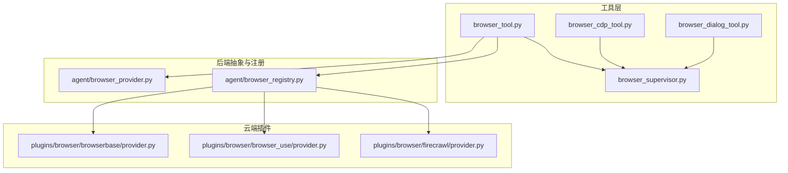
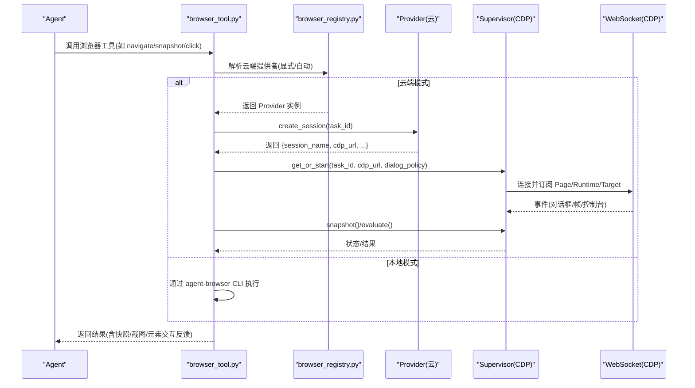
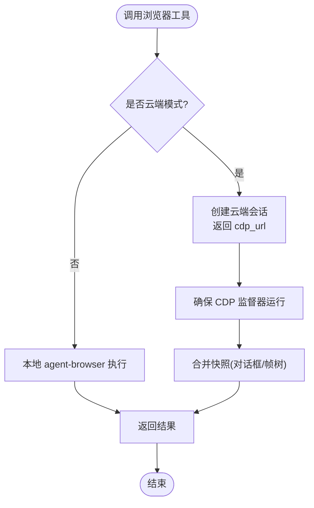
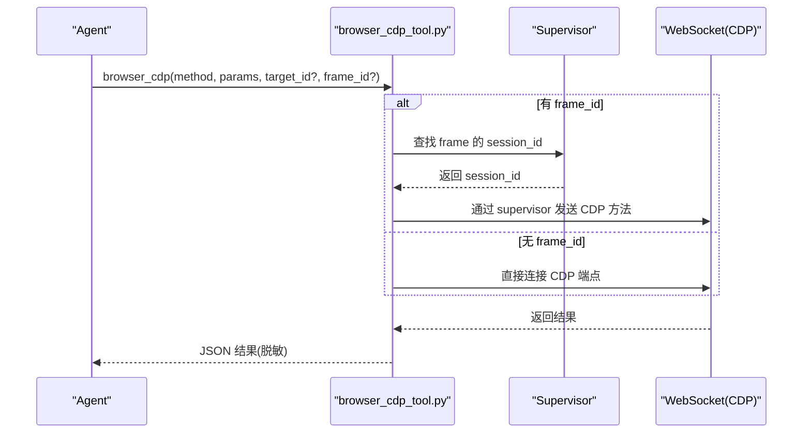
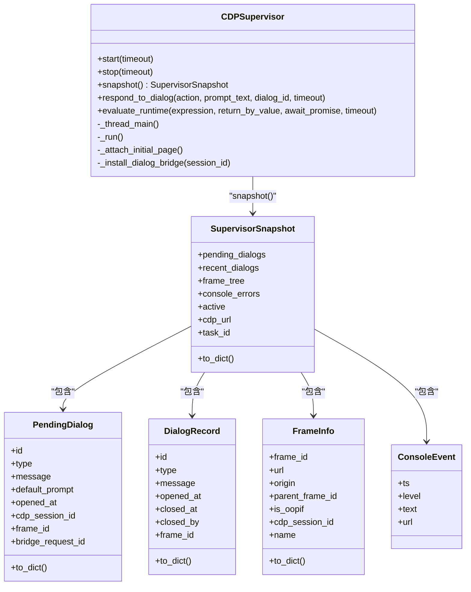
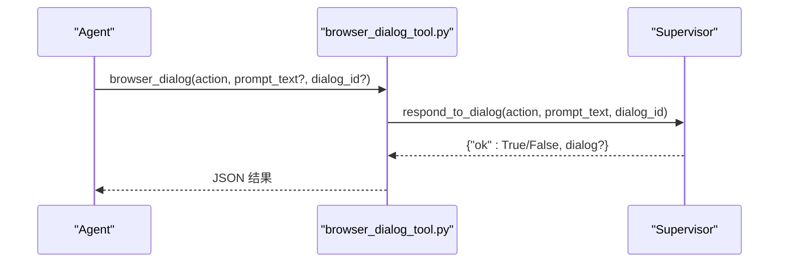
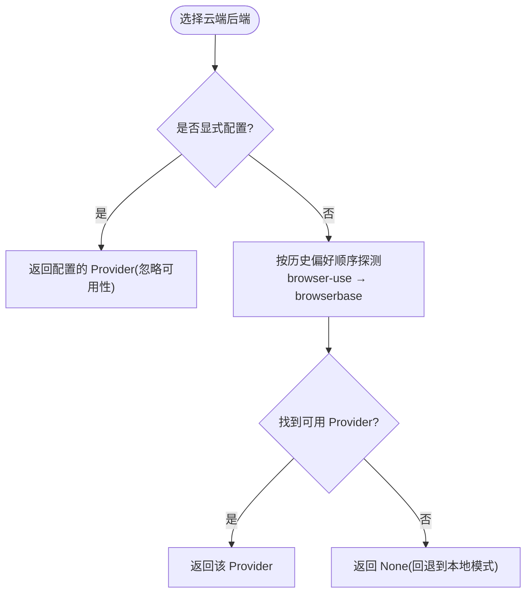
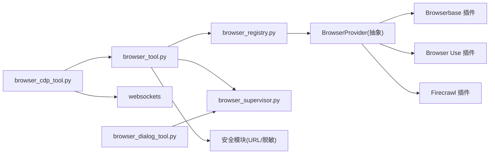

# 浏览器自动化工具

<cite>
**本文引用的文件**
- [tools/browser_tool.py](file://tools/browser_tool.py)
- [tools/browser_cdp_tool.py](file://tools/browser_cdp_tool.py)
- [tools/browser_supervisor.py](file://tools/browser_supervisor.py)
- [tools/browser_dialog_tool.py](file://tools/browser_dialog_tool.py)
- [agent/browser_provider.py](file://agent/browser_provider.py)
- [agent/browser_registry.py](file://agent/browser_registry.py)
- [plugins/browser/browserbase/provider.py](file://plugins/browser/browserbase/provider.py)
- [plugins/browser/browser_use/provider.py](file://plugins/browser/browser_use/provider.py)
- [plugins/browser/firecrawl/provider.py](file://plugins/browser/firecrawl/provider.py)
</cite>

## 目录
1. [简介](#简介)
2. [项目结构](#项目结构)
3. [核心组件](#核心组件)
4. [架构总览](#架构总览)
5. [详细组件分析](#详细组件分析)
6. [依赖关系分析](#依赖关系分析)
7. [性能与资源优化](#性能与资源优化)
8. [故障排查指南](#故障排查指南)
9. [结论](#结论)
10. [附录：配置与安全](#附录：配置与安全)

## 简介
本仓库提供一套面向 LLM Agent 的浏览器自动化能力，覆盖网页浏览、DOM/可访问性树快照、截图生成、表单填写、事件模拟、文件上传下载、网络请求拦截、原生对话框处理、多标签页管理以及会话保持。系统支持：
- 本地无头 Chromium（通过 agent-browser CLI）
- 云端浏览器后端（Browserbase、Browser Use、Firecrawl）
- 直接 CDP 连接（CDP 协议直连或经由 Supervisor 复用长连接）
- 跨进程 iframe（OOPIF）与多目标（Target）管理
- 安全策略（SSRF/私有地址拦截、敏感信息脱敏）

该工具集以“工具注册表”为中心，将浏览器操作暴露为稳定的工具接口，便于模型驱动自动化流程。

## 项目结构
围绕浏览器自动化的关键代码集中在 tools 与 agent/plugins 层：
- tools/browser_tool.py：高层浏览器工具入口，封装导航、快照、点击、截图、表单、事件、文件、网络等能力；负责选择本地或云端后端，维护任务级会话与超时策略。
- tools/browser_cdp_tool.py：原始 CDP 透传工具，用于高级场景（原生对话框、iframe 内执行、Cookie/Network 控制、低层 Tab 管理等）。
- tools/browser_supervisor.py：持久化 CDP 监督器，维护单 WebSocket 长连接，订阅 Page/Runtime/Target 事件，聚合 pending dialogs、frame_tree、console 日志，并支持在 supervisor 循环上执行 Runtime.evaluate。
- tools/browser_dialog_tool.py：面向 Agent 的对话框响应工具，配合 supervisor 完成 alert/confirm/prompt/beforeunload 的处理。
- agent/browser_provider.py：云端浏览器后端抽象（ABC），定义 create/close/emergency_cleanup 等生命周期方法。
- agent/browser_registry.py：云端后端注册与选择逻辑（显式配置优先，其次按历史偏好顺序自动探测）。
- plugins/browser/*：各云后端的具体实现（Browserbase、Browser Use、Firecrawl）。

图表来源
- [tools/browser_tool.py:1-200](file://tools/browser_tool.py#L1-L200)
- [tools/browser_cdp_tool.py:1-120](file://tools/browser_cdp_tool.py#L1-L120)
- [tools/browser_supervisor.py:1-120](file://tools/browser_supervisor.py#L1-L120)
- [agent/browser_provider.py:1-120](file://agent/browser_provider.py#L1-L120)
- [agent/browser_registry.py:1-120](file://agent/browser_registry.py#L1-L120)

章节来源
- [tools/browser_tool.py:1-200](file://tools/browser_tool.py#L1-L200)
- [agent/browser_registry.py:1-120](file://agent/browser_registry.py#L1-L120)

## 核心组件
- 浏览器工具（browser_tool.py）
  - 统一入口：导航、快照、点击、输入、滚动、截图、控制台输出、JS 执行、文件上传/下载、网络拦截、页面评估等。
  - 后端选择：根据配置与环境变量选择本地 agent-browser 或云端后端（Browserbase/Browser Use/Firecrawl）。
  - 会话隔离：按 task_id 隔离会话，支持 keep-alive、超时、清理。
  - 安全：URL 安全检查、SSRF 防护、敏感信息脱敏。
  - 超时与错误：命令超时、首次打开超时、沙箱绕过提示、Docker/系统库缺失提示。
- CDP 工具（browser_cdp_tool.py）
  - 原始 CDP 调用：支持 Target/Page/Runtime/Network/Storage 等域。
  - 安全守卫：对私有/内部地址进行拦截，限制危险方法在受限页面上下文中的使用。
  - 跨进程 iframe：通过 frame_id 路由到 supervisor 的已连接会话，避免签名 URL 过期等问题。
- CDP 监督器（browser_supervisor.py）
  - 单任务单实例：每个 task_id 一个 CDPSupervisor，持有单一 WebSocket，自动重连。
  - 事件订阅：Page/Runtime/Target 事件，维护 pending dialogs、frame_tree、console 日志。
  - 对话框桥接：注入脚本拦截 alert/confirm/prompt，通过 Fetch 拦截实现跨平台对话框处理。
  - 运行时执行：在 supervisor 循环中执行 Runtime.evaluate，避免每次子进程开销。
- 对话框工具（browser_dialog_tool.py）
  - 面向 Agent 的 accept/dismiss 接口，支持 prompt_text、dialog_id 指定。
  - 可用性门控：仅在 CDP 可达时暴露。
- 云端后端抽象与注册（browser_provider.py、browser_registry.py）
  - 抽象类：name、is_available、create_session、close_session、emergency_cleanup。
  - 注册与选择：显式配置优先，否则按历史偏好（browser-use → browserbase）自动探测。

章节来源
- [tools/browser_tool.py:250-800](file://tools/browser_tool.py#L250-L800)
- [tools/browser_cdp_tool.py:180-532](file://tools/browser_cdp_tool.py#L180-L532)
- [tools/browser_supervisor.py:286-800](file://tools/browser_supervisor.py#L286-L800)
- [tools/browser_dialog_tool.py:1-149](file://tools/browser_dialog_tool.py#L1-L149)
- [agent/browser_provider.py:45-178](file://agent/browser_provider.py#L45-L178)
- [agent/browser_registry.py:1-193](file://agent/browser_registry.py#L1-L193)

## 架构总览
浏览器自动化由“工具层 + 监督器 + 后端抽象/注册 + 云端插件”构成。工具层对外暴露稳定 API；当需要 CDP 能力时，通过 Supervisor 建立并维护长连接；云端模式通过 Provider 抽象创建/关闭会话，返回 CDP 端点供 Supervisor 或 CDP 工具使用。

图表来源
- [tools/browser_tool.py:735-800](file://tools/browser_tool.py#L735-L800)
- [agent/browser_registry.py:113-186](file://agent/browser_registry.py#L113-L186)
- [tools/browser_supervisor.py:644-740](file://tools/browser_supervisor.py#L644-L740)

## 详细组件分析

### 浏览器工具（browser_tool.py）
- 功能要点
  - 导航与超时：open 命令具备冷启动保护（首次打开更长超时），支持 Docker/系统库缺失提示。
  - 快照与提取：基于可访问性树（ariaSnapshot）生成文本快照，支持截断与 LLM 摘要，限制存储大小。
  - 元素交互：通过 ref 选择器（@e1/@e2）定位元素，支持点击、输入、滚动、键盘事件。
  - 截图：支持截图路径缓存与清理节流，避免频繁扫描目录。
  - 控制台与 JS：可获取控制台输出，或在页面上下文中执行 JS。
  - 文件上传/下载：支持文件选择与下载流处理。
  - 网络拦截：可通过 CDP 或代理方式拦截请求/响应。
  - 安全：URL 安全检查、SSRF 防护、敏感查询参数脱敏。
  - 环境隔离：子进程环境变量裁剪，仅传递必要密钥。
- 关键流程
  - 云端选择：读取配置与插件注册表，确定 provider；若显式 local 则禁用云端。
  - CDP 监督器：当存在 CDP 端点时，启动/复用 Supervisor，合并 pending_dialogs/frame_tree 到快照。
  - 超时与错误：格式化超时消息，给出修复建议（如 --no-sandbox、安装依赖）。

图表来源
- [tools/browser_tool.py:735-800](file://tools/browser_tool.py#L735-L800)
- [tools/browser_tool.py:594-650](file://tools/browser_tool.py#L594-L650)

章节来源
- [tools/browser_tool.py:250-800](file://tools/browser_tool.py#L250-L800)

### CDP 工具（browser_cdp_tool.py）
- 功能要点
  - 原始 CDP 调用：支持任意 CDP 方法，附带 target_id 或 frame_id 限定作用域。
  - 安全守卫：对私有/内部地址进行拦截；限制某些方法在受限页面上下文中的使用。
  - 跨进程 iframe：通过 frame_id 路由到 supervisor 的已连接会话，避免签名 URL 过期问题。
  - 异步桥接：在同步环境中安全运行异步 CDP 调用。
- 典型用法
  - 列出标签页：Target.getTargets
  - 处理原生对话框：Page.handleJavaScriptDialog
  - 获取 Cookie：Network.getAllCookies
  - 在特定标签页执行 JS：Runtime.evaluate
  - 设置视口：Emulation.setDeviceMetricsOverride

图表来源
- [tools/browser_cdp_tool.py:188-532](file://tools/browser_cdp_tool.py#L188-L532)
- [tools/browser_supervisor.py:286-392](file://tools/browser_supervisor.py#L286-L392)

章节来源
- [tools/browser_cdp_tool.py:180-532](file://tools/browser_cdp_tool.py#L180-L532)

### CDP 监督器（browser_supervisor.py）
- 功能要点
  - 单任务单实例：每个 task_id 一个 CDPSupervisor，持有单一 WebSocket，自动重连。
  - 事件订阅：Page/Runtime/Target 事件，维护 pending dialogs、frame_tree、console 日志。
  - 对话框桥接：注入脚本拦截 alert/confirm/prompt，通过 Fetch 拦截实现跨平台对话框处理。
  - 运行时执行：在 supervisor 循环中执行 Runtime.evaluate，避免每次子进程开销。
  - 线程安全：snapshot/respond_to_dialog/evaluate_runtime 均为同步 API，内部调度到 supervisor 的事件循环。
- 关键数据结构
  - PendingDialog：当前打开的对话框（id/type/message/default_prompt/opened_at/cdp_session_id/frame_id）
  - DialogRecord：历史对话框记录（closed_by: agent/auto_policy/remote/watchdog）
  - FrameInfo：帧信息（frame_id/url/origin/parent_frame_id/is_oopif/cdp_session_id/name）
  - ConsoleEvent：控制台事件（ts/level/text/url）
  - SupervisorSnapshot：只读快照（pending_dialogs/recent_dialogs/frame_tree/console_errors/active/cdp_url/task_id）

图表来源
- [tools/browser_supervisor.py:160-284](file://tools/browser_supervisor.py#L160-L284)
- [tools/browser_supervisor.py:286-800](file://tools/browser_supervisor.py#L286-L800)

章节来源
- [tools/browser_supervisor.py:160-800](file://tools/browser_supervisor.py#L160-L800)

### 对话框工具（browser_dialog_tool.py）
- 功能要点
  - 面向 Agent 的 accept/dismiss 接口，支持 prompt_text、dialog_id 指定。
  - 可用性门控：仅在 CDP 可达时暴露。
  - 与 Supervisor 协作：通过 SUPERVISOR_REGISTRY 获取对应 task_id 的监督器并响应对话框。

图表来源
- [tools/browser_dialog_tool.py:82-149](file://tools/browser_dialog_tool.py#L82-L149)
- [tools/browser_supervisor.py:445-506](file://tools/browser_supervisor.py#L445-L506)

章节来源
- [tools/browser_dialog_tool.py:1-149](file://tools/browser_dialog_tool.py#L1-L149)

### 云端后端抽象与注册（browser_provider.py、browser_registry.py）
- 抽象类（BrowserProvider）
  - name/display_name：标识与显示名
  - is_available：快速检查可用性（不发起网络请求）
  - create_session/close_session/emergency_cleanup：会话生命周期管理
  - get_setup_schema：工具选择器的元数据
- 注册与选择（browser_registry.py）
  - 显式配置优先：即使不可用也返回，以便下游报错更精确
  - 历史偏好顺序：browser-use → browserbase（Firecrawl 不在自动探测中）
  - 线程安全：注册表读写加锁

图表来源
- [agent/browser_registry.py:113-186](file://agent/browser_registry.py#L113-L186)
- [agent/browser_provider.py:50-178](file://agent/browser_provider.py#L50-L178)

章节来源
- [agent/browser_provider.py:45-178](file://agent/browser_provider.py#L45-L178)
- [agent/browser_registry.py:1-193](file://agent/browser_registry.py#L1-L193)

## 依赖关系分析
- 工具层依赖
  - browser_tool.py 依赖 browser_registry.py 选择云端后端；依赖 browser_supervisor.py 提供 CDP 能力；依赖安全模块进行 URL 检查与敏感信息脱敏。
  - browser_cdp_tool.py 依赖 websockets 进行 CDP 通信；依赖 browser_tool 的安全守卫。
  - browser_dialog_tool.py 依赖 browser_supervisor.py 的 SUPERVISOR_REGISTRY。
- 后端抽象与插件
  - agent/browser_provider.py 定义抽象接口；plugins/browser/* 提供具体实现；agent/browser_registry.py 管理注册与选择。
- 外部依赖
  - agent-browser CLI（本地模式）
  - websockets（CDP 通信）
  - 可选：Camofox（REST-only，不支持 CDP）

图表来源
- [tools/browser_tool.py:150-200](file://tools/browser_tool.py#L150-L200)
- [tools/browser_cdp_tool.py:59-70](file://tools/browser_cdp_tool.py#L59-L70)
- [agent/browser_registry.py:1-120](file://agent/browser_registry.py#L1-L120)

章节来源
- [tools/browser_tool.py:150-200](file://tools/browser_tool.py#L150-L200)
- [tools/browser_cdp_tool.py:59-70](file://tools/browser_cdp_tool.py#L59-L70)
- [agent/browser_registry.py:1-120](file://agent/browser_registry.py#L1-L120)

## 性能与资源优化
- 超时策略
  - 默认命令超时 30 秒；首次 open 至少 120 秒，普通 open 至少 60 秒，防止冷启动失败。
  - 可配置 command_timeout，最小值 5 秒，避免过快终止。
- 快照与存储
  - 快照内容超过阈值时截断并进行 LLM 摘要；存储上限 2MB，避免磁盘膨胀。
  - 截图清理节流，避免频繁目录扫描。
- 连接复用
  - Supervisor 维持单一 WebSocket 长连接，避免每次 CDP 调用的握手开销。
  - Runtime.evaluate 在 supervisor 循环中执行，减少子进程启动成本。
- 资源限制
  - frame_tree 条目上限 30，OOPIF 深度上限 2，控制快照体积。
  - console 历史保留最近 50 条，recent_dialogs 保留最近 20 条。
- 安全与稳定性
  - 错误消息中的 CDP URL 脱敏，避免凭证泄露。
  - 自动重连与指数退避，提升鲁棒性。

章节来源
- [tools/browser_tool.py:259-422](file://tools/browser_tool.py#L259-L422)
- [tools/browser_supervisor.py:80-96](file://tools/browser_supervisor.py#L80-L96)
- [tools/browser_supervisor.py:644-740](file://tools/browser_supervisor.py#L644-L740)

## 故障排查指南
- 常见错误与修复
  - 超时错误：检查 command_timeout 配置；首次打开需更长超时；确认系统库已安装（npx agent-browser install --with-deps）。
  - 沙箱失败：在容器或 root 环境下启用 --no-sandbox；设置 AGENT_BROWSER_ARGS="--no-sandbox,--disable-dev-shm-usage"。
  - CDP 不可达：确认 /browser connect 已执行或 config.yaml 中 browser.cdp_url 正确；检查防火墙/代理。
  - 对话框未响应：确认 CDP 监督器已启动；使用 browser_snapshot 查看 pending_dialogs；通过 browser_dialog 响应。
  - 私有地址拦截：CDP 工具对私有/内部地址进行拦截；如需访问，请调整策略或使用代理。
- 调试技巧
  - 查看控制台错误：通过 browser_console 或 supervisor 的 console_errors。
  - 检查 frame_tree：通过 browser_snapshot 的 frame_tree 字段定位 OOPIF。
  - 脱敏日志：所有 CDP URL 与敏感文本均已脱敏，便于安全调试。

章节来源
- [tools/browser_tool.py:385-422](file://tools/browser_tool.py#L385-L422)
- [tools/browser_cdp_tool.py:117-181](file://tools/browser_cdp_tool.py#L117-L181)
- [tools/browser_supervisor.py:41-65](file://tools/browser_supervisor.py#L41-L65)

## 结论
本浏览器自动化工具提供了从高层工具到低层 CDP 的完整能力栈，支持本地与云端多种后端，具备强大的会话管理、对话框处理、多标签页与跨进程 iframe 支持，并通过严格的安全策略与性能优化保障稳定性与效率。对于复杂自动化场景，推荐结合 browser_tool 的高层 API 与 browser_cdp_tool 的低层控制，利用 browser_supervisor 的长连接与事件订阅能力，实现高效可靠的自动化流程。

## 附录：配置与安全
- 配置参数
  - browser.command_timeout：命令超时（秒），默认 30，最小 5。
  - browser.dialog_policy：对话框策略（must_respond/auto_dismiss/auto_accept），默认 must_respond。
  - browser.dialog_timeout_s：对话框超时（秒），默认 300。
  - browser.cloud_provider：显式指定云端后端（local/browser-use/browserbase/firecrawl）。
  - browser.cdp_url：CDP 端点（ws/wss 或 HTTP 发现 URL）。
  - 环境变量：BROWSERBASE_API_KEY、BROWSER_USE_API_KEY、FIRECRAWL_API_KEY、BROWSER_CDP_URL 等。
- 安全注意事项
  - SSRF/私有地址拦截：CDP 工具与浏览器工具均对私有/内部地址进行拦截。
  - 敏感信息脱敏：所有 CDP URL 与页面文本输出均进行脱敏。
  - 子进程环境隔离：仅传递必要的浏览器后端密钥，避免泄露其他凭据。
  - 权限最小化：按需授予 CDP 方法，避免滥用高风险操作。

章节来源
- [tools/browser_tool.py:298-343](file://tools/browser_tool.py#L298-L343)
- [tools/browser_tool.py:558-592](file://tools/browser_tool.py#L558-L592)
- [tools/browser_cdp_tool.py:117-181](file://tools/browser_cdp_tool.py#L117-L181)
- [tools/browser_supervisor.py:41-65](file://tools/browser_supervisor.py#L41-L65)