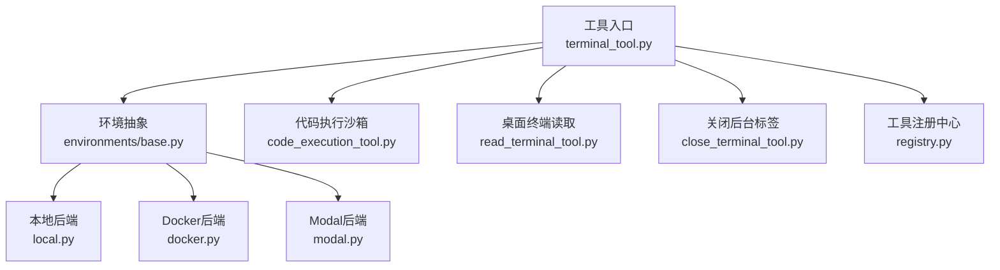
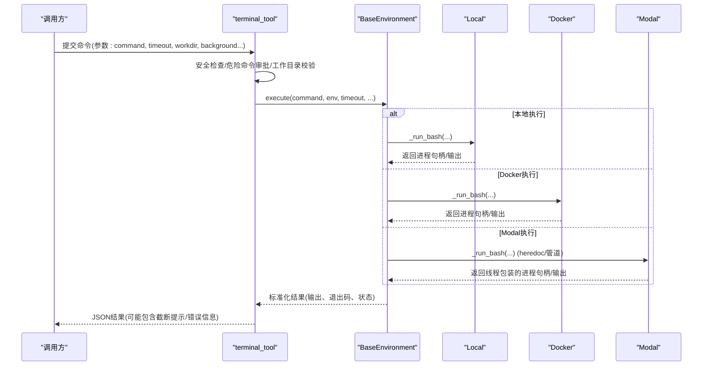
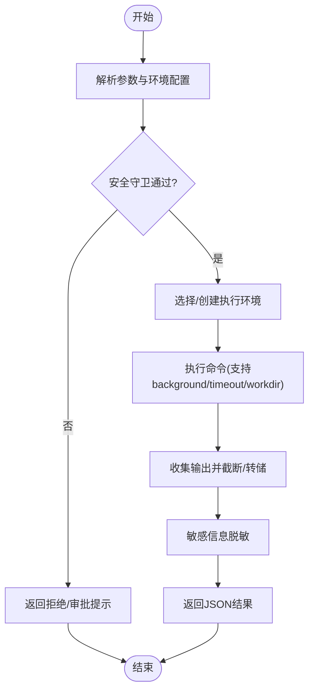
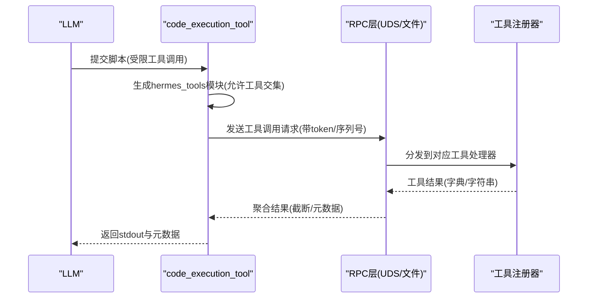
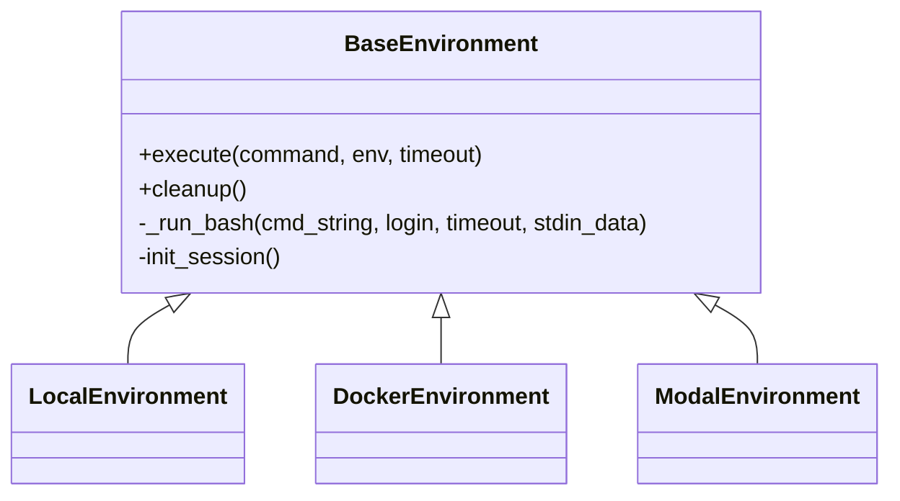
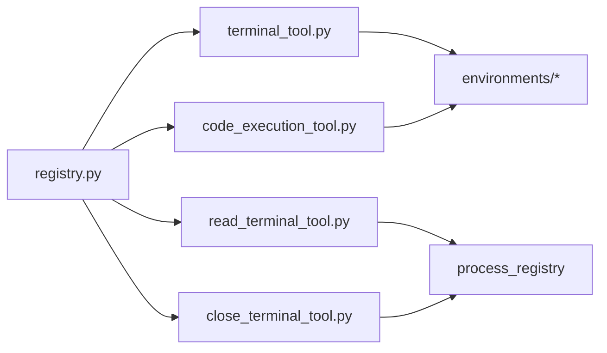

# 终端执行工具

<cite>
**本文引用的文件**
- [tools/terminal_tool.py](file://tools/terminal_tool.py)
- [tools/code_execution_tool.py](file://tools/code_execution_tool.py)
- [tools/read_terminal_tool.py](file://tools/read_terminal_tool.py)
- [tools/close_terminal_tool.py](file://tools/close_terminal_tool.py)
- [tools/environments/base.py](file://tools/environments/base.py)
- [tools/environments/docker.py](file://tools/environments/docker.py)
- [tools/environments/modal.py](file://tools/environments/modal.py)
- [tools/environments/local.py](file://tools/environments/local.py)
- [tools/environments/__init__.py](file://tools/environments/__init__.py)
- [tools/registry.py](file://tools/registry.py)
- [tests/tools/test_terminal_error_redaction.py](file://tests/tools/test_terminal_error_redaction.py)
</cite>

## 目录
1. [简介](#简介)
2. [项目结构](#项目结构)
3. [核心组件](#核心组件)
4. [架构总览](#架构总览)
5. [详细组件分析](#详细组件分析)
6. [依赖关系分析](#依赖关系分析)
7. [性能考量](#性能考量)
8. [故障排除指南](#故障排除指南)
9. [结论](#结论)
10. [附录](#附录)

## 简介
本文件面向“终端执行工具”的完整使用与实现说明，覆盖以下主题：
- 终端命令执行、代码执行环境、沙箱隔离
- 多后端执行：本地终端、Docker容器、Modal云环境（含托管模式）、Vercel Sandbox等
- 异步命令执行、输出流处理、超时控制、权限管理、错误恢复
- 配置选项、安全限制、常见场景示例与故障排除

该工具通过统一的后端抽象，将不同运行环境的差异隐藏起来，对外暴露一致的接口，便于在多种环境中稳定执行命令与脚本。

## 项目结构
终端执行能力由“工具入口 + 环境后端 + 辅助工具”组成：
- 工具入口：terminal_tool、code_execution_tool、read_terminal_tool、close_terminal_tool
- 环境后端：base（抽象基类）+ local、docker、modal、vercel_sandbox 等具体实现
- 注册与发现：registry 提供工具注册与自动发现机制

图表来源
- [tools/terminal_tool.py:1-800](file://tools/terminal_tool.py#L1-L800)
- [tools/environments/base.py:1-200](file://tools/environments/base.py#L1-L200)
- [tools/code_execution_tool.py:1-200](file://tools/code_execution_tool.py#L1-L200)
- [tools/read_terminal_tool.py:1-90](file://tools/read_terminal_tool.py#L1-L90)
- [tools/close_terminal_tool.py:1-63](file://tools/close_terminal_tool.py#L1-L63)
- [tools/registry.py:1-200](file://tools/registry.py#L1-L200)

章节来源
- [tools/environments/__init__.py:1-15](file://tools/environments/__init__.py#L1-L15)

## 核心组件
- 终端工具（terminal_tool）：选择执行后端、命令校验与安全守卫、前后置处理（sudo、工作目录、超时、中断、输出重定向与截断）。
- 代码执行工具（code_execution_tool）：为LLM生成受限的 hermes_tools 模块，通过UDS或文件RPC调用受控工具集合，限制资源与调用次数。
- 环境后端（environments/*）：统一的 BaseEnvironment 抽象，封装进程生命周期、会话快照、CWD持久化、输出收集与溢出转储。
- 桌面终端工具（read_terminal_tool、close_terminal_tool）：与GUI集成，读取或关闭后台进程的只读终端标签页。
- 工具注册（registry）：集中注册工具元数据与处理器，支持自动发现与缓存。

章节来源
- [tools/terminal_tool.py:1-800](file://tools/terminal_tool.py#L1-L800)
- [tools/code_execution_tool.py:1-800](file://tools/code_execution_tool.py#L1-L800)
- [tools/environments/base.py:1-800](file://tools/environments/base.py#L1-L800)
- [tools/read_terminal_tool.py:1-90](file://tools/read_terminal_tool.py#L1-L90)
- [tools/close_terminal_tool.py:1-63](file://tools/close_terminal_tool.py#L1-L63)
- [tools/registry.py:1-200](file://tools/registry.py#L1-L200)

## 架构总览
下图展示了从工具入口到具体后端的调用链路与关键交互点。

图表来源
- [tools/terminal_tool.py:1-800](file://tools/terminal_tool.py#L1-L800)
- [tools/environments/base.py:550-800](file://tools/environments/base.py#L550-L800)
- [tools/environments/local.py:1-200](file://tools/environments/local.py#L1-L200)
- [tools/environments/docker.py:1-200](file://tools/environments/docker.py#L1-L200)
- [tools/environments/modal.py:160-220](file://tools/environments/modal.py#L160-L220)

## 详细组件分析

### 终端工具（terminal_tool）
- 功能要点
  - 多后端选择：根据环境变量与配置选择 local、docker、modal、vercel_sandbox 等。
  - 安全守卫：危险命令检测、主机路径访问检查、sudo密码缓存与交互式输入。
  - 输出与截断：大输出采用头尾保留策略，必要时写入溢出文件以便恢复。
  - 超时与中断：前台命令硬上限、可配置超时；支持用户中断立即终止。
  - 错误处理：异常文本脱敏，结构化返回（exit_code、status、error、traceback）。
- 典型流程
  - 解析参数 → 安全检查 → 选择/创建环境 → 执行命令 → 收集输出 → 格式化结果。

图表来源
- [tools/terminal_tool.py:1-800](file://tools/terminal_tool.py#L1-L800)
- [tools/environments/base.py:80-232](file://tools/environments/base.py#L80-L232)

章节来源
- [tools/terminal_tool.py:1-800](file://tools/terminal_tool.py#L1-L800)
- [tests/tools/test_terminal_error_redaction.py:1-154](file://tests/tools/test_terminal_error_redaction.py#L1-L154)

### 代码执行工具（code_execution_tool）
- 功能要点
  - 受限工具集：web_search、web_extract、read_file、write_file、search_files、patch、terminal。
  - 两种传输：本地UDS（Unix域套接字）与远程文件RPC（适用于Docker/SSH/Modal等）。
  - 资源限制：默认超时、最大工具调用次数、stdout/stderr大小限制。
  - 环境变量清洗：严格白名单与敏感词过滤，防止泄露配置与密钥。
- 典型流程
  - 生成 hermes_tools 模块 → 启动子进程/远程执行 → RPC调度 → 限制与审计 → 返回结果。

图表来源
- [tools/code_execution_tool.py:300-800](file://tools/code_execution_tool.py#L300-L800)
- [tools/registry.py:1-200](file://tools/registry.py#L1-L200)

章节来源
- [tools/code_execution_tool.py:1-800](file://tools/code_execution_tool.py#L1-L800)

### 环境后端（environments/base.py 与各实现）
- BaseEnvironment
  - 统一接口：execute() 封装会话快照、CWD持久化、中断与超时。
  - 输出收集：_BoundedOutputCollector 维护头尾窗口，溢出时写 spill 文件。
  - 进程适配：_ThreadedProcessHandle 适配SDK后端（如Modal）的阻塞调用。
- Local
  - 路径兼容：Windows/MSYS/Git Bash路径转换与引用。
  - 安全回退：当配置的cwd不可用时，回退到可用祖先目录或临时目录。
- Docker
  - 安全加固：cap-drop ALL、no-new-privileges、PID限制、可选磁盘配额。
  - 清理回收：reap_orphan_containers 清理孤儿容器。
- Modal
  - 云沙箱：基于原生SDK，支持镜像解析、快照恢复、异步执行。
  - 快照存储：持久化任务级快照，跨会话恢复工作区。

图表来源
- [tools/environments/base.py:550-800](file://tools/environments/base.py#L550-L800)
- [tools/environments/local.py:1-200](file://tools/environments/local.py#L1-L200)
- [tools/environments/docker.py:1-200](file://tools/environments/docker.py#L1-L200)
- [tools/environments/modal.py:160-220](file://tools/environments/modal.py#L160-L220)

章节来源
- [tools/environments/base.py:1-800](file://tools/environments/base.py#L1-L800)
- [tools/environments/local.py:1-200](file://tools/environments/local.py#L1-L200)
- [tools/environments/docker.py:1-200](file://tools/environments/docker.py#L1-L200)
- [tools/environments/modal.py:1-200](file://tools/environments/modal.py#L1-L200)

### 桌面终端工具（read_terminal_tool、close_terminal_tool）
- read_terminal：读取GUI内嵌终端缓冲区内容，支持分页与滚动。
- close_terminal：关闭后台进程的只读标签页（不终止进程），用于界面整洁。

章节来源
- [tools/read_terminal_tool.py:1-90](file://tools/read_terminal_tool.py#L1-L90)
- [tools/close_terminal_tool.py:1-63](file://tools/close_terminal_tool.py#L1-L63)

## 依赖关系分析
- 工具注册与发现
  - registry 扫描 tools/*.py 中顶层 register 调用，自动导入并注册工具。
  - 缓存机制减少重复AST扫描成本。
- 工具间耦合
  - terminal_tool 依赖 environments/* 提供执行能力。
  - code_execution_tool 依赖 terminal_tool 的环境复用与文件同步能力。
  - desktop UI 工具通过 process_registry 事件桥接到渲染层。

图表来源
- [tools/registry.py:108-159](file://tools/registry.py#L108-L159)
- [tools/terminal_tool.py:1-800](file://tools/terminal_tool.py#L1-L800)
- [tools/code_execution_tool.py:780-800](file://tools/code_execution_tool.py#L780-L800)

章节来源
- [tools/registry.py:1-200](file://tools/registry.py#L1-L200)

## 性能考量
- 输出收集与截断
  - 头尾窗口策略避免内存膨胀；溢出时写入 spill 文件，保证可恢复性。
- 会话快照
  - 一次性捕获shell环境，后续命令source快照，减少登录开销。
- 后端冷启动
  - Modal/Docker首次启动较慢，可通过快照与复用降低延迟。
- 资源限制
  - 代码执行沙箱限制stdout/stderr大小与工具调用次数，防止滥用。
- 磁盘监控
  - 终端工具周期性检查磁盘用量，超过阈值给出清理建议。

[本节为通用指导，无需特定文件来源]

## 故障排除指南
- 常见问题定位
  - 后端不可达：Docker daemon未运行、SSH连接失败、Modal认证缺失。
  - 权限问题：sudo需要密码或无tty；工作目录不可访问。
  - 输出过大：启用spill文件，查看溢出位置。
  - 超时与中断：调整超时上限，确认中断信号是否被正确传递。
- 错误脱敏
  - 所有错误与回溯均进行敏感信息脱敏，避免泄露密钥。
- 调试建议
  - 开启调试开关（如 HERMES_DEBUG_INTERRUPT）观察中断与活动回调。
  - 检查环境变量清洗规则，确保必要变量透传。

章节来源
- [tests/tools/test_terminal_error_redaction.py:1-154](file://tests/tools/test_terminal_error_redaction.py#L1-L154)
- [tools/environments/base.py:31-43](file://tools/environments/base.py#L31-L43)

## 结论
终端执行工具通过统一抽象与多后端支持，提供了安全、可控且可扩展的命令执行能力。结合代码执行沙箱与桌面终端集成，既满足自动化需求，又兼顾用户体验与安全性。推荐在生产环境中启用资源限制、输出截断与错误脱敏，并根据场景选择合适的后端（本地快速、Docker隔离、云端弹性）。

[本节为总结，无需特定文件来源]

## 附录
- 配置项参考
  - TERMINAL_ENV：选择执行后端（local/docker/modal/vercel_sandbox）。
  - TERMINAL_MAX_FOREGROUND_TIMEOUT：前台命令硬上限。
  - TERMINAL_DISK_WARNING_GB：磁盘用量告警阈值。
  - 代码执行沙箱：DEFAULT_TIMEOUT、MAX_STDOUT_BYTES、MAX_STDERR_BYTES、DEFAULT_MAX_TOOL_CALLS。
- 安全限制
  - 危险命令审批、主机路径访问检查、sudo密码缓存与作用域隔离。
  - 环境变量清洗与敏感词过滤，禁止非白名单HERMES_*变量泄漏。
- 使用示例（路径指引）
  - 终端执行：参见 [tools/terminal_tool.py:1-800](file://tools/terminal_tool.py#L1-L800)
  - 代码执行沙箱：参见 [tools/code_execution_tool.py:300-800](file://tools/code_execution_tool.py#L300-L800)
  - 桌面终端读取/关闭：参见 [tools/read_terminal_tool.py:1-90](file://tools/read_terminal_tool.py#L1-L90)、[tools/close_terminal_tool.py:1-63](file://tools/close_terminal_tool.py#L1-L63)

[本节为补充信息，无需特定文件来源]