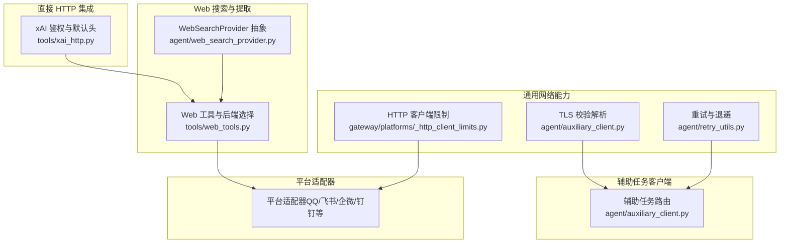
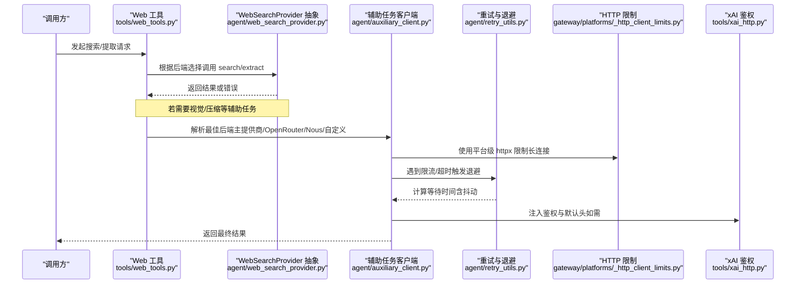
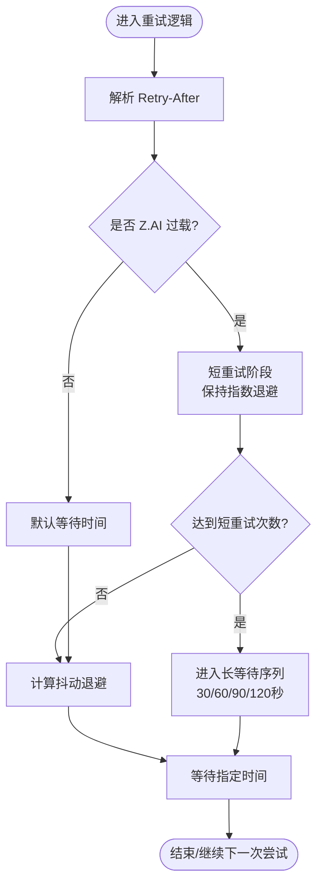
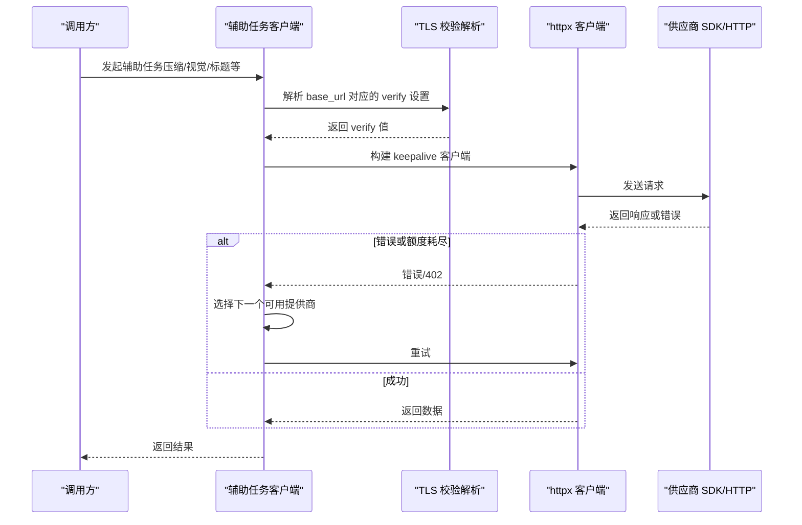
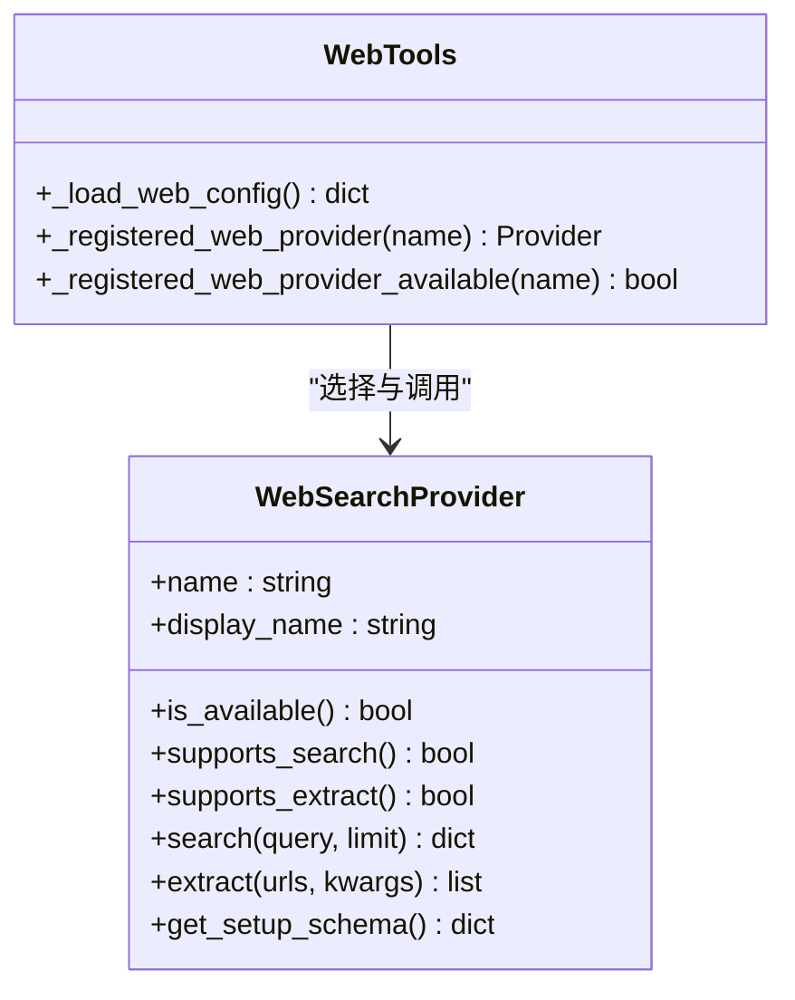
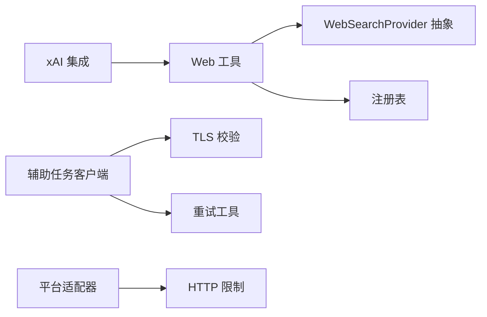

# 网络请求工具

<cite>
**本文引用的文件**
- [tools/xai_http.py](file://tools/xai_http.py)
- [agent/auxiliary_client.py](file://agent/auxiliary_client.py)
- [gateway/platforms/_http_client_limits.py](file://gateway/platforms/_http_client_limits.py)
- [agent/web_search_provider.py](file://agent/web_search_provider.py)
- [tools/web_tools.py](file://tools/web_tools.py)
- [agent/retry_utils.py](file://agent/retry_utils.py)
- [tests/gateway/test_adapter_connect_is_reconnect_contract.py](file://tests/gateway/test_adapter_connect_is_reconnect_contract.py)
</cite>

## 目录
1. [简介](#简介)
2. [项目结构](#项目结构)
3. [核心组件](#核心组件)
4. [架构总览](#架构总览)
5. [详细组件分析](#详细组件分析)
6. [依赖关系分析](#依赖关系分析)
7. [性能考虑](#性能考虑)
8. [故障排查指南](#故障排查指南)
9. [结论](#结论)
10. [附录](#附录)

## 简介
本文件面向“网络请求工具”的文档目标，围绕 HTTP 客户端、API 调用、搜索引擎集成、云服务对接等能力进行系统化说明。重点覆盖：
- 请求重试机制（退避、抖动、速率限制适配）
- 响应缓存与连接复用（keepalive、TLS 校验）
- 认证授权（OAuth、API Key、环境变量与配置层）
- 错误处理策略（分类、降级、可观测性）
- RESTful API、WebSocket 连接、文件上传下载、流式数据处理
- 配置选项、安全考量与性能优化建议

## 项目结构
本项目将网络相关能力分散在多个模块中，形成“通用能力 + 平台/服务适配”的分层结构：
- 通用网络能力：重试、限流、TLS、HTTP 客户端工厂
- 辅助任务客户端：统一解析主模型提供商、OpenRouter、Nous Portal、自定义端点等
- Web 搜索与提取：抽象接口与多后端实现（Firecrawl、Tavily、Parallel、Exa、SearXNG、Brave、DDGS、xAI）
- 平台适配器：长连接 httpx 客户端与连接池限制
- 直接 HTTP 集成：如 xAI 的鉴权与默认头注入

图表来源
- [agent/retry_utils.py:1-209](file://agent/retry_utils.py#L1-L209)
- [gateway/platforms/_http_client_limits.py:1-85](file://gateway/platforms/_http_client_limits.py#L1-L85)
- [agent/auxiliary_client.py:141-200](file://agent/auxiliary_client.py#L141-L200)
- [agent/web_search_provider.py:89-212](file://agent/web_search_provider.py#L89-L212)
- [tools/web_tools.py:1-200](file://tools/web_tools.py#L1-L200)
- [tools/xai_http.py:1-330](file://tools/xai_http.py#L1-L330)

章节来源
- [agent/retry_utils.py:1-209](file://agent/retry_utils.py#L1-L209)
- [gateway/platforms/_http_client_limits.py:1-85](file://gateway/platforms/_http_client_limits.py#L1-L85)
- [agent/auxiliary_client.py:141-200](file://agent/auxiliary_client.py#L141-L200)
- [agent/web_search_provider.py:89-212](file://agent/web_search_provider.py#L89-L212)
- [tools/web_tools.py:1-200](file://tools/web_tools.py#L1-L200)
- [tools/xai_http.py:1-330](file://tools/xai_http.py#L1-L330)

## 核心组件
- 重试与退避：提供抖动指数退避、Retry-After 解析、针对特定供应商（如 Z.AI Coding Plan）的自适应退避策略。
- 辅助任务客户端：统一解析链，自动选择最佳可用后端（主提供商、OpenRouter、Nous Portal、自定义端点、原生 Anthropic、直连 API Key 提供商），并支持支付/额度耗尽时的自动降级。
- Web 搜索与提取：定义统一的 WebSearchProvider 抽象，支持 search/extract 能力声明与插件注册；web_tools 负责后端选择与兼容导出。
- 平台适配器 HTTP 限制：为长生命周期 httpx.AsyncClient 提供紧凑的连接池与 keepalive 过期策略，避免 FD 泄漏。
- 直接 HTTP 集成（xAI）：提供鉴权解析、默认 User-Agent、存储 TTL 配置与提示。

章节来源
- [agent/retry_utils.py:1-209](file://agent/retry_utils.py#L1-L209)
- [agent/auxiliary_client.py:1-200](file://agent/auxiliary_client.py#L1-L200)
- [agent/web_search_provider.py:89-212](file://agent/web_search_provider.py#L89-L212)
- [gateway/platforms/_http_client_limits.py:1-85](file://gateway/platforms/_http_client_limits.py#L1-L85)
- [tools/xai_http.py:1-330](file://tools/xai_http.py#L1-L330)

## 架构总览
下图展示从上层工具到具体 HTTP 客户端、重试、TLS 校验与供应商选择的整体流程。

图表来源
- [tools/web_tools.py:1-200](file://tools/web_tools.py#L1-L200)
- [agent/web_search_provider.py:89-212](file://agent/web_search_provider.py#L89-L212)
- [agent/auxiliary_client.py:141-200](file://agent/auxiliary_client.py#L141-L200)
- [agent/retry_utils.py:1-209](file://agent/retry_utils.py#L1-L209)
- [gateway/platforms/_http_client_limits.py:1-85](file://gateway/platforms/_http_client_limits.py#L1-L85)
- [tools/xai_http.py:1-330](file://tools/xai_http.py#L1-L330)

## 详细组件分析

### 重试与退避（agent/retry_utils.py）
- 功能要点
  - 抖动指数退避：防止并发会话同时重试导致的“惊群效应”。
  - Retry-After 解析：支持数值与 HTTP-date 格式，确保尊重服务端限速指示。
  - 供应商特定策略：对 Z.AI Coding Plan GLM-5.2 的 429 过载采用短重试后进入渐进式长等待（30/60/90/120 秒）。
  - 上限控制：提供重试上限计算方法，保证所有长等待层级都能执行。
- 复杂度与性能
  - 退避计算 O(1)，抖动基于线程安全计数器与伪随机数生成。
  - 通过 jitter_ratio 控制抖动范围，平衡退避效果与用户体验。
- 错误处理
  - 对异常输入与不可解析的 Retry-After 值进行容错，返回 None 或 0。
- 适用场景
  - 任何需要幂等重试的 REST 调用；尤其是高并发、易限流的第三方 API。

图表来源
- [agent/retry_utils.py:38-128](file://agent/retry_utils.py#L38-L128)
- [agent/retry_utils.py:142-209](file://agent/retry_utils.py#L142-L209)

章节来源
- [agent/retry_utils.py:1-209](file://agent/retry_utils.py#L1-L209)

### 辅助任务客户端（agent/auxiliary_client.py）
- 功能要点
  - 统一解析链：优先使用用户主提供商与模型，其次 OpenRouter、Nous Portal、自定义端点、原生 Anthropic、直连 API Key 提供商。
  - 支付/额度耗尽降级：当检测到 402 或信用相关错误时，自动切换到下一个可用提供商。
  - TLS 校验解析：按 per-provider 配置与环境变量（HERMES_CA_BUNDLE、SSL_CERT_FILE）解析 httpx verify。
  - Keepalive 客户端：构建带 keepalive 的 httpx 客户端，提升长连接复用效率。
- 数据流
  - 解析 base_url → 构造 httpx 参数（verify、代理、keepalive）→ 调用供应商 SDK/HTTP → 捕获错误并触发重试/降级。
- 性能与安全
  - 延迟导入 OpenAI 类以减小冷启动开销。
  - 严格遵循 TLS 校验策略，避免中间人攻击风险。

图表来源
- [agent/auxiliary_client.py:141-200](file://agent/auxiliary_client.py#L141-L200)
- [agent/auxiliary_client.py:1-120](file://agent/auxiliary_client.py#L1-L120)

章节来源
- [agent/auxiliary_client.py:1-200](file://agent/auxiliary_client.py#L1-L200)

### Web 搜索与提取（agent/web_search_provider.py 与 tools/web_tools.py）
- 抽象接口（WebSearchProvider）
  - 能力声明：supports_search / supports_extract
  - 可用性检查：is_available（禁止网络调用，仅做轻量探测）
  - 方法契约：search(query, limit)、extract(urls, **kwargs)
  - 元数据：get_setup_schema 用于工具选择界面
- 工具与后端选择（tools/web_tools.py）
  - 内置后端白名单：parallel、firecrawl、tavily、exa、searxng、brave-free、ddgs、xai
  - 插件注册：通过 web_search_registry 发现与选择插件后端
  - 兼容导出：向后兼容测试与外部代码对 Firecrawl/Tavily/Parallel/Exa 的引用
- 数据流
  - 工具入口 → 后端选择 → 调用 provider.search/extract → 标准化结果返回

图表来源
- [agent/web_search_provider.py:89-212](file://agent/web_search_provider.py#L89-L212)
- [tools/web_tools.py:121-200](file://tools/web_tools.py#L121-L200)

章节来源
- [agent/web_search_provider.py:89-212](file://agent/web_search_provider.py#L89-L212)
- [tools/web_tools.py:1-200](file://tools/web_tools.py#L1-L200)

### 平台适配器 HTTP 限制（gateway/platforms/_http_client_limits.py）
- 背景
  - 平台适配器（QQ Bot、飞书、企微、钉钉、Signal、BlueBubbles、WeCom-callback）维护长生命周期 httpx.AsyncClient。
  - macOS 下经 Cloudflare Warp 等透明代理时，CLOSE_WAIT 可能堆积，导致 FD 耗尽。
- 策略
  - max_keepalive_connections=10：单适配器足够并行度
  - keepalive_expiry=2.0：快速回收空闲连接，避免 CLOSE_WAIT 累积
  - 可通过环境变量调整：HERMES_GATEWAY_HTTPX_KEEPALIVE_EXPIRY、HERMES_GATEWAY_HTTPX_MAX_KEEPALIVE
- 适用场景
  - 高并发消息平台适配器，需严格控制连接池与 FD 使用。

章节来源
- [gateway/platforms/_http_client_limits.py:1-85](file://gateway/platforms/_http_client_limits.py#L1-L85)

### 直接 HTTP 集成（tools/xai_http.py）
- 功能要点
  - 鉴权解析：优先 OAuth 凭证，回退到 API Key；支持强制刷新与基址覆盖。
  - 默认头注入：替换 OpenAI SDK 的 User-Agent，使流量归属 Hermes Agent。
  - 存储配置：图像/视频生成的存储开关、公开 URL、过期时间（expires_after）与提示。
- 安全与合规
  - 严格校验 base_url，避免误用非预期端点。
  - 存储 TTL 上限保护，防止过长保留引发计费问题。

章节来源
- [tools/xai_http.py:1-330](file://tools/xai_http.py#L1-L330)

### WebSocket 连接与重连契约（测试约束）
- 契约要求
  - 所有平台适配器的 connect() 必须接受 is_reconnect 关键字参数，网关重连监视器会在每次重试时传递该参数。
  - 未遵守此契约会导致首次重连失败并静默断开，直到手动重启。
- 验证方式
  - 静态 AST 解析所有 adapter.py 与 *_adapter.py，断言 connect() 签名包含 is_reconnect 或 **kwargs。

章节来源
- [tests/gateway/test_adapter_connect_is_reconnect_contract.py:1-145](file://tests/gateway/test_adapter_connect_is_reconnect_contract.py#L1-L145)

## 依赖关系分析
- 组件耦合
  - Web 工具依赖 WebSearchProvider 抽象，并通过 registry 动态选择后端。
  - 辅助任务客户端依赖 TLS 校验与 httpx 客户端工厂，结合重试工具进行弹性调用。
  - 平台适配器使用统一的 httpx 限制，保障长连接稳定性。
- 外部依赖
  - httpx：HTTP 客户端与连接池管理
  - OpenAI SDK：延迟加载，减少冷启动成本
  - 各供应商 SDK（Firecrawl、Tavily、Parallel、Exa 等）：通过插件化方式接入
- 潜在循环依赖
  - 通过抽象与注册表解耦，避免直接循环导入；工具层仅依赖抽象与 registry。

图表来源
- [tools/web_tools.py:1-200](file://tools/web_tools.py#L1-L200)
- [agent/web_search_provider.py:89-212](file://agent/web_search_provider.py#L89-L212)
- [agent/auxiliary_client.py:141-200](file://agent/auxiliary_client.py#L141-L200)
- [agent/retry_utils.py:1-209](file://agent/retry_utils.py#L1-L209)
- [gateway/platforms/_http_client_limits.py:1-85](file://gateway/platforms/_http_client_limits.py#L1-L85)
- [tools/xai_http.py:1-330](file://tools/xai_http.py#L1-L330)

## 性能考虑
- 连接复用与 keepalive
  - 使用 httpx 的 keepalive 客户端，减少 TLS 握手与 TCP 建立开销。
  - 平台适配器使用更激进的 keepalive 过期策略，避免 FD 泄漏。
- 重试与退避
  - 抖动指数退避降低并发重试风暴；针对特定供应商的长等待序列提高恢复成功率。
- 延迟导入与缓存
  - 延迟导入 OpenAI SDK，减少冷启动时间；模块级缓存避免重复解析。
- 带宽与流式
  - 对于大文件或流式数据，建议使用分块上传/下载与流式读取，避免一次性加载到内存。

## 故障排查指南
- 常见问题
  - 重连失败：确认平台适配器 connect() 是否接受 is_reconnect 参数。
  - 限流频繁：检查 Retry-After 解析与供应商特定退避策略是否生效。
  - FD 泄漏：检查平台适配器的 keepalive 过期时间与连接池大小。
  - 鉴权失败：确认 OAuth 凭证或 API Key 是否正确解析，base_url 是否被覆盖。
- 定位步骤
  - 查看重试日志与退避原因标签（如 zai_coding_overload_short/long）。
  - 检查 TLS 校验配置与证书路径。
  - 验证 Web 后端选择逻辑与插件注册状态。

章节来源
- [tests/gateway/test_adapter_connect_is_reconnect_contract.py:1-145](file://tests/gateway/test_adapter_connect_is_reconnect_contract.py#L1-L145)
- [agent/retry_utils.py:142-209](file://agent/retry_utils.py#L142-L209)
- [gateway/platforms/_http_client_limits.py:1-85](file://gateway/platforms/_http_client_limits.py#L1-L85)
- [tools/xai_http.py:257-330](file://tools/xai_http.py#L257-L330)

## 结论
本项目的网络请求工具通过分层设计与插件化架构，实现了高可用、可扩展且安全的 HTTP 调用能力。重试与退避、连接池限制、TLS 校验、鉴权解析与供应商选择共同构成了稳健的网络基础设施。建议在部署时关注连接池参数、重试策略与鉴权配置，以获得最佳性能与稳定性。

## 附录
- 配置项参考
  - 重试与退避：基础退避时间、最大延迟、抖动比例；供应商特定长等待序列。
  - HTTP 限制：keepalive 过期时间、最大保持连接数。
  - TLS 校验：CA 包路径、ssl_verify 开关、环境变量覆盖。
  - 鉴权：OAuth 凭证、API Key、base_url 覆盖。
- 安全建议
  - 始终启用 TLS 校验，避免禁用 ssl_verify。
  - 谨慎设置 expires_after，避免长期存储带来的计费与隐私风险。
  - 使用最小权限原则配置 API Key 与 OAuth 范围。
- 性能优化建议
  - 在高并发场景下调小 keepalive 过期时间，避免 FD 泄漏。
  - 合理设置重试上限与退避策略，避免过度重试影响用户体验。
  - 使用流式传输处理大文件与媒体资源，降低内存占用。