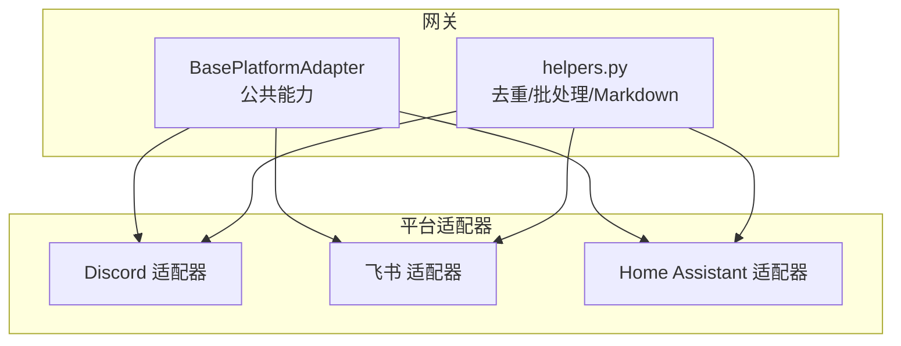
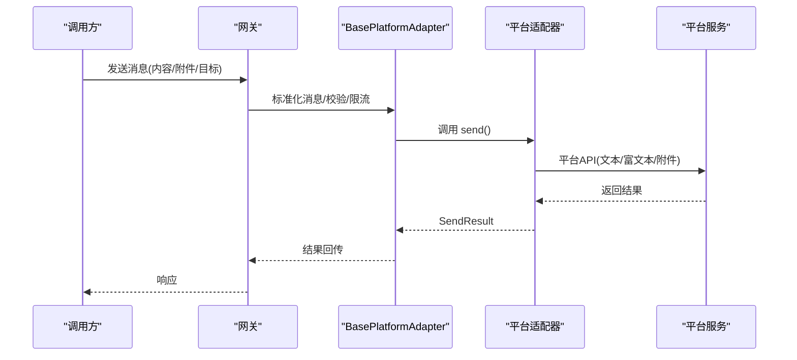
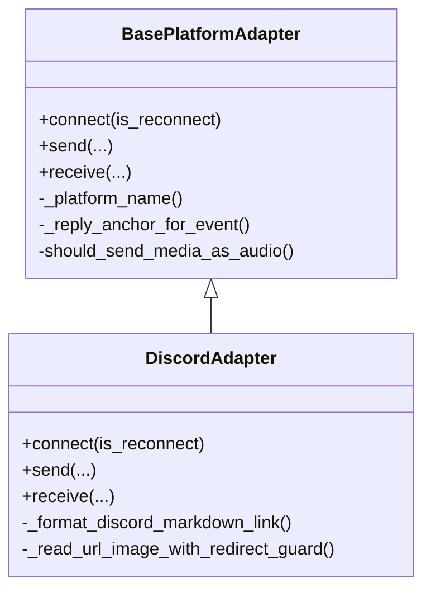
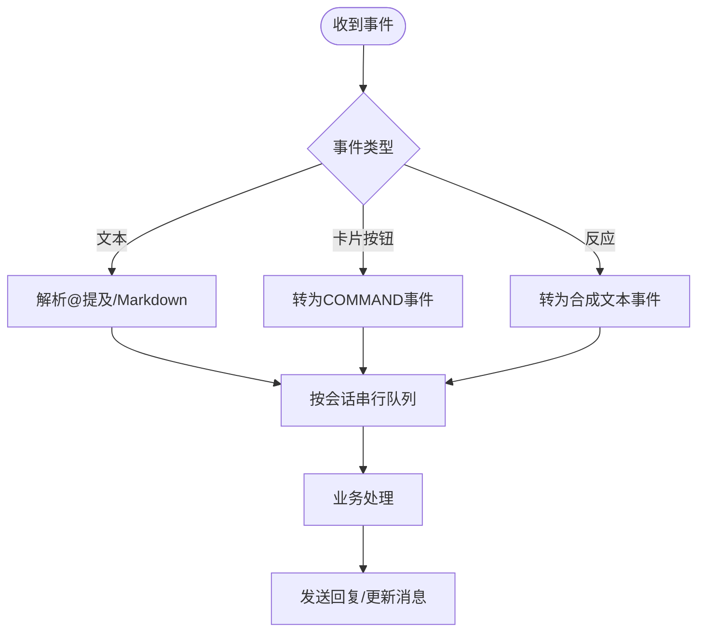
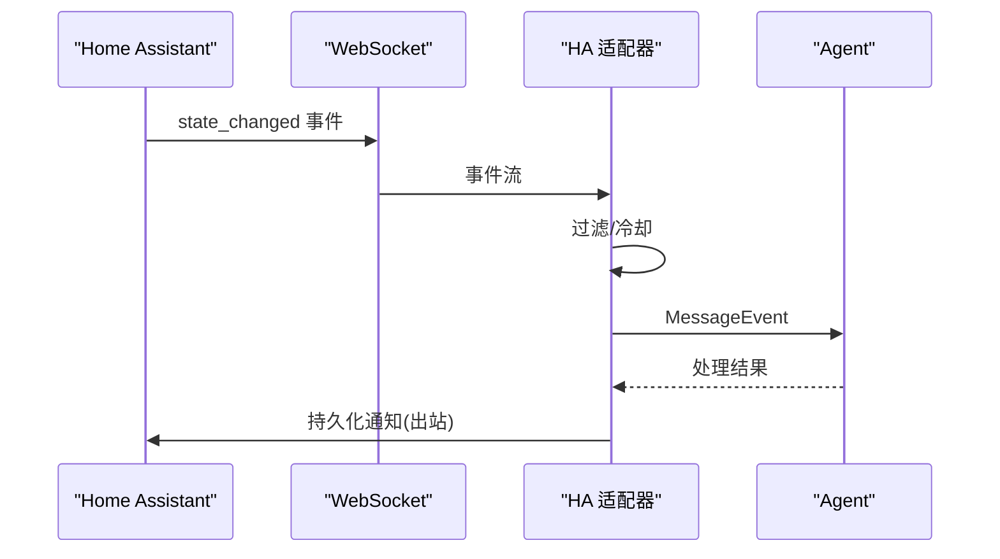
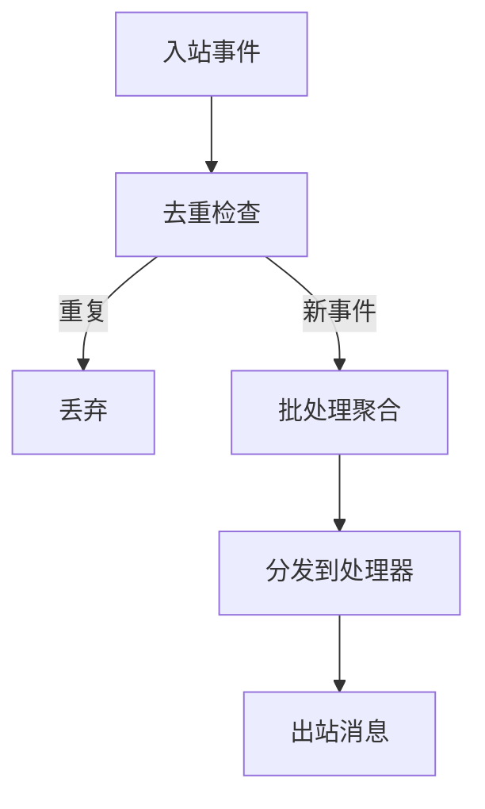
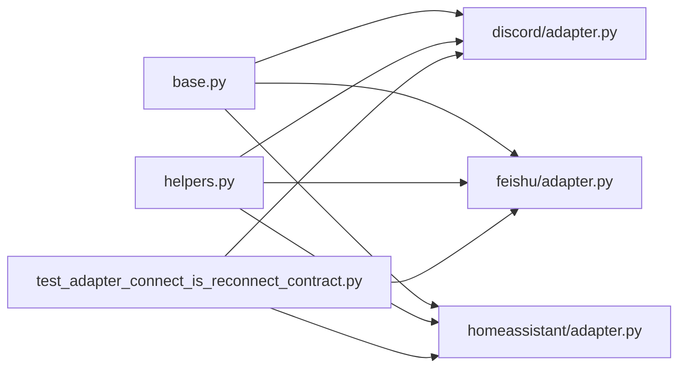

# 通信消息工具

<cite>
**本文引用的文件**
- [gateway/platforms/base.py](file://gateway/platforms/base.py)
- [plugins/platforms/discord/adapter.py](file://plugins/platforms/discord/adapter.py)
- [plugins/platforms/feishu/adapter.py](file://plugins/platforms/feishu/adapter.py)
- [plugins/platforms/homeassistant/adapter.py](file://plugins/platforms/homeassistant/adapter.py)
- [gateway/platforms/helpers.py](file://gateway/platforms/helpers.py)
- [tests/gateway/test_adapter_connect_is_reconnect_contract.py](file://tests/gateway/test_adapter_connect_is_reconnect_contract.py)
</cite>

## 目录
1. [简介](#简介)
2. [项目结构](#项目结构)
3. [核心组件](#核心组件)
4. [架构总览](#架构总览)
5. [详细组件分析](#详细组件分析)
6. [依赖关系分析](#依赖关系分析)
7. [性能与限流](#性能与限流)
8. [故障恢复与排错](#故障恢复与排错)
9. [结论](#结论)
10. [附录：配置与示例](#附录：配置与示例)

## 简介
本文件面向“通信消息工具”的完整说明，覆盖消息发送、平台集成、通知推送与协作工具对接。重点解释 Discord、飞书、Home Assistant 等平台的适配器实现与消息格式转换；阐述消息模板、富文本渲染、附件处理与状态同步机制；并提供多平台消息路由与优先级管理策略、配置选项、限流控制与故障恢复机制的实践建议。

## 项目结构
- 平台适配层位于 gateway/platforms 与 plugins/platforms，统一继承自 BasePlatformAdapter，对外暴露 connect/send/receive 等能力。
- 通用能力（去重、批量聚合、Markdown 清理、线程参与跟踪）集中在 helpers.py。
- 各平台适配器负责协议细节（Discord 的 discord.py、飞书的 lark_oapi/webhook/websocket、Home Assistant 的 WebSocket API）。
- 测试用例保障适配器契约一致性（如 connect 必须接受 is_reconnect 参数）。

**图示来源**
- [gateway/platforms/base.py:1-120](file://gateway/platforms/base.py#L1-L120)
- [gateway/platforms/helpers.py:24-180](file://gateway/platforms/helpers.py#L24-L180)
- [plugins/platforms/discord/adapter.py:1-170](file://plugins/platforms/discord/adapter.py#L1-L170)
- [plugins/platforms/feishu/adapter.py:1-140](file://plugins/platforms/feishu/adapter.py#L1-L140)
- [plugins/platforms/homeassistant/adapter.py:1-120](file://plugins/platforms/homeassistant/adapter.py#L1-L120)

**章节来源**
- [gateway/platforms/base.py:1-120](file://gateway/platforms/base.py#L1-L120)
- [gateway/platforms/helpers.py:24-180](file://gateway/platforms/helpers.py#L24-L180)

## 核心组件
- BasePlatformAdapter：定义平台适配器的统一接口与通用逻辑（代理、媒体大小限制、TTS 输出路径、UTF-16 长度计算、回复锚点选择、线程元数据等）。
- helpers.MessageDeduplicator：基于 TTL 的消息去重缓存，避免重复处理。
- helpers.TextBatchAggregator：将短时间内连续文本事件合并为单条消息，减少抖动。
- 平台适配器：Discord、飞书、Home Assistant 分别实现连接、收发、富文本与附件适配。

**章节来源**
- [gateway/platforms/base.py:1-250](file://gateway/platforms/base.py#L1-L250)
- [gateway/platforms/helpers.py:24-180](file://gateway/platforms/helpers.py#L24-L180)

## 架构总览
平台适配器通过统一的 BasePlatformAdapter 抽象接入网关，复用去重、批处理、媒体安全与 TTS 等能力。不同平台在各自适配器中完成协议适配与消息格式转换。

**图示来源**
- [gateway/platforms/base.py:1-250](file://gateway/platforms/base.py#L1-L250)
- [plugins/platforms/discord/adapter.py:1-200](file://plugins/platforms/discord/adapter.py#L1-L200)
- [plugins/platforms/feishu/adapter.py:1-200](file://plugins/platforms/feishu/adapter.py#L1-L200)
- [plugins/platforms/homeassistant/adapter.py:1-200](file://plugins/platforms/homeassistant/adapter.py#L1-L200)

## 详细组件分析

### Discord 适配器
- 使用 discord.py 接收服务器与私聊消息、发送响应、处理线程与频道。
- 支持 Markdown 链接格式化、图片下载重定向防护、命令同步策略、非对话消息历史标记等。
- 复用 base 中的媒体大小限制、UTF-16 长度、代理设置等通用能力。

**图示来源**
- [gateway/platforms/base.py:1-250](file://gateway/platforms/base.py#L1-L250)
- [plugins/platforms/discord/adapter.py:1-200](file://plugins/platforms/discord/adapter.py#L1-L200)

**章节来源**
- [plugins/platforms/discord/adapter.py:1-200](file://plugins/platforms/discord/adapter.py#L1-L200)
- [gateway/platforms/base.py:1-250](file://gateway/platforms/base.py#L1-L250)

### 飞书 适配器
- 支持 WebSocket 长连接与 Webhook 两种传输方式。
- 处理 DM 与群内 @提及文本收发、入站媒体缓存、按会话串行处理、反应事件转合成文本事件、卡片按钮点击转 COMMAND 事件、Webhook 异常追踪、验证令牌二次鉴权。
- 身份模型包含 open_id、user_id、union_id 三层，适配多应用/租户场景。

**图示来源**
- [plugins/platforms/feishu/adapter.py:1-200](file://plugins/platforms/feishu/adapter.py#L1-L200)

**章节来源**
- [plugins/platforms/feishu/adapter.py:1-200](file://plugins/platforms/feishu/adapter.py#L1-L200)

### Home Assistant 适配器
- 通过 WebSocket 订阅 state_changed 事件，转换为 MessageEvent 并转发给 Agent。
- 出站消息以持久化通知形式投递到 HA。
- 支持域/实体过滤与冷却时间，避免事件风暴。

**图示来源**
- [plugins/platforms/homeassistant/adapter.py:1-200](file://plugins/platforms/homeassistant/adapter.py#L1-L200)

**章节来源**
- [plugins/platforms/homeassistant/adapter.py:1-200](file://plugins/platforms/homeassistant/adapter.py#L1-L200)

### 通用能力与消息处理
- 消息去重：MessageDeduplicator 提供 TTL 去重，防止重复处理。
- 文本批处理：TextBatchAggregator 合并短时间内的多条文本事件，降低抖动。
- Markdown 清理：strip_markdown 用于纯文本平台去除格式。
- 线程参与跟踪：ThreadParticipationTracker 维护线程参与状态。

**图示来源**
- [gateway/platforms/helpers.py:24-180](file://gateway/platforms/helpers.py#L24-L180)

**章节来源**
- [gateway/platforms/helpers.py:24-180](file://gateway/platforms/helpers.py#L24-L180)

## 依赖关系分析
- 适配器均依赖 BasePlatformAdapter 提供的通用能力（代理、媒体限制、TTS、长度计算等）。
- helpers.py 被多个适配器复用，提升一致性与可维护性。
- 测试用例强制所有适配器 connect 方法签名兼容 is_reconnect，确保网关重连流程稳定。

**图示来源**
- [gateway/platforms/base.py:1-250](file://gateway/platforms/base.py#L1-L250)
- [gateway/platforms/helpers.py:24-180](file://gateway/platforms/helpers.py#L24-L180)
- [plugins/platforms/discord/adapter.py:1-200](file://plugins/platforms/discord/adapter.py#L1-L200)
- [plugins/platforms/feishu/adapter.py:1-200](file://plugins/platforms/feishu/adapter.py#L1-L200)
- [plugins/platforms/homeassistant/adapter.py:1-200](file://plugins/platforms/homeassistant/adapter.py#L1-L200)
- [tests/gateway/test_adapter_connect_is_reconnect_contract.py:1-145](file://tests/gateway/test_adapter_connect_is_reconnect_contract.py#L1-L145)

**章节来源**
- [tests/gateway/test_adapter_connect_is_reconnect_contract.py:1-145](file://tests/gateway/test_adapter_connect_is_reconnect_contract.py#L1-L145)

## 性能与限流
- 入站媒体大小限制：通过配置项限制内存缓冲，防止恶意或超大上传导致 OOM。
- UTF-16 长度计算：针对 Telegram 等平台的消息长度限制进行精确截断。
- 文本批处理：合并高频文本事件，降低下游处理压力。
- 去重缓存：TTL 控制内存占用，定期清理过期条目。
- 代理与网络：支持系统代理与 NO_PROXY 规则，避免不必要的代理开销。

**章节来源**
- [gateway/platforms/base.py:700-800](file://gateway/platforms/base.py#L700-L800)
- [gateway/platforms/helpers.py:24-180](file://gateway/platforms/helpers.py#L24-L180)

## 故障恢复与排错
- 重连契约：所有适配器 connect 必须接受 is_reconnect 关键字参数，否则网关重连时会失败并静默断开。
- 日志与安全：URL 安全校验、SSRF 防护、敏感信息脱敏。
- 错误处理：媒体下载、网络请求、认证失败等路径均有明确日志与降级策略。

**章节来源**
- [tests/gateway/test_adapter_connect_is_reconnect_contract.py:1-145](file://tests/gateway/test_adapter_connect_is_reconnect_contract.py#L1-L145)
- [gateway/platforms/base.py:640-700](file://gateway/platforms/base.py#L640-L700)

## 结论
该通信消息工具通过统一的 BasePlatformAdapter 与 helpers 模块实现了跨平台的消息收发、富文本与附件处理、状态同步与故障恢复。Discord、飞书、Home Assistant 等适配器在保持协议差异的同时，复用通用能力，提升了稳定性与可维护性。结合限流、去重、批处理与重连契约，系统在高并发与不稳定网络环境下仍能提供可靠的消息通道。

## 附录：配置与示例
- 配置要点
  - 媒体大小限制：gateway.max_inbound_media_bytes（默认 128 MiB，0 表示禁用）
  - 代理设置：平台环境变量、HTTPS_PROXY/HTTP_PROXY/ALL_PROXY、NO_PROXY/no_proxy
  - 平台凭据：Discord Token、飞书 App ID/Secret、Home Assistant HASS_TOKEN/HASS_URL
- 常见场景
  - 文本消息：直接发送，必要时进行 Markdown 清理或平台特定格式化
  - 富文本：Discord Markdown、飞书卡片/富文本、HA 通知文本
  - 附件：图片/音频/视频，遵循平台格式与大小限制
  - 状态同步：HA state_changed 事件驱动，飞书反应/卡片交互转事件
- 优先级与路由
  - 按会话串行（飞书）避免乱序
  - 批处理合并高频事件（Discord/Telegram/Feishu）
  - 去重缓存避免重复处理
- 故障恢复
  - 重连时传递 is_reconnect=True
  - 代理与网络异常自动降级
  - 媒体下载失败重试与超时控制

**章节来源**
- [gateway/platforms/base.py:410-520](file://gateway/platforms/base.py#L410-L520)
- [plugins/platforms/homeassistant/adapter.py:70-120](file://plugins/platforms/homeassistant/adapter.py#L70-L120)
- [plugins/platforms/feishu/adapter.py:1-140](file://plugins/platforms/feishu/adapter.py#L1-L140)
- [plugins/platforms/discord/adapter.py:1-170](file://plugins/platforms/discord/adapter.py#L1-L170)