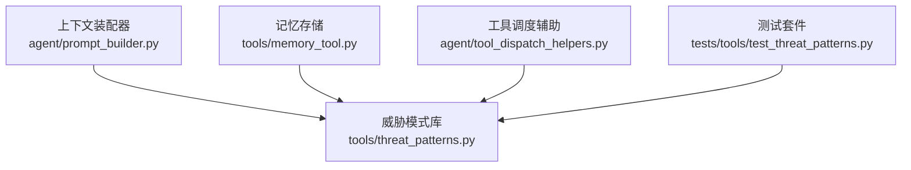
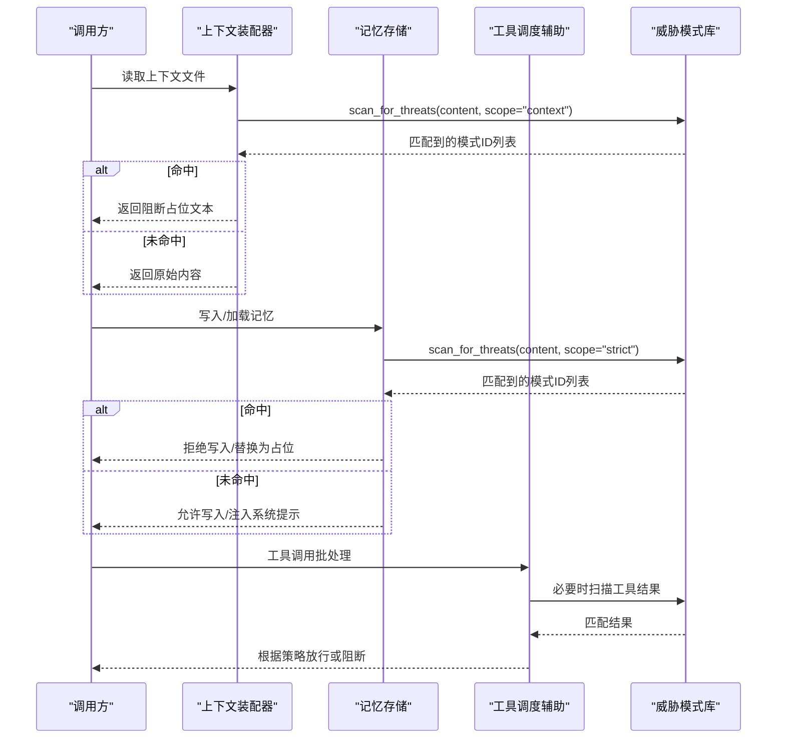
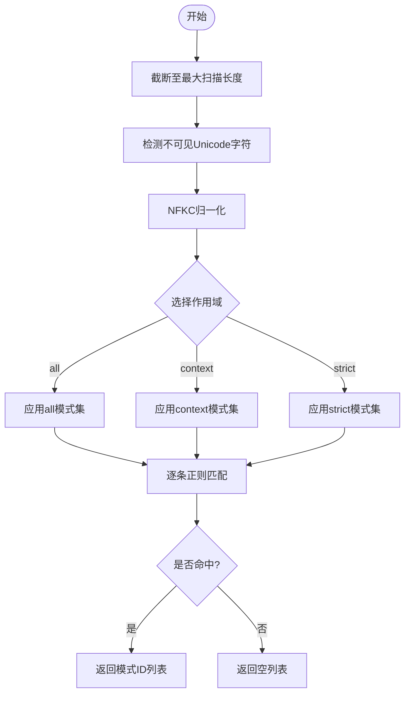
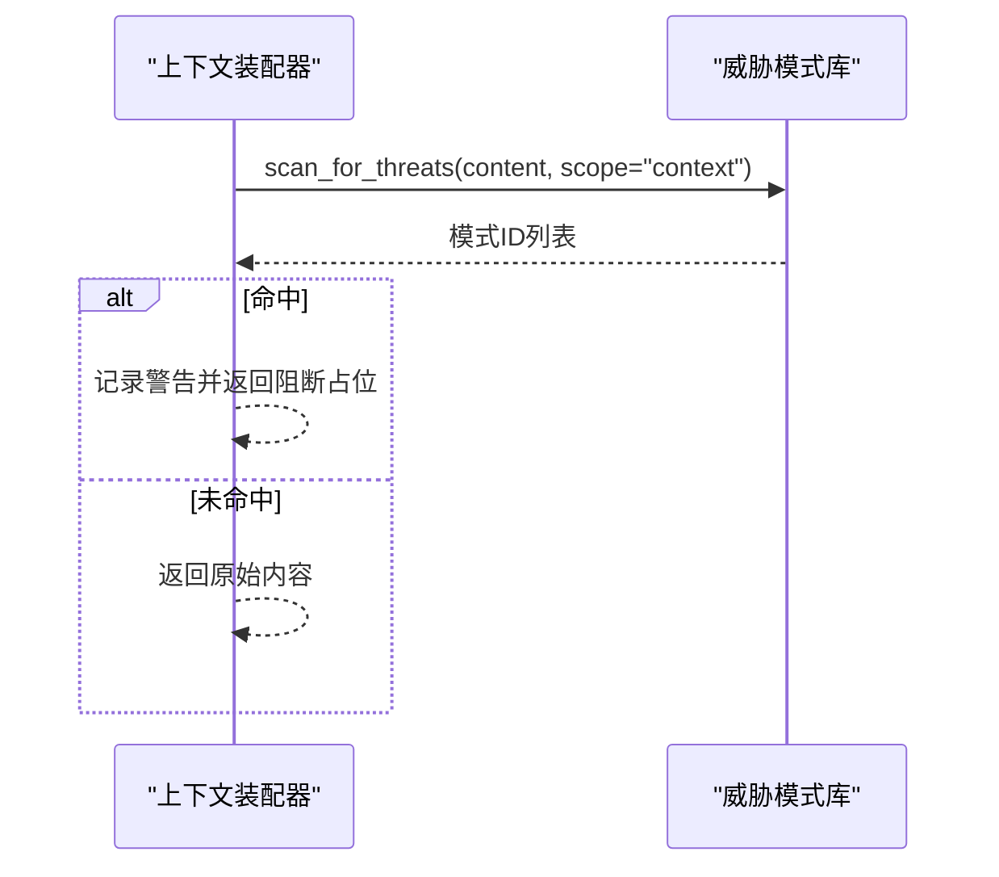
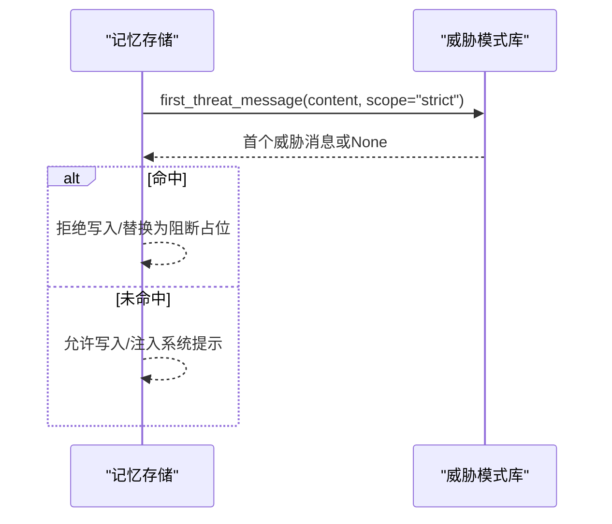
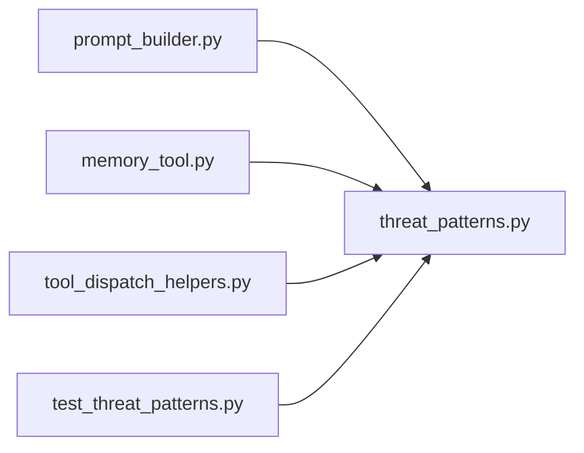

# 威胁模式检测

<cite>
**本文引用的文件**
- [tools/threat_patterns.py](file://tools/threat_patterns.py)
- [agent/prompt_builder.py](file://agent/prompt_builder.py)
- [tools/memory_tool.py](file://tools/memory_tool.py)
- [agent/tool_dispatch_helpers.py](file://agent/tool_dispatch_helpers.py)
- [tests/tools/test_threat_patterns.py](file://tests/tools/test_threat_patterns.py)
</cite>

## 目录
1. [简介](#简介)
2. [项目结构](#项目结构)
3. [核心组件](#核心组件)
4. [架构总览](#架构总览)
5. [详细组件分析](#详细组件分析)
6. [依赖关系分析](#依赖关系分析)
7. [性能与可扩展性](#性能与可扩展性)
8. [故障排查指南](#故障排查指南)
9. [结论](#结论)
10. [附录：配置与自定义规则](#附录：配置与自定义规则)

## 简介
本文件系统化说明 Hermes 威胁模式检测系统的设计与实现。该系统以“单一事实来源”的共享威胁模式库为核心，对上下文文件、持久化记忆、工具结果等进入系统提示或可被持久化的内容进行扫描，识别注入、越权、C2/Brainworm 风格指令、数据外泄、持久化后门等威胁。系统通过“作用域（scope）”机制区分检测强度：all/context/strict，并在不同入口采取“阻断+占位”或“告警+放行”的策略。文档同时给出威胁事件处理流程、常见攻击示例、以及扩展与排障建议。

## 项目结构
威胁检测相关代码主要分布在以下位置：
- 共享威胁模式库：定义正则模式、作用域、不可见字符集合与扫描函数
- 上下文装配器：在将上下文文件注入系统提示前进行扫描并阻断可疑内容
- 记忆存储：在加载和写入时应用更严格的扫描策略，防止恶意条目污染系统提示
- 工具调度辅助：在工具调用路径中复用威胁模式库，保障工具结果安全
- 测试套件：覆盖作用域行为、经典注入、C2/Brainworm 载荷、ReDoS 防护、NFKC 归一化等

图表来源
- [agent/prompt_builder.py:55-79](file://agent/prompt_builder.py#L55-L79)
- [tools/threat_patterns.py:162-255](file://tools/threat_patterns.py#L162-L255)
- [tools/memory_tool.py:86-89](file://tools/memory_tool.py#L86-L89)
- [agent/tool_dispatch_helpers.py:35-39](file://agent/tool_dispatch_helpers.py#L35-L39)
- [tests/tools/test_threat_patterns.py:1-17](file://tests/tools/test_threat_patterns.py#L1-L17)

章节来源
- [agent/prompt_builder.py:55-79](file://agent/prompt_builder.py#L55-L79)
- [tools/threat_patterns.py:1-285](file://tools/threat_patterns.py#L1-L285)
- [tools/memory_tool.py:86-89](file://tools/memory_tool.py#L86-L89)
- [agent/tool_dispatch_helpers.py:35-39](file://agent/tool_dispatch_helpers.py#L35-L39)
- [tests/tools/test_threat_patterns.py:1-263](file://tests/tools/test_threat_patterns.py#L1-L263)

## 核心组件
- 威胁模式库（tools/threat_patterns.py）
  - 集中维护所有威胁模式（正则）、作用域（all/context/strict）、不可见 Unicode 字符集
  - 提供 scan_for_threats() 与 first_threat_message() 两个核心接口
  - 内置 ReDoS 防护：输入长度上限、有限填充词、预编译模式
- 上下文装配器（agent/prompt_builder.py）
  - 在上下文文件进入系统提示前使用 context 作用域扫描
  - 命中即阻断并替换为占位文本，避免污染系统提示
- 记忆存储（tools/memory_tool.py）
  - 使用 strict 作用域扫描记忆条目，阻止持久化注入
  - 加载时生成“冻结快照”，仅将清洗后的内容注入系统提示
- 工具调度辅助（agent/tool_dispatch_helpers.py）
  - 在工具调用路径中复用威胁模式库，确保工具结果安全
  - 结合破坏性命令启发式判断，降低风险

章节来源
- [tools/threat_patterns.py:49-63](file://tools/threat_patterns.py#L49-L63)
- [tools/threat_patterns.py:162-255](file://tools/threat_patterns.py#L162-L255)
- [agent/prompt_builder.py:55-79](file://agent/prompt_builder.py#L55-L79)
- [tools/memory_tool.py:70-89](file://tools/memory_tool.py#L70-L89)
- [agent/tool_dispatch_helpers.py:74-100](file://agent/tool_dispatch_helpers.py#L74-L100)

## 架构总览
威胁检测采用“统一规则 + 多入口拦截”的架构：
- 规则层：threat_patterns.py 维护模式与扫描逻辑
- 拦截层：prompt_builder、memory_tool、tool_dispatch_helpers 等入口按各自场景选择 scope 并执行阻断/告警
- 测试层：test_threat_patterns.py 保证回归与误报控制

图表来源
- [agent/prompt_builder.py:55-79](file://agent/prompt_builder.py#L55-L79)
- [tools/memory_tool.py:86-89](file://tools/memory_tool.py#L86-L89)
- [agent/tool_dispatch_helpers.py:35-39](file://agent/tool_dispatch_helpers.py#L35-L39)
- [tools/threat_patterns.py:207-255](file://tools/threat_patterns.py#L207-L255)

## 详细组件分析

### 威胁模式库（tools/threat_patterns.py）
- 设计要点
  - 模式组织按“攻击类别”而非来源文件；每个模式包含正则、模式ID与作用域
  - 作用域语义：
    - all：经典注入与外泄，适用于任意文本
    - context：加入角色劫持、C2/Brainworm、反取证等，用于上下文/工具结果
    - strict：加入持久化/SSH后门/外泄URL等，用于用户可控写入路径
  - 防绕过：使用有界填充词（bounded filler）避免回溯爆炸与简单插词绕过
  - 不可见字符检测：识别零宽空格、方向隔离符等，防止隐写注入
  - 归一化：NFKC 标准化全角/兼容变体，抵御同形异义绕过
  - 性能保护：MAX_SCAN_CHARS 限制最大扫描长度，预编译正则集合
- 关键函数
  - scan_for_threats(content, scope)：返回匹配的模式ID列表
  - first_threat_message(content, scope)：返回首个威胁的人类可读消息（用于阻断）
- 典型模式类别
  - 经典注入：忽略先前指令、系统提示覆盖、隐藏HTML/样式等
  - 角色劫持：伪装身份、输出初始系统提示、移除过滤
  - C2/Brainworm：注册节点、心跳/信标、拉取任务、连接网络、强制动作
  - 外泄：curl/wget/cat 读取敏感文件、向URL发送上下文
  - 持久化：authorized_keys、.ssh/.hermes 访问、修改代理配置文件
  - 硬编码密钥：API Key/Token/Secret 等长串明文

图表来源
- [tools/threat_patterns.py:49-63](file://tools/threat_patterns.py#L49-L63)
- [tools/threat_patterns.py:162-255](file://tools/threat_patterns.py#L162-L255)

章节来源
- [tools/threat_patterns.py:1-285](file://tools/threat_patterns.py#L1-L285)
- [tests/tools/test_threat_patterns.py:20-263](file://tests/tools/test_threat_patterns.py#L20-L263)

### 上下文装配器（agent/prompt_builder.py）
- 职责：在上下文文件进入系统提示前进行威胁扫描
- 策略：使用 context 作用域；命中则记录警告日志并返回阻断占位文本，不将原文注入系统提示
- 特殊处理：剥离UTF-8 BOM以避免误判

图表来源
- [agent/prompt_builder.py:55-79](file://agent/prompt_builder.py#L55-L79)
- [tools/threat_patterns.py:207-255](file://tools/threat_patterns.py#L207-L255)

章节来源
- [agent/prompt_builder.py:55-79](file://agent/prompt_builder.py#L55-L79)

### 记忆存储（tools/memory_tool.py）
- 职责：在加载/写入记忆时应用严格扫描，防止恶意条目污染系统提示
- 策略：使用 strict 作用域；首次命中即阻断并返回人类可读消息
- 快照机制：构建“冻结快照”仅注入清洗后的内容，原始内容保留以便用户检查与清理

图表来源
- [tools/memory_tool.py:86-89](file://tools/memory_tool.py#L86-L89)
- [tools/threat_patterns.py:258-276](file://tools/threat_patterns.py#L258-L276)

章节来源
- [tools/memory_tool.py:70-89](file://tools/memory_tool.py#L70-L89)
- [tools/threat_patterns.py:258-276](file://tools/threat_patterns.py#L258-L276)

### 工具调度辅助（agent/tool_dispatch_helpers.py）
- 职责：在工具调用批处理中复用威胁模式库，确保工具结果安全
- 附加能力：破坏性命令启发式判断（如 rm/sed -i/重定向覆盖），辅助风险评估

章节来源
- [agent/tool_dispatch_helpers.py:35-39](file://agent/tool_dispatch_helpers.py#L35-L39)
- [agent/tool_dispatch_helpers.py:74-100](file://agent/tool_dispatch_helpers.py#L74-L100)

## 依赖关系分析
- 模块耦合
  - prompt_builder、memory_tool、tool_dispatch_helpers 均依赖 threat_patterns
  - 测试套件直接验证 threat_patterns 的行为与边界条件
- 外部依赖
  - 标准库 re、unicodedata
  - 无第三方运行时依赖，便于嵌入各子系统

图表来源
- [agent/prompt_builder.py:52-53](file://agent/prompt_builder.py#L52-L53)
- [tools/memory_tool.py:83-84](file://tools/memory_tool.py#L83-L84)
- [agent/tool_dispatch_helpers.py:35-39](file://agent/tool_dispatch_helpers.py#L35-L39)
- [tests/tools/test_threat_patterns.py:12-17](file://tests/tools/test_threat_patterns.py#L12-L17)

章节来源
- [agent/prompt_builder.py:52-53](file://agent/prompt_builder.py#L52-L53)
- [tools/memory_tool.py:83-84](file://tools/memory_tool.py#L83-L84)
- [agent/tool_dispatch_helpers.py:35-39](file://agent/tool_dispatch_helpers.py#L35-L39)
- [tests/tools/test_threat_patterns.py:12-17](file://tests/tools/test_threat_patterns.py#L12-L17)

## 性能与可扩展性
- 性能特性
  - 输入长度上限：MAX_SCAN_CHARS 限制扫描范围，避免超长文本导致性能问题
  - 预编译模式：按作用域预编译正则集合，减少重复编译开销
  - 有限填充词：bounded filler 防止回溯爆炸（ReDoS 防护）
  - NFKC 归一化：一次归一化后批量匹配，提升一致性与效率
- 可扩展性
  - 新增模式：在 _PATTERNS 列表中添加 (regex, pattern_id, scope) 三元组
  - 新作用域：需同步更新 _compile() 的作用域映射与异常分支
  - 不可见字符：扩展 INVISIBLE_CHARS 集合以支持更多隐写规避

章节来源
- [tools/threat_patterns.py:49-63](file://tools/threat_patterns.py#L49-L63)
- [tools/threat_patterns.py:162-204](file://tools/threat_patterns.py#L162-L204)
- [tools/threat_patterns.py:207-255](file://tools/threat_patterns.py#L207-L255)

## 故障排查指南
- 常见问题定位
  - 未知作用域：scan_for_threats(scope) 传入非法值会抛出异常
  - 误报/漏报：检查模式是否属于目标作用域；确认 NFKC 归一化与不可见字符检测是否生效
  - 性能问题：确认输入是否超过 MAX_SCAN_CHARS；检查是否存在长近匹配导致的回溯
- 调试建议
  - 使用 first_threat_message 获取首个威胁的人类可读消息，快速定位原因
  - 参考测试用例覆盖点：作用域行为、经典注入、C2/Brainworm 载荷、ReDoS 防护、NFKC 归一化

章节来源
- [tools/threat_patterns.py:207-255](file://tools/threat_patterns.py#L207-L255)
- [tests/tools/test_threat_patterns.py:20-263](file://tests/tools/test_threat_patterns.py#L20-L263)

## 结论
Hermes 威胁模式检测系统通过统一的规则库与多入口拦截，有效防御注入、C2/Brainworm、数据外泄与持久化后门等威胁。其作用域机制平衡了检测强度与误报率，配合 ReDoS 防护与归一化处理，兼顾安全性与性能。建议在新增模式时遵循“锚定明确攻击词汇/行为”的原则，并通过测试套件验证回归与误报控制。

## 附录：配置与自定义规则
- 配置选项
  - 作用域选择：
    - all：最小误报，适用于任意文本
    - context：增强检测，适用于上下文/工具结果
    - strict：最严格，适用于用户可控写入路径
  - 扫描上限：MAX_SCAN_CHARS 控制最大扫描长度
  - 不可见字符：INVISIBLE_CHARS 控制隐写字符检测
- 自定义规则添加方法
  - 在 _PATTERNS 中添加新的 (regex, pattern_id, scope) 三元组
  - 如需新作用域，更新 _compile() 的作用域映射与异常分支
  - 若涉及隐写，扩展 INVISIBLE_CHARS 集合
- 威胁事件处理流程（概念性）
  - 检测：scan_for_threats 返回模式ID列表
  - 决策：根据作用域与入口策略决定阻断或告警
  - 响应：返回阻断占位或人类可读消息；记录日志；必要时触发后续处置（由上层系统实现）

章节来源
- [tools/threat_patterns.py:49-63](file://tools/threat_patterns.py#L49-L63)
- [tools/threat_patterns.py:162-204](file://tools/threat_patterns.py#L162-L204)
- [tools/threat_patterns.py:207-255](file://tools/threat_patterns.py#L207-L255)
- [agent/prompt_builder.py:55-79](file://agent/prompt_builder.py#L55-L79)
- [tools/memory_tool.py:86-89](file://tools/memory_tool.py#L86-L89)