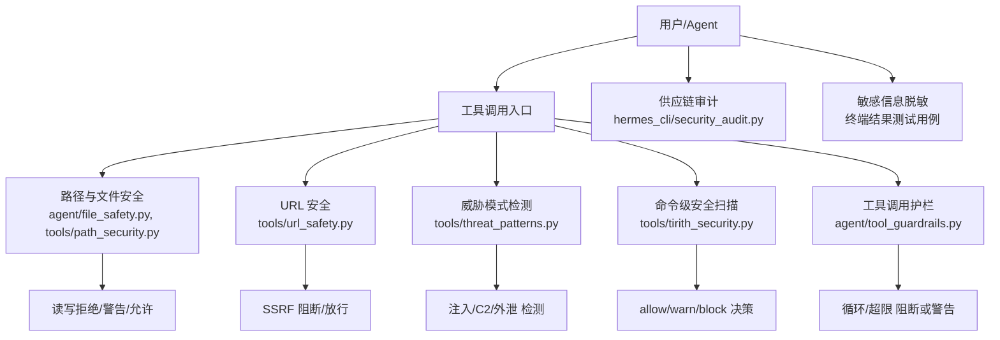
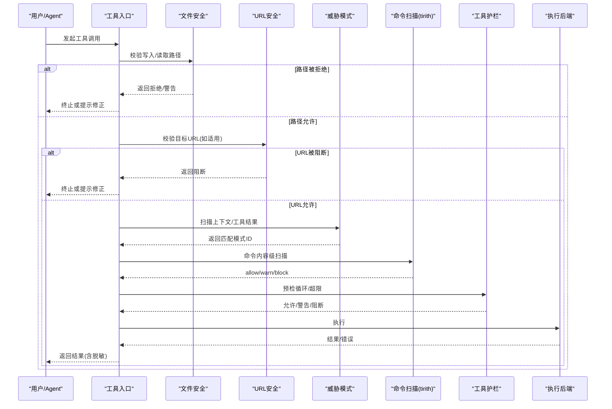
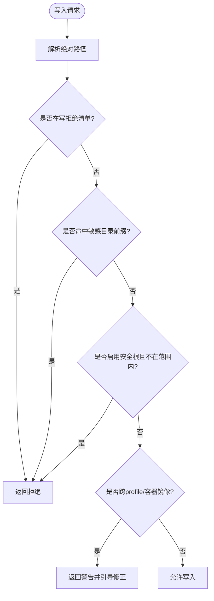
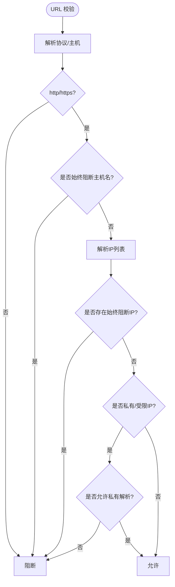
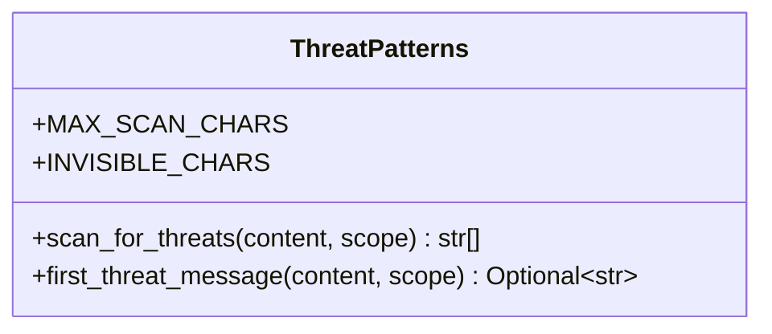
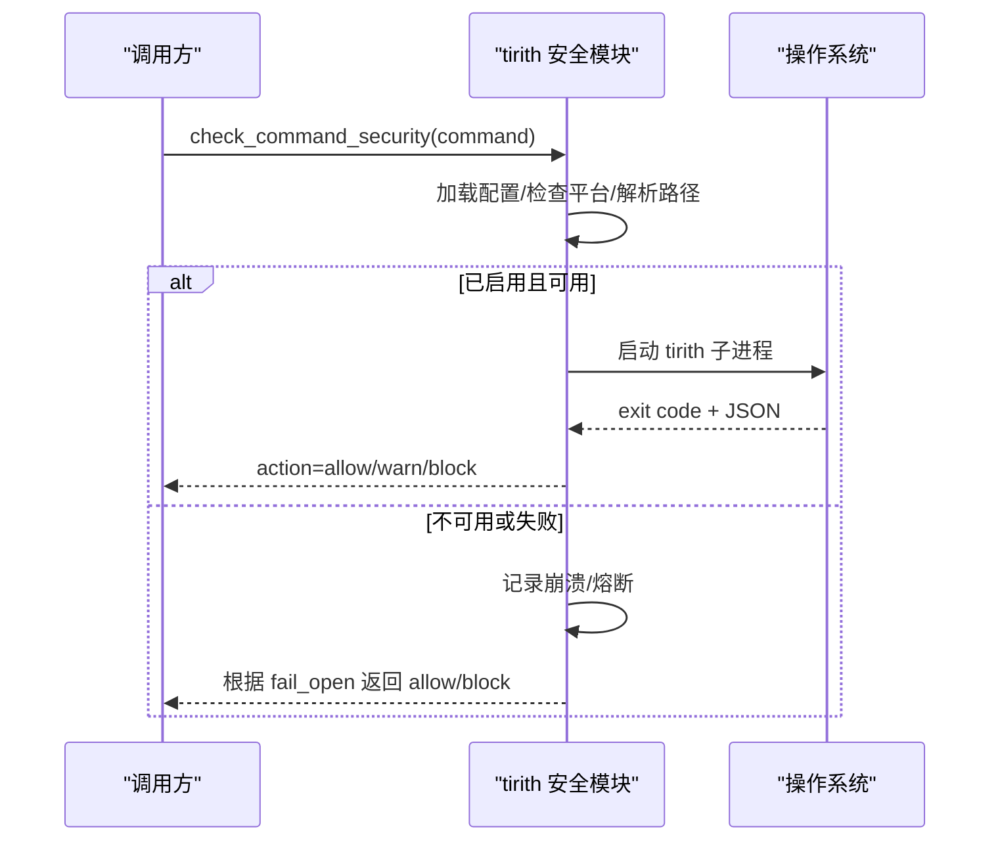
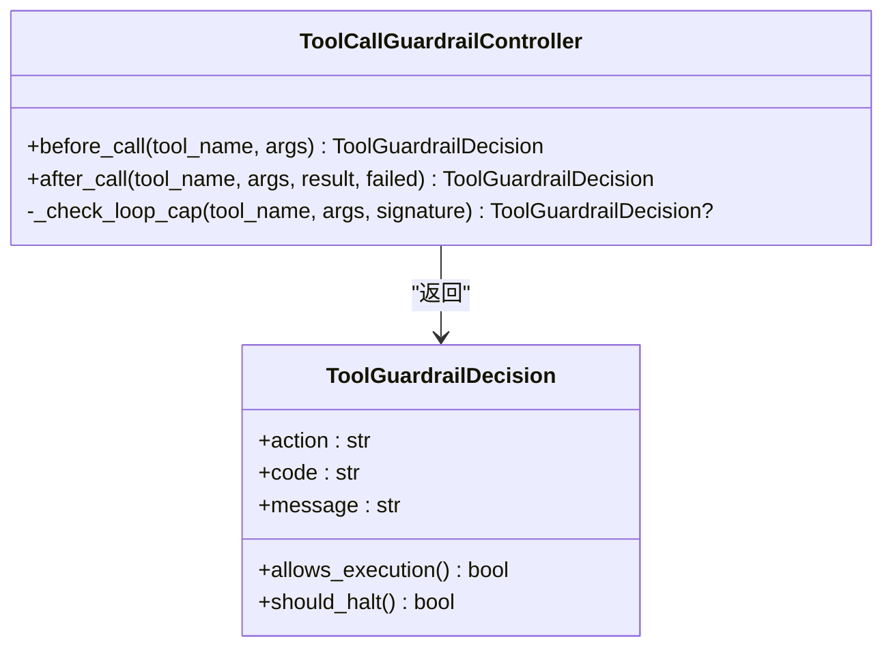
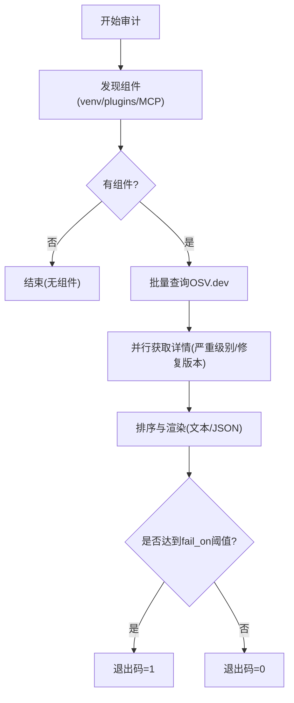
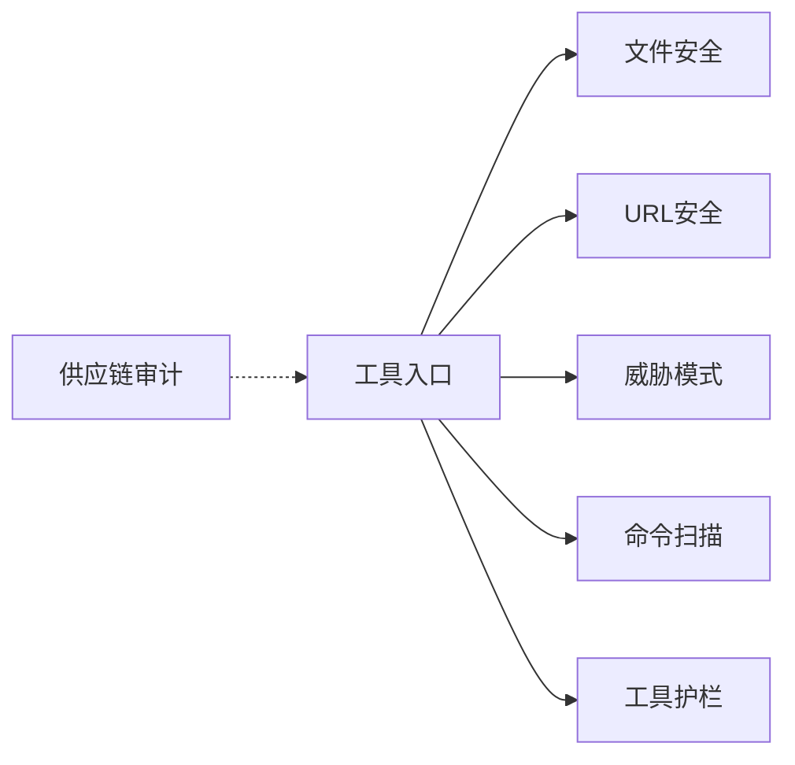

# 安全机制

<cite>
**本文引用的文件**
- [tools/path_security.py](file://tools/path_security.py)
- [agent/file_safety.py](file://agent/file_safety.py)
- [tools/url_safety.py](file://tools/url_safety.py)
- [tools/threat_patterns.py](file://tools/threat_patterns.py)
- [tools/tirith_security.py](file://tools/tirith_security.py)
- [hermes_cli/security_audit.py](file://hermes_cli/security_audit.py)
- [agent/tool_guardrails.py](file://agent/tool_guardrails.py)
- [tests/tools/test_terminal_error_redaction.py](file://tests/tools/test_terminal_error_redaction.py)
</cite>

## 目录
1. [简介](#简介)
2. [项目结构](#项目结构)
3. [核心组件](#核心组件)
4. [架构总览](#架构总览)
5. [详细组件分析](#详细组件分析)
6. [依赖关系分析](#依赖关系分析)
7. [性能考量](#性能考量)
8. [故障排查指南](#故障排查指南)
9. [结论](#结论)
10. [附录](#附录)

## 简介
本文件系统性阐述 Hermes 工具的安全机制，覆盖输入验证、路径安全检查、命令白名单与沙箱隔离、威胁模式检测、敏感信息过滤与执行权限控制。文档同时给出安全策略配置要点、风险评估模型与违规处理流程，并提供可操作的安全规则配置示例、审计日志与监控告警建议，以及面向开发者的安全最佳实践与漏洞防护方法。

## 项目结构
Hermes 的安全能力由多个职责清晰的模块组成：
- 路径与文件安全：限制写入/读取范围，保护凭证与系统关键路径，识别跨配置文件与容器镜像写入风险。
- URL 安全：防止 SSRF，阻断访问内部网络与云元数据地址，支持代理与可信主机例外。
- 威胁模式检测：基于正则的上下文扫描，识别提示注入、C2/Brainworm 行为、敏感信息外泄等。
- 命令级安全扫描：通过外部二进制 tirith 对命令进行内容级威胁检测，具备自动安装、签名校验与熔断保护。
- 工具调用护栏：防重复失败与无进展循环，限制单轮内高并发搜索/子代理生成。
- 供应链审计：扫描 venv、插件与 MCP 服务器依赖，对接 OSV.dev 输出漏洞发现。
- 敏感信息脱敏：终端输出与错误信息中的密钥形状字符串会被脱敏，避免泄露。

图表来源
- [agent/file_safety.py:1-200](file://agent/file_safety.py#L1-L200)
- [tools/path_security.py:1-44](file://tools/path_security.py#L1-L44)
- [tools/url_safety.py:1-120](file://tools/url_safety.py#L1-L120)
- [tools/threat_patterns.py:1-140](file://tools/threat_patterns.py#L1-L140)
- [tools/tirith_security.py:1-120](file://tools/tirith_security.py#L1-L120)
- [agent/tool_guardrails.py:1-120](file://agent/tool_guardrails.py#L1-L120)
- [hermes_cli/security_audit.py:1-120](file://hermes_cli/security_audit.py#L1-L120)
- [tests/tools/test_terminal_error_redaction.py:1-154](file://tests/tools/test_terminal_error_redaction.py#L1-L154)

章节来源
- [agent/file_safety.py:1-200](file://agent/file_safety.py#L1-L200)
- [tools/path_security.py:1-44](file://tools/path_security.py#L1-L44)
- [tools/url_safety.py:1-120](file://tools/url_safety.py#L1-L120)
- [tools/threat_patterns.py:1-140](file://tools/threat_patterns.py#L1-L140)
- [tools/tirith_security.py:1-120](file://tools/tirith_security.py#L1-L120)
- [agent/tool_guardrails.py:1-120](file://agent/tool_guardrails.py#L1-L120)
- [hermes_cli/security_audit.py:1-120](file://hermes_cli/security_audit.py#L1-L120)
- [tests/tools/test_terminal_error_redaction.py:1-154](file://tests/tools/test_terminal_error_redaction.py#L1-L154)

## 核心组件
- 路径与文件安全
  - 写拒绝清单与白名单根目录：阻止写入 SSH、OAuth、.env、sudoers 等敏感路径；支持 HERMES_WRITE_SAFE_ROOT 限定可写区域。
  - 读拒绝清单：阻止直接读取内部缓存、凭证存储与项目 .env 文件，作为纵深防御。
  - 跨配置与容器镜像写入软守卫：识别跨 profile 与容器镜像镜像路径的误写，返回警告并引导修正。
- URL 安全
  - 阻止私有/环回/链路本地/多播/未指定/CGNAT 地址；始终阻断云元数据主机名与 IP。
  - 支持全局开关（环境变量与配置项）以允许私有解析；提供连接时 DNS 重绑定防护。
- 威胁模式检测
  - 统一模式库：按攻击类别组织正则，支持 all/context/strict 三种作用域，内置不可见 Unicode 检测。
  - 扫描上限与归一化：限制最大扫描字符数，使用 NFKC 归一化抵御同形替换。
- 命令级安全扫描
  - 通过 tirith 子进程对命令进行内容级威胁检测；支持自动下载、SHA-256 校验与可选 cosign 溯源验证。
  - 熔断器与失败缓存：连续失败后断开以避免卡死；支持 fail_open/fail_close 策略。
- 工具调用护栏
  - 防重复失败与无进展循环：统计相同参数失败次数、幂等工具重复结果，支持警告与硬停止。
  - 每轮上限：限制 web_search 与 delegate_task 的单轮调用量，防止失控循环。
- 供应链审计
  - 扫描 venv、插件声明与 MCP 服务器命令中的版本，批量查询 OSV.dev，输出严重级别与修复版本。
- 敏感信息脱敏
  - 终端工具的错误与回溯中会脱敏密钥形状字符串，避免泄露。

章节来源
- [agent/file_safety.py:1-360](file://agent/file_safety.py#L1-L360)
- [tools/path_security.py:1-44](file://tools/path_security.py#L1-L44)
- [tools/url_safety.py:1-520](file://tools/url_safety.py#L1-L520)
- [tools/threat_patterns.py:1-285](file://tools/threat_patterns.py#L1-L285)
- [tools/tirith_security.py:1-800](file://tools/tirith_security.py#L1-L800)
- [agent/tool_guardrails.py:1-633](file://agent/tool_guardrails.py#L1-L633)
- [hermes_cli/security_audit.py:1-590](file://hermes_cli/security_audit.py#L1-L590)
- [tests/tools/test_terminal_error_redaction.py:1-154](file://tests/tools/test_terminal_error_redaction.py#L1-L154)

## 架构总览
下图展示一次典型工具调用的安全流水线：先进行路径与 URL 检查，再进行威胁模式与命令级扫描，最后由护栏控制循环与资源消耗。

图表来源
- [agent/file_safety.py:1-200](file://agent/file_safety.py#L1-L200)
- [tools/url_safety.py:1-520](file://tools/url_safety.py#L1-L520)
- [tools/threat_patterns.py:1-285](file://tools/threat_patterns.py#L1-L285)
- [tools/tirith_security.py:1-800](file://tools/tirith_security.py#L1-L800)
- [agent/tool_guardrails.py:1-633](file://agent/tool_guardrails.py#L1-L633)
- [tests/tools/test_terminal_error_redaction.py:1-154](file://tests/tools/test_terminal_error_redaction.py#L1-L154)

## 详细组件分析

### 路径与文件安全
- 写拒绝清单与白名单
  - 构建敏感写路径集合与目录前缀，阻止写入 SSH、OAuth、.env、sudoers 等。
  - 支持 HERMES_WRITE_SAFE_ROOT 限定可写根目录，超出则拒绝。
- 读拒绝清单
  - 阻止直接读取内部缓存、凭证存储与项目 .env 文件，作为纵深防御。
- 跨配置与容器镜像写入软守卫
  - 识别跨 profile 与容器镜像镜像路径的误写，返回警告并引导修正。

图表来源
- [agent/file_safety.py:28-178](file://agent/file_safety.py#L28-L178)
- [agent/file_safety.py:386-506](file://agent/file_safety.py#L386-L506)
- [agent/file_safety.py:533-616](file://agent/file_safety.py#L533-L616)

章节来源
- [agent/file_safety.py:28-178](file://agent/file_safety.py#L28-L178)
- [agent/file_safety.py:386-506](file://agent/file_safety.py#L386-L506)
- [agent/file_safety.py:533-616](file://agent/file_safety.py#L533-L616)
- [tools/path_security.py:15-44](file://tools/path_security.py#L15-L44)

### URL 安全（SSRF 防护）
- 始终阻断云元数据主机名与 IP，包括 IPv4 映射 IPv6。
- 默认阻断私有/环回/链路本地/多播/未指定/CGNAT 地址。
- 支持全局开关（环境变量与配置项）允许私有解析；提供连接时 DNS 重绑定防护。
- 提供同步与异步安全客户端封装，确保在连接阶段再次校验。

图表来源
- [tools/url_safety.py:163-210](file://tools/url_safety.py#L163-L210)
- [tools/url_safety.py:220-280](file://tools/url_safety.py#L220-L280)
- [tools/url_safety.py:289-520](file://tools/url_safety.py#L289-L520)
- [tools/url_safety.py:539-753](file://tools/url_safety.py#L539-L753)

章节来源
- [tools/url_safety.py:163-210](file://tools/url_safety.py#L163-L210)
- [tools/url_safety.py:220-280](file://tools/url_safety.py#L220-L280)
- [tools/url_safety.py:289-520](file://tools/url_safety.py#L289-L520)
- [tools/url_safety.py:539-753](file://tools/url_safety.py#L539-L753)

### 威胁模式检测
- 模式组织：按攻击类别组织正则，支持 all/context/strict 作用域。
- 不可见 Unicode：检测零宽空格、方向控制符等，防止注入绕过。
- 扫描上限与归一化：限制最大扫描字符数，使用 NFKC 归一化抵御同形替换。
- 便捷接口：返回匹配的模式 ID 或首条人类可读消息。

图表来源
- [tools/threat_patterns.py:49-159](file://tools/threat_patterns.py#L49-L159)
- [tools/threat_patterns.py:167-255](file://tools/threat_patterns.py#L167-L255)
- [tools/threat_patterns.py:258-285](file://tools/threat_patterns.py#L258-L285)

章节来源
- [tools/threat_patterns.py:49-159](file://tools/threat_patterns.py#L49-L159)
- [tools/threat_patterns.py:167-255](file://tools/threat_patterns.py#L167-L255)
- [tools/threat_patterns.py:258-285](file://tools/threat_patterns.py#L258-L285)

### 命令级安全扫描（tirith）
- 自动安装与校验：从 GitHub Releases 下载，校验 SHA-256，可选 cosign 溯源验证。
- 配置与容错：支持启用/禁用、超时、fail_open；连续失败触发熔断。
- 决策输出：exit code 决定 allow/warn/block，JSON 输出增强信息。

图表来源
- [tools/tirith_security.py:68-87](file://tools/tirith_security.py#L68-L87)
- [tools/tirith_security.py:283-483](file://tools/tirith_security.py#L283-L483)
- [tools/tirith_security.py:488-720](file://tools/tirith_security.py#L488-L720)
- [tools/tirith_security.py:731-800](file://tools/tirith_security.py#L731-L800)

章节来源
- [tools/tirith_security.py:68-87](file://tools/tirith_security.py#L68-L87)
- [tools/tirith_security.py:283-483](file://tools/tirith_security.py#L283-L483)
- [tools/tirith_security.py:488-720](file://tools/tirith_security.py#L488-L720)
- [tools/tirith_security.py:731-800](file://tools/tirith_security.py#L731-L800)

### 工具调用护栏
- 循环检测：统计相同参数失败次数、幂等工具重复结果，支持警告与硬停止。
- 每轮上限：限制 web_search 与 delegate_task 的单轮调用量，防止失控循环。
- 决策输出：允许/警告/阻断/中止，附带元数据便于审计。

图表来源
- [agent/tool_guardrails.py:63-127](file://agent/tool_guardrails.py#L63-L127)
- [agent/tool_guardrails.py:139-174](file://agent/tool_guardrails.py#L139-L174)
- [agent/tool_guardrails.py:176-223](file://agent/tool_guardrails.py#L176-L223)
- [agent/tool_guardrails.py:273-441](file://agent/tool_guardrails.py#L273-L441)
- [agent/tool_guardrails.py:447-508](file://agent/tool_guardrails.py#L447-L508)

章节来源
- [agent/tool_guardrails.py:63-127](file://agent/tool_guardrails.py#L63-L127)
- [agent/tool_guardrails.py:139-174](file://agent/tool_guardrails.py#L139-L174)
- [agent/tool_guardrails.py:176-223](file://agent/tool_guardrails.py#L176-L223)
- [agent/tool_guardrails.py:273-441](file://agent/tool_guardrails.py#L273-L441)
- [agent/tool_guardrails.py:447-508](file://agent/tool_guardrails.py#L447-L508)

### 供应链审计
- 组件发现：扫描 venv、插件 requirements/pyproject、MCP 命令中的 npx/uvx 版本。
- 漏洞查询：批量查询 OSV.dev，获取严重级别、摘要与修复版本。
- 输出渲染：人类可读与 JSON 两种格式，支持 --fail-on 阈值控制退出码。

图表来源
- [hermes_cli/security_audit.py:84-280](file://hermes_cli/security_audit.py#L84-L280)
- [hermes_cli/security_audit.py:300-408](file://hermes_cli/security_audit.py#L300-L408)
- [hermes_cli/security_audit.py:414-482](file://hermes_cli/security_audit.py#L414-L482)
- [hermes_cli/security_audit.py:487-590](file://hermes_cli/security_audit.py#L487-L590)

章节来源
- [hermes_cli/security_audit.py:84-280](file://hermes_cli/security_audit.py#L84-L280)
- [hermes_cli/security_audit.py:300-408](file://hermes_cli/security_audit.py#L300-L408)
- [hermes_cli/security_audit.py:414-482](file://hermes_cli/security_audit.py#L414-L482)
- [hermes_cli/security_audit.py:487-590](file://hermes_cli/security_audit.py#L487-L590)

### 敏感信息过滤（终端输出）
- 终端工具的错误与回溯中包含密钥形状字符串将被脱敏，避免泄露。
- 成功输出可选择关闭脱敏，但默认保持命令感知的脱敏策略。

章节来源
- [tests/tools/test_terminal_error_redaction.py:1-154](file://tests/tools/test_terminal_error_redaction.py#L1-L154)

## 依赖关系分析
- 低耦合高内聚：各安全模块职责单一，通过明确接口交互。
- 直接依赖：
  - 工具入口依赖文件安全、URL 安全、威胁模式、命令扫描与护栏。
  - 供应链审计独立于运行时，按需运行。
- 间接依赖：
  - URL 安全依赖系统 DNS 与 httpx 传输层钩子。
  - 命令扫描依赖外部二进制 tirith 与可选 cosign。
- 潜在循环：模块间无循环导入，采用延迟导入避免循环。

图表来源
- [agent/file_safety.py:1-200](file://agent/file_safety.py#L1-L200)
- [tools/url_safety.py:1-520](file://tools/url_safety.py#L1-L520)
- [tools/threat_patterns.py:1-285](file://tools/threat_patterns.py#L1-L285)
- [tools/tirith_security.py:1-800](file://tools/tirith_security.py#L1-L800)
- [agent/tool_guardrails.py:1-633](file://agent/tool_guardrails.py#L1-L633)
- [hermes_cli/security_audit.py:1-590](file://hermes_cli/security_audit.py#L1-L590)

章节来源
- [agent/file_safety.py:1-200](file://agent/file_safety.py#L1-L200)
- [tools/url_safety.py:1-520](file://tools/url_safety.py#L1-L520)
- [tools/threat_patterns.py:1-285](file://tools/threat_patterns.py#L1-L285)
- [tools/tirith_security.py:1-800](file://tools/tirith_security.py#L1-L800)
- [agent/tool_guardrails.py:1-633](file://agent/tool_guardrails.py#L1-L633)
- [hermes_cli/security_audit.py:1-590](file://hermes_cli/security_audit.py#L1-L590)

## 性能考量
- 威胁模式扫描限制最大字符数，避免长文本导致的正则回溯开销。
- URL 安全在连接时再次校验，减少 DNS 重绑定风险；DNS 解析可能阻塞，提供异步版本。
- tirith 自动安装与背景线程下载，避免启动阻塞；连续失败熔断，防止长时间挂起。
- 供应链审计批量查询与并行详情获取，提升吞吐。

[本节为通用指导，不直接分析具体文件]

## 故障排查指南
- 路径写入被拒
  - 检查是否命中写拒绝清单或不在 HERMES_WRITE_SAFE_ROOT 范围内。
  - 若为跨 profile 或容器镜像镜像路径，确认是否误写并遵循警告提示修正。
- URL 请求被阻断
  - 确认是否为目标为私有/受限 IP 或云元数据主机名；必要时调整全局开关或添加可信主机。
  - 若 DNS 解析失败且配置了代理，确认代理环境是否正确。
- 命令扫描失败
  - 检查 tirith 是否可用、平台是否支持、是否触发熔断；查看 fail_open 配置。
  - 若自动安装失败，检查网络、磁盘空间与 cosign 可用性。
- 工具调用循环
  - 关注护栏警告与阻断原因，调整参数或策略；检查幂等工具的重复结果。
- 供应链审计异常
  - 检查 OSV 网络连通性；确认组件版本是否可解析；查看严重级别阈值设置。

章节来源
- [agent/file_safety.py:28-178](file://agent/file_safety.py#L28-L178)
- [tools/url_safety.py:220-520](file://tools/url_safety.py#L220-L520)
- [tools/tirith_security.py:488-800](file://tools/tirith_security.py#L488-L800)
- [agent/tool_guardrails.py:273-508](file://agent/tool_guardrails.py#L273-L508)
- [hermes_cli/security_audit.py:414-590](file://hermes_cli/security_audit.py#L414-L590)

## 结论
Hermes 的安全机制以“纵深防御”为核心，结合路径/URL 白名单与黑名单、威胁模式检测、命令级内容扫描、工具调用护栏与供应链审计，形成多层防护。通过可配置的策略、严格的默认值与健壮的容错机制，在保证可用性的同时最大化降低安全风险。建议在生产环境中启用严格模式、定期运行供应链审计，并结合日志与监控实现持续观测。

[本节为总结，不直接分析具体文件]

## 附录

### 安全策略配置要点
- URL 安全
  - 环境变量：HERMES_ALLOW_PRIVATE_URLS=true/false
  - 配置项：security.allow_private_urls / browser.allow_private_urls（兼容）
- 命令扫描
  - 配置项：security.tirith_enabled / security.tirith_path / security.tirith_timeout / security.tirith_fail_open
  - 环境变量：TIRITH_ENABLED / TIRITH_BIN / TIRITH_TIMEOUT / TIRITH_FAIL_OPEN
- 文件安全
  - 环境变量：HERMES_WRITE_SAFE_ROOT（多目录用分隔符拼接）
- 工具护栏
  - 配置项：tool_loop_guardrails.warnings_enabled / hard_stop_enabled / loop_caps.max_web_searches / loop_caps.max_subagents

章节来源
- [tools/url_safety.py:220-280](file://tools/url_safety.py#L220-L280)
- [tools/tirith_security.py:68-87](file://tools/tirith_security.py#L68-L87)
- [agent/file_safety.py:83-98](file://agent/file_safety.py#L83-L98)
- [agent/tool_guardrails.py:63-127](file://agent/tool_guardrails.py#L63-L127)

### 风险评估模型
- 威胁模式
  - 作用域：all/context/strict，按场景选择严格程度。
  - 指标：匹配模式 ID 数量与类型（注入/C2/外泄）。
- URL 安全
  - 指标：是否命中始终阻断集、私有解析开关、DNS 解析结果。
- 命令扫描
  - 指标：exit code（0/1/2）、JSON findings、summary。
- 工具护栏
  - 指标：失败计数、重复结果计数、每轮调用上限。
- 供应链审计
  - 指标：组件数量、漏洞数量、严重级别分布、修复版本。

章节来源
- [tools/threat_patterns.py:167-255](file://tools/threat_patterns.py#L167-L255)
- [tools/url_safety.py:289-520](file://tools/url_safety.py#L289-L520)
- [tools/tirith_security.py:731-800](file://tools/tirith_security.py#L731-L800)
- [agent/tool_guardrails.py:273-508](file://agent/tool_guardrails.py#L273-L508)
- [hermes_cli/security_audit.py:414-590](file://hermes_cli/security_audit.py#L414-L590)

### 违规处理流程
- 路径/URL 违规：立即阻断并返回清晰错误信息，必要时提供修正指引。
- 威胁模式命中：根据作用域与策略返回警告或阻断，记录模式 ID。
- 命令扫描阻断：依据 exit code 与 fail_open 策略决定放行或阻断。
- 工具循环：先警告后阻断，提供恢复建议。
- 供应链漏洞：输出严重级别与修复版本，支持 CI 门禁。

章节来源
- [agent/file_safety.py:161-178](file://agent/file_safety.py#L161-L178)
- [tools/url_safety.py:415-520](file://tools/url_safety.py#L415-L520)
- [tools/threat_patterns.py:207-276](file://tools/threat_patterns.py#L207-L276)
- [tools/tirith_security.py:731-800](file://tools/tirith_security.py#L731-L800)
- [agent/tool_guardrails.py:295-441](file://agent/tool_guardrails.py#L295-L441)
- [hermes_cli/security_audit.py:487-590](file://hermes_cli/security_audit.py#L487-L590)

### 安全规则配置示例
- 允许私有 URL（谨慎）
  - 设置环境变量 HERMES_ALLOW_PRIVATE_URLS=true 或在配置中启用 security.allow_private_urls。
- 启用命令扫描
  - 设置 security.tirith_enabled=true，配置 timeout 与 fail_open。
- 限定可写目录
  - 设置 HERMES_WRITE_SAFE_ROOT=/data:/var/www。
- 限制工具循环
  - 设置 tool_loop_guardrails.loop_caps.max_web_searches=50 与 max_subagents=50。

章节来源
- [tools/url_safety.py:220-280](file://tools/url_safety.py#L220-L280)
- [tools/tirith_security.py:68-87](file://tools/tirith_security.py#L68-L87)
- [agent/file_safety.py:83-98](file://agent/file_safety.py#L83-L98)
- [agent/tool_guardrails.py:139-174](file://agent/tool_guardrails.py#L139-L174)

### 安全审计日志与监控告警建议
- 日志关键字
  - URL 安全：Blocked request to private/internal address / Blocked request to cloud metadata address。
  - 命令扫描：tirith spawn failed / tirith timed out / circuit breaker opened。
  - 工具护栏：repeated_exact_failure_warning / idempotent_no_progress_warning / loop_web_search_cap。
  - 供应链审计：Found known vulnerability finding(s)。
- 监控指标
  - URL 阻断率、命令扫描阻断率、工具循环触发次数、供应链漏洞数量与严重级别分布。
- 告警策略
  - 当 URL 阻断率突增、命令扫描频繁阻断、工具循环频繁触发或出现 CRITICAL/HIGH 漏洞时触发告警。

章节来源
- [tools/url_safety.py:415-520](file://tools/url_safety.py#L415-L520)
- [tools/tirith_security.py:731-800](file://tools/tirith_security.py#L731-L800)
- [agent/tool_guardrails.py:295-441](file://agent/tool_guardrails.py#L295-L441)
- [hermes_cli/security_audit.py:487-590](file://hermes_cli/security_audit.py#L487-L590)

### 开发者安全最佳实践
- 输入验证
  - 对所有用户输入进行规范化与白名单校验；优先使用路径解析与相对校验。
- 路径安全
  - 使用 validate_within_dir 与 build_write_denied_paths 保护敏感路径；启用 HERMES_WRITE_SAFE_ROOT。
- URL 安全
  - 使用 is_safe_url/async_is_safe_url 与 ssrf_safe_http_transport/ssrf_safe_async_http_transport。
- 威胁模式
  - 在上下文组装与工具结果处理中调用 scan_for_threats；对严格路径使用 first_threat_message。
- 命令安全
  - 集成 check_command_security；合理设置 fail_open 与超时；关注熔断日志。
- 工具护栏
  - 配置合适的阈值；对幂等工具关注重复结果；避免无限重试。
- 供应链安全
  - 定期运行 hermes security audit；在 CI 中设置 --fail-on 阈值。
- 敏感信息
  - 避免在日志与输出中打印密钥；利用现有脱敏机制；必要时自定义脱敏规则。

章节来源
- [tools/path_security.py:15-44](file://tools/path_security.py#L15-L44)
- [agent/file_safety.py:28-178](file://agent/file_safety.py#L28-L178)
- [tools/url_safety.py:415-753](file://tools/url_safety.py#L415-L753)
- [tools/threat_patterns.py:207-276](file://tools/threat_patterns.py#L207-L276)
- [tools/tirith_security.py:731-800](file://tools/tirith_security.py#L731-L800)
- [agent/tool_guardrails.py:295-508](file://agent/tool_guardrails.py#L295-L508)
- [hermes_cli/security_audit.py:487-590](file://hermes_cli/security_audit.py#L487-L590)
- [tests/tools/test_terminal_error_redaction.py:1-154](file://tests/tools/test_terminal_error_redaction.py#L1-L154)