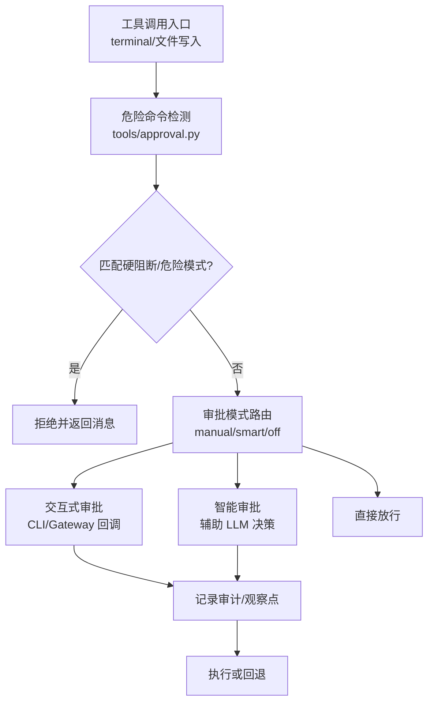
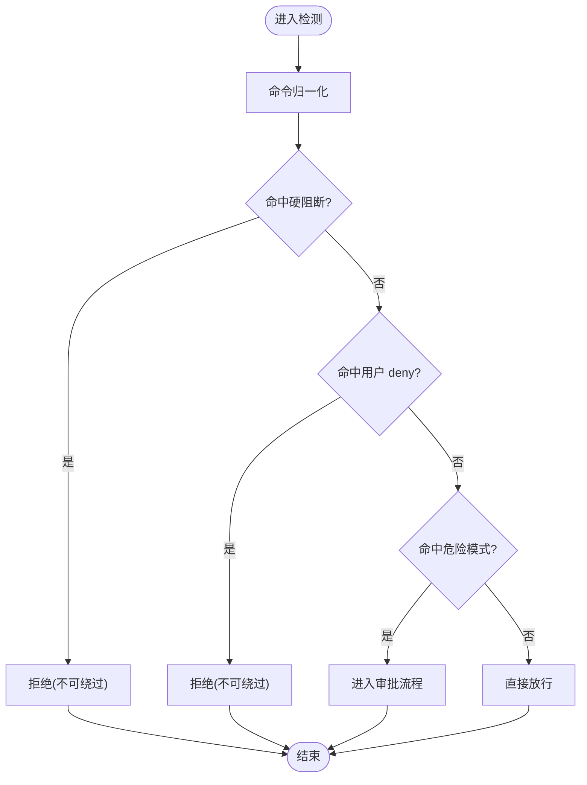
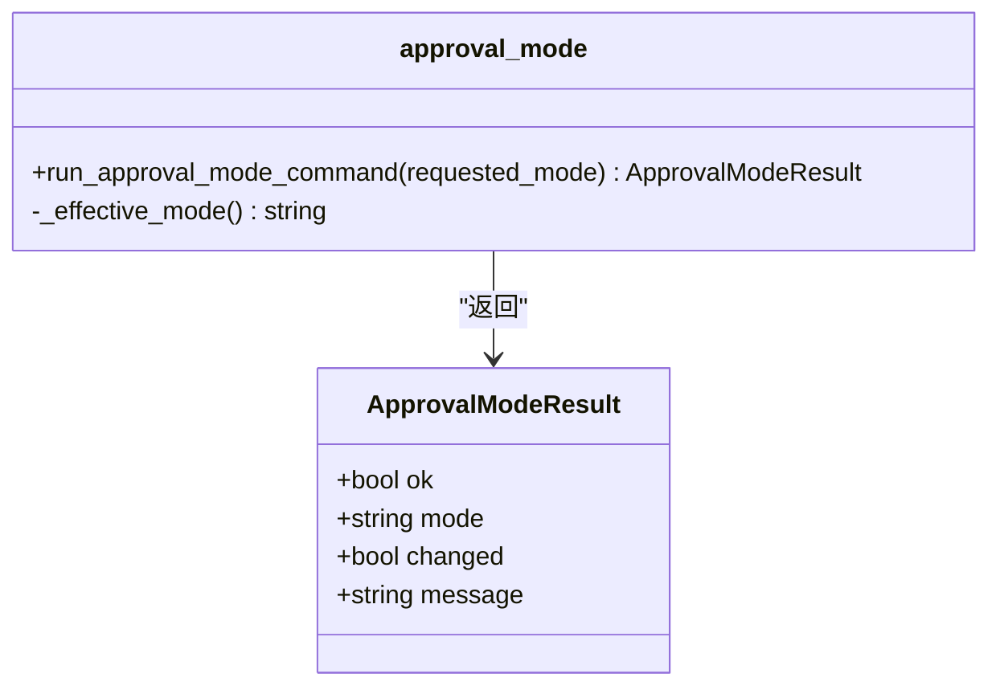
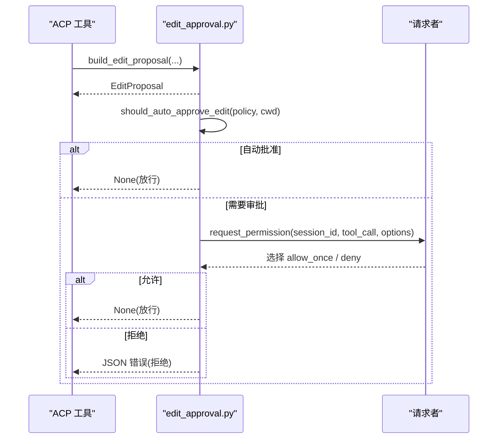
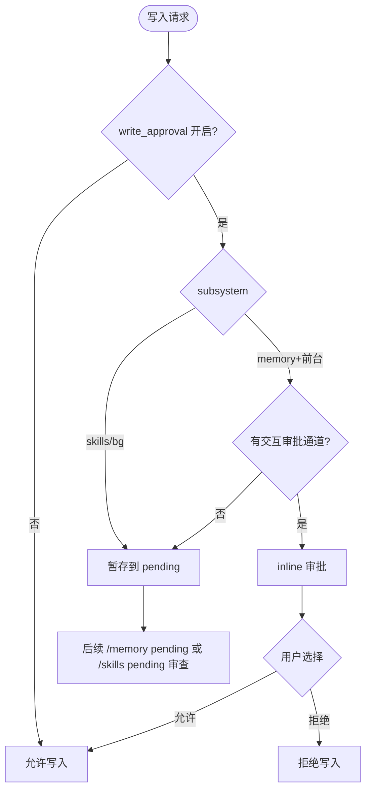
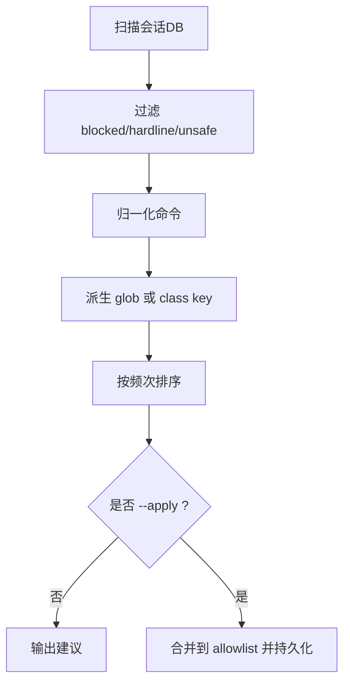
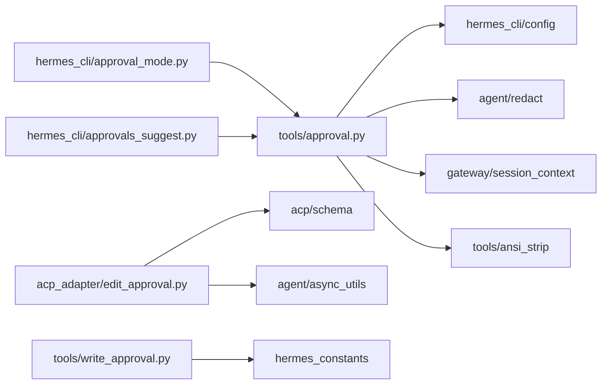

# 审批系统

<cite>
**本文引用的文件**
- [tools/approval.py](file://tools/approval.py)
- [hermes_cli/approval_mode.py](file://hermes_cli/approval_mode.py)
- [acp_adapter/edit_approval.py](file://acp_adapter/edit_approval.py)
- [tools/write_approval.py](file://tools/write_approval.py)
- [hermes_cli/approvals_suggest.py](file://hermes_cli/approvals_suggest.py)
- [tests/tools/test_terminal_error_redaction.py](file://tests/tools/test_terminal_error_redaction.py)
</cite>

## 目录
1. [简介](#简介)
2. [项目结构](#项目结构)
3. [核心组件](#核心组件)
4. [架构总览](#架构总览)
5. [详细组件分析](#详细组件分析)
6. [依赖关系分析](#依赖关系分析)
7. [性能考量](#性能考量)
8. [故障排查指南](#故障排查指南)
9. [结论](#结论)
10. [附录](#附录)

## 简介
本文件系统性说明 Hermes 审批系统的命令执行前审批流程，覆盖用户确认机制、权限检查与风险评估；阐述审批状态管理、超时处理与撤销机制；解释交互式审批、自动审批与条件审批三种模式的配置与行为；提供审批规则设置示例、日志记录与审计追踪方法；并为开发者提供自定义审批逻辑的钩子与回调实现指南。

## 项目结构
围绕“危险命令检测—审批决策—持久化/建议—可观测性”的主线，关键模块分布如下：
- 危险命令检测与审批主流程：tools/approval.py
- 审批模式（manual/smart/off）CLI 接口：hermes_cli/approval_mode.py
- ACP 编辑审批（写文件/补丁）：acp_adapter/edit_approval.py
- 记忆与技能写入审批门控与暂存：tools/write_approval.py
- 基于历史审批的建议生成：hermes_cli/approvals_suggest.py
- 终端错误脱敏测试用例（体现审批结果输出安全）：tests/tools/test_terminal_error_redaction.py



**图表来源**
- [tools/approval.py:1-120](file://tools/approval.py#L1-L120)
- [tools/approval.py:480-540](file://tools/approval.py#L480-L540)
- [tools/approval.py:690-960](file://tools/approval.py#L690-L960)
- [hermes_cli/approval_mode.py:1-88](file://hermes_cli/approval_mode.py#L1-L88)

**章节来源**
- [tools/approval.py:1-120](file://tools/approval.py#L1-L120)
- [hermes_cli/approval_mode.py:1-88](file://hermes_cli/approval_mode.py#L1-L88)

## 核心组件
- 危险命令检测器：对命令进行归一化、多形态变体匹配、硬阻断与危险模式识别，并提供“用户 deny 规则”扩展点。
- 审批模式控制器：维护 per-profile 的 approvals.mode（manual/smart/off），并通过 CLI 持久化。
- ACP 编辑审批：在 ACP 会话中对 write_file/patch 等编辑操作构建差异提案，支持自动审批策略与超时。
- 写入审批门控：对 memory/skills 写入进行 gate 判断，支持 inline 审批、暂存与撤销。
- 建议引擎：扫描会话数据库，挖掘“隐含批准”的命令模式，生成 allowlist 建议并可应用。

**章节来源**
- [tools/approval.py:1-120](file://tools/approval.py#L1-L120)
- [tools/approval.py:480-540](file://tools/approval.py#L480-L540)
- [tools/approval.py:690-960](file://tools/approval.py#L690-L960)
- [hermes_cli/approval_mode.py:1-88](file://hermes_cli/approval_mode.py#L1-L88)
- [acp_adapter/edit_approval.py:1-339](file://acp_adapter/edit_approval.py#L1-L339)
- [tools/write_approval.py:1-494](file://tools/write_approval.py#L1-L494)
- [hermes_cli/approvals_suggest.py:1-488](file://hermes_cli/approvals_suggest.py#L1-L488)

## 架构总览
下图展示一次危险命令从检测到执行的完整审批流，包括硬阻断、用户 deny、交互/智能审批、审计与回退路径。

```mermaid
sequenceDiagram
participant T as "工具调用"
participant A as "approval.py"
participant M as "审批模式(手动/智能/关闭)"
participant U as "用户/平台"
participant O as "审计/观察"
participant X as "执行器"
T->>A : 传入命令
A->>A : 归一化/变体展开/长度限制
A->>A : 硬阻断检测(HARDLINE)
alt 命中硬阻断
A-->>T : 拒绝(不可绕过)
else 未命中
A->>A : 用户 deny 规则匹配
alt 命中 deny
A-->>T : 拒绝(不可绕过)
else 未命中
A->>M : 根据 approvals.mode 路由
alt manual
M->>U : 发起交互审批(超时默认值由上层控制)
U-->>M : once/session/always/deny
M->>O : pre/post 审批观察点
opt 允许
M-->>X : 放行执行
else 拒绝
M-->>T : 拒绝
end
else smart
M->>O : pre 智能审批观察点(脱敏)
M->>M : 辅助 LLM 决策
M->>O : post 智能审批结果
opt 允许
M-->>X : 放行执行
else 拒绝
M-->>T : 拒绝
end
else off
M-->>X : 直接放行
end
end
end
```

**图表来源**
- [tools/approval.py:100-170](file://tools/approval.py#L100-L170)
- [tools/approval.py:480-540](file://tools/approval.py#L480-L540)
- [tools/approval.py:690-960](file://tools/approval.py#L690-L960)
- [hermes_cli/approval_mode.py:1-88](file://hermes_cli/approval_mode.py#L1-L88)

## 详细组件分析

### 危险命令检测与风险评估（tools/approval.py）
- 命令归一化：去除 ANSI、空字节、Unicode 全角、反斜杠转义、IFS 展开、折叠 HOME/HERMES_HOME 等，避免绕过。
- 硬阻断（HARDLINE）：针对根文件系统递归删除、格式化、dd 写块设备、fork bomb、kill -1、shutdown/reboot 等不可恢复操作，绝对禁止。
- 危险模式（DANGEROUS_PATTERNS）：覆盖 rm/chmod/chown/dd、SQL DROP/TRUNCATE/DELETE without WHERE、systemctl 停止/重启、docker/podman 远程/生命周期、sudo 提权、shell 管道执行、in-place 编辑敏感路径等。
- 用户 deny 规则：config.yaml 中 approvals.deny 列表，优先级高于 yolo/mode=off。
- 解析保护：超长/分段过多命令会被拦截，必要时将超大 payload 保存为脚本供后续运行。



**图表来源**
- [tools/approval.py:1003-1061](file://tools/approval.py#L1003-L1061)
- [tools/approval.py:434-471](file://tools/approval.py#L434-L471)
- [tools/approval.py:690-960](file://tools/approval.py#L690-L960)
- [tools/approval.py:542-586](file://tools/approval.py#L542-L586)
- [tools/approval.py:1263-1286](file://tools/approval.py#L1263-L1286)

**章节来源**
- [tools/approval.py:434-471](file://tools/approval.py#L434-L471)
- [tools/approval.py:690-960](file://tools/approval.py#L690-L960)
- [tools/approval.py:1003-1061](file://tools/approval.py#L1003-L1061)
- [tools/approval.py:1263-1286](file://tools/approval.py#L1263-L1286)

### 审批模式与 CLI（hermes_cli/approval_mode.py）
- 有效模式：manual（交互式）、smart（智能）、off（关闭）。
- 通过 set_config_value 持久化 approvals.mode，并在进程内即时生效。
- 受托管策略时，会捕获 SystemExit 并提示无法修改。



**图表来源**
- [hermes_cli/approval_mode.py:1-88](file://hermes_cli/approval_mode.py#L1-L88)

**章节来源**
- [hermes_cli/approval_mode.py:1-88](file://hermes_cli/approval_mode.py#L1-L88)

### ACP 编辑审批（acp_adapter/edit_approval.py）
- 支持 write_file、patch(replace/patch_v4a) 等编辑操作的差异提案构建。
- 自动审批策略：session/workspace/temp 范围，敏感路径始终询问。
- 请求者桥接：通过 request_permission_fn 提交选项（允许一次/拒绝），支持超时与线程安全调度。
- 失败默认拒绝：请求者异常或超时视为拒绝。



**图表来源**
- [acp_adapter/edit_approval.py:178-261](file://acp_adapter/edit_approval.py#L178-L261)
- [acp_adapter/edit_approval.py:286-339](file://acp_adapter/edit_approval.py#L286-L339)

**章节来源**
- [acp_adapter/edit_approval.py:1-339](file://acp_adapter/edit_approval.py#L1-L339)

### 写入审批门控（tools/write_approval.py）
- 子系统：memory、skills。默认关闭门控（自由写入），开启后需审批。
- 决策矩阵：
  - 门控关闭 → 允许
  - skills 或后台来源 → 暂存
  - memory 前台且存在交互通道 → inline 审批
  - 否则 → 暂存
- 暂存存储：~/.hermes/pending/{memory,skills}/id.json，支持列出、查看、丢弃。
- 撤销：discard_pending 删除待审记录。



**图表来源**
- [tools/write_approval.py:230-313](file://tools/write_approval.py#L230-L313)
- [tools/write_approval.py:114-151](file://tools/write_approval.py#L114-L151)
- [tools/write_approval.py:180-200](file://tools/write_approval.py#L180-L200)

**章节来源**
- [tools/write_approval.py:1-494](file://tools/write_approval.py#L1-L494)

### 建议引擎（hermes_cli/approvals_suggest.py）
- 扫描会话数据库中的 terminal 调用与结果，过滤被阻止或未执行项。
- 仅对非危险类（delete/kill/sudo/credential/obfuscation 等）且非 root 二进制锚定的命令生成 allowlist 建议。
- 支持 dry-run 与 --apply 合并到 command_allowlist，并热更新进程内存。



**图表来源**
- [hermes_cli/approvals_suggest.py:156-246](file://hermes_cli/approvals_suggest.py#L156-L246)
- [hermes_cli/approvals_suggest.py:304-379](file://hermes_cli/approvals_suggest.py#L304-L379)

**章节来源**
- [hermes_cli/approvals_suggest.py:1-488](file://hermes_cli/approvals_suggest.py#L1-L488)

## 依赖关系分析
- tools/approval.py 为核心，依赖：
  - hermes_cli.config（读取/写入 approvals.mode）
  - agent.redact（脱敏）
  - gateway.session_context（上下文 session_key/platform/cron）
  - tools.ansi_strip（ANSI 清理）
  - tools.interrupt（中断检测）
- hermes_cli/approval_mode.py 依赖 tools.approval._get_approval_mode 获取当前模式。
- acp_adapter/edit_approval.py 依赖 acp.schema 与 agent.async_utils 进行异步调度。
- tools/write_approval.py 依赖 hermes_constants 与 skill_provenance 确定来源。
- hermes_cli/approvals_suggest.py 依赖 tools.approval 的检测函数与持久化 API。



**图表来源**
- [tools/approval.py:1-120](file://tools/approval.py#L1-L120)
- [hermes_cli/approval_mode.py:1-88](file://hermes_cli/approval_mode.py#L1-L88)
- [acp_adapter/edit_approval.py:1-339](file://acp_adapter/edit_approval.py#L1-L339)
- [tools/write_approval.py:1-494](file://tools/write_approval.py#L1-L494)
- [hermes_cli/approvals_suggest.py:1-488](file://hermes_cli/approvals_suggest.py#L1-L488)

**章节来源**
- [tools/approval.py:1-120](file://tools/approval.py#L1-L120)
- [hermes_cli/approval_mode.py:1-88](file://hermes_cli/approval_mode.py#L1-L88)
- [acp_adapter/edit_approval.py:1-339](file://acp_adapter/edit_approval.py#L1-L339)
- [tools/write_approval.py:1-494](file://tools/write_approval.py#L1-L494)
- [hermes_cli/approvals_suggest.py:1-488](file://hermes_cli/approvals_suggest.py#L1-L488)

## 性能考量
- 正则预编译：HARDLINE 与 DANGEROUS 模式在模块加载时预编译，减少首次调用冷启动开销。
- 命令长度与分段限制：超过阈值或分段过多的命令直接拦截，避免长耗时解析。
- 上下文变量：使用 contextvars 隔离并发会话的审批上下文，避免全局环境变量竞态。
- 脱敏与观察点：智能审批前后触发观察点，但脱敏失败不阻塞审批主流程。

[本节为通用性能讨论，无需特定文件引用]

## 故障排查指南
- 终端错误脱敏：确保错误与回溯不包含敏感信息，可通过替换或禁用脱敏开关验证。
- 审批回调失败：当交互审批回调抛出异常时，应降级为暂存而非静默拒绝。
- 超时处理：ACP 编辑审批默认超时，超时视为拒绝；可根据场景调整。
- 建议引擎误报：若出现不应允许的类被建议，检查 unsafe_class 过滤与 root binary 白名单。

**章节来源**
- [tests/tools/test_terminal_error_redaction.py:1-154](file://tests/tools/test_terminal_error_redaction.py#L1-L154)
- [acp_adapter/edit_approval.py:286-339](file://acp_adapter/edit_approval.py#L286-L339)
- [tools/write_approval.py:315-381](file://tools/write_approval.py#L315-L381)
- [hermes_cli/approvals_suggest.py:45-104](file://hermes_cli/approvals_suggest.py#L45-L104)

## 结论
Hermes 审批系统以“硬阻断底线 + 危险模式检测 + 灵活审批模式”为核心，结合用户 deny 规则、智能审批与可观测性钩子，形成高安全、可扩展的命令执行前置审批体系。ACP 编辑审批与写入门控进一步覆盖了文件变更的关键风险面。通过建议引擎，可将高频已批准命令沉淀为 allowlist，降低重复审批成本。

[本节为总结，无需特定文件引用]

## 附录

### 不同审批模式的配置与行为
- 交互式审批（manual）：每次危险命令触发用户确认，支持 once/session/always 与 deny。
- 智能审批（smart）：先脱敏再交由辅助 LLM 决策，适合低风险场景自动化。
- 关闭审批（off）：跳过审批直接放行，适用于可信环境或调试。

**章节来源**
- [hermes_cli/approval_mode.py:1-88](file://hermes_cli/approval_mode.py#L1-L88)
- [tools/approval.py:100-170](file://tools/approval.py#L100-L170)

### 审批状态管理与撤销
- 状态：pending（等待用户决策）、approved（允许）、denied（拒绝）。
- 撤销：对于暂存的写入（memory/skills），可通过 discard_pending 删除待审记录。
- 超时：ACP 编辑审批默认超时，超时视为拒绝；可按需调整。

**章节来源**
- [tools/write_approval.py:114-151](file://tools/write_approval.py#L114-L151)
- [tools/write_approval.py:180-200](file://tools/write_approval.py#L180-L200)
- [acp_adapter/edit_approval.py:286-339](file://acp_adapter/edit_approval.py#L286-L339)

### 审批规则设置示例
- 启用 deny 规则：在 config.yaml 中添加 approvals.deny 列表，匹配命令将被无条件阻止。
- 添加 allowlist：使用 hermes approvals suggest 挖掘历史批准，--apply 合并到 command_allowlist。
- 切换模式：通过 /approvals manual|smart|off 切换，立即影响后续命令审批。

**章节来源**
- [tools/approval.py:542-586](file://tools/approval.py#L542-L586)
- [hermes_cli/approvals_suggest.py:304-379](file://hermes_cli/approvals_suggest.py#L304-L379)
- [hermes_cli/approval_mode.py:1-88](file://hermes_cli/approval_mode.py#L1-L88)

### 日志记录与审计追踪
- 观察点：pre_approval_request 与 post_approval_response 钩子，携带命令、描述、会话键、表面（smart/manual）等信息。
- 脱敏：智能审批前后对命令与描述进行脱敏，失败不影响主流程。
- 会话关联：turn_id 与 tool_call_id 绑定到审批上下文，便于追踪。

**章节来源**
- [tools/approval.py:97-170](file://tools/approval.py#L97-L170)
- [tools/approval.py:182-200](file://tools/approval.py#L182-L200)

### 自定义审批逻辑指南
- 钩子：实现 pre_approval_request 与 post_approval_response 钩子，用于外部系统集成或自定义策略。
- 回调：在 ACP 编辑审批中实现 EditApprovalRequester，支持自动审批策略与超时控制。
- 门控：在写入审批中集成 inline 审批回调，确保前台交互可用，否则降级为暂存。

**章节来源**
- [tools/approval.py:97-170](file://tools/approval.py#L97-L170)
- [acp_adapter/edit_approval.py:286-339](file://acp_adapter/edit_approval.py#L286-L339)
- [tools/write_approval.py:315-381](file://tools/write_approval.py#L315-L381)