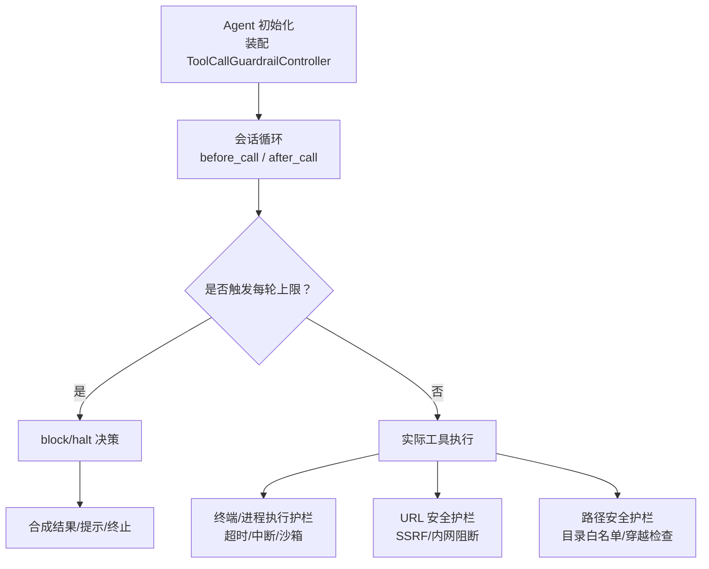
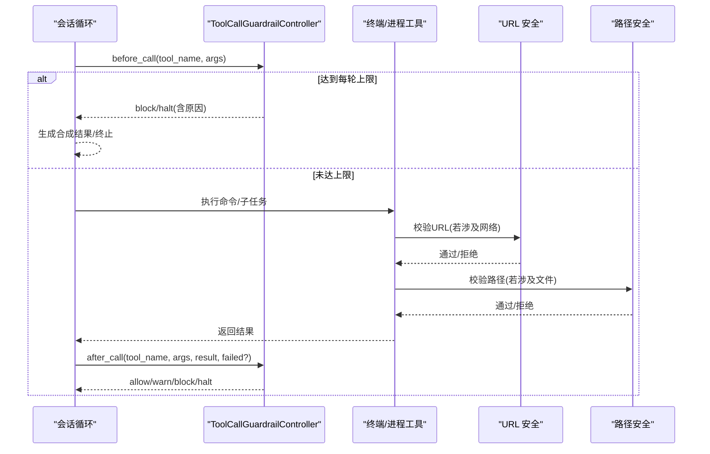
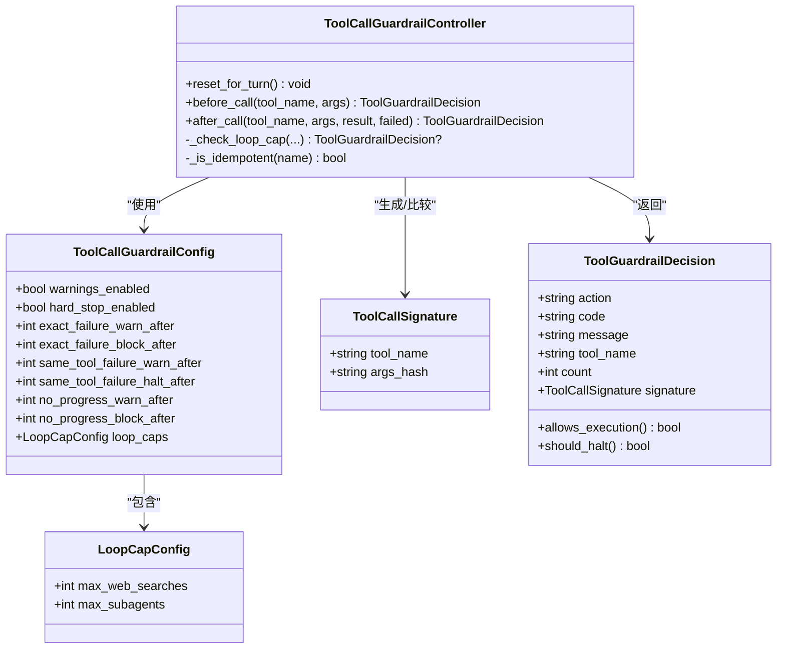
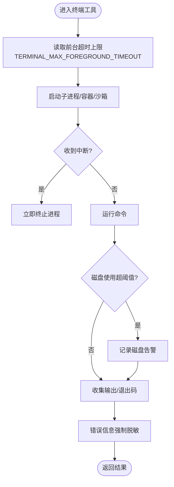
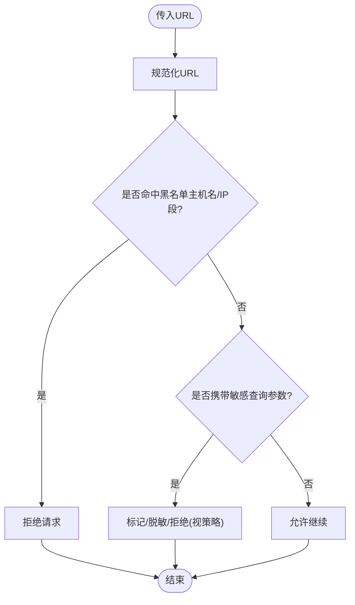
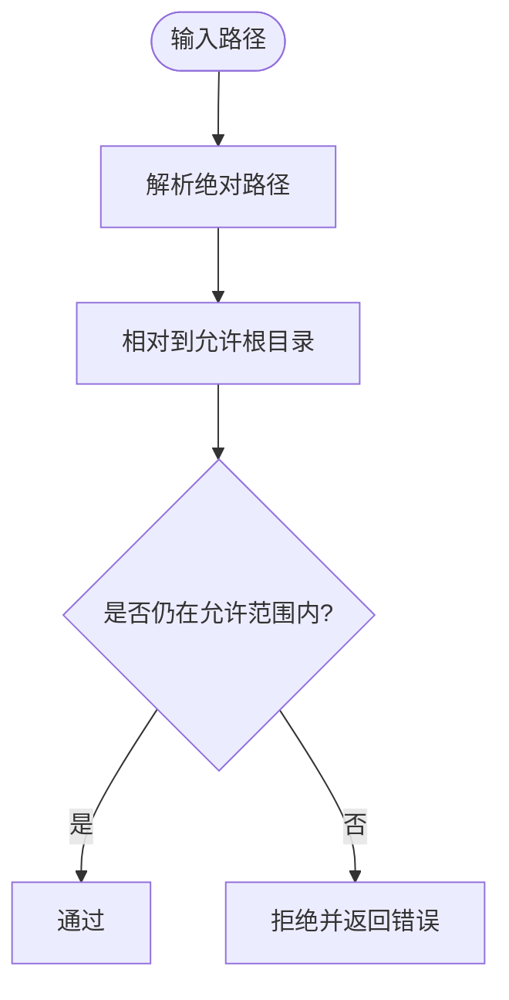
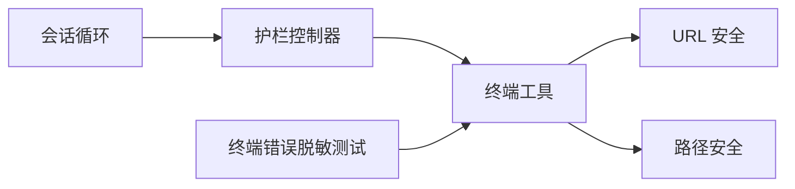

# 工具护栏

<cite>
**本文引用的文件**
- [agent/tool_guardrails.py](file://agent/tool_guardrails.py)
- [agent/agent_init.py](file://agent/agent_init.py)
- [agent/conversation_loop.py](file://agent/conversation_loop.py)
- [tools/terminal_tool.py](file://tools/terminal_tool.py)
- [tools/url_safety.py](file://tools/url_safety.py)
- [tools/path_security.py](file://tools/path_security.py)
- [tests/tools/test_terminal_error_redaction.py](file://tests/tools/test_terminal_error_redaction.py)
</cite>

## 目录
1. [简介](#简介)
2. [项目结构](#项目结构)
3. [核心组件](#核心组件)
4. [架构总览](#架构总览)
5. [详细组件分析](#详细组件分析)
6. [依赖关系分析](#依赖关系分析)
7. [性能考量](#性能考量)
8. [故障排查指南](#故障排查指南)
9. [结论](#结论)
10. [附录](#附录)

## 简介
本文件系统性说明 Hermes 的“工具护栏”机制，聚焦工具执行时的安全边界与约束条件，包括资源限制、时间控制与内存保护；阐述护栏规则的声明式配置与执行流程；覆盖文件系统访问护栏、网络请求护栏与进程执行护栏三类典型场景；提供违规检测与处罚机制说明；并为开发者提供自定义护栏的开发指南（接口约定与集成方式）。

## 项目结构
围绕工具护栏的关键代码分布在以下模块：
- 工具调用循环护栏控制器与规则：agent/tool_guardrails.py
- 护栏在 Agent 初始化与会话中的装配与生效：agent/agent_init.py、agent/conversation_loop.py
- 终端/进程执行护栏与环境隔离：tools/terminal_tool.py
- 网络请求 SSRF 防护与 URL 安全：tools/url_safety.py
- 路径越界校验与目录白名单：tools/path_security.py
- 终端错误脱敏与护栏行为验证用例：tests/tools/test_terminal_error_redaction.py



图表来源
- [agent/agent_init.py:784-785](file://agent/agent_init.py#L784-L785)
- [agent/agent_init.py:1670-1676](file://agent/agent_init.py#L1670-L1676)
- [agent/conversation_loop.py:6622-6623](file://agent/conversation_loop.py#L6622-L6623)
- [agent/tool_guardrails.py:273-348](file://agent/tool_guardrails.py#L273-L348)
- [tools/terminal_tool.py:118-132](file://tools/terminal_tool.py#L118-L132)
- [tools/url_safety.py:1-26](file://tools/url_safety.py#L1-L26)
- [tools/path_security.py:15-34](file://tools/path_security.py#L15-L34)

章节来源
- [agent/agent_init.py:784-785](file://agent/agent_init.py#L784-L785)
- [agent/agent_init.py:1670-1676](file://agent/agent_init.py#L1670-L1676)
- [agent/conversation_loop.py:6622-6623](file://agent/conversation_loop.py#L6622-L6623)
- [agent/tool_guardrails.py:63-126](file://agent/tool_guardrails.py#L63-L126)
- [tools/terminal_tool.py:118-132](file://tools/terminal_tool.py#L118-L132)
- [tools/url_safety.py:1-26](file://tools/url_safety.py#L1-L26)
- [tools/path_security.py:15-34](file://tools/path_security.py#L15-L34)

## 核心组件
- 工具调用循环护栏控制器：维护每轮计数与阈值，产出 allow/warn/block/halt 决策。
- 每轮上限（Loop Cap）：针对易失控的工具（如 web_search、delegate_task）设置单轮硬上限。
- 失败重复检测：对相同参数失败或幂等工具无进展进行告警与阻断。
- 终端/进程护栏：前台超时上限、磁盘使用告警、中断响应、环境选择（本地/Docker/Modal/Vercel Sandbox）。
- URL 安全护栏：阻止 SSRF、私有/内网地址、云元数据主机名/IP 段。
- 路径安全护栏：确保操作路径位于允许目录内，防止目录穿越。

章节来源
- [agent/tool_guardrails.py:20-60](file://agent/tool_guardrails.py#L20-L60)
- [agent/tool_guardrails.py:63-126](file://agent/tool_guardrails.py#L63-L126)
- [agent/tool_guardrails.py:139-173](file://agent/tool_guardrails.py#L139-L173)
- [agent/tool_guardrails.py:273-348](file://agent/tool_guardrails.py#L273-L348)
- [tools/terminal_tool.py:118-132](file://tools/terminal_tool.py#L118-L132)
- [tools/url_safety.py:1-26](file://tools/url_safety.py#L1-L26)
- [tools/path_security.py:15-34](file://tools/path_security.py#L15-L34)

## 架构总览
工具护栏贯穿“调用前—调用中—调用后”的全链路：
- 调用前：计算签名、检查每轮上限、必要时 block。
- 调用后：统计失败/无进展，按阈值输出 warn/block/halt，并记录到会话级 halt_decision。
- 执行层：终端工具负责超时、中断、环境隔离；URL/路径护栏在工具内部或上游调用点拦截危险访问。



图表来源
- [agent/tool_guardrails.py:295-348](file://agent/tool_guardrails.py#L295-L348)
- [agent/tool_guardrails.py:350-440](file://agent/tool_guardrails.py#L350-L440)
- [tools/url_safety.py:1-26](file://tools/url_safety.py#L1-L26)
- [tools/path_security.py:15-34](file://tools/path_security.py#L15-L34)
- [tools/terminal_tool.py:118-132](file://tools/terminal_tool.py#L118-L132)

## 详细组件分析

### 工具调用循环护栏（ToolCallGuardrailController）
- 职责：跟踪每轮工具调用特征（签名）、失败次数、幂等无进展次数，以及易失控工具的每轮上限。
- 关键能力：
  - 每轮重置：reset_for_turn 在每个 agent loop 开始时清零计数器。
  - 调用前拦截：_check_loop_cap 对 web_search、delegate_task 做硬上限拦截。
  - 调用后判定：根据失败分类与阈值，产出 warn/block/halt，并更新 halt_decision。
  - 幂等工具无进展：对读多写少的工具（如 read_file、web_search）重复相同结果时发出警告或阻断。
- 配置项：warnings_enabled、hard_stop_enabled、各类 warn_after/block_after 阈值、loop_caps.max_web_searches/max_subagents。



图表来源
- [agent/tool_guardrails.py:63-126](file://agent/tool_guardrails.py#L63-L126)
- [agent/tool_guardrails.py:139-173](file://agent/tool_guardrails.py#L139-L173)
- [agent/tool_guardrails.py:176-223](file://agent/tool_guardrails.py#L176-L223)
- [agent/tool_guardrails.py:273-348](file://agent/tool_guardrails.py#L273-L348)
- [agent/tool_guardrails.py:350-440](file://agent/tool_guardrails.py#L350-L440)

章节来源
- [agent/tool_guardrails.py:20-60](file://agent/tool_guardrails.py#L20-L60)
- [agent/tool_guardrails.py:63-126](file://agent/tool_guardrails.py#L63-L126)
- [agent/tool_guardrails.py:139-173](file://agent/tool_guardrails.py#L139-L173)
- [agent/tool_guardrails.py:273-348](file://agent/tool_guardrails.py#L273-L348)
- [agent/tool_guardrails.py:350-440](file://agent/tool_guardrails.py#L350-L440)

### 终端/进程执行护栏
- 时间控制：前台命令最大超时由环境变量限定，避免长时间阻塞。
- 中断响应：全局中断事件可立即终止长耗时子进程。
- 环境隔离：支持本地、Docker、Modal、Vercel Sandbox 等多种后端，结合容器/沙箱实现资源隔离。
- 磁盘告警：当磁盘使用超过阈值时记录告警，辅助定位资源占用问题。
- 错误脱敏：终端错误信息在序列化前强制脱敏，防止敏感信息泄露。



图表来源
- [tools/terminal_tool.py:118-132](file://tools/terminal_tool.py#L118-L132)
- [tools/terminal_tool.py:57-61](file://tools/terminal_tool.py#L57-L61)
- [tests/tools/test_terminal_error_redaction.py:1-154](file://tests/tools/test_terminal_error_redaction.py#L1-L154)

章节来源
- [tools/terminal_tool.py:118-132](file://tools/terminal_tool.py#L118-L132)
- [tools/terminal_tool.py:57-61](file://tools/terminal_tool.py#L57-L61)
- [tests/tools/test_terminal_error_redaction.py:1-154](file://tests/tools/test_terminal_error_redaction.py#L1-L154)

### 网络请求护栏（URL 安全）
- 目标：防止 SSRF 攻击，阻止访问内网/私有地址、云元数据主机名与 IP 段。
- 策略：
  - 始终阻断云元数据主机名与特定 IP 段。
  - 支持全局开关以适配代理/特殊 DNS 环境，但云元数据永不放行。
  - 对含敏感参数的 URL 进行识别与处理，降低凭据泄露风险。
  - 建议对 Hermes 自有的 httpx 客户端在连接前再次校验，缓解 DNS Rebinding 风险。



图表来源
- [tools/url_safety.py:1-26](file://tools/url_safety.py#L1-L26)
- [tools/url_safety.py:163-200](file://tools/url_safety.py#L163-L200)
- [tools/url_safety.py:106-161](file://tools/url_safety.py#L106-L161)

章节来源
- [tools/url_safety.py:1-26](file://tools/url_safety.py#L1-L26)
- [tools/url_safety.py:106-161](file://tools/url_safety.py#L106-L161)
- [tools/url_safety.py:163-200](file://tools/url_safety.py#L163-L200)

### 文件系统访问护栏（路径安全）
- 目标：确保文件操作限定在允许的根目录下，防止目录穿越与越权访问。
- 策略：
  - resolve + relative_to 校验，跟随符号链接并标准化路径。
  - 快速检测“..”穿越组件，提前拒绝可疑路径。
  - 统一封装为 validate_within_dir，便于各工具复用。



图表来源
- [tools/path_security.py:15-34](file://tools/path_security.py#L15-L34)
- [tools/path_security.py:37-44](file://tools/path_security.py#L37-L44)

章节来源
- [tools/path_security.py:15-34](file://tools/path_security.py#L15-L34)
- [tools/path_security.py:37-44](file://tools/path_security.py#L37-L44)

### 护栏规则声明式配置与执行流程
- 配置入口：tool_loop_guardrails 配置段，支持 warnings_enabled、hard_stop_enabled、warn_after/block_after 阈值与 loop_caps。
- 装配位置：Agent 初始化时创建 ToolCallGuardrailController，并在会话循环中于每次工具调用前后注入护栏判断。
- 执行要点：
  - before_call：先检查每轮上限，再根据阈值决定是否 block。
  - after_call：统计失败/无进展，必要时 warn/block/halt，并将 halt_decision 挂到会话以便后续终止。

```mermaid
sequenceDiagram
participant Cfg as "config.yaml"
participant Init as "Agent 初始化"
participant Ctrl as "ToolCallGuardrailController"
participant Loop as "会话循环"
Cfg-->>Init : tool_loop_guardrails
Init->>Ctrl : 构造(含阈值/上限)
Loop->>Ctrl : before_call(...)
Ctrl-->>Loop : allow/warn/block
Loop->>Ctrl : after_call(..., failed?)
Ctrl-->>Loop : warn/block/halt + halt_decision
Loop->>Loop : 依据 halt_decision 终止本轮
```

图表来源
- [agent/agent_init.py:784-785](file://agent/agent_init.py#L784-L785)
- [agent/agent_init.py:1670-1676](file://agent/agent_init.py#L1670-L1676)
- [agent/tool_guardrails.py:63-126](file://agent/tool_guardrails.py#L63-L126)
- [agent/conversation_loop.py:6622-6623](file://agent/conversation_loop.py#L6622-L6623)

章节来源
- [agent/agent_init.py:784-785](file://agent/agent_init.py#L784-L785)
- [agent/agent_init.py:1670-1676](file://agent/agent_init.py#L1670-L1676)
- [agent/tool_guardrails.py:63-126](file://agent/tool_guardrails.py#L63-L126)
- [agent/conversation_loop.py:6622-6623](file://agent/conversation_loop.py#L6622-L6623)

### 违规检测与处罚机制
- 违规类型：
  - 相同参数反复失败：exact_failure_* 阈值触发 warn/block。
  - 同一工具多次失败：same_tool_failure_* 阈值触发 warn/halt。
  - 幂等工具无进展：no_progress_* 阈值触发 warn/block。
  - 每轮上限超限：web_search、delegate_task 达到 loop_caps 上限直接 block。
- 处罚动作：
  - warn：附加指导信息，引导模型调整策略。
  - block：阻止本次调用，返回合成错误内容。
  - halt：停止当前轮次，终止后续工具调用。

章节来源
- [agent/tool_guardrails.py:238-270](file://agent/tool_guardrails.py#L238-L270)
- [agent/tool_guardrails.py:295-348](file://agent/tool_guardrails.py#L295-L348)
- [agent/tool_guardrails.py:350-440](file://agent/tool_guardrails.py#L350-L440)
- [agent/tool_guardrails.py:447-507](file://agent/tool_guardrails.py#L447-L507)

### 示例：如何配置护栏规则
- 在配置文件中设置 tool_loop_guardrails：
  - warnings_enabled：是否启用告警。
  - hard_stop_enabled：是否启用硬停止。
  - warn_after/block_after：不同违规类型的阈值。
  - loop_caps：max_web_searches、max_subagents 控制单轮上限。
- 在 Agent 初始化时加载该配置并注入控制器。
- 在会话循环中，before_call/after_call 自动应用这些规则。

章节来源
- [agent/tool_guardrails.py:63-126](file://agent/tool_guardrails.py#L63-L126)
- [agent/agent_init.py:1670-1676](file://agent/agent_init.py#L1670-L1676)

### 开发者指南：自定义护栏
- 接口约定：
  - 在工具调用前后接入 before_call/after_call 钩子，遵循 ToolCallGuardrailController 的决策语义（allow/warn/block/halt）。
  - 如需新增每轮上限类护栏，参考 _check_loop_cap 的模式，增加计数器并在 reset_for_turn 中清零。
  - 对于失败分类，可复用 classify_tool_failure 或扩展其逻辑，保持与 CLI 显示一致。
- 集成方法：
  - 在工具入口处调用 before_call，根据返回值决定是否执行。
  - 在工具返回后调用 after_call，传入 failed 标志或让控制器推断。
  - 将 halt_decision 传播至会话层，用于统一终止。
- 最佳实践：
  - 所有外部网络访问应经 URL 安全护栏。
  - 所有文件操作应经路径安全护栏。
  - 终端/进程执行需遵守超时与中断协议。

章节来源
- [agent/tool_guardrails.py:273-348](file://agent/tool_guardrails.py#L273-L348)
- [agent/tool_guardrails.py:350-440](file://agent/tool_guardrails.py#L350-L440)
- [agent/tool_guardrails.py:447-507](file://agent/tool_guardrails.py#L447-L507)
- [tools/url_safety.py:1-26](file://tools/url_safety.py#L1-L26)
- [tools/path_security.py:15-34](file://tools/path_security.py#L15-L34)
- [tools/terminal_tool.py:118-132](file://tools/terminal_tool.py#L118-L132)

## 依赖关系分析
- 会话循环依赖护栏控制器：在每次工具调用前后注入决策。
- 终端工具依赖中断事件与超时上限，保障进程执行安全。
- URL/路径护栏作为横切关注点，被多个工具复用。
- 测试用例验证终端错误脱敏与护栏行为。



图表来源
- [agent/conversation_loop.py:6622-6623](file://agent/conversation_loop.py#L6622-L6623)
- [agent/tool_guardrails.py:273-348](file://agent/tool_guardrails.py#L273-L348)
- [tools/terminal_tool.py:118-132](file://tools/terminal_tool.py#L118-L132)
- [tools/url_safety.py:1-26](file://tools/url_safety.py#L1-L26)
- [tools/path_security.py:15-34](file://tools/path_security.py#L15-L34)
- [tests/tools/test_terminal_error_redaction.py:1-154](file://tests/tools/test_terminal_error_redaction.py#L1-L154)

章节来源
- [agent/conversation_loop.py:6622-6623](file://agent/conversation_loop.py#L6622-L6623)
- [agent/tool_guardrails.py:273-348](file://agent/tool_guardrails.py#L273-L348)
- [tools/terminal_tool.py:118-132](file://tools/terminal_tool.py#L118-L132)
- [tools/url_safety.py:1-26](file://tools/url_safety.py#L1-L26)
- [tools/path_security.py:15-34](file://tools/path_security.py#L15-L34)
- [tests/tools/test_terminal_error_redaction.py:1-154](file://tests/tools/test_terminal_error_redaction.py#L1-L154)

## 性能考量
- 每轮上限设计将失控风险控制在单轮内，避免跨轮累积导致的资源耗尽。
- 失败计数与无进展检测仅在必要路径上维护轻量字典，开销低。
- URL/路径校验采用快速预检（如 .. 检测）减少不必要的解析成本。
- 终端超时与中断及时释放系统资源，避免僵尸进程。

[本节为通用指导，不直接分析具体文件]

## 故障排查指南
- 终端错误泄露：确认错误信息已走强制脱敏路径，参考测试断言。
- 护栏误阻断：检查 tool_loop_guardrails 阈值与 loop_caps 配置，适当放宽 warn/block 阈值或关闭 hard_stop。
- 网络请求被拒：核对 URL 是否命中黑名单主机名/IP 段，或是否携带敏感查询参数。
- 文件访问被拒：确认路径是否在允许根目录下，是否存在穿越组件。

章节来源
- [tests/tools/test_terminal_error_redaction.py:1-154](file://tests/tools/test_terminal_error_redaction.py#L1-L154)
- [agent/tool_guardrails.py:63-126](file://agent/tool_guardrails.py#L63-L126)
- [tools/url_safety.py:163-200](file://tools/url_safety.py#L163-L200)
- [tools/path_security.py:15-34](file://tools/path_security.py#L15-L34)

## 结论
Hermes 的工具护栏通过“声明式配置 + 控制器决策 + 执行层隔离”的组合，构建了从工具调用到资源访问的多层安全边界。它既能在异常情况下及时告警与阻断，又能通过每轮上限防止失控扩散。配合终端超时、中断、URL/路径安全等机制，形成完整的运行时防护体系。开发者可基于现有接口扩展自定义护栏，以满足更细粒度的安全需求。

[本节为总结性内容，不直接分析具体文件]

## 附录
- 术语
  - 每轮上限：单个 agent loop（一轮）内的工具调用数量上限。
  - 幂等工具：多次调用产生相同结果的读为主工具。
  - SSRF：服务器端请求伪造，利用服务端发起恶意网络请求。
- 相关配置键
  - tool_loop_guardrails.warnings_enabled
  - tool_loop_guardrails.hard_stop_enabled
  - tool_loop_guardrails.warn_after.*
  - tool_loop_guardrails.block_after.*
  - tool_loop_guardrails.loop_caps.max_web_searches
  - tool_loop_guardrails.loop_caps.max_subagents

[本节为补充说明，不直接分析具体文件]