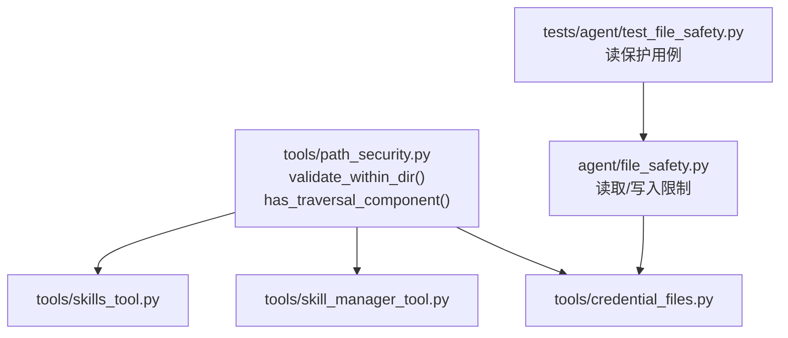
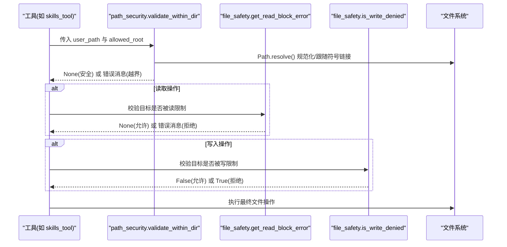
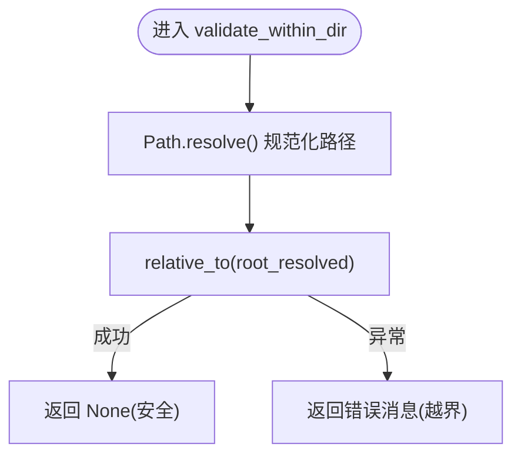
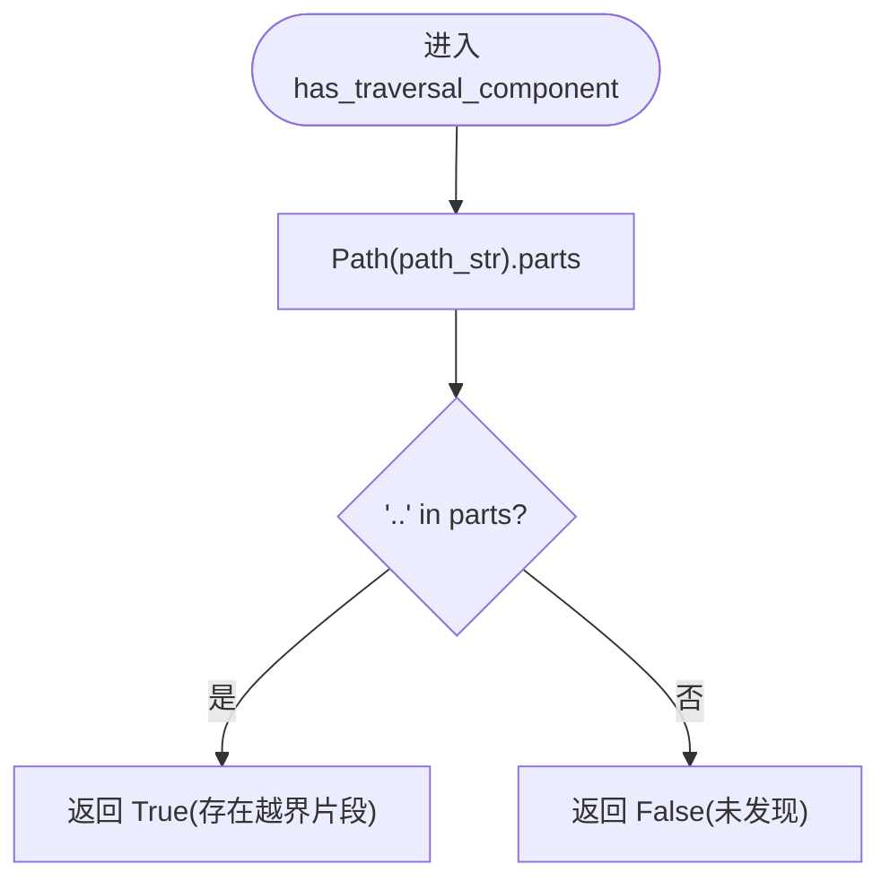
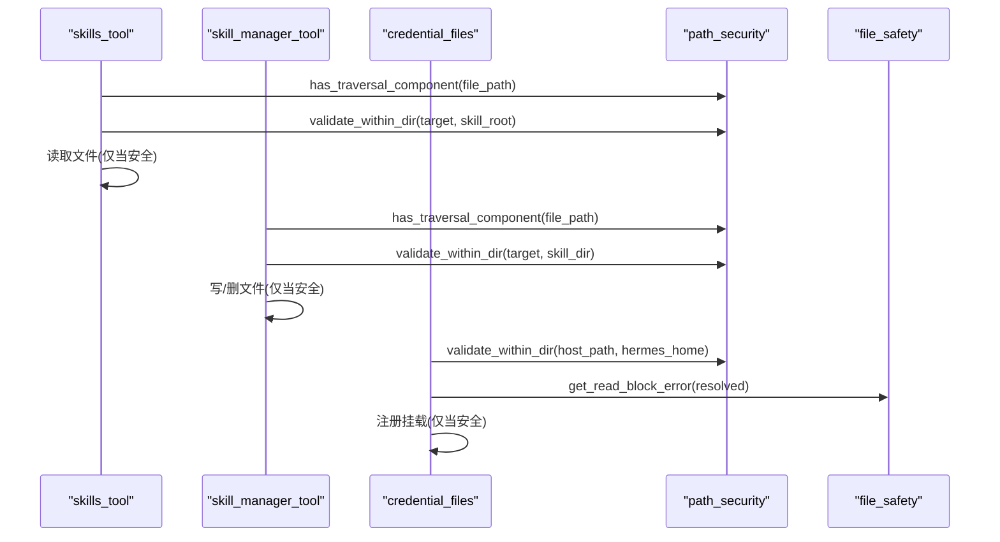
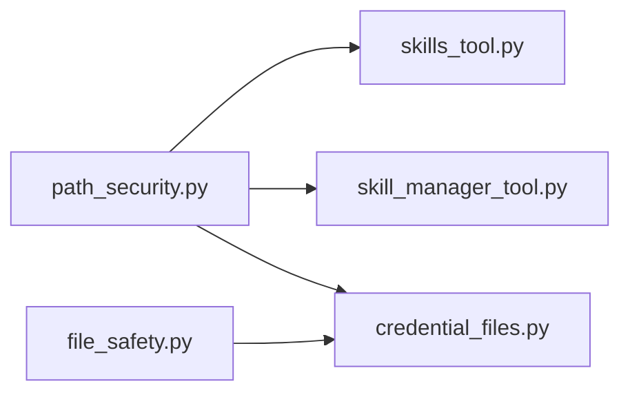

# 路径验证与安全

<cite>
**本文引用的文件**
- [tools/path_security.py](file://tools/path_security.py)
- [agent/file_safety.py](file://agent/file_safety.py)
- [tools/skills_tool.py](file://tools/skills_tool.py)
- [tools/skill_manager_tool.py](file://tools/skill_manager_tool.py)
- [tools/credential_files.py](file://tools/credential_files.py)
- [tests/agent/test_file_safety.py](file://tests/agent/test_file_safety.py)
</cite>

## 目录
1. [简介](#简介)
2. [项目结构](#项目结构)
3. [核心组件](#核心组件)
4. [架构总览](#架构总览)
5. [详细组件分析](#详细组件分析)
6. [依赖关系分析](#依赖关系分析)
7. [性能考量](#性能考量)
8. [故障排查指南](#故障排查指南)
9. [结论](#结论)
10. [附录](#附录)

## 简介
本文件聚焦 Hermes 的路径验证与安全机制，重点说明 validate_within_dir() 如何防止路径遍历攻击，包括 Path.resolve() 的使用、符号链接处理与相对路径规范化；解释 has_traversal_component() 的快速检查机制及 '..' 检测方式；给出在工具中集成这些安全函数的实践示例、错误处理策略与异常捕获方法。同时结合 agent/file_safety.py 的读取/写入限制，形成纵深防御体系。

## 项目结构
Hermes 将“通用路径校验”抽取为独立模块 tools/path_security.py，被多个工具（如 skills_tool、skill_manager_tool、credential_files）复用；agent/file_safety.py 提供读写白名单/黑名单与敏感资源保护；测试覆盖关键行为。

图表来源
- [tools/path_security.py:15-43](file://tools/path_security.py#L15-L43)
- [tools/skills_tool.py:920-934](file://tools/skills_tool.py#L920-L934)
- [tools/skill_manager_tool.py:845-889](file://tools/skill_manager_tool.py#L845-L889)
- [tools/credential_files.py:95-148](file://tools/credential_files.py#L95-L148)
- [agent/file_safety.py:194-337](file://agent/file_safety.py#L194-L337)
- [tests/agent/test_file_safety.py:22-61](file://tests/agent/test_file_safety.py#L22-L61)

章节来源
- [tools/path_security.py:1-44](file://tools/path_security.py#L1-L44)
- [agent/file_safety.py:1-337](file://agent/file_safety.py#L1-L337)

## 核心组件
- validate_within_dir(path, root): 使用 Path.resolve() 解析符号链接并规范化 ..，再通过 relative_to(root_resolved) 判定是否在允许根内。失败时返回错误消息字符串，成功返回 None。
- has_traversal_component(path_str): 快速检查路径是否包含 ".." 片段，用于提前拒绝明显越界尝试。
- agent/file_safety.py: 提供读取/写入限制（如禁止读取 .env、认证存储等），作为纵深防御。

章节来源
- [tools/path_security.py:15-43](file://tools/path_security.py#L15-L43)
- [agent/file_safety.py:194-337](file://agent/file_safety.py#L194-L337)

## 架构总览
下图展示从工具入口到路径安全检查再到实际文件操作的调用链，以及读取侧的防护点。

图表来源
- [tools/skills_tool.py:920-934](file://tools/skills_tool.py#L920-L934)
- [tools/path_security.py:15-34](file://tools/path_security.py#L15-L34)
- [agent/file_safety.py:194-337](file://agent/file_safety.py#L194-L337)
- [agent/file_safety.py:161-177](file://agent/file_safety.py#L161-L177)

## 详细组件分析

### validate_within_dir() 防路径遍历机制
- 使用 Path.resolve() 对输入路径和根路径进行绝对化与符号链接解析，消除 .. 与相对路径歧义。
- 通过 resolved.relative_to(root_resolved) 判断是否在允许根内；若抛出 ValueError/OSError，则视为越界并返回错误信息。
- 该函数是“强约束”，任何试图通过 .. 或符号链接逃逸的行为都会被拒绝。

图表来源
- [tools/path_security.py:15-34](file://tools/path_security.py#L15-L34)

章节来源
- [tools/path_security.py:15-34](file://tools/path_security.py#L15-L34)

### has_traversal_component() 快速检查
- 将路径拆分为 parts，直接检查是否存在 ".." 片段，用于在完整解析前快速拒绝明显越界输入。
- 适用于需要尽早拦截的场景，减少后续开销。

图表来源
- [tools/path_security.py:37-43](file://tools/path_security.py#L37-L43)

章节来源
- [tools/path_security.py:37-43](file://tools/path_security.py#L37-L43)

### 在工具中的集成与使用示例
- skills_tool：在读取技能关联文件前，先用 has_traversal_component() 快速检查，再用 validate_within_dir() 做严格边界校验，最后才读取文件内容。
- skill_manager_tool：在写/删文件前，先快速检查 ..，再按允许的目录子集校验，并通过 validate_within_dir() 确保目标不越出技能目录。
- credential_files：在注册可挂载的凭据文件时，先 validate_within_dir() 保证相对路径不会逃逸 HERMES_HOME，再结合 file_safety 的读限制拒绝敏感文件。

图表来源
- [tools/skills_tool.py:920-934](file://tools/skills_tool.py#L920-L934)
- [tools/skill_manager_tool.py:845-889](file://tools/skill_manager_tool.py#L845-L889)
- [tools/credential_files.py:95-148](file://tools/credential_files.py#L95-L148)

章节来源
- [tools/skills_tool.py:920-934](file://tools/skills_tool.py#L920-L934)
- [tools/skill_manager_tool.py:845-889](file://tools/skill_manager_tool.py#L845-L889)
- [tools/credential_files.py:95-148](file://tools/credential_files.py#L95-L148)

### 错误处理与异常捕获
- validate_within_dir() 捕获 ValueError/OSError 并返回人类可读的错误消息，调用方据此终止操作。
- 工具层通常将错误包装为 JSON 响应或工具结果，便于上层统一处理。
- file_safety 的读取限制会返回明确错误原因（如“访问被拒绝：...是携带密钥的环境文件”），并在多处被调用以阻断敏感读取。

章节来源
- [tools/path_security.py:28-34](file://tools/path_security.py#L28-L34)
- [tools/skills_tool.py:920-934](file://tools/skills_tool.py#L920-L934)
- [agent/file_safety.py:194-337](file://agent/file_safety.py#L194-L337)

### 符号链接与相对路径规范化
- Path.resolve() 会将相对路径转换为绝对路径，并遵循符号链接，从而避免通过 .. 或软链接绕过目录限制。
- 在 credential_files 中，先 resolve 后再进行 containment 检查，确保即使存在符号链接也无法逃逸 HERMES_HOME。

章节来源
- [tools/path_security.py:15-34](file://tools/path_security.py#L15-L34)
- [tools/credential_files.py:95-148](file://tools/credential_files.py#L95-L148)

## 依赖关系分析
- tools/path_security.py 被多个工具模块导入，形成“共享安全原语”。
- agent/file_safety.py 提供更高层的读写策略，与 path_security 互补：前者关注“哪些路径不能碰”，后者关注“路径是否越界”。

图表来源
- [tools/path_security.py:1-44](file://tools/path_security.py#L1-L44)
- [tools/skills_tool.py:920-934](file://tools/skills_tool.py#L920-L934)
- [tools/skill_manager_tool.py:845-889](file://tools/skill_manager_tool.py#L845-L889)
- [tools/credential_files.py:95-148](file://tools/credential_files.py#L95-L148)
- [agent/file_safety.py:194-337](file://agent/file_safety.py#L194-L337)

章节来源
- [tools/path_security.py:1-44](file://tools/path_security.py#L1-L44)
- [agent/file_safety.py:194-337](file://agent/file_safety.py#L194-L337)

## 性能考量
- has_traversal_component() 是 O(n) 的轻量检查，适合前置快速过滤。
- validate_within_dir() 涉及 Path.resolve() 与 relative_to()，开销较小，但应避免在高频循环中重复计算同一根路径。
- 建议缓存 root_resolved 或在批量操作中复用已解析的根路径，减少系统调用。

[本节为通用指导，无需特定文件引用]

## 故障排查指南
- 症状：工具报告“路径逃逸允许目录”或“访问被拒绝”。
  - 检查是否使用了 .. 或符号链接导致 resolve 后越界。
  - 确认传入的 root 是否正确且已解析。
- 症状：读取 .env 或认证文件被阻止。
  - 这是 file_safety 的读保护生效，属于预期行为；应改用受控接口或示例文件（如 .env.example）。
- 定位方法：查看对应工具的日志输出与错误消息，必要时打印 resolved 路径与 root 进行比较。

章节来源
- [tools/path_security.py:28-34](file://tools/path_security.py#L28-L34)
- [agent/file_safety.py:194-337](file://agent/file_safety.py#L194-L337)
- [tests/agent/test_file_safety.py:22-61](file://tests/agent/test_file_safety.py#L22-L61)

## 结论
Hermes 通过 tools/path_security.py 的 validate_within_dir() 与 has_traversal_component() 提供了稳健的路径边界控制，结合 agent/file_safety.py 的读写限制，形成“越界检测 + 敏感资源保护”的纵深防御。工具层在关键路径上组合使用这两类能力，既保证了安全性，又保持了良好的可维护性与可扩展性。

[本节为总结，无需特定文件引用]

## 附录
- 最佳实践
  - 始终使用 validate_within_dir() 对任意用户可控路径进行边界校验。
  - 在可能触发 I/O 的操作前，先用 has_traversal_component() 快速拒绝明显越界输入。
  - 对读取敏感文件（如 .env、认证存储）一律走 file_safety 的读保护。
  - 在容器/沙箱场景中，务必先 resolve 路径再进行 containment 检查，避免符号链接绕过。
- 参考实现位置
  - 路径校验原语：tools/path_security.py
  - 工具集成示例：tools/skills_tool.py、tools/skill_manager_tool.py、tools/credential_files.py
  - 读写限制与用例：agent/file_safety.py、tests/agent/test_file_safety.py

[本节为补充信息，无需特定文件引用]