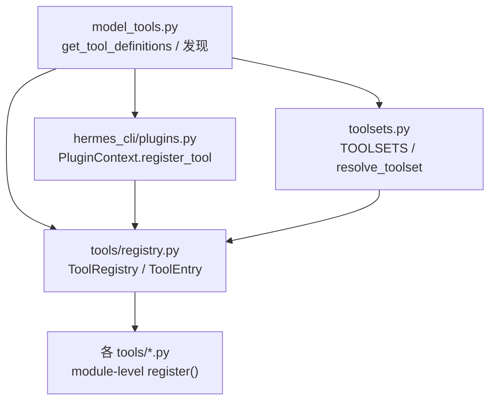
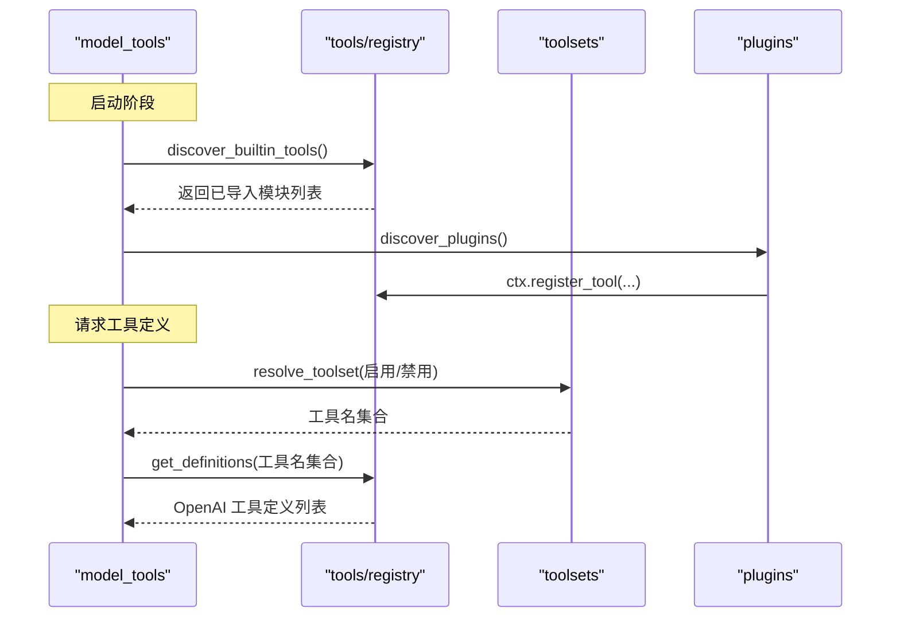
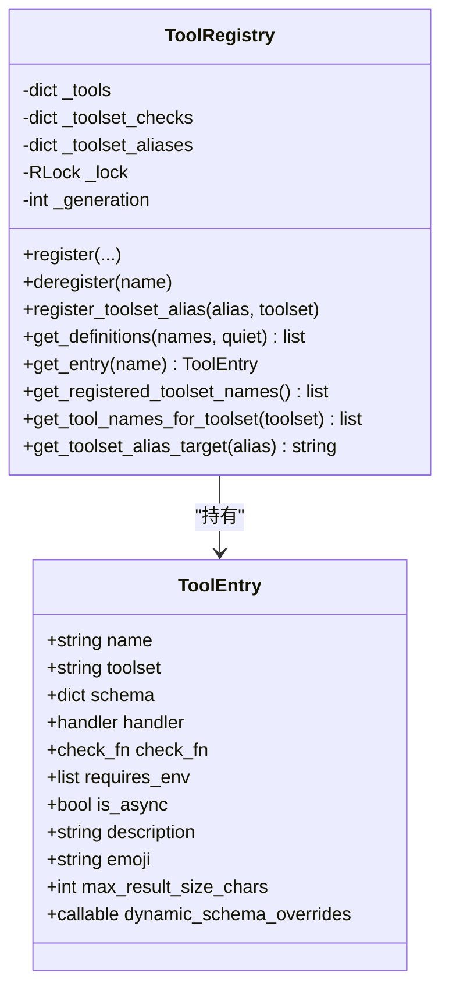
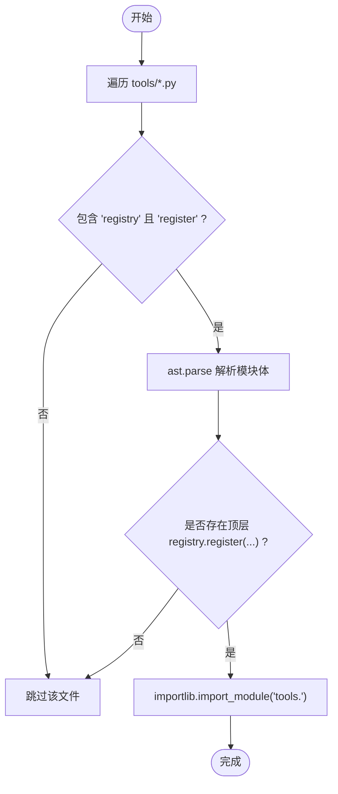
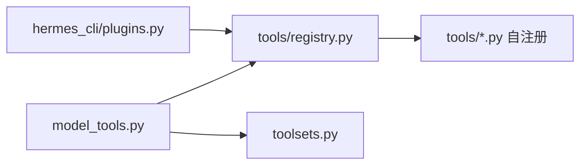

# 工具注册机制

<cite>
**本文引用的文件**
- [tools/registry.py](file://tools/registry.py)
- [model_tools.py](file://model_tools.py)
- [toolsets.py](file://toolsets.py)
- [hermes_cli/plugins.py](file://hermes_cli/plugins.py)
</cite>

## 目录
1. [简介](#简介)
2. [项目结构](#项目结构)
3. [核心组件](#核心组件)
4. [架构总览](#架构总览)
5. [详细组件分析](#详细组件分析)
6. [依赖关系分析](#依赖关系分析)
7. [性能与缓存](#性能与缓存)
8. [并发安全设计](#并发安全设计)
9. [错误处理与权限控制](#错误处理与权限控制)
10. [插件覆盖策略](#插件覆盖策略)
11. [自定义工具注册指南](#自定义工具注册指南)
12. [故障排查](#故障排查)
13. [结论](#结论)

## 简介
本文件系统性说明 Hermes 的工具注册机制，围绕 ToolRegistry 类的设计原理展开，涵盖工具发现、注册、注销、别名与版本（生成号）管理；解释 ToolEntry 元数据结构字段含义与使用方式；梳理自动发现流程、AST 扫描优化、检查函数缓存、并发安全设计；并给出工具集（toolset）概念、别名机制、错误处理、权限控制与插件覆盖策略的完整指南。

## 项目结构
Hermes 的工具系统由以下关键模块构成：
- tools/registry.py：全局工具注册表，负责工具条目存储、发现、注册、注销、别名、可用性与定义生成。
- model_tools.py：模型侧工具编排层，触发内置工具与插件发现，提供 get_tool_definitions 等对外 API，并对异步执行、结果归一化、动态 schema 组装进行统一处理。
- toolsets.py：工具集定义与解析，支持组合、平台包、别名映射与静态/动态视图。
- hermes_cli/plugins.py：插件系统，提供 PluginContext.register_tool 等能力，将插件工具注入全局注册表，并实施覆盖授权策略。

图表来源
- [model_tools.py:210-235](file://model_tools.py#L210-L235)
- [tools/registry.py:108-159](file://tools/registry.py#L108-L159)
- [toolsets.py:644-714](file://toolsets.py#L644-L714)
- [hermes_cli/plugins.py:439-490](file://hermes_cli/plugins.py#L439-L490)

章节来源
- [model_tools.py:210-235](file://model_tools.py#L210-L235)
- [tools/registry.py:108-159](file://tools/registry.py#L108-L159)
- [toolsets.py:644-714](file://toolsets.py#L644-L714)
- [hermes_cli/plugins.py:439-490](file://hermes_cli/plugins.py#L439-L490)

## 核心组件
- ToolEntry：单条工具的元数据载体，包含名称、所属工具集、JSON Schema、处理器、可用性检查函数、是否需环境、是否异步、描述、表情、结果大小限制以及运行时动态 schema 覆盖回调。
- ToolRegistry：全局注册表，维护工具条目、工具集检查函数映射、工具集别名、插件覆盖策略、并发锁与生成号。提供注册、注销、别名、获取定义、快照等方法。
- 工具发现：discover_builtin_tools 通过 AST 扫描 tools/*.py，识别顶层 registry.register 调用，仅导入声明了注册的模块，并使用磁盘缓存加速。
- 工具集系统：toolsets.py 定义静态工具集与组合规则，resolve_toolset 递归解析 includes，支持“all/*”聚合，支持平台包与非核心工具剥离。
- 插件集成：hermes_cli/plugins.py 暴露 PluginContext.register_tool，封装对 registry.register 的调用，并在覆盖场景下强制 operator 授权。

章节来源
- [tools/registry.py:201-230](file://tools/registry.py#L201-L230)
- [tools/registry.py:414-507](file://tools/registry.py#L414-L507)
- [tools/registry.py:562-644](file://tools/registry.py#L562-L644)
- [tools/registry.py:646-711](file://tools/registry.py#L646-L711)
- [tools/registry.py:108-159](file://tools/registry.py#L108-L159)
- [toolsets.py:101-640](file://toolsets.py#L101-L640)
- [toolsets.py:644-714](file://toolsets.py#L644-L714)
- [hermes_cli/plugins.py:439-490](file://hermes_cli/plugins.py#L439-L490)

## 架构总览
工具注册与发现的整体流程如下：
- 启动时，model_tools 调用 discover_builtin_tools 扫描并导入自带工具模块，触发各模块顶层的 registry.register。
- 随后加载插件，插件通过 PluginContext.register_tool 将自定义工具注入同一注册表。
- 当需要向模型暴露工具时，调用 get_tool_definitions，基于 enabled/disabled toolsets 解析出候选工具名集合，再交由 registry.get_definitions 过滤 check_fn 并产出 OpenAI 格式 schema。
- 工具集别名与 MCP 动态刷新会更新注册表并递增 generation，外部可据此失效缓存。

图表来源
- [model_tools.py:210-235](file://model_tools.py#L210-L235)
- [tools/registry.py:108-159](file://tools/registry.py#L108-L159)
- [toolsets.py:745-800](file://toolsets.py#L745-L800)
- [hermes_cli/plugins.py:439-490](file://hermes_cli/plugins.py#L439-L490)

## 详细组件分析

### ToolEntry 元数据结构
- name：工具唯一标识，用于查找与调度。
- toolset：工具所属工具集，参与工具集过滤与展示。
- schema：OpenAI 风格的 JSON Schema，描述参数与行为。
- handler：实际执行函数（同步或异步）。
- check_fn：可选的可用性探测函数，如检测 Docker/MCP/浏览器依赖。
- requires_env：所需环境变量清单，用于提示或前置校验。
- is_async：是否为异步处理器。
- description/emoji：面向模型的描述与图标。
- max_result_size_chars：结果长度上限，防止超长输出污染上下文。
- dynamic_schema_overrides：零参回调，在 get_definitions 时合并运行时 schema 覆盖（例如根据当前配置调整描述或参数）。

章节来源
- [tools/registry.py:201-230](file://tools/registry.py#L201-L230)

### ToolRegistry 设计与实现
- 数据存储：_tools 字典保存 ToolEntry；_toolset_checks 记录每个工具集的 check_fn；_toolset_aliases 维护别名到规范工具集名的映射。
- 并发安全：使用 RLock 保护所有写操作；对外读取采用快照（_snapshot_state/_snapshot_entries），避免迭代期间被修改。
- 版本管理：_generation 单调递增，每次 register/deregister/alias 变更都会增加，供上层缓存键使用。
- 注册逻辑：register(name, toolset, schema, handler, ...) 支持 override 标志；跨工具集同名冲突默认拒绝，除非显式允许。
- 注销逻辑：deregister(name) 清理条目与工具集检查，若该工具集为空则清理相关别名。
- 定义生成：get_definitions(names, quiet) 按工具集过滤、check_fn 探测、动态 schema 覆盖，最终产出 OpenAI function schema。

图表来源
- [tools/registry.py:201-230](file://tools/registry.py#L201-L230)
- [tools/registry.py:414-507](file://tools/registry.py#L414-L507)
- [tools/registry.py:562-644](file://tools/registry.py#L562-L644)
- [tools/registry.py:646-711](file://tools/registry.py#L646-L711)

章节来源
- [tools/registry.py:414-507](file://tools/registry.py#L414-L507)
- [tools/registry.py:562-644](file://tools/registry.py#L562-L644)
- [tools/registry.py:646-711](file://tools/registry.py#L646-L711)

### 工具自动发现与 AST 扫描优化
- 扫描范围：遍历 tools/*.py，排除 __init__.py、registry.py、mcp_tool.py。
- AST 判定：仅当模块体存在顶层 registry.register(...) 调用才视为自注册工具。
- 文本预过滤：先快速判断源码中是否包含关键字 “registry” 和 “register”，减少 ast.parse 开销。
- 磁盘缓存：以 (mtime_ns, size) 为键缓存判定结果，命中则跳过 IO 与解析；未命中则写入原子 JSON 缓存。
- 导入策略：仅导入判定为自注册的模块，捕获异常并记录日志，保证健壮性。

图表来源
- [tools/registry.py:71-106](file://tools/registry.py#L71-L106)
- [tools/registry.py:108-159](file://tools/registry.py#L108-L159)
- [tools/registry.py:162-198](file://tools/registry.py#L162-L198)

章节来源
- [tools/registry.py:71-106](file://tools/registry.py#L71-L106)
- [tools/registry.py:108-159](file://tools/registry.py#L108-L159)
- [tools/registry.py:162-198](file://tools/registry.py#L162-L198)

### 工具集（toolset）与别名机制
- 工具集定义：toolsets.py 中的 TOOLSETS 字典集中声明工具集及其包含的工具与嵌套 includes。
- 解析与组合：resolve_toolset 递归解析 includes，支持 all/* 聚合，循环检测与钻石依赖安全处理。
- 平台包与非核心剥离：bundle_non_core_tools 计算平台包的非核心增量，避免禁用平台包误删核心工具。
- 别名：ToolRegistry.register_toolset_alias 支持将别名映射到规范工具集名；get_toolset_alias_target 可查询目标。
- 动态视图：get_toolset(..., include_registry=True) 会将插件/注册表新增工具合并进静态定义，形成运行时视图。

章节来源
- [toolsets.py:101-640](file://toolsets.py#L101-L640)
- [toolsets.py:644-714](file://toolsets.py#L644-L714)
- [toolsets.py:717-742](file://toolsets.py#L717-L742)
- [toolsets.py:745-800](file://toolsets.py#L745-L800)
- [tools/registry.py:487-507](file://tools/registry.py#L487-L507)

### 检查函数（check_fn）缓存与 TTL
- 目的：避免频繁探测外部状态（Docker、Playwright、MCP 等）造成性能抖动。
- 缓存策略：按 (fn, profile_scope) 缓存最近一次结果，TTL 约 30 秒；失败后若在“成功时间窗口”内再次失败，视为瞬态并返回上次成功值。
- 多进程隔离：支持 multiplex 场景下的 profile 维度隔离；无法解析 profile 时直接绕过缓存。
- 失效接口：invalidate_check_fn_cache 清空缓存；get_cached_check_fn_result 只读读取最新缓存。

章节来源
- [tools/registry.py:233-388](file://tools/registry.py#L233-L388)

### 异步执行与结果归一化
- 事件循环复用：model_tools 维护主线程与每工作线程的持久事件循环，避免“Event loop closed”问题。
- 同步桥接：_run_async 智能选择在新线程创建独立循环或在已有循环中提交任务，超时取消并清理。
- 结果归一化：ToolRegistry._normalize_handler_result 确保工具返回字符串或多模态信封，其他类型转为结构化错误，便于后续管线消费。

章节来源
- [model_tools.py:68-208](file://model_tools.py#L68-L208)
- [tools/registry.py:770-800](file://tools/registry.py#L770-L800)

## 依赖关系分析
- model_tools 依赖 tools.registry 与 toolsets，驱动发现与定义生成。
- plugins 通过 PluginContext 将工具注入 registry，受覆盖策略约束。
- toolsets 提供静态与动态工具集视图，供 model_tools 解析启用/禁用的工具集合。
- 各 tools/*.py 模块在导入时自注册，形成“约定优于配置”的扩展点。

图表来源
- [model_tools.py:210-235](file://model_tools.py#L210-L235)
- [tools/registry.py:108-159](file://tools/registry.py#L108-L159)
- [hermes_cli/plugins.py:439-490](file://hermes_cli/plugins.py#L439-L490)
- [toolsets.py:644-714](file://toolsets.py#L644-L714)

章节来源
- [model_tools.py:210-235](file://model_tools.py#L210-L235)
- [tools/registry.py:108-159](file://tools/registry.py#L108-L159)
- [hermes_cli/plugins.py:439-490](file://hermes_cli/plugins.py#L439-L490)
- [toolsets.py:644-714](file://toolsets.py#L644-L714)

## 性能与缓存
- 工具发现缓存：基于 (mtime_ns, size) 的磁盘缓存，避免重复 AST 解析；原子写入保障并发安全。
- check_fn 缓存：30 秒 TTL 与成功时间窗口的瞬态失败抑制，降低外部探测成本。
- 工具定义缓存：get_tool_definitions 在 quiet_mode 下按 (enabled/disabled toolsets, registry._generation, config mtime, 环境标志) 缓存结果，最多保留固定数量条目，避免长驻进程内存增长。
- 动态 schema 覆盖：按需调用 dynamic_schema_overrides，结合配置 mtime 失效，平衡实时性与性能。

章节来源
- [tools/registry.py:108-159](file://tools/registry.py#L108-L159)
- [tools/registry.py:233-388](file://tools/registry.py#L233-L388)
- [model_tools.py:276-388](file://model_tools.py#L276-L388)

## 并发安全设计
- 读写分离：ToolRegistry 使用 RLock 保护写路径；读取通过快照方法获取稳定视图，避免迭代期变更。
- 多进程/多 profile：check_fn 缓存支持 profile 维度隔离；无法解析 profile 时回退到无缓存模式，避免串扰。
- 事件循环隔离：主线程与工作线程分别维护持久事件循环，避免共享循环导致的关闭与竞争问题。

章节来源
- [tools/registry.py:414-445](file://tools/registry.py#L414-L445)
- [tools/registry.py:287-310](file://tools/registry.py#L287-L310)
- [model_tools.py:68-208](file://model_tools.py#L68-L208)

## 错误处理与权限控制
- 错误截断：工具错误消息在模型上下文中被限制长度，日志保留更长前缀，防止上下文膨胀。
- 权限控制：插件覆盖内置工具需 operator 明确授权（allow_tool_override），否则抛出 PermissionError；deregister 同样受所有权与授权策略约束。
- 安全兜底：schema 清洗、工具错误净化、结果类型归一化，确保下游管道稳定。

章节来源
- [tools/registry.py:29-68](file://tools/registry.py#L29-L68)
- [tools/registry.py:562-644](file://tools/registry.py#L562-L644)
- [tools/registry.py:646-711](file://tools/registry.py#L646-L711)
- [model_tools.py:684-727](file://model_tools.py#L684-L727)

## 插件覆盖策略
- 覆盖入口：PluginContext.register_tool 支持 override=True，但需满足 allow_tool_override 配置或为内置插件。
- 所有权绑定：注册表通过 handler.__globals__["__name__"] 绑定处理器定义模块，确保延迟/线程回调仍受相同策略约束。
- 注销保护：非 MCP 工具集的注销需证明调用方与工具同属一个插件根命名空间，否则拒绝。

章节来源
- [hermes_cli/plugins.py:439-520](file://hermes_cli/plugins.py#L439-L520)
- [tools/registry.py:513-544](file://tools/registry.py#L513-L544)
- [tools/registry.py:646-711](file://tools/registry.py#L646-L711)

## 自定义工具注册指南
- 步骤概览：
  1) 在 tools 目录下新建工具模块，模块顶层调用 registry.register 声明工具。
  2) 定义工具 JSON Schema、处理器函数、可选 check_fn、requires_env、is_async、description、emoji、max_result_size_chars、dynamic_schema_overrides。
  3) 重启或重新加载后，discover_builtin_tools 会自动发现并导入该模块。
  4) 如需作为插件提供，使用 PluginContext.register_tool 注册，必要时开启 override 并配置 allow_tool_override。
- 示例路径参考：
  - 自注册入口：[tools/registry.py:108-159](file://tools/registry.py#L108-L159)
  - 注册接口签名：[tools/registry.py:562-644](file://tools/registry.py#L562-L644)
  - 插件注册封装：[hermes_cli/plugins.py:439-490](file://hermes_cli/plugins.py#L439-L490)
- 注意事项：
  - 工具必须属于某个 toolset，以便被启用/禁用策略筛选。
  - check_fn 应轻量且幂等，避免阻塞；利用 TTL 与瞬态失败抑制提升鲁棒性。
  - 动态 schema 覆盖应在 get_definitions 时生效，注意异常降级。

章节来源
- [tools/registry.py:108-159](file://tools/registry.py#L108-L159)
- [tools/registry.py:562-644](file://tools/registry.py#L562-L644)
- [hermes_cli/plugins.py:439-490](file://hermes_cli/plugins.py#L439-L490)

## 故障排查
- 工具未出现：
  - 确认模块顶层存在 registry.register 调用；查看 AST 扫描是否命中。
  - 检查工具集是否被启用或被禁用策略移除。
  - 查看 check_fn 是否失败并被缓存；必要时调用 invalidate_check_fn_cache。
- 覆盖被拒绝：
  - 确认插件配置 allow_tool_override；或改用不同工具名。
- 异步错误：
  - 检查是否在已有事件循环中正确桥接；确认超时与取消逻辑。
- 结果异常：
  - 检查工具返回值类型是否符合字符串或多模态信封；否则会被归一化为错误。

章节来源
- [tools/registry.py:108-159](file://tools/registry.py#L108-L159)
- [tools/registry.py:233-388](file://tools/registry.py#L233-L388)
- [tools/registry.py:562-644](file://tools/registry.py#L562-L644)
- [model_tools.py:68-208](file://model_tools.py#L68-L208)
- [model_tools.py:276-388](file://model_tools.py#L276-L388)

## 结论
Hermes 的工具注册机制以 ToolRegistry 为核心，结合 AST 驱动的自动发现、严格的权限与覆盖策略、健壮的缓存与并发设计，提供了可扩展、高性能、安全的工具生态。通过 toolsets 的组合与别名机制，系统能够灵活适配不同平台与场景；插件体系则在保持安全边界的前提下，允许第三方扩展与替换。开发者可依据本文指南，安全地注册自定义工具，并利用缓存、检查函数与动态 schema 优化体验与性能。