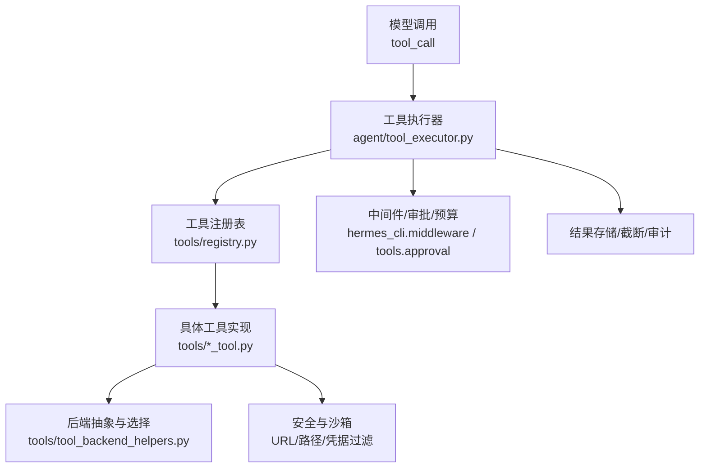
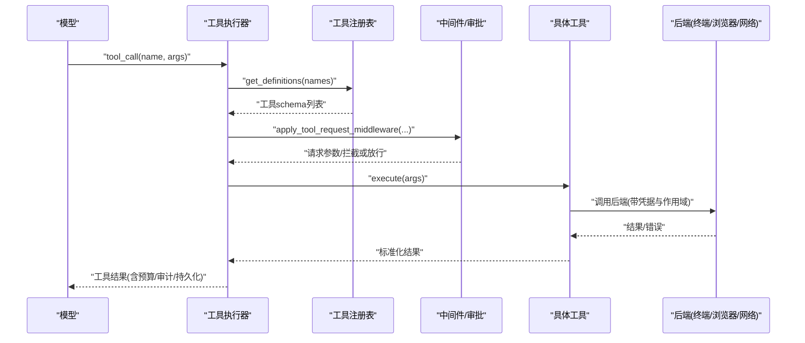
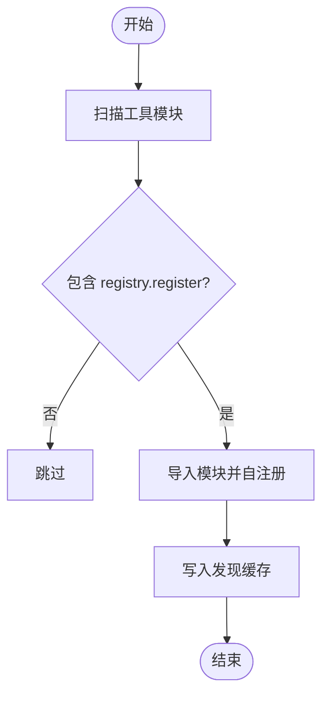
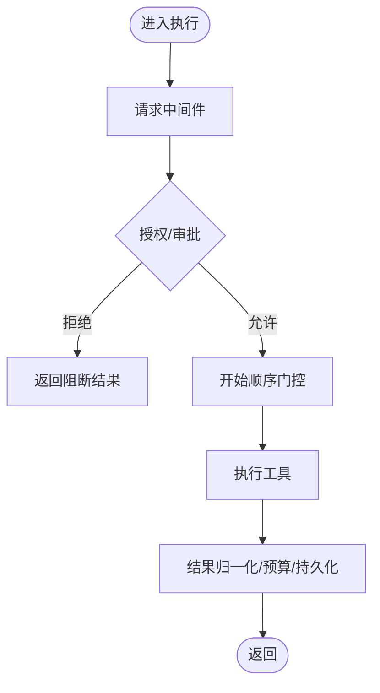
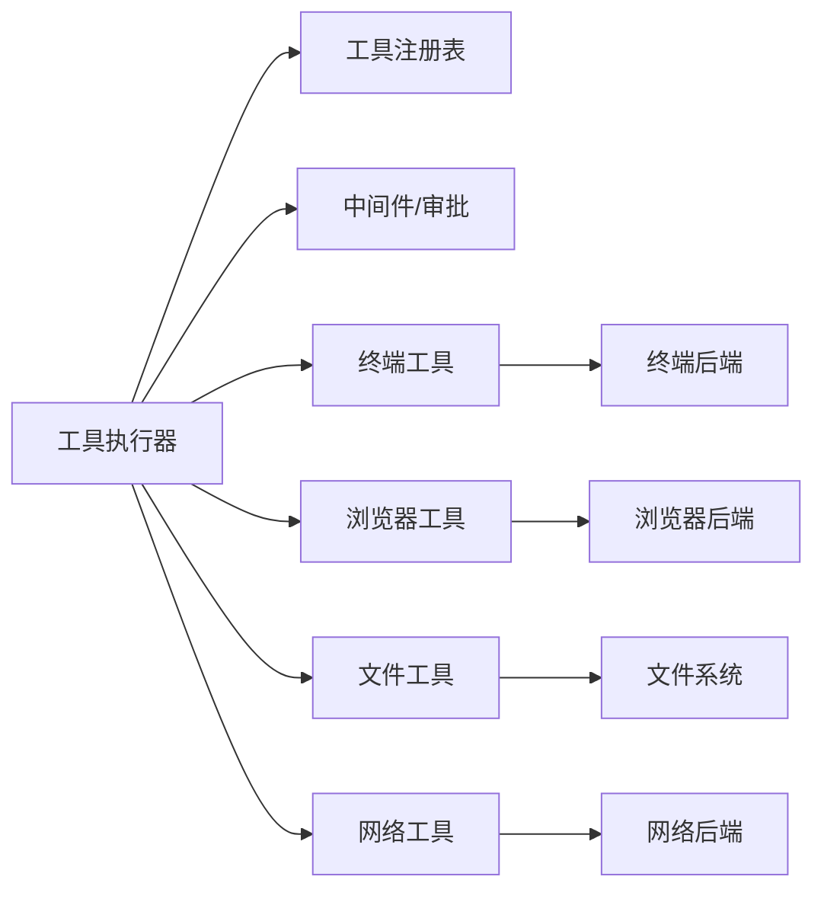

# 工具系统架构

<cite>
**本文引用的文件**
- [tools/registry.py](file://tools/registry.py)
- [agent/tool_executor.py](file://agent/tool_executor.py)
- [tools/file_operations.py](file://tools/file_operations.py)
- [tools/web_tools.py](file://tools/web_tools.py)
- [tools/browser_tool.py](file://tools/browser_tool.py)
- [tools/terminal_tool.py](file://tools/terminal_tool.py)
- [tools/tool_backend_helpers.py](file://tools/tool_backend_helpers.py)
</cite>

## 目录
1. [简介](#简介)
2. [项目结构](#项目结构)
3. [核心组件](#核心组件)
4. [架构总览](#架构总览)
5. [详细组件分析](#详细组件分析)
6. [依赖关系分析](#依赖关系分析)
7. [性能考量](#性能考量)
8. [故障排查指南](#故障排查指南)
9. [结论](#结论)
10. [附录](#附录)

## 简介
本文件系统性阐述 Hermes 工具系统的整体设计与实现，覆盖工具注册机制、执行环境管理、权限控制与沙箱隔离、内置工具（终端、浏览器、文件操作、网络工具等）的实现原理与使用方法。文档同时给出工具定义规范、参数校验、结果处理与错误恢复机制，并提供自定义工具开发、测试、调试与部署的完整指南。

## 项目结构
Hermes 工具系统以“集中式注册 + 可插拔后端”为核心：
- 工具注册中心：统一收集工具元数据、处理器、可用性检查与动态 schema 覆盖。
- 执行编排：负责并发调度、中间件管线、授权审批、预算与结果持久化。
- 工具实现：按能力域划分（终端、浏览器、文件、网络等），通过注册器暴露给模型调用。
- 后端抽象：对终端/浏览器/网络等提供多后端选择与凭据隔离。

图表来源
- [agent/tool_executor.py:482-662](file://agent/tool_executor.py#L482-L662)
- [tools/registry.py:414-764](file://tools/registry.py#L414-L764)
- [tools/tool_backend_helpers.py:20-141](file://tools/tool_backend_helpers.py#L20-L141)

章节来源
- [tools/registry.py:108-159](file://tools/registry.py#L108-L159)
- [agent/tool_executor.py:758-800](file://agent/tool_executor.py#L758-L800)

## 核心组件
- 工具注册表（ToolRegistry）
  - 维护工具条目（名称、工具集、schema、处理器、check_fn、异步标记、描述、emoji、最大结果大小、动态 schema 覆盖）。
  - 提供 get_definitions 生成 OpenAI 风格的函数 schema，并基于 check_fn 缓存与 TTL 控制工具可见性。
  - 支持插件覆盖策略与工具别名，保证跨进程/多 profile 的安全性与一致性。
- 工具执行器（Tool Executor）
  - 解析参数、构建中间件管线、授权审批、并发调度、超时与中断、结果归一化与持久化。
  - 提供批处理分段、开始顺序门控、人类等待排除等机制，避免死锁与饥饿。
- 后端选择与凭据隔离
  - 统一的工具后端选择与凭据作用域读取，确保在 multiplex 场景下凭据不泄露。
  - 针对浏览器、终端、网络等能力提供 auto/direct/managed 模式与回退策略。

章节来源
- [tools/registry.py:201-230](file://tools/registry.py#L201-L230)
- [tools/registry.py:414-764](file://tools/registry.py#L414-L764)
- [agent/tool_executor.py:482-662](file://agent/tool_executor.py#L482-L662)
- [tools/tool_backend_helpers.py:20-141](file://tools/tool_backend_helpers.py#L20-L141)

## 架构总览
下图展示从模型发起 tool_call 到工具执行与结果返回的关键流程，包括注册表查询、中间件、授权、执行与结果处理。

图表来源
- [agent/tool_executor.py:482-662](file://agent/tool_executor.py#L482-L662)
- [tools/registry.py:717-764](file://tools/registry.py#L717-L764)

## 详细组件分析

### 工具注册机制
- 自动发现与导入
  - 扫描 tools/*.py，AST 检测顶层 registry.register 调用，缓存判定结果，按需导入模块完成自注册。
- 注册与覆盖策略
  - register() 记录 ToolEntry；若同名工具来自不同 toolset，需显式 override=True 且受插件策略限制。
  - deregister() 清理工具及工具集检查，防止插件越权删除非自有工具。
- 可用性与缓存
  - check_fn 用于探测外部状态（如 Docker、Playwright、API Key），采用 TTL+失败宽限窗口，避免瞬时抖动导致工具不可用。
  - get_definitions() 合并动态 schema 覆盖，确保运行时配置变更及时反映。

图表来源
- [tools/registry.py:108-159](file://tools/registry.py#L108-L159)
- [tools/registry.py:233-380](file://tools/registry.py#L233-L380)
- [tools/registry.py:562-711](file://tools/registry.py#L562-L711)

章节来源
- [tools/registry.py:108-159](file://tools/registry.py#L108-L159)
- [tools/registry.py:233-380](file://tools/registry.py#L233-L380)
- [tools/registry.py:562-711](file://tools/registry.py#L562-L711)

### 执行环境与权限控制
- 执行流水线
  - 中间件前置：请求改写、审计、预检查；授权门控：串行化审批提示，避免并发干扰。
  - 开始顺序门控：保障有依赖的工具按序启动，避免竞态。
  - 执行与结果：统一归一化结果类型，超限错误体裁剪，多模态信封透传。
- 权限与安全
  - 工具级 guardrails 与 pre_tool_block 插件拦截。
  - 凭据作用域读取（multiplex 场景），仅传递必要环境变量至子进程（如浏览器工具）。
  - URL/路径白名单与敏感信息脱敏（终端输出、CDP URL、错误消息）。

图表来源
- [agent/tool_executor.py:482-662](file://agent/tool_executor.py#L482-L662)
- [tools/browser_tool.py:125-140](file://tools/browser_tool.py#L125-L140)
- [tools/terminal_tool.py:57-70](file://tools/terminal_tool.py#L57-L70)

章节来源
- [agent/tool_executor.py:482-662](file://agent/tool_executor.py#L482-L662)
- [tools/browser_tool.py:125-140](file://tools/browser_tool.py#L125-L140)
- [tools/terminal_tool.py:57-70](file://tools/terminal_tool.py#L57-L70)

### 沙箱隔离与凭据最小化
- 终端工具
  - 支持本地、Docker、Modal、Vercel Sandbox 等多后端；后台任务与生命周期管理；命令超时与磁盘用量告警。
  - 错误输出强制脱敏，避免密钥泄露。
- 浏览器工具
  - 子进程隔离：为 agent-browser 子进程构造最小化环境变量，仅透传必要键（如 BROWSERBASE_API_KEY）。
  - 会话隔离：按 task_id 管理 CDP 监督器与对话框策略；支持本地 headless 与云端提供商。
- 网络工具
  - 后端选择优先级：web.search_backend / web.extract_backend / web.backend / 自动探测。
  - URL 安全检查与敏感查询参数识别；大页面截断与全文缓存路径提示。

章节来源
- [tools/terminal_tool.py:1-200](file://tools/terminal_tool.py#L1-L200)
- [tools/browser_tool.py:125-140](file://tools/browser_tool.py#L125-L140)
- [tools/browser_tool.py:594-650](file://tools/browser_tool.py#L594-L650)
- [tools/web_tools.py:223-352](file://tools/web_tools.py#L223-L352)
- [tools/web_tools.py:742-800](file://tools/web_tools.py#L742-L800)

### 内置工具详解

#### 终端工具（Terminal）
- 功能要点
  - 多后端执行（local/docker/modal/vercel_sandbox），前台/后台任务，超时与清理。
  - 环境变量与作用域解析，凭据最小化传递。
  - 错误输出强制脱敏，避免密钥泄露。
- 使用建议
  - 合理设置超时与磁盘阈值；后台任务注意资源回收；敏感命令谨慎执行。

章节来源
- [tools/terminal_tool.py:1-200](file://tools/terminal_tool.py#L1-L200)
- [tests/tools/test_terminal_error_redaction.py:47-154](file://tests/tools/test_terminal_error_redaction.py#L47-L154)

#### 浏览器工具（Browser）
- 功能要点
  - 多后端（本地 Chromium、Browserbase、Browser Use、Firecrawl），CDP 监督器与会话隔离。
  - 子进程环境变量最小化，避免泄漏全局凭据。
  - 对话框策略与超时配置，截图/快照与 LLM 摘要结合。
- 使用建议
  - 首次打开超时较长属正常；容器/无头环境需安装依赖；必要时启用 no-sandbox。

章节来源
- [tools/browser_tool.py:1-100](file://tools/browser_tool.py#L1-L100)
- [tools/browser_tool.py:125-140](file://tools/browser_tool.py#L125-L140)
- [tools/browser_tool.py:298-343](file://tools/browser_tool.py#L298-L343)
- [tools/browser_tool.py:594-650](file://tools/browser_tool.py#L594-L650)

#### 文件操作工具（File Operations）
- 功能要点
  - 统一接口：读/写/补丁/搜索/删除/移动；分页读取与搜索限制；行尾与 BOM 处理。
  - 内联与 Shell 两种 Lint 路径；结构化诊断（lint/lsp_diagnostics）。
  - 写路径黑名单与写入前失败关闭（JSON/YAML/TOML）。
- 使用建议
  - 大文件分页读取；搜索时注意正则换行限制；补丁前备份关键文件。

章节来源
- [tools/file_operations.py:154-345](file://tools/file_operations.py#L154-L345)
- [tools/file_operations.py:446-514](file://tools/file_operations.py#L446-L514)
- [tools/file_operations.py:517-723](file://tools/file_operations.py#L517-L723)
- [tools/file_operations.py:724-800](file://tools/file_operations.py#L724-L800)

#### 网络工具（Web Tools）
- 功能要点
  - 多后端（Exa、Parallel、Tavily、Firecrawl、SearXNG、Brave-free、ddgs、xai），按能力选择 search/extract。
  - URL 安全校验、敏感查询参数识别；大页面截断与全文缓存路径提示。
  - 插件注册与自动发现，兼容旧版硬编码后端。
- 使用建议
  - 优先通过 hermes tools 配置后端；提取长页面时使用 read_file 分页阅读省略部分。

章节来源
- [tools/web_tools.py:1-100](file://tools/web_tools.py#L1-L100)
- [tools/web_tools.py:223-352](file://tools/web_tools.py#L223-L352)
- [tools/web_tools.py:618-740](file://tools/web_tools.py#L618-L740)
- [tools/web_tools.py:742-800](file://tools/web_tools.py#L742-L800)

### 自定义工具开发指南
- 工具定义规范
  - 在模块顶层调用 registry.register(name, toolset, schema, handler, check_fn, requires_env, is_async, description, emoji, max_result_size_chars, dynamic_schema_overrides, override)。
  - schema 遵循 OpenAI function 格式，name 必须唯一；description 应清晰表达用途与约束。
- 参数验证与结果处理
  - 在 handler 中严格校验输入；返回字符串或多模态信封；避免返回不支持的类型。
  - 利用 tool_error 封装错误，统一错误体长度限制。
- 安全与环境
  - 使用 tool_backend_helpers 读取凭据与作用域；避免将不必要的环境变量传递给子进程。
  - 对外部调用进行 URL/路径安全检查，输出内容脱敏。
- 测试与调试
  - 单元测试：mock 后端与网络请求；验证 schema 与边界条件。
  - 集成测试：端到端验证工具链路与审批流。
  - 调试：开启 WEB_TOOLS_DEBUG 等开关，查看调用日志与响应大小。
- 部署
  - 通过插件机制或内置工具集发布；确保 check_fn 正确探测依赖；更新注册表与别名。

章节来源
- [tools/registry.py:562-711](file://tools/registry.py#L562-L711)
- [tools/registry.py:717-764](file://tools/registry.py#L717-L764)
- [tools/web_tools.py:618-740](file://tools/web_tools.py#L618-L740)

## 依赖关系分析
- 组件耦合
  - 工具执行器依赖注册表获取 schema，依赖中间件与审批子系统，依赖工具实现与后端抽象。
  - 工具实现依赖后端选择与凭据作用域，依赖安全模块进行 URL/路径校验与脱敏。
- 直接/间接依赖
  - registry 被 model_tools 与各工具模块导入；tool_executor 在 turn 中多次调用 get_definitions。
  - 浏览器/网络工具通过插件注册表动态加载，避免冷启动开销。
- 循环依赖规避
  - registry 不反向导入 model_tools；工具模块仅在需要时延迟导入重型依赖。

图表来源
- [agent/tool_executor.py:482-662](file://agent/tool_executor.py#L482-L662)
- [tools/registry.py:414-764](file://tools/registry.py#L414-L764)
- [tools/tool_backend_helpers.py:20-141](file://tools/tool_backend_helpers.py#L20-L141)

章节来源
- [agent/tool_executor.py:482-662](file://agent/tool_executor.py#L482-L662)
- [tools/registry.py:414-764](file://tools/registry.py#L414-L764)
- [tools/tool_backend_helpers.py:20-141](file://tools/tool_backend_helpers.py#L20-L141)

## 性能考量
- 注册表优化
  - 工具发现 AST 扫描结果缓存于磁盘，减少重复扫描成本。
  - check_fn 采用 TTL 与失败宽限窗口，降低频繁外部探测开销。
- 执行器优化
  - 并发工具执行线程池上限与图像生成并行度可调；批处理分段与开始顺序门控避免饥饿。
  - 结果预算与截断，防止单次工具结果撑爆上下文。
- I/O 与网络
  - 大页面截断与全文缓存，read_file 分页读取；URL 安全与敏感参数识别减少无效请求。
  - 浏览器子进程环境变量最小化，降低启动与通信开销。

[本节为通用指导，无需特定文件引用]

## 故障排查指南
- 工具不可用
  - 检查 check_fn 是否失败（TTL/宽限窗口），确认外部依赖（Docker、Playwright、API Key）就绪。
  - 查看注册表日志与警告，确认未被误判为不可用。
- 权限与审批
  - 审批阻塞或超时：检查 human_wait_seconds 与授权门控锁定时间；确认审批客户端连通性。
  - 插件覆盖被拒：确认 allow_tool_override 配置与插件命名空间。
- 凭据与脱敏
  - 终端/浏览器错误输出已强制脱敏；若仍出现敏感信息，检查上游异常捕获与日志策略。
  - 浏览器子进程环境变量仅透传必要键；确认未泄露全局凭据。
- 网络与后端
  - 后端选择优先级：web.search_backend / web.extract_backend / web.backend / 自动探测；确认插件已加载。
  - URL 安全校验失败：检查 normalize_url_for_request 与敏感查询参数。

章节来源
- [tools/registry.py:233-380](file://tools/registry.py#L233-L380)
- [agent/tool_executor.py:482-662](file://agent/tool_executor.py#L482-L662)
- [tools/terminal_tool.py:57-70](file://tools/terminal_tool.py#L57-L70)
- [tools/browser_tool.py:125-140](file://tools/browser_tool.py#L125-L140)
- [tools/web_tools.py:223-352](file://tools/web_tools.py#L223-L352)

## 结论
Hermes 工具系统通过集中式注册、可插拔后端与严格的执行编排，实现了高扩展性、安全性与稳定性。工具注册表提供高效的 schema 管理与可用性探测；执行器保障并发、审批与预算控制；各工具实现聚焦领域能力并通过后端抽象适配多环境。开发者可依据规范快速扩展自定义工具，并在安全与性能之间取得平衡。

[本节为总结性内容，无需特定文件引用]

## 附录
- 常用配置项
  - web.backend / web.search_backend / web.extract_backend：网络后端选择。
  - browser.cloud_provider / browser.command_timeout / browser.dialog_policy：浏览器行为与超时。
  - TERMINAL_ENV / TERMINAL_MAX_FOREGROUND_TIMEOUT / TERMINAL_DISK_WARNING_GB：终端后端与限制。
- 最佳实践
  - 始终使用 registry.register 声明工具；为 check_fn 提供轻量探测；返回字符串或多模态信封；避免超大错误体。
  - 对外部调用进行 URL/路径安全检查；输出内容脱敏；凭据作用域读取。
  - 使用中间件与审批钩子实现可观测与合规；合理设置并发与超时。

[本节为补充说明，无需特定文件引用]