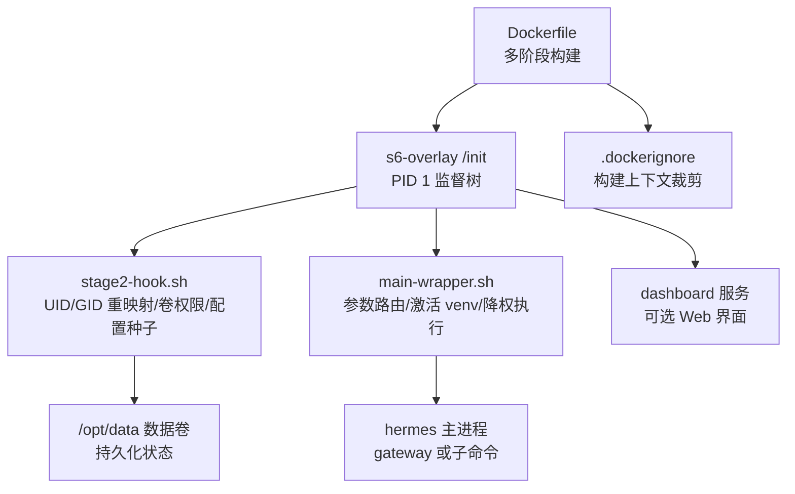
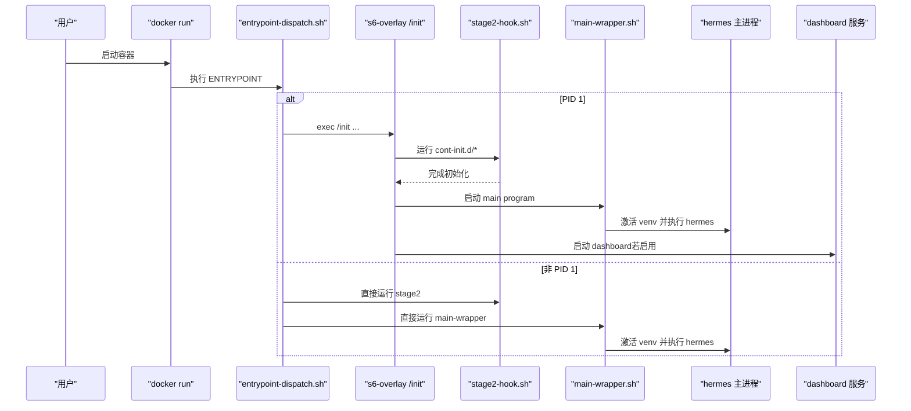
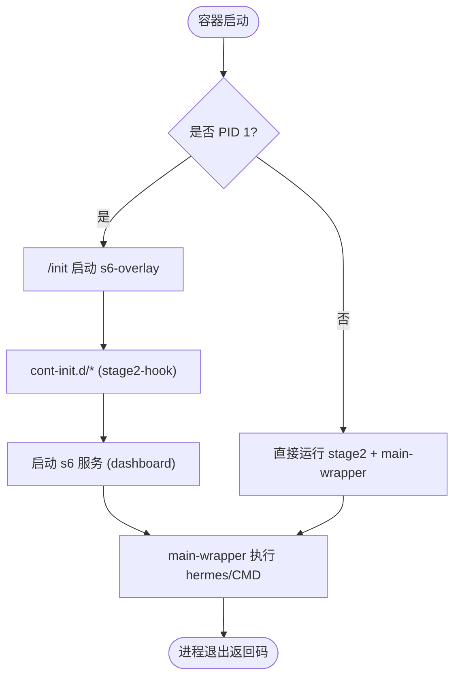
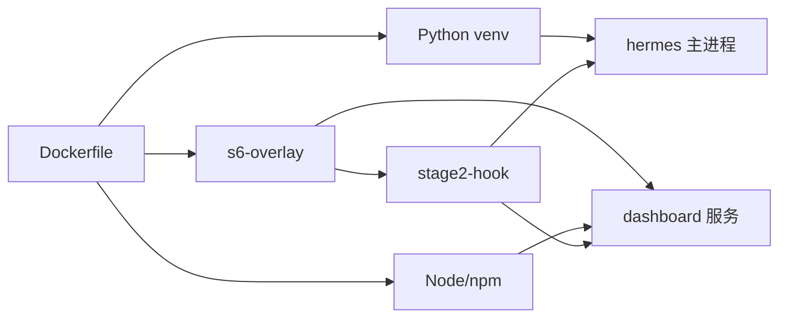

# Docker 容器执行环境

<cite>
**本文引用的文件**
- [Dockerfile](file://Dockerfile)
- [docker-compose.yml](file://docker-compose.yml)
- [docker-compose.windows.yml](file://docker-compose.windows.yml)
- [docker/entrypoint-dispatch.sh](file://docker/entrypoint-dispatch.sh)
- [docker/stage2-hook.sh](file://docker/stage2-hook.sh)
- [docker/main-wrapper.sh](file://docker/main-wrapper.sh)
- [docker/hermes-exec-shim.sh](file://docker/hermes-exec-shim.sh)
- [docker/s6-rc.d/main-hermes/run](file://docker/s6-rc.d/main-hermes/run)
- [docker/s6-rc.d/dashboard/run](file://docker/s6-rc.d/dashboard/run)
- [.dockerignore](file://.dockerignore)
</cite>

## 目录
1. [简介](#简介)
2. [项目结构](#项目结构)
3. [核心组件](#核心组件)
4. [架构总览](#架构总览)
5. [详细组件分析](#详细组件分析)
6. [依赖关系分析](#依赖关系分析)
7. [性能考虑](#性能考虑)
8. [故障排查指南](#故障排查指南)
9. [结论](#结论)
10. [附录](#附录)

## 简介
本文件面向开发者与运维人员，系统性说明 Hermes Agent 的 Docker 容器执行环境：镜像构建、容器生命周期管理、网络隔离、文件系统挂载、卷配置、环境变量注入、用户权限映射、资源限制策略，以及调试与性能调优实践。文档基于仓库中的 Dockerfile、Compose 文件与 s6-overlay 启动脚本，提供可操作的配置示例与排错建议。

## 项目结构
Hermes 的容器化由以下关键部分组成：
- 镜像构建层：多阶段构建（SQLite 修复、Node/uv 工具链、Python/前端依赖安装、源码拷贝、权限固化）
- 运行时入口：s6-overlay 作为 PID 1，负责进程监督与初始化；兼容非 PID 1 运行场景
- 数据卷：/opt/data 持久化所有运行时状态（会话、日志、配置、技能等）
- 服务编排：gateway 与 dashboard 两个服务，默认通过 host 网络暴露
- 安全与权限：以 hermes 用户运行，支持 UID/GID 重映射，禁止直接 --user 启动

图表来源
- [Dockerfile:52-457](file://Dockerfile#L52-L457)
- [docker/entrypoint-dispatch.sh:15-25](file://docker/entrypoint-dispatch.sh#L15-L25)
- [docker/stage2-hook.sh:18-592](file://docker/stage2-hook.sh#L18-L592)
- [docker/main-wrapper.sh:1-92](file://docker/main-wrapper.sh#L1-L92)
- [docker/s6-rc.d/dashboard/run:1-57](file://docker/s6-rc.d/dashboard/run#L1-L57)
- [.dockerignore:1-106](file://.dockerignore#L1-L106)

章节来源
- [Dockerfile:52-457](file://Dockerfile#L52-L457)
- [docker/entrypoint-dispatch.sh:15-25](file://docker/entrypoint-dispatch.sh#L15-L25)
- [docker/stage2-hook.sh:18-592](file://docker/stage2-hook.sh#L18-L592)
- [docker/main-wrapper.sh:1-92](file://docker/main-wrapper.sh#L1-L92)
- [docker/s6-rc.d/dashboard/run:1-57](file://docker/s6-rc.d/dashboard/run#L1-L57)
- [.dockerignore:1-106](file://.dockerignore#L1-L106)

## 核心组件
- 镜像构建与优化
  - 固定 SQLite 版本并启用 FTS5 trigram，避免上游 WAL-reset 缺陷
  - 使用 uv 与 Node 26 工具链，预装 Python/前端依赖，减少冷启动开销
  - 将只读代码与依赖置于 /opt/hermes，仅 /opt/data 可写
  - 通过 .dockerignore 裁剪构建上下文，提升缓存命中率
- 容器生命周期
  - 入口分派器在 PID 1 时调用 s6-overlay /init；否则回退到 stage2 + main-wrapper
  - stage2-hook 完成 UID/GID 重映射、数据卷权限修复、配置种子、浏览器二进制发现
  - main-wrapper 负责激活 venv、参数路由、降权执行 hermes 或任意可执行
- 网络与端口
  - Compose 默认使用 host 网络；Windows 版通过端口映射暴露 dashboard
  - Dashboard 默认绑定 127.0.0.1，生产需配合反向代理或 SSH 隧道
- 文件系统与卷
  - /opt/data 为唯一持久化卷，包含 sessions、logs、config.yaml、skills 等
  - 首次启动自动创建必要目录并设置权限，确保 hermes 用户可读写
- 环境变量与配置
  - HERMES_UID/HERMES_GID（或 PUID/PGID）用于宿主 UID/GID 对齐
  - API_SERVER_HOST/API_SERVER_KEY 控制 OpenAI 兼容 API 服务器
  - 各平台网关凭据通过环境变量注入（Teams、Google Chat 等）
- 权限与安全
  - 禁止使用 --user 指定任意 UID；应通过 HERMES_UID/HERMES_GID 实现宿主对齐
  - docker exec 默认 root 会被 hermes-exec-shim 自动降权至 hermes 用户
  - .env 与 auth.json 严格限制权限，防止密钥泄露

章节来源
- [Dockerfile:1-457](file://Dockerfile#L1-L457)
- [docker/entrypoint-dispatch.sh:15-25](file://docker/entrypoint-dispatch.sh#L15-L25)
- [docker/stage2-hook.sh:23-74](file://docker/stage2-hook.sh#L23-L74)
- [docker/main-wrapper.sh:20-59](file://docker/main-wrapper.sh#L20-L59)
- [docker/hermes-exec-shim.sh:1-88](file://docker/hermes-exec-shim.sh#L1-L88)
- [docker-compose.yml:13-27](file://docker-compose.yml#L13-L27)
- [docker-compose.windows.yml:24-39](file://docker-compose.windows.yml#L24-L39)

## 架构总览
下图展示容器启动的关键流程：入口分派 → s6-overlay 监督 → 初始化钩子 → 主程序执行与服务拉起。

图表来源
- [docker/entrypoint-dispatch.sh:15-25](file://docker/entrypoint-dispatch.sh#L15-L25)
- [docker/stage2-hook.sh:18-592](file://docker/stage2-hook.sh#L18-L592)
- [docker/main-wrapper.sh:1-92](file://docker/main-wrapper.sh#L1-L92)
- [docker/s6-rc.d/dashboard/run:1-57](file://docker/s6-rc.d/dashboard/run#L1-L57)

## 详细组件分析

### 镜像构建与优化
- 多阶段构建
  - sqlite_build：编译固定版本 SQLite，启用 FTS5 trigram，修复上游漏洞
  - uv_source/node_source：复用官方镜像的工具链，保证跨平台一致性
- 依赖预装
  - Python：通过 uv sync 安装生产所需 extras，排除开发/重型依赖
  - Node：安装 web/ui-tui 依赖并预构建产物，避免运行时 npm install
  - Playwright：预装 Chromium 浏览器，便于浏览器工具使用
- 只读代码与可写数据
  - /opt/hermes 只读，/opt/data 可写；lazy-packages 指向 /opt/data/lazy-packages
- 构建缓存优化
  - 先复制 manifest 再安装依赖，最大化利用层缓存
  - .dockerignore 排除 tests、docs、node_modules、venv 等无关内容

章节来源
- [Dockerfile:1-457](file://Dockerfile#L1-L457)
- [.dockerignore:1-106](file://.dockerignore#L1-L106)

### 容器生命周期控制
- 入口分派器
  - 检测是否 PID 1；是则交由 s6-overlay /init；否则回退到 stage2 + main-wrapper
- s6-overlay 监督
  - 运行 cont-init.d 初始化脚本（stage2-hook），随后启动声明的服务
  - main-hermes 服务当前为占位；dashboard 服务受控启停
- 主程序包装器
  - 解析 CMD 参数：无参执行 hermes；首参为可执行则直通；否则作为 hermes 子命令
  - 激活 venv、设置 HOME、降权执行

图表来源
- [docker/entrypoint-dispatch.sh:15-25](file://docker/entrypoint-dispatch.sh#L15-L25)
- [docker/stage2-hook.sh:18-592](file://docker/stage2-hook.sh#L18-L592)
- [docker/main-wrapper.sh:15-92](file://docker/main-wrapper.sh#L15-L92)
- [docker/s6-rc.d/dashboard/run:1-57](file://docker/s6-rc.d/dashboard/run#L1-L57)

章节来源
- [docker/entrypoint-dispatch.sh:15-25](file://docker/entrypoint-dispatch.sh#L15-L25)
- [docker/stage2-hook.sh:18-592](file://docker/stage2-hook.sh#L18-L592)
- [docker/main-wrapper.sh:15-92](file://docker/main-wrapper.sh#L15-L92)
- [docker/s6-rc.d/dashboard/run:1-57](file://docker/s6-rc.d/dashboard/run#L1-L57)

### 网络隔离与端口暴露
- Linux/Mac：默认 host 网络模式，gateway 与 dashboard 直接绑定宿主机网络栈
- Windows：不支持 host 网络，改用端口映射暴露 dashboard 到 127.0.0.1:9119
- 安全建议：Dashboard 默认仅本地访问；远程访问需通过 SSH 隧道或反向代理认证

章节来源
- [docker-compose.yml:30-61](file://docker-compose.yml#L30-L61)
- [docker-compose.windows.yml:13-39](file://docker-compose.windows.yml#L13-L39)

### 文件系统挂载与卷配置
- 数据卷：/opt/data 持久化所有运行时状态
- 典型挂载：~/.hermes:/opt/data（Linux/Mac），%USERPROFILE%\.hermes:/opt/data（Windows）
- 权限修复：stage2-hook 会为目标目录与文件设置正确所有者与权限，避免 root 写入导致后续读取失败
- 安全加固：.env 权限收紧为 600；auth.json 首次引导后不再覆盖

章节来源
- [docker-compose.yml:36-44](file://docker-compose.yml#L36-L44)
- [docker-compose.windows.yml:17-22](file://docker-compose.windows.yml#L17-L22)
- [docker/stage2-hook.sh:174-372](file://docker/stage2-hook.sh#L174-L372)

### 环境变量注入与配置
- 身份与权限
  - HERMES_UID/HERMES_GID（或 PUID/PGID）：将内部 hermes 用户重映射为宿主 UID/GID
- 网关与 API
  - API_SERVER_HOST/API_SERVER_KEY：开启 OpenAI 兼容 API 服务器（需鉴权）
  - Teams/Google Chat 等平台凭据通过环境变量注入
- Dashboard
  - HERMES_DASHBOARD：启用 dashboard 服务
  - HERMES_DASHBOARD_HOST/PORT：监听地址与端口
  - 认证：支持基本认证或 OAuth，不再接受 INSECURE 关闭鉴权
- 其他
  - PLAYWRIGHT_BROWSERS_PATH：浏览器二进制路径
  - AGENT_BROWSER_EXECUTABLE_PATH：手动指定浏览器可执行文件

章节来源
- [docker-compose.yml:38-61](file://docker-compose.yml#L38-L61)
- [docker/stage2-hook.sh:543-589](file://docker/stage2-hook.sh#L543-L589)
- [docker/s6-rc.d/dashboard/run:22-57](file://docker/s6-rc.d/dashboard/run#L22-L57)

### 用户权限映射与最小权限原则
- 禁止 --user 指定任意 UID；应通过 HERMES_UID/HERMES_GID 实现宿主对齐
- 默认以 hermes 用户运行；root 仅在初始化阶段使用
- docker exec 默认 root 会被 hermes-exec-shim 自动降权，避免 root 写入导致权限问题
- 数据卷与配置文件权限在启动时修复，确保 hermes 用户可读可写

章节来源
- [docker/stage2-hook.sh:23-74](file://docker/stage2-hook.sh#L23-L74)
- [docker/main-wrapper.sh:33-59](file://docker/main-wrapper.sh#L33-L59)
- [docker/hermes-exec-shim.sh:1-88](file://docker/hermes-exec-shim.sh#L1-L88)

### 资源限制设置
- 内存与 CPU：建议在编排层（Docker/Podman/Kubernetes）通过 --memory/--cpus 或 limits 进行限制
- I/O：合理划分卷与只读根文件系统，降低写放大
- 网络：根据部署环境选择 host 或桥接网络，必要时限制带宽

[本节为通用指导，不直接分析具体文件]

## 依赖关系分析
- 构建期依赖
  - Debian 基础镜像 + 固定 SQLite + Node 26 + uv + Python 3.13
  - 前端依赖：web、ui-tui、apps/shared（workspace 链接）
- 运行期依赖
  - s6-overlay：进程监督与初始化
  - Python venv：hermes 主程序与插件
  - Node：dashboard 与部分工具
- 外部集成
  - Docker socket：如需在容器内执行 docker 命令，需挂载宿主机 socket 并自动加入对应组
  - 平台网关：Teams、Google Chat 等通过环境变量注入凭据

图表来源
- [Dockerfile:52-457](file://Dockerfile#L52-L457)
- [docker/stage2-hook.sh:18-592](file://docker/stage2-hook.sh#L18-L592)
- [docker/s6-rc.d/dashboard/run:1-57](file://docker/s6-rc.d/dashboard/run#L1-L57)

章节来源
- [Dockerfile:52-457](file://Dockerfile#L52-L457)
- [docker/stage2-hook.sh:18-592](file://docker/stage2-hook.sh#L18-L592)
- [docker/s6-rc.d/dashboard/run:1-57](file://docker/s6-rc.d/dashboard/run#L1-L57)

## 性能考虑
- 构建缓存
  - 先复制 manifest 再安装依赖，充分利用层缓存
  - 使用 .dockerignore 排除无关文件，减小构建上下文
- 运行时优化
  - 预构建前端产物，避免运行时 npm install
  - 预装 Playwright 浏览器，减少首次启动延迟
  - 将 lazy-packages 指向可写卷，避免修改只读 venv
- 资源限制
  - 在编排层设置内存与 CPU 上限，防止单实例占用过多资源
  - 合理配置日志轮转与保留策略，避免磁盘增长过快

[本节为通用指导，不直接分析具体文件]

## 故障排查指南
- 启动失败：提示“container started with --user ...”
  - 原因：使用了 --user 指定任意 UID，绕过初始化流程
  - 解决：移除 --user，改用 HERMES_UID/HERMES_GID 或 PUID/PGID
- 权限错误：gateway 无法读取 auth.json 或 config.yaml
  - 原因：docker exec 以 root 写入导致文件属主为 root
  - 解决：使用 hermes-exec-shim 自动降权；或显式 --user hermes；重启容器以触发权限修复
- Dashboard 无法访问
  - 检查 HERMES_DASHBOARD 是否启用；确认绑定地址与端口；Windows 下确认端口映射
  - 远程访问需配置认证或使用 SSH 隧道
- 浏览器工具失败：“Chrome not found”
  - 检查 PLAYWRIGHT_BROWSERS_PATH 是否存在；stage2-hook 会自动设置 AGENT_BROWSER_EXECUTABLE_PATH
- Docker 后端不可用
  - 挂载 /var/run/docker.sock 后，stage2-hook 会自动将 hermes 加入对应组；如仍失败，检查组权限

章节来源
- [docker/stage2-hook.sh:23-74](file://docker/stage2-hook.sh#L23-L74)
- [docker/stage2-hook.sh:118-172](file://docker/stage2-hook.sh#L118-L172)
- [docker/stage2-hook.sh:543-589](file://docker/stage2-hook.sh#L543-L589)
- [docker/hermes-exec-shim.sh:1-88](file://docker/hermes-exec-shim.sh#L1-L88)
- [docker/s6-rc.d/dashboard/run:1-57](file://docker/s6-rc.d/dashboard/run#L1-L57)

## 结论
Hermes 的 Docker 执行环境通过多阶段构建、s6-overlay 监督、严格的权限模型与可插拔的环境变量配置，提供了安全、稳定且高性能的容器化运行方案。遵循推荐的启动方式与配置实践，可避免常见权限与网络问题，并在生产环境中获得良好的可观测性与可维护性。

[本节为总结，不直接分析具体文件]

## 附录

### 快速启动示例
- Linux/Mac
  - 设置 HERMES_UID/HERMES_GID 以匹配宿主用户
  - 挂载 ~/.hermes 到 /opt/data
  - 运行 gateway 与 dashboard
- Windows
  - 使用 docker-compose.windows.yml，通过端口映射暴露 dashboard
  - 挂载 %USERPROFILE%\.hermes 到 /opt/data

章节来源
- [docker-compose.yml:30-61](file://docker-compose.yml#L30-L61)
- [docker-compose.windows.yml:13-39](file://docker-compose.windows.yml#L13-L39)

### 常用环境变量参考
- HERMES_UID/HERMES_GID：宿主 UID/GID 对齐
- PUID/PGID：NAS 兼容别名
- API_SERVER_HOST/API_SERVER_KEY：OpenAI 兼容 API 服务器
- HERMES_DASHBOARD/HERMES_DASHBOARD_HOST/PORT：Dashboard 开关与监听
- TEAMS_* / GOOGLE_CHAT_*：平台网关凭据
- PLAYWRIGHT_BROWSERS_PATH / AGENT_BROWSER_EXECUTABLE_PATH：浏览器路径

章节来源
- [docker-compose.yml:38-61](file://docker-compose.yml#L38-L61)
- [docker/stage2-hook.sh:543-589](file://docker/stage2-hook.sh#L543-L589)
- [docker/s6-rc.d/dashboard/run:22-57](file://docker/s6-rc.d/dashboard/run#L22-L57)