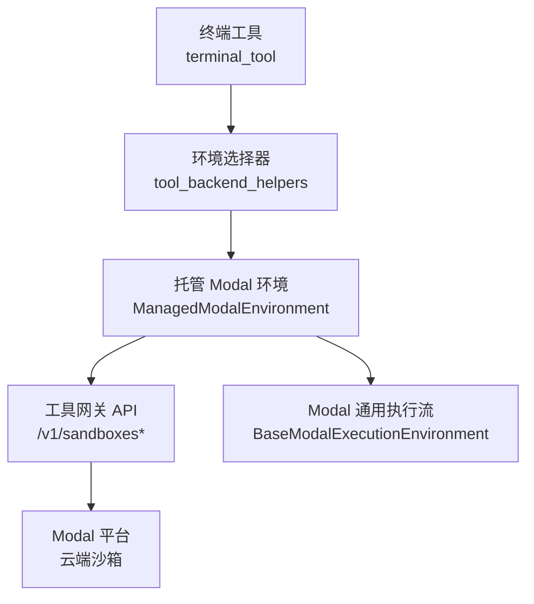
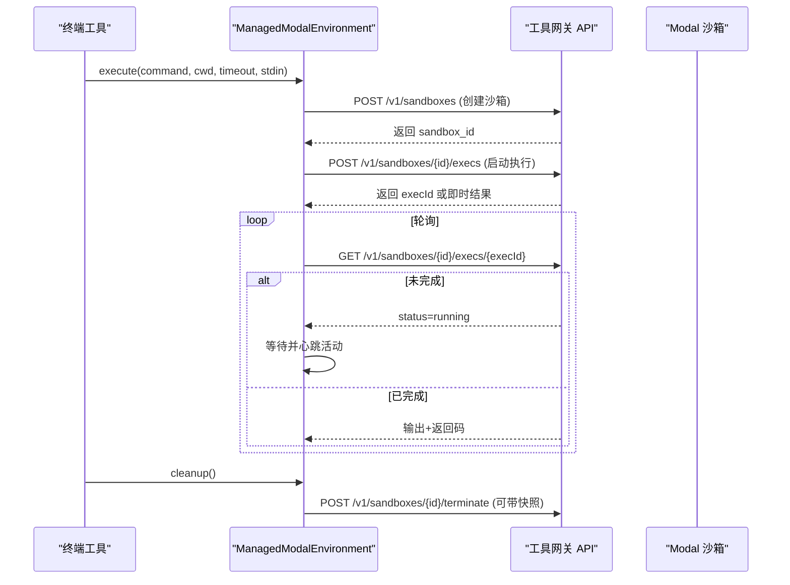
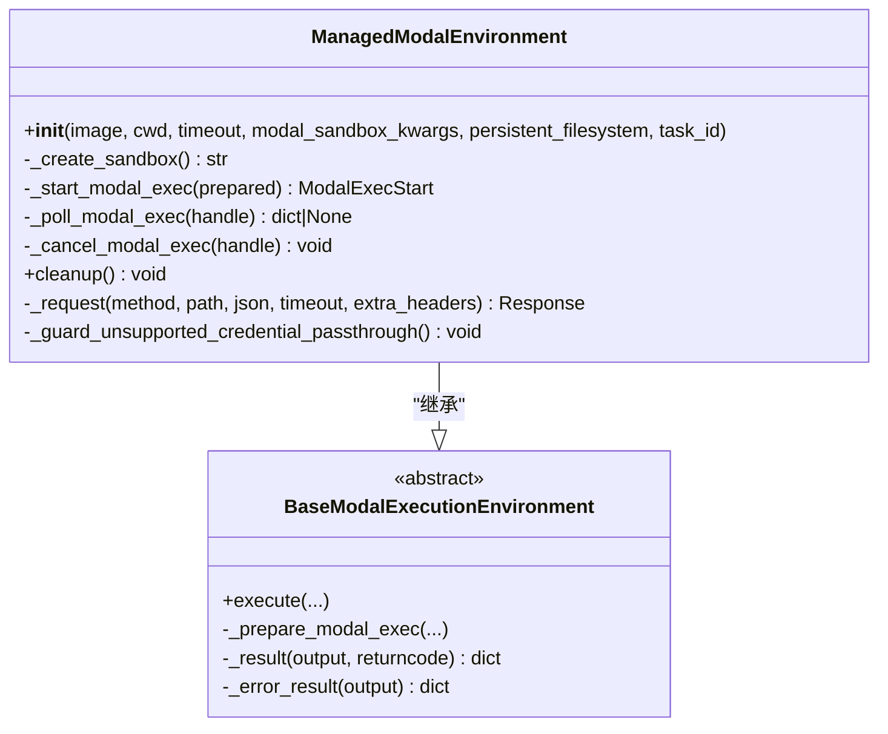
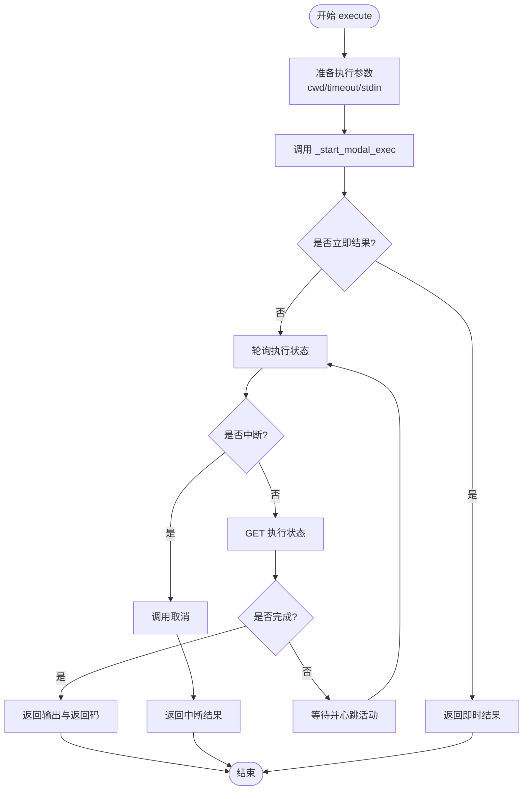
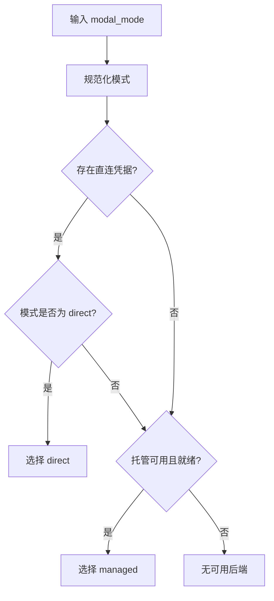
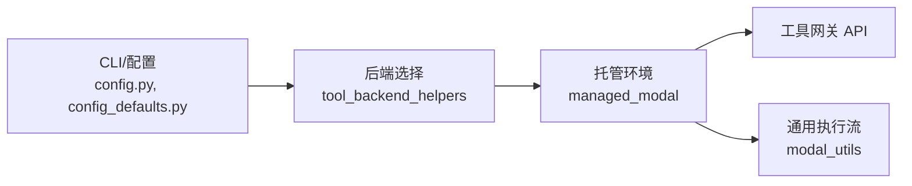

# Modal 云沙箱执行环境

<cite>
**本文引用的文件**
- [tools/environments/managed_modal.py](file://tools/environments/managed_modal.py)
- [tools/environments/modal_utils.py](file://tools/environments/modal_utils.py)
- [tools/tool_backend_helpers.py](file://tools/tool_backend_helpers.py)
- [hermes_cli/config.py](file://hermes_cli/config.py)
- [hermes_cli/config_defaults.py](file://hermes_cli/config_defaults.py)
- [hermes_cli/setup.py](file://hermes_cli/setup.py)
- [hermes_cli/nous_subscription.py](file://hermes_cli/nous_subscription.py)
- [agent/prompt_builder.py](file://agent/prompt_builder.py)
- [cli.py](file://cli.py)
- [tests/tools/test_terminal_error_redaction.py](file://tests/tools/test_terminal_error_redaction.py)
- [scripts/kill_modal.sh](file://scripts/kill_modal.sh)
</cite>

## 目录
1. [简介](#简介)
2. [项目结构](#项目结构)
3. [核心组件](#核心组件)
4. [架构总览](#架构总览)
5. [详细组件分析](#详细组件分析)
6. [依赖关系分析](#依赖关系分析)
7. [性能与成本优化](#性能与成本优化)
8. [故障排除指南](#故障排除指南)
9. [结论](#结论)
10. [附录：配置与环境变量](#附录配置与环境变量)

## 简介
本文件面向开发者，系统性说明 Hermes 中的“Modal 云沙箱执行环境”的实现原理与使用方式。内容涵盖两种运行模式：
- 托管模式（managed）：通过工具网关（Tool Gateway）创建并管理 Modal 沙箱，Hermes 侧仅负责命令编排、轮询结果与生命周期管理。
- 直连模式（direct）：本地直接调用 Modal SDK 执行命令（由其他模块实现），本仓库中托管模式为当前重点。

文档将解释认证配置、环境变量传递、文件持久化、网络访问控制、资源分配策略、状态管理与成本控制，并提供调试与排障指引。

## 项目结构
围绕 Modal 云沙箱的关键代码集中在以下位置：
- 托管 Modal 环境实现：tools/environments/managed_modal.py
- Modal 通用执行流程与数据模型：tools/environments/modal_utils.py
- 后端选择与凭据检测：tools/tool_backend_helpers.py
- 配置项与环境变量映射：hermes_cli/config.py、hermes_cli/config_defaults.py
- 引导与订阅能力判定：hermes_cli/setup.py、hermes_cli/nous_subscription.py
- 终端提示构建与默认镜像：agent/prompt_builder.py、cli.py
- 错误脱敏测试用例：tests/tools/test_terminal_error_redaction.py
- 辅助脚本：scripts/kill_modal.sh

图表来源
- [tools/environments/managed_modal.py:36-212](file://tools/environments/managed_modal.py#L36-L212)
- [tools/environments/modal_utils.py:58-211](file://tools/environments/modal_utils.py#L58-L211)
- [tools/tool_backend_helpers.py:80-141](file://tools/tool_backend_helpers.py#L80-L141)

章节来源
- [tools/environments/managed_modal.py:1-283](file://tools/environments/managed_modal.py#L1-L283)
- [tools/environments/modal_utils.py:1-211](file://tools/environments/modal_utils.py#L1-L211)
- [tools/tool_backend_helpers.py:1-312](file://tools/tool_backend_helpers.py#L1-L312)

## 核心组件
- ManagedModalEnvironment：托管 Modal 环境的实现类，负责创建/终止沙箱、发起执行、轮询结果、取消执行与清理。
- BaseModalExecutionEnvironment：提供统一的执行循环、超时处理、中断处理、stdin 注入与结果封装。
- tool_backend_helpers：解析 modal_mode（auto/direct/managed）、检测直连凭据、判断托管能力可用性。
- 配置与环境变量：modal_mode、modal_image 等通过 CLI 配置与环境变量注入到执行上下文。

章节来源
- [tools/environments/managed_modal.py:36-212](file://tools/environments/managed_modal.py#L36-L212)
- [tools/environments/modal_utils.py:58-211](file://tools/environments/modal_utils.py#L58-L211)
- [tools/tool_backend_helpers.py:80-141](file://tools/tool_backend_helpers.py#L80-L141)
- [hermes_cli/config.py:3185-3193](file://hermes_cli/config.py#L3185-L3193)
- [hermes_cli/config_defaults.py:281-350](file://hermes_cli/config_defaults.py#L281-L350)

## 架构总览
托管模式下，Hermes 不直接持有 Modal 客户端，而是通过工具网关的 REST API 管理沙箱。整体流程如下：
- 初始化：根据 modal_mode 与托管能力选择后端；若选择 managed，则向网关请求创建沙箱。
- 执行：将命令标准化后提交到沙箱执行，返回 execId；随后轮询执行状态直至完成或失败。
- 清理：会话结束时调用终止接口，可选择在终止前快照持久化文件系统。

图表来源
- [tools/environments/managed_modal.py:72-169](file://tools/environments/managed_modal.py#L72-L169)
- [tools/environments/modal_utils.py:75-156](file://tools/environments/modal_utils.py#L75-L156)

## 详细组件分析

### 托管 Modal 环境（ManagedModalEnvironment）
职责
- 创建/终止沙箱，设置 CPU、内存、磁盘、工作目录、空闲超时与逻辑键（logicalKey）。
- 启动执行：构造请求体（execId、command、cwd、timeoutMs、可选 stdinData），发送后根据响应决定立即返回或进入轮询。
- 轮询执行：按间隔查询执行状态，遇到完成/失败/取消/超时即返回统一结果结构。
- 取消执行：调用取消接口，异常时记录警告但不阻断主流程。
- 清理：调用终止接口，支持在终止前进行文件系统快照（persistentFilesystem）。

关键行为
- 连接与读取超时可通过环境变量调整。
- 不支持宿主凭据文件透传，若检测到挂载会抛出明确错误，建议切换到直连模式。
- 错误信息格式化统一，优先提取结构化错误字段，否则回退为文本或 HTTP 状态码。

图表来源
- [tools/environments/managed_modal.py:36-212](file://tools/environments/managed_modal.py#L36-L212)
- [tools/environments/modal_utils.py:58-211](file://tools/environments/modal_utils.py#L58-L211)

章节来源
- [tools/environments/managed_modal.py:36-212](file://tools/environments/managed_modal.py#L36-L212)

### Modal 通用执行流（BaseModalExecutionEnvironment）
职责
- 标准化命令与参数：合并 cwd、timeout，处理 stdin 注入（payload 或 heredoc），必要时包装 sudo 管道。
- 执行循环：启动执行后，周期性轮询直到完成；支持中断信号触发取消；支持客户端超时保护。
- 统一结果：成功返回 output 与 returncode；失败返回错误消息；超时返回特定退出码。

图表来源
- [tools/environments/modal_utils.py:75-156](file://tools/environments/modal_utils.py#L75-L156)

章节来源
- [tools/environments/modal_utils.py:75-156](file://tools/environments/modal_utils.py#L75-L156)

### 后端选择与凭据检测（tool_backend_helpers）
职责
- 规范化 modal_mode：支持 auto/direct/managed，默认 auto。
- 检测直连凭据：检查 MODAL_TOKEN_* 或 ~/.modal.toml。
- 选择后端：auto 优先托管（具备能力且就绪），否则回退直连；direct/managed 强制对应路径。
- 托管能力判定：通过 Nous Portal 账户信息判断是否可用。

图表来源
- [tools/tool_backend_helpers.py:80-141](file://tools/tool_backend_helpers.py#L80-L141)

章节来源
- [tools/tool_backend_helpers.py:80-141](file://tools/tool_backend_helpers.py#L80-L141)

### 配置与环境变量
- modal_mode：通过配置文件或环境变量 TERMINAL_MODAL_MODE 指定，默认 auto。
- modal_image：通过配置文件或环境变量 TERMINAL_MODAL_IMAGE 指定，默认镜像用于托管沙箱。
- 超时与轮询：托管模式支持通过环境变量调整连接、轮询与取消读取超时。
- 权限与凭据：托管模式禁止宿主凭据文件透传；直连模式需要本地 Modal 凭据。

章节来源
- [hermes_cli/config.py:3185-3193](file://hermes_cli/config.py#L3185-L3193)
- [hermes_cli/config_defaults.py:281-350](file://hermes_cli/config_defaults.py#L281-L350)
- [tools/environments/managed_modal.py:23-44](file://tools/environments/managed_modal.py#L23-L44)

## 依赖关系分析
- ManagedModalEnvironment 依赖工具网关的 REST API，使用用户令牌鉴权。
- BaseModalExecutionEnvironment 提供跨后端的统一执行语义，屏蔽差异。
- tool_backend_helpers 作为决策层，依据环境与能力选择具体后端。
- CLI 与配置模块提供运行时参数与环境变量注入。

图表来源
- [hermes_cli/config.py:3185-3193](file://hermes_cli/config.py#L3185-L3193)
- [tools/tool_backend_helpers.py:80-141](file://tools/tool_backend_helpers.py#L80-L141)
- [tools/environments/managed_modal.py:36-212](file://tools/environments/managed_modal.py#L36-L212)
- [tools/environments/modal_utils.py:58-211](file://tools/environments/modal_utils.py#L58-L211)

章节来源
- [hermes_cli/config.py:3185-3193](file://hermes_cli/config.py#L3185-L3193)
- [tools/tool_backend_helpers.py:80-141](file://tools/tool_backend_helpers.py#L80-L141)
- [tools/environments/managed_modal.py:36-212](file://tools/environments/managed_modal.py#L36-L212)
- [tools/environments/modal_utils.py:58-211](file://tools/environments/modal_utils.py#L58-L211)

## 性能与成本优化
- 资源配额
  - CPU/内存：通过 modal_sandbox_kwargs 传入 cpu/memoryMiB，避免过度分配。
  - 磁盘：按需设置 ephemeral_disk/diskMiB，减少不必要 I/O。
  - 空闲超时：idleTimeoutMs 与 timeoutMs 合理设置，缩短闲置时间。
- 执行效率
  - 复用逻辑键 logicalKey 关联任务，便于网关侧复用或隔离。
  - 使用 stdin payload 或 heredoc 减少额外传输开销。
  - 轮询间隔与客户端超时保护平衡延迟与负载。
- 成本控制
  - 优先托管模式：利用平台计费与调度优化。
  - 限制并发与超时：避免长时间占用资源。
  - 关闭不必要的持久化：仅在需要时启用 snapshotBeforeTerminate。

章节来源
- [tools/environments/managed_modal.py:172-212](file://tools/environments/managed_modal.py#L172-L212)
- [tools/environments/modal_utils.py:75-156](file://tools/environments/modal_utils.py#L75-L156)

## 故障排除指南
常见问题与定位步骤
- 托管不可用
  - 现象：自动模式无法选择托管后端。
  - 排查：确认 Nous Portal 登录与工具网关授权；检查 has_direct_modal_credentials 与托管能力判定。
- 直连凭据缺失
  - 现象：直连模式报错或无法导入 Modal。
  - 排查：检查 MODAL_TOKEN_ID/MODAL_TOKEN_SECRET 或 ~/.modal.toml。
- 宿主凭据透传被拒
  - 现象：托管模式初始化时报错提示不支持凭据文件挂载。
  - 解决：切换至直连模式或在沙箱内配置凭据。
- 执行超时/中断
  - 现象：长时间无输出或进程卡住。
  - 排查：调整超时与轮询间隔；检查中断信号与取消接口；查看网关返回的错误信息。
- 错误信息脱敏
  - 现象：错误输出包含敏感信息。
  - 验证：参考测试用例确保错误与回溯已脱敏。

实用脚本
- scripts/kill_modal.sh：可用于快速终止残留的 Modal 相关进程或会话。

章节来源
- [tools/tool_backend_helpers.py:93-102](file://tools/tool_backend_helpers.py#L93-L102)
- [tools/environments/managed_modal.py:214-227](file://tools/environments/managed_modal.py#L214-L227)
- [tests/tools/test_terminal_error_redaction.py:102-154](file://tests/tools/test_terminal_error_redaction.py#L102-L154)
- [scripts/kill_modal.sh](file://scripts/kill_modal.sh)

## 结论
Hermes 的 Modal 云沙箱执行环境通过托管模式将沙箱生命周期与执行细节交由工具网关管理，Hermes 侧专注于命令编排、状态轮询与资源清理。配合合理的资源配置、超时策略与凭据管理，可在保证安全隔离的同时获得良好的性能与成本效益。对于需要宿主凭据的场景，应评估直连模式的适用性。

## 附录：配置与环境变量
- terminal.modal_mode
  - 作用：选择 Modal 执行模式（auto/direct/managed）。
  - 来源：配置文件或环境变量 TERMINAL_MODAL_MODE。
- terminal.modal_image
  - 作用：托管沙箱使用的镜像。
  - 来源：配置文件或环境变量 TERMINAL_MODAL_IMAGE。
- 托管模式超时
  - TERMINAL_MANAGED_MODAL_CONNECT_TIMEOUT_SECONDS：连接超时。
  - TERMINAL_MANAGED_MODAL_POLL_READ_TIMEOUT_SECONDS：轮询读取超时。
  - TERMINAL_MANAGED_MODAL_CANCEL_READ_TIMEOUT_SECONDS：取消读取超时。
- 凭据与授权
  - 直连模式：MODAL_TOKEN_ID、MODAL_TOKEN_SECRET 或 ~/.modal.toml。
  - 托管模式：需通过 Nous Portal 授权工具网关。

章节来源
- [hermes_cli/config.py:3185-3193](file://hermes_cli/config.py#L3185-L3193)
- [hermes_cli/config_defaults.py:281-350](file://hermes_cli/config_defaults.py#L281-L350)
- [tools/environments/managed_modal.py:23-44](file://tools/environments/managed_modal.py#L23-L44)
- [tools/tool_backend_helpers.py:93-102](file://tools/tool_backend_helpers.py#L93-L102)
- [hermes_cli/setup.py:1439-1480](file://hermes_cli/setup.py#L1439-L1480)
- [hermes_cli/nous_subscription.py:410-632](file://hermes_cli/nous_subscription.py#L410-L632)
- [agent/prompt_builder.py:1075-1098](file://agent/prompt_builder.py#L1075-L1098)
- [cli.py:455-669](file://cli.py#L455-L669)