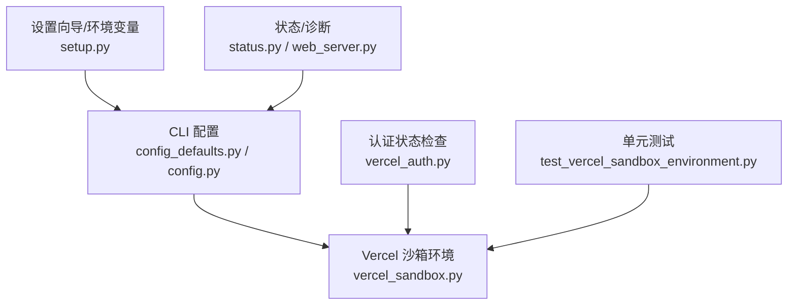
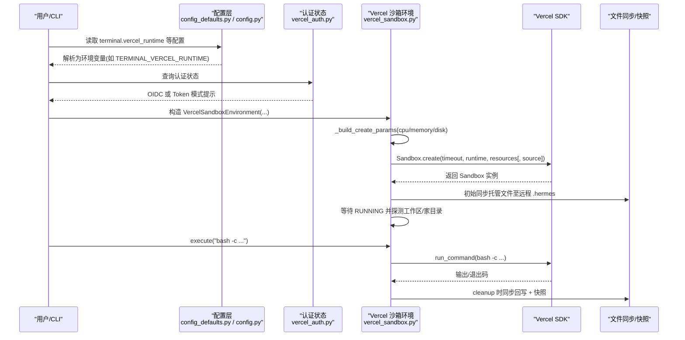
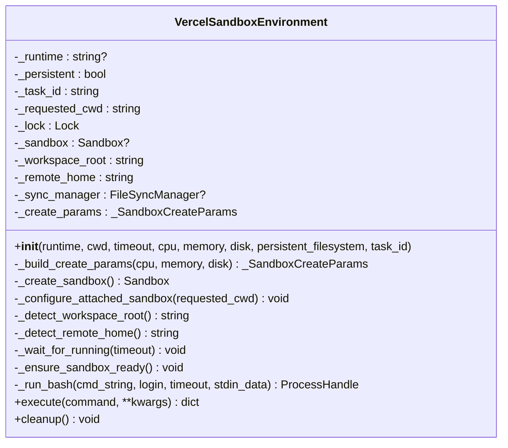
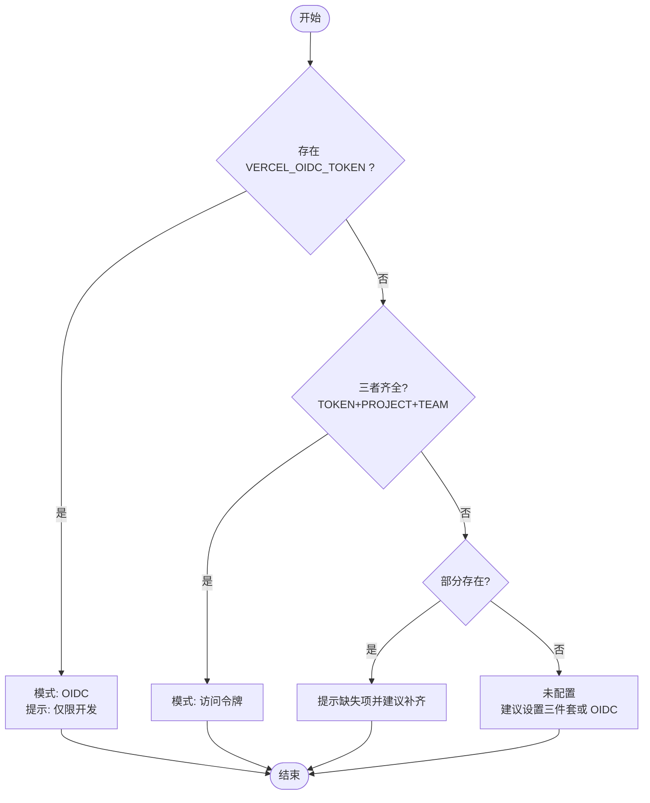
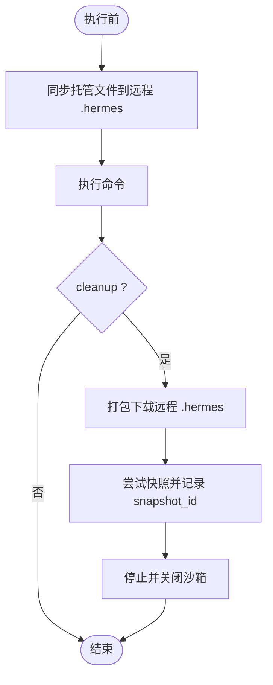
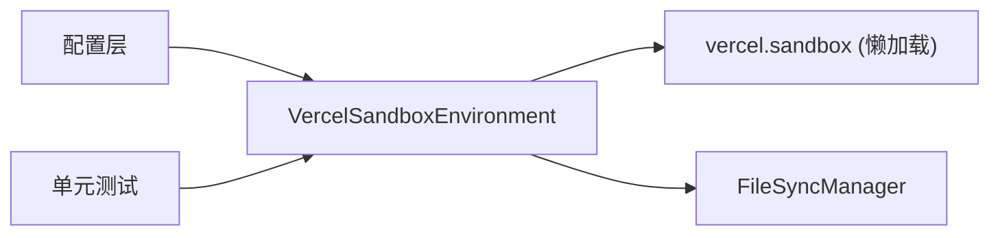

# Vercel Sandbox 执行环境

<cite>
**本文引用的文件**
- [tools/environments/vercel_sandbox.py](file://tools/environments/vercel_sandbox.py)
- [hermes_cli/vercel_auth.py](file://hermes_cli/vercel_auth.py)
- [hermes_cli/config_defaults.py](file://hermes_cli/config_defaults.py)
- [hermes_cli/config.py](file://hermes_cli/config.py)
- [hermes_cli/setup.py](file://hermes_cli/setup.py)
- [hermes_cli/status.py](file://hermes_cli/status.py)
- [hermes_cli/web_server.py](file://hermes_cli/web_server.py)
- [tests/tools/test_vercel_sandbox_environment.py](file://tests/tools/test_vercel_sandbox_environment.py)
</cite>

## 目录
1. [简介](#简介)
2. [项目结构](#项目结构)
3. [核心组件](#核心组件)
4. [架构总览](#架构总览)
5. [详细组件分析](#详细组件分析)
6. [依赖关系分析](#依赖关系分析)
7. [性能与限制](#性能与限制)
8. [故障排查指南](#故障排查指南)
9. [结论](#结论)
10. [附录：配置与使用示例](#附录：配置与使用示例)

## 简介
本文件面向开发者，系统性说明 Hermes 中 Vercel 云沙箱执行环境的实现原理与使用方式。内容涵盖运行时选择、项目配置、认证机制（OIDC 与 Token）、存储管理（快照与文件同步）、网络代理注意事项、常见限制与优化策略，以及集成调试方法。目标是帮助你在本地或 CI 环境中稳定、安全地使用 Vercel 沙箱运行命令与任务。

## 项目结构
Vercel 沙箱在 Hermes 中以“终端后端”的形式接入统一的环境抽象，并通过 CLI 配置与环境变量进行控制。关键位置如下：
- 运行时与资源参数构建：tools/environments/vercel_sandbox.py
- 认证状态检测：hermes_cli/vercel_auth.py
- 默认配置项与映射：hermes_cli/config_defaults.py、hermes_cli/config.py
- 设置向导与持久化：hermes_cli/setup.py
- 状态与诊断输出：hermes_cli/status.py、hermes_cli/web_server.py
- 行为验证与回归用例：tests/tools/test_vercel_sandbox_environment.py

图表来源
- [hermes_cli/config_defaults.py:350-359](file://hermes_cli/config_defaults.py#L350-L359)
- [hermes_cli/config.py:3195-3196](file://hermes_cli/config.py#L3195-L3196)
- [hermes_cli/vercel_auth.py:23-70](file://hermes_cli/vercel_auth.py#L23-L70)
- [tools/environments/vercel_sandbox.py:243-304](file://tools/environments/vercel_sandbox.py#L243-L304)
- [hermes_cli/setup.py:778-818](file://hermes_cli/setup.py#L778-L818)
- [hermes_cli/status.py:465-466](file://hermes_cli/status.py#L465-L466)
- [hermes_cli/web_server.py:885-886](file://hermes_cli/web_server.py#L885-L886)
- [tests/tools/test_vercel_sandbox_environment.py:237-257](file://tests/tools/test_vercel_sandbox_environment.py#L237-L257)

章节来源
- [hermes_cli/config_defaults.py:350-359](file://hermes_cli/config_defaults.py#L350-L359)
- [hermes_cli/config.py:3195-3196](file://hermes_cli/config.py#L3195-L3196)
- [hermes_cli/vercel_auth.py:23-70](file://hermes_cli/vercel_auth.py#L23-L70)
- [tools/environments/vercel_sandbox.py:243-304](file://tools/environments/vercel_sandbox.py#L243-L304)
- [hermes_cli/setup.py:778-818](file://hermes_cli/setup.py#L778-L818)
- [hermes_cli/status.py:465-466](file://hermes_cli/status.py#L465-L466)
- [hermes_cli/web_server.py:885-886](file://hermes_cli/web_server.py#L885-L886)
- [tests/tools/test_vercel_sandbox_environment.py:237-257](file://tests/tools/test_vercel_sandbox_environment.py#L237-L257)

## 核心组件
- VercelSandboxEnvironment：封装 Vercel SDK，提供统一的 execute/run_bash/cleanup 接口；负责创建/恢复沙箱、等待运行态、文件同步、快照持久化与清理。
- 认证状态描述器：根据环境变量判断当前是否启用 OIDC 或访问令牌模式，并给出提示。
- 配置与默认值：定义 vercel_runtime、容器资源限制、持久化开关等，并将配置映射到环境变量（如 TERMINAL_VERCEL_RUNTIME）。
- 设置向导：交互式引导用户选择运行时、资源配额与认证方式，并写入环境与配置。
- 状态与 Web 选项：暴露支持的运行时列表与诊断信息，便于前端或 CLI 展示。

章节来源
- [tools/environments/vercel_sandbox.py:243-304](file://tools/environments/vercel_sandbox.py#L243-L304)
- [hermes_cli/vercel_auth.py:23-70](file://hermes_cli/vercel_auth.py#L23-L70)
- [hermes_cli/config_defaults.py:350-359](file://hermes_cli/config_defaults.py#L350-L359)
- [hermes_cli/setup.py:778-818](file://hermes_cli/setup.py#L778-L818)
- [hermes_cli/status.py:465-466](file://hermes_cli/status.py#L465-L466)
- [hermes_cli/web_server.py:885-886](file://hermes_cli/web_server.py#L885-L886)

## 架构总览
下图展示了从 CLI 配置到 Vercel 沙箱执行的端到端流程，包括认证、运行时选择、资源构建、沙箱创建/恢复、文件同步与执行。

图表来源
- [hermes_cli/config_defaults.py:350-359](file://hermes_cli/config_defaults.py#L350-L359)
- [hermes_cli/config.py:3195-3196](file://hermes_cli/config.py#L3195-L3196)
- [hermes_cli/vercel_auth.py:23-70](file://hermes_cli/vercel_auth.py#L23-L70)
- [tools/environments/vercel_sandbox.py:278-342](file://tools/environments/vercel_sandbox.py#L278-L342)
- [tools/environments/vercel_sandbox.py:344-397](file://tools/environments/vercel_sandbox.py#L344-L397)
- [tools/environments/vercel_sandbox.py:591-637](file://tools/environments/vercel_sandbox.py#L591-L637)
- [tools/environments/vercel_sandbox.py:639-663](file://tools/environments/vercel_sandbox.py#L639-L663)

## 详细组件分析

### VercelSandboxEnvironment 类
- 职责
  - 构建创建参数：将 CPU、内存、磁盘映射为 SDK Resources，并计算最小超时。
  - 创建/恢复沙箱：优先尝试从快照恢复，失败则新建；支持重试与瞬态错误处理。
  - 运行期管理：等待 RUNNING、探测工作区与家目录、通过 FileSyncManager 同步托管文件。
  - 执行命令：以 bash 形式在沙箱内执行，支持登录 shell 与工作区上下文。
  - 清理与快照：cleanup 时先同步回写，再尝试快照保存并停止沙箱，避免资源泄漏。
- 关键约束
  - 不支持自定义 container_disk（仅允许默认共享设置），否则抛出异常。
  - 默认工作目录为 /vercel/sandbox；tilde 会解析为远程家目录。
  - 快照仅在 persistent_filesystem=True 且存在 task_id 时生效。

图表来源
- [tools/environments/vercel_sandbox.py:236-304](file://tools/environments/vercel_sandbox.py#L236-L304)
- [tools/environments/vercel_sandbox.py:306-397](file://tools/environments/vercel_sandbox.py#L306-L397)
- [tools/environments/vercel_sandbox.py:477-512](file://tools/environments/vercel_sandbox.py#L477-L512)
- [tools/environments/vercel_sandbox.py:591-637](file://tools/environments/vercel_sandbox.py#L591-L637)
- [tools/environments/vercel_sandbox.py:639-663](file://tools/environments/vercel_sandbox.py#L639-L663)

章节来源
- [tools/environments/vercel_sandbox.py:236-304](file://tools/environments/vercel_sandbox.py#L236-L304)
- [tools/environments/vercel_sandbox.py:306-397](file://tools/environments/vercel_sandbox.py#L306-L397)
- [tools/environments/vercel_sandbox.py:477-512](file://tools/environments/vercel_sandbox.py#L477-L512)
- [tools/environments/vercel_sandbox.py:591-637](file://tools/environments/vercel_sandbox.py#L591-L637)
- [tools/environments/vercel_sandbox.py:639-663](file://tools/environments/vercel_sandbox.py#L639-L663)

### 认证机制（OIDC 与 Token）
- 支持两种模式：
  - OIDC：设置 VERCEL_OIDC_TOKEN（开发用途）。
  - 访问令牌：同时设置 VERCEL_TOKEN、VERCEL_PROJECT_ID、VERCEL_TEAM_ID。
- 若只设置了部分令牌变量，会提示缺失项；未设置任何变量则提示推荐配置。
- 该模块不暴露敏感值，仅用于诊断与提示。

图表来源
- [hermes_cli/vercel_auth.py:23-70](file://hermes_cli/vercel_auth.py#L23-L70)

章节来源
- [hermes_cli/vercel_auth.py:23-70](file://hermes_cli/vercel_auth.py#L23-L70)

### 运行时选择与配置
- 支持的运行时：node24、node22、python3.13。
- 配置项：terminal.vercel_runtime，默认 node24。
- 环境变量：TERMINAL_VERCEL_RUNTIME，优先级高于配置文件。
- 设置向导：可交互选择运行时并写入环境与配置。
- 状态与 Web：对外暴露可选的运行时列表，供 UI/CLI 展示。

章节来源
- [hermes_cli/config_defaults.py:350-359](file://hermes_cli/config_defaults.py#L350-L359)
- [hermes_cli/config.py:3195-3196](file://hermes_cli/config.py#L3195-L3196)
- [hermes_cli/setup.py:778-818](file://hermes_cli/setup.py#L778-L818)
- [hermes_cli/status.py:465-466](file://hermes_cli/status.py#L465-L466)
- [hermes_cli/web_server.py:885-886](file://hermes_cli/web_server.py#L885-L886)

### 存储管理与文件同步
- 工作目录与家目录：默认工作目录为 /vercel/sandbox；tilde 解析为远程家目录。
- 托管文件同步：通过 FileSyncManager 将本地托管文件上传到远程 ~/.hermes 下，并在每次执行前增量同步。
- 批量下载：cleanup 时将远程 .hermes 打包下载回写（受限于权限与映射）。
- 快照持久化：cleanup 时尝试对沙箱文件系统做快照，并以 task_id 为键保存在本地 JSON 文件中；下次创建时可按快照恢复。
- 限制：不支持自定义 container_disk；仅接受默认共享设置。

图表来源
- [tools/environments/vercel_sandbox.py:344-397](file://tools/environments/vercel_sandbox.py#L344-L397)
- [tools/environments/vercel_sandbox.py:513-590](file://tools/environments/vercel_sandbox.py#L513-L590)
- [tools/environments/vercel_sandbox.py:639-663](file://tools/environments/vercel_sandbox.py#L639-L663)

章节来源
- [tools/environments/vercel_sandbox.py:344-397](file://tools/environments/vercel_sandbox.py#L344-L397)
- [tools/environments/vercel_sandbox.py:513-590](file://tools/environments/vercel_sandbox.py#L513-L590)
- [tools/environments/vercel_sandbox.py:639-663](file://tools/environments/vercel_sandbox.py#L639-L663)

### 网络代理注意事项
- 沙箱内部的网络访问由 Vercel 平台决定；Hermes 侧并未在此后端注入代理。
- 若需通过代理访问外部服务，请在沙箱内显式设置 HTTP_PROXY/HTTPS_PROXY/ALL_PROXY 或使用平台提供的网络能力。
- 注意 NO_PROXY/no_proxy 对目标主机的排除规则。

章节来源
- [agent/process_bootstrap.py:115-153](file://agent/process_bootstrap.py#L115-L153)
- [agent/proxy_sources/iron_proxy.py:1208-1258](file://agent/proxy_sources/iron_proxy.py#L1208-L1258)

## 依赖关系分析
- 运行时依赖：
  - 懒加载 vercel SDK（>=0.7），首次使用时按需安装并禁用遥测。
  - 文件同步依赖 FileSyncManager 与托管文件清单。
- 配置依赖：
  - terminal.vercel_runtime 映射到 TERMINAL_VERCEL_RUNTIME。
  - 容器资源（CPU/内存/磁盘）影响 Resources 构建。
- 测试依赖：
  - 通过 sys.modules 注入 fake SDK，确保在无真实 SDK 环境下也能运行单测。

图表来源
- [tools/environments/vercel_sandbox.py:47-64](file://tools/environments/vercel_sandbox.py#L47-L64)
- [tests/tools/test_vercel_sandbox_environment.py:199-234](file://tests/tools/test_vercel_sandbox_environment.py#L199-L234)

章节来源
- [tools/environments/vercel_sandbox.py:47-64](file://tools/environments/vercel_sandbox.py#L47-L64)
- [tests/tools/test_vercel_sandbox_environment.py:199-234](file://tests/tools/test_vercel_sandbox_environment.py#L199-L234)

## 性能与限制
- 超时与重试
  - 最小沙箱超时为 5 分钟；创建/写入操作具备指数退避重试，针对 408/425/429/500/502/503/504 等瞬态错误。
  - 等待 RUNNING 状态有最大超时与轮询间隔，避免长时间阻塞。
- 资源限制
  - 不支持自定义 container_disk，仅能使用默认共享设置。
  - CPU/内存可通过 Resources 传入，但需为正数才生效。
- 文件同步开销
  - 每次执行前会同步托管文件；大量小文件可能带来额外开销，建议合并或减少变更频率。
- 快照成本
  - 快照发生在 cleanup 阶段；频繁创建/销毁任务会增加快照与网络传输成本。

章节来源
- [tools/environments/vercel_sandbox.py:66-76](file://tools/environments/vercel_sandbox.py#L66-L76)
- [tools/environments/vercel_sandbox.py:114-135](file://tools/environments/vercel_sandbox.py#L114-L135)
- [tools/environments/vercel_sandbox.py:278-304](file://tools/environments/vercel_sandbox.py#L278-L304)
- [tools/environments/vercel_sandbox.py:398-422](file://tools/environments/vercel_sandbox.py#L398-L422)
- [tools/environments/vercel_sandbox.py:639-663](file://tools/environments/vercel_sandbox.py#L639-L663)

## 故障排查指南
- 认证问题
  - 使用 describe_vercel_auth 查看当前认证模式与缺失项；确保 OIDC 或三件套完整。
- 沙箱无法启动
  - 检查是否处于终态（STOPPED/FAILED/ABORTED），必要时重建沙箱。
  - 关注等待 RUNNING 的超时与最后状态日志。
- 文件同步失败
  - 检查托管文件路径与权限；确认远程 .hermes 可写。
  - 批量下载失败不会阻断快照与停止流程。
- 快照失败
  - 快照失败会记录警告但不中断清理；下次创建将回退到全新沙箱。
- 诊断与状态
  - 使用 status 与 web_server 暴露的运行时选项核对配置。
  - 通过 doctor 检查当前运行的运行时版本是否在支持列表中。

章节来源
- [hermes_cli/vercel_auth.py:23-70](file://hermes_cli/vercel_auth.py#L23-L70)
- [tools/environments/vercel_sandbox.py:398-422](file://tools/environments/vercel_sandbox.py#L398-L422)
- [tools/environments/vercel_sandbox.py:554-590](file://tools/environments/vercel_sandbox.py#L554-L590)
- [tools/environments/vercel_sandbox.py:639-663](file://tools/environments/vercel_sandbox.py#L639-L663)
- [hermes_cli/status.py:465-466](file://hermes_cli/status.py#L465-L466)
- [hermes_cli/web_server.py:885-886](file://hermes_cli/web_server.py#L885-L886)

## 结论
Vercel 沙箱在 Hermes 中以标准化后端形式提供云端执行能力，具备稳定的生命周期管理、文件同步与快照持久化。通过 CLI 配置与环境变量，开发者可以灵活选择运行时、资源与认证方式。结合重试、超时与诊断工具，可在复杂网络与不稳定条件下保持高可用。生产部署建议使用访问令牌模式，并结合合理的资源与快照策略以获得最佳性能与稳定性。

## 附录：配置与使用示例
- 设置运行时
  - 通过 CLI 设置 terminal.vercel_runtime 为 node24/node22/python3.13，或直接设置环境变量 TERMINAL_VERCEL_RUNTIME。
- 认证
  - 开发环境：设置 VERCEL_OIDC_TOKEN。
  - 生产环境：同时设置 VERCEL_TOKEN、VERCEL_PROJECT_ID、VERCEL_TEAM_ID。
- 资源与持久化
  - 调整 container_cpu/container_memory 控制资源；container_persistent 控制是否保留文件系统（配合快照）。
- 执行命令
  - 通过终端工具调用 execute，将在 Vercel 沙箱内以 bash 执行；工作目录默认为 /vercel/sandbox，tilde 解析为远程家目录。
- 调试
  - 使用 status/web_server 查看支持的运行时与当前配置；使用 doctor 校验运行时有效性。
  - 观察日志中的重试、快照与同步信息，定位网络或权限问题。

章节来源
- [hermes_cli/config_defaults.py:350-359](file://hermes_cli/config_defaults.py#L350-L359)
- [hermes_cli/config.py:3195-3196](file://hermes_cli/config.py#L3195-L3196)
- [hermes_cli/setup.py:778-818](file://hermes_cli/setup.py#L778-L818)
- [hermes_cli/status.py:465-466](file://hermes_cli/status.py#L465-L466)
- [hermes_cli/web_server.py:885-886](file://hermes_cli/web_server.py#L885-L886)
- [tests/tools/test_vercel_sandbox_environment.py:237-257](file://tests/tools/test_vercel_sandbox_environment.py#L237-L257)