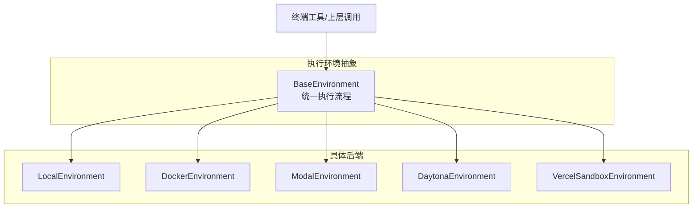
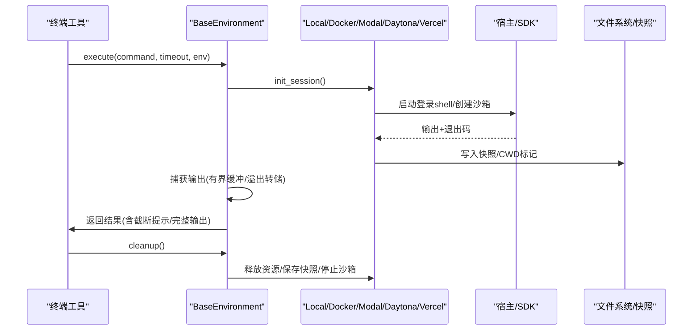
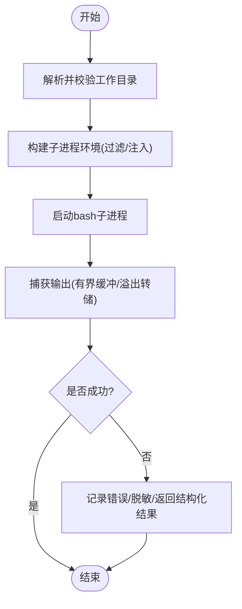
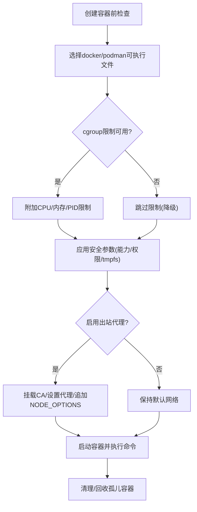
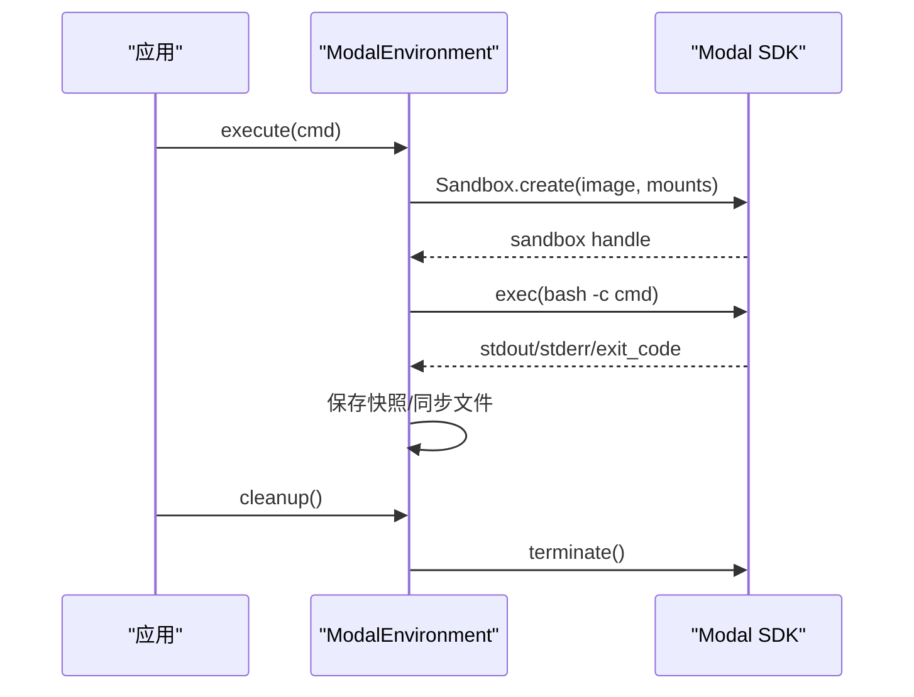
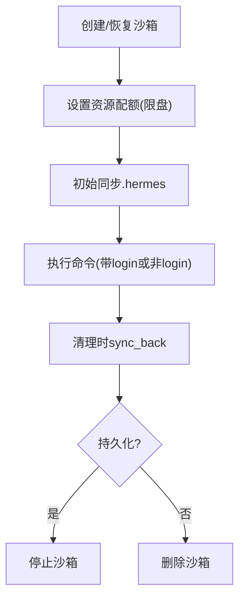
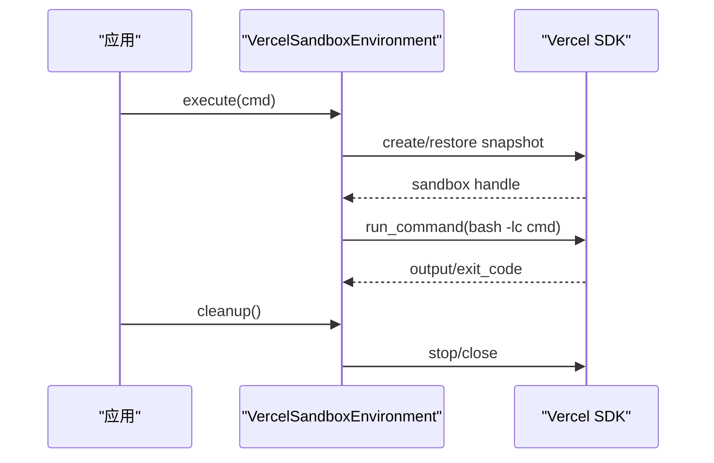
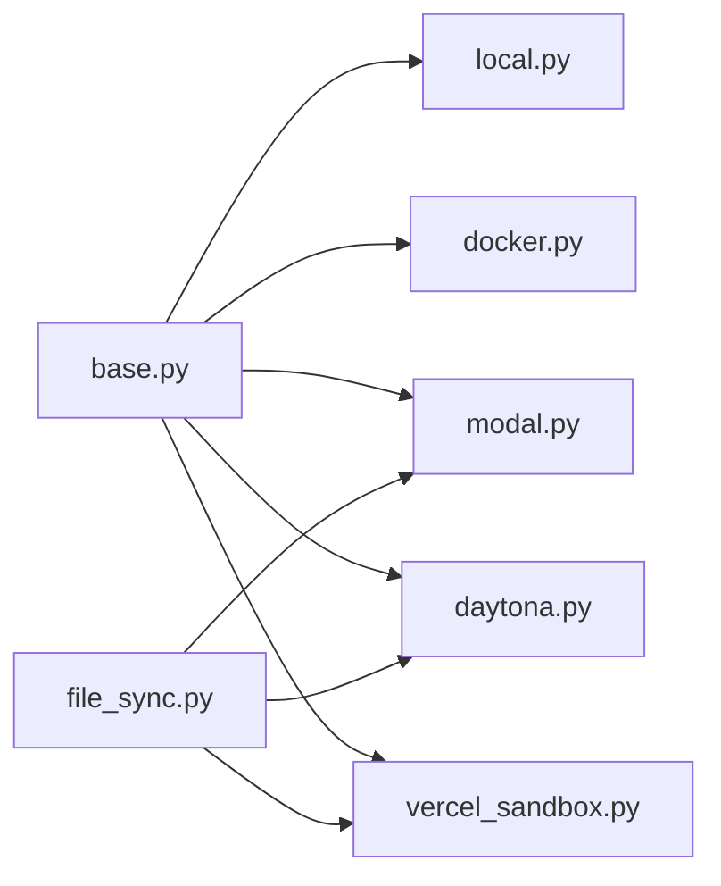

# 执行环境管理

<cite>
**本文引用的文件**
- [tools/environments/__init__.py](file://tools/environments/__init__.py)
- [tools/environments/base.py](file://tools/environments/base.py)
- [tools/environments/local.py](file://tools/environments/local.py)
- [tools/environments/docker.py](file://tools/environments/docker.py)
- [tools/environments/modal.py](file://tools/environments/modal.py)
- [tools/environments/daytona.py](file://tools/environments/daytona.py)
- [tools/environments/vercel_sandbox.py](file://tools/environments/vercel_sandbox.py)
- [tools/environments/file_sync.py](file://tools/environments/file_sync.py)
- [tests/tools/test_terminal_error_redaction.py](file://tests/tools/test_terminal_error_redaction.py)
</cite>

## 目录
1. [简介](#简介)
2. [项目结构](#项目结构)
3. [核心组件](#核心组件)
4. [架构总览](#架构总览)
5. [详细组件分析](#详细组件分析)
6. [依赖关系分析](#依赖关系分析)
7. [性能与资源限制](#性能与资源限制)
8. [故障排除指南](#故障排除指南)
9. [结论](#结论)
10. [附录：扩展新环境类型](#附录：扩展新环境类型)

## 简介
本文件系统性说明 Hermes 工具执行环境的实现原理与配置方法，覆盖本地终端、Docker 容器、Modal、Daytona、Vercel Sandbox 五种执行环境。重点阐述环境检测、资源隔离、进程管理与生命周期控制机制，并给出环境变量传递、工作目录管理、文件访问控制与网络代理配置的实践要点。同时提供性能优化策略、扩展指南与故障排除方法，帮助开发者快速定位问题并安全地扩展新的执行环境。

## 项目结构
Hermes 的执行环境统一抽象在 tools/environments 目录下，所有后端均实现 BaseEnvironment 接口，对外暴露一致的 execute() 流程（由基类提供），子类仅负责 _run_bash() 与 cleanup() 等具体实现。终端工具通过工厂选择后端，依据配置中的 env_type 或平台相关参数决定使用哪个环境。

**图示来源**
- [tools/environments/base.py:553-620](file://tools/environments/base.py#L553-L620)
- [tools/environments/local.py:1-120](file://tools/environments/local.py#L1-L120)
- [tools/environments/docker.py:1-80](file://tools/environments/docker.py#L1-L80)
- [tools/environments/modal.py:164-190](file://tools/environments/modal.py#L164-L190)
- [tools/environments/daytona.py:30-52](file://tools/environments/daytona.py#L30-L52)
- [tools/environments/vercel_sandbox.py:243-276](file://tools/environments/vercel_sandbox.py#L243-L276)

**章节来源**
- [tools/environments/__init__.py:1-15](file://tools/environments/__init__.py#L1-L15)

## 核心组件
- BaseEnvironment：定义统一的执行模型（每命令一次 spawn）、会话快照（env、函数、别名）捕获与重放、CWD 持久化、中断与超时处理、输出收集与溢出转储。
- LocalEnvironment：本地 bash 子进程执行，跨平台路径转换、安全 CWD 回退、敏感环境变量过滤、会话上下文注入。
- DockerEnvironment：容器化沙箱，安全能力最小化、tmpfs 限制、可选 cgroup 资源限制、出站代理集成、孤儿容器回收。
- ModalEnvironment：基于 Modal SDK 的云端沙箱，支持文件系统快照与恢复、文件同步、异步执行封装。
- DaytonaEnvironment：基于 Daytona SDK 的云端沙箱，支持持久化、资源配额、文件同步与状态恢复。
- VercelSandboxEnvironment：基于 Vercel SDK 的沙箱，支持快照、重试、运行态等待、文件同步与清理。

关键特性：
- 会话快照：初始化时捕获 shell 环境到临时脚本，后续命令 source 该快照，避免重复登录开销；同时排除跨会话桥接变量，防止泄露。
- 工作目录：通过 in-band 标记或临时文件维护 CWD，确保远程/容器内路径一致性。
- 进程管理：统一 ProcessHandle 协议，适配 subprocess 与 SDK 阻塞调用；支持 kill/cancel 回调。
- 输出收集：有界缓冲 + 溢出转储，保证内存可控且可恢复长输出。
- 安全：严格的环境变量白名单/黑名单、敏感信息脱敏、出站代理强制。

**章节来源**
- [tools/environments/base.py:81-231](file://tools/environments/base.py#L81-L231)
- [tools/environments/base.py:474-545](file://tools/environments/base.py#L474-L545)
- [tools/environments/base.py:553-780](file://tools/environments/base.py#L553-L780)
- [tools/environments/local.py:456-513](file://tools/environments/local.py#L456-L513)
- [tools/environments/docker.py:322-366](file://tools/environments/docker.py#L322-L366)
- [tools/environments/modal.py:164-190](file://tools/environments/modal.py#L164-L190)
- [tools/environments/daytona.py:30-52](file://tools/environments/daytona.py#L30-L52)
- [tools/environments/vercel_sandbox.py:243-276](file://tools/environments/vercel_sandbox.py#L243-L276)

## 架构总览
下图展示了从终端工具到各后端的调用链路与数据流，包括会话快照、CWD 标记、输出收集与清理。

**图示来源**
- [tools/environments/base.py:660-780](file://tools/environments/base.py#L660-L780)
- [tools/environments/modal.py:400-479](file://tools/environments/modal.py#L400-L479)
- [tools/environments/daytona.py:206-271](file://tools/environments/daytona.py#L206-L271)
- [tools/environments/vercel_sandbox.py:591-663](file://tools/environments/vercel_sandbox.py#L591-L663)

## 详细组件分析

### 本地终端环境（LocalEnvironment）
- 进程与路径：
  - 使用 bash 子进程执行命令，Windows 下自动选择 Git Bash/PortableGit，并进行 MSYS/Windows 路径转换。
  - 安全 CWD 回退：当配置的工作目录不可用时，向上查找可用祖先目录，必要时回退到临时目录。
- 环境变量：
  - 构建子进程环境时进行严格过滤：移除 Hermes 内部密钥、提供商密钥、网关令牌等；支持“透传”白名单；注入 HERMES_HOME 与子进程 HOME 契约；注入会话上下文变量，防止跨会话泄露。
  - 主动剥离虚拟环境标记（VIRTUAL_ENV、CONDA_PREFIX），避免污染其他项目环境。
- 会话快照：
  - 捕获 export、函数、别名，原子写入快照文件，source 后设置 CWD 并输出 CWD 标记供基类解析。
- 中断与超时：
  - 基类统一处理中断与超时；本地路径通过 _popen_bash 与 _pipe_stdin 避免管道死锁。

**图示来源**
- [tools/environments/local.py:53-90](file://tools/environments/local.py#L53-L90)
- [tools/environments/local.py:155-197](file://tools/environments/local.py#L155-L197)
- [tools/environments/local.py:456-513](file://tools/environments/local.py#L456-L513)
- [tools/environments/base.py:295-349](file://tools/environments/base.py#L295-L349)

**章节来源**
- [tools/environments/local.py:25-138](file://tools/environments/local.py#L25-L138)
- [tools/environments/local.py:456-513](file://tools/environments/local.py#L456-L513)
- [tools/environments/local.py:574-656](file://tools/environments/local.py#L574-L656)

### Docker 容器环境（DockerEnvironment）
- 容器安全：
  - 默认丢弃全部能力，仅添加必要 DAC_OVERRIDE/CHOWN/FOWNER，启用 no-new-privileges，限制 /tmp 与 /var/tmp 大小。
  - 根据镜像入口点判断是否需要 /run 挂载为 exec，避免 s6-overlay 启动失败。
- 资源限制：
  - 探测 cgroup 控制器可用性，按需启用 --cpus/--memory/--pids-limit；默认 pids 限制与 shm 大小可调。
- 网络代理：
  - 集成 iron-proxy 出站代理：挂载 CA 证书、设置 HTTPS_PROXY/HTTP_PROXY/NO_PROXY、Node CA 追加选项，并在 Linux 上添加 host.docker.internal 映射。
  - 若 enforce_on_docker=true 且代理未就绪，拒绝启动沙箱。
- 生命周期：
  - 支持孤儿容器回收，按标签与完成时间清理残留容器。

**图示来源**
- [tools/environments/docker.py:322-366](file://tools/environments/docker.py#L322-L366)
- [tools/environments/docker.py:397-555](file://tools/environments/docker.py#L397-L555)
- [tools/environments/docker.py:720-769](file://tools/environments/docker.py#L720-L769)
- [tools/environments/docker.py:148-239](file://tools/environments/docker.py#L148-L239)

**章节来源**
- [tools/environments/docker.py:1-80](file://tools/environments/docker.py#L1-L80)
- [tools/environments/docker.py:397-555](file://tools/environments/docker.py#L397-L555)
- [tools/environments/docker.py:720-769](file://tools/environments/docker.py#L720-L769)

### Modal 云环境（ModalEnvironment）
- 执行模型：
  - 通过 Modal SDK 的 Sandbox.create/exec 执行命令；使用 _ThreadedProcessHandle 将异步 SDK 调用包装为进程句柄，支持 cancel 终止。
- 持久化：
  - 支持文件系统快照存储于本地 JSON，任务级命名空间；首次失败时回退到基础镜像重新创建。
- 文件同步：
  - 使用 FileSyncManager 增量上传/下载 .hermes 目录，批量传输采用 base64+targz 管道，规避 SDK 参数长度限制。
- 生命周期：
  - 清理时同步回主机、保存快照、终止沙箱并关闭事件循环。

**图示来源**
- [tools/environments/modal.py:164-190](file://tools/environments/modal.py#L164-L190)
- [tools/environments/modal.py:241-293](file://tools/environments/modal.py#L241-L293)
- [tools/environments/modal.py:400-479](file://tools/environments/modal.py#L400-L479)

**章节来源**
- [tools/environments/modal.py:83-124](file://tools/environments/modal.py#L83-L124)
- [tools/environments/modal.py:295-398](file://tools/environments/modal.py#L295-L398)
- [tools/environments/modal.py:400-479](file://tools/environments/modal.py#L400-L479)

### Daytona 云环境（DaytonaEnvironment）
- 执行模型：
  - 通过 Daytona SDK 创建/恢复沙箱，执行命令；使用 _ThreadedProcessHandle 包装阻塞调用，支持 stop 取消。
- 资源与持久化：
  - 支持 CPU/内存/磁盘配额（磁盘上限保护），持久化模式下停止而非删除，下次复用。
- 文件同步：
  - 使用 FileSyncManager 批量上传/下载 .hermes 目录，利用 SDK 的多文件上传接口提升吞吐。
- 生命周期：
  - 清理时先同步回主机，再停止或删除沙箱。

**图示来源**
- [tools/environments/daytona.py:30-52](file://tools/environments/daytona.py#L30-L52)
- [tools/environments/daytona.py:89-152](file://tools/environments/daytona.py#L89-L152)
- [tools/environments/daytona.py:206-271](file://tools/environments/daytona.py#L206-L271)

**章节来源**
- [tools/environments/daytona.py:30-52](file://tools/environments/daytona.py#L30-L52)
- [tools/environments/daytona.py:154-201](file://tools/environments/daytona.py#L154-L201)
- [tools/environments/daytona.py:206-271](file://tools/environments/daytona.py#L206-L271)

### Vercel Sandbox 环境（VercelSandboxEnvironment）
- 执行模型：
  - 通过 Vercel SDK 创建/恢复沙箱，执行命令；使用 _ThreadedProcessHandle 包装，cancel 调用 stop。
- 健壮性：
  - 对网络与临时错误进行指数退避重试；等待 RUNNING 状态，处理终止状态并重建。
- 持久化：
  - 支持快照存储于本地 JSON，失败时回退新建；清理时同步回主机并停止沙箱。
- 工作目录与 Home：
  - 自动检测工作目录与远程 home，兼容 ~ 与默认路径。

**图示来源**
- [tools/environments/vercel_sandbox.py:243-276](file://tools/environments/vercel_sandbox.py#L243-L276)
- [tools/environments/vercel_sandbox.py:306-342](file://tools/environments/vercel_sandbox.py#L306-L342)
- [tools/environments/vercel_sandbox.py:591-663](file://tools/environments/vercel_sandbox.py#L591-L663)

**章节来源**
- [tools/environments/vercel_sandbox.py:47-76](file://tools/environments/vercel_sandbox.py#L47-L76)
- [tools/environments/vercel_sandbox.py:344-396](file://tools/environments/vercel_sandbox.py#L344-L396)
- [tools/environments/vercel_sandbox.py:513-590](file://tools/environments/vercel_sandbox.py#L513-L590)

## 依赖关系分析
- 模块耦合：
  - BaseEnvironment 是所有后端的共同基类，提供 execute/init_session/_wait_for_process 等通用逻辑。
  - 各后端通过 _run_bash 与 cleanup 实现差异化的进程/SDK 交互。
  - file_sync 模块被 Modal/Daytona/Vercel 共享，用于 .hermes 目录的增量同步。
- 外部依赖：
  - Docker：docker/podman CLI、iron-proxy（可选）。
  - Modal/Daytona/Vercel：各自 SDK，懒加载安装。
- 潜在环依赖：
  - 当前结构清晰，无环；后端仅依赖 base 与 file_sync，不反向依赖。

**图示来源**
- [tools/environments/base.py:553-620](file://tools/environments/base.py#L553-L620)
- [tools/environments/modal.py:24-30](file://tools/environments/modal.py#L24-L30)
- [tools/environments/daytona.py:19-25](file://tools/environments/daytona.py#L19-L25)
- [tools/environments/vercel_sandbox.py:32-36](file://tools/environments/vercel_sandbox.py#L32-L36)

**章节来源**
- [tools/environments/base.py:553-620](file://tools/environments/base.py#L553-L620)
- [tools/environments/modal.py:24-30](file://tools/environments/modal.py#L24-L30)
- [tools/environments/daytona.py:19-25](file://tools/environments/daytona.py#L19-L25)
- [tools/environments/vercel_sandbox.py:32-36](file://tools/environments/vercel_sandbox.py#L32-L36)

## 性能与资源限制
- 输出缓冲与转储：
  - 有界头尾缓冲 + 溢出转储文件，避免内存膨胀，同时保留完整输出以便恢复。
- 资源限制：
  - Docker：cgroup 探测后启用 CPU/内存/PID 限制；/tmp 与 /var/tmp 大小限制；shm 默认放大以避免共享内存不足。
  - Daytona：磁盘上限保护（10GB），CPU/内存配额。
  - Vercel：最小超时与运行等待，避免长时间挂起。
- 冷启动优化：
  - Modal/Daytona/Vercel 支持快照恢复，减少初始化时间。
  - Docker 支持孤儿容器回收，避免频繁拉取与创建。
- 网络优化：
  - Docker 出站代理集成，统一 CA 与代理设置，避免 TLS 验证失败。

[本节为通用指导，无需特定文件引用]

## 故障排除指南
- 常见错误与修复：
  - Docker 不可用：检查 PATH 或 HERMES_DOCKER_BINARY，确认 docker/podman 可执行文件存在并可运行。
  - 代理未就绪：若 enforce_on_docker=true，需先运行 egress setup/start，确保 CA 与映射有效。
  - 工作目录不可用：本地环境会自动回退到可用祖先目录或临时目录；检查权限与路径有效性。
  - 会话快照失败：基类会尝试非登录 shell 探针，若失败则降级为 per-command 登录 shell。
  - 云端沙箱状态异常：Vercel/Daytona/Modal 会在进入终止状态时重建；关注日志中的状态与重试信息。
- 调试建议：
  - 启用 HERMES_DEBUG_INTERRUPT 查看中断/心跳日志。
  - 检查终端工具的错误脱敏输出，确认未泄露敏感信息。
  - 使用测试用例思路验证环境连通性与错误处理路径。

**章节来源**
- [tools/environments/docker.py:772-800](file://tools/environments/docker.py#L772-L800)
- [tools/environments/docker.py:397-555](file://tools/environments/docker.py#L397-L555)
- [tools/environments/local.py:155-197](file://tools/environments/local.py#L155-L197)
- [tools/environments/base.py:736-780](file://tools/environments/base.py#L736-L780)
- [tests/tools/test_terminal_error_redaction.py:13-38](file://tests/tools/test_terminal_error_redaction.py#L13-L38)

## 结论
Hermes 执行环境通过统一的 BaseEnvironment 抽象，实现了本地与多种云端沙箱的一致执行模型。其核心优势在于：安全的会话快照与 CWD 管理、严格的变量过滤与代理控制、健壮的进程与生命周期管理、以及可扩展的后端体系。借助这些机制，开发者可以在不同环境中可靠地执行工具命令，并通过快照与资源限制获得稳定高效的体验。

[本节为总结性内容，无需特定文件引用]

## 附录：扩展新环境类型
- 步骤概览：
  - 新增后端类继承 BaseEnvironment，实现 _run_bash() 与 cleanup()。
  - 如需文件同步，集成 FileSyncManager，实现上传/删除/批量操作。
  - 在终端工具工厂中注册新后端，依据配置选择。
- 注意事项：
  - 遵循 ProcessHandle 协议，确保 poll/kill/wait/stdout/returncode 行为一致。
  - 正确处理中断与超时，提供 cancel_fn。
  - 遵守环境变量过滤与安全策略，避免泄露敏感信息。
  - 考虑快照与 CWD 标记，确保远程环境一致性。
- 参考实现：
  - 可参照 Modal/Daytona/Vercel 的实现模式，结合各自 SDK 的特性进行适配。

**章节来源**
- [tools/environments/base.py:553-620](file://tools/environments/base.py#L553-L620)
- [tools/environments/modal.py:164-190](file://tools/environments/modal.py#L164-L190)
- [tools/environments/daytona.py:30-52](file://tools/environments/daytona.py#L30-L52)
- [tools/environments/vercel_sandbox.py:243-276](file://tools/environments/vercel_sandbox.py#L243-L276)