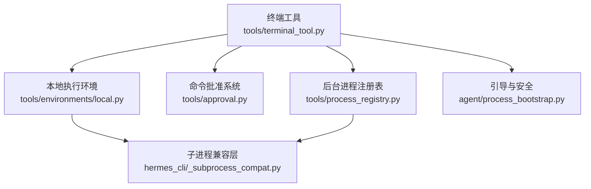
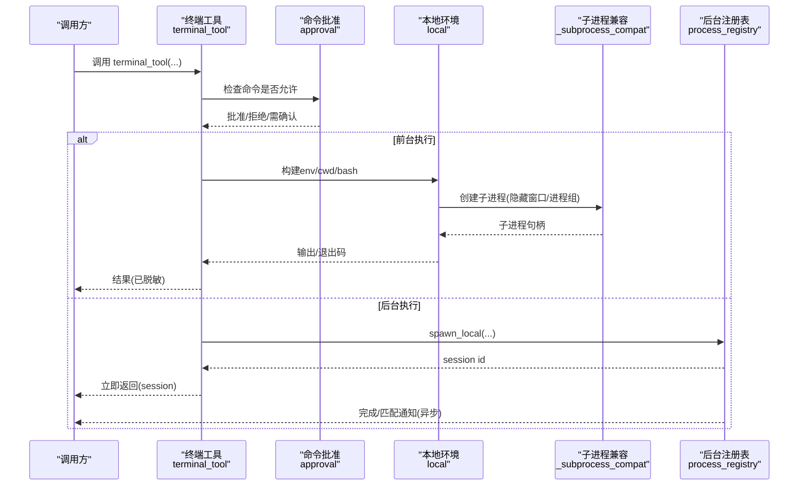
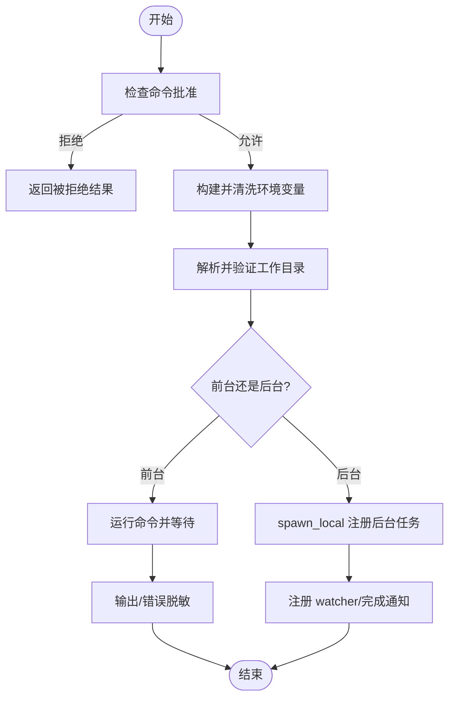
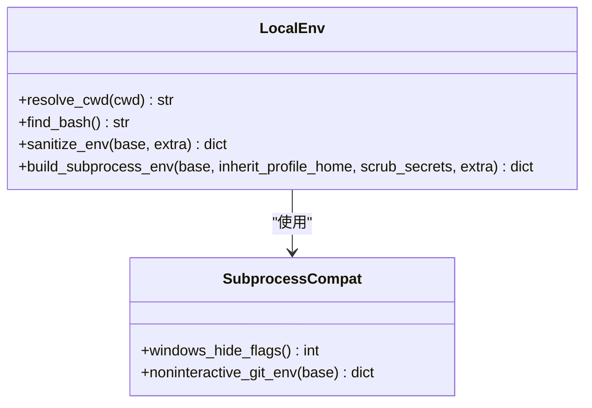
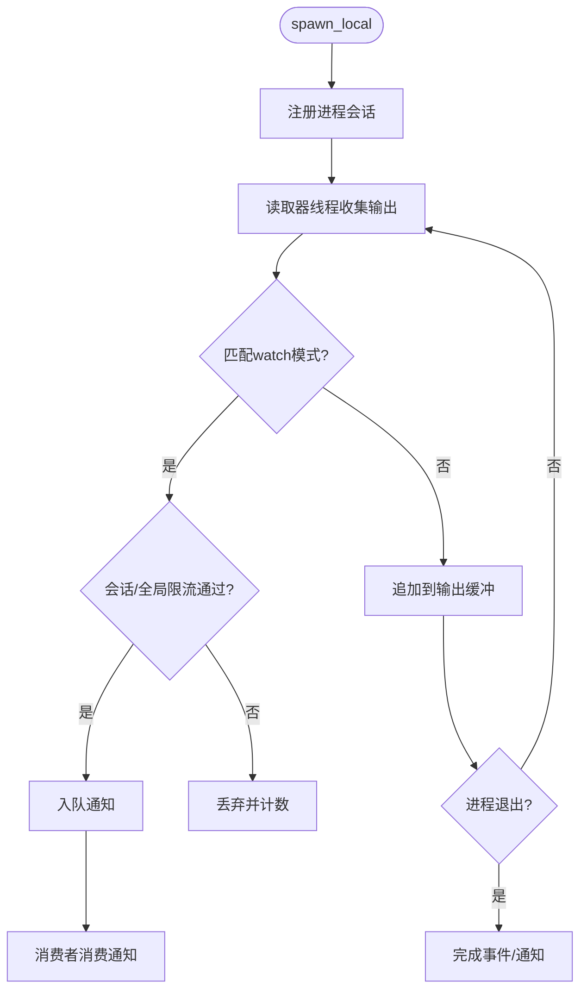
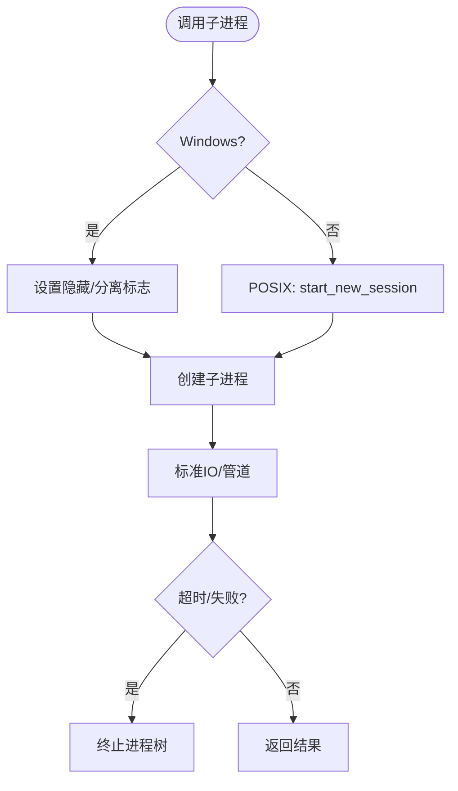
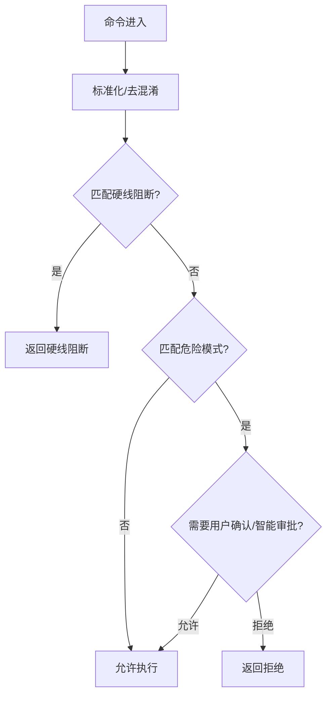
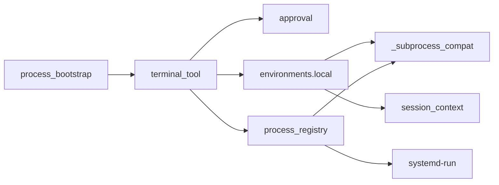

# 本地终端执行环境

<cite>
**本文引用的文件**
- [tools/terminal_tool.py](file://tools/terminal_tool.py)
- [tools/environments/local.py](file://tools/environments/local.py)
- [tools/process_registry.py](file://tools/process_registry.py)
- [hermes_cli/_subprocess_compat.py](file://hermes_cli/_subprocess_compat.py)
- [agent/process_bootstrap.py](file://agent/process_bootstrap.py)
- [tools/approval.py](file://tools/approval.py)
- [tests/tools/test_terminal_error_redaction.py](file://tests/tools/test_terminal_error_redaction.py)
</cite>

## 目录
1. [简介](#简介)
2. [项目结构](#项目结构)
3. [核心组件](#核心组件)
4. [架构总览](#架构总览)
5. [详细组件分析](#详细组件分析)
6. [依赖关系分析](#依赖关系分析)
7. [性能与资源限制](#性能与资源限制)
8. [故障排除指南](#故障排除指南)
9. [结论](#结论)
10. [附录：配置与示例](#附录：配置与示例)

## 简介
本文件面向开发者与运维人员，系统化说明 Hermes 的“本地终端执行环境”实现原理与使用方式。重点覆盖：
- 进程管理：前台命令、后台任务、进程回收、跨平台子进程创建
- 环境变量传递：安全过滤、会话上下文注入、敏感信息保护
- 工作目录设置：路径解析、权限检查、回退策略
- 安全控制：sudo 处理、交互式密码输入、命令批准系统（含硬线阻断）
- 错误处理：异常脱敏、重试与降级、日志与诊断
- 性能优化：超时上限、磁盘告警、cgroup 隔离、输出缓冲与速率限制
- 调试与排障：常见问题定位、关键开关与环境变量

## 项目结构
本地终端执行由多个模块协作完成：
- 入口工具层：统一对外暴露 terminal_tool，负责调度环境与审批
- 本地执行环境：封装 bash/sh 启动、工作目录、环境变量构建
- 后台进程注册表：统一管理后台任务生命周期、输出缓冲、通知与清理
- 子进程兼容层：Windows/POSIX 差异处理、隐藏窗口、非交互 git 等
- 引导与安全：安全 stdio、代理、敏感信息脱敏
- 命令批准：危险命令检测、用户确认、智能审批、硬线阻断

图表来源
- [tools/terminal_tool.py:1-120](file://tools/terminal_tool.py#L1-L120)
- [tools/environments/local.py:1-120](file://tools/environments/local.py#L1-L120)
- [tools/process_registry.py:1-120](file://tools/process_registry.py#L1-L120)
- [hermes_cli/_subprocess_compat.py:1-60](file://hermes_cli/_subprocess_compat.py#L1-L60)
- [agent/process_bootstrap.py:1-40](file://agent/process_bootstrap.py#L1-L40)

章节来源
- [tools/terminal_tool.py:1-120](file://tools/terminal_tool.py#L1-L120)
- [tools/environments/local.py:1-120](file://tools/environments/local.py#L1-L120)
- [tools/process_registry.py:1-120](file://tools/process_registry.py#L1-L120)
- [hermes_cli/_subprocess_compat.py:1-60](file://hermes_cli/_subprocess_compat.py#L1-L60)
- [agent/process_bootstrap.py:1-40](file://agent/process_bootstrap.py#L1-L40)

## 核心组件
- 终端工具（tools/terminal_tool.py）
  - 统一入口，选择执行后端（local/docker/modal/vercel_sandbox），处理 sudo、审批、超时、错误脱敏
  - 维护 sudo 密码缓存与作用域、交互式 sudo 提示、命令预览与重写
- 本地执行环境（tools/environments/local.py）
  - 工作目录解析与回退、bash 查找与 Windows MSYS 路径转换
  - 环境变量构建与过滤（敏感键剔除、会话上下文注入、虚拟环境标记清理）
- 后台进程注册表（tools/process_registry.py）
  - 后台任务生命周期、输出缓冲、watch 模式与全局限流、systemd cgroup 隔离与内存限制
- 子进程兼容层（hermes_cli/_subprocess_compat.py）
  - Windows 隐藏窗口、进程组分离、非交互 git 环境、受控 git 探测
- 引导与安全（agent/process_bootstrap.py）
  - 安全 stdout/stderr 包装、代理解析、HTTP 客户端构建
- 命令批准（tools/approval.py）
  - 危险命令检测、用户确认、智能审批、硬线阻断、sudo -S 防护

章节来源
- [tools/terminal_tool.py:57-120](file://tools/terminal_tool.py#L57-L120)
- [tools/environments/local.py:140-210](file://tools/environments/local.py#L140-L210)
- [tools/process_registry.py:58-120](file://tools/process_registry.py#L58-L120)
- [hermes_cli/_subprocess_compat.py:50-120](file://hermes_cli/_subprocess_compat.py#L50-L120)
- [agent/process_bootstrap.py:63-110](file://agent/process_bootstrap.py#L63-L110)
- [tools/approval.py:350-540](file://tools/approval.py#L350-L540)

## 架构总览
本地执行的关键流程如下：
- 调用 terminal_tool(command, background, timeout, env_type=local, cwd, ...)
- 通过 _check_all_guards 进行命令批准与安全检查
- 根据 env_type 选择后端；local 走本地 bash/sh 执行
- 构建并清洗环境变量，设置工作目录，创建子进程
- 前台执行直接等待结果；后台执行交由 ProcessRegistry 管理
- 输出与错误经脱敏后返回；必要时触发 watch 通知或完成通知

图表来源
- [tools/terminal_tool.py:375-381](file://tools/terminal_tool.py#L375-L381)
- [tools/environments/local.py:456-514](file://tools/environments/local.py#L456-L514)
- [hermes_cli/_subprocess_compat.py:135-180](file://hermes_cli/_subprocess_compat.py#L135-L180)
- [tools/process_registry.py:394-466](file://tools/process_registry.py#L394-L466)

## 详细组件分析

### 终端工具（tools/terminal_tool.py）
- 功能要点
  - 支持多后端选择（local/docker/modal/vercel_sandbox），默认 local
  - 前台超时上限可配置（TERMINAL_MAX_FOREGROUND_TIMEOUT），磁盘使用告警阈值（TERMINAL_DISK_WARNING_GB）
  - sudo 处理：自动改写为 sudo -S，交互式密码提示，失败时清除缓存
  - 命令批准：委托 tools.approval.check_all_command_guards，支持 CLI 回调与网关异步
  - 错误脱敏：所有错误与 traceback 强制脱敏，避免泄露密钥
- 关键流程
  - 解析配置、校验工作目录、构建环境、执行命令、捕获异常并脱敏
  - 后台任务通过 process_registry.spawn_local 启动，返回 session 供轮询/等待

图表来源
- [tools/terminal_tool.py:118-133](file://tools/terminal_tool.py#L118-L133)
- [tools/terminal_tool.py:486-609](file://tools/terminal_tool.py#L486-L609)
- [tools/terminal_tool.py:665-727](file://tools/terminal_tool.py#L665-L727)
- [tools/process_registry.py:394-466](file://tools/process_registry.py#L394-L466)

章节来源
- [tools/terminal_tool.py:57-120](file://tools/terminal_tool.py#L57-L120)
- [tools/terminal_tool.py:486-609](file://tools/terminal_tool.py#L486-L609)
- [tools/terminal_tool.py:665-727](file://tools/terminal_tool.py#L665-L727)
- [tests/tools/test_terminal_error_redaction.py:47-154](file://tests/tools/test_terminal_error_redaction.py#L47-L154)

### 本地执行环境（tools/environments/local.py）
- 工作目录
  - 解析相对/绝对路径，Windows 下 MSYS/Git Bash 路径转换
  - 权限检查与回退：若目标不可用，向上查找可用父目录，最终回退到临时目录
- 环境变量
  - 严格过滤敏感键（LLM 密钥、网关令牌、远程计算凭据等）
  - 注入会话上下文（HERMES_SESSION_*），防止跨会话泄漏
  - 清理 VIRTUAL_ENV/CONDA_PREFIX，避免污染其他项目环境
  - 应用 HERMES_HOME 与子进程 HOME 契约
- Shell 查找
  - 优先使用便携 Git Bash，避免系统 Git 损坏导致失败
  - 对 ASLR/MSYS 问题提供友好错误提示

图表来源
- [tools/environments/local.py:53-91](file://tools/environments/local.py#L53-L91)
- [tools/environments/local.py:155-198](file://tools/environments/local.py#L155-L198)
- [tools/environments/local.py:456-514](file://tools/environments/local.py#L456-L514)
- [hermes_cli/_subprocess_compat.py:307-345](file://hermes_cli/_subprocess_compat.py#L307-L345)

章节来源
- [tools/environments/local.py:53-91](file://tools/environments/local.py#L53-L91)
- [tools/environments/local.py:155-198](file://tools/environments/local.py#L155-L198)
- [tools/environments/local.py:456-514](file://tools/environments/local.py#L456-L514)
- [hermes_cli/_subprocess_compat.py:307-345](file://hermes_cli/_subprocess_compat.py#L307-L345)

### 后台进程注册表（tools/process_registry.py）
- 功能要点
  - 后台任务跟踪：输出缓冲（滚动 200KB）、状态轮询、阻塞等待、中断支持
  - Watch 模式：按模式匹配输出，触发通知；具备会话级与全局级限流
  - systemd cgroup 隔离：将 worker 放入独立 scope，限制内存，OOM 仅影响 worker
  - 崩溃恢复：JSON checkpoint 持久化，重启后可恢复
- 关键机制
  - 每会话冷却时间、连续打击禁用 watch，降级为 notify_on_complete
  - 全局断路器：防止多进程同时刷屏
  - PID 复用防护：记录内核启动时间戳，避免误杀回收的 PID

图表来源
- [tools/process_registry.py:341-392](file://tools/process_registry.py#L341-L392)
- [tools/process_registry.py:487-700](file://tools/process_registry.py#L487-L700)
- [tools/process_registry.py:108-168](file://tools/process_registry.py#L108-L168)

章节来源
- [tools/process_registry.py:341-392](file://tools/process_registry.py#L341-L392)
- [tools/process_registry.py:487-700](file://tools/process_registry.py#L487-L700)
- [tools/process_registry.py:108-168](file://tools/process_registry.py#L108-L168)

### 子进程兼容层（hermes_cli/_subprocess_compat.py）
- 功能要点
  - Windows 隐藏控制台窗口，避免闪烁
  - 进程组分离与脱离 Job 对象，确保后台进程不受父进程关闭影响
  - 非交互 git 环境：禁止交互式认证提示，防止挂起
  - 受控 git 探测：bounded_git_probe，超时后树杀，避免死锁

图表来源
- [hermes_cli/_subprocess_compat.py:135-180](file://hermes_cli/_subprocess_compat.py#L135-L180)
- [hermes_cli/_subprocess_compat.py:269-300](file://hermes_cli/_subprocess_compat.py#L269-L300)
- [hermes_cli/_subprocess_compat.py:406-465](file://hermes_cli/_subprocess_compat.py#L406-L465)

章节来源
- [hermes_cli/_subprocess_compat.py:135-180](file://hermes_cli/_subprocess_compat.py#L135-L180)
- [hermes_cli/_subprocess_compat.py:269-300](file://hermes_cli/_subprocess_compat.py#L269-L300)
- [hermes_cli/_subprocess_compat.py:406-465](file://hermes_cli/_subprocess_compat.py#L406-L465)

### 引导与安全（agent/process_bootstrap.py）
- 功能要点
  - 安全 stdout/stderr 包装：捕获 Broken Pipe 与关闭流异常，避免崩溃
  - 代理解析：HTTPS_PROXY/HTTP_PROXY/ALL_PROXY，尊重 NO_PROXY
  - HTTP 客户端构建：连接池、超时、传输挂载，适配流式端点

章节来源
- [agent/process_bootstrap.py:63-110](file://agent/process_bootstrap.py#L63-L110)
- [agent/process_bootstrap.py:112-143](file://agent/process_bootstrap.py#L112-L143)
- [agent/process_bootstrap.py:145-202](file://agent/process_bootstrap.py#L145-L202)

### 命令批准系统（tools/approval.py）
- 功能要点
  - 危险命令检测：删除系统目录、格式化磁盘、fork bomb、killall -KILL 等
  - 硬线阻断：不可绕过（即使 yolo），包括 rm -rf /、dd to block device、shutdown/reboot
  - sudo -S 防护：未配置 SUDO_PASSWORD 时禁止 stdin 密码猜测
  - 用户 deny 规则：config.yaml approvals.deny 可定义永久黑名单
  - 智能审批：辅助 LLM 评估低风险命令，减少人工干预

图表来源
- [tools/approval.py:350-540](file://tools/approval.py#L350-L540)
- [tools/approval.py:693-800](file://tools/approval.py#L693-L800)

章节来源
- [tools/approval.py:350-540](file://tools/approval.py#L350-L540)
- [tools/approval.py:693-800](file://tools/approval.py#L693-L800)

## 依赖关系分析
- terminal_tool 依赖 approval 进行命令批准，依赖 environments.local 执行本地命令，依赖 process_registry 管理后台任务
- environments.local 依赖 _subprocess_compat 处理跨平台子进程细节，依赖 hermes_constants 与 session_context 注入上下文
- process_registry 依赖 _subprocess_compat 与 systemd-run 进行隔离与内存限制
- agent/process_bootstrap 提供安全 stdio 与代理能力，被多处导入以增强健壮性

图表来源
- [tools/terminal_tool.py:375-381](file://tools/terminal_tool.py#L375-L381)
- [tools/environments/local.py:456-514](file://tools/environments/local.py#L456-L514)
- [tools/process_registry.py:108-168](file://tools/process_registry.py#L108-L168)
- [hermes_cli/_subprocess_compat.py:135-180](file://hermes_cli/_subprocess_compat.py#L135-L180)
- [agent/process_bootstrap.py:63-110](file://agent/process_bootstrap.py#L63-L110)

章节来源
- [tools/terminal_tool.py:375-381](file://tools/terminal_tool.py#L375-L381)
- [tools/environments/local.py:456-514](file://tools/environments/local.py#L456-L514)
- [tools/process_registry.py:108-168](file://tools/process_registry.py#L108-L168)
- [hermes_cli/_subprocess_compat.py:135-180](file://hermes_cli/_subprocess_compat.py#L135-L180)
- [agent/process_bootstrap.py:63-110](file://agent/process_bootstrap.py#L63-L110)

## 性能与资源限制
- 前台超时上限：TERMINAL_MAX_FOREGROUND_TIMEOUT（秒），防止长时间阻塞
- 磁盘使用告警：TERMINAL_DISK_WARNING_GB（GB），定期扫描 scratch 目录并缓存结果
- 后台输出缓冲：最大 200KB 滚动缓冲区，避免无限增长
- 通知限流：会话级最小间隔 15 秒，连续 3 次超限则禁用 watch 并降级为完成通知；全局窗口 10 秒内最多 15 条，超限时触发断路器 30 秒
- 内存隔离：systemd-run --user --scope 为每个 worker 分配独立 cgroup，MemoryMax 取自当前 cgroup 或物理内存一半，上限 4 GiB；可通过 TERMINAL_LOCAL_MEMORY_MAX_MB 收紧
- Windows 子进程：隐藏控制台、进程组分离、Job 脱离，避免闪烁与意外继承

章节来源
- [tools/terminal_tool.py:118-133](file://tools/terminal_tool.py#L118-L133)
- [tools/process_registry.py:61-80](file://tools/process_registry.py#L61-L80)
- [tools/process_registry.py:108-168](file://tools/process_registry.py#L108-L168)
- [hermes_cli/_subprocess_compat.py:135-180](file://hermes_cli/_subprocess_compat.py#L135-L180)

## 故障排除指南
- 常见错误与处理
  - sudo 认证失败：自动清除缓存密码，建议配置 SUDO_PASSWORD 或在 .env 中设置；消息模式下提供提示
  - 工作目录不可用：自动回退至可用父目录或临时目录；检查权限与路径合法性
  - 后台任务启动失败：检查 process_registry.spawn_local 异常，确认 systemd-run 可用性
  - 输出过多导致刷屏：watch 模式会被禁用并降级为完成通知；调整 watch 间隔或模式
  - Windows 控制台闪烁：确保使用 windows_hide_flags 与正确的 creationflags
- 调试建议
  - 启用日志：查看 terminal_tool、process_registry、local 环境的警告与调试信息
  - 检查环境变量：确认 HERMES_SESSION_KEY、HERMES_INTERACTIVE、TERMINAL_ENV、SUDO_PASSWORD
  - 验证批准策略：查看 config.yaml 中的 approvals.mode、yolo、deny 列表
  - 监控磁盘与内存：关注磁盘告警与 cgroup 内存限制是否生效

章节来源
- [tools/terminal_tool.py:423-464](file://tools/terminal_tool.py#L423-L464)
- [tools/environments/local.py:155-198](file://tools/environments/local.py#L155-L198)
- [tools/process_registry.py:487-700](file://tools/process_registry.py#L487-L700)
- [hermes_cli/_subprocess_compat.py:232-267](file://hermes_cli/_subprocess_compat.py#L232-L267)

## 结论
本地终端执行环境通过严格的命令批准、安全的环境变量过滤、健壮的工作目录解析与跨平台子进程管理，提供了安全、可控且高性能的本地命令执行能力。结合后台进程注册表的资源隔离与通知限流，以及 systemd cgroup 的内存保护，能够在复杂环境中稳定运行。开发者可根据需求调整超时、磁盘告警、内存限制与批准策略，以满足不同场景的安全与性能要求。

## 附录：配置与示例
- 常用环境变量
  - TERMINAL_ENV=local：选择本地执行后端
  - TERMINAL_MAX_FOREGROUND_TIMEOUT：前台命令超时上限（秒）
  - TERMINAL_DISK_WARNING_GB：磁盘使用告警阈值（GB）
  - TERMINAL_LOCAL_MEMORY_MAX_MB：worker 内存上限（MB），用于收紧 cgroup 限制
  - SUDO_PASSWORD：配置 sudo 免密（谨慎使用）
  - HERMES_INTERACTIVE=1：启用交互式模式（sudo 提示、审批）
  - HERMES_SESSION_KEY：会话标识，用于隔离 sudo 密码缓存与审批状态
- 执行示例（概念性描述）
  - 前台执行：调用 terminal_tool(command="ls -la")，等待输出并返回
  - 后台执行：调用 terminal_tool(command="python server.py", background=True)，返回 session，后续 poll/wait 获取结果
  - 带 sudo：command 中包含 sudo，系统将自动改写为 sudo -S 并尝试交互式或缓存密码
  - 指定工作目录：传入 cwd="/path/to/project"，系统将解析并验证，不可用时回退
- 批准策略配置（概念性描述）
  - config.yaml approvals.mode：off/on/smart
  - approvals.yolo：允许高风险命令（仍受硬线阻断保护）
  - approvals.deny：用户自定义黑名单，永远阻止匹配的命令

章节来源
- [tools/terminal_tool.py:118-133](file://tools/terminal_tool.py#L118-L133)
- [tools/process_registry.py:108-168](file://tools/process_registry.py#L108-L168)
- [tools/approval.py:350-540](file://tools/approval.py#L350-L540)
- [tests/tools/test_terminal_error_redaction.py:13-39](file://tests/tools/test_terminal_error_redaction.py#L13-L39)