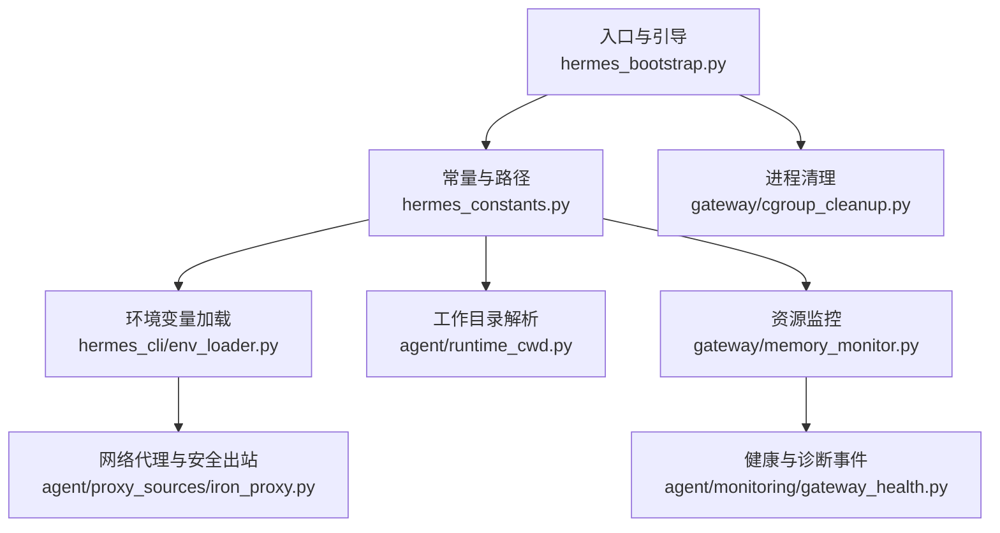
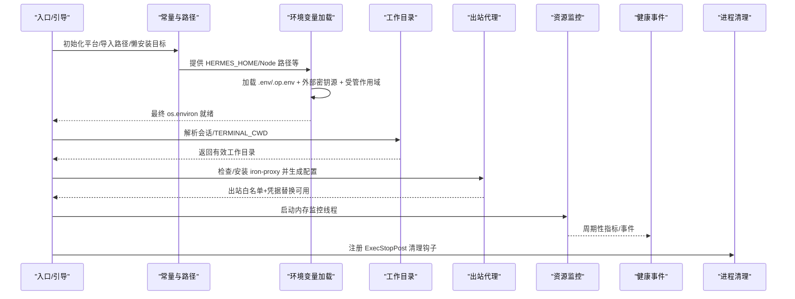
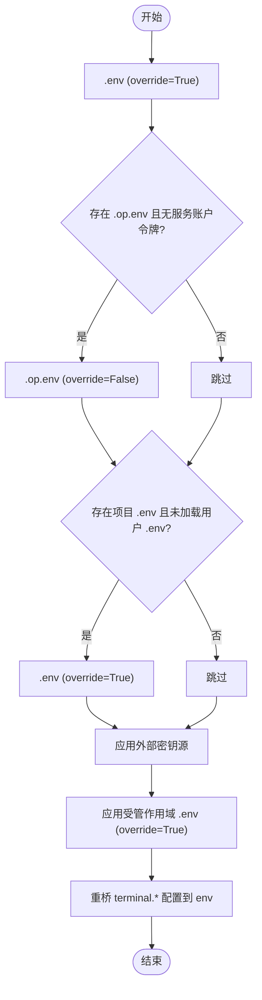
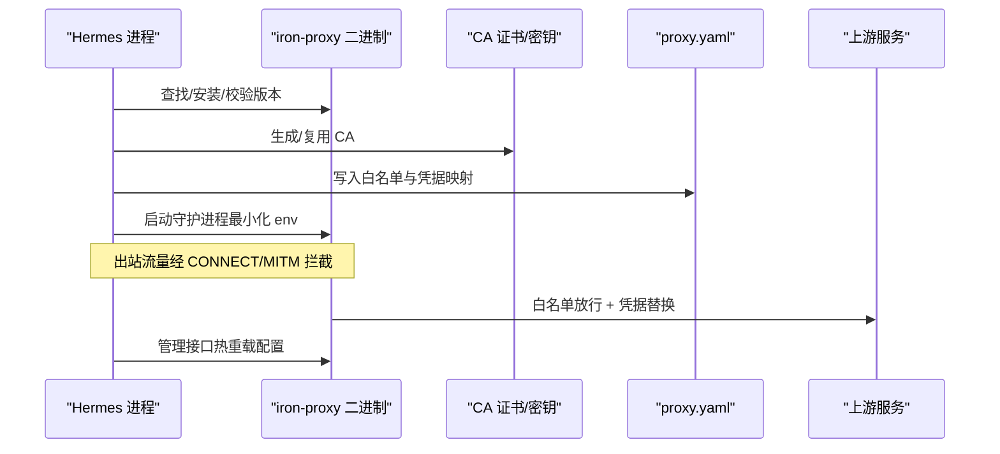
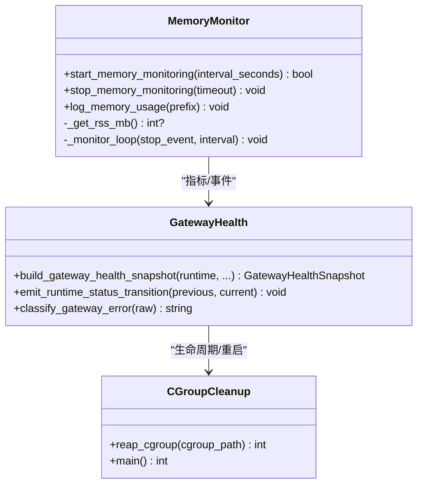
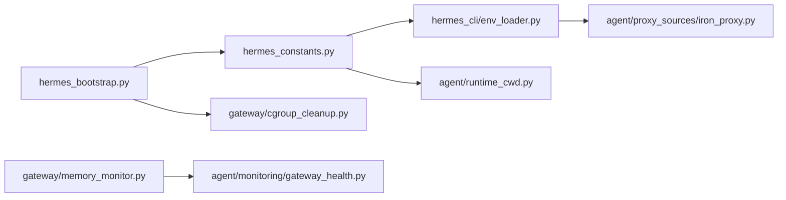

# 环境管理与生命周期

<cite>
**本文引用的文件**
- [hermes_bootstrap.py](file://hermes_bootstrap.py)
- [hermes_constants.py](file://hermes_constants.py)
- [env_loader.py](file://hermes_cli/env_loader.py)
- [runtime_cwd.py](file://agent/runtime_cwd.py)
- [memory_monitor.py](file://gateway/memory_monitor.py)
- [gateway_health.py](file://agent/monitoring/gateway_health.py)
- [cgroup_cleanup.py](file://gateway/cgroup_cleanup.py)
- [iron_proxy.py](file://agent/proxy_sources/iron_proxy.py)
</cite>

## 目录
1. [简介](#简介)
2. [项目结构](#项目结构)
3. [核心组件](#核心组件)
4. [架构总览](#架构总览)
5. [详细组件分析](#详细组件分析)
6. [依赖关系分析](#依赖关系分析)
7. [性能与资源限制](#性能与资源限制)
8. [故障排除指南](#故障排除指南)
9. [结论](#结论)
10. [附录：配置示例与扩展指南](#附录：配置示例与扩展指南)

## 简介
本文件聚焦 Hermes Agent 的“执行环境管理与生命周期”，覆盖环境检测、选择算法、工作目录管理、环境变量加载与清理、网络代理与安全出站控制、资源监控与清理机制，并提供面向开发者的扩展指南与故障排除方法。目标是帮助开发者在不同部署形态（本地、容器、托管）中正确配置并维护稳定的执行环境。

## 项目结构
围绕环境管理与生命周期，关键模块分布如下：
- 启动与平台适配：Windows UTF-8 引导、导入路径加固、可延迟安装目标激活
- 环境与路径：HERMES_HOME、Node/npm/npx 管理、可选技能/MCP 目录解析
- 环境变量加载：.env/.op.env 加载、外部密钥源注入、受管作用域覆盖、终端配置桥接
- 工作目录：会话级 cwd 上下文、TERMINAL_CWD 解析与校验
- 资源监控：进程内存周期日志、健康快照与事件
- 清理与隔离：cgroup 子进程回收、铁壁出站代理（iron-proxy）安全外发

图表来源
- [hermes_bootstrap.py:59-122](file://hermes_bootstrap.py#L59-L122)
- [hermes_constants.py:53-199](file://hermes_constants.py#L53-L199)
- [env_loader.py:462-529](file://hermes_cli/env_loader.py#L462-L529)
- [runtime_cwd.py:44-100](file://agent/runtime_cwd.py#L44-L100)
- [memory_monitor.py:139-193](file://gateway/memory_monitor.py#L139-L193)
- [gateway_health.py:210-291](file://agent/monitoring/gateway_health.py#L210-L291)
- [cgroup_cleanup.py:54-77](file://gateway/cgroup_cleanup.py#L54-L77)

章节来源
- [hermes_bootstrap.py:59-122](file://hermes_bootstrap.py#L59-L122)
- [hermes_constants.py:53-199](file://hermes_constants.py#L53-L199)
- [env_loader.py:462-529](file://hermes_cli/env_loader.py#L462-L529)
- [runtime_cwd.py:44-100](file://agent/runtime_cwd.py#L44-L100)
- [memory_monitor.py:139-193](file://gateway/memory_monitor.py#L139-L193)
- [gateway_health.py:210-291](file://agent/monitoring/gateway_health.py#L210-L291)
- [cgroup_cleanup.py:54-77](file://gateway/cgroup_cleanup.py#L54-L77)

## 核心组件
- 启动引导与平台兼容：在 Windows 上启用 UTF-8 模式、修复控制台输出、抑制平台版本查询弹窗；加固导入路径避免包名冲突；按需激活持久化懒安装目录。
- 环境与路径常量：统一解析 HERMES_HOME、默认根目录、可选技能/MCP 目录、Node 工具链发现与自愈。
- 环境变量加载器：按优先级加载用户 .env、项目 .env、.op.env、外部密钥源注入、受管作用域覆盖，并在最后重桥 terminal.* 配置到环境变量。
- 工作目录管理：通过会话上下文变量与 TERMINAL_CWD 解析逻辑，确保多会话网关与 CLI/cron 的一致性。
- 资源监控与健康：周期性记录 RSS/GC/线程数，生成健康快照与诊断事件，支持导出与告警。
- 清理与隔离：系统级 cgroup 清理防止僵尸进程；iron-proxy 提供出站白名单、凭据替换与 SSRF 防护。

章节来源
- [hermes_bootstrap.py:59-122](file://hermes_bootstrap.py#L59-L122)
- [hermes_constants.py:53-199](file://hermes_constants.py#L53-L199)
- [env_loader.py:462-529](file://hermes_cli/env_loader.py#L462-L529)
- [runtime_cwd.py:44-100](file://agent/runtime_cwd.py#L44-L100)
- [memory_monitor.py:139-193](file://gateway/memory_monitor.py#L139-L193)
- [gateway_health.py:210-291](file://agent/monitoring/gateway_health.py#L210-L291)
- [cgroup_cleanup.py:54-77](file://gateway/cgroup_cleanup.py#L54-L77)

## 架构总览
下图展示从入口引导到环境装配、工作目录确定、代理出站、资源监控与清理的生命周期链路。

图表来源
- [hermes_bootstrap.py:59-122](file://hermes_bootstrap.py#L59-L122)
- [hermes_constants.py:53-199](file://hermes_constants.py#L53-L199)
- [env_loader.py:462-529](file://hermes_cli/env_loader.py#L462-L529)
- [runtime_cwd.py:44-100](file://agent/runtime_cwd.py#L44-L100)
- [iron_proxy.py:436-546](file://agent/proxy_sources/iron_proxy.py#L436-L546)
- [memory_monitor.py:139-193](file://gateway/memory_monitor.py#L139-L193)
- [gateway_health.py:210-291](file://agent/monitoring/gateway_health.py#L210-L291)
- [cgroup_cleanup.py:54-77](file://gateway/cgroup_cleanup.py#L54-L77)

## 详细组件分析

### 启动引导与平台兼容（Windows UTF-8、导入路径、懒安装）
- 行为要点
  - 在 Windows 上设置 PYTHONUTF8/PYTHONIOENCODING，并将 stdout/stderr/reconfigure 为 UTF-8，避免 UnicodeEncodeError。
  - 屏蔽 platform._syscmd_ver 以避免子进程调用导致的控制台闪烁与解码崩溃。
  - 移除空字符串/相对当前目录的 sys.path 条目，将源码根置于首位，避免被同名包遮蔽。
  - 当存在 HERMES_LAZY_INSTALL_TARGET 时，将其加入 sys.path 末尾以支持不可变镜像中的持久化懒安装。
- 复杂度与健壮性
  - 幂等设计，重复调用无副作用；异常捕获保证入口不崩溃。
- 建议
  - 所有入口文件应在最顶部引入该模块，确保早期 I/O 与子进程继承正确的编码。

章节来源
- [hermes_bootstrap.py:59-122](file://hermes_bootstrap.py#L59-L122)
- [hermes_bootstrap.py:168-226](file://hermes_bootstrap.py#L168-L226)

### 环境与路径常量（HERMES_HOME、Node 工具链、可选目录）
- 行为要点
  - 解析 HERMES_HOME（支持上下文覆盖与环境变量），提供平台默认值与 profile 根推导。
  - 提供 Node/npm/npx 的可运行性探测、自动修复与 PATH 前插，确保构建与工具链稳定。
  - 暴露可选技能与 MCP 目录解析，支持打包分发时的外部挂载。
- 复杂度与健壮性
  - 多处防御性检查（权限、符号链接、旧布局兼容），失败回退不阻断主流程。
- 建议
  - 使用 find_hermes_node_executable 获取 Node 命令，避免系统 PATH 污染或损坏导致的不一致。

章节来源
- [hermes_constants.py:53-199](file://hermes_constants.py#L53-L199)
- [hermes_constants.py:325-680](file://hermes_constants.py#L325-L680)

### 环境变量加载与清理（.env、外部密钥源、受管作用域、terminal.* 桥接）
- 行为要点
  - 按顺序加载：用户 .env（override=True）、.op.env（仅当服务账户令牌缺失时）、项目 .env（仅在未加载用户 .env 时 override）。
  - 外部密钥源（如 Bitwarden/1Password）注入后，再次对凭据进行 ASCII 清洗，记录来源以便 UI 提示。
  - 受管作用域 .env 最后以 override=True 应用，覆盖用户与 shell 值，实现机器级强制策略。
  - 重新桥接 terminal.* 配置到环境变量，确保长期运行的 gateway/cron 不会因历史 .env 残留而漂移。
  - 清理“由父进程注入但不在当前 .env 中”的行为路由键，避免跨 profile 误用。
- 复杂度与健壮性
  - 多次幂等与缓存（按 home 去重），异常吞掉以保证启动不阻塞；BOM/编码/NUL 字节处理增强鲁棒性。
- 建议
  - 将敏感项放入外部密钥源或 .op.env，避免明文泄露；必要时使用受管作用域强制覆盖。

图表来源
- [env_loader.py:462-529](file://hermes_cli/env_loader.py#L462-L529)
- [env_loader.py:559-589](file://hermes_cli/env_loader.py#L559-L589)
- [env_loader.py:591-687](file://hermes_cli/env_loader.py#L591-L687)

章节来源
- [env_loader.py:462-529](file://hermes_cli/env_loader.py#L462-L529)
- [env_loader.py:559-589](file://hermes_cli/env_loader.py#L559-L589)
- [env_loader.py:591-687](file://hermes_cli/env_loader.py#L591-L687)

### 工作目录管理（会话级 cwd、TERMINAL_CWD）
- 行为要点
  - 会话级 cwd 通过 ContextVar 设置，优先于环境变量；若不存在则回退到 TERMINAL_CWD；再不存在则使用当前进程工作目录。
  - 对无效路径记录警告，避免静默错误。
- 复杂度与健壮性
  - 区分“会话 cwd”和“上下文 cwd”两种用途，前者用于工具/系统提示一致性，后者用于上下文文件发现。
- 建议
  - 在多会话网关中，务必显式设置会话级 cwd，避免共享状态污染。

章节来源
- [runtime_cwd.py:44-100](file://agent/runtime_cwd.py#L44-L100)

### 网络代理与安全出站（iron-proxy）
- 行为要点
  - 自动下载并验证 pinned 版本的 iron-proxy 二进制（SHA-256，可选 GPG 签名校验），安装至 hermes_home/bin。
  - 生成 CA 证书与密钥，配置 per-provider 出站白名单与凭据替换规则（Authorization/x-api-key 等）。
  - 管理 API 监听本地端口，支持热重载配置而不中断连接；最小化子进程环境变量白名单，剥离常见代理变量防止递归。
  - 默认拒绝内网/云元数据地址，防 SSRF。
- 复杂度与健壮性
  - 安装/启动失败仅告警不阻塞；版本缓存减少冗余子进程调用；严格权限控制（0o700 目录、0o600 私钥）。
- 建议
  - 在远程沙箱中使用 iron-proxy，避免真实凭据泄露；定期更新 pinned 版本并审计 allowlist。

图表来源
- [iron_proxy.py:436-546](file://agent/proxy_sources/iron_proxy.py#L436-L546)
- [iron_proxy.py:730-800](file://agent/proxy_sources/iron_proxy.py#L730-L800)
- [iron_proxy.py:254-280](file://agent/proxy_sources/iron_proxy.py#L254-L280)
- [iron_proxy.py:226-251](file://agent/proxy_sources/iron_proxy.py#L226-L251)

章节来源
- [iron_proxy.py:436-546](file://agent/proxy_sources/iron_proxy.py#L436-L546)
- [iron_proxy.py:730-800](file://agent/proxy_sources/iron_proxy.py#L730-L800)
- [iron_proxy.py:254-280](file://agent/proxy_sources/iron_proxy.py#L254-L280)
- [iron_proxy.py:226-251](file://agent/proxy_sources/iron_proxy.py#L226-L251)

### 资源监控与清理（内存监控、健康事件、cgroup 清理）
- 行为要点
  - 后台线程周期性记录 RSS、GC 计数、线程数与运行时长，便于泄漏诊断。
  - 基于运行时状态生成健康快照与诊断事件（平台状态变化、致命错误分类、重启原因归类）。
  - 在 systemd ExecStopPost 中读取 cgroup.procs 并对除自身外的 PID 发送 SIGKILL，防止孤儿进程阻止重启。
- 复杂度与健壮性
  - 监控线程为守护线程，异常不阻断退出；RSS 采集失败降级为警告并停止轮询。
- 建议
  - 在生产环境中开启内存监控，结合日志与指标平台建立阈值告警；配合 cgroup 清理确保可靠重启。

图表来源
- [memory_monitor.py:139-193](file://gateway/memory_monitor.py#L139-L193)
- [gateway_health.py:210-291](file://agent/monitoring/gateway_health.py#L210-L291)
- [cgroup_cleanup.py:54-77](file://gateway/cgroup_cleanup.py#L54-L77)

章节来源
- [memory_monitor.py:139-193](file://gateway/memory_monitor.py#L139-L193)
- [gateway_health.py:210-291](file://agent/monitoring/gateway_health.py#L210-L291)
- [cgroup_cleanup.py:54-77](file://gateway/cgroup_cleanup.py#L54-L77)

## 依赖关系分析
- 启动引导依赖平台特性与 Python 标准库，影响后续所有模块的编码与导入行为。
- 常量模块被广泛引用，决定路径解析、Node 工具链与可选目录位置。
- 环境变量加载器依赖 python-dotenv 与外部密钥源插件，同时与受管作用域、terminal 配置桥接紧密耦合。
- 工作目录模块独立性强，仅依赖上下文变量与文件系统。
- 监控模块依赖系统资源接口（resource/psutil）与日志框架。
- 清理模块依赖 Linux cgroup v2 与信号机制。

图表来源
- [hermes_bootstrap.py:59-122](file://hermes_bootstrap.py#L59-L122)
- [hermes_constants.py:53-199](file://hermes_constants.py#L53-L199)
- [env_loader.py:462-529](file://hermes_cli/env_loader.py#L462-L529)
- [runtime_cwd.py:44-100](file://agent/runtime_cwd.py#L44-L100)
- [memory_monitor.py:139-193](file://gateway/memory_monitor.py#L139-L193)
- [gateway_health.py:210-291](file://agent/monitoring/gateway_health.py#L210-L291)
- [cgroup_cleanup.py:54-77](file://gateway/cgroup_cleanup.py#L54-L77)

章节来源
- [hermes_bootstrap.py:59-122](file://hermes_bootstrap.py#L59-L122)
- [hermes_constants.py:53-199](file://hermes_constants.py#L53-L199)
- [env_loader.py:462-529](file://hermes_cli/env_loader.py#L462-L529)
- [runtime_cwd.py:44-100](file://agent/runtime_cwd.py#L44-L100)
- [memory_monitor.py:139-193](file://gateway/memory_monitor.py#L139-L193)
- [gateway_health.py:210-291](file://agent/monitoring/gateway_health.py#L210-L291)
- [cgroup_cleanup.py:54-77](file://gateway/cgroup_cleanup.py#L54-L77)

## 性能与资源限制
- 内存监控
  - 默认每 5 分钟记录一次 RSS/GC/线程数，适合长驻进程泄漏排查。
  - 可通过配置调整间隔；若无法读取 RSS 则降级为警告并停止轮询。
- 资源限制策略
  - 通过 systemd cgroup 与 ExecStopPost 清理，避免僵尸进程占用资源。
  - iron-proxy 出站白名单与 SSRF 防护降低滥用风险；最小化子进程环境变量减少攻击面。
- 建议
  - 结合指标平台设置 RSS 增长阈值告警；在容器化部署中启用 cgroup 清理；定期审计 iron-proxy 白名单。

章节来源
- [memory_monitor.py:139-193](file://gateway/memory_monitor.py#L139-L193)
- [cgroup_cleanup.py:54-77](file://gateway/cgroup_cleanup.py#L54-L77)
- [iron_proxy.py:226-251](file://agent/proxy_sources/iron_proxy.py#L226-L251)

## 故障排除指南
- 环境变量问题
  - 症状：API Key 包含非 ASCII 字符导致认证失败。
  - 处理：env_loader 会在加载后清洗凭据并给出警告；建议使用纯文本编辑器粘贴密钥，或使用外部密钥源。
  - 参考：[env_loader.py:298-352](file://hermes_cli/env_loader.py#L298-L352)
- 工作目录无效
  - 症状：配置的 cwd 不存在导致上下文发现异常。
  - 处理：检查 TERMINAL_CWD 或会话级 cwd 设置；查看警告日志定位路径。
  - 参考：[runtime_cwd.py:60-100](file://agent/runtime_cwd.py#L60-L100)
- 内存泄漏怀疑
  - 症状：长时间运行后 RSS 持续上升。
  - 处理：查看 [MEMORY] 日志序列，关注 GC 计数与线程数；结合健康事件定位平台状态变化。
  - 参考：[memory_monitor.py:83-127](file://gateway/memory_monitor.py#L83-L127), [gateway_health.py:210-291](file://agent/monitoring/gateway_health.py#L210-L291)
- 出站被拒或凭据泄露
  - 症状：请求被铁壁代理拒绝或沙箱中可见真实凭据。
  - 处理：确认 iron-proxy 已安装并运行；检查白名单与凭据映射；确保子进程环境变量被最小化。
  - 参考：[iron_proxy.py:436-546](file://agent/proxy_sources/iron_proxy.py#L436-L546), [iron_proxy.py:254-280](file://agent/proxy_sources/iron_proxy.py#L254-L280)
- 进程未清理导致重启失败
  - 症状：systemd 重启被卡住。
  - 处理：确认 ExecStopPost 调用了 cgroup 清理；检查 /proc/self/cgroup 与 cgroup.procs。
  - 参考：[cgroup_cleanup.py:24-77](file://gateway/cgroup_cleanup.py#L24-L77)

章节来源
- [env_loader.py:298-352](file://hermes_cli/env_loader.py#L298-L352)
- [runtime_cwd.py:60-100](file://agent/runtime_cwd.py#L60-L100)
- [memory_monitor.py:83-127](file://gateway/memory_monitor.py#L83-L127)
- [gateway_health.py:210-291](file://agent/monitoring/gateway_health.py#L210-L291)
- [iron_proxy.py:436-546](file://agent/proxy_sources/iron_proxy.py#L436-L546)
- [iron_proxy.py:254-280](file://agent/proxy_sources/iron_proxy.py#L254-L280)
- [cgroup_cleanup.py:24-77](file://gateway/cgroup_cleanup.py#L24-L77)

## 结论
Hermes Agent 的环境管理与生命周期通过“启动引导—环境装配—工作目录—出站代理—资源监控—清理”形成闭环。其设计强调幂等、健壮与可观测：环境变量加载具备强清洗与来源追踪；工作目录解析兼顾会话隔离；iron-proxy 提供细粒度出站控制；内存监控与健康事件支撑运维排障；cgroup 清理保障可靠重启。遵循本文的配置与最佳实践，可在多种部署形态下获得稳定、安全的执行环境。

## 附录：配置示例与扩展指南

### 环境变量与路径配置要点
- 设置 HERMES_HOME 指向你的 profile 根目录；如需覆盖进程级 home，可使用上下文覆盖函数。
- 在 .env 中配置 provider 密钥；如需集中管理，启用外部密钥源（Bitwarden/1Password）。
- 使用受管作用域 .env 强制覆盖关键键（如 terminal.*），实现机器级策略。
- 通过 terminal.* 配置桥接到环境变量，确保长期运行进程不漂移。

章节来源
- [hermes_constants.py:53-199](file://hermes_constants.py#L53-L199)
- [env_loader.py:462-529](file://hermes_cli/env_loader.py#L462-L529)
- [env_loader.py:559-589](file://hermes_cli/env_loader.py#L559-L589)

### 工作目录与多会话
- 在网关或多会话场景中，显式设置会话级 cwd，避免共享状态污染。
- 使用 TERMINAL_CWD 作为全局回退；确保路径存在且可访问。

章节来源
- [runtime_cwd.py:44-100](file://agent/runtime_cwd.py#L44-L100)

### 网络代理与安全出站
- 首次使用时自动安装 iron-proxy 并生成 CA；配置 per-provider 白名单与凭据映射。
- 使用管理接口热重载配置，无需重启；最小化子进程环境变量，防止递归代理。
- 默认拒绝内网与云元数据地址，防 SSRF。

章节来源
- [iron_proxy.py:436-546](file://agent/proxy_sources/iron_proxy.py#L436-L546)
- [iron_proxy.py:226-251](file://agent/proxy_sources/iron_proxy.py#L226-L251)
- [iron_proxy.py:254-280](file://agent/proxy_sources/iron_proxy.py#L254-L280)

### 资源监控与限制
- 启用内存监控，设置合理间隔；结合健康事件与指标平台建立告警。
- 在 systemd 环境下启用 cgroup 清理，确保重启可靠性。

章节来源
- [memory_monitor.py:139-193](file://gateway/memory_monitor.py#L139-L193)
- [cgroup_cleanup.py:54-77](file://gateway/cgroup_cleanup.py#L54-L77)

### 扩展开发指南
- 新增外部密钥源：实现 source 并注册到 registry，确保在 load_hermes_dotenv 中被应用；注意 ASCII 清洗与来源追踪。
- 新增 terminal.* 键：通过 bridge 函数纳入环境变量，保持与现有加载顺序一致。
- 新增工作目录策略：在 resolve_agent_cwd/resolve_context_cwd 中增加校验与回退逻辑，避免破坏兼容性。
- 新增出站规则：在 iron-proxy 配置中添加 host 白名单与凭据映射，确保最小权限原则。

章节来源
- [env_loader.py:591-687](file://hermes_cli/env_loader.py#L591-L687)
- [runtime_cwd.py:60-100](file://agent/runtime_cwd.py#L60-L100)
- [iron_proxy.py:436-546](file://agent/proxy_sources/iron_proxy.py#L436-L546)