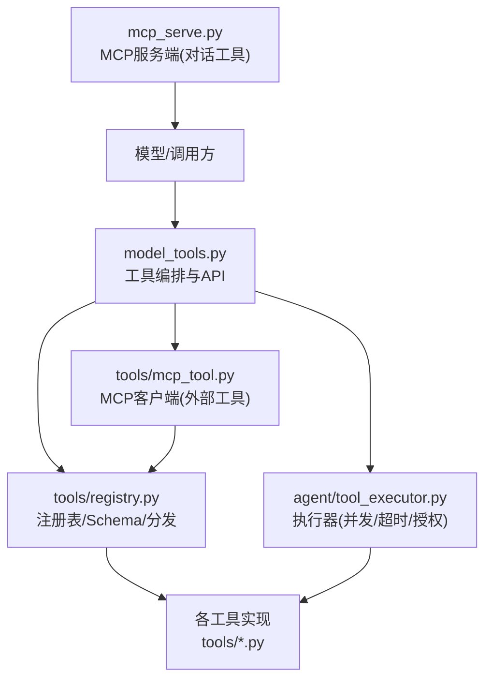
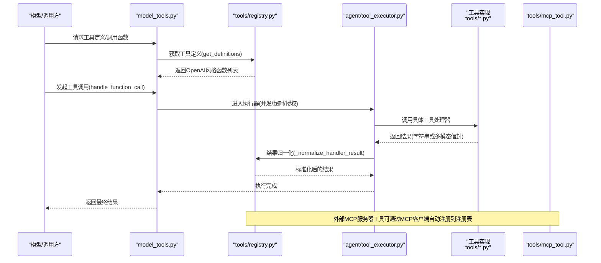
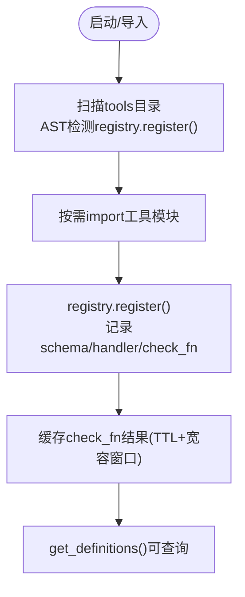
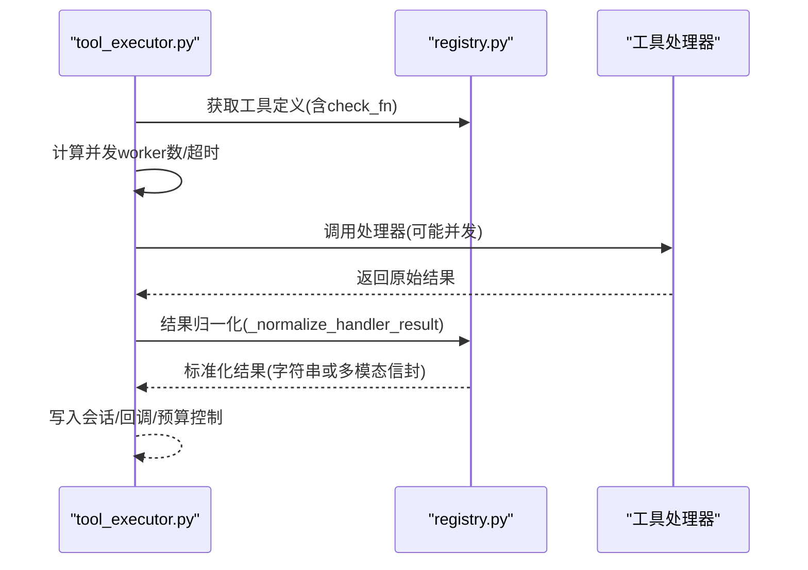
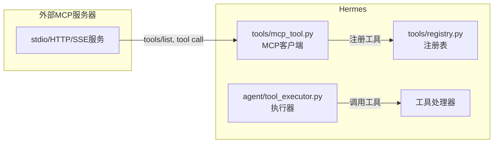
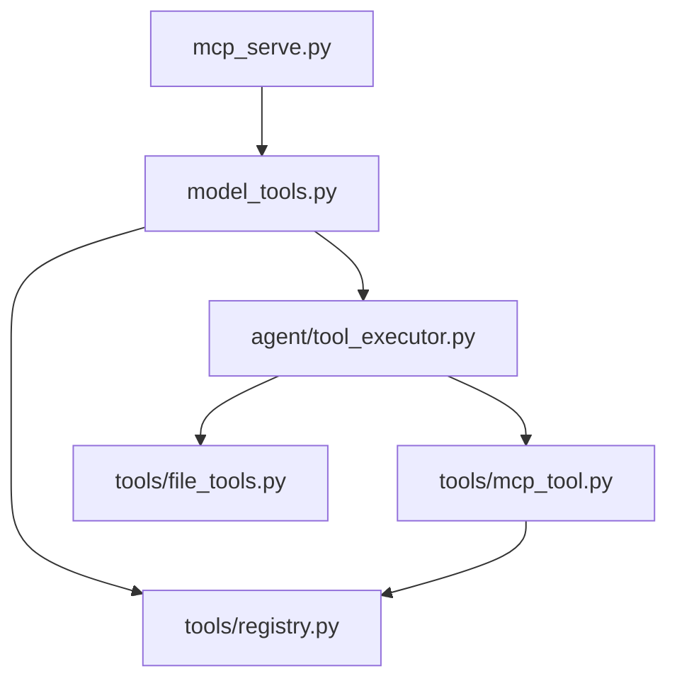

# 自定义工具开发

<cite>
**本文引用的文件**
- [tools/registry.py](file://tools/registry.py)
- [model_tools.py](file://model_tools.py)
- [agent/tool_executor.py](file://agent/tool_executor.py)
- [tools/mcp_tool.py](file://tools/mcp_tool.py)
- [mcp_serve.py](file://mcp_serve.py)
- [tools/file_tools.py](file://tools/file_tools.py)
- [tests/tools/test_terminal_error_redaction.py](file://tests/tools/test_terminal_error_redaction.py)
</cite>

## 目录
1. [简介](#简介)
2. [项目结构](#项目结构)
3. [核心组件](#核心组件)
4. [架构总览](#架构总览)
5. [详细组件分析](#详细组件分析)
6. [依赖关系分析](#依赖关系分析)
7. [性能考量](#性能考量)
8. [故障排查指南](#故障排查指南)
9. [结论](#结论)
10. [附录](#附录)

## 简介
本指南面向希望在 Hermes Agent 中从零开始开发“自定义工具”的开发者。文档围绕以下目标展开：
- 工具开发规范与接口定义（注册、参数校验、异步处理、错误处理）
- 工具注册流程与生命周期（发现、注册、动态刷新、去重与覆盖策略）
- 测试方法、调试技巧与部署策略
- 与 MCP 协议的集成方式（外部 MCP 服务器工具接入、MCP 服务端暴露对话能力）
- 发布与维护建议（版本管理、文档生成、社区贡献流程）

Hermes 的工具系统以“集中式注册表 + 统一执行管线”为核心，所有内置工具通过模块级自注册声明 schema、处理器、可用性与元数据；模型侧仅看到统一的 OpenAI 风格函数定义，由运行时调度到具体实现。

## 项目结构
与自定义工具开发直接相关的代码主要分布在以下位置：
- tools/registry.py：工具注册表、发现、schema 获取、分发边界保护
- model_tools.py：模型层工具编排、同步/异步桥接、对外 API
- agent/tool_executor.py：工具调用执行器（并发、超时、授权门控、结果持久化）
- tools/mcp_tool.py：MCP 客户端支持（连接外部 MCP 服务器并注册为工具）
- mcp_serve.py：MCP 服务端（将对话能力暴露为 MCP 工具）
- tools/file_tools.py：文件操作工具示例（路径解析、安全限制、输出裁剪）
- tests/tools/test_terminal_error_redaction.py：终端工具错误脱敏测试（可作为工具错误处理的参考）

图表来源
- [model_tools.py:1-200](file://model_tools.py#L1-L200)
- [tools/registry.py:1-200](file://tools/registry.py#L1-L200)
- [agent/tool_executor.py:1-200](file://agent/tool_executor.py#L1-L200)
- [tools/mcp_tool.py:1-200](file://tools/mcp_tool.py#L1-L200)
- [mcp_serve.py:1-200](file://mcp_serve.py#L1-L200)

章节来源
- [model_tools.py:1-200](file://model_tools.py#L1-L200)
- [tools/registry.py:1-200](file://tools/registry.py#L1-L200)
- [agent/tool_executor.py:1-200](file://agent/tool_executor.py#L1-L200)
- [tools/mcp_tool.py:1-200](file://tools/mcp_tool.py#L1-L200)
- [mcp_serve.py:1-200](file://mcp_serve.py#L1-L200)

## 核心组件
- 工具注册表（ToolRegistry）
  - 负责收集工具 schema、处理器、可用性检查、工具集别名与覆盖策略
  - 提供 get_definitions() 生成 OpenAI 风格的函数定义列表
  - 提供 register()/deregister() 进行工具增删，支持插件覆盖策略
  - 对 check_fn 可用性探测做 TTL 缓存与瞬态失败宽容
- 模型工具编排（model_tools）
  - 触发内置工具发现、维护事件循环桥接（同步/异步互转）
  - 提供 handle_function_call() 等对外 API
- 工具执行器（tool_executor）
  - 串行/并发执行、批处理、授权门控、人类审批等待排除在批超时之外
  - 结果持久化、预算控制、中断与取消、回调钩子
- MCP 客户端（tools/mcp_tool.py）
  - 连接外部 MCP 服务器（stdio/HTTP/SSE），拉取工具列表并注册到本地注册表
  - 支持重连、保活、环境变量过滤、错误脱敏、描述注入扫描
- MCP 服务端（mcp_serve.py）
  - 暴露对话相关工具（会话列表、消息读取、附件获取、事件轮询等）
  - 后台事件桥接，轮询数据库变更并推送事件队列

章节来源
- [tools/registry.py:200-800](file://tools/registry.py#L200-L800)
- [model_tools.py:1-200](file://model_tools.py#L1-L200)
- [agent/tool_executor.py:1-200](file://agent/tool_executor.py#L1-L200)
- [tools/mcp_tool.py:1-200](file://tools/mcp_tool.py#L1-L200)
- [mcp_serve.py:1-200](file://mcp_serve.py#L1-L200)

## 架构总览
下图展示了从模型调用到工具执行的完整链路，包括注册、发现、执行、结果归一化与 MCP 集成点。

图表来源
- [model_tools.py:1-200](file://model_tools.py#L1-L200)
- [tools/registry.py:700-800](file://tools/registry.py#L700-L800)
- [agent/tool_executor.py:750-800](file://agent/tool_executor.py#L750-L800)
- [tools/mcp_tool.py:1-200](file://tools/mcp_tool.py#L1-L200)

## 详细组件分析

### 工具注册与发现
- 模块级自注册：每个工具文件在导入时调用 registry.register() 声明 name、toolset、schema、handler、check_fn、requires_env、is_async、description、emoji、max_result_size_chars、dynamic_schema_overrides、override 等
- 内置工具发现：discover_builtin_tools() 扫描 tools/*.py，跳过特定文件，AST 检测是否包含顶层 registry.register() 调用，缓存判定结果，按需 import 模块
- 注册表锁与版本：注册/注销使用线程锁，维护 _generation 计数器供外部缓存失效
- 工具集别名：register_toolset_alias() 支持别名映射，便于兼容旧命名
- 插件覆盖策略：register() 支持 override=True，但插件需显式授权才能覆盖内置工具；deregister() 同样受权限约束，MCP 工具集豁免

图表来源
- [tools/registry.py:100-200](file://tools/registry.py#L100-L200)
- [tools/registry.py:200-400](file://tools/registry.py#L200-L400)
- [tools/registry.py:560-700](file://tools/registry.py#L560-L700)

章节来源
- [tools/registry.py:100-200](file://tools/registry.py#L100-L200)
- [tools/registry.py:200-400](file://tools/registry.py#L200-L400)
- [tools/registry.py:560-700](file://tools/registry.py#L560-L700)

### 工具执行与并发控制
- 执行入口：execute_tool_calls_concurrent() 接收 assistant_message.tool_calls，按顺序收集结果
- 批处理与超时：支持并行 worker 上限、图像生成并行度限制、HERMES_CONCURRENT_TOOL_TIMEOUT_S 环境变量控制
- 授权门控：_ConcurrentToolAuthorizationGate 序列化人类审批等待，避免批超时被阻塞
- 结果持久化：_flush_session_db_after_tool_progress() 在破坏性工具前保存进度
- 中断与取消：用户中断时快速返回取消结果，并记录 post-tool-call 钩子

图表来源
- [agent/tool_executor.py:750-800](file://agent/tool_executor.py#L750-L800)
- [tools/registry.py:770-800](file://tools/registry.py#L770-L800)

章节来源
- [agent/tool_executor.py:750-800](file://agent/tool_executor.py#L750-L800)
- [tools/registry.py:770-800](file://tools/registry.py#L770-L800)

### 异步处理与事件循环桥接
- 单例事件循环：_get_tool_loop() 维护主线程持久循环，避免“Event loop is closed”
- 工作线程循环：_get_worker_loop() 为每个工作线程维护独立循环，避免竞争
- 同步到异步：_run_async() 智能选择在新线程创建循环或复用现有循环，支持超时与取消
- 适用场景：工具处理器内部若涉及网络 I/O、异步 SDK，应使用 _run_async() 包装

章节来源
- [model_tools.py:68-200](file://model_tools.py#L68-L200)

### MCP 集成（客户端与服务端）
- 客户端（tools/mcp_tool.py）
  - 支持 stdio、Streamable HTTP、SSE 三种传输
  - 自动发现工具并注册到本地注册表，支持分页 nextCursor
  - 环境变量白名单过滤、错误信息脱敏、描述注入扫描
  - 重连与保活：指数退避、keepalive_interval、parked 重试
- 服务端（mcp_serve.py）
  - 暴露对话能力工具：conversations_list、conversation_get、messages_read、attachments_fetch、events_poll/wait、permissions_*
  - EventBridge 后台轮询 state.db，维护事件队列与 wait 机制

图表来源
- [tools/mcp_tool.py:1-200](file://tools/mcp_tool.py#L1-L200)
- [tools/registry.py:100-200](file://tools/registry.py#L100-L200)
- [agent/tool_executor.py:750-800](file://agent/tool_executor.py#L750-L800)

章节来源
- [tools/mcp_tool.py:1-200](file://tools/mcp_tool.py#L1-L200)
- [mcp_serve.py:1-200](file://mcp_serve.py#L1-L200)

### 工具开发与最佳实践
- 工具文件组织
  - 在 tools/ 下新增 .py 文件，模块级调用 registry.register() 声明工具
  - 明确 toolset、schema、handler、check_fn、requires_env、is_async、description、emoji、max_result_size_chars、dynamic_schema_overrides、override
- 参数验证
  - 在 handler 内对输入进行严格校验，返回结构化错误（字符串 JSON 或工具错误封装）
  - 利用 registry 的错误体截断与 JSON error 字段裁剪，防止超大错误体污染上下文
- 异步处理
  - 若处理器为 async，确保通过 _run_async() 桥接；避免在已有事件循环中嵌套运行新循环
- 错误处理
  - 捕获异常并返回标准错误格式；敏感信息必须脱敏（如密钥、令牌）
  - 使用 tool_error() 或统一错误封装，保证日志与模型可见内容一致
- 资源与性能
  - 合理设置 max_result_size_chars，避免大结果导致上下文溢出
  - 使用 dynamic_schema_overrides 动态调整 schema（如根据配置显示不同限制）
- 安全
  - 避免在工具描述中嵌入可执行指令或敏感提示（MCP 客户端会扫描警告）
  - 环境变量传递遵循白名单策略，防止泄露

章节来源
- [tools/registry.py:200-400](file://tools/registry.py#L200-L400)
- [tools/registry.py:700-800](file://tools/registry.py#L700-L800)
- [tools/mcp_tool.py:490-640](file://tools/mcp_tool.py#L490-L640)
- [model_tools.py:68-200](file://model_tools.py#L68-L200)

### 工具测试方法与调试技巧
- 单元测试要点
  - 模拟外部依赖（环境、进程、网络），验证正常路径与异常路径
  - 验证错误脱敏：确保错误信息不包含密钥、令牌等敏感内容
  - 验证并发与超时：确保批执行不会因单个工具卡死而永久阻塞
- 调试技巧
  - 启用 verbose_logging 查看工具调用预览与参数
  - 使用 post-tool-call 钩子记录执行轨迹与耗时
  - 关注注册表的 check_fn 缓存与宽容窗口，避免瞬态失败导致工具不可用
- 参考测试
  - tests/tools/test_terminal_error_redaction.py 展示了错误脱敏、成功输出保留、异常栈脱敏等用例

章节来源
- [tests/tools/test_terminal_error_redaction.py:1-154](file://tests/tools/test_terminal_error_redaction.py#L1-L154)

### 部署策略
- 内置工具：无需额外配置，启动时自动发现与注册
- 外部 MCP 工具：在配置文件中声明 mcp_servers，指定 command/args/url/transport/timeout 等
- 服务端部署：hermes mcp serve 启动 MCP 服务端，暴露对话能力给 Claude Code、Cursor 等客户端
- 环境变量与安全：使用白名单 env 过滤，避免泄露敏感变量到子进程

章节来源
- [tools/mcp_tool.py:1-200](file://tools/mcp_tool.py#L1-L200)
- [mcp_serve.py:1-200](file://mcp_serve.py#L1-L200)

## 依赖关系分析
- 低耦合高内聚：工具实现仅依赖 registry 与公共工具库，不直接耦合模型层
- 注册表为中心：所有工具通过 registry 统一管理，便于扩展与审计
- 执行器解耦：tool_executor 负责通用执行逻辑，工具处理器专注业务
- MCP 双向集成：客户端将外部工具纳入本地注册表，服务端暴露对话能力

图表来源
- [tools/registry.py:1-200](file://tools/registry.py#L1-L200)
- [agent/tool_executor.py:1-200](file://agent/tool_executor.py#L1-L200)
- [model_tools.py:1-200](file://model_tools.py#L1-L200)
- [tools/file_tools.py:1-200](file://tools/file_tools.py#L1-L200)
- [tools/mcp_tool.py:1-200](file://tools/mcp_tool.py#L1-L200)
- [mcp_serve.py:1-200](file://mcp_serve.py#L1-L200)

章节来源
- [tools/registry.py:1-200](file://tools/registry.py#L1-L200)
- [agent/tool_executor.py:1-200](file://agent/tool_executor.py#L1-L200)
- [model_tools.py:1-200](file://model_tools.py#L1-L200)
- [tools/file_tools.py:1-200](file://tools/file_tools.py#L1-L200)
- [tools/mcp_tool.py:1-200](file://tools/mcp_tool.py#L1-L200)
- [mcp_serve.py:1-200](file://mcp_serve.py#L1-L200)

## 性能考量
- 注册表 check_fn 缓存：TTL 约 30 秒，配合“最近成功宽容窗口”，避免瞬态失败导致工具不可用
- 并发执行：默认最多 8 个 worker，图像生成可单独限制并行度
- 超时控制：HERMES_CONCURRENT_TOOL_TIMEOUT_S 控制批执行超时，避免长时间阻塞
- 结果大小限制：max_result_size_chars 与错误体截断，防止上下文爆炸
- MCP 重连与保活：指数退避、keepalive_interval、parked 重试，提升稳定性

[本节为通用指导，不直接分析具体文件]

## 故障排查指南
- 工具不可用
  - 检查 check_fn 是否返回 True，关注缓存与宽容窗口
  - 查看日志中的“Tool unavailable (check failed)”提示
- 工具执行超时
  - 调整 HERMES_CONCURRENT_TOOL_TIMEOUT_S 或工具自身超时
  - 检查是否存在人类审批等待导致的批超时延长
- 错误信息泄露
  - 确保错误信息经过脱敏，参考终端工具错误脱敏测试
- MCP 连接失败
  - 检查传输类型（stdio/HTTP/SSE）、超时、环境变量白名单
  - 查看 mcp-stderr.log 中的子进程输出

章节来源
- [tools/registry.py:230-400](file://tools/registry.py#L230-L400)
- [agent/tool_executor.py:750-800](file://agent/tool_executor.py#L750-L800)
- [tests/tools/test_terminal_error_redaction.py:1-154](file://tests/tools/test_terminal_error_redaction.py#L1-L154)
- [tools/mcp_tool.py:140-200](file://tools/mcp_tool.py#L140-L200)

## 结论
Hermes 的工具系统提供了完善的注册、发现、执行与 MCP 集成能力。开发者只需遵循注册规范、做好参数验证与错误处理，即可快速构建高质量自定义工具。通过并发控制、超时与缓存机制，系统在可扩展性与稳定性之间取得平衡。结合 MCP 协议，既能接入外部工具，也能将对话能力暴露给第三方客户端，形成强大的生态闭环。

[本节为总结性内容，不直接分析具体文件]

## 附录

### 从零开发一个自定义工具的步骤
1. 在 tools/ 目录下新建工具文件（例如 my_tool.py）
2. 在模块级调用 registry.register() 声明工具元数据与处理器
3. 实现处理器函数，处理参数、执行业务逻辑、返回结果
4. 添加 check_fn 用于可用性探测（可选）
5. 编写单元测试，覆盖正常与异常路径，验证错误脱敏
6. 如需接入外部 MCP 工具，在配置中声明 mcp_servers
7. 启动后通过 get_tool_definitions() 验证工具已注册
8. 部署时注意环境变量白名单与超时配置

章节来源
- [tools/registry.py:560-700](file://tools/registry.py#L560-L700)
- [model_tools.py:1-200](file://model_tools.py#L1-L200)
- [tools/mcp_tool.py:1-200](file://tools/mcp_tool.py#L1-L200)

### 与 MCP 协议的集成方法
- 作为客户端：通过 tools/mcp_tool.py 连接外部 MCP 服务器，自动发现并注册工具
- 作为服务端：通过 mcp_serve.py 暴露对话能力，供 Claude Code、Cursor 等客户端调用
- 配置项：command/args/url/transport/timeout/connect_timeout/keepalive_interval/idle_timeout_seconds/max_lifetime_seconds 等
- 安全：环境变量白名单、错误脱敏、描述注入扫描

章节来源
- [tools/mcp_tool.py:1-200](file://tools/mcp_tool.py#L1-L200)
- [mcp_serve.py:1-200](file://mcp_serve.py#L1-L200)

### 发布与维护指南
- 版本管理：遵循语义化版本，更新 changelog，标注破坏性变更
- 文档生成：基于 schema 与 description 自动生成工具文档
- 社区贡献：提交 PR 前运行测试，确保错误脱敏与并发正确性
- 监控与日志：启用 post-tool-call 钩子，记录执行轨迹与错误
- 回滚策略：注册表支持 deregister()，可临时移除问题工具

[本节为通用指导，不直接分析具体文件]