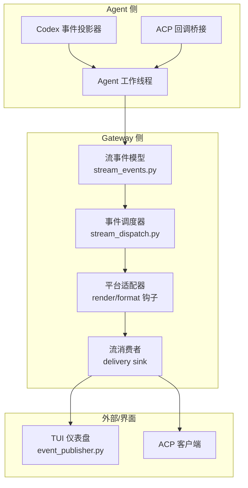
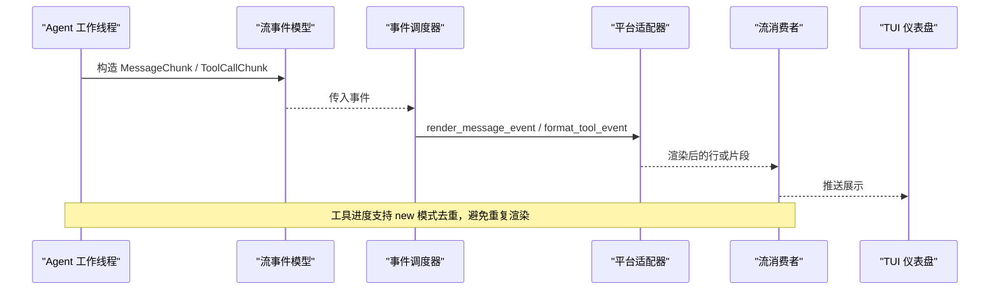
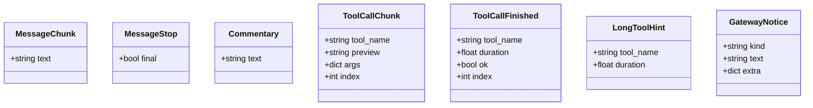
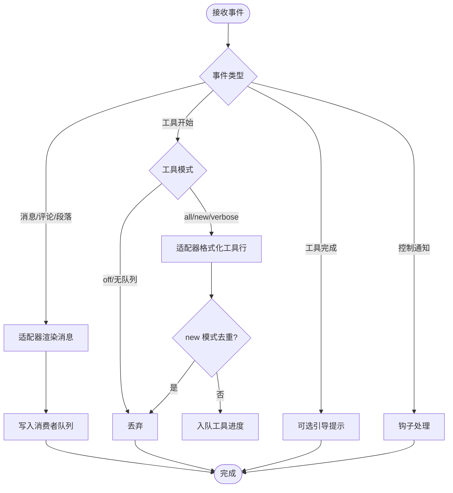
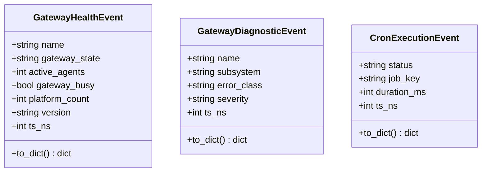
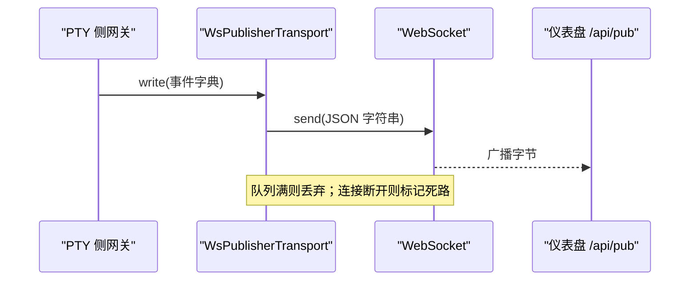
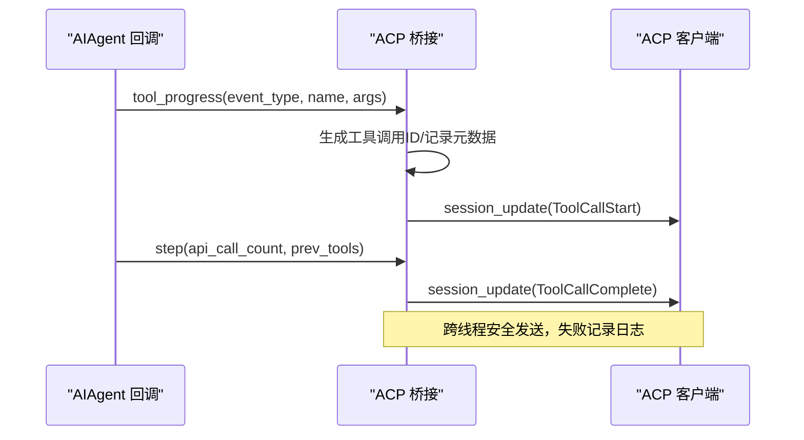
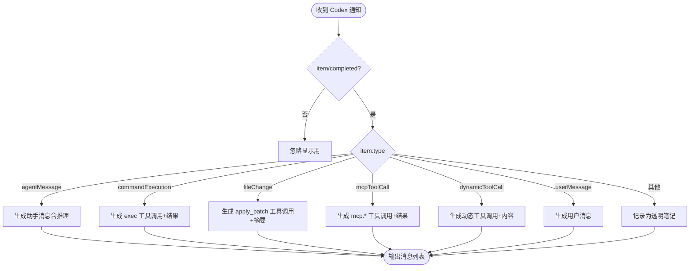
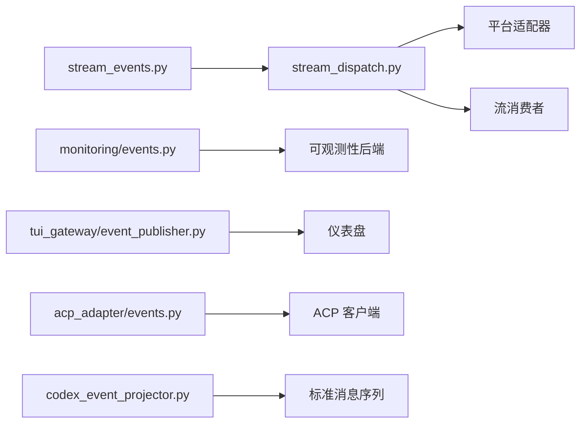
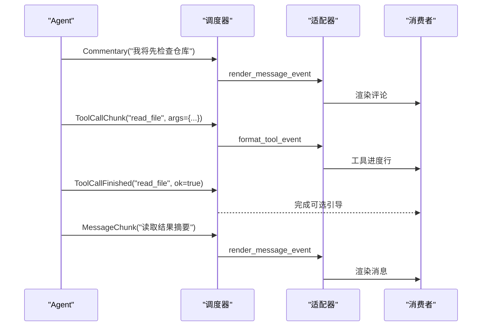

# 事件驱动架构

<cite>
**本文引用的文件**
- [gateway/stream_events.py](file://gateway/stream_events.py)
- [gateway/stream_dispatch.py](file://gateway/stream_dispatch.py)
- [agent/monitoring/events.py](file://agent/monitoring/events.py)
- [tui_gateway/event_publisher.py](file://tui_gateway/event_publisher.py)
- [acp_adapter/events.py](file://acp_adapter/events.py)
- [agent/transports/codex_event_projector.py](file://agent/transports/codex_event_projector.py)
</cite>

## 目录
1. [简介](#简介)
2. [项目结构](#项目结构)
3. [核心组件](#核心组件)
4. [架构总览](#架构总览)
5. [详细组件分析](#详细组件分析)
6. [依赖关系分析](#依赖关系分析)
7. [性能考虑](#性能考虑)
8. [故障恢复与可观测性](#故障恢复与可观测性)
9. [结论](#结论)
10. [附录：事件流示例与扩展指南](#附录：事件流示例与扩展指南)

## 简介
本文件系统性梳理 Hermes 的事件驱动架构，聚焦以下方面：
- 事件总线设计：以“结构化、类型化”的流式事件为核心，解耦智能体（Agent）与网关（Gateway）之间的呈现与投递逻辑。
- 事件类型定义：消息片段、工具调用、控制通知等统一为不可变数据类，便于跨线程/进程传递。
- 发布订阅机制：通过调度器将事件路由到平台适配器的渲染钩子，再由消费者队列投递到具体渠道。
- 处理器注册：适配器提供渲染方法；调度器持有适配器与消费者，按事件类型分发。
- 异步处理与排序保证：事件在 Agent 工作线程生成，经同步调度器进入 Gateway 消费队列；工具进度采用“新工具去重”模式避免重复渲染。
- 持久化与重放：流事件仅用于呈现层，不写入会话历史；会话历史由 Agent 侧维护，支持回放与一致性。
- 自定义事件开发、过滤器、聚合与溯源：基于类型化事件与投影器实现可扩展的事件生态。
- 复杂业务场景：结合 Codex 事件投影、ACP 通知桥接、TUI 事件发布等端到端流程。
- 扩展性、性能与故障恢复：无阻塞、降级、丢弃策略与监控诊断事件保障稳定性。

## 项目结构
Hermes 的事件系统横跨多个子系统：
- 事件模型：gateway/stream_events.py 定义流式事件类型。
- 事件调度：gateway/stream_dispatch.py 负责将事件分派到适配器渲染与消费者。
- 监控事件：agent/monitoring/events.py 定义健康与诊断事件。
- TUI 事件发布：tui_gateway/event_publisher.py 将 PTY 侧事件通过 WebSocket 回推至仪表盘。
- ACP 桥接：acp_adapter/events.py 将 AIAgent 回调转换为 ACP 通知。
- 事件投影：agent/transports/codex_event_projector.py 将外部事件投影为 Hermes 消息序列。

**图表来源**
- [gateway/stream_events.py:1-172](file://gateway/stream_events.py#L1-L172)
- [gateway/stream_dispatch.py:1-133](file://gateway/stream_dispatch.py#L1-L133)
- [tui_gateway/event_publisher.py:1-127](file://tui_gateway/event_publisher.py#L1-L127)
- [acp_adapter/events.py:1-280](file://acp_adapter/events.py#L1-L280)
- [agent/transports/codex_event_projector.py:1-315](file://agent/transports/codex_event_projector.py#L1-L315)

**章节来源**
- [gateway/stream_events.py:1-172](file://gateway/stream_events.py#L1-L172)
- [gateway/stream_dispatch.py:1-133](file://gateway/stream_dispatch.py#L1-L133)
- [tui_gateway/event_publisher.py:1-127](file://tui_gateway/event_publisher.py#L1-L127)
- [acp_adapter/events.py:1-280](file://acp_adapter/events.py#L1-L280)
- [agent/transports/codex_event_projector.py:1-315](file://agent/transports/codex_event_projector.py#L1-L315)

## 核心组件
- 流事件模型：MessageChunk、MessageStop、Commentary、ToolCallChunk、ToolCallFinished、LongToolHint、GatewayNotice，均为冻结数据类，轻量且线程安全。
- 事件调度器：GatewayEventDispatcher，按事件类型路由到适配器渲染或消费者；支持工具进度模式（all/new/verbose/off）与预览长度限制。
- 监控事件：GatewayHealthEvent、GatewayDiagnosticEvent、CronExecutionEvent，内容脱敏，面向可观测性。
- TUI 事件发布：WsPublisherTransport，基于 WebSocket 的尽力而为传输，队列满时丢弃，失败短路，不阻塞主循环。
- ACP 桥接：将 AIAgent 的工具开始/完成、思考文本、助手消息等回调转换为 ACP session_update，跨线程安全发送。
- 事件投影：CodexEventProjector 将外部 item/* 通知投影为标准消息序列，保持 Hermes 的消息交替不变式。

**章节来源**
- [gateway/stream_events.py:41-159](file://gateway/stream_events.py#L41-L159)
- [gateway/stream_dispatch.py:40-133](file://gateway/stream_dispatch.py#L40-L133)
- [agent/monitoring/events.py:15-87](file://agent/monitoring/events.py#L15-L87)
- [tui_gateway/event_publisher.py:40-127](file://tui_gateway/event_publisher.py#L40-L127)
- [acp_adapter/events.py:87-280](file://acp_adapter/events.py#L87-L280)
- [agent/transports/codex_event_projector.py:55-315](file://agent/transports/codex_event_projector.py#L55-L315)

## 架构总览
Hermes 的事件驱动架构遵循“生产者—调度器—适配器—消费者”的分层：
- 生产者：Agent 工作线程产生结构化事件；外部事件通过投影器转为标准消息。
- 调度器：GatewayEventDispatcher 根据事件类型与配置进行分发，必要时执行去重与过滤。
- 适配器：平台特定渲染逻辑，决定如何呈现工具进度、消息片段与控制通知。
- 消费者：GatewayStreamConsumer 负责实际投递（如 Telegram 原生草稿、编辑内联等）。

**图表来源**
- [gateway/stream_events.py:41-159](file://gateway/stream_events.py#L41-L159)
- [gateway/stream_dispatch.py:88-133](file://gateway/stream_dispatch.py#L88-L133)
- [tui_gateway/event_publisher.py:90-127](file://tui_gateway/event_publisher.py#L90-L127)

## 详细组件分析

### 流事件模型（gateway/stream_events.py）
- 设计约束：事件描述“传输”，不携带上下文；不持久化到会话历史；向后兼容。
- 事件类型：
  - 消息片段：MessageChunk（增量文本）、MessageStop（段落结束）、Commentary（完整中间消息）。
  - 工具调用：ToolCallChunk（开始/进行中）、ToolCallFinished（完成，含时长与成功标志）。
  - 控制通知：LongToolHint（长任务提示）、GatewayNotice（重启/在线/长运行通知）。
- 数据结构：冻结数据类，适合跨线程/异步边界传递，开销低。

**图表来源**
- [gateway/stream_events.py:41-159](file://gateway/stream_events.py#L41-L159)

**章节来源**
- [gateway/stream_events.py:1-172](file://gateway/stream_events.py#L1-L172)

### 事件调度器（gateway/stream_dispatch.py）
- 职责：将事件路由到适配器渲染与消费者；支持工具进度模式与预览长度；对异常隔离，确保不会破坏 Agent 循环。
- 关键行为：
  - 消息/评论/段落：直接交给适配器渲染并送入消费者。
  - 工具开始：根据模式（all/new/verbose/off）决定是否输出；new 模式下仅当工具变化才输出。
  - 工具完成：默认不渲染 chrome，但可用于引导提示。
  - 控制通知：通过钩子交由 Gateway 决策是否展示。

**图表来源**
- [gateway/stream_dispatch.py:88-133](file://gateway/stream_dispatch.py#L88-L133)

**章节来源**
- [gateway/stream_dispatch.py:1-133](file://gateway/stream_dispatch.py#L1-L133)

### 监控事件（agent/monitoring/events.py）
- 目的：服务健康快照与诊断事件，内容脱敏，不包含敏感信息。
- 事件类型：
  - GatewayHealthEvent：网关状态、活跃代理数、平台计数、版本等。
  - GatewayDiagnosticEvent：子系统错误、严重级别、来源日志等。
  - CronExecutionEvent：定时任务执行生命周期。

**图表来源**
- [agent/monitoring/events.py:15-87](file://agent/monitoring/events.py#L15-L87)

**章节来源**
- [agent/monitoring/events.py:1-87](file://agent/monitoring/events.py#L1-L87)

### TUI 事件发布（tui_gateway/event_publisher.py）
- 目标：将 PTY 侧网关的事件通过 WebSocket 回推到仪表盘，供侧边栏展示。
- 特性：
  - 尽力而为：队列满时丢弃，连接死亡后短路后续写入。
  - 后台线程：write 返回即入队，不阻塞主循环。
  - 协议：换行分隔的 JSON 字典，与调度器 write 形状一致。

**图表来源**
- [tui_gateway/event_publisher.py:40-127](file://tui_gateway/event_publisher.py#L40-L127)

**章节来源**
- [tui_gateway/event_publisher.py:1-127](file://tui_gateway/event_publisher.py#L1-L127)

### ACP 桥接（acp_adapter/events.py）
- 目标：将 AIAgent 的回调（工具进度、思考、步骤、消息）转换为 ACP 的 session_update。
- 关键点：
  - 工具开始：生成唯一 ID，记录元数据，必要时捕获编辑快照。
  - 工具完成：匹配开始 ID，发送完成更新；todo 工具触发计划更新。
  - 跨线程：使用安全调度将更新发送到主事件循环。

**图表来源**
- [acp_adapter/events.py:114-280](file://acp_adapter/events.py#L114-L280)

**章节来源**
- [acp_adapter/events.py:1-280](file://acp_adapter/events.py#L1-L280)

### 事件投影（agent/transports/codex_event_projector.py）
- 目标：将 Codex 的 item/* 通知投影为 Hermes 的标准消息序列，保持消息交替不变式。
- 能力：
  - 用户/助手消息、推理内容、命令执行、文件变更、MCP/动态工具调用。
  - 稳定工具调用 ID，支持回放与缓存有效性。
  - 未知项记录为透明助手笔记，便于记忆审查。

**图表来源**
- [agent/transports/codex_event_projector.py:55-315](file://agent/transports/codex_event_projector.py#L55-L315)

**章节来源**
- [agent/transports/codex_event_projector.py:1-315](file://agent/transports/codex_event_projector.py#L1-L315)

## 依赖关系分析
- 耦合度：
  - 事件模型与调度器强耦合（类型枚举），但通过适配器接口解耦平台细节。
  - 监控事件独立于流事件，面向可观测性。
  - TUI 发布与 ACP 桥接作为下游消费者，依赖调度器/投影器输出的标准化格式。
- 外部依赖：
  - WebSocket（TUI 仪表盘）。
  - ACP 客户端（编辑器集成）。
  - Codex 运行时（外部事件源）。

**图表来源**
- [gateway/stream_events.py:1-172](file://gateway/stream_events.py#L1-L172)
- [gateway/stream_dispatch.py:1-133](file://gateway/stream_dispatch.py#L1-L133)
- [agent/monitoring/events.py:1-87](file://agent/monitoring/events.py#L1-L87)
- [tui_gateway/event_publisher.py:1-127](file://tui_gateway/event_publisher.py#L1-L127)
- [acp_adapter/events.py:1-280](file://acp_adapter/events.py#L1-L280)
- [agent/transports/codex_event_projector.py:1-315](file://agent/transports/codex_event_projector.py#L1-L315)

**章节来源**
- [gateway/stream_events.py:1-172](file://gateway/stream_events.py#L1-L172)
- [gateway/stream_dispatch.py:1-133](file://gateway/stream_dispatch.py#L1-L133)
- [agent/monitoring/events.py:1-87](file://agent/monitoring/events.py#L1-L87)
- [tui_gateway/event_publisher.py:1-127](file://tui_gateway/event_publisher.py#L1-L127)
- [acp_adapter/events.py:1-280](file://acp_adapter/events.py#L1-L280)
- [agent/transports/codex_event_projector.py:1-315](file://agent/transports/codex_event_projector.py#L1-L315)

## 性能考虑
- 事件模型轻量：冻结数据类，构造成本低，适合高频流式事件。
- 调度器无异步：在 Agent 工作线程同步分发，避免阻塞与竞态。
- 工具进度去重：new 模式下仅当工具变化才输出，减少冗余渲染。
- TUI 发布尽力而为：队列满丢弃、连接失败短路，不阻塞主循环。
- 监控事件脱敏：避免敏感数据泄露，降低审计成本。

[本节为通用指导，无需特定文件引用]

## 故障恢复与可观测性
- 故障恢复：
  - 调度器捕获异常并记录调试日志，确保 Agent 循环不被破坏。
  - TUI 发布在连接失败后标记死路，后续写入短路，避免堆积。
  - 监控事件持续上报网关健康与诊断信息，便于自动告警与自愈。
- 可观测性：
  - GatewayHealthEvent/GatewayDiagnosticEvent/CronExecutionEvent 提供健康快照与错误定位。
  - 工具完成事件可用于一次性引导提示（如长任务后建议 verbose）。

**章节来源**
- [gateway/stream_dispatch.py:88-133](file://gateway/stream_dispatch.py#L88-L133)
- [tui_gateway/event_publisher.py:90-127](file://tui_gateway/event_publisher.py#L90-L127)
- [agent/monitoring/events.py:15-87](file://agent/monitoring/events.py#L15-L87)

## 结论
Hermes 的事件驱动架构通过类型化事件、解耦的调度器与适配器、以及多通道消费者，实现了高内聚、低耦合的事件处理体系。其设计强调：
- 呈现与上下文分离：流事件仅用于展示，历史由 Agent 维护，保证回放一致性。
- 可扩展性：新增事件类型只需扩展调度器分支与适配器渲染逻辑。
- 鲁棒性：异常隔离、尽力而为传输、监控诊断事件保障系统稳定。
- 实用性：支持复杂业务场景（Codex 投影、ACP 桥接、TUI 发布），满足多平台差异化需求。

[本节为总结，无需特定文件引用]

## 附录：事件流示例与扩展指南

### 复杂业务场景：工具调用与消息流
- 场景：助手先输出评论，再发起工具调用，完成后继续输出消息。
- 流程：
  - 生成 Commentary（完整中间消息）。
  - 生成 ToolCallChunk（开始），适配器根据平台渲染工具进度。
  - 生成 ToolCallFinished（完成），Gateway 可能触发引导提示。
  - 生成 MessageChunk/MessageStop（后续消息）。

**图表来源**
- [gateway/stream_events.py:41-159](file://gateway/stream_events.py#L41-L159)
- [gateway/stream_dispatch.py:88-133](file://gateway/stream_dispatch.py#L88-L133)

### 自定义事件开发
- 步骤：
  - 在 stream_events.py 中新增冻结数据类，明确字段与语义。
  - 在 stream_dispatch.py 中添加分支处理，决定渲染或钩子调用。
  - 在适配器中实现对应渲染逻辑（如平台特有格式）。
  - 在消费者中处理最终投递。
- 注意事项：
  - 保持向后兼容：新增字段不应破坏旧版消费者。
  - 避免在事件中携带上下文：上下文应由 Agent 历史管理。

**章节来源**
- [gateway/stream_events.py:1-172](file://gateway/stream_events.py#L1-L172)
- [gateway/stream_dispatch.py:1-133](file://gateway/stream_dispatch.py#L1-L133)

### 事件过滤器与聚合
- 过滤器：
  - 工具模式（all/new/verbose/off）控制输出粒度。
  - 预览长度限制（preview_max_len）控制工具参数展示大小。
- 聚合：
  - Codex 投影器将多个 item 聚合为标准消息序列，保持消息交替不变式。
  - ACP 桥接将工具开始/完成聚合为一次完整的工具调用视图。

**章节来源**
- [gateway/stream_dispatch.py:67-133](file://gateway/stream_dispatch.py#L67-L133)
- [agent/transports/codex_event_projector.py:55-315](file://agent/transports/codex_event_projector.py#L55-L315)
- [acp_adapter/events.py:114-280](file://acp_adapter/events.py#L114-L280)

### 事件溯源模式
- 原则：流事件不持久化到会话历史；历史由 Agent 维护，支持回放与一致性。
- 实践：
  - 投影器将外部事件转为标准消息，便于记忆审查与回放。
  - 监控事件提供操作审计与健康回溯。

**章节来源**
- [gateway/stream_events.py:1-33](file://gateway/stream_events.py#L1-L33)
- [agent/transports/codex_event_projector.py:1-315](file://agent/transports/codex_event_projector.py#L1-L315)
- [agent/monitoring/events.py:1-87](file://agent/monitoring/events.py#L1-L87)