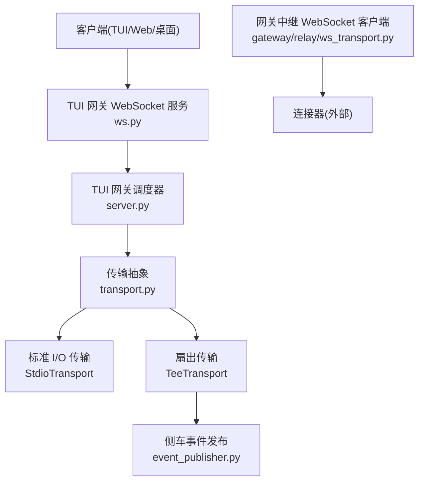
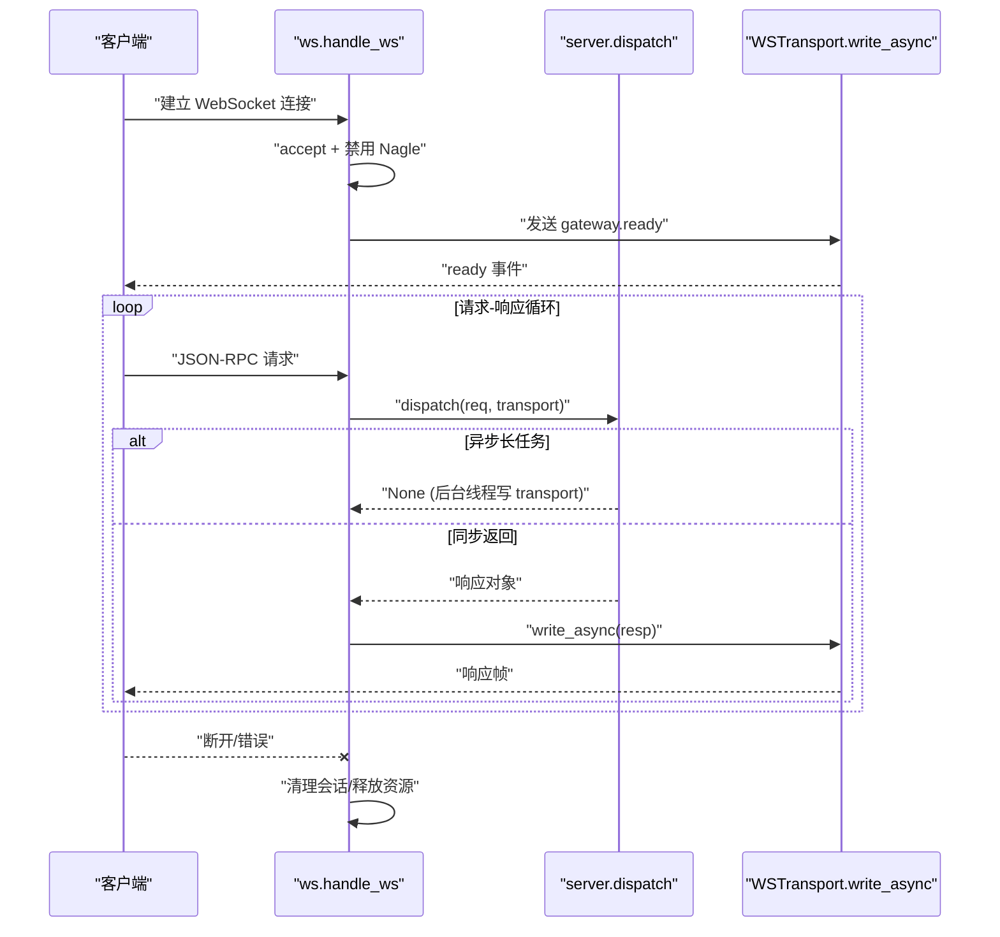
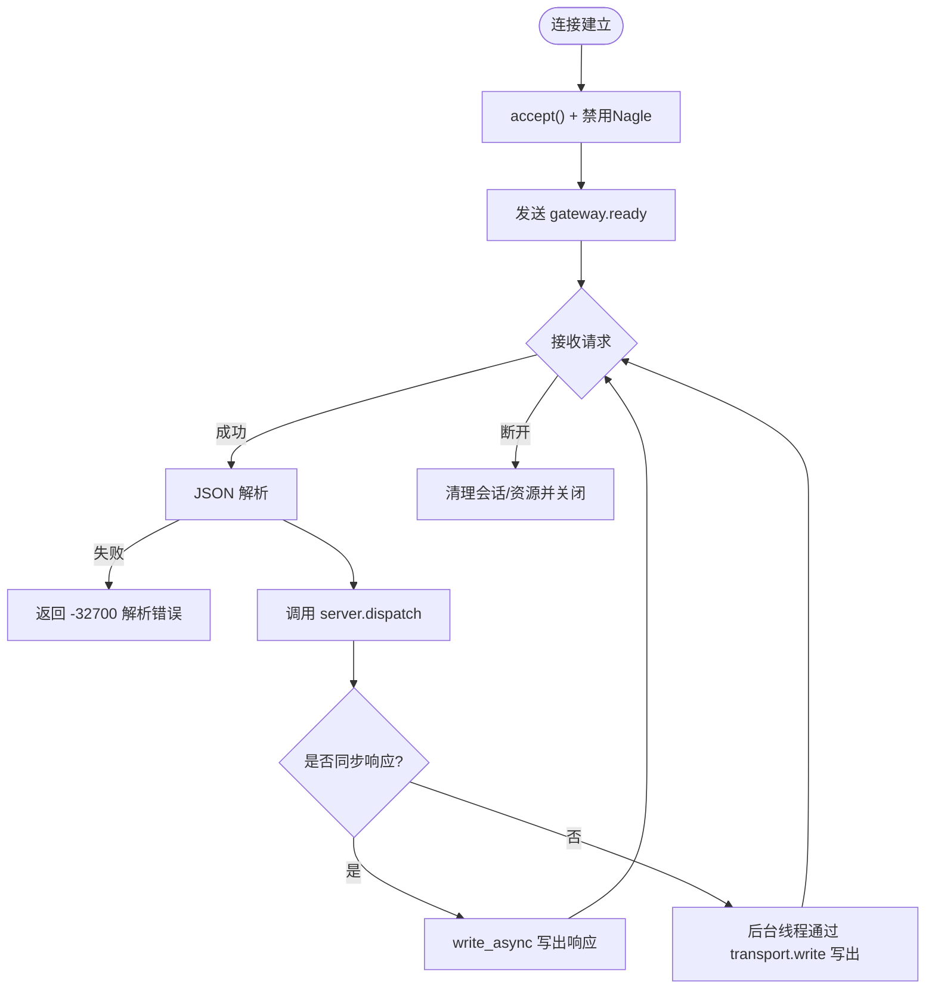
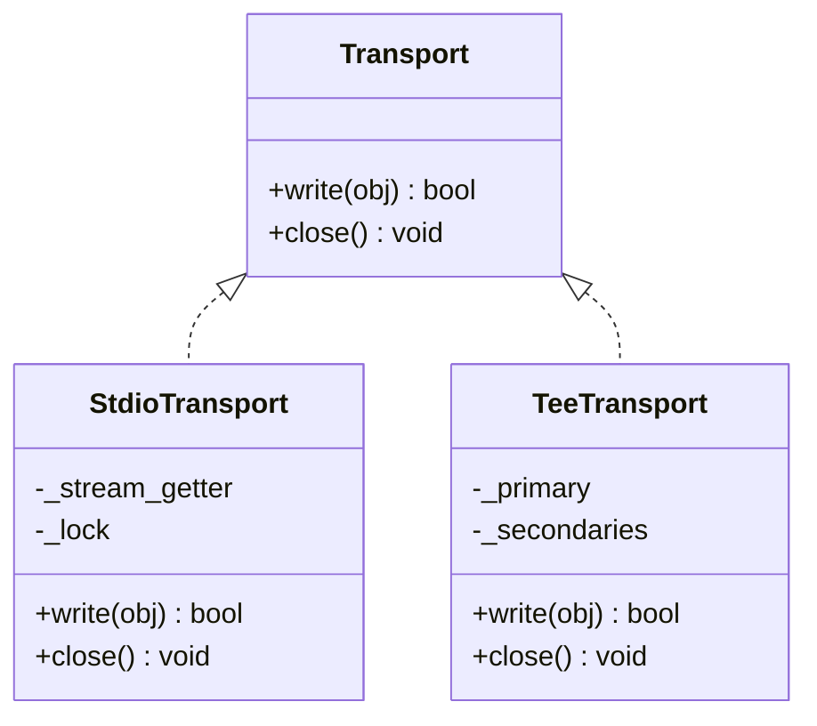
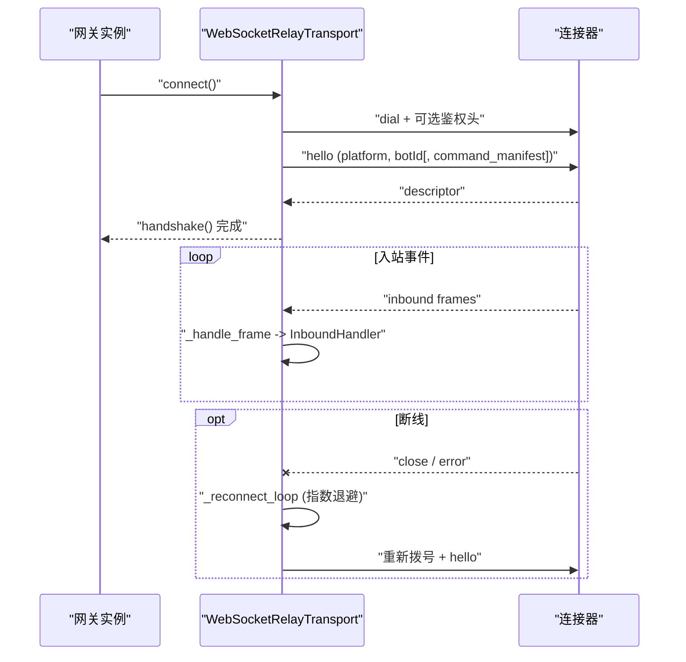
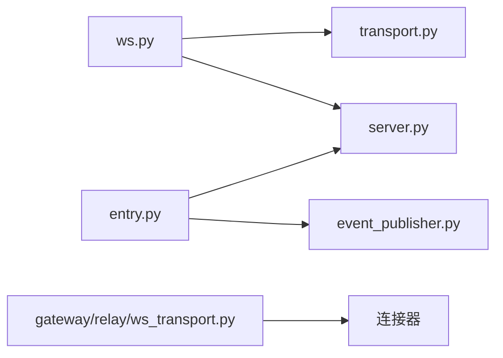

# WebSocket 通信

<cite>
**本文引用的文件**
- [tui_gateway/ws.py](file://tui_gateway/ws.py)
- [tui_gateway/server.py](file://tui_gateway/server.py)
- [tui_gateway/transport.py](file://tui_gateway/transport.py)
- [tui_gateway/event_publisher.py](file://tui_gateway/event_publisher.py)
- [tui_gateway/entry.py](file://tui_gateway/entry.py)
- [gateway/relay/ws_transport.py](file://gateway/relay/ws_transport.py)
</cite>

## 目录
1. [简介](#简介)
2. [项目结构](#项目结构)
3. [核心组件](#核心组件)
4. [架构总览](#架构总览)
5. [详细组件分析](#详细组件分析)
6. [依赖关系分析](#依赖关系分析)
7. [性能与背压](#性能与背压)
8. [故障排查指南](#故障排查指南)
9. [结论](#结论)
10. [附录：协议与安全](#附录协议与安全)

## 简介
本文件系统性梳理 Hermes 的 WebSocket 通信机制，覆盖连接建立、维护与关闭的全生命周期；实时数据流的消息路由、事件分发与背压控制；连接池与重连策略（面向网关到连接器）；心跳与健康检查（结合守护进程与信号处理）；以及消息序列化格式、协议版本兼容性与安全考虑。文档同时给出 TUI 网关的 WebSocket 服务器与流式消费者示例说明，并提供监控、调优与常见问题排查建议。

## 项目结构
Hermes 的 WebSocket 能力主要分布在两个层面：
- TUI 网关层：提供 JSON-RPC over WebSocket 的服务端，负责会话管理、方法分发、事件广播与流式输出聚合。
- 网关中继层：作为客户端通过 WebSocket 连接到外部连接器，实现平台消息的入站/出站转发、握手认证、断线重连与休眠恢复。

**图示来源**
- [tui_gateway/ws.py:286-477](file://tui_gateway/ws.py#L286-L477)
- [tui_gateway/server.py:184-296](file://tui_gateway/server.py#L184-L296)
- [tui_gateway/transport.py:100-220](file://tui_gateway/transport.py#L100-L220)
- [tui_gateway/event_publisher.py:40-127](file://tui_gateway/event_publisher.py#L40-L127)
- [gateway/relay/ws_transport.py:339-541](file://gateway/relay/ws_transport.py#L339-L541)

**章节来源**
- [tui_gateway/ws.py:1-477](file://tui_gateway/ws.py#L1-L477)
- [tui_gateway/server.py:1-800](file://tui_gateway/server.py#L1-L800)
- [tui_gateway/transport.py:1-220](file://tui_gateway/transport.py#L1-L220)
- [tui_gateway/event_publisher.py:1-127](file://tui_gateway/event_publisher.py#L1-L127)
- [tui_gateway/entry.py:1-491](file://tui_gateway/entry.py#L1-L491)
- [gateway/relay/ws_transport.py:1-800](file://gateway/relay/ws_transport.py#L1-L800)

## 核心组件
- TUI 网关 WebSocket 处理器：负责接受连接、发送就绪事件、解析 JSON-RPC 请求、调用调度器并写回响应或错误。
- 传输抽象：统一 stdio 与 WebSocket 写入路径，支持主从扇出（TeeTransport），并定义“对端消失”的错误语义。
- 事件发布传输：将网关事件镜像到仪表板侧车 WebSocket，用于侧边栏实时展示。
- 网关中继 WebSocket 客户端：与连接器建立长连接，完成握手、入站事件分发、出站请求响应、断线重连、休眠恢复与鉴权吊销处理。

**章节来源**
- [tui_gateway/ws.py:70-256](file://tui_gateway/ws.py#L70-L256)
- [tui_gateway/transport.py:66-220](file://tui_gateway/transport.py#L66-L220)
- [tui_gateway/event_publisher.py:40-127](file://tui_gateway/event_publisher.py#L40-L127)
- [gateway/relay/ws_transport.py:339-800](file://gateway/relay/ws_transport.py#L339-L800)

## 架构总览
TUI 网关以 WebSocket 暴露 JSON-RPC 接口，所有方法、命令、审批/澄清/sudo 流程均复用同一调度器。服务端在连接建立后立即推送 gateway.ready 事件，随后进入请求-响应循环。对于高频 token 流，采用按类型识别的帧合并与定时器批量刷新，避免频繁唤醒事件循环。

**图示来源**
- [tui_gateway/ws.py:286-477](file://tui_gateway/ws.py#L286-L477)
- [tui_gateway/server.py:184-296](file://tui_gateway/server.py#L184-L296)

**章节来源**
- [tui_gateway/ws.py:286-477](file://tui_gateway/ws.py#L286-L477)
- [tui_gateway/server.py:184-296](file://tui_gateway/server.py#L184-L296)

## 详细组件分析

### TUI 网关 WebSocket 服务器（ws.py）
- 连接建立：接受连接后禁用 Nagle，发送 gateway.ready（包含 skin 与 change_events 标志），注册 live transport 以便全局广播。
- 请求处理：读取文本行，JSON 解析失败时返回 -32700 错误；调用 server.dispatch，若为异步长任务则不阻塞读循环；同步响应通过 write_async 写出。
- 流式优化：对 message.delta/reasoning.delta/thinking.delta 等高频帧进行缓冲合并，定时器约 33ms 批量刷新，保持顺序且降低事件循环压力。
- 关闭与清理：注销 live transport，关闭 WSTransport，释放唤醒词相关资源，回收/分离会话，记录统计信息。

**图示来源**
- [tui_gateway/ws.py:286-477](file://tui_gateway/ws.py#L286-L477)

**章节来源**
- [tui_gateway/ws.py:70-256](file://tui_gateway/ws.py#L70-L256)
- [tui_gateway/ws.py:286-477](file://tui_gateway/ws.py#L286-L477)

### 传输抽象与扇出（transport.py）
- StdioTransport：将 JSON 帧写入 stdout，区分“对端消失”错误（如 EPIPE/ECONNRESET），其他异常上抛以便崩溃日志记录。
- TeeTransport：将写入扇出到主通道与一个或多个次要通道（例如侧车 WS），主通道决定结果，次要通道失败被吞掉以避免阻塞主路径。
- 上下文绑定：通过 contextvar 绑定当前请求的传输，使 handler 可跨线程安全地写回正确对端。

**图示来源**
- [tui_gateway/transport.py:66-220](file://tui_gateway/transport.py#L66-L220)

**章节来源**
- [tui_gateway/transport.py:1-220](file://tui_gateway/transport.py#L1-L220)

### 事件发布传输（event_publisher.py）
- 用途：将 TUI 网关的事件镜像到仪表板的侧车 WebSocket，供侧边栏订阅展示。
- 行为：连接失败即标记为 dead；写入走队列+后台线程，满队丢弃；关闭时停止工作线程并关闭 socket。

**章节来源**
- [tui_gateway/event_publisher.py:1-127](file://tui_gateway/event_publisher.py#L1-L127)

### 网关中继 WebSocket 客户端（gateway/relay/ws_transport.py）
- 连接与握手：标准化 URL，可选鉴权头，发送 hello（含多身份声明），等待 descriptor 完成握手。
- 入站处理：读取 newline-delimited JSON 帧，转换为 MessageEvent 并交给 InboundHandler。
- 出站请求：为每个 outbound 分配 requestId，等待 outbound_result 响应，超时返回错误。
- 重连策略：意外断开时启动重连监督任务，指数退避；支持休眠模式（go_dormant）与恢复（重新拨号后连接器回放缓冲）。
- 鉴权吊销：收到 4401 且已握手成功则视为凭证吊销，停止重连并上报 disabled 状态。

**图示来源**
- [gateway/relay/ws_transport.py:339-800](file://gateway/relay/ws_transport.py#L339-L800)

**章节来源**
- [gateway/relay/ws_transport.py:1-800](file://gateway/relay/ws_transport.py#L1-L800)

### 守护进程与信号处理（entry.py）
- 信号处理：忽略 SIGPIPE，捕获 SIGTERM/SIGHUP/SIGBREAK/SIGINT，记录堆栈并优雅退出。
- 优雅关闭：设置 grace 时间，先尝试正常关闭（flush 会话、释放资源），超时后强制退出防止死锁。
- 侧车发布：根据环境变量启用侧车事件发布，将网关事件镜像到仪表板。

**章节来源**
- [tui_gateway/entry.py:1-491](file://tui_gateway/entry.py#L1-L491)

## 依赖关系分析
- ws.py 依赖 server.py 的 dispatch 与皮肤解析，依赖 transport.py 的传输抽象。
- entry.py 初始化侧车发布，安装信号处理，启动 MCP 工具发现（后台线程）。
- relay/ws_transport.py 依赖 websockets 库（可选导入），实现与连接器的协议交互。

**图示来源**
- [tui_gateway/ws.py:286-477](file://tui_gateway/ws.py#L286-L477)
- [tui_gateway/entry.py:48-65](file://tui_gateway/entry.py#L48-L65)
- [gateway/relay/ws_transport.py:339-541](file://gateway/relay/ws_transport.py#L339-L541)

**章节来源**
- [tui_gateway/ws.py:286-477](file://tui_gateway/ws.py#L286-L477)
- [tui_gateway/entry.py:48-65](file://tui_gateway/entry.py#L48-L65)
- [gateway/relay/ws_transport.py:339-541](file://gateway/relay/ws_transport.py#L339-L541)

## 性能与背压
- 流式帧合并：对高频 delta 事件进行缓冲与定时批量刷新，显著减少事件循环唤醒次数，提升 GUI 流畅度。
- 非阻塞写：WSTransport 在非事件循环线程中通过 future 等待写操作，设置超时保护，避免长时间阻塞 worker 线程。
- 扇出传输：TeeTransport 确保主通道不受次要通道阻塞影响，提高整体吞吐。
- 重连退避：中继客户端使用指数退避与休眠模式，避免雪崩与无效重试。

[本节为通用性能讨论，不直接分析具体文件]

## 故障排查指南
- 解析错误：当 JSON 解析失败时，服务端返回 -32700 错误并继续运行；检查客户端发送的帧格式。
- 分发崩溃：dispatch 抛出异常时返回 -32603 内部错误；查看 tui_gateway_crash.log 获取堆栈。
- 发送失败：write/write_async 失败会记录 peer 与错误类型；检查网络与对端状态。
- 对端消失：StdioTransport 识别 EPIPE/ECONNRESET 等错误并返回 False，入口程序据此优雅退出。
- 信号与退出：SIGPIPE 忽略，SIGTERM/SIGHUP 记录堆栈并尝试优雅关闭；若卡住，grace 超时后强制退出。
- 中继鉴权吊销：连接器返回 4401 且已握手成功，视为凭证吊销，不再重连；需重新配置或重建实例。

**章节来源**
- [tui_gateway/ws.py:359-418](file://tui_gateway/ws.py#L359-L418)
- [tui_gateway/transport.py:114-180](file://tui_gateway/transport.py#L114-L180)
- [tui_gateway/entry.py:89-171](file://tui_gateway/entry.py#L89-L171)
- [gateway/relay/ws_transport.py:745-775](file://gateway/relay/ws_transport.py#L745-L775)

## 结论
Hermes 的 WebSocket 通信在 TUI 网关与中继层分别实现了高可靠、高性能的实时数据传输。TUI 网关通过 JSON-RPC over WebSocket 提供统一的 RPC 接口，配合流式帧合并与扇出传输保障低延迟与高吞吐；中继客户端实现健壮的重连、休眠恢复与鉴权吊销处理，确保与外部连接器的稳定对接。通过完善的错误处理、信号管理与监控指标，系统具备良好的可观测性与可维护性。

[本节为总结，不直接分析具体文件]

## 附录：协议与安全
- 协议格式：
  - TUI 网关：newline-delimited JSON-RPC 2.0，方向一致；gateway.ready 事件包含 skin 与 change_events 标志。
  - 中继层：自定义帧类型（hello/descriptor/inbound/outbound/outbound_result/interrupt/interrupt_inbound），newline-delimited JSON。
- 版本兼容：
  - 未知字段或消息类型通常降级为默认值，保证向前兼容。
  - 多平台 hello 与 descriptor 累积，允许新平台逐步接入。
- 安全考虑：
  - 中继升级头携带签名令牌（Bearer），连接器校验后拒绝未授权连接（4401）。
  - 敏感信息在错误与日志中进行脱敏处理（参考终端工具错误脱敏测试）。
  - 输入验证与错误码明确（-32700/-32603），便于客户端正确处理。

**章节来源**
- [tui_gateway/ws.py:8-12](file://tui_gateway/ws.py#L8-L12)
- [gateway/relay/ws_transport.py:1-28](file://gateway/relay/ws_transport.py#L1-L28)
- [gateway/relay/ws_transport.py:486-501](file://gateway/relay/ws_transport.py#L486-L501)