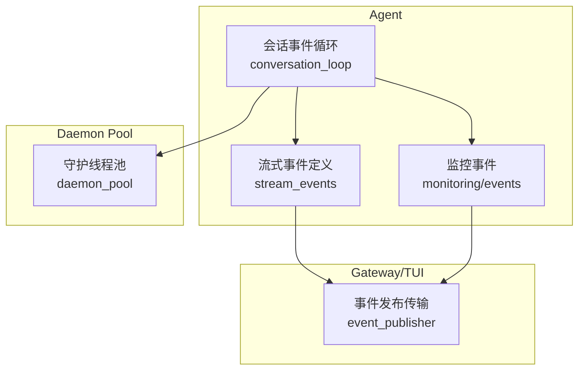
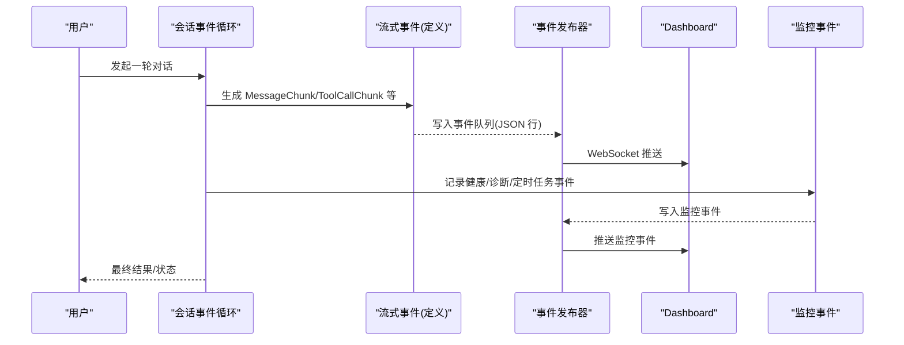
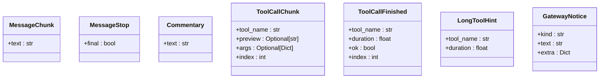
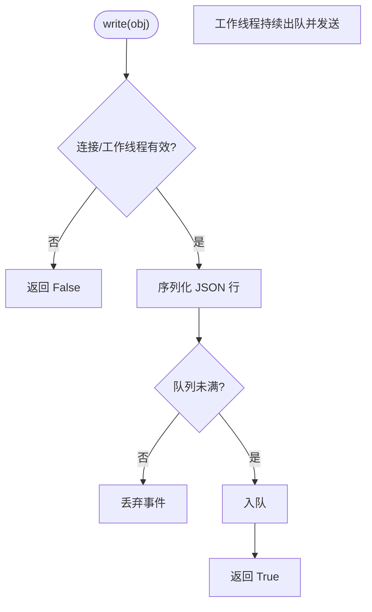
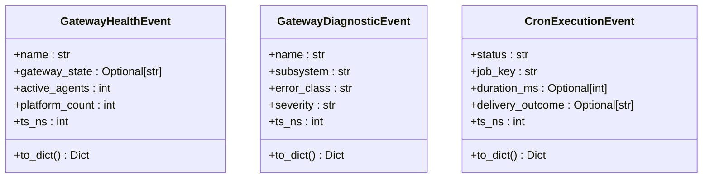
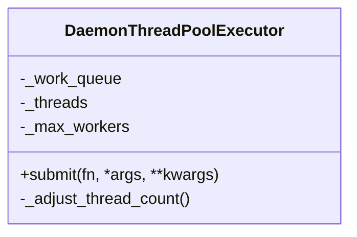
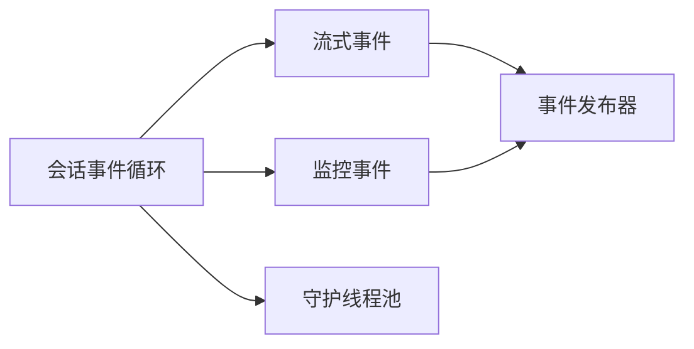

# 事件驱动架构

<cite>
**本文引用的文件**
- [tools/daemon_pool.py](file://tools/daemon_pool.py)
- [gateway/stream_events.py](file://gateway/stream_events.py)
- [tui_gateway/event_publisher.py](file://tui_gateway/event_publisher.py)
- [agent/monitoring/events.py](file://agent/monitoring/events.py)
- [agent/conversation_loop.py](file://agent/conversation_loop.py)
</cite>

## 目录
1. [简介](#简介)
2. [项目结构](#项目结构)
3. [核心组件](#核心组件)
4. [架构总览](#架构总览)
5. [详细组件分析](#详细组件分析)
6. [依赖关系分析](#依赖关系分析)
7. [性能考量](#性能考量)
8. [故障排查指南](#故障排查指南)
9. [结论](#结论)
10. [附录](#附录)

## 简介
本文件系统性阐述 Hermes 的事件驱动架构，围绕以下主题展开：
- 基于事件的异步编程模式：事件发布-订阅、事件队列管理、处理器注册与调度。
- 守护进程池实现原理：线程/进程隔离、任务分发、资源管理与退出行为。
- 事件循环与工作流：会话级事件循环、任务调度策略与并发控制。
- 典型示例：后台任务管理、异步 I/O、回调处理与流式输出。
- 可观测性：事件追踪、调试技巧与性能分析方法。
- 最佳实践与常见陷阱。

## 项目结构
Hermes 将“事件”作为跨进程、跨模块的通用契约，主要涉及：
- 流式事件定义（Agent→Gateway）：用于描述模型输出、工具调用等结构化事件。
- 事件发布传输（TUI Gateway→Dashboard）：通过 WebSocket 将 PTY 侧网关事件转发到前端。
- 监控事件（Gateway 守护进程）：健康状态、诊断与定时任务执行事件。
- 会话事件循环：驱动一次用户对话的完整生命周期。
- 守护进程池：提供不会阻塞进程退出的后台线程池，支撑并发工具执行与后台任务。



图表来源
- [agent/conversation_loop.py:1-200](file://agent/conversation_loop.py#L1-L200)
- [gateway/stream_events.py:1-172](file://gateway/stream_events.py#L1-L172)
- [tui_gateway/event_publisher.py:1-127](file://tui_gateway/event_publisher.py#L1-L127)
- [agent/monitoring/events.py:1-87](file://agent/monitoring/events.py#L1-L87)
- [tools/daemon_pool.py:1-65](file://tools/daemon_pool.py#L1-L65)

章节来源
- [agent/conversation_loop.py:1-200](file://agent/conversation_loop.py#L1-L200)
- [gateway/stream_events.py:1-172](file://gateway/stream_events.py#L1-L172)
- [tui_gateway/event_publisher.py:1-127](file://tui_gateway/event_publisher.py#L1-L127)
- [agent/monitoring/events.py:1-87](file://agent/monitoring/events.py#L1-L87)
- [tools/daemon_pool.py:1-65](file://tools/daemon_pool.py#L1-L65)

## 核心组件
- 流式事件模型：以不可变数据类表达消息片段、工具调用开始/结束、提示与网关通知等，解耦“发生了什么”和“如何呈现”。
- 事件发布传输：在 PTY 侧网关中，使用带缓冲队列的 WebSocket 发布器，将事件以 JSON 行协议推送到 Dashboard。
- 监控事件：面向运维的健康快照、诊断与定时任务执行事件，内容脱敏且无业务上下文。
- 会话事件循环：驱动一次用户请求从上下文构建、模型调用、工具执行、重试与压缩到收尾的全流程。
- 守护线程池：基于标准库线程池改造的守护线程池，避免挂起线程阻止解释器退出，适合后台任务与工具并发执行。

章节来源
- [gateway/stream_events.py:1-172](file://gateway/stream_events.py#L1-L172)
- [tui_gateway/event_publisher.py:1-127](file://tui_gateway/event_publisher.py#L1-L127)
- [agent/monitoring/events.py:1-87](file://agent/monitoring/events.py#L1-L87)
- [agent/conversation_loop.py:1-200](file://agent/conversation_loop.py#L1-L200)
- [tools/daemon_pool.py:1-65](file://tools/daemon_pool.py#L1-L65)

## 架构总览
下图展示了 Agent 内部事件循环如何产生结构化事件，并通过 TUI Gateway 的事件发布器转发到 Dashboard；同时，Gateway 自身也发出监控事件供运维观察。



图表来源
- [agent/conversation_loop.py:1-200](file://agent/conversation_loop.py#L1-L200)
- [gateway/stream_events.py:1-172](file://gateway/stream_events.py#L1-L172)
- [tui_gateway/event_publisher.py:1-127](file://tui_gateway/event_publisher.py#L1-L127)
- [agent/monitoring/events.py:1-87](file://agent/monitoring/events.py#L1-L87)

## 详细组件分析

### 流式事件模型（Agent→Gateway 交付契约）
- 设计目标：仅描述“发生了什么”，不绑定具体平台渲染逻辑；历史由 Agent 持久化，事件是展示层流。
- 事件类型：消息片段、消息停止、评论文本、工具调用开始/结束、长任务提示、网关通知等。
- 优势：向后兼容、类型安全、易于消费端分派；便于不同平台差异化呈现。



图表来源
- [gateway/stream_events.py:41-159](file://gateway/stream_events.py#L41-L159)

章节来源
- [gateway/stream_events.py:1-172](file://gateway/stream_events.py#L1-L172)

### 事件发布传输（PTY 侧网关 → Dashboard）
- 工作模式：启动时建立到 Dashboard 的后向 WebSocket 连接；事件以 JSON 行协议写入固定容量队列，由守护工作线程串行发送。
- 失败模式：静默降级；连接断开后后续写入短路返回；队列满时丢弃新事件，确保主循环不被阻塞。
- 关闭流程：发送停止标记并等待工作线程退出，最后关闭连接。



图表来源
- [tui_gateway/event_publisher.py:40-127](file://tui_gateway/event_publisher.py#L40-L127)

章节来源
- [tui_gateway/event_publisher.py:1-127](file://tui_gateway/event_publisher.py#L1-L127)

### 监控事件（Gateway 守护进程）
- 健康事件：包含网关状态、活跃代理数、平台计数、版本信息等，用于健康检查与告警。
- 诊断事件：子系统错误分类、严重级别、来源日志等，用于可观测性与排障。
- 定时任务事件：任务键、状态、耗时、投递结果等，用于审计与回溯。



图表来源
- [agent/monitoring/events.py:19-80](file://agent/monitoring/events.py#L19-L80)

章节来源
- [agent/monitoring/events.py:1-87](file://agent/monitoring/events.py#L1-L87)

### 会话事件循环（一次用户对话的生命周期）
- 职责：构建上下文、调用模型、分发工具、重试与压缩、收尾与后置钩子、后台记忆/技能提醒等。
- 并发点：工具执行、I/O 操作、压缩与统计等通常交由后台线程或异步任务完成。
- 事件集成：在关键阶段产出流式事件与监控事件，保证可观测性与用户体验。

```mermaid
sequenceDiagram
participant Loop as "会话事件循环"
participant Model as "模型服务"
participant Tools as "工具执行"
participant Stream as "流式事件"
participant Mon as "监控事件"
Loop->>Loop : 构建上下文/压缩
Loop->>Model : 发起模型调用
Model-->>Loop : 增量输出
Loop->>Stream : 发送 MessageChunk/Commentary
Loop->>Tools : 触发工具调用
Tools-->>Loop : 结果/错误
Loop->>Stream : 发送 ToolCallChunk/Finished
Loop->>Mon : 记录健康/诊断/定时任务
Loop-->>Loop : 收尾/后置钩子
```

图表来源
- [agent/conversation_loop.py:1-200](file://agent/conversation_loop.py#L1-L200)
- [gateway/stream_events.py:41-159](file://gateway/stream_events.py#L41-L159)
- [agent/monitoring/events.py:19-80](file://agent/monitoring/events.py#L19-L80)

章节来源
- [agent/conversation_loop.py:1-200](file://agent/conversation_loop.py#L1-L200)

### 守护线程池（后台任务与工具并发）
- 动机：标准线程池的工作线程非守护，退出时会尝试 join，可能因网络 I/O 或卡住的任务导致进程长时间无法退出。
- 方案：使用守护线程并重写线程创建逻辑，避免被 atexit 钩子强制等待；适用于“尽力而为”的后台任务。
- 适用场景：并发工具执行、后台内存同步、目录扫描、子代理超时包装等。



图表来源
- [tools/daemon_pool.py:37-65](file://tools/daemon_pool.py#L37-L65)

章节来源
- [tools/daemon_pool.py:1-65](file://tools/daemon_pool.py#L1-L65)

## 依赖关系分析
- 会话事件循环依赖流式事件模型与监控事件模型，负责编排与产出。
- 事件发布器依赖 WebSocket 客户端与队列，负责将事件可靠地（尽力而为）发送到 Dashboard。
- 守护线程池为会话循环与工具执行提供不会阻塞进程退出的并发能力。
- 各事件类型之间松耦合，消费端按类型分派，扩展新事件只需新增类型并在消费处处理。



图表来源
- [agent/conversation_loop.py:1-200](file://agent/conversation_loop.py#L1-L200)
- [gateway/stream_events.py:1-172](file://gateway/stream_events.py#L1-L172)
- [agent/monitoring/events.py:1-87](file://agent/monitoring/events.py#L1-L87)
- [tui_gateway/event_publisher.py:1-127](file://tui_gateway/event_publisher.py#L1-L127)
- [tools/daemon_pool.py:1-65](file://tools/daemon_pool.py#L1-L65)

章节来源
- [agent/conversation_loop.py:1-200](file://agent/conversation_loop.py#L1-L200)
- [gateway/stream_events.py:1-172](file://gateway/stream_events.py#L1-L172)
- [agent/monitoring/events.py:1-87](file://agent/monitoring/events.py#L1-L87)
- [tui_gateway/event_publisher.py:1-127](file://tui_gateway/event_publisher.py#L1-L127)
- [tools/daemon_pool.py:1-65](file://tools/daemon_pool.py#L1-L65)

## 性能考量
- 事件序列化与队列：事件发布器使用固定大小队列与守护工作线程，避免阻塞主循环；队列满时丢弃事件，保障稳定性。
- 守护线程池：避免进程退出时被挂起线程阻塞，提升 CLI/Gateway 退出速度。
- 流式事件：增量推送减少 UI 抖动与延迟，提高交互体验。
- 监控事件：轻量、无业务上下文，降低开销，便于高频上报。

[本节为通用指导，无需特定文件引用]

## 故障排查指南
- 事件未到达 Dashboard：
  - 检查 WebSocket 连接是否成功建立；若失败，发布器会置死标志并短路后续写入。
  - 关注队列是否频繁 Full，必要时调整队列上限或优化事件频率。
- 进程退出缓慢：
  - 确认是否使用了守护线程池；非守护线程可能导致解释器退出时长时间等待。
- 流式显示异常：
  - 核对事件类型是否正确分派；MessageStop 的 final 字段决定段落边界。
- 监控指标缺失：
  - 检查监控事件是否在关键路径上被记录；确认 to_dict 输出格式正确。

章节来源
- [tui_gateway/event_publisher.py:40-127](file://tui_gateway/event_publisher.py#L40-L127)
- [tools/daemon_pool.py:1-65](file://tools/daemon_pool.py#L1-L65)
- [gateway/stream_events.py:41-159](file://gateway/stream_events.py#L41-L159)
- [agent/monitoring/events.py:19-80](file://agent/monitoring/events.py#L19-L80)

## 结论
Hermes 的事件驱动架构通过清晰的类型化事件、松耦合的发布-订阅机制与稳健的传输通道，实现了高内聚、低耦合的异步系统。会话事件循环负责编排复杂工作流，守护线程池保障后台任务的并发与进程退出效率，流式与监控事件提供端到端的可观测性。遵循本文的最佳实践与注意事项，可在保证稳定性的同时获得良好的性能与可维护性。

[本节为总结，无需特定文件引用]

## 附录

### 事件驱动示例
- 后台任务管理：使用守护线程池提交后台任务，避免阻塞主循环与进程退出。
- 异步 I/O 操作：在会话循环中发起模型调用与工具执行，通过流式事件逐步反馈进度。
- 回调处理：消费端根据事件类型进行分派，平台适配器决定呈现方式。

章节来源
- [tools/daemon_pool.py:1-65](file://tools/daemon_pool.py#L1-L65)
- [agent/conversation_loop.py:1-200](file://agent/conversation_loop.py#L1-L200)
- [gateway/stream_events.py:41-159](file://gateway/stream_events.py#L41-L159)

### 最佳实践
- 事件只描述“发生了什么”，不携带业务上下文；历史由 Agent 持久化。
- 使用不可变数据结构定义事件，便于跨线程/进程传递。
- 对 I/O 与后台任务使用守护线程池，避免进程退出阻塞。
- 事件发布采用尽力而为模式，队列满时丢弃，确保主循环不被阻塞。
- 监控事件保持轻量与脱敏，便于高频上报与合规。

[本节为通用指导，无需特定文件引用]

### 常见陷阱
- 在非守护线程中执行长耗时任务，导致进程退出缓慢。
- 在事件中包含敏感信息或过大负载，影响传输与存储。
- 忽略事件消费端的类型分派完整性，新增事件未覆盖导致静默失败。
- 过度依赖事件顺序，应通过 index 等字段做幂等与去重。

[本节为通用指导，无需特定文件引用]