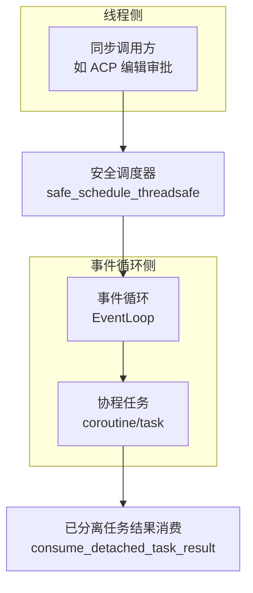
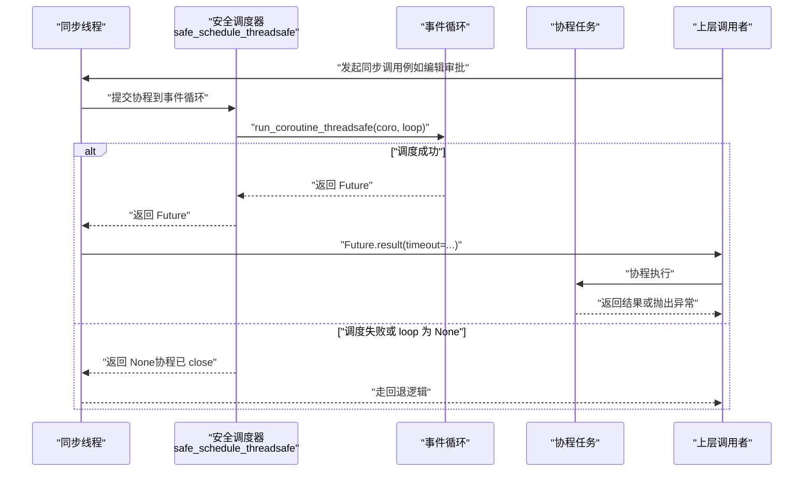
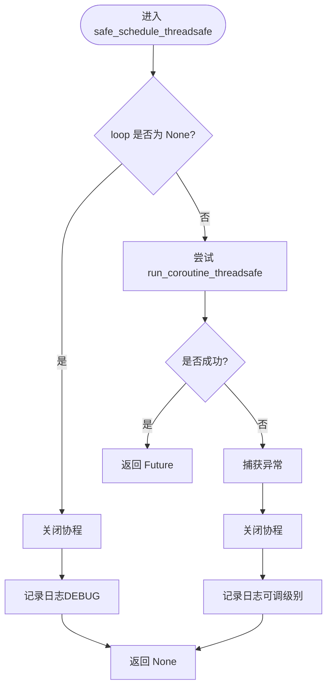
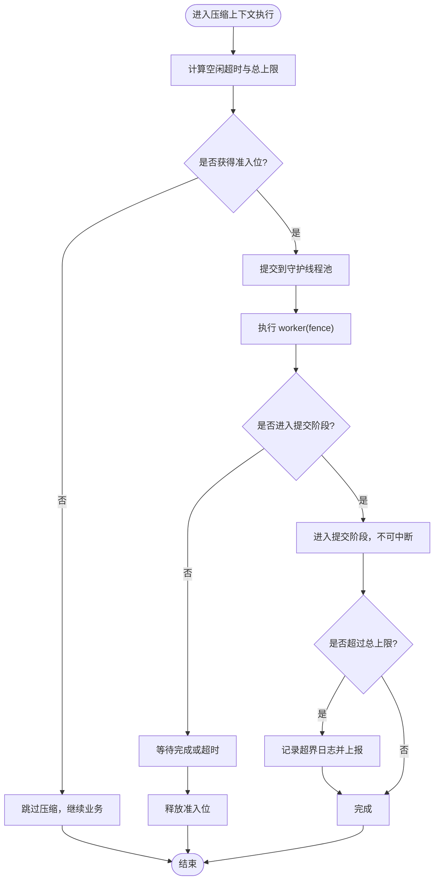
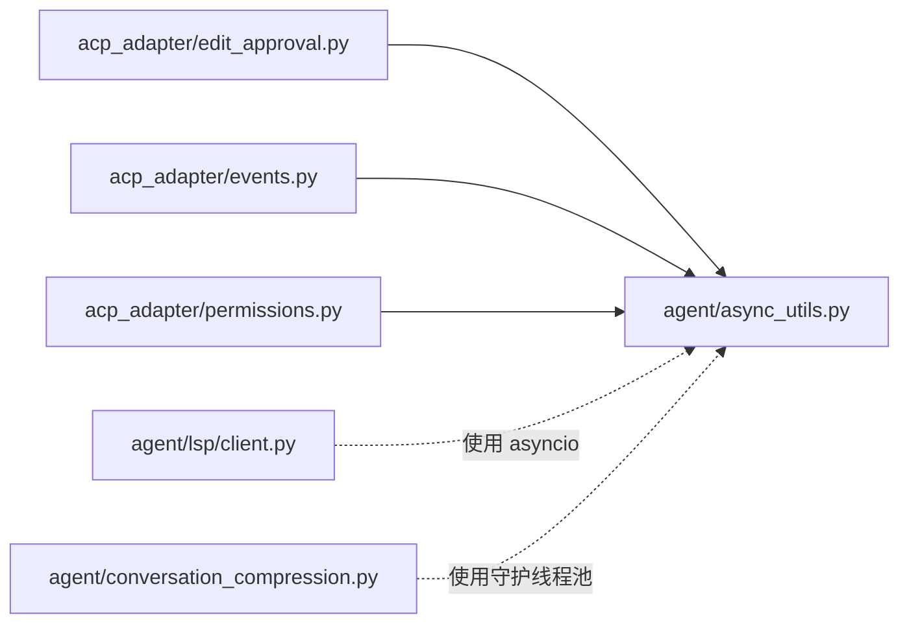

# 协程管理

<cite>
**本文引用的文件**
- [agent/async_utils.py](file://agent/async_utils.py)
- [acp_adapter/edit_approval.py](file://acp_adapter/edit_approval.py)
- [acp_adapter/events.py](file://acp_adapter/events.py)
- [acp_adapter/permissions.py](file://acp_adapter/permissions.py)
- [agent/lsp/client.py](file://agent/lsp/client.py)
- [agent/conversation_compression.py](file://agent/conversation_compression.py)
</cite>

## 目录
1. [简介](#简介)
2. [项目结构](#项目结构)
3. [核心组件](#核心组件)
4. [架构总览](#架构总览)
5. [详细组件分析](#详细组件分析)
6. [依赖关系分析](#依赖关系分析)
7. [性能考量](#性能考量)
8. [故障排查指南](#故障排查指南)
9. [结论](#结论)
10. [附录](#附录)

## 简介
本文件聚焦 Hermes 项目中基于 asyncio 的协程生命周期管理与线程安全调度机制，重点解析 safe_schedule_threadsafe 的设计与使用场景，并覆盖任务取消、超时处理、错误传播、资源清理与内存泄漏防护。同时给出协程与同步代码桥接的实践模式，以及在多线程环境中安全调度协程的方法，附带调试技巧与性能优化建议。

## 项目结构
围绕协程管理的核心实现集中在以下模块：
- agent/async_utils.py：提供从同步线程向事件循环安全调度协程的工具函数，以及“已分离任务结果消费”辅助方法，避免未获取异常导致的噪音。
- acp_adapter/*：在编辑审批、权限校验、事件回调等场景中，将同步调用桥接到异步协程，并通过 safe_schedule_threadsafe 完成线程安全调度。
- agent/lsp/client.py：展示 LSP 客户端对协程任务的创建、取消、超时控制与优雅关闭流程。
- agent/conversation_compression.py：演示在同步阻塞路径中使用带进度感知的超时执行器，结合守护线程池与“准入控制”，防止队列膨胀和进程退出阻塞。



**图表来源**
- [agent/async_utils.py:34-68](file://agent/async_utils.py#L34-L68)
- [agent/async_utils.py:71-85](file://agent/async_utils.py#L71-L85)
- [acp_adapter/edit_approval.py:295-339](file://acp_adapter/edit_approval.py#L295-L339)

**章节来源**
- [agent/async_utils.py:1-85](file://agent/async_utils.py#L1-L85)
- [acp_adapter/edit_approval.py:290-339](file://acp_adapter/edit_approval.py#L290-L339)

## 核心组件
- 安全线程调度器 safe_schedule_threadsafe
  - 作用：从同步线程将协程提交到指定事件循环；若失败或 loop 为 None，则关闭协程并返回 None，避免“从未被 await 的协程”警告与帧泄漏。
  - 关键点：捕获 run_coroutine_threadsafe 抛出的异常；在异常路径关闭协程；日志可配置级别与消息。
- 已分离任务结果消费 consume_detached_task_result
  - 作用：用于 add_done_callback 消费已取消或已结束的 detached task 的结果/异常，吞掉 CancelledError 与一般异常，避免事件循环噪音。
- 同步到异步桥接示例（ACP 编辑审批）
  - 通过 safe_schedule_threadsafe 将 request_permission_fn 协程提交到事件循环，并在 Future 上设置超时等待结果；失败时记录日志并回退。
- LSP 客户端的任务与超时
  - 使用 asyncio.create_task 启动后台任务；shutdown 中取消并等待任务结束；使用 asyncio.wait_for 进行请求超时控制；优雅终止子进程。
- 压缩上下文执行的超时与资源保护
  - 使用守护线程池执行耗时同步任务；采用“空闲超时 + 总上限”双预算；提交前进行“准入控制”，防止队列无限增长；进入提交阶段后不可中断，但会记录超界日志。

**章节来源**
- [agent/async_utils.py:34-85](file://agent/async_utils.py#L34-L85)
- [acp_adapter/edit_approval.py:295-339](file://acp_adapter/edit_approval.py#L295-L339)
- [agent/lsp/client.py:420-506](file://agent/lsp/client.py#L420-L506)
- [agent/conversation_compression.py:690-889](file://agent/conversation_compression.py#L690-L889)

## 架构总览
下图展示了从同步线程发起协程调度的端到端流程，包括安全调度、事件循环执行、超时与取消、以及结果消费的完整链路。



**图表来源**
- [agent/async_utils.py:34-68](file://agent/async_utils.py#L34-L68)
- [acp_adapter/edit_approval.py:318-331](file://acp_adapter/edit_approval.py#L318-L331)

## 详细组件分析

### 安全线程调度器 safe_schedule_threadsafe
- 设计要点
  - 防御性检查：loop 为 None 时直接关闭协程并返回 None。
  - 异常安全：捕获 run_coroutine_threadsafe 抛出的异常（如循环关闭），关闭协程并返回 None。
  - 可观测性：支持自定义 logger、日志消息与级别。
  - 职责边界：不处理 future.result() 的失败，交由调用方决定后续策略。
- 复杂度
  - 时间复杂度：O(1) 调度操作。
  - 空间复杂度：O(1)，仅持有 Future 引用。
- 错误处理
  - 调度失败：关闭协程，避免“从未被 await 的协程”警告与帧泄漏。
  - 日志输出：记录失败原因，便于定位。
- 适用场景
  - 从工作线程向主事件循环提交协程（如 ACP 编辑审批、权限校验、事件回调）。
  - 需要避免协程泄漏且允许失败快速回退的场景。



**图表来源**
- [agent/async_utils.py:34-68](file://agent/async_utils.py#L34-L68)

**章节来源**
- [agent/async_utils.py:34-68](file://agent/async_utils.py#L34-L68)

### 同步到异步桥接：ACP 编辑审批
- 流程说明
  - 构造权限选项与工具调用描述。
  - 生成协程 request_permission_fn(...)。
  - 通过 safe_schedule_threadsafe 提交到事件循环。
  - 在 Future 上设置超时等待结果；失败时记录警告并返回 False。
  - 根据响应 outcome 判断是否自动批准。
- 关键保障
  - 线程安全：跨线程调度协程。
  - 超时控制：避免长时间阻塞同步调用。
  - 资源安全：调度失败时协程被关闭，无泄漏风险。

```mermaid
sequenceDiagram
participant Caller as "同步调用方"
participant Bridge as "安全调度器"
participant Loop as "事件循环"
participant Coro as "request_permission_fn"
Caller->>Bridge : "提交协程"
Bridge->>Loop : "run_coroutine_threadsafe"
Loop-->>Bridge : "返回 Future"
Bridge-->>Caller : "返回 Future"
Caller->>Caller : "Future.result(timeout=...)"
Caller->>Coro : "协程执行"
Coro-->>Caller : "返回结果或异常"
Note over Caller,Bridge : "超时或失败时记录警告并回退"
```

**图表来源**
- [acp_adapter/edit_approval.py:295-339](file://acp_adapter/edit_approval.py#L295-L339)
- [agent/async_utils.py:34-68](file://agent/async_utils.py#L34-L68)

**章节来源**
- [acp_adapter/edit_approval.py:290-339](file://acp_adapter/edit_approval.py#L290-L339)
- [agent/async_utils.py:34-68](file://agent/async_utils.py#L34-L68)

### LSP 客户端：任务创建、取消、超时与优雅关闭
- 任务创建
  - 使用 asyncio.create_task 启动读流、错误流与分发请求等后台任务。
- 超时控制
  - 使用 asyncio.wait_for 对初始化、请求发送等进行超时限制。
- 取消与清理
  - shutdown 中取消 reader/stderr 任务并等待结束；发送 shutdown/exit 通知；必要时终止/杀死子进程。
- 错误传播
  - 请求失败或协议错误时封装为 LSPRequestError/LSPProtocolError 并向上抛出。

```mermaid
sequenceDiagram
participant Client as "LSP 客户端"
participant Loop as "事件循环"
participant Proc as "LSP 子进程"
Client->>Loop : "create_task(reader_loop)"
Client->>Loop : "create_task(stderr_drain)"
Client->>Proc : "发送 initialize / notifications"
Client->>Client : "wait_for(request, timeout=...)"
alt "正常完成"
Client-->>Client : "继续业务逻辑"
else "超时或错误"
Client->>Client : "记录/处理异常"
end
Client->>Client : "shutdown()"
Client->>Loop : "cancel(reader/stderr tasks)"
Client->>Proc : "发送 shutdown/exit"
Client->>Proc : "terminate/kill if needed"
```

**图表来源**
- [agent/lsp/client.py:332-363](file://agent/lsp/client.py#L332-L363)
- [agent/lsp/client.py:420-506](file://agent/lsp/client.py#L420-L506)

**章节来源**
- [agent/lsp/client.py:332-363](file://agent/lsp/client.py#L332-L363)
- [agent/lsp/client.py:420-506](file://agent/lsp/client.py#L420-L506)

### 压缩上下文执行：超时、准入控制与资源保护
- 双预算模型
  - 空闲超时：基于活动进度扩展等待时间。
  - 总上限：硬性封顶，防止退化情况下的无限等待。
- 守护线程池与准入控制
  - 使用守护线程池执行耗时同步任务，避免进程退出阻塞。
  - 提交前进行“准入控制”，当所有工作槽占用时拒绝新任务，防止队列无限增长。
- 提交阶段不可中断
  - 一旦进入提交阶段，不允许中断以避免状态不一致；但会记录超界日志并上报。
- 资源清理
  - 通过 done-callback 释放准入位；即使 worker 被 fence-cancel，也能恢复服务。



**图表来源**
- [agent/conversation_compression.py:690-889](file://agent/conversation_compression.py#L690-L889)

**章节来源**
- [agent/conversation_compression.py:690-889](file://agent/conversation_compression.py#L690-L889)

## 依赖关系分析
- 模块耦合
  - acp_adapter 中的多个模块依赖 agent.async_utils.safe_schedule_threadsafe，形成“同步→异步”的统一桥接点。
  - agent/lsp/client.py 独立管理自身任务生命周期，与事件循环紧密耦合。
  - agent/conversation_compression.py 依赖守护线程池与线程上下文传播，确保同步阻塞路径的可控性与安全性。
- 外部依赖
  - asyncio 事件循环与任务系统。
  - concurrent.futures.Future 作为线程间通信载体。
  - 守护线程池（tools.daemon_pool.DaemonThreadPoolExecutor）用于隔离阻塞任务。



**图表来源**
- [agent/async_utils.py:34-85](file://agent/async_utils.py#L34-L85)
- [acp_adapter/edit_approval.py:295-339](file://acp_adapter/edit_approval.py#L295-L339)
- [acp_adapter/events.py:94-96](file://acp_adapter/events.py#L94-L96)
- [acp_adapter/permissions.py:138-151](file://acp_adapter/permissions.py#L138-L151)
- [agent/lsp/client.py:332-363](file://agent/lsp/client.py#L332-L363)
- [agent/conversation_compression.py:690-889](file://agent/conversation_compression.py#L690-L889)

**章节来源**
- [agent/async_utils.py:34-85](file://agent/async_utils.py#L34-L85)
- [acp_adapter/edit_approval.py:295-339](file://acp_adapter/edit_approval.py#L295-L339)
- [acp_adapter/events.py:94-96](file://acp_adapter/events.py#L94-L96)
- [acp_adapter/permissions.py:138-151](file://acp_adapter/permissions.py#L138-L151)
- [agent/lsp/client.py:332-363](file://agent/lsp/client.py#L332-L363)
- [agent/conversation_compression.py:690-889](file://agent/conversation_compression.py#L690-L889)

## 性能考量
- 调度开销
  - safe_schedule_threadsafe 为 O(1) 操作，适合高频调用；建议在热点路径复用事件循环引用，减少查找成本。
- 超时与取消
  - 合理设置超时阈值，避免长尾阻塞；对关键路径使用 wait_for 限制最大等待时间。
  - 及时取消不再需要的任务，减少事件循环负载。
- 线程池大小
  - 守护线程池应限制最大工作数，避免过多线程争用 CPU；当前压缩上下文使用固定小池，符合低频重负载特征。
- 内存与帧泄漏
  - 调度失败时关闭协程，避免帧泄漏；对 detached task 使用 consume_detached_task_result 消费异常，降低噪音。
- 背压与准入控制
  - 在高并发场景下，使用准入控制拒绝过载任务，保持系统稳定；失败路径快速回退，避免队列膨胀。

[本节为通用指导，无需特定文件来源]

## 故障排查指南
- 常见问题
  - “协程从未被 await”警告：通常由调度失败导致协程未被正确关闭；检查 safe_schedule_threadsafe 的返回值与日志。
  - 事件循环关闭竞态：run_coroutine_threadsafe 可能抛出异常；确保捕获并记录，避免崩溃。
  - 任务悬挂：检查是否存在未取消或未等待的任务；在 shutdown 中统一取消并等待。
  - 超时未生效：确认使用了 wait_for 并设置了合理超时；检查是否有内部阻塞未暴露取消信号。
  - 线程池饱和：观察准入控制日志；必要时调整工作数或优化任务耗时。
- 调试技巧
  - 启用 DEBUG 级别日志，观察调度失败与超时信息。
  - 在关键路径添加任务名与上下文标识，便于追踪。
  - 使用断言验证 Future 的状态（done、exception、result）以定位问题。
- 修复建议
  - 对所有跨线程协程调度使用 safe_schedule_threadsafe。
  - 在关闭路径中统一取消任务并等待结束。
  - 对阻塞路径使用守护线程池与超时控制，避免进程退出阻塞。

**章节来源**
- [agent/async_utils.py:34-85](file://agent/async_utils.py#L34-L85)
- [agent/lsp/client.py:420-506](file://agent/lsp/client.py#L420-L506)
- [agent/conversation_compression.py:690-889](file://agent/conversation_compression.py#L690-L889)

## 结论
Hermes 项目在协程管理方面采用了清晰的分层与职责划分：通过 safe_schedule_threadsafe 统一处理线程到事件循环的安全调度，配合超时、取消与资源清理策略，有效避免了协程泄漏与内存问题。LSP 客户端展示了完整的任务生命周期管理，而压缩上下文执行则在同步阻塞路径中引入了可控的超时与准入控制，确保系统在高压下的稳定性。遵循本文的最佳实践，可在多线程环境中安全、高效地调度协程，提升系统的可维护性与可靠性。

[本节为总结，无需特定文件来源]

## 附录
- 最佳实践清单
  - 始终使用 safe_schedule_threadsafe 进行跨线程协程调度。
  - 为关键路径设置合理的超时，并使用 wait_for 强制限制。
  - 在关闭路径中统一取消任务并等待结束。
  - 对 detached task 使用 consume_detached_task_result 消费异常。
  - 对阻塞任务使用守护线程池，并实施准入控制。
  - 记录足够的日志与上下文信息，便于问题定位。
- 参考实现路径
  - 安全调度：[agent/async_utils.py:34-68](file://agent/async_utils.py#L34-L68)
  - 结果消费：[agent/async_utils.py:71-85](file://agent/async_utils.py#L71-L85)
  - 同步桥接：[acp_adapter/edit_approval.py:295-339](file://acp_adapter/edit_approval.py#L295-L339)
  - 任务管理：[agent/lsp/client.py:332-363](file://agent/lsp/client.py#L332-L363), [agent/lsp/client.py:420-506](file://agent/lsp/client.py#L420-L506)
  - 超时与准入：[agent/conversation_compression.py:690-889](file://agent/conversation_compression.py#L690-L889)

[本节为附录，无需特定文件来源]