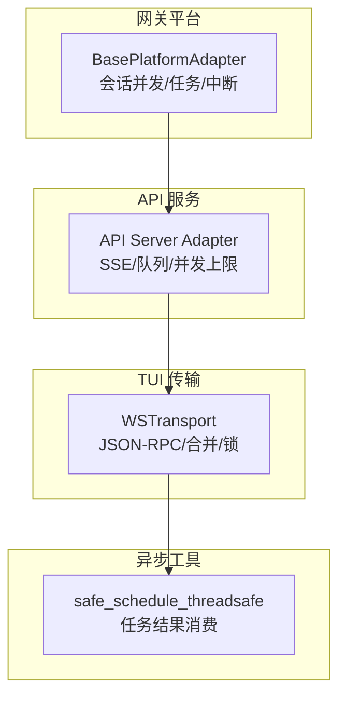
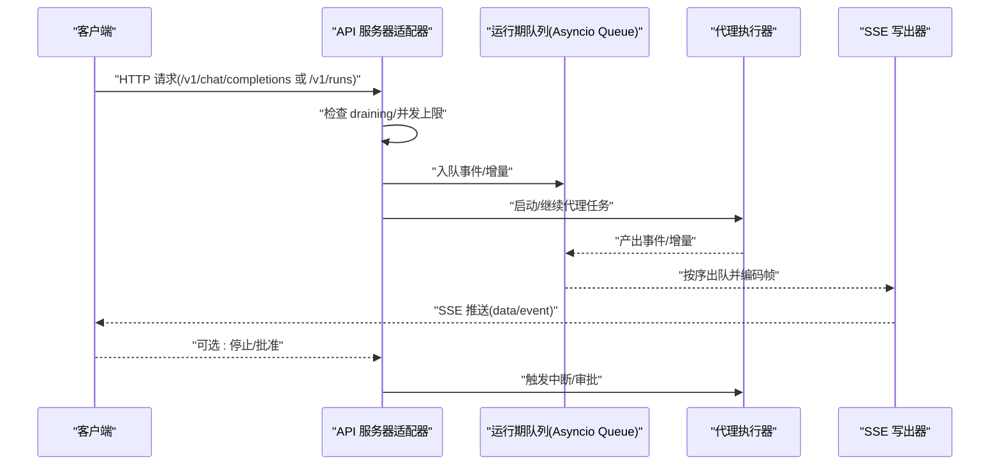
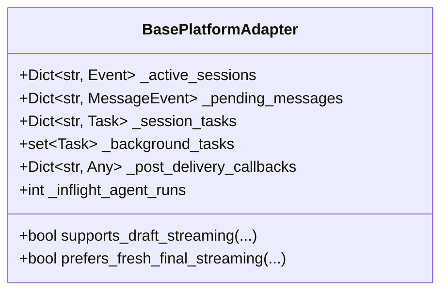
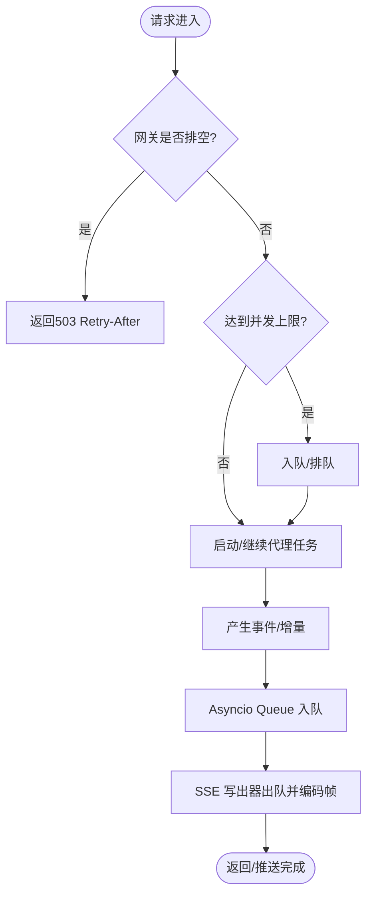
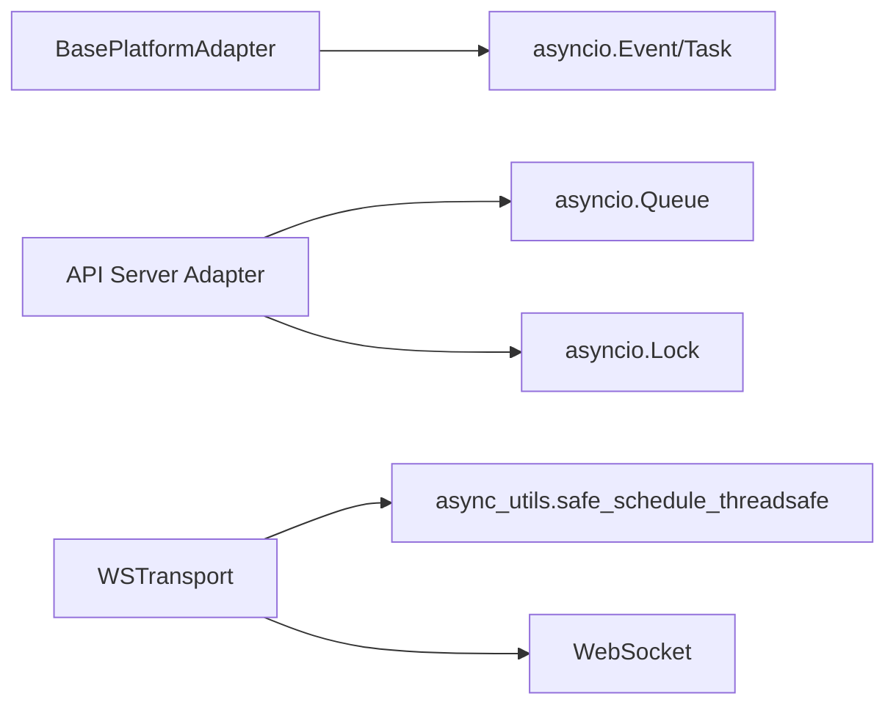

# 异步通信机制

<cite>
**本文引用的文件**
- [gateway/platforms/base.py](file://gateway/platforms/base.py)
- [gateway/platforms/api_server.py](file://gateway/platforms/api_server.py)
- [tui_gateway/ws.py](file://tui_gateway/ws.py)
- [agent/async_utils.py](file://agent/async_utils.py)
</cite>

## 目录
1. [简介](#简介)
2. [项目结构](#项目结构)
3. [核心组件](#核心组件)
4. [架构总览](#架构总览)
5. [详细组件分析](#详细组件分析)
6. [依赖关系分析](#依赖关系分析)
7. [性能考量](#性能考量)
8. [故障排查指南](#故障排查指南)
9. [结论](#结论)
10. [附录](#附录)

## 简介
本文件系统性梳理 Hermes 的异步通信机制，围绕基于 asyncio 的事件循环、协程与任务调度、并发控制、WebSocket 连接管理、实时数据流处理、背压控制与连接池管理展开。文档还覆盖异步 I/O 操作、超时处理、异常传播与资源清理，并给出生产者-消费者、发布-订阅、请求-响应等典型异步模式的落地示例与最佳实践。

## 项目结构
Hermes 的异步通信由网关平台适配器、API 服务器适配器和 TUI WebSocket 传输层共同构成：
- 平台基类负责会话级并发控制、后台任务管理与中断协调。
- API 服务器适配器提供 OpenAI 兼容接口与 SSE 事件流，维护运行期队列与并发上限。
- TUI WebSocket 传输层实现 JSON-RPC 双向通道，支持高频 token 合并与线程安全写入。
- 通用异步工具提供跨线程调度与任务结果消费的安全封装。



**图表来源**
- [gateway/platforms/base.py:2800-2870](file://gateway/platforms/base.py#L2800-L2870)
- [gateway/platforms/api_server.py:1400-1475](file://gateway/platforms/api_server.py#L1400-L1475)
- [tui_gateway/ws.py:70-256](file://tui_gateway/ws.py#L70-L256)
- [agent/async_utils.py:34-85](file://agent/async_utils.py#L34-L85)

**章节来源**
- [gateway/platforms/base.py:2800-2870](file://gateway/platforms/base.py#L2800-L2870)
- [gateway/platforms/api_server.py:1400-1475](file://gateway/platforms/api_server.py#L1400-L1475)
- [tui_gateway/ws.py:70-256](file://tui_gateway/ws.py#L70-L256)
- [agent/async_utils.py:34-85](file://agent/async_utils.py#L34-L85)

## 核心组件
- 平台基类（BasePlatformAdapter）
  - 维护活跃会话事件、后台任务集合、回调注册与中断信号，确保多会话并发下的状态一致性与可中断性。
- API 服务器适配器（API Server Adapter）
  - 暴露 HTTP/SSE 端点；使用 asyncio.Queue 作为运行期事件队列；通过并发上限与单飞锁保护关键初始化路径；提供停止与中断能力。
- TUI WebSocket 传输（WSTransport）
  - 线程安全的写路径；高频 token 帧合并；发送锁保证顺序；关闭时取消定时器与释放资源。
- 异步工具（async_utils）
  - 安全地将协程从工作线程调度到事件循环；对失败调度的协程进行 close 防止泄漏；消费分离任务的结果避免未检索异常噪音。

**章节来源**
- [gateway/platforms/base.py:2800-2870](file://gateway/platforms/base.py#L2800-L2870)
- [gateway/platforms/api_server.py:1400-1475](file://gateway/platforms/api_server.py#L1400-L1475)
- [tui_gateway/ws.py:70-256](file://tui_gateway/ws.py#L70-L256)
- [agent/async_utils.py:34-85](file://agent/async_utils.py#L34-L85)

## 架构总览
下图展示一次“客户端请求 → API 服务器 → 代理执行 → SSE 事件流 → 客户端”的端到端流程，体现事件循环、队列、任务与中断协作。



**图表来源**
- [gateway/platforms/api_server.py:1400-1475](file://gateway/platforms/api_server.py#L1400-L1475)
- [gateway/platforms/api_server.py:161-185](file://gateway/platforms/api_server.py#L161-L185)

**章节来源**
- [gateway/platforms/api_server.py:1400-1475](file://gateway/platforms/api_server.py#L1400-L1475)
- [gateway/platforms/api_server.py:161-185](file://gateway/platforms/api_server.py#L161-L185)

## 详细组件分析

### 平台基类：会话并发与任务管理
- 活跃会话与任务映射
  - 使用 asyncio.Event 表示会话级活动，配合任务字典跟踪后台任务生命周期，避免旧任务 finally 误删新任务的守卫导致忙状态残留。
- 后台任务集合
  - 集中管理 handle_message 等触发的后台任务，在网关重启/替换时统一取消，防止旧实例继续工作。
- 文本节流与忙碌模式
  - 配置化节流参数与硬上限，减少频繁消息造成的事件循环抖动。
- 自动 TTS 与打字指示器
  - 会话级开关与全局默认协同，避免重复合成；打字指示器暂停集合用于审批等待等场景。



**图表来源**
- [gateway/platforms/base.py:2800-2870](file://gateway/platforms/base.py#L2800-L2870)

**章节来源**
- [gateway/platforms/base.py:2800-2870](file://gateway/platforms/base.py#L2800-L2870)

### API 服务器适配器：SSE、队列与并发控制
- 运行期队列
  - 使用 asyncio.Queue 承载每个 run_id 的 SSE 事件；消费者侧 await get() 或带超时的 get，生产者在非事件循环线程通过 call_soon_threadsafe 入队，避免轮询开销与尾延迟。
- 并发上限与 draining
  - 通过配置限制最大并发运行数；在 draining 阶段返回可重试响应，避免新请求进入。
- 单飞锁与懒初始化
  - 对 SessionDB 等昂贵资源采用 asyncio.Lock 做单飞初始化，避免竞态。
- 停止与中断
  - 维护活跃 agent 与任务引用，shutdown 时调用硬中断，确保优雅退出。



**图表来源**
- [gateway/platforms/api_server.py:1400-1475](file://gateway/platforms/api_server.py#L1400-L1475)
- [gateway/platforms/api_server.py:161-185](file://gateway/platforms/api_server.py#L161-L185)

**章节来源**
- [gateway/platforms/api_server.py:1400-1475](file://gateway/platforms/api_server.py#L1400-L1475)
- [gateway/platforms/api_server.py:161-185](file://gateway/platforms/api_server.py#L161-L185)

### TUI WebSocket 传输：线程安全与高频合并
- 线程安全写
  - write() 可从任意线程调用；若已在事件循环线程则直接创建任务，否则通过 safe_schedule_threadsafe 调度，避免死锁。
- 高频 token 合并
  - 对 message.delta/reasoning.delta/thinking.delta 等高频帧进行缓冲，并在短定时器批量刷新，降低事件循环唤醒次数。
- 发送锁与顺序保证
  - 使用 asyncio.Lock 串行化发送，确保同一批次内帧顺序；错误时标记关闭，阻止后续批处理。
- 关闭与资源清理
  - close() 取消待处理的合并定时器，释放句柄；handle_ws 中统一注销传输、释放唤醒词资源并关闭连接。

```mermaid
sequenceDiagram
participant Worker as "工作线程"
participant WS as "WSTransport"
participant Loop as "事件循环"
participant Socket as "WebSocket"
Worker->>WS : "write({token})"
alt 高频帧
WS->>WS : "加入缓冲区"
WS->>Loop : "call_soon_threadsafe(_arm_token_flush)"
Loop-->>WS : "定时触发 _flush_tokens"
WS->>Socket : "批量 send_text"
else 非高频帧
WS->>Loop : "safe_schedule_threadsafe(_safe_send_many)"
Loop-->>WS : "await send_text(...)"
end
Note over WS,Socket : "发送失败时标记 closed，阻止后续写入"
```

**图表来源**
- [tui_gateway/ws.py:70-256](file://tui_gateway/ws.py#L70-L256)
- [agent/async_utils.py:34-85](file://agent/async_utils.py#L34-L85)

**章节来源**
- [tui_gateway/ws.py:70-256](file://tui_gateway/ws.py#L70-L256)
- [agent/async_utils.py:34-85](file://agent/async_utils.py#L34-L85)

### 异步工具：跨线程调度与任务结果消费
- safe_schedule_threadsafe
  - 将协程安全地调度到指定事件循环；若循环缺失或调度失败，close 协程并返回 None，避免“从未被 await”的警告与帧泄漏。
- consume_detached_task_result
  - 消费已分离任务的结果，吞掉 CancelledError 与异常，避免事件循环日志噪音；适用于 teardown 路径中放弃关注的任务。

**章节来源**
- [agent/async_utils.py:34-85](file://agent/async_utils.py#L34-L85)

## 依赖关系分析
- 组件耦合
  - WSTransport 依赖 async_utils 的跨线程调度，避免死锁与泄漏。
  - API 服务器适配器依赖 asyncio.Queue 与 asyncio.Lock 实现队列与单飞初始化。
  - 平台基类通过 asyncio.Event 与 Task 管理会话并发与中断。
- 外部依赖
  - aiohttp 用于 API 服务器的 Web 框架与站点管理。
  - Starlette WebSocket（可选）用于 tui_gateway 的断开异常类型。



**图表来源**
- [gateway/platforms/base.py:2800-2870](file://gateway/platforms/base.py#L2800-L2870)
- [gateway/platforms/api_server.py:1400-1475](file://gateway/platforms/api_server.py#L1400-L1475)
- [tui_gateway/ws.py:70-256](file://tui_gateway/ws.py#L70-L256)
- [agent/async_utils.py:34-85](file://agent/async_utils.py#L34-L85)

**章节来源**
- [gateway/platforms/base.py:2800-2870](file://gateway/platforms/base.py#L2800-L2870)
- [gateway/platforms/api_server.py:1400-1475](file://gateway/platforms/api_server.py#L1400-L1475)
- [tui_gateway/ws.py:70-256](file://tui_gateway/ws.py#L70-L256)
- [agent/async_utils.py:34-85](file://agent/async_utils.py#L34-L85)

## 性能考量
- 事件循环友好
  - 高频 token 合并减少唤醒次数；非事件循环线程通过 call_soon_threadsafe 入队，避免阻塞与轮询。
- 背压控制
  - 队列长度与并发上限共同限制吞吐；draining 阶段拒绝新请求，保障系统稳定。
- 超时与停滞防护
  - WS 写入设置超时，避免事件循环停滞导致永久阻塞；SSE 写出器使用带超时的队列读取。
- 资源清理
  - 关闭时取消定时器、释放锁与任务引用；后台任务集合在重启时统一取消。

[本节为通用指导，不直接分析具体文件]

## 故障排查指南
- 常见问题定位
  - “协程从未被 await”：检查跨线程调度是否失败且未 close 协程；确认使用 safe_schedule_threadsafe。
  - 事件循环卡顿：检查 WS 写入超时与合并逻辑；确认非高频帧及时冲刷缓冲区。
  - 队列积压：检查消费者是否因异常退出；确认 SSE 写出器正常出队。
  - 并发超限：查看 draining 标志与并发上限配置；必要时调整 max_concurrent_runs。
- 调试技巧
  - 记录队列大小与 in-flight 计数；在关键路径添加日志（peer、方法、错误码）。
  - 使用断言验证关闭路径：定时器已取消、socket 已关闭、传输已注销。
- 内存泄漏防护
  - 确保所有协程在失败路径被 close；任务完成后从字典移除；避免强引用持有长生命周期对象。

**章节来源**
- [agent/async_utils.py:34-85](file://agent/async_utils.py#L34-L85)
- [tui_gateway/ws.py:70-256](file://tui_gateway/ws.py#L70-L256)
- [gateway/platforms/api_server.py:1400-1475](file://gateway/platforms/api_server.py#L1400-L1475)

## 结论
Hermes 的异步通信以 asyncio 为核心，通过平台基类的会话并发管理、API 服务器的队列与并发控制、以及 TUI WebSocket 的高频合并与线程安全写入，构建了高吞吐、低延迟、可中断且易扩展的通信体系。结合合理的超时、异常传播与资源清理策略，系统在复杂场景下仍能保持稳定与可观测性。

[本节为总结，不直接分析具体文件]

## 附录

### 异步模式示例

- 生产者-消费者（SSE 事件流）
  - 生产者：代理任务产出事件，入队 asyncio.Queue。
  - 消费者：SSE 写出器持续出队并编码帧推送到客户端。
  - 背压：队列容量与并发上限共同限制；draining 阶段拒绝新请求。

- 发布-订阅（run_id 事件广播）
  - 发布者：多个代理任务向对应 run_id 的队列推送事件。
  - 订阅者：SSE 客户端连接后订阅特定 run_id 的事件流。
  - 生命周期：run 结束时清理队列与订阅者集合。

- 请求-响应（JSON-RPC over WebSocket）
  - 请求：客户端发送 JSON-RPC 请求。
  - 处理：事件循环线程调用 server.dispatch，可能调度到工作线程。
  - 响应：工作线程通过 WSTransport.write 回写；事件循环线程也可用 write_async 等待落盘。

[本节为概念性说明，不直接分析具体文件]