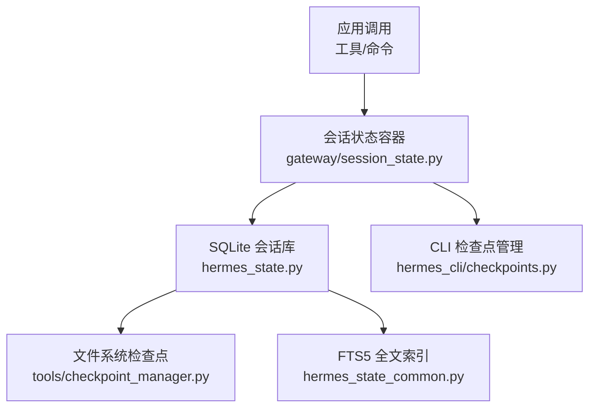
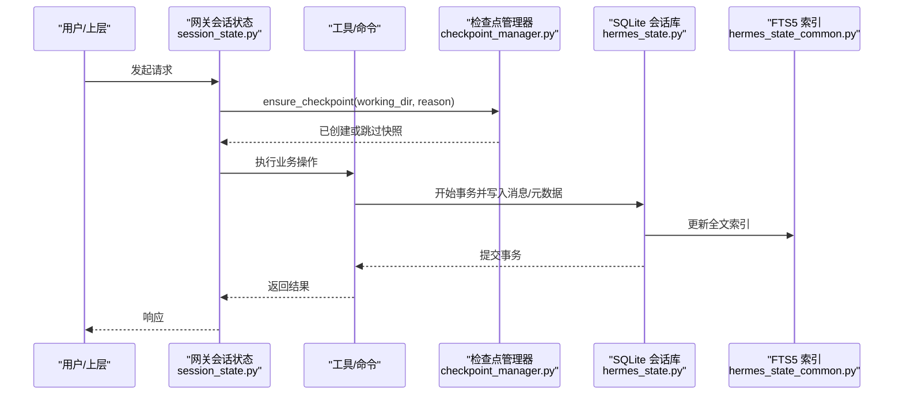
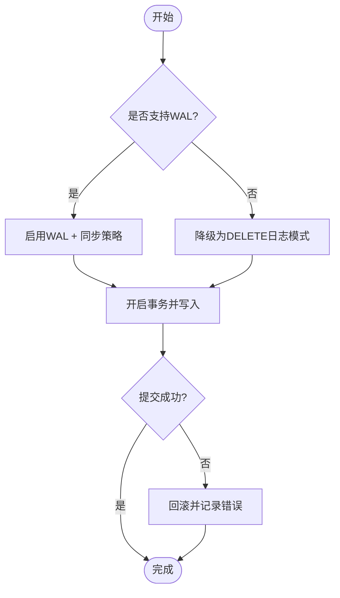
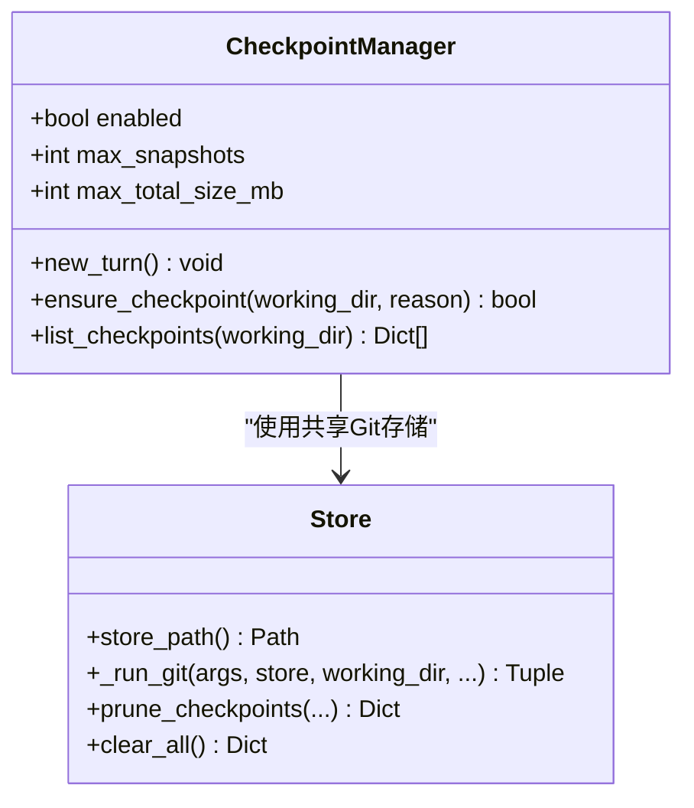
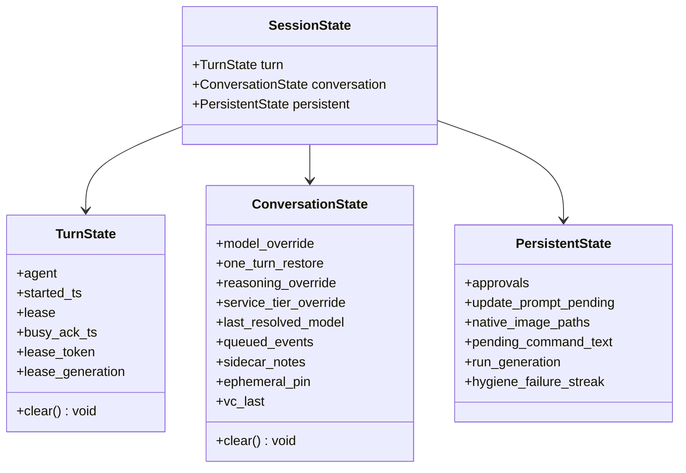
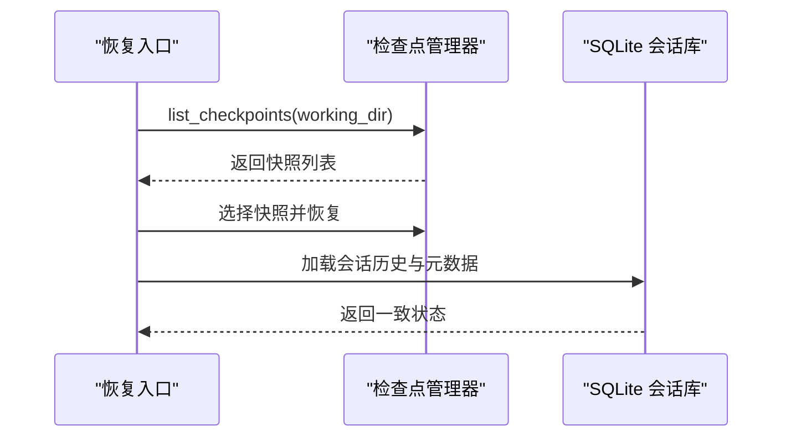
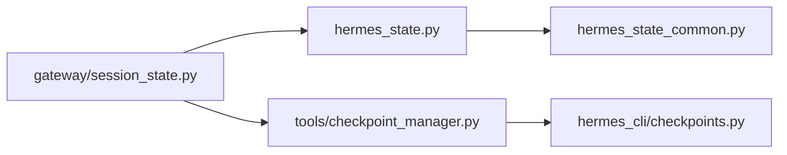

# 数据一致性保证

<cite>
**本文引用的文件**
- [hermes_state.py](file://hermes_state.py)
- [hermes_state_common.py](file://hermes_state_common.py)
- [tools/checkpoint_manager.py](file://tools/checkpoint_manager.py)
- [hermes_cli/checkpoints.py](file://hermes_cli/checkpoints.py)
- [gateway/session_state.py](file://gateway/session_state.py)
</cite>

## 目录
1. [简介](#简介)
2. [项目结构](#项目结构)
3. [核心组件](#核心组件)
4. [架构总览](#架构总览)
5. [详细组件分析](#详细组件分析)
6. [依赖关系分析](#依赖关系分析)
7. [性能考量](#性能考量)
8. [故障排查指南](#故障排查指南)
9. [结论](#结论)
10. [附录](#附录)

## 简介
本文件面向 Hermes 的数据一致性保证，围绕事务机制、ACID 属性实现、数据同步策略、分布式一致性协议、冲突检测与解决、会话状态持久化、检查点系统与恢复流程展开。结合仓库中的 SQLite 会话存储、WAL/同步策略、检查点快照与清理、以及网关会话状态管理，给出可操作的实践建议与排障指引。

## 项目结构
Hermes 在数据一致性方面由三层组成：
- 持久层：基于 SQLite 的会话数据库（WAL、FTS5、迁移与兼容性处理）
- 工作区快照层：基于共享 Git 对象的检查点系统（自动快照、回滚、清理）
- 运行时状态层：网关会话状态容器（按 turn/conversation/persistent 分层生命周期）

图表来源
- [hermes_state.py:1-120](file://hermes_state.py#L1-L120)
- [hermes_state_common.py:170-185](file://hermes_state_common.py#L170-L185)
- [tools/checkpoint_manager.py:1-50](file://tools/checkpoint_manager.py#L1-L50)
- [hermes_cli/checkpoints.py:1-20](file://hermes_cli/checkpoints.py#L1-L20)
- [gateway/session_state.py:1-35](file://gateway/session_state.py#L1-L35)

章节来源
- [hermes_state.py:1-120](file://hermes_state.py#L1-L120)
- [hermes_state_common.py:170-185](file://hermes_state_common.py#L170-L185)
- [tools/checkpoint_manager.py:1-50](file://tools/checkpoint_manager.py#L1-L50)
- [hermes_cli/checkpoints.py:1-20](file://hermes_cli/checkpoints.py#L1-L20)
- [gateway/session_state.py:1-35](file://gateway/session_state.py#L1-L35)

## 核心组件
- SQLite 会话数据库（WAL、FTS5、迁移、兼容性与安全限制）
- 检查点管理器（共享 Git 对象快照、保留策略、清理）
- 网关会话状态容器（turn/conversation/persistent 三域隔离）
- CLI 检查点运维（状态查看、修剪、清理、遗留归档）

章节来源
- [hermes_state.py:1-120](file://hermes_state.py#L1-L120)
- [tools/checkpoint_manager.py:700-800](file://tools/checkpoint_manager.py#L700-L800)
- [gateway/session_state.py:51-179](file://gateway/session_state.py#L51-L179)
- [hermes_cli/checkpoints.py:56-168](file://hermes_cli/checkpoints.py#L56-L168)

## 架构总览
下图展示一次“写路径”的一致性保障：工具执行前创建检查点，业务写入通过 SQLite 事务提交，必要时触发压缩/分支；读路径通过 WAL 并发读取与 FTS5 搜索。

图表来源
- [tools/checkpoint_manager.py:749-781](file://tools/checkpoint_manager.py#L749-L781)
- [hermes_state.py:1-120](file://hermes_state.py#L1-L120)
- [hermes_state_common.py:187-185](file://hermes_state_common.py#L187-L185)
- [gateway/session_state.py:51-179](file://gateway/session_state.py#L51-L179)

## 详细组件分析

### SQLite 会话数据库（事务与 ACID）
- 事务与原子性：以 SQLite 事务为单位进行消息与元数据的批量写入，失败时整体回滚，避免部分写入导致的不一致。
- 一致性：WAL 模式提供一致的读视图；在 NFS/SMB/FUSE/ZFS 等不支持 WAL 的环境自动降级为 DELETE 日志模式，确保可用性与一致性。
- 隔离性：单写多读；macOS 强制 FULL 同步并在 checkpoint 使用 F_FULLFSYNC，降低崩溃后损坏风险。
- 持久性：commit 后数据落盘；对 WAL-reset 漏洞版本拒绝启用 WAL，优先 DELETE 模式。

图表来源
- [hermes_state.py:486-539](file://hermes_state.py#L486-L539)
- [hermes_state.py:718-780](file://hermes_state.py#L718-L780)
- [hermes_state.py:783-800](file://hermes_state.py#L783-L800)

章节来源
- [hermes_state.py:486-539](file://hermes_state.py#L486-L539)
- [hermes_state.py:718-780](file://hermes_state.py#L718-L780)
- [hermes_state.py:783-800](file://hermes_state.py#L783-L800)

### 检查点系统（工作区快照与回滚）
- 透明快照：在执行可能破坏文件的工具之前，按 turn 去重创建快照，基于共享 Git 对象存储，跨项目去重节省空间。
- 保留与清理：支持按时间、大小、孤儿项目清理；提供 CLI 查看、修剪、清空与遗留归档清理。
- 回滚：通过 Git 引用定位到历史快照，支持恢复到任意检查点。

图表来源
- [tools/checkpoint_manager.py:700-800](file://tools/checkpoint_manager.py#L700-L800)
- [tools/checkpoint_manager.py:239-367](file://tools/checkpoint_manager.py#L239-L367)

章节来源
- [tools/checkpoint_manager.py:1-50](file://tools/checkpoint_manager.py#L1-L50)
- [tools/checkpoint_manager.py:239-367](file://tools/checkpoint_manager.py#L239-L367)
- [tools/checkpoint_manager.py:700-800](file://tools/checkpoint_manager.py#L700-L800)
- [hermes_cli/checkpoints.py:56-168](file://hermes_cli/checkpoints.py#L56-L168)

### 网关会话状态容器（生命周期与隔离）
- 三域隔离：TurnState（每次运行回合）、ConversationState（会话边界内）、PersistentState（跨边界持久化）。
- 生命周期清晰：每回合结束重置 Turn；会话边界重置 Conversation；Persistent 仅按需清理，避免竞态与漂移。
- 兼容视图：提供旧字典式访问的适配层，便于测试与过渡期兼容。

图表来源
- [gateway/session_state.py:51-179](file://gateway/session_state.py#L51-L179)
- [gateway/session_state.py:195-477](file://gateway/session_state.py#L195-L477)

章节来源
- [gateway/session_state.py:1-35](file://gateway/session_state.py#L1-L35)
- [gateway/session_state.py:51-179](file://gateway/session_state.py#L51-L179)
- [gateway/session_state.py:195-477](file://gateway/session_state.py#L195-L477)

### 数据同步策略与分布式一致性
- 本地一致性：SQLite WAL 提供强一致读视图；在不可靠文件系统上自动降级，保证可用性。
- 进程间协调：通过 WAL 与 fsync 策略减少崩溃后的不一致；macOS 额外启用 checkpoint_fullfsync。
- 外部一致性：检查点快照作为工作区级“外部一致性”锚点，可在会话或进程重启后恢复至一致状态。

章节来源
- [hermes_state.py:486-539](file://hermes_state.py#L486-L539)
- [hermes_state.py:718-780](file://hermes_state.py#L718-L780)
- [tools/checkpoint_manager.py:1-50](file://tools/checkpoint_manager.py#L1-L50)

### 冲突检测与解决机制
- 并发写入：SQLite 单写者模型，配合 WAL 提升并发读；若检测到 WAL 不兼容则回退到 DELETE 模式。
- 工作区冲突：检查点基于 Git 对象去重，不同项目/工作树共享对象，避免重复存储导致的冲突。
- 会话边界：Gateway 会话状态按边界重置，避免跨会话状态污染。

章节来源
- [hermes_state.py:486-539](file://hermes_state.py#L486-L539)
- [tools/checkpoint_manager.py:13-49](file://tools/checkpoint_manager.py#L13-L49)
- [gateway/session_state.py:1-35](file://gateway/session_state.py#L1-L35)

### 会话状态持久化、检查点与恢复流程
- 会话持久化：消息与元数据通过 SQLite 事务写入，FTS5 索引异步更新。
- 检查点：每个 turn 对目标目录创建快照，支持列出、回滚、清理。
- 恢复：从最近检查点恢复工作区；从会话数据库恢复对话上下文。

图表来源
- [tools/checkpoint_manager.py:783-800](file://tools/checkpoint_manager.py#L783-L800)
- [hermes_state.py:1-120](file://hermes_state.py#L1-L120)

章节来源
- [tools/checkpoint_manager.py:783-800](file://tools/checkpoint_manager.py#L783-L800)
- [hermes_state.py:1-120](file://hermes_state.py#L1-L120)

### 典型一致性场景示例
- 并发写入处理：多个会话并行读，单写者提交；WAL 模式下读不阻塞写，异常环境自动降级。
- 数据版本控制：检查点以 Git 提交形式保存工作区版本，可按需回滚。
- 回滚机制：工具执行前创建快照，失败时回滚到快照；会话级可通过数据库恢复。

章节来源
- [hermes_state.py:486-539](file://hermes_state.py#L486-L539)
- [tools/checkpoint_manager.py:749-800](file://tools/checkpoint_manager.py#L749-L800)

### 监控、审计日志与合规性
- 监控：检查点状态可通过 CLI 查看（大小、项目数、最后访问时间），便于容量与健康度监控。
- 审计日志：检查点操作与 SQLite 初始化错误会记录日志，便于问题定位。
- 合规性：检查点默认排除敏感文件与缓存，避免不必要的数据留存。

章节来源
- [hermes_cli/checkpoints.py:56-168](file://hermes_cli/checkpoints.py#L56-L168)
- [tools/checkpoint_manager.py:81-143](file://tools/checkpoint_manager.py#L81-L143)
- [hermes_state.py:520-539](file://hermes_state.py#L520-L539)

## 依赖关系分析

图表来源
- [gateway/session_state.py:1-35](file://gateway/session_state.py#L1-L35)
- [hermes_state.py:1-120](file://hermes_state.py#L1-L120)
- [hermes_state_common.py:170-185](file://hermes_state_common.py#L170-L185)
- [tools/checkpoint_manager.py:1-50](file://tools/checkpoint_manager.py#L1-L50)
- [hermes_cli/checkpoints.py:1-20](file://hermes_cli/checkpoints.py#L1-L20)

章节来源
- [gateway/session_state.py:1-35](file://gateway/session_state.py#L1-L35)
- [hermes_state.py:1-120](file://hermes_state.py#L1-L120)
- [hermes_state_common.py:170-185](file://hermes_state_common.py#L170-L185)
- [tools/checkpoint_manager.py:1-50](file://tools/checkpoint_manager.py#L1-L50)
- [hermes_cli/checkpoints.py:1-20](file://hermes_cli/checkpoints.py#L1-L20)

## 性能考量
- WAL 模式在高并发读场景下显著提升吞吐；在不兼容文件系统上自动降级，确保稳定性。
- 检查点使用共享 Git 对象存储，跨项目去重，减少磁盘占用与 I/O 压力。
- 定期清理与保留策略避免存储膨胀，保持系统长期健康。

[本节为通用指导，无需特定文件引用]

## 故障排查指南
- 无法打开状态数据库：检查是否为生产路径被误用、文件系统是否支持 WAL、是否存在 WAL-reset 漏洞版本。
- 检查点失败：确认 git 可用、工作目录存在、权限正常；查看日志中 git 子命令错误信息。
- 会话状态不一致：核对会话边界是否正确重置，检查 Gateway 会话状态容器的生命周期是否被正确调用。

章节来源
- [hermes_state.py:520-539](file://hermes_state.py#L520-L539)
- [tools/checkpoint_manager.py:301-367](file://tools/checkpoint_manager.py#L301-L367)
- [gateway/session_state.py:51-179](file://gateway/session_state.py#L51-L179)

## 结论
Hermes 通过 SQLite 事务与 WAL、检查点快照与清理、以及网关会话状态容器，构建了端到端的数据一致性保障体系。在分布式与多进程环境下，借助 WAL 的一致读视图与文件系统级快照，实现了高可用与可恢复性。建议在生产环境中启用检查点、合理配置保留策略，并关注 SQLite 版本与文件系统兼容性。

[本节为总结，无需特定文件引用]

## 附录
- 常用命令：
  - 查看检查点状态：hermes checkpoints status
  - 修剪检查点：hermes checkpoints prune --retention-days N --max-size-mb M
  - 清空检查点：hermes checkpoints clear [-f]
  - 清理遗留归档：hermes checkpoints clear-legacy [-f]

章节来源
- [hermes_cli/checkpoints.py:56-168](file://hermes_cli/checkpoints.py#L56-L168)