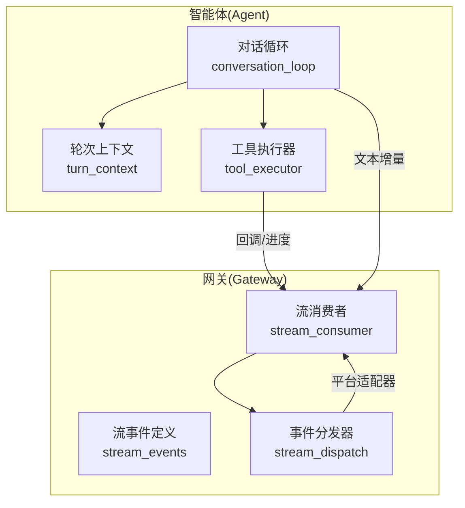
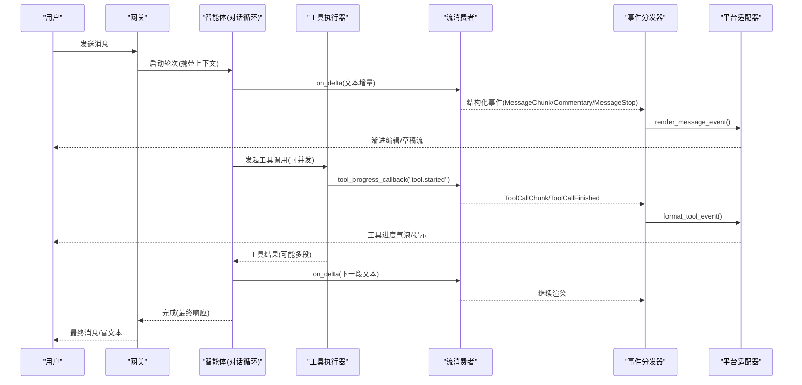
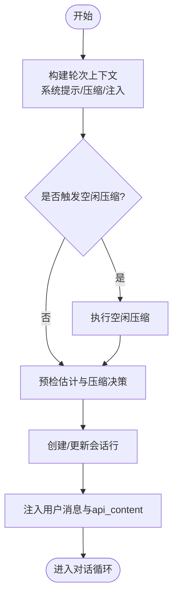
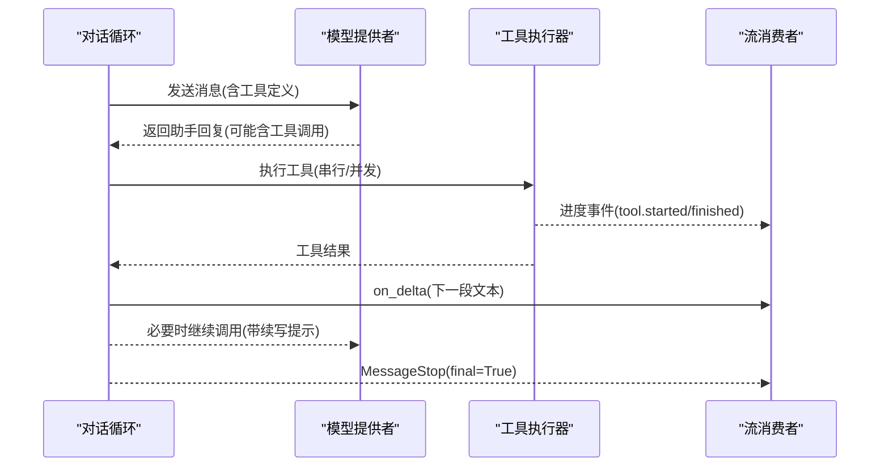
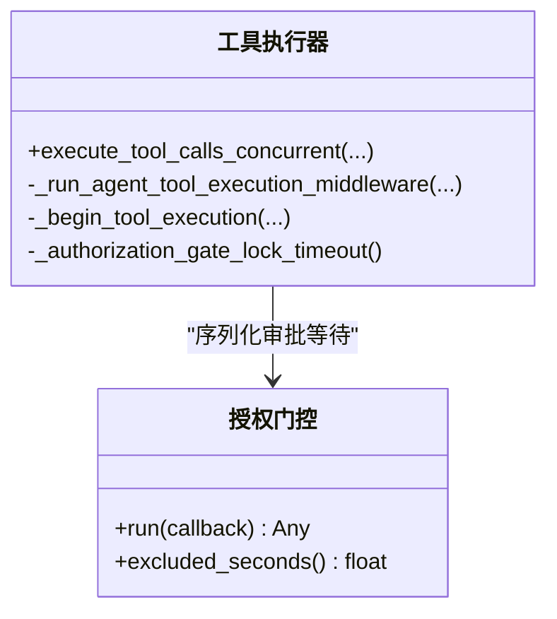
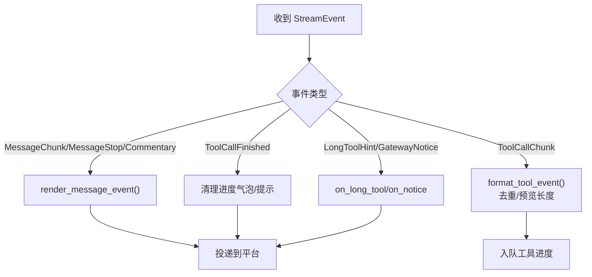
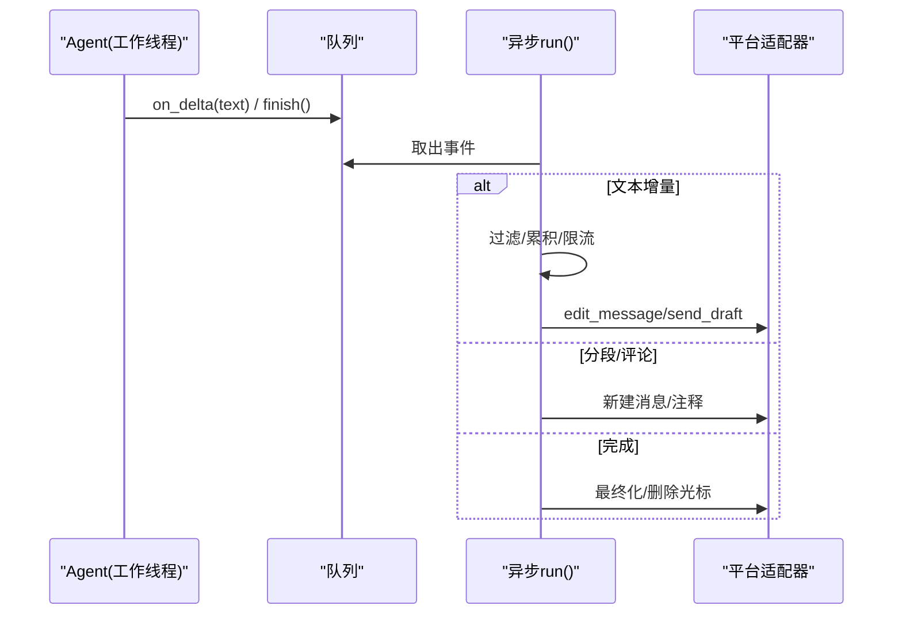
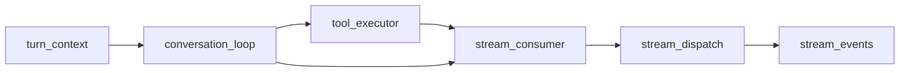

# 数据流设计

<cite>
**本文引用的文件**
- [gateway/stream_events.py](file://gateway/stream_events.py)
- [gateway/stream_dispatch.py](file://gateway/stream_dispatch.py)
- [gateway/stream_consumer.py](file://gateway/stream_consumer.py)
- [agent/conversation_loop.py](file://agent/conversation_loop.py)
- [agent/turn_context.py](file://agent/turn_context.py)
- [agent/tool_executor.py](file://agent/tool_executor.py)
</cite>

## 目录
1. [简介](#简介)
2. [项目结构](#项目结构)
3. [核心组件](#核心组件)
4. [架构总览](#架构总览)
5. [详细组件分析](#详细组件分析)
6. [依赖关系分析](#依赖关系分析)
7. [性能考量](#性能考量)
8. [故障排查指南](#故障排查指南)
9. [结论](#结论)
10. [附录](#附录)

## 简介
本文件面向 Hermes 的数据流设计，聚焦“从用户输入到响应生成”的完整处理链路：消息接收、意图识别与上下文构建、工具选择与执行、结果返回与呈现。文档重点说明异步消息处理、事件驱动架构、流式响应与数据同步机制，并覆盖数据转换管道、错误传播、重试策略与性能监控。文末提供调试与优化建议，帮助定位瓶颈与提升吞吐。

## 项目结构
Hermes 将“智能体工作线程（Agent）”与“网关投递层（Gateway）”解耦：
- Agent 侧负责对话轮次编排、模型调用、工具调度与中间状态产出；
- Gateway 侧负责平台适配、流式消费、渲染与投递；
- 两者通过结构化流事件契约进行通信，避免平台细节侵入 Agent。

图表来源
- [agent/conversation_loop.py:1-800](file://agent/conversation_loop.py#L1-L800)
- [agent/turn_context.py:1-800](file://agent/turn_context.py#L1-L800)
- [agent/tool_executor.py:1-800](file://agent/tool_executor.py#L1-L800)
- [gateway/stream_events.py:1-172](file://gateway/stream_events.py#L1-L172)
- [gateway/stream_dispatch.py:1-133](file://gateway/stream_dispatch.py#L1-L133)
- [gateway/stream_consumer.py:1-800](file://gateway/stream_consumer.py#L1-L800)

章节来源
- [agent/conversation_loop.py:1-800](file://agent/conversation_loop.py#L1-L800)
- [gateway/stream_events.py:1-172](file://gateway/stream_events.py#L1-L172)
- [gateway/stream_dispatch.py:1-133](file://gateway/stream_dispatch.py#L1-L133)
- [gateway/stream_consumer.py:1-800](file://gateway/stream_consumer.py#L1-L800)

## 核心组件
- 轮次上下文（TurnContext）：封装每轮对话的初始化、系统提示恢复、压缩预检、用户消息组装等前置步骤，为后续循环提供稳定输入。
- 对话循环（Conversation Loop）：驱动一轮完整的用户交互，包括上下文准备、模型调用、工具调用、重试与回退、最终化与持久化。
- 工具执行器（Tool Executor）：串行/并发执行工具调用，包含授权门控、预算控制、进度上报、结果存储与中断处理。
- 流事件（Stream Events）：定义 Agent→Gateway 的结构化事件契约（消息片段、工具调用、通知等），纯数据类，无平台知识。
- 事件分发器（Event Dispatcher）：将结构化事件路由到平台适配器与投递队列，屏蔽平台差异。
- 流消费者（Stream Consumer）：桥接同步回调与异步投递，缓冲、限流、渐进编辑或原生草稿流式呈现，保证顺序与一致性。

章节来源
- [agent/turn_context.py:1-800](file://agent/turn_context.py#L1-L800)
- [agent/conversation_loop.py:1-800](file://agent/conversation_loop.py#L1-L800)
- [agent/tool_executor.py:1-800](file://agent/tool_executor.py#L1-L800)
- [gateway/stream_events.py:1-172](file://gateway/stream_events.py#L1-L172)
- [gateway/stream_dispatch.py:1-133](file://gateway/stream_dispatch.py#L1-L133)
- [gateway/stream_consumer.py:1-800](file://gateway/stream_consumer.py#L1-L800)

## 架构总览
下图展示从用户输入到响应的端到端数据路径，涵盖异步与流式通道、工具执行与结果返回。

图表来源
- [agent/conversation_loop.py:1-800](file://agent/conversation_loop.py#L1-L800)
- [agent/tool_executor.py:1-800](file://agent/tool_executor.py#L1-L800)
- [gateway/stream_events.py:1-172](file://gateway/stream_events.py#L1-L172)
- [gateway/stream_dispatch.py:1-133](file://gateway/stream_dispatch.py#L1-L133)
- [gateway/stream_consumer.py:1-800](file://gateway/stream_consumer.py#L1-L800)

## 详细组件分析

### 轮次上下文与数据准备
- 职责：安全地建立会话行、恢复/构建系统提示、注入插件上下文、执行空闲/预检压缩、记录任务与轮次标识、重置重试计数与迭代预算。
- 关键保障：
  - 系统提示缓存与字节级稳定性，确保提示前缀命中；
  - 用户消息的 api_content 侧车机制，保证“持久内容”和“实际发送内容”一致；
  - 压缩前后对当前用户消息索引的重锚定，避免错位注入。

图表来源
- [agent/turn_context.py:1-800](file://agent/turn_context.py#L1-L800)

章节来源
- [agent/turn_context.py:1-800](file://agent/turn_context.py#L1-L800)

### 对话循环与意图识别
- 职责：组织消息列表、调用模型、解析工具调用、处理中断与回退、最终化与持久化。
- 关键点：
  - 在工具边界处发出分段停止信号，使下游按新消息段落渲染；
  - 对截断/输出限制/网络异常等场景进行续写提示与重试；
  - 保持思考块不进入历史，仅作为显示态。

图表来源
- [agent/conversation_loop.py:1-800](file://agent/conversation_loop.py#L1-L800)
- [agent/tool_executor.py:1-800](file://agent/tool_executor.py#L1-L800)

章节来源
- [agent/conversation_loop.py:1-800](file://agent/conversation_loop.py#L1-L800)

### 工具选择与执行（含并发与授权门控）
- 职责：解析参数、权限与守卫检查、并发调度、超时与预算控制、结果持久化与后处理。
- 并发策略：
  - 使用线程池并行执行工具，维护原始顺序；
  - 授权门控序列化人类审批等待，避免交错；
  - 针对图像生成等慢操作限制并发度。
- 失败与取消：
  - 支持用户中断，统一标记取消结果；
  - 工具结果大小受预算约束，超限则截断/摘要。

图表来源
- [agent/tool_executor.py:1-800](file://agent/tool_executor.py#L1-L800)

章节来源
- [agent/tool_executor.py:1-800](file://agent/tool_executor.py#L1-L800)

### 流事件与分发（事件驱动）
- 事件类型：消息片段、消息停止、评论性消息、工具调用开始/结束、长运行提示、网关通知。
- 分发规则：
  - 消息类事件经适配器渲染至投递 sink；
  - 工具事件根据模式（all/new/verbose/off）去重与格式化；
  - 网关控制事件交由上层钩子处理。
- 设计原则：事件只描述“发生了什么”，不规定“如何投递”。

图表来源
- [gateway/stream_events.py:1-172](file://gateway/stream_events.py#L1-L172)
- [gateway/stream_dispatch.py:1-133](file://gateway/stream_dispatch.py#L1-L133)

章节来源
- [gateway/stream_events.py:1-172](file://gateway/stream_events.py#L1-L172)
- [gateway/stream_dispatch.py:1-133](file://gateway/stream_dispatch.py#L1-L133)

### 流消费者（异步、流式与同步屏障）
- 职责：接收 Agent 同步回调，排队到异步任务，缓冲、限流、渐进编辑或原生草稿流式呈现；提供 flush_pending_sync 同步屏障。
- 特性：
  - 支持 edit 与 draft 两种传输方式，自动降级；
  - 过滤思考块标签，避免泄露内部推理；
  - 跟踪已送达的最终文本，避免重复发送；
  - 处理溢出拆分、回退发送与防洪水策略。

图表来源
- [gateway/stream_consumer.py:1-800](file://gateway/stream_consumer.py#L1-L800)

章节来源
- [gateway/stream_consumer.py:1-800](file://gateway/stream_consumer.py#L1-L800)

## 依赖关系分析
- 低耦合：Agent 仅依赖结构化事件与回调接口；Gateway 通过适配器决定具体投递方式。
- 内聚性：每个模块职责清晰——上下文构建、对话编排、工具执行、事件定义、分发、消费。
- 外部依赖：平台适配器（Telegram/Discord/Slack 等）、模型提供者、工具后端。

图表来源
- [agent/turn_context.py:1-800](file://agent/turn_context.py#L1-L800)
- [agent/conversation_loop.py:1-800](file://agent/conversation_loop.py#L1-L800)
- [agent/tool_executor.py:1-800](file://agent/tool_executor.py#L1-L800)
- [gateway/stream_consumer.py:1-800](file://gateway/stream_consumer.py#L1-L800)
- [gateway/stream_dispatch.py:1-133](file://gateway/stream_dispatch.py#L1-L133)
- [gateway/stream_events.py:1-172](file://gateway/stream_events.py#L1-L172)

章节来源
- [agent/turn_context.py:1-800](file://agent/turn_context.py#L1-L800)
- [agent/conversation_loop.py:1-800](file://agent/conversation_loop.py#L1-L800)
- [agent/tool_executor.py:1-800](file://agent/tool_executor.py#L1-L800)
- [gateway/stream_consumer.py:1-800](file://gateway/stream_consumer.py#L1-L800)
- [gateway/stream_dispatch.py:1-133](file://gateway/stream_dispatch.py#L1-L133)
- [gateway/stream_events.py:1-172](file://gateway/stream_events.py#L1-L172)

## 性能考量
- 并发工具执行：默认最大工作线程数有限制，图像生成等慢操作进一步降并发，避免后端突发导致延迟上升。
- 流式编辑节流：基于时间间隔与缓冲区阈值自适应调整编辑频率，降低平台限流风险。
- 上下文压缩：空闲压缩与预检压缩减少请求体积，提高命中率与吞吐。
- 提示前缀缓存：系统提示与静态前缀重建策略保障缓存命中，减少首字延迟。
- 资源保护：授权门控与批处理超时防止单点阻塞拖垮整体流程。

[本节为通用性能讨论，无需特定文件引用]

## 故障排查指南
- 流式卡顿或乱序：
  - 检查 stream_consumer 的编辑间隔与缓冲区设置；
  - 确认 on_segment_break 与 MessageStop 是否正确触发以分段渲染。
- 工具进度未显示：
  - 核对 stream_dispatch 的工具模式（off/all/new/verbose）与预览长度；
  - 确认 enqueue_tool_line 回调是否可用。
- 最终响应重复或缺失：
  - 查看 delivered_final_matches 与 _delivered_final_text 的记录；
  - 关注溢出拆分与回退发送逻辑。
- 工具执行超时或饥饿：
  - 检查并发工具超时配置与授权门控锁超时；
  - 观察批处理中 human_wait_seconds 排除窗口。
- 上下文过大或压缩无效：
  - 检查 idle_after_seconds 与阈值判定；
  - 确认压缩失败冷却期与重试次数。

章节来源
- [gateway/stream_consumer.py:1-800](file://gateway/stream_consumer.py#L1-L800)
- [gateway/stream_dispatch.py:1-133](file://gateway/stream_dispatch.py#L1-L133)
- [agent/tool_executor.py:1-800](file://agent/tool_executor.py#L1-L800)
- [agent/turn_context.py:1-800](file://agent/turn_context.py#L1-L800)

## 结论
Hermes 的数据流以“结构化事件+适配器渲染”为核心，实现了 Agent 与 Gateway 的清晰解耦。通过流消费者实现跨线程的异步投递与流式呈现，结合工具执行的并发与授权门控，兼顾了性能与可靠性。上下文压缩与提示前缀缓存保障了大规模会话下的效率。建议在部署时依据平台能力调优流式策略与并发上限，并结合日志与指标持续观测。

[本节为总结，无需特定文件引用]

## 附录
- 关键数据一致性保证：
  - 用户消息的 api_content 侧车机制确保“持久内容”与“实际发送内容”一致；
  - 流事件仅用于展示层，不改变历史消息内容；
  - 工具结果与进度事件分离，结果由 Agent 持久化，进度由 Gateway 呈现。
- 事务与回滚：
  - 工具执行前可创建检查点（如文件/终端命令），失败时可回滚；
  - 批处理中的授权门控超时避免长期阻塞。
- 调试建议：
  - 开启 verbose 日志观察工具调用与进度；
  - 使用 flush_pending_sync 验证同步屏障；
  - 通过事件分发器模式切换快速定位渲染问题。

[本节为补充说明，无需特定文件引用]