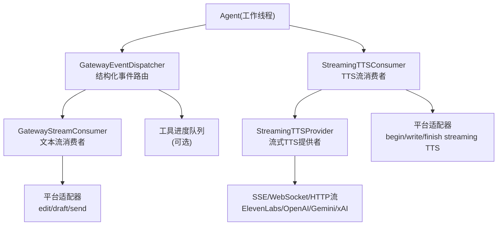
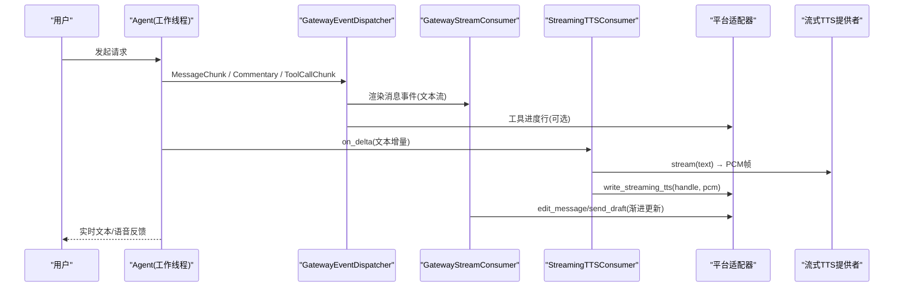
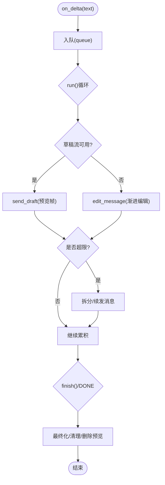
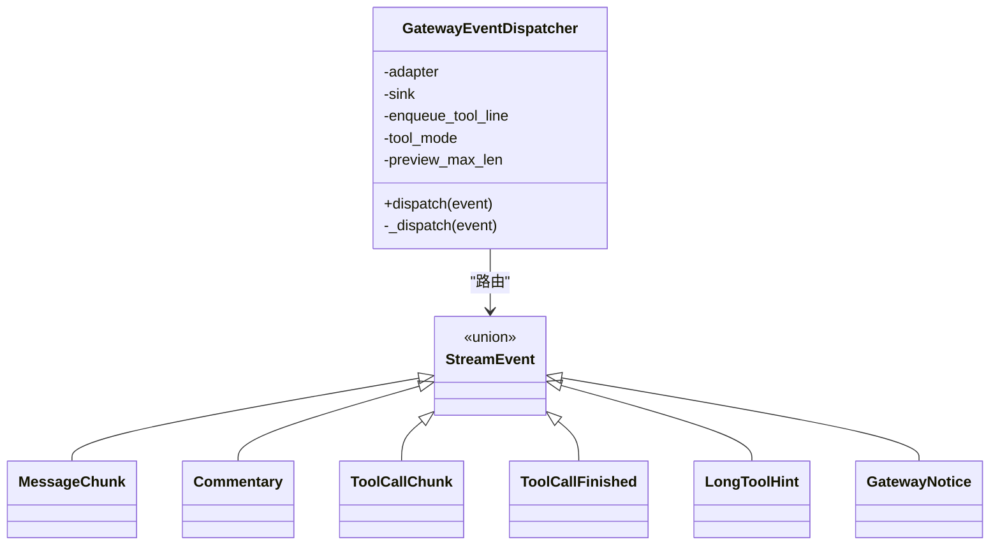
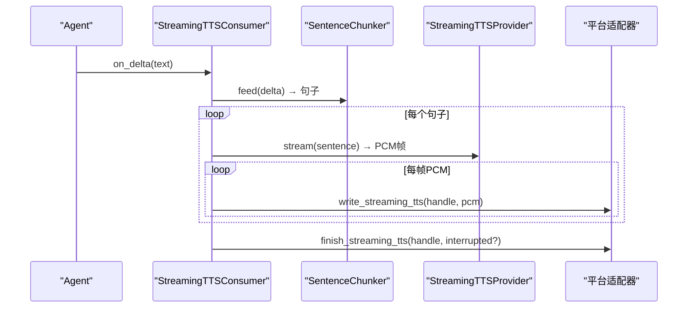
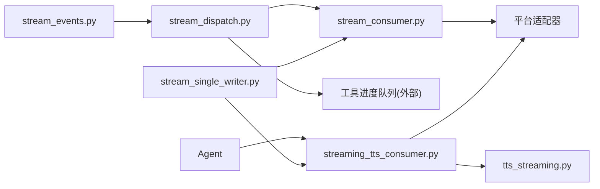

# 流式响应处理

<cite>
**本文引用的文件**
- [gateway/stream_consumer.py](file://gateway/stream_consumer.py)
- [gateway/stream_dispatch.py](file://gateway/stream_dispatch.py)
- [gateway/stream_events.py](file://gateway/stream_events.py)
- [gateway/streaming_tts_consumer.py](file://gateway/streaming_tts_consumer.py)
- [agent/tts_provider.py](file://agent/tts_provider.py)
- [tools/tts_streaming.py](file://tools/tts_streaming.py)
- [agent/stream_single_writer.py](file://agent/stream_single_writer.py)
</cite>

## 目录
1. [简介](#简介)
2. [项目结构](#项目结构)
3. [核心组件](#核心组件)
4. [架构总览](#架构总览)
5. [详细组件分析](#详细组件分析)
6. [依赖关系分析](#依赖关系分析)
7. [性能与带宽优化](#性能与带宽优化)
8. [故障排查指南](#故障排查指南)
9. [结论](#结论)
10. [附录：API 使用示例](#附录api-使用示例)

## 简介
本文件系统性梳理 Hermes 的流式响应处理机制，覆盖以下方面：
- SSE（Server-Sent Events）与 WebSocket 在 TTS 语音流、文本流和图片流中的使用方式
- 增量数据处理、流式解析与前端实时更新策略
- 流缓冲、去抖动与错误恢复
- 性能优化、带宽控制与客户端兼容性
- 流式 API 使用示例与调试诊断方法

Hermes 将“生成侧”的流式数据（LLM 文本、TTS 音频、图片/媒体等）通过网关层统一接入平台适配器，以最小延迟推送到客户端。文本流采用“原生草稿流 + 渐进编辑”双通道；TTS 流通过句子切分与 PCM 帧推送实现首音极低延迟；图片/媒体流遵循统一的流式写入接口，由适配器负责具体协议封装。

## 项目结构
围绕流式响应的关键模块分布如下：
- 事件定义与分发：gateway/stream_events.py、gateway/stream_dispatch.py
- 文本流消费者：gateway/stream_consumer.py
- TTS 流消费者：gateway/streaming_tts_consumer.py
- TTS 提供者抽象与流式实现：agent/tts_provider.py、tools/tts_streaming.py
- 单写者围栏（避免并发流冲突）：agent/stream_single_writer.py

图表来源
- [gateway/stream_dispatch.py:1-133](file://gateway/stream_dispatch.py#L1-L133)
- [gateway/stream_consumer.py:156-800](file://gateway/stream_consumer.py#L156-L800)
- [gateway/streaming_tts_consumer.py:55-424](file://gateway/streaming_tts_consumer.py#L55-L424)
- [tools/tts_streaming.py:131-489](file://tools/tts_streaming.py#L131-L489)

章节来源
- [gateway/stream_events.py:1-172](file://gateway/stream_events.py#L1-L172)
- [gateway/stream_dispatch.py:1-133](file://gateway/stream_dispatch.py#L1-L133)
- [gateway/stream_consumer.py:156-800](file://gateway/stream_consumer.py#L156-L800)
- [gateway/streaming_tts_consumer.py:55-424](file://gateway/streaming_tts_consumer.py#L55-L424)
- [tools/tts_streaming.py:131-489](file://tools/tts_streaming.py#L131-L489)
- [agent/stream_single_writer.py:1-71](file://agent/stream_single_writer.py#L1-L71)

## 核心组件
- GatewayEventDispatcher：将 Agent 产生的结构化事件（消息片段、工具调用、注释等）路由到合适的投递路径，屏蔽平台差异。
- GatewayStreamConsumer：接收同步回调的文本增量，异步任务进行缓冲、限流、渐进编辑或原生草稿流更新，最终完成一条或多条消息。
- StreamingTTSConsumer：将 LLM 文本增量按句子切分，驱动流式 TTS 提供者输出 PCM 帧，并写入平台适配器的流式音频句柄。
- StreamingTTSProvider：抽象流式 TTS 提供者，支持 ElevenLabs、OpenAI、Gemini、xAI 等后端，统一返回 int16 PCM 流。
- 单写者围栏：确保同一时刻只有一个流写入器活跃，避免多轮/并发流互相覆盖。

章节来源
- [gateway/stream_dispatch.py:40-133](file://gateway/stream_dispatch.py#L40-L133)
- [gateway/stream_consumer.py:156-800](file://gateway/stream_consumer.py#L156-L800)
- [gateway/streaming_tts_consumer.py:55-424](file://gateway/streaming_tts_consumer.py#L55-L424)
- [tools/tts_streaming.py:131-489](file://tools/tts_streaming.py#L131-L489)
- [agent/stream_single_writer.py:31-71](file://agent/stream_single_writer.py#L31-L71)

## 架构总览
Hermes 的流式架构分为三层：
- 生成层（Agent）：产生结构化事件和文本增量，可能同时触发工具调用与中间注释。
- 网关层（Gateway）：事件分发、文本流消费、TTS 流消费、平台适配。
- 平台层（Adapter）：具体平台的消息发送/编辑、草稿流、流式音频写入。

图表来源
- [gateway/stream_dispatch.py:88-133](file://gateway/stream_dispatch.py#L88-L133)
- [gateway/stream_consumer.py:760-800](file://gateway/stream_consumer.py#L760-L800)
- [gateway/streaming_tts_consumer.py:218-316](file://gateway/streaming_tts_consumer.py#L218-L316)
- [tools/tts_streaming.py:220-489](file://tools/tts_streaming.py#L220-L489)

## 详细组件分析

### 文本流：GatewayStreamConsumer
- 设计要点
  - 同步回调 on_delta 从 Agent 工作线程安全入队，异步 run 循环负责缓冲、限流与渐进更新。
  - 支持两种传输模式：
    - 原生草稿流（如 Telegram DM）：通过 send_draft 动画预览，完成后以真实消息替换。
    - 渐进编辑（edit_message）：通用回退方案，跨平台稳定。
  - 防抖与自适应退避：基于编辑失败次数动态调整间隔，超过阈值禁用渐进编辑。
  - 溢出拆分：当内容超出平台限制时拆分为多条消息，保证完整交付。
  - 思考块过滤：过滤 <think>...</think> 等推理标签，避免用户看到原始推理过程。
  - 最终一致性：记录已送达的最终文本，避免重复发送或遗漏。

图表来源
- [gateway/stream_consumer.py:590-605](file://gateway/stream_consumer.py#L590-L605)
- [gateway/stream_consumer.py:760-800](file://gateway/stream_consumer.py#L760-L800)
- [gateway/stream_consumer.py:385-413](file://gateway/stream_consumer.py#L385-L413)

章节来源
- [gateway/stream_consumer.py:127-323](file://gateway/stream_consumer.py#L127-L323)
- [gateway/stream_consumer.py:590-605](file://gateway/stream_consumer.py#L590-L605)
- [gateway/stream_consumer.py:760-800](file://gateway/stream_consumer.py#L760-L800)

### 事件分发：GatewayEventDispatcher
- 职责
  - 将结构化事件（MessageChunk、Commentary、ToolCallChunk、ToolCallFinished、LongToolHint、GatewayNotice）路由到 sink（文本流消费者）或工具进度队列。
  - 对工具调用事件进行“new”模式去重，仅在新工具切换时上报。
  - 提供 adapter.render_message_event 钩子，让平台自定义渲染。

图表来源
- [gateway/stream_dispatch.py:40-133](file://gateway/stream_dispatch.py#L40-L133)
- [gateway/stream_events.py:41-159](file://gateway/stream_events.py#L41-L159)

章节来源
- [gateway/stream_dispatch.py:40-133](file://gateway/stream_dispatch.py#L40-L133)
- [gateway/stream_events.py:41-159](file://gateway/stream_events.py#L41-L159)

### TTS 流：StreamingTTSConsumer 与 StreamingTTSProvider
- 句子切分与去抖动
  - SentenceChunker 按标点边界切分句子，合并过短片段，过滤 <think> 块，减少碎片化播放。
- 流式合成与 PCM 推送
  - 通过 StreamingTTSProvider.stream 获取 PCM 帧，StreamingTTSConsumer 逐帧写入平台适配器的流式音频句柄。
- 错误恢复与降级
  - 若 begin_streaming_tts 失败或中途异常，根据是否已有可听音频决定是否抑制整文件 TTS 回退。
  - 队列满时丢弃部分句子并标记 dropped，保障整体流程不阻塞。
- 提供者实现
  - ElevenLabs：HTTP 流式 PCM
  - OpenAI：response_format=pcm 流式
  - Gemini：SSE base64 PCM
  - xAI：WebSocket 二进制 PCM

图表来源
- [gateway/streaming_tts_consumer.py:156-193](file://gateway/streaming_tts_consumer.py#L156-L193)
- [gateway/streaming_tts_consumer.py:218-316](file://gateway/streaming_tts_consumer.py#L218-L316)
- [tools/tts_streaming.py:89-125](file://tools/tts_streaming.py#L89-L125)
- [tools/tts_streaming.py:220-489](file://tools/tts_streaming.py#L220-L489)

章节来源
- [gateway/streaming_tts_consumer.py:55-424](file://gateway/streaming_tts_consumer.py#L55-L424)
- [tools/tts_streaming.py:89-125](file://tools/tts_streaming.py#L89-L125)
- [tools/tts_streaming.py:220-489](file://tools/tts_streaming.py#L220-L489)
- [agent/tts_provider.py:64-275](file://agent/tts_provider.py#L64-L275)

### 单写者围栏：防止并发流冲突
- 目的：确保同一时间只有一个流写入器活跃，避免多轮/并发流互相覆盖导致状态错乱。
- 机制：claim_stream_writer 尝试获取令牌，stream_writer_is_current 检查令牌是否仍有效；不可用时降级为“无围栏”，保证健壮性。

章节来源
- [agent/stream_single_writer.py:1-71](file://agent/stream_single_writer.py#L1-L71)

## 依赖关系分析
- 事件契约：gateway/stream_events.py 定义了稳定的事件类型，解耦 Agent 与 Gateway 的耦合。
- 分发与消费：GatewayEventDispatcher 将事件路由到 GatewayStreamConsumer 或工具进度队列；后者再与平台适配器交互。
- TTS 链路：StreamingTTSConsumer 依赖 SentenceChunker 与 StreamingTTSProvider；Provider 对接不同后端（SSE/WebSocket/HTTP）。
- 单写者围栏：被各流式路径调用，确保并发安全。

图表来源
- [gateway/stream_events.py:41-159](file://gateway/stream_events.py#L41-L159)
- [gateway/stream_dispatch.py:40-133](file://gateway/stream_dispatch.py#L40-L133)
- [gateway/stream_consumer.py:156-800](file://gateway/stream_consumer.py#L156-L800)
- [gateway/streaming_tts_consumer.py:55-424](file://gateway/streaming_tts_consumer.py#L55-L424)
- [tools/tts_streaming.py:131-489](file://tools/tts_streaming.py#L131-L489)
- [agent/stream_single_writer.py:31-71](file://agent/stream_single_writer.py#L31-L71)

章节来源
- [gateway/stream_events.py:41-159](file://gateway/stream_events.py#L41-L159)
- [gateway/stream_dispatch.py:40-133](file://gateway/stream_dispatch.py#L40-L133)
- [gateway/stream_consumer.py:156-800](file://gateway/stream_consumer.py#L156-L800)
- [gateway/streaming_tts_consumer.py:55-424](file://gateway/streaming_tts_consumer.py#L55-L424)
- [tools/tts_streaming.py:131-489](file://tools/tts_streaming.py#L131-L489)
- [agent/stream_single_writer.py:31-71](file://agent/stream_single_writer.py#L31-L71)

## 性能与带宽优化
- 文本流
  - 原生草稿流优先：在支持的平台上使用 send_draft 获得更流畅的预览体验，降低频繁 edit 的开销。
  - 渐进编辑退避：连续失败后自动增大编辑间隔，避免触发平台限流。
  - 溢出拆分：按平台消息长度限制拆分，减少单次大消息的网络压力。
  - 思考块过滤：减少无效内容的传输与渲染。
- TTS 流
  - 句子级切分：避免极短片段导致的频繁启动/停止，提升播放效率。
  - 流式 PCM：首音极低延迟，边合成边播放，降低端到端时延。
  - 字节上限保护：单句 PCM 总量限制，防止恶意或异常上游占用过多带宽。
  - 提供者优先级：auto 模式下选择最佳可用流式提供者，平衡质量与时延。
- 带宽控制
  - 队列容量限制：TTS 句子队列有界，满时丢弃并标记 dropped，避免内存与网络拥塞。
  - 超时与中断：TTS 流支持 abort，及时释放资源。
- 客户端兼容性
  - 文本流：草稿流不可用时自动回退到 edit；最终消息保证历史可见。
  - TTS 流：若适配器不支持流式 TTS，则回退到整文件 TTS 或其他兼容路径。

[本节为通用指导，不直接分析具体文件]

## 故障排查指南
- 文本流问题
  - 现象：消息不更新或卡顿
    - 检查草稿流是否启用且成功；否则确认 edit 路径是否触发。
    - 查看是否因平台限流触发退避，必要时降低频率或重试。
  - 现象：最终消息缺失或重复
    - 核对 delivered_final_text 与 final_response 的一致性；关注 split delivery 场景。
- TTS 流问题
  - 现象：无声或断续
    - 检查 begin_streaming_tts 是否成功；确认适配器 supports_streaming_tts。
    - 查看队列是否饱和（dropped=True），适当增大队列或降低句子粒度。
  - 现象：异常中断
    - 捕获 finish_streaming_tts 异常；根据 audible 状态决定抑制整文件回退。
- 并发冲突
  - 现象：多轮流互相覆盖
    - 确认单写者围栏是否生效；若不可用，降级为无围栏但需业务侧规避并发。
- 日志定位
  - 关注 gateway.stream_consumer、gateway.streaming_tts_consumer、tools.tts_streaming 的日志输出，定位错误与降级路径。

章节来源
- [gateway/stream_consumer.py:171-174](file://gateway/stream_consumer.py#L171-L174)
- [gateway/streaming_tts_consumer.py:218-316](file://gateway/streaming_tts_consumer.py#L218-L316)
- [tools/tts_streaming.py:296-311](file://tools/tts_streaming.py#L296-L311)
- [agent/stream_single_writer.py:31-71](file://agent/stream_single_writer.py#L31-L71)

## 结论
Hermes 的流式响应处理通过结构化事件、双通道文本流（草稿+编辑）、句子级 TTS 流与单写者围栏，实现了低延迟、高可靠、跨平台一致的实时交互体验。其设计强调：
- 解耦：事件契约与平台渲染分离
- 稳健：多路径回退与降级
- 高效：流式 PCM、句子切分与自适应退避
- 可观测：完善的日志与状态标记

[本节为总结，不直接分析具体文件]

## 附录：API 使用示例
以下为构建实时交互界面的典型用法（概念性步骤，非代码片段）：
- 文本流（SSE/草稿/编辑）
  - 初始化 GatewayStreamConsumer，设置 transport="draft"（优先草稿）或 "edit"（回退）。
  - 将 consumer.on_delta 作为 Agent 的 stream_delta_callback。
  - 启动 consumer.run() 异步任务，并在 Agent 结束后调用 consumer.finish()。
  - 前端监听平台消息更新（草稿动画或编辑后的新内容），实现即时显示。
- TTS 流（WebSocket/SSE/HTTP流）
  - 初始化 StreamingTTSConsumer，传入 tts_config 与事件循环。
  - 将 consumer.on_delta 绑定到 Agent 的文本增量回调。
  - 启动 consumer.start()，等待 wait_complete(timeout)。
  - 前端通过平台消息或音频句柄播放 PCM 帧，实现“边说边播”。
- 图片/媒体流
  - 通过平台适配器的流式写入接口（如 write_streaming_media）逐步推送分片。
  - 前端按到达顺序渲染，支持断点续传与错误重试。

[本节为概念性示例，不直接分析具体文件]