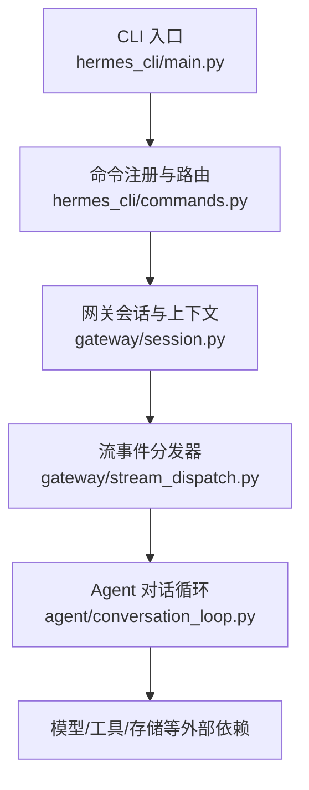
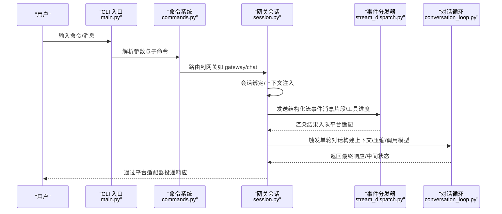
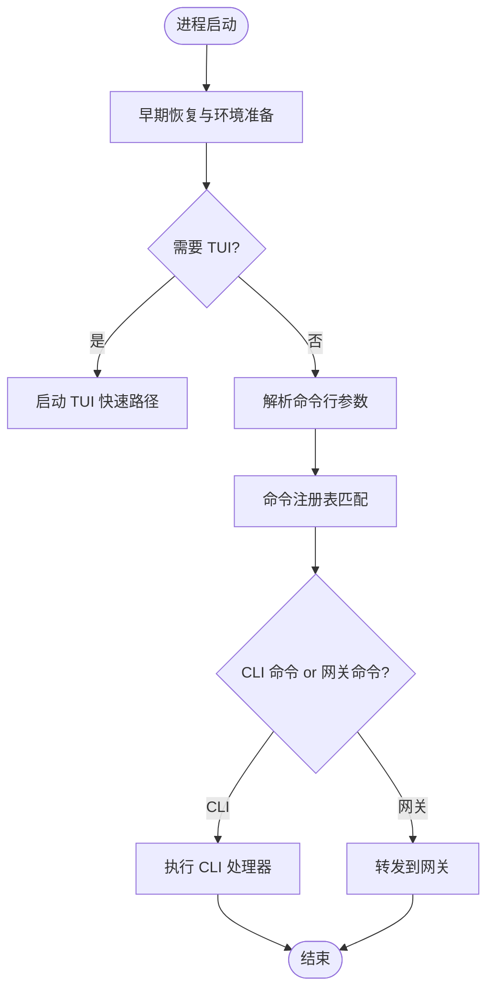
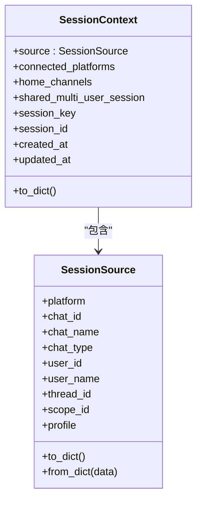
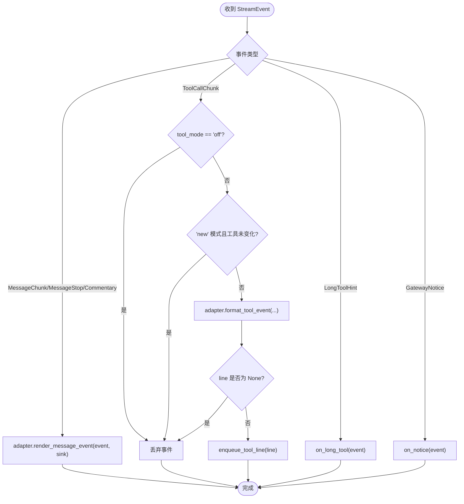
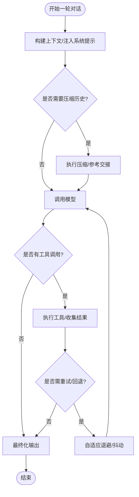

# 消息处理流程

<cite>
**本文引用的文件**
- [hermes_cli/main.py](file://hermes_cli/main.py)
- [hermes_cli/commands.py](file://hermes_cli/commands.py)
- [gateway/stream_dispatch.py](file://gateway/stream_dispatch.py)
- [gateway/session.py](file://gateway/session.py)
- [agent/conversation_loop.py](file://agent/conversation_loop.py)
</cite>

## 目录
1. [简介](#简介)
2. [项目结构](#项目结构)
3. [核心组件](#核心组件)
4. [架构总览](#架构总览)
5. [详细组件分析](#详细组件分析)
6. [依赖关系分析](#依赖关系分析)
7. [性能考虑](#性能考虑)
8. [故障排查指南](#故障排查指南)
9. [结论](#结论)
10. [附录](#附录)

## 简介
本文面向 Hermes Agent 的“消息处理流程”，从用户输入到响应生成，完整说明消息接收、验证、路由与分发机制；解释异步消息队列、消息格式转换、错误处理与重试策略；覆盖 CLI 输入处理、网关消息接收、消息验证规则、会话绑定与上下文注入；并提供关键步骤的代码片段路径、生命周期管理与内存优化策略，以及调试工具与性能监控方法。

## 项目结构
Hermes 的消息流贯穿 CLI 入口、网关层、事件分发器与 Agent 对话循环：
- CLI 入口负责解析命令、加载配置、启动 TUI/CLI 或 Gateway。
- 网关层负责平台接入、会话管理、消息路由与流式事件分发。
- 事件分发器将结构化流事件（消息片段、工具调用进度等）按平台适配渲染并投递到下游。
- Agent 对话循环驱动单轮对话：构建上下文、压缩历史、调用模型、工具执行、重试与回退、最终化输出。

图表来源
- [hermes_cli/main.py:1-120](file://hermes_cli/main.py#L1-L120)
- [hermes_cli/commands.py:100-180](file://hermes_cli/commands.py#L100-L180)
- [gateway/session.py:148-346](file://gateway/session.py#L148-L346)
- [gateway/stream_dispatch.py:40-132](file://gateway/stream_dispatch.py#L40-L132)
- [agent/conversation_loop.py:1-100](file://agent/conversation_loop.py#L1-L100)

章节来源
- [hermes_cli/main.py:1-120](file://hermes_cli/main.py#L1-L120)
- [hermes_cli/commands.py:100-180](file://hermes_cli/commands.py#L100-L180)
- [gateway/session.py:148-346](file://gateway/session.py#L148-L346)
- [gateway/stream_dispatch.py:40-132](file://gateway/stream_dispatch.py#L40-L132)
- [agent/conversation_loop.py:1-100](file://agent/conversation_loop.py#L1-L100)

## 核心组件
- CLI 入口与命令系统
  - 负责早期环境修复、TUI/CLI 选择、日志初始化、配置文件加载、子命令解析与分发。
  - 命令注册表集中定义所有斜杠命令及其行为策略（忙时调度、中断后调度、拒绝等）。
- 网关会话与上下文
  - 维护 SessionSource/SessionContext，提供动态系统提示注入、PII 脱敏、平台能力提示、多用户会话标记等。
- 流事件分发器
  - 将结构化流事件（消息片段、工具调用进度、通知等）按平台适配器渲染并投递到网关消费队列。
- Agent 对话循环
  - 单轮对话主流程：上下文构建、历史压缩、模型调用、工具执行、重试与回退、最终化输出。

章节来源
- [hermes_cli/main.py:746-774](file://hermes_cli/main.py#L746-L774)
- [hermes_cli/commands.py:100-180](file://hermes_cli/commands.py#L100-L180)
- [gateway/session.py:148-346](file://gateway/session.py#L148-L346)
- [gateway/stream_dispatch.py:40-132](file://gateway/stream_dispatch.py#L40-L132)
- [agent/conversation_loop.py:1-100](file://agent/conversation_loop.py#L1-L100)

## 架构总览
下图展示从用户输入到响应生成的端到端消息流，包括 CLI、网关、事件分发与 Agent 循环的关键交互。

图表来源
- [hermes_cli/main.py:746-774](file://hermes_cli/main.py#L746-L774)
- [hermes_cli/commands.py:100-180](file://hermes_cli/commands.py#L100-L180)
- [gateway/session.py:148-346](file://gateway/session.py#L148-L346)
- [gateway/stream_dispatch.py:40-132](file://gateway/stream_dispatch.py#L40-L132)
- [agent/conversation_loop.py:1-100](file://agent/conversation_loop.py#L1-L100)

## 详细组件分析

### CLI 输入处理与命令路由
- 早期启动优化：UTF-8 设置、进程名、TUI 快速判断、配置预读、IPv4 偏好、日志初始化。
- 命令注册表：集中定义命令、别名、忙时策略、是否仅 CLI/Gateway、可执行处理器键等。
- 路由决策：根据命令类型决定进入 CLI 本地处理或转发至网关。

图表来源
- [hermes_cli/main.py:746-774](file://hermes_cli/main.py#L746-L774)
- [hermes_cli/commands.py:100-180](file://hermes_cli/commands.py#L100-L180)

章节来源
- [hermes_cli/main.py:746-774](file://hermes_cli/main.py#L746-L774)
- [hermes_cli/commands.py:100-180](file://hermes_cli/commands.py#L100-L180)

### 网关消息接收与会话绑定
- 会话源与会话上下文：描述消息来源（平台、聊天 ID、线程、角色授权、多用户会话等），用于路由与系统提示注入。
- PII 脱敏与平台能力提示：在安全平台对 ID 进行哈希，向模型注入平台特性与可用能力。
- 动态系统提示：根据来源、连接平台、家庭频道、多用户会话等生成上下文段落。

图表来源
- [gateway/session.py:148-346](file://gateway/session.py#L148-L346)

章节来源
- [gateway/session.py:148-346](file://gateway/session.py#L148-L346)

### 流事件分发与平台渲染
- 事件类型：消息片段、消息停止、评论、工具调用片段、工具完成、长工具提示、网关通知。
- 分发策略：按平台适配器渲染消息与工具事件；支持“new”模式去重；工具进度入队到网关统一队列。
- 容错：分发过程异常不会破坏 Agent 工作线程。

图表来源
- [gateway/stream_dispatch.py:40-132](file://gateway/stream_dispatch.py#L40-L132)

章节来源
- [gateway/stream_dispatch.py:40-132](file://gateway/stream_dispatch.py#L40-L132)

### Agent 对话循环与重试策略
- 单轮对话主流程：构建上下文、压缩历史、调用模型、工具执行、重试与回退、最终化输出。
- 错误分类与重试：识别本地处理错误与 API 调用错误，采用自适应退避与抖动；针对特定提供商错误（如 Copilot 凭证过期）做单次刷新。
- 上下文压缩与回退：当上下文过大或流超时，插入续写提示，避免重复无效请求。
- 最终化：确保回复完整性，清理中间态，记录使用量与成本估算。

图表来源
- [agent/conversation_loop.py:1-100](file://agent/conversation_loop.py#L1-L100)

章节来源
- [agent/conversation_loop.py:1-100](file://agent/conversation_loop.py#L1-L100)

## 依赖关系分析
- CLI 入口依赖命令注册表与子命令模块，负责启动顺序与配置桥接。
- 网关会话模块依赖平台配置与身份归一化，提供会话上下文与动态提示。
- 事件分发器依赖平台适配器与网关消费队列，解耦渲染与投递。
- 对话循环依赖消息清洗、压缩、重试、提示缓存、用量计费等多个子系统。

图表来源
- [hermes_cli/main.py:746-774](file://hermes_cli/main.py#L746-L774)
- [hermes_cli/commands.py:100-180](file://hermes_cli/commands.py#L100-L180)
- [gateway/session.py:148-346](file://gateway/session.py#L148-L346)
- [gateway/stream_dispatch.py:40-132](file://gateway/stream_dispatch.py#L40-L132)
- [agent/conversation_loop.py:1-100](file://agent/conversation_loop.py#L1-L100)

章节来源
- [hermes_cli/main.py:746-774](file://hermes_cli/main.py#L746-L774)
- [hermes_cli/commands.py:100-180](file://hermes_cli/commands.py#L100-L180)
- [gateway/session.py:148-346](file://gateway/session.py#L148-L346)
- [gateway/stream_dispatch.py:40-132](file://gateway/stream_dispatch.py#L40-L132)
- [agent/conversation_loop.py:1-100](file://agent/conversation_loop.py#L1-L100)

## 性能考虑
- 启动与导入优化：CLI 早期路径减少第三方依赖导入，缓存配置读取，避免重复解析 YAML。
- 流式渲染与去重：事件分发器在“new”模式下对工具进度去重，降低队列压力与渲染开销。
- 上下文压缩与提示缓存：对话循环在必要时压缩历史，利用系统提示前缀缓存提升模型调用效率。
- 重试与退避：自适应速率限制与抖动退避，避免雪崩与重复失败。
- 内存优化：及时释放中间态，避免大对象常驻；工具输出与流片段按需拼接，减少峰值内存。

[本节为通用指导，不直接分析具体文件]

## 故障排查指南
- 事件分发异常隔离：分发器捕获异常并记录调试日志，确保不影响 Agent 工作线程。
- 会话上下文问题：检查 SessionSource/SessionContext 字段是否正确注入，确认 PII 脱敏与平台能力提示是否符合预期。
- 命令路由问题：核对命令注册表中的 busy_policy 与 gateway_only/cli_only 标志，确认忙时行为是否符合预期。
- 重试与回退：关注对话循环中的错误分类与重试策略，定位网络/配额/凭证类错误。

章节来源
- [gateway/stream_dispatch.py:88-94](file://gateway/stream_dispatch.py#L88-L94)
- [gateway/session.py:148-346](file://gateway/session.py#L148-L346)
- [hermes_cli/commands.py:100-180](file://hermes_cli/commands.py#L100-L180)
- [agent/conversation_loop.py:1-100](file://agent/conversation_loop.py#L1-L100)

## 结论
Hermes 的消息处理流程以 CLI 入口为起点，经网关会话与上下文注入，通过事件分发器将结构化流事件按平台渲染并投递，最终由 Agent 对话循环驱动模型与工具执行，完成响应生成。该流程具备完善的错误隔离、重试与回退机制，并通过上下文压缩、提示缓存与流式去重等手段实现性能优化。开发者可基于上述组件与流程图进行调试与扩展。

[本节为总结性内容，不直接分析具体文件]

## 附录
- 关键代码片段路径（便于定位实现细节）
  - CLI 入口与日志初始化：[hermes_cli/main.py:746-774](file://hermes_cli/main.py#L746-L774)
  - 命令注册与忙时策略：[hermes_cli/commands.py:100-180](file://hermes_cli/commands.py#L100-L180)
  - 会话源与上下文数据模型：[gateway/session.py:148-346](file://gateway/session.py#L148-L346)
  - 流事件分发与平台渲染：[gateway/stream_dispatch.py:40-132](file://gateway/stream_dispatch.py#L40-L132)
  - 对话循环主流程与重试策略：[agent/conversation_loop.py:1-100](file://agent/conversation_loop.py#L1-L100)

[本节为索引性内容，不直接分析具体文件]