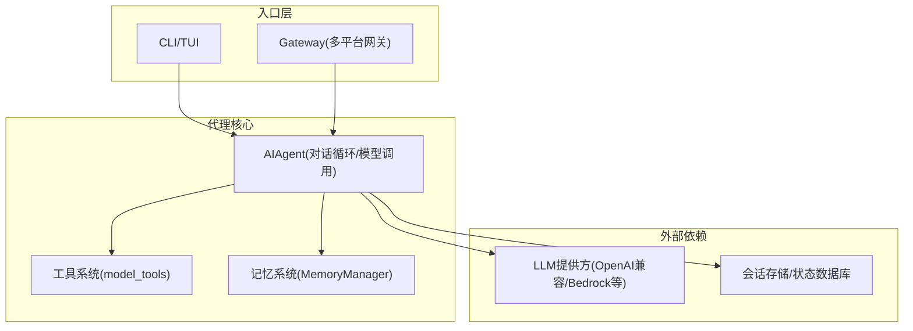
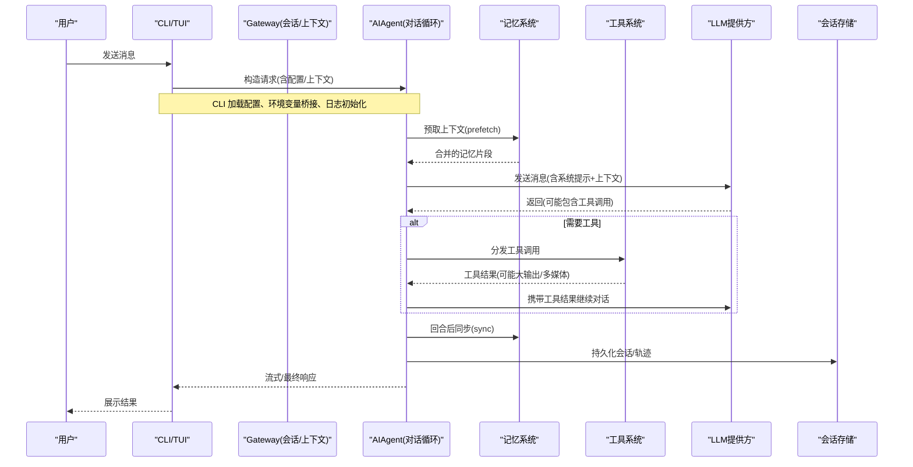
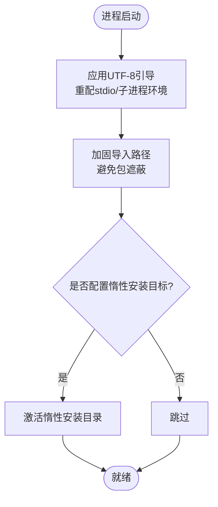
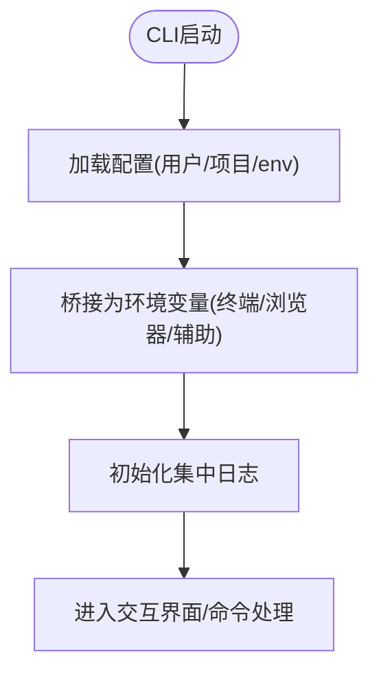
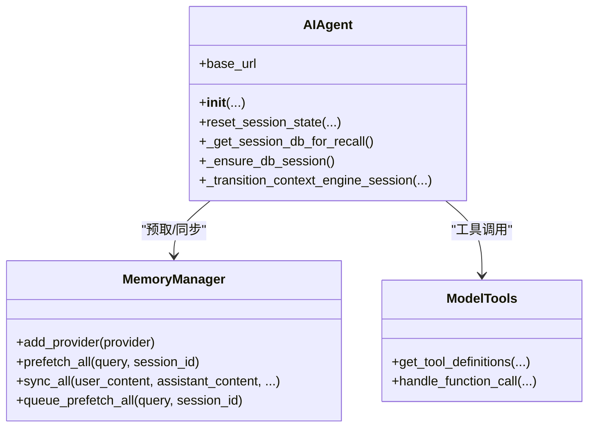
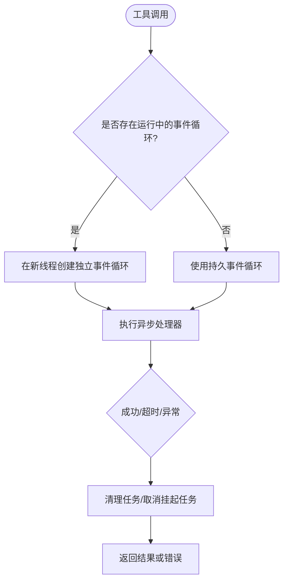
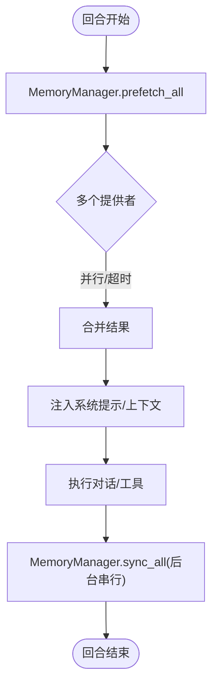
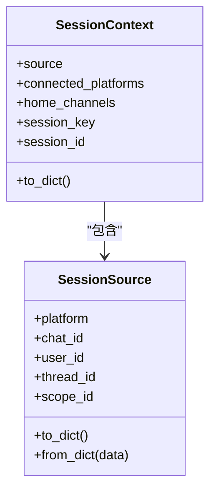
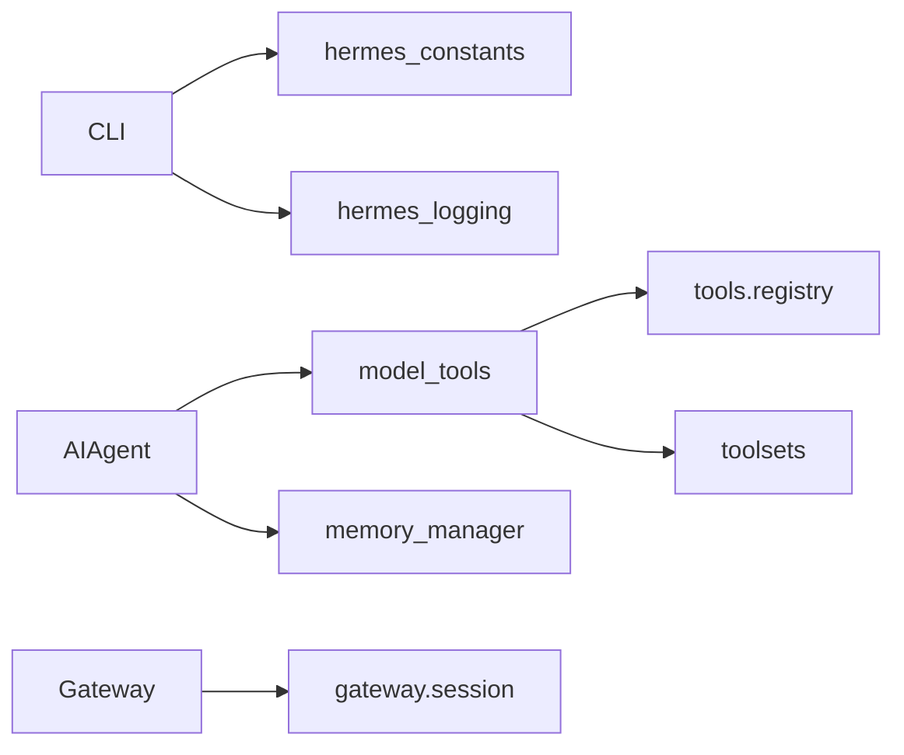

# 核心架构

<cite>
**本文引用的文件**
- [hermes_bootstrap.py](file://hermes_bootstrap.py)
- [cli.py](file://cli.py)
- [run_agent.py](file://run_agent.py)
- [model_tools.py](file://model_tools.py)
- [agent/memory_manager.py](file://agent/memory_manager.py)
- [gateway/__init__.py](file://gateway/__init__.py)
- [gateway/session.py](file://gateway/session.py)
- [hermes_constants.py](file://hermes_constants.py)
</cite>

## 目录
1. [简介](#简介)
2. [项目结构](#项目结构)
3. [核心组件](#核心组件)
4. [架构总览](#架构总览)
5. [详细组件分析](#详细组件分析)
6. [依赖关系分析](#依赖关系分析)
7. [性能考量](#性能考量)
8. [故障排查指南](#故障排查指南)
9. [结论](#结论)
10. [附录](#附录)

## 简介
本文件面向开发者，系统性阐述 Hermes Agent 的核心架构与关键设计决策。重点覆盖：
- 高层架构、模式与组件边界（代理核心、CLI 接口、消息网关、工具系统、记忆系统）
- 从用户输入到响应生成的数据流与控制流
- 横切关注点：安全性、可观测性、灾难恢复
- 技术栈、第三方依赖与版本兼容性约束
- 架构图与组件分解图，帮助快速理解模块职责与依赖

## 项目结构
Hermes Agent 采用“入口层 + 网关层 + 代理核心 + 工具/记忆扩展”的分层组织：
- 入口层：CLI/TUI/Gateway 等入口进程，负责配置加载、环境准备、事件路由
- 网关层：多平台消息接入、会话管理、投递路由、上下文注入
- 代理核心：对话循环、模型调用、工具调度、轨迹与状态持久化
- 工具系统：统一注册与分发，支持同步/异步执行、并发控制、超时与错误处理
- 记忆系统：预取与同步的插件式记忆提供者，统一编排与隔离

图表来源
- [cli.py:1-800](file://cli.py#L1-L800)
- [gateway/__init__.py:1-36](file://gateway/__init__.py#L1-L36)
- [run_agent.py:412-596](file://run_agent.py#L412-L596)
- [model_tools.py:1-200](file://model_tools.py#L1-L200)
- [agent/memory_manager.py:364-470](file://agent/memory_manager.py#L364-L470)

章节来源
- [cli.py:1-800](file://cli.py#L1-L800)
- [gateway/__init__.py:1-36](file://gateway/__init__.py#L1-L36)
- [run_agent.py:412-596](file://run_agent.py#L412-L596)

## 核心组件
- 启动与环境引导
  - Windows UTF-8 引导、导入路径加固、惰性安装目标激活，确保跨平台一致性与可移植性
- CLI 接口
  - 交互式终端界面、配置加载、环境变量桥接、日志初始化、提示词清理与显示优化
- 代理核心
  - AIAgent 作为对话编排器：会话生命周期、模型调用、工具循环、轨迹保存、上下文压缩、重试与降级
- 工具系统
  - 统一注册与发现、同步/异步桥接、并发与超时控制、错误分类与结果限制
- 记忆系统
  - 插件式 MemoryProvider 管理：预取上下文、回合后同步、后台串行写入、流式上下文清洗
- 网关与会话
  - 多平台接入、会话上下文构建、动态系统提示注入、安全校验与 PII 脱敏

章节来源
- [hermes_bootstrap.py:59-122](file://hermes_bootstrap.py#L59-L122)
- [cli.py:409-793](file://cli.py#L409-L793)
- [run_agent.py:412-596](file://run_agent.py#L412-L596)
- [model_tools.py:1-200](file://model_tools.py#L1-L200)
- [agent/memory_manager.py:364-470](file://agent/memory_manager.py#L364-L470)
- [gateway/session.py:148-346](file://gateway/session.py#L148-L346)

## 架构总览
下图展示从用户输入到响应输出的端到端流程，涵盖 CLI/Gateway 入口、AIAgent 对话循环、工具调用、记忆系统、模型调用与状态持久化。

图表来源
- [cli.py:409-793](file://cli.py#L409-L793)
- [run_agent.py:412-596](file://run_agent.py#L412-L596)
- [agent/memory_manager.py:525-694](file://agent/memory_manager.py#L525-L694)
- [model_tools.py:1-200](file://model_tools.py#L1-L200)
- [gateway/session.py:479-745](file://gateway/session.py#L479-L745)

## 详细组件分析

### 启动与环境引导（Windows 与跨平台一致性）
- 在 Windows 上启用 UTF-8 模式并重新配置 stdio，避免编码崩溃；同时抑制 platform 版本查询导致的控制台闪烁与解码异常
- 加固导入路径，防止当前目录下的同名包遮蔽核心模块
- 在不可变镜像中激活惰性安装目标，使之前安装的包在当前运行可被导入

图表来源
- [hermes_bootstrap.py:59-122](file://hermes_bootstrap.py#L59-L122)
- [hermes_bootstrap.py:168-226](file://hermes_bootstrap.py#L168-L226)

章节来源
- [hermes_bootstrap.py:59-122](file://hermes_bootstrap.py#L59-L122)
- [hermes_bootstrap.py:168-226](file://hermes_bootstrap.py#L168-L226)

### CLI 接口（交互入口与配置桥接）
- 配置加载顺序：用户配置 → 项目配置 → 环境变量覆盖；支持忽略用户配置以仅使用内置默认与项目配置
- 将 CLI 配置桥接到环境变量，供工具子系统（如终端沙箱、浏览器、辅助模型）读取
- 日志初始化、提示词清理（去除推理标签与工具调用 XML），提升可读性

图表来源
- [cli.py:409-793](file://cli.py#L409-L793)
- [cli.py:796-800](file://cli.py#L796-L800)

章节来源
- [cli.py:409-793](file://cli.py#L409-L793)
- [cli.py:796-800](file://cli.py#L796-L800)

### 代理核心（AIAgent 对话循环）
- 通过 AIAgent 封装对话生命周期：会话创建、上下文转换、重置、回调钩子、检查点与预算控制
- 集成工具系统与记忆系统：每轮预取记忆、工具调用、结果回传、回合后同步
- 会话持久化：首次使用时创建会话行，失败时重试；轨迹保存与压缩

图表来源
- [run_agent.py:412-596](file://run_agent.py#L412-L596)
- [agent/memory_manager.py:364-470](file://agent/memory_manager.py#L364-L470)
- [model_tools.py:1-200](file://model_tools.py#L1-L200)

章节来源
- [run_agent.py:412-596](file://run_agent.py#L412-L596)
- [agent/memory_manager.py:364-470](file://agent/memory_manager.py#L364-L470)
- [model_tools.py:1-200](file://model_tools.py#L1-L200)

### 工具系统（统一注册与执行）
- 工具发现与注册：导入 tools 包触发自动注册，提供统一的 schema 与处理器
- 同步/异步桥接：根据运行上下文选择合适的事件循环，避免“事件循环已关闭”问题
- 并发与超时：线程池/工作线程隔离，任务取消与资源清理，保证长时间运行的工具不会阻塞主流程

图表来源
- [model_tools.py:77-200](file://model_tools.py#L77-L200)

章节来源
- [model_tools.py:77-200](file://model_tools.py#L77-L200)

### 记忆系统（预取与同步）
- 单一外部提供者限制：避免工具 Schema 膨胀与冲突
- 预取：按提供者并行/超时控制，失败不阻塞其他提供者
- 同步：回合结束后后台串行写入，避免慢提供者阻塞对话完成
- 流式上下文清洗：处理跨分片的记忆上下文标签，确保 UI 不泄露内部标记

图表来源
- [agent/memory_manager.py:525-694](file://agent/memory_manager.py#L525-L694)
- [agent/memory_manager.py:182-361](file://agent/memory_manager.py#L182-L361)

章节来源
- [agent/memory_manager.py:182-361](file://agent/memory_manager.py#L182-L361)
- [agent/memory_manager.py:525-694](file://agent/memory_manager.py#L525-L694)

### 网关与会话（多平台接入与上下文注入）
- 会话源与会话上下文：描述消息来源、平台能力、家庭频道、投递选项
- 动态系统提示：根据平台注入行为说明与可用工具提示，必要时进行 PII 脱敏
- 安全校验：对会话键与路径相关值进行严格过滤，防止路径穿越

图表来源
- [gateway/session.py:148-346](file://gateway/session.py#L148-L346)
- [gateway/session.py:479-745](file://gateway/session.py#L479-L745)

章节来源
- [gateway/session.py:148-346](file://gateway/session.py#L148-L346)
- [gateway/session.py:479-745](file://gateway/session.py#L479-L745)

## 依赖关系分析
- 入口依赖
  - CLI 依赖 hermes_constants 获取 HERMES_HOME，依赖 hermes_logging 初始化日志
- 代理核心依赖
  - run_agent.py 依赖 model_tools 进行工具发现与执行，依赖 agent.memory_manager 进行记忆预取/同步
- 网关依赖
  - gateway.session 提供会话上下文构建与 PII 脱敏，gateway.__init__ 暴露配置与会话管理 API
- 工具系统依赖
  - model_tools 基于 tools.registry 进行工具注册与分发，toolsets 用于工具集解析与验证

图表来源
- [cli.py:409-793](file://cli.py#L409-L793)
- [run_agent.py:137-223](file://run_agent.py#L137-L223)
- [model_tools.py:1-200](file://model_tools.py#L1-L200)
- [gateway/__init__.py:1-36](file://gateway/__init__.py#L1-L36)
- [gateway/session.py:148-346](file://gateway/session.py#L148-L346)

章节来源
- [cli.py:409-793](file://cli.py#L409-L793)
- [run_agent.py:137-223](file://run_agent.py#L137-L223)
- [model_tools.py:1-200](file://model_tools.py#L1-L200)
- [gateway/__init__.py:1-36](file://gateway/__init__.py#L1-L36)
- [gateway/session.py:148-346](file://gateway/session.py#L148-L346)

## 性能考量
- 事件循环复用：工具系统维护持久事件循环，避免频繁创建销毁导致的客户端连接问题
- 并发与超时：工具执行使用线程池与超时控制，防止长耗时操作阻塞主流程
- 记忆系统后台写入：使用单工作线程串行写入，避免竞争与乱序；外部预取带超时保护
- 会话持久化：首次延迟创建会话行，失败重试；轨迹保存与压缩减少上下文大小
- 流式上下文清洗：避免 UI 渲染额外开销，提高响应速度

[本节为通用性能讨论，无需特定文件引用]

## 故障排查指南
- 启动阶段
  - Windows UTF-8 未生效：确认 hermes_bootstrap 已导入且 reconfigure 成功
  - 导入路径遮蔽：检查当前目录是否存在同名包，必要时设置 HERMES_PYTHON_SRC_ROOT
- 工具执行
  - “事件循环已关闭”：确认通过 model_tools._run_async 执行异步处理器
  - 工具超时/卡死：检查工具实现是否正确响应取消信号，查看超时配置
- 记忆系统
  - 外部提供者超时：调整 external_prefetch_timeout，观察日志定位慢查询
  - 流式上下文泄漏：确认 StreamingContextScrubber 正确实例化并在每个新响应重置
- 会话与网关
  - 会话键不安全：检查传入的 session_key 是否包含路径穿越字符
  - PII 脱敏：确认平台是否在 _PII_SAFE_PLATFORMS 或通过平台注册表标记为安全

章节来源
- [hermes_bootstrap.py:59-122](file://hermes_bootstrap.py#L59-L122)
- [model_tools.py:114-200](file://model_tools.py#L114-L200)
- [agent/memory_manager.py:182-361](file://agent/memory_manager.py#L182-L361)
- [gateway/session.py:109-146](file://gateway/session.py#L109-L146)
- [gateway/session.py:349-357](file://gateway/session.py#L349-L357)

## 结论
Hermes Agent 通过清晰的层次划分与模块化设计，实现了可扩展的代理核心、稳定的工具系统与灵活的记忆系统。CLI/Gateway 作为统一入口，结合会话管理与上下文注入，提供了跨平台的稳定体验。系统在安全性（路径与 PII 防护）、性能（事件循环复用、并发与超时控制）与可靠性（后台写入、重试与降级）方面均有充分考虑。建议开发者在扩展新功能时遵循现有模式：通过注册机制接入工具/记忆提供者，保持上下文与状态的清晰边界，并确保错误处理与可观测性完备。

[本节为总结性内容，无需特定文件引用]

## 附录
- 技术栈与依赖
  - Python 运行时与标准库
  - OpenAI 兼容 SDK（延迟加载以减少冷启动时间）
  - 可选平台 SDK（Telegram/Discord/WhatsApp 等，按需加载）
  - Node.js 管理树（由 hermes_constants 自动修复/升级）
- 版本兼容性
  - Windows UTF-8 模式要求 Python 3.7+（reconfigure API）
  - Node.js 目标主版本由 HERMES_NODE_TARGET_MAJOR 控制，默认 22
  - 平台适配器需支持 is_reconnect 参数以保证重连契约

[本节为通用信息，无需特定文件引用]