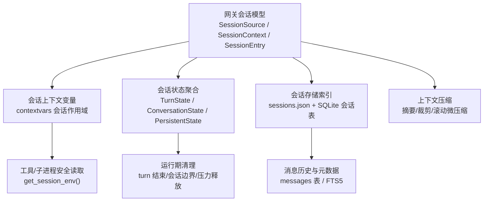
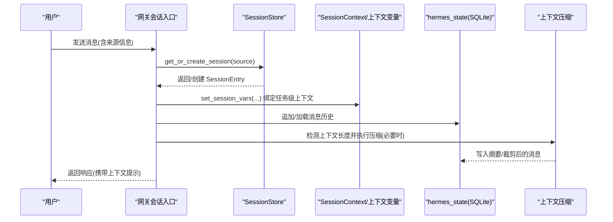
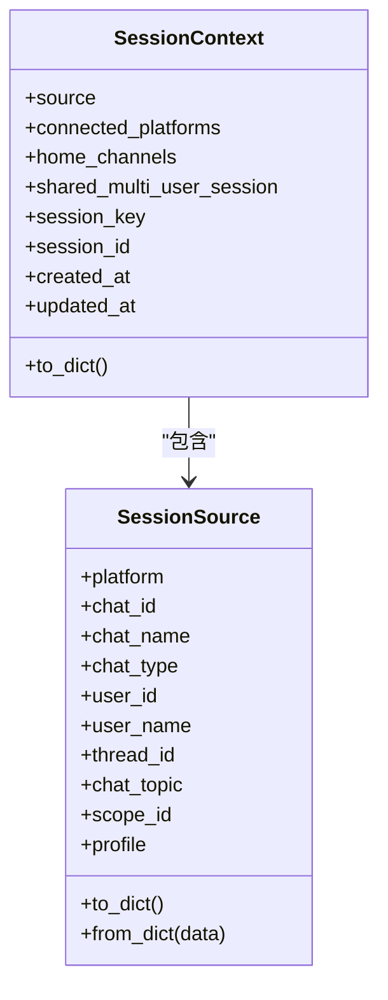
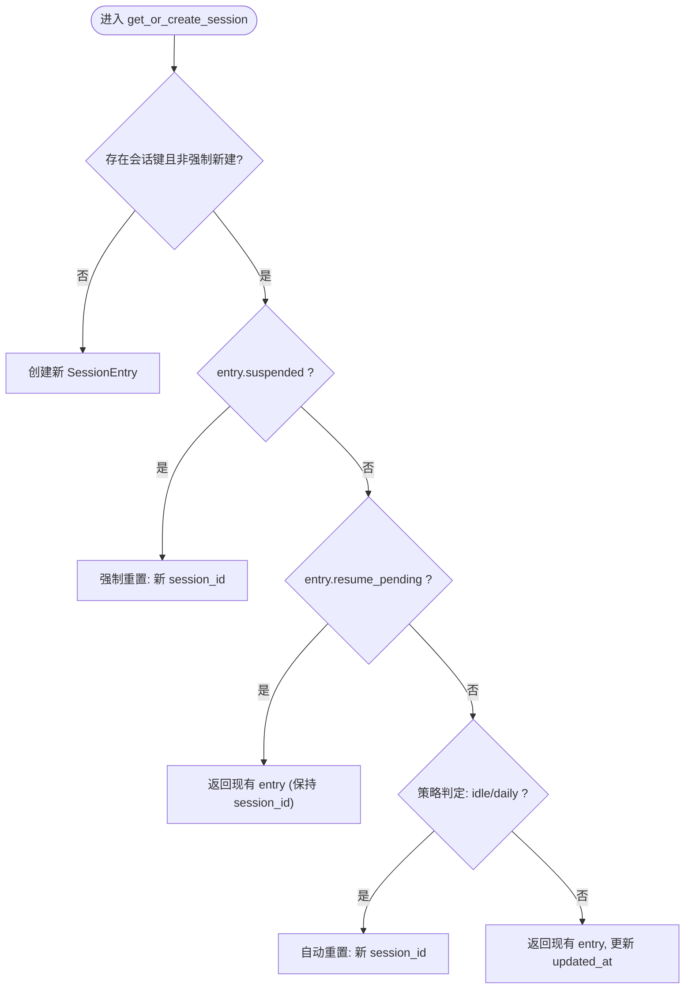
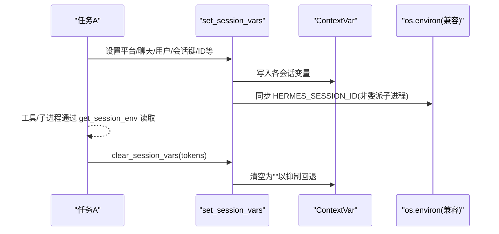
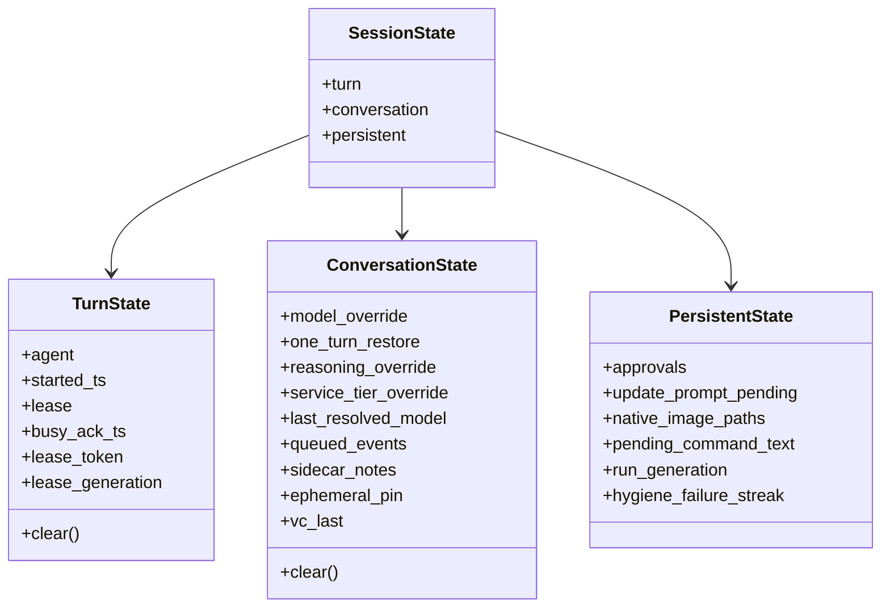
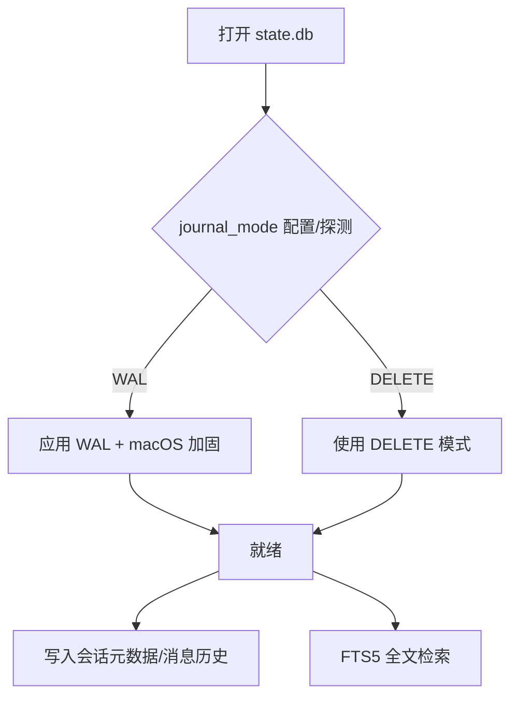
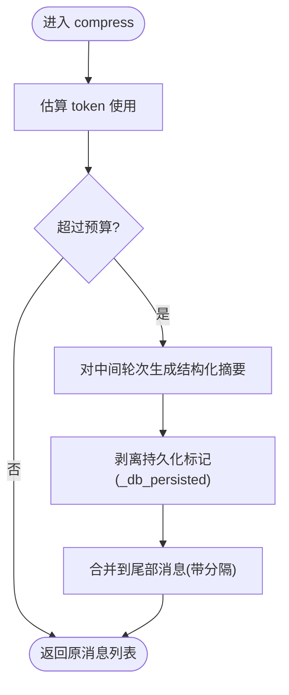
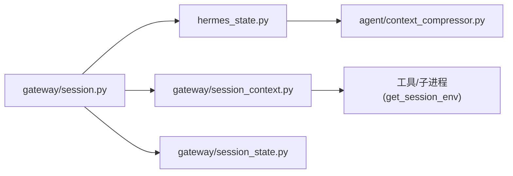

# 会话管理

<cite>
**本文引用的文件**
- [gateway/session.py](file://gateway/session.py)
- [gateway/session_context.py](file://gateway/session_context.py)
- [gateway/session_state.py](file://gateway/session_state.py)
- [hermes_state.py](file://hermes_state.py)
- [agent/context_compressor.py](file://agent/context_compressor.py)
- [docs/session-lifecycle.md](file://docs/session-lifecycle.md)
</cite>

## 目录
1. [简介](#简介)
2. [项目结构](#项目结构)
3. [核心组件](#核心组件)
4. [架构总览](#架构总览)
5. [详细组件分析](#详细组件分析)
6. [依赖关系分析](#依赖关系分析)
7. [性能考量](#性能考量)
8. [故障排查指南](#故障排查指南)
9. [结论](#结论)
10. [附录](#附录)

## 简介
本文件系统性说明 Hermes 会话管理系统的设计与实现，覆盖会话生命周期（创建、上下文维护、状态持久化、清理）、会话上下文数据结构、用户信息存储、对话历史管理与上下文压缩机制；解释基于时间、消息数量或内存使用的自动重置策略；阐述多租户/会话隔离与安全考虑；提供配置选项、最佳实践、监控与会话异常处理建议。

## 项目结构
Hermes 的会话管理由网关层数据模型与运行时上下文、持久化存储、以及上下文压缩等模块共同构成：
- 网关会话模型与存储：定义来源描述、会话上下文、会话条目、键生成与存储索引，负责会话创建、恢复、过期与清理。
- 会话上下文变量：使用 contextvars 提供并发安全的任务级会话变量，替代进程全局环境变量，避免并发污染。
- 会话状态聚合：将“每轮”“每会话”“持久化”三类状态统一封装，明确生命周期边界与清理点。
- 持久化存储：SQLite 作为会话元数据与完整消息历史的权威存储，支持 WAL/DELETE 模式自适应、FTS5 全文检索、压缩拆分链。
- 上下文压缩：在长对话中通过摘要与裁剪维持上下文窗口，保留头尾关键信息并生成可回滚的历史快照。

图表来源
- [gateway/session.py:148-346](file://gateway/session.py#L148-L346)
- [gateway/session_context.py:74-148](file://gateway/session_context.py#L74-L148)
- [gateway/session_state.py:51-178](file://gateway/session_state.py#L51-L178)
- [hermes_state.py:1-15](file://hermes_state.py#L1-L15)
- [agent/context_compressor.py:1-17](file://agent/context_compressor.py#L1-L17)

章节来源
- [docs/session-lifecycle.md:7-19](file://docs/session-lifecycle.md#L7-L19)

## 核心组件
- 会话来源与上下文
  - SessionSource：记录消息来源平台、聊天标识、线程、用户、范围隔离等，用于路由、隔离与系统提示注入。
  - SessionContext：组合来源、已连接平台、默认投递渠道、共享多用户会话标记及会话元数据，用于动态系统提示构建。
- 会话条目与存储
  - SessionEntry：会话键到当前会话 ID 的映射，包含创建/更新时间、来源、显示名、平台、聊天类型、令牌计数、标志位（是否挂起、恢复中、是否新鲜重置等）。
  - SessionStore：内存索引 + sessions.json 持久化，结合 hermes_state 的 SQLite 完成会话元数据与消息历史读写。
- 会话上下文变量
  - 使用 contextvars 为每个 asyncio 任务绑定会话相关变量（平台、聊天、用户、会话键/ID、消息 ID、异步投递能力等），并提供 get_session_env 兼容旧路径。
- 会话状态聚合
  - TurnState：单轮运行态（代理实例、开始时间、租约、忙确认）。
  - ConversationState：会话级覆盖项（模型/推理/服务等级）、队列事件、侧边笔记、临时钉住、语音通道上下文等。
  - PersistentState：审批、更新提示、原生图片、待处理命令文本、运行代数、健康检查失败连串计数等。
- 持久化存储
  - hermes_state：SQLite 会话数据库，WAL/DELETE 自适应、FTS5 搜索、压缩触发拆分、工作区分组、测试隔离保护等。
- 上下文压缩
  - agent.context_compressor：自动上下文窗口压缩，使用辅助模型对中间轮次进行摘要，保护头尾，支持滚动微压缩与持久化标记剥离。

章节来源
- [gateway/session.py:148-346](file://gateway/session.py#L148-L346)
- [gateway/session.py:773-800](file://gateway/session.py#L773-L800)
- [gateway/session_context.py:74-148](file://gateway/session_context.py#L74-L148)
- [gateway/session_state.py:51-178](file://gateway/session_state.py#L51-L178)
- [hermes_state.py:1-15](file://hermes_state.py#L1-L15)
- [agent/context_compressor.py:1-17](file://agent/context_compressor.py#L1-L17)

## 架构总览
下图展示从消息到达、会话解析、上下文注入、到持久化与压缩的整体流程。

图表来源
- [gateway/session.py:148-346](file://gateway/session.py#L148-L346)
- [gateway/session_context.py:206-271](file://gateway/session_context.py#L206-L271)
- [hermes_state.py:1-15](file://hermes_state.py#L1-L15)
- [agent/context_compressor.py:1-17](file://agent/context_compressor.py#L1-L17)

## 详细组件分析

### 会话来源与上下文（SessionSource / SessionContext）
- 设计要点
  - 来源字段涵盖平台、聊天/线程/用户标识、角色授权、范围隔离（scope_id/guild_id 迁移兼容）、自动线程创建标记、上游中继投递信任信号等。
  - 上下文构造会注入平台特性、可用平台列表、默认投递渠道、多用户会话标记，并在需要时对 PII 进行脱敏（哈希用户/聊天 ID）。
- 数据处理
  - to_dict/from_dict 支持序列化与反序列化，便于跨进程/重启后重建上下文。
  - 构建系统提示时，对不可信元数据进行转义与截断，防止提示注入。

图表来源
- [gateway/session.py:148-346](file://gateway/session.py#L148-L346)

章节来源
- [gateway/session.py:148-346](file://gateway/session.py#L148-L346)

### 会话条目与存储（SessionEntry / SessionStore）
- 设计要点
  - SessionEntry 维护会话键到会话 ID 的映射，附带来源、显示名、平台、聊天类型、令牌计数与多种标志位（挂起、恢复中、新鲜重置、过期最终化等）。
  - SessionStore 提供获取/创建、重置、切换、挂起、恢复标记、最近活跃恢复、剪枝、转录追加/重写/加载、回退等操作。
- 键生成与隔离
  - 会话键按平台、聊天类型、聊天/线程/参与者 ID 组合，支持群组/频道按用户隔离、线程共享或隔离的策略。
  - WhatsApp 号码规范化以避免会话碎片化。
- 重启恢复
  - 无干净关闭标记时，标记最近活跃的会话为“恢复中”，启动后自动继续；连续多次重启仍活跃则强制挂起。

图表来源
- [docs/session-lifecycle.md:99-141](file://docs/session-lifecycle.md#L99-L141)

章节来源
- [gateway/session.py:773-800](file://gateway/session.py#L773-L800)
- [docs/session-lifecycle.md:144-203](file://docs/session-lifecycle.md#L144-L203)
- [docs/session-lifecycle.md:207-258](file://docs/session-lifecycle.md#L207-L258)
- [docs/session-lifecycle.md:345-439](file://docs/session-lifecycle.md#L345-L439)

### 会话上下文变量（contextvars 会话作用域）
- 设计要点
  - 用 ContextVar 替代进程全局环境变量，确保并发任务间互不干扰；提供 set_session_vars/clear_session_vars/reset_session_vars 等接口。
  - 暴露 get_session_env(name, default) 兼容旧调用方式，优先读 ContextVar，否则回退到 os.environ。
  - 支持声明“无异步投递能力”的会话（如一次性 API 请求），避免工具承诺无法交付的后台结果。
- 安全性与隔离
  - 子进程环境桥根据“会话上下文是否启用”决定继承策略，避免泄露父任务的会话身份。
  - 提供 session_is_messaging_surface 判断是否为人类聊天通道，影响输出格式与投递标签。

图表来源
- [gateway/session_context.py:206-271](file://gateway/session_context.py#L206-L271)
- [gateway/session_context.py:363-386](file://gateway/session_context.py#L363-L386)

章节来源
- [gateway/session_context.py:74-148](file://gateway/session_context.py#L74-L148)
- [gateway/session_context.py:206-271](file://gateway/session_context.py#L206-L271)
- [gateway/session_context.py:315-361](file://gateway/session_context.py#L315-L361)
- [gateway/session_context.py:363-386](file://gateway/session_context.py#L363-L386)
- [gateway/session_context.py:418-496](file://gateway/session_context.py#L418-L496)

### 会话状态聚合（TurnState / ConversationState / PersistentState）
- 设计要点
  - 将历史分散的字典属性收敛为三个作用域清晰的 dataclass，分别对应“每轮”“每会话”“持久化”生命周期。
  - 提供 legacy dict view 适配旧测试与少量遗留访问点，保证向后兼容。
- 清理策略
  - TurnState.clear 在每轮结束时重置代理实例、开始时间、租约、忙确认。
  - ConversationState.clear 在会话边界重置覆盖项、队列事件、侧边笔记、临时钉住、语音通道上下文等。
  - PersistentState 拥有独立生命周期，不被整批重置（例如审批、更新提示单独清理）。

图表来源
- [gateway/session_state.py:51-178](file://gateway/session_state.py#L51-L178)

章节来源
- [gateway/session_state.py:51-178](file://gateway/session_state.py#L51-L178)
- [gateway/session_state.py:181-477](file://gateway/session_state.py#L181-L477)

### 持久化存储（hermes_state）
- 设计要点
  - SQLite 作为权威存储，支持 WAL 与 DELETE 模式自适应，网络文件系统/特定平台下降级以保证可用性。
  - FTS5 全文检索，支持跨会话消息快速搜索。
  - 压缩触发的会话拆分（parent_session_id 链），工作区分组（git repo root 或 cwd），测试隔离保护（禁止在 pytest 中误写生产库）。
- 健壮性
  - WAL-reset 漏洞防护：对受影响版本拒绝在新库上启用 WAL，已有 WAL 不降级。
  - macOS 强化：checkpoint_fullfsync 与 synchronous=FULL 保障关机场景下的持久性。
  - 日志与错误传播：记录最后一次初始化错误，供 /resume 等命令提示原因。

图表来源
- [hermes_state.py:813-1027](file://hermes_state.py#L813-L1027)
- [hermes_state.py:1066-1200](file://hermes_state.py#L1066-L1200)

章节来源
- [hermes_state.py:1-15](file://hermes_state.py#L1-L15)
- [hermes_state.py:813-1027](file://hermes_state.py#L813-L1027)
- [hermes_state.py:1066-1200](file://hermes_state.py#L1066-L1200)

### 上下文压缩（agent.context_compressor）
- 设计要点
  - 使用辅助模型对中间轮次进行结构化摘要，保护头部与尾部上下文，保留工具调用/结果的必要细节。
  - 支持滚动微压缩与批量压缩，插入“历史快照”标题，避免被当作活跃指令。
  - 持久化标记剥离：压缩过程中移除 _db_persisted 等标记，避免后续写入跳过。
- 触发与回滚
  - 当上下文接近模型限制或达到阈值时触发压缩；压缩产物可被回滚/重组，前端可通过元数据区分压缩消息。

图表来源
- [agent/context_compressor.py:1-17](file://agent/context_compressor.py#L1-L17)
- [agent/context_compressor.py:100-179](file://agent/context_compressor.py#L100-L179)
- [agent/context_compressor.py:182-199](file://agent/context_compressor.py#L182-L199)

章节来源
- [agent/context_compressor.py:1-17](file://agent/context_compressor.py#L1-L17)
- [agent/context_compressor.py:100-179](file://agent/context_compressor.py#L100-L179)
- [agent/context_compressor.py:182-199](file://agent/context_compressor.py#L182-L199)

## 依赖关系分析
- 耦合与内聚
  - gateway/session.py 与 hermes_state.py 强耦合于持久化层；gateway/session_context.py 解耦于具体存储，仅关注任务级上下文。
  - gateway/session_state.py 将运行期状态按生命周期分层，降低边界漂移风险。
  - agent/context_compressor.py 依赖 hermes_state 的消息写入与 hermes_constants 等基础能力。
- 外部依赖
  - SQLite（WAL/DELETE 模式、FTS5、macOS fsync 行为）。
  - 平台适配器（Telegram/Discord/Slack/WhatsApp/MATRIX 等）通过 SessionSource 传递来源信息。
- 循环依赖
  - 通过延迟导入与模块重导出避免加载时循环（如 config 与 platform_registry 的按需引入）。

图表来源
- [gateway/session.py:148-346](file://gateway/session.py#L148-L346)
- [hermes_state.py:1-15](file://hermes_state.py#L1-L15)
- [gateway/session_context.py:74-148](file://gateway/session_context.py#L74-L148)
- [gateway/session_state.py:51-178](file://gateway/session_state.py#L51-L178)
- [agent/context_compressor.py:1-17](file://agent/context_compressor.py#L1-L17)

章节来源
- [gateway/session.py:148-346](file://gateway/session.py#L148-L346)
- [hermes_state.py:1-15](file://hermes_state.py#L1-L15)
- [gateway/session_context.py:74-148](file://gateway/session_context.py#L74-L148)
- [gateway/session_state.py:51-178](file://gateway/session_state.py#L51-L178)
- [agent/context_compressor.py:1-17](file://agent/context_compressor.py#L1-L17)

## 性能考量
- 会话缓存与内存压力
  - 网关维护 AIAgent LRU 缓存，空闲 TTL 与内存高水位触发回收；RSS 超限时按 LRU 驱逐会话，释放驻留的完整转录。
  - 受保护的 MRU 会话与正在进行的轮次不会被驱逐，确保关键会话稳定性。
- 数据库模式选择
  - 在网络文件系统或 ZFS 等环境下，WAL 可能不可用或不稳定，自动降级至 DELETE 模式，牺牲并发读但保证功能可用。
  - macOS 下启用 checkpoint_fullfsync 与 synchronous=FULL，提升关机场景下的持久性。
- 压缩效率
  - 压缩前进行工具输出裁剪与粗略 token 估算，减少不必要的 LLM 调用；滚动微压缩降低单次压缩成本。

[本节为通用性能讨论，无需列出具体文件来源]

## 故障排查指南
- 会话数据库不可用
  - 现象：/resume、/title、/history、/branch 等命令报“会话数据库不可用”。
  - 原因：WAL 不支持（NFS/SMB/FUSE/ZFS）、SQLite WAL-reset 漏洞、磁盘 I/O 错误等。
  - 处理：查看最后初始化错误信息；必要时切换到 journal_mode=delete；升级 SQLite 或更换存储介质。
- 会话卡死与恢复
  - 现象：会话在多轮重启后仍活跃。
  - 处理：系统会在连续多次重启后强制挂起；也可手动 /stop 挂起；检查 clean_shutdown 标记与 drain 超时。
- 上下文压缩失败
  - 现象：压缩超时或配额不足。
  - 处理：检查辅助模型凭据与配额；观察健康检查失败连串计数；必要时调整压缩策略或放宽预算。
- 上下文泄漏
  - 现象：子进程读到错误的会话身份。
  - 处理：确保在每轮入口处 reset_session_vars，再 set_session_vars；避免在委派子进程中写进程全局环境变量。

章节来源
- [hermes_state.py:520-565](file://hermes_state.py#L520-L565)
- [hermes_state.py:674-695](file://hermes_state.py#L674-L695)
- [docs/session-lifecycle.md:345-439](file://docs/session-lifecycle.md#L345-L439)
- [gateway/session_context.py:315-361](file://gateway/session_context.py#L315-L361)

## 结论
Hermes 会话管理系统通过清晰的数据模型（SessionSource/SessionContext/SessionEntry）、并发安全的上下文变量（contextvars）、分层的状态聚合（Turn/Conversation/Persistent）、健壮的持久化（SQLite/WAL/FTS5）与智能的上下文压缩，实现了高可靠、可扩展、易维护的会话生命周期管理。其自动重置、重启恢复、内存压力释放与多租户隔离策略，保障了在高并发与长对话场景下的稳定性与性能。配合完善的配置选项与监控手段，可在不同部署环境中灵活调优。

## 附录
- 配置选项（节选）
  - group_sessions_per_user：群组/频道是否按用户隔离（默认 true）。
  - thread_sessions_per_user：线程是否按用户隔离（默认 false）。
  - session_store_max_age_days：会话条目剪枝天数（0 禁用）。
  - agent.gateway_auto_continue_freshness：自动继续的新鲜度窗口（秒）。
  - agent.agent_cache.max_size/idle_ttl_secs/memory_high_mb：AIAgent 缓存大小、空闲 TTL、内存高水位。
  - database.journal_mode：WAL 或 DELETE（默认 wal，网络文件系统建议 delete）。
- 最佳实践
  - 合理设置会话重置策略（idle/daily/both），避免上下文膨胀。
  - 开启上下文压缩，控制最大迭代次数与 token 预算。
  - 在网关与 CLI/TUI 中统一使用 get_session_env 读取会话变量，避免直接操作 os.environ。
  - 监控 RSS 与压缩失败连串计数，及时释放内存与调整策略。
  - 在生产环境评估 SQLite 版本与文件系统兼容性，必要时采用 DELETE 模式。

[本节为通用指导，无需列出具体文件来源]