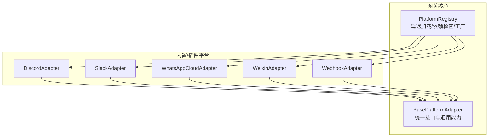
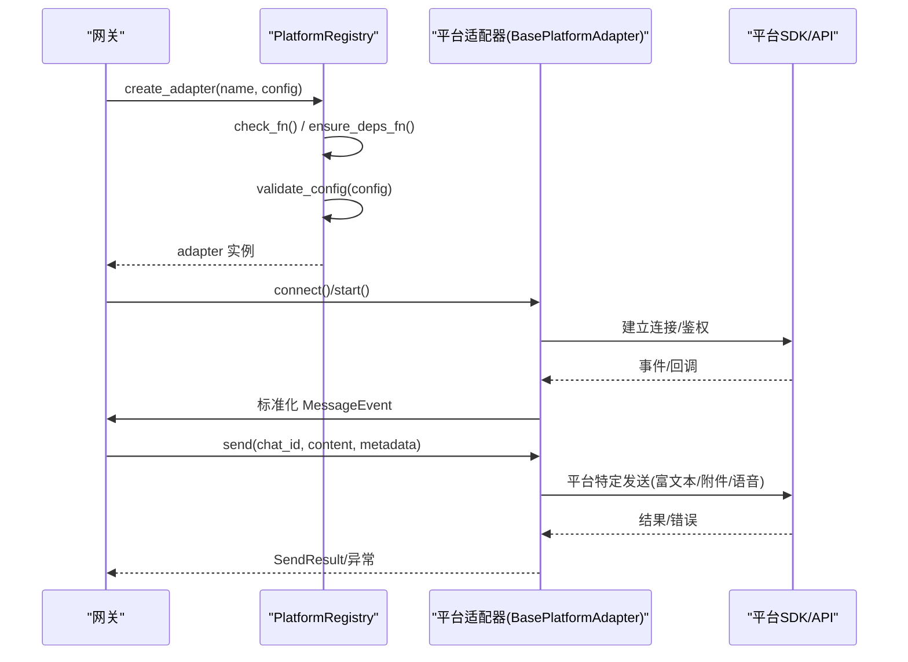
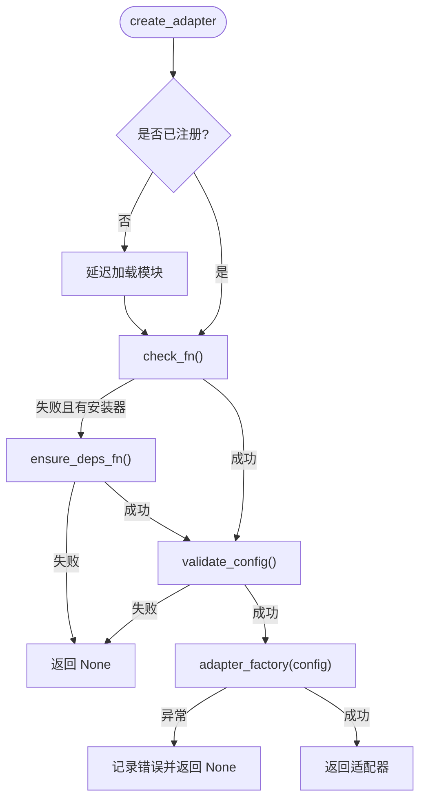
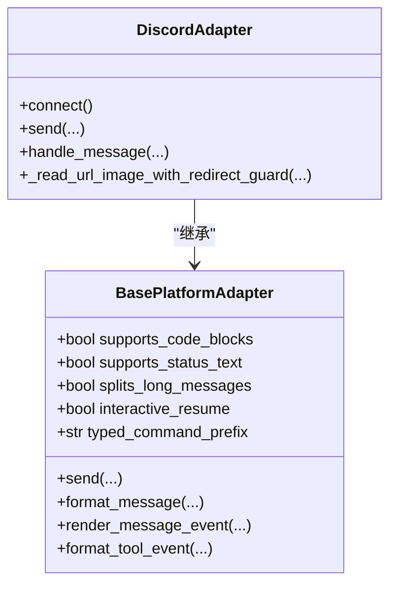
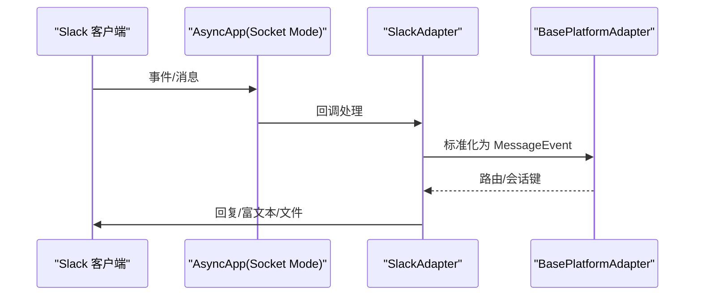
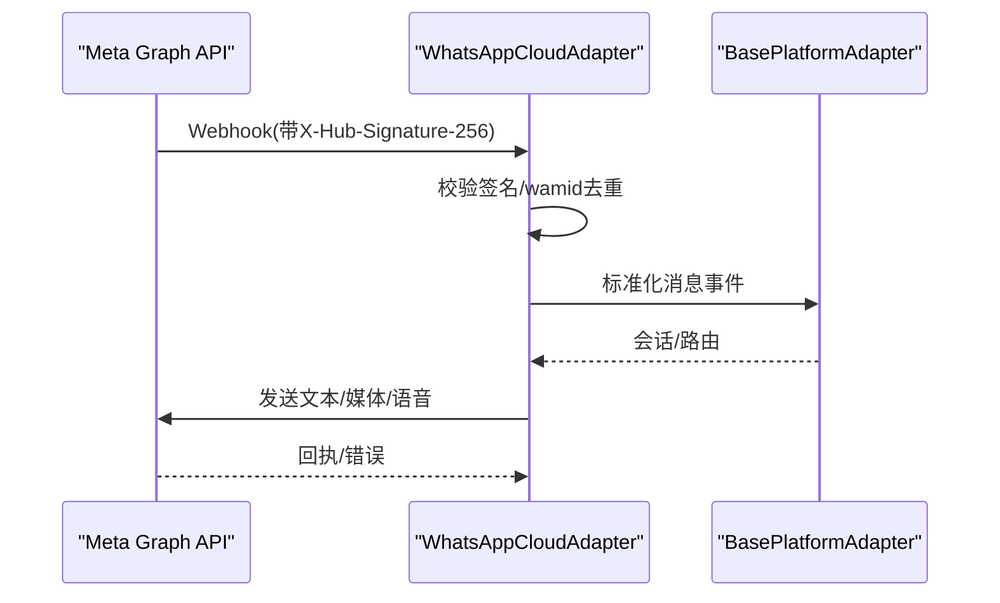
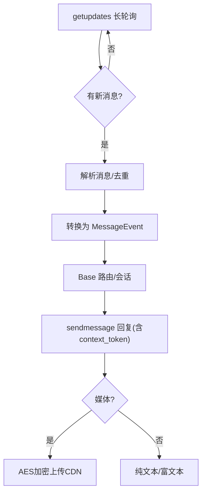
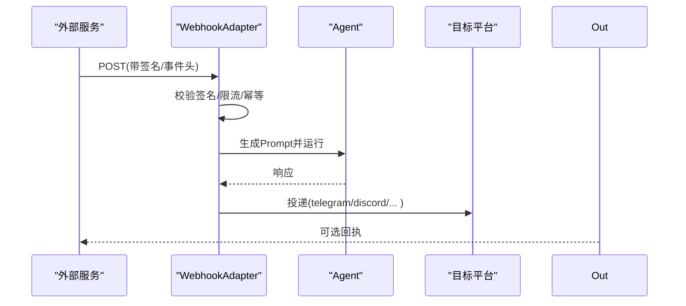
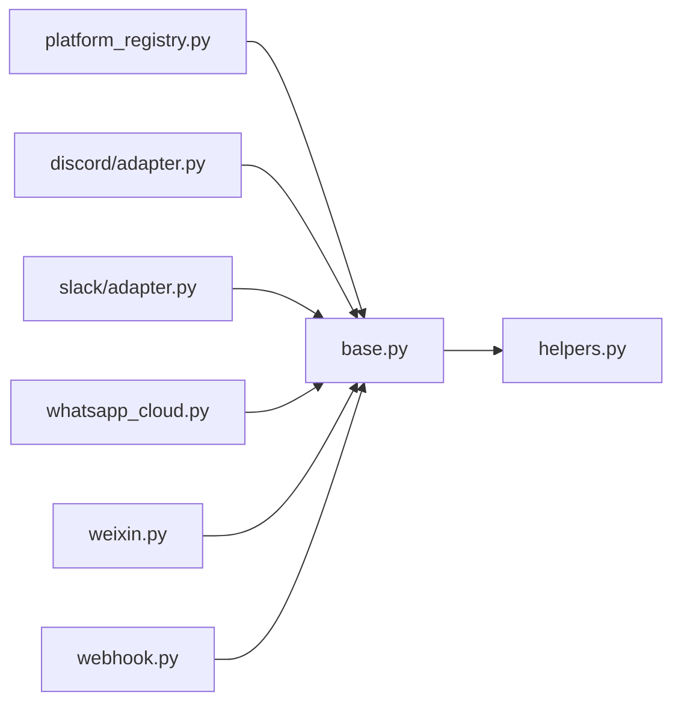

# 平台适配器

<cite>
**本文引用的文件**
- [gateway/platforms/base.py](file://gateway/platforms/base.py)
- [gateway/platform_registry.py](file://gateway/platform_registry.py)
- [plugins/platforms/discord/adapter.py](file://plugins/platforms/discord/adapter.py)
- [plugins/platforms/slack/adapter.py](file://plugins/platforms/slack/adapter.py)
- [gateway/platforms/webhook.py](file://gateway/platforms/webhook.py)
- [gateway/platforms/whatsapp_cloud.py](file://gateway/platforms/whatsapp_cloud.py)
- [gateway/platforms/weixin.py](file://gateway/platforms/weixin.py)
- [gateway/platforms/helpers.py](file://gateway/platforms/helpers.py)
</cite>

## 目录
1. [简介](#简介)
2. [项目结构](#项目结构)
3. [核心组件](#核心组件)
4. [架构总览](#架构总览)
5. [详细组件分析](#详细组件分析)
6. [依赖关系分析](#依赖关系分析)
7. [性能考虑](#性能考虑)
8. [故障排查指南](#故障排查指南)
9. [结论](#结论)
10. [附录：新增平台适配器开发指南](#附录：新增平台适配器开发指南)

## 简介
本文件面向 Hermes 消息网关的“平台适配器”子系统，系统性说明其抽象基类、统一接口、注册机制与主流平台（Telegram、Discord、Slack、WhatsApp、微信等）的实现要点。文档覆盖认证机制、消息格式转换、API 调用封装、错误处理策略、连接管理与重连、以及性能优化技巧，并提供新增平台适配器的完整步骤与示例路径指引。

## 项目结构
Hermes 的平台适配器采用“基础抽象 + 插件化实现 + 集中注册”的分层设计：
- 基础抽象与通用能力集中在 gateway/platforms/base.py，定义 BasePlatformAdapter 及消息、发送、流式 TTS、媒体缓存、代理与长度限制等通用工具。
- 各平台具体实现位于 plugins/platforms/* 或 gateway/platforms/*，如 Discord、Slack、WhatsApp Cloud、Weixin、Webhook 等。
- 平台注册中心 gateway/platform_registry.py 提供延迟加载、依赖检查、配置校验与工厂创建，避免启动时全量导入重型 SDK。

**图示来源**
- [gateway/platforms/base.py:2650-2800](file://gateway/platforms/base.py#L2650-L2800)
- [gateway/platform_registry.py:183-382](file://gateway/platform_registry.py#L183-L382)
- [plugins/platforms/discord/adapter.py:1-200](file://plugins/platforms/discord/adapter.py#L1-L200)
- [plugins/platforms/slack/adapter.py:1-200](file://plugins/platforms/slack/adapter.py#L1-L200)
- [gateway/platforms/whatsapp_cloud.py:1-200](file://gateway/platforms/whatsapp_cloud.py#L1-L200)
- [gateway/platforms/weixin.py:1-200](file://gateway/platforms/weixin.py#L1-L200)
- [gateway/platforms/webhook.py:1-200](file://gateway/platforms/webhook.py#L1-L200)

**章节来源**
- [gateway/platforms/base.py:2650-2800](file://gateway/platforms/base.py#L2650-L2800)
- [gateway/platform_registry.py:183-382](file://gateway/platform_registry.py#L183-L382)

## 核心组件
- BasePlatformAdapter：所有平台适配器的抽象基类，定义连接生命周期、消息收发、流式输出、TTS、富文本/代码块支持、命令前缀、异步投递能力、致命错误状态等。
- PlatformRegistry：平台适配器注册表，负责延迟加载、依赖探测、配置校验、实例创建，屏蔽重型 SDK 的冷启动开销。
- helpers：跨平台共享工具，如消息去重、文本批聚合、Markdown 剥离等，减少重复实现。

关键职责概览：
- 统一接口：send、format_message、supports_code_blocks、supports_status_text、splits_long_messages、interactive_resume 等能力标志。
- 通用能力：代理解析、入站媒体大小限制、SSRF 防护、UTF-16 长度计算、自动 TTS 输出路径选择等。
- 注册流程：check_fn/ensure_deps_fn/validate_config/adapter_factory 四段式，保证“先检查、再安装、后构造”。

**章节来源**
- [gateway/platforms/base.py:2650-3200](file://gateway/platforms/base.py#L2650-L3200)
- [gateway/platform_registry.py:38-181](file://gateway/platform_registry.py#L38-L181)
- [gateway/platforms/helpers.py:24-180](file://gateway/platforms/helpers.py#L24-L180)

## 架构总览
下图展示从请求到平台适配器的整体流程，包括注册、连接、收发消息与错误处理。

**图示来源**
- [gateway/platform_registry.py:299-377](file://gateway/platform_registry.py#L299-L377)
- [gateway/platforms/base.py:2650-2800](file://gateway/platforms/base.py#L2650-L2800)

## 详细组件分析

### 基础抽象与统一接口（BasePlatformAdapter）
- 能力标志：
  - supports_code_blocks：是否原生渲染代码块（用于进度提示与富文本）。
  - supports_status_text：是否支持“打字中/工作状态”文本。
  - splits_long_messages：是否由适配器自行拆分长消息（保留平台多消息能力）。
  - interactive_resume：是否在恢复会话时主动询问用户下一步（非交互平台应设为 False）。
  - typed_command_prefix：可被用户键入的命令前缀（如 Slack 线程内 "/" 受限，使用 "!" 重写）。
- 流式与 TTS：
  - streaming_overflow_limit：允许单条更大内容的上限（如 Telegram Rich Messages）。
  - send_draft：流式草稿预览更新。
  - render_message_event/format_tool_event：结构化流事件的呈现策略。
- 安全与资源：
  - 入站媒体大小限制、SSRF 重定向保护、代理解析与 NO_PROXY 匹配。
  - UTF-16 长度计算与截断，保障平台字符限制（如 Telegram 4096）。
- 错误与状态：
  - has_fatal_error/fatal_error_* 暴露致命错误状态；_mark_connected/_mark_disconnected/_set_fatal_error 管理运行态。

**章节来源**
- [gateway/platforms/base.py:2650-3200](file://gateway/platforms/base.py#L2650-L3200)
- [gateway/platforms/base.py:153-253](file://gateway/platforms/base.py#L153-L253)
- [gateway/platforms/base.py:417-517](file://gateway/platforms/base.py#L417-L517)
- [gateway/platforms/base.py:738-800](file://gateway/platforms/base.py#L738-L800)

### 平台注册中心（PlatformRegistry）
- 延迟加载：通过 _deferred 字典在首次使用时才导入平台模块，避免 CLI 冷启动耗时。
- 依赖检查与安装：
  - check_fn：轻量探测（不触发安装）。
  - ensure_deps_fn：仅在真正需要时执行安装（如 pip/lazy_deps），避免误触发。
- 配置校验：validate_config 在构造前验证必要字段，失败直接返回 None。
- 工厂模式：adapter_factory 接收 PlatformConfig 并返回适配器实例。
- 扩展点：allowed_users_env、allow_all_env、max_message_length、pii_safe、emoji、platform_hint、cron_deliver_env_var、standalone_sender_fn 等元数据。

**图示来源**
- [gateway/platform_registry.py:208-377](file://gateway/platform_registry.py#L208-L377)

**章节来源**
- [gateway/platform_registry.py:38-181](file://gateway/platform_registry.py#L38-L181)
- [gateway/platform_registry.py:208-377](file://gateway/platform_registry.py#L208-L377)

### Discord 适配器
- 使用 discord.py 进行消息收发、线程与频道管理。
- 对 Markdown 链接、URL 标签、图片重定向与安全校验做了专门处理。
- 复用 base 中的消息去重、文本批聚合、UTF-16 限制、代理设置等能力。
- 支持命令同步策略、非对话消息标记、历史上下文抓取等高级特性。

**图示来源**
- [plugins/platforms/discord/adapter.py:1-200](file://plugins/platforms/discord/adapter.py#L1-L200)
- [gateway/platforms/base.py:2650-3200](file://gateway/platforms/base.py#L2650-L3200)

**章节来源**
- [plugins/platforms/discord/adapter.py:1-200](file://plugins/platforms/discord/adapter.py#L1-L200)

### Slack 适配器
- 基于 slack-bolt Socket Mode 实现消息收发、Slash 命令与线程支持。
- 自定义 Block Kit 渲染与 mrkdwn 表格对齐，提升可读性。
- 通过 base 提供的代理、SSRF 防护、入站媒体限制等能力确保稳定性。
- 支持工作区级路由（scope_id）与线程锚点处理。

**图示来源**
- [plugins/platforms/slack/adapter.py:1-200](file://plugins/platforms/slack/adapter.py#L1-L200)
- [gateway/platforms/base.py:2650-3200](file://gateway/platforms/base.py#L2650-L3200)

**章节来源**
- [plugins/platforms/slack/adapter.py:1-200](file://plugins/platforms/slack/adapter.py#L1-L200)

### WhatsApp Cloud 适配器
- 官方 Meta Cloud API，需 Business 账号与 Webhook URL。
- 支持 HMAC 签名校验、wamid 去重、媒体上传/下载、语音 Opus 转码与 MP3 回退。
- 默认双栈监听（IPv4+IPv6），避免 IPv6-only 网络不可达问题。
- 严格的大小限制与 MIME 映射，防止超大上传与类型误判。

**图示来源**
- [gateway/platforms/whatsapp_cloud.py:1-200](file://gateway/platforms/whatsapp_cloud.py#L1-L200)
- [gateway/platforms/base.py:2650-3200](file://gateway/platforms/base.py#L2650-L3200)

**章节来源**
- [gateway/platforms/whatsapp_cloud.py:1-200](file://gateway/platforms/whatsapp_cloud.py#L1-L200)

### Weixin（微信）适配器
- 通过 iLink Bot API 连接个人号，长轮询 getupdates 驱动入站。
- 出站回复需携带最新 context_token；媒体走 AES-128-ECB 加密 CDN。
- 提供 QR 登录辅助与频率限制/会话过期处理。
- 使用 base 的媒体缓存与入站大小限制，保障稳定与内存可控。

**图示来源**
- [gateway/platforms/weixin.py:1-200](file://gateway/platforms/weixin.py#L1-L200)
- [gateway/platforms/base.py:2650-3200](file://gateway/platforms/base.py#L2650-L3200)

**章节来源**
- [gateway/platforms/weixin.py:1-200](file://gateway/platforms/weixin.py#L1-L200)

### Webhook 适配器
- 通用 HTTP 接收器，支持 HMAC 签名、速率限制、幂等缓存、Body 大小限制。
- 可配置路由将外部事件转为 Agent Prompt，并投递至任意平台（Telegram/Discord/Slack/WhatsApp/Weixin 等）。
- 默认双栈监听，避免 IPv6-only 环境不可达。

**图示来源**
- [gateway/platforms/webhook.py:1-200](file://gateway/platforms/webhook.py#L1-L200)

**章节来源**
- [gateway/platforms/webhook.py:1-200](file://gateway/platforms/webhook.py#L1-L200)

## 依赖关系分析
- 耦合与内聚：
  - BasePlatformAdapter 高内聚地封装了通用能力，平台适配器仅关注平台差异。
  - PlatformRegistry 解耦了平台发现与实例化，降低启动成本与循环依赖风险。
- 直接/间接依赖：
  - 各平台适配器依赖各自 SDK（discord.py、slack_bolt、httpx/aiohttp、cryptography 等）。
  - 通过 registry 的 check_fn/ensure_deps_fn 隔离依赖可用性检测与安装时机。
- 外部集成点：
  - 平台 API（Graph API、iLink、Slack/ Discord API）、Webhook 服务器、代理与 CA 证书。

**图示来源**
- [gateway/platforms/base.py:2650-3200](file://gateway/platforms/base.py#L2650-L3200)
- [gateway/platform_registry.py:208-377](file://gateway/platform_registry.py#L208-L377)
- [gateway/platforms/helpers.py:24-180](file://gateway/platforms/helpers.py#L24-L180)

**章节来源**
- [gateway/platforms/base.py:2650-3200](file://gateway/platforms/base.py#L2650-L3200)
- [gateway/platform_registry.py:208-377](file://gateway/platform_registry.py#L208-L377)
- [gateway/platforms/helpers.py:24-180](file://gateway/platforms/helpers.py#L24-L180)

## 性能考虑
- 延迟加载：PlatformRegistry 延迟导入平台模块，显著缩短 CLI/网关冷启动时间。
- 入站媒体限制：统一限制最大入站媒体大小，防止恶意大文件导致 OOM。
- 文本批聚合：TextBatchAggregator 合并高频短消息，减少频繁调度与平台 API 调用。
- 代理与 DNS：SOCKS/HTTP 代理与 rdns=True 绕过 DNS 污染，提高连通性。
- 流式与草稿：supports_code_blocks/sends_draft/streaming_overflow_limit 减少分片与重绘，提升体验。
- 去重与节流：MessageDeduplicator 与平台侧速率限制避免重复处理与限流惩罚。

[本节为通用指导，无需特定文件引用]

## 故障排查指南
- 致命错误状态：
  - 通过 has_fatal_error/fatal_error_code/fatal_error_message 获取错误信息；_set_fatal_error 统一写入运行时状态。
- 依赖缺失：
  - check_fn 失败且无 ensure_deps_fn 时会直接返回 None；若有安装器则尝试安装后再重试。
- 配置校验失败：
  - validate_config 返回 False 会阻止适配器创建，建议检查必需环境变量与 extra 字段。
- 入站媒体过大：
  - validate_inbound_media_size 抛出 ValueError，调整 gateway.max_inbound_media_bytes 或限制上游上传。
- 代理与网络：
  - resolve_proxy_url/proxy_kwargs_for_aiohttp 支持 SOCKS/HTTP 代理；NO_PROXY/no_proxy 支持通配符与 CIDR。

**章节来源**
- [gateway/platforms/base.py:3144-3200](file://gateway/platforms/base.py#L3144-L3200)
- [gateway/platform_registry.py:315-377](file://gateway/platform_registry.py#L315-L377)
- [gateway/platforms/base.py:738-800](file://gateway/platforms/base.py#L738-L800)
- [gateway/platforms/base.py:417-517](file://gateway/platforms/base.py#L417-L517)

## 结论
Hermes 平台适配器以 BasePlatformAdapter 为核心抽象，结合 PlatformRegistry 的延迟加载与依赖治理，实现了跨平台的一致性与可扩展性。各平台适配器聚焦于自身协议与生态差异，复用通用能力完成认证、消息转换、富媒体与流式输出。通过统一的错误与状态管理、入站媒体限制与代理支持，系统在稳定性与性能上具备良好表现。新增平台只需遵循统一接口与注册契约即可快速接入。

[本节为总结，无需特定文件引用]

## 附录：新增平台适配器开发指南
- 步骤概览：
  1. 新建适配器类继承 BasePlatformAdapter，实现必要方法（connect/send/format_message 等）。
  2. 在平台模块中实现 check_fn/ensure_deps_fn/validate_config/adapter_factory，并通过 platform_registry.register 注册。
  3. 利用 helpers 中的 MessageDeduplicator/TextBatchAggregator 减少重复与抖动。
  4. 根据平台特性设置能力标志（supports_code_blocks、splits_long_messages、interactive_resume 等）。
  5. 处理认证、消息格式转换、媒体上传/下载、错误与重连逻辑。
- 关键参考路径（不含代码内容）：
  - 基础抽象与通用能力：[gateway/platforms/base.py:2650-3200](file://gateway/platforms/base.py#L2650-L3200)
  - 平台注册与工厂：[gateway/platform_registry.py:38-181](file://gateway/platform_registry.py#L38-L181)、[gateway/platform_registry.py:299-377](file://gateway/platform_registry.py#L299-L377)
  - 共享工具：[gateway/platforms/helpers.py:24-180](file://gateway/platforms/helpers.py#L24-L180)
  - 参考实现：
    - Discord：[plugins/platforms/discord/adapter.py:1-200](file://plugins/platforms/discord/adapter.py#L1-L200)
    - Slack：[plugins/platforms/slack/adapter.py:1-200](file://plugins/platforms/slack/adapter.py#L1-L200)
    - WhatsApp Cloud：[gateway/platforms/whatsapp_cloud.py:1-200](file://gateway/platforms/whatsapp_cloud.py#L1-L200)
    - Weixin：[gateway/platforms/weixin.py:1-200](file://gateway/platforms/weixin.py#L1-L200)
    - Webhook：[gateway/platforms/webhook.py:1-200](file://gateway/platforms/webhook.py#L1-L200)
- 平台特有功能示例指引：
  - 文件上传/语音消息：参考 WhatsApp Cloud 的媒体大小限制与 Opus/MP3 回退路径。
  - 富文本/代码块：参考 Discord/Slack 的 Markdown 与 Block Kit 渲染。
  - 认证与签名：参考 Webhook 的 HMAC 校验与 WhatsApp 的 X-Hub-Signature-256。
  - 连接管理与重连：参考 Weixin 的长轮询与频率限制处理。
- 配置选项与连接管理：
  - 通过 PlatformConfig.extra 传递平台参数（端口、路径、密钥等）。
  - 使用 resolve_proxy_url 与 proxy_kwargs_for_aiohttp 配置代理。
  - 使用 validate_inbound_media_size 控制入站媒体大小。
- 性能优化技巧：
  - 启用 TextBatchAggregator 合并高频消息。
  - 合理设置 streaming_overflow_limit 与 supports_code_blocks，减少分片与重绘。
  - 使用 MessageDeduplicator 避免重复处理。

[本节为操作指南，引用了上述文件路径作为参考]