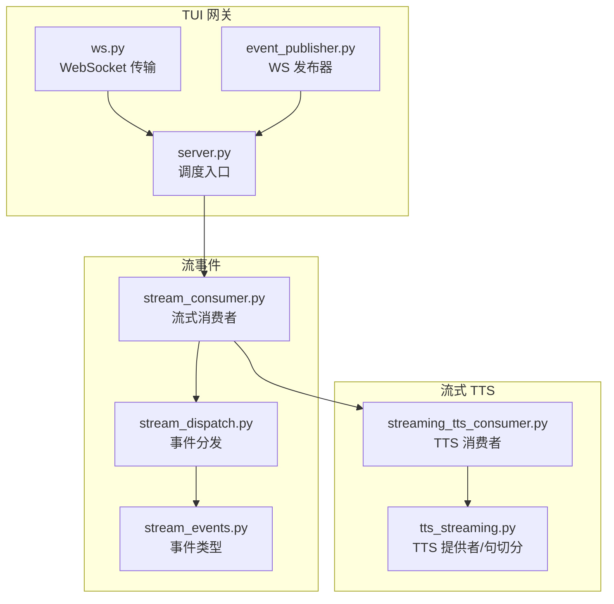
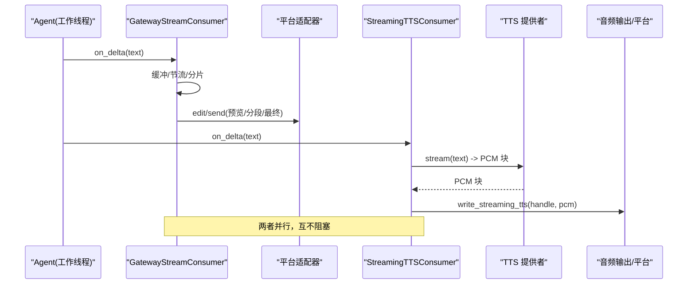
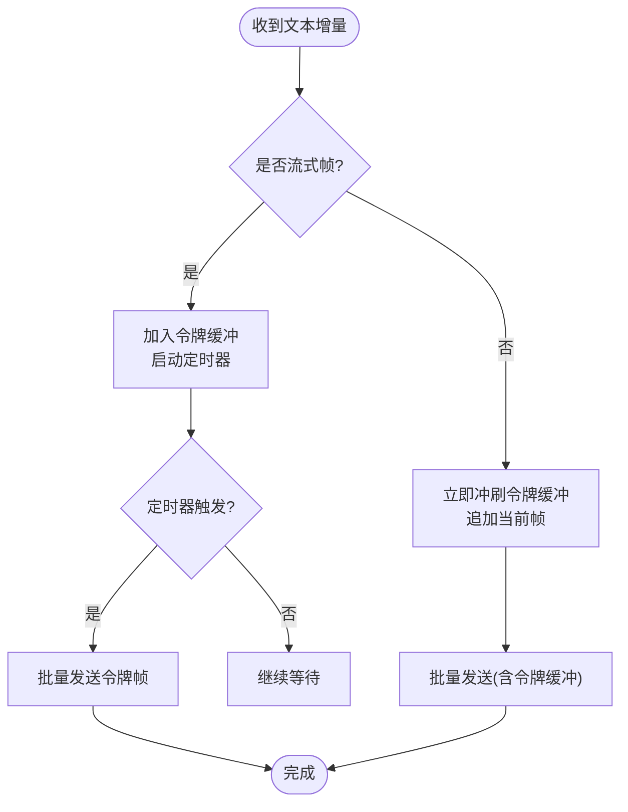
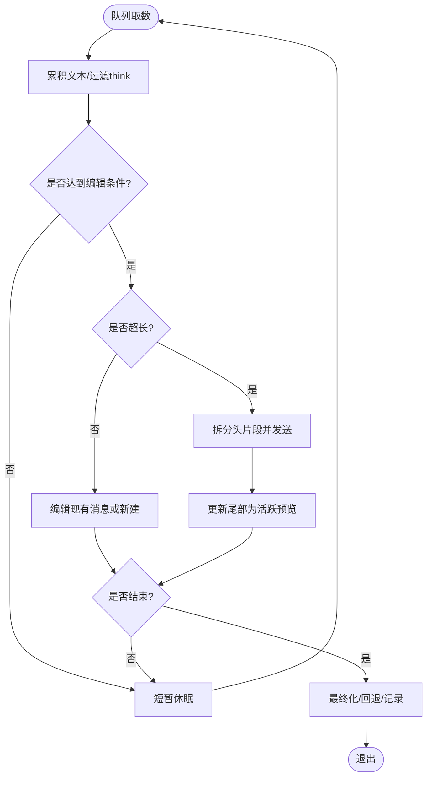
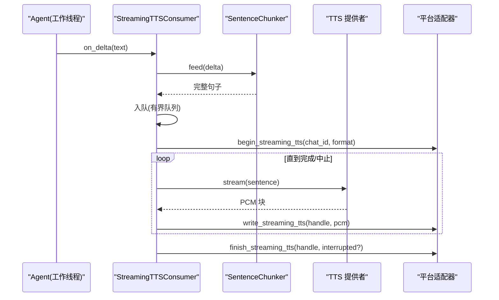
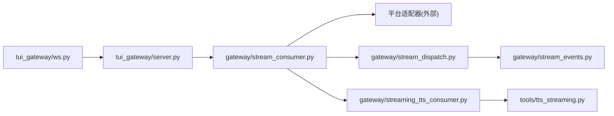

# 流式支持

<cite>
**本文引用的文件**
- [gateway/streaming_tts_consumer.py](file://gateway/streaming_tts_consumer.py)
- [tui_gateway/ws.py](file://tui_gateway/ws.py)
- [tui_gateway/event_publisher.py](file://tui_gateway/event_publisher.py)
- [tools/tts_streaming.py](file://tools/tts_streaming.py)
- [docs/streaming-tts.md](file://docs/streaming-tts.md)
- [gateway/stream_events.py](file://gateway/stream_events.py)
- [gateway/stream_dispatch.py](file://gateway/stream_dispatch.py)
- [gateway/stream_consumer.py](file://gateway/stream_consumer.py)
</cite>

## 目录
1. [简介](#简介)
2. [项目结构](#项目结构)
3. [核心组件](#核心组件)
4. [架构总览](#架构总览)
5. [详细组件分析](#详细组件分析)
6. [依赖关系分析](#依赖关系分析)
7. [性能考量](#性能考量)
8. [故障排查指南](#故障排查指南)
9. [结论](#结论)
10. [附录：客户端集成与调试](#附录客户端集成与调试)

## 简介
本文件系统性说明 Hermes 的流式支持，覆盖实时消息流处理、WebSocket 连接管理、事件发布/订阅模式、流式数据传输、TUI 网关的实时通信实现、事件类型定义、消息序列化/反序列化流程，以及流式 TTS 消费器如何将文本流转换为音频流并实时播放。同时给出背压控制、缓冲管理与错误恢复等性能优化策略，并提供客户端集成示例与调试方法。

## 项目结构
围绕“流式”的关键模块分布在以下位置：
- TUI 网关 WebSocket 传输层：负责连接建立、帧合并与发送、Nagle 禁用、事件聚合
- 事件发布通道：面向仪表盘的轻量 WS 发布器（best-effort）
- 结构化流事件与分发：将 agent 侧的流事件解耦为平台无关的数据结构，并由适配器决定呈现方式
- 流式消费者：将同步回调桥接到异步任务，进行节流、分片、回退与最终化
- 流式 TTS：按句切分文本，调用各提供商的流式 PCM 输出，写入平台适配器的流式音频接口

图表来源
- [tui_gateway/ws.py:1-120](file://tui_gateway/ws.py#L1-L120)
- [tui_gateway/event_publisher.py:1-127](file://tui_gateway/event_publisher.py#L1-L127)
- [gateway/stream_events.py:1-172](file://gateway/stream_events.py#L1-L172)
- [gateway/stream_dispatch.py:1-133](file://gateway/stream_dispatch.py#L1-L133)
- [gateway/stream_consumer.py:156-240](file://gateway/stream_consumer.py#L156-L240)
- [gateway/streaming_tts_consumer.py:1-120](file://gateway/streaming_tts_consumer.py#L1-L120)
- [tools/tts_streaming.py:89-214](file://tools/tts_streaming.py#L89-L214)

章节来源
- [tui_gateway/ws.py:1-120](file://tui_gateway/ws.py#L1-L120)
- [tui_gateway/event_publisher.py:1-127](file://tui_gateway/event_publisher.py#L1-L127)
- [gateway/stream_events.py:1-172](file://gateway/stream_events.py#L1-L172)
- [gateway/stream_dispatch.py:1-133](file://gateway/stream_dispatch.py#L1-L133)
- [gateway/stream_consumer.py:156-240](file://gateway/stream_consumer.py#L156-L240)
- [gateway/streaming_tts_consumer.py:1-120](file://gateway/streaming_tts_consumer.py#L1-L120)
- [tools/tts_streaming.py:89-214](file://tools/tts_streaming.py#L89-L214)

## 核心组件
- WebSocket 传输（WSTransport）：线程安全写、令牌帧合并、Nagle 禁用、超时保护、批量发送
- 事件发布器（WsPublisherTransport）：best-effort 向仪表盘转发事件，队列+守护线程
- 结构化流事件（StreamEvent）：MessageChunk/Commentary/ToolCall* 等，纯数据类，无平台知识
- 事件分发（GatewayEventDispatcher）：根据配置将事件路由到渲染钩子或工具进度队列
- 流式消费者（GatewayStreamConsumer）：接收 delta，缓冲/节流/分片，编辑/新建消息，最终化与回退
- 流式 TTS 消费者（StreamingTTSConsumer）：将 LLM 文本增量转为 PCM 流，写入平台适配器的流式音频接口
- TTS 提供者（StreamingTTSProvider）：抽象接口 + 注册表，提供 ElevenLabs/OpenAI/Gemini/xAI 等流式 PCM

章节来源
- [tui_gateway/ws.py:70-256](file://tui_gateway/ws.py#L70-L256)
- [tui_gateway/event_publisher.py:40-127](file://tui_gateway/event_publisher.py#L40-L127)
- [gateway/stream_events.py:41-172](file://gateway/stream_events.py#L41-L172)
- [gateway/stream_dispatch.py:40-133](file://gateway/stream_dispatch.py#L40-L133)
- [gateway/stream_consumer.py:156-240](file://gateway/stream_consumer.py#L156-L240)
- [gateway/streaming_tts_consumer.py:55-151](file://gateway/streaming_tts_consumer.py#L55-L151)
- [tools/tts_streaming.py:131-214](file://tools/tts_streaming.py#L131-L214)

## 架构总览
Hermes 的流式架构分为两条主线：
- 文本流：agent 产生文本增量 → GatewayStreamConsumer 缓冲/节流/分片 → 通过平台适配器逐步更新消息或创建新消息 → 最终化完成
- 语音流：agent 产生文本增量 → StreamingTTSConsumer 按句切分 → 选择 TTS 提供者生成 PCM 流 → 写入平台适配器的流式音频接口 → 边合成边播放

图表来源
- [gateway/stream_consumer.py:590-605](file://gateway/stream_consumer.py#L590-L605)
- [gateway/streaming_tts_consumer.py:156-168](file://gateway/streaming_tts_consumer.py#L156-L168)
- [tools/tts_streaming.py:220-294](file://tools/tts_streaming.py#L220-L294)

## 详细组件分析

### WebSocket 传输与实时通信（TUI 网关）
- 连接建立与就绪事件：接受连接后发送 gateway.ready，携带皮肤与变更事件开关
- 令牌帧合并：对高频的 message.delta/reasoning.delta/thinking.delta 进行短时缓冲合并，降低事件循环唤醒次数
- 非流式帧优先：非流式帧会先冲刷缓冲区再发送，保证顺序正确
- Nagle 禁用：关闭 TCP_NODELAY，避免小帧被内核合并导致延迟抖动
- 线程安全写：从工作线程调用 write() 时通过 future.result 等待发送完成；在事件循环线程内则直接 fire-and-forget
- 超时与健壮性：写操作设置超时，避免事件循环停滞导致“假死”；捕获异常标记连接死亡

图表来源
- [tui_gateway/ws.py:118-226](file://tui_gateway/ws.py#L118-L226)
- [tui_gateway/ws.py:286-337](file://tui_gateway/ws.py#L286-L337)

章节来源
- [tui_gateway/ws.py:1-120](file://tui_gateway/ws.py#L1-L120)
- [tui_gateway/ws.py:286-477](file://tui_gateway/ws.py#L286-L477)

### 事件发布/订阅（仪表盘侧）
- 使用 websockets 同步客户端连接到仪表盘的 /api/pub
- 以 best-effort 方式转发 JSON 字节，失败即短路后续写入
- 后台守护线程持续 drain 队列，避免阻塞主流程
- 关闭时优雅停止线程并释放资源

章节来源
- [tui_gateway/event_publisher.py:1-127](file://tui_gateway/event_publisher.py#L1-L127)

### 结构化流事件与分发
- 事件类型：MessageChunk、MessageStop、Commentary、ToolCallChunk、ToolCallFinished、LongToolHint、GatewayNotice
- 设计约束：事件仅描述“发生了什么”，不包含平台知识；由网关/适配器决定如何呈现
- 分发器：根据 tool_mode、preview_max_len 等配置，将工具事件格式化后入队；消息/评论事件进入 sink（流式消费者）

章节来源
- [gateway/stream_events.py:41-172](file://gateway/stream_events.py#L41-L172)
- [gateway/stream_dispatch.py:40-133](file://gateway/stream_dispatch.py#L40-L133)

### 流式消费者（GatewayStreamConsumer）
- 线程安全 on_delta：从 agent 工作线程接收增量，放入 queue
- 异步 run 循环：批量取队，过滤 think 标签，计算是否应编辑/新建消息
- 节流与缓冲：基于时间间隔与字符阈值触发更新；支持 buffer_only 模式
- 溢出分片：当内容超过平台限制时，拆分为多个消息，保留尾部作为活跃预览
- 最终化：完成时清理光标、记录已送达内容，必要时走回退路径发送完整答案
- 原生草稿流：部分平台支持 send_draft 动画预览，失败自动降级为 edit

图表来源
- [gateway/stream_consumer.py:760-1200](file://gateway/stream_consumer.py#L760-L1200)

章节来源
- [gateway/stream_consumer.py:156-240](file://gateway/stream_consumer.py#L156-L240)
- [gateway/stream_consumer.py:760-1200](file://gateway/stream_consumer.py#L760-L1200)

### 流式 TTS 消费器（StreamingTTSConsumer）
- 生命周期：on_delta 接收文本增量 → SentenceChunker 按句切分 → 异步任务从队列取出句子 → 调用 TTS 提供者生成 PCM 块 → 写入平台适配器的流式音频接口
- 状态隔离：每个 turn 独立拥有 chunker、queue、handle、标志位；并发聊天不会互相污染
- 完成语义：全部 PCM 成功写出则 completed=True，抑制整文件 TTS；若失败且未播放过，允许回退；若已播放部分，保持 suppress_whole_file 避免从头重放
- 取消/中止：abort 可幂等注入 _ABORT 哨兵，确保终止；finish 注入 _DONE 哨兵，确保确定终止
- 错误恢复：任何阶段异常都会尝试 safe_abort 并设置 handle.aborted；finish_streaming_tts 失败也做分支处理

图表来源
- [gateway/streaming_tts_consumer.py:156-339](file://gateway/streaming_tts_consumer.py#L156-L339)
- [tools/tts_streaming.py:89-124](file://tools/tts_streaming.py#L89-L124)

章节来源
- [gateway/streaming_tts_consumer.py:55-424](file://gateway/streaming_tts_consumer.py#L55-L424)
- [tools/tts_streaming.py:89-214](file://tools/tts_streaming.py#L89-L214)

### TTS 提供者与句切分
- SentenceChunker：增量累积，剥离 <think>...</think>，按标点/空行切出完整句子，短片段合并到下一句
- 提供者抽象：StreamingTTSProvider 定义 sample_rate/channels/sample_width 与 stream(text) -> Iterator[bytes]
- 注册与解析：@register("name") 注册，resolve_streaming_provider 支持 pinned/auto/默认 provider
- 具体实现：
  - ElevenLabs：chunked HTTP pcm_24000
  - OpenAI：with_streaming_response.create(response_format="pcm")
  - Gemini：SSE streamGenerateContent?alt=sse，base64 PCM
  - xAI：WebSocket wss://api.x.ai/v1/tts，二进制 PCM 帧
- 安全边界：每句 PCM 上限 16 MiB，防止上游失控

章节来源
- [tools/tts_streaming.py:89-214](file://tools/tts_streaming.py#L89-L214)
- [tools/tts_streaming.py:220-489](file://tools/tts_streaming.py#L220-L489)
- [docs/streaming-tts.md:1-94](file://docs/streaming-tts.md#L1-L94)

## 依赖关系分析
- WSTransport 依赖 tui_gateway.server.dispatch 进行 RPC 分发，并通过 transport.write/write_async 发送响应/事件
- GatewayStreamConsumer 依赖平台适配器进行消息编辑/发送，并可选择原生草稿流
- StreamingTTSConsumer 依赖平台适配器的流式音频接口与 TTS 提供者
- 事件分发器依赖事件类型定义，将工具/消息事件路由到不同处理路径

图表来源
- [tui_gateway/ws.py:286-477](file://tui_gateway/ws.py#L286-L477)
- [gateway/stream_consumer.py:156-240](file://gateway/stream_consumer.py#L156-L240)
- [gateway/stream_dispatch.py:40-133](file://gateway/stream_dispatch.py#L40-L133)
- [gateway/stream_events.py:41-172](file://gateway/stream_events.py#L41-L172)
- [gateway/streaming_tts_consumer.py:55-151](file://gateway/streaming_tts_consumer.py#L55-L151)
- [tools/tts_streaming.py:131-214](file://tools/tts_streaming.py#L131-L214)

章节来源
- [tui_gateway/ws.py:286-477](file://tui_gateway/ws.py#L286-L477)
- [gateway/stream_consumer.py:156-240](file://gateway/stream_consumer.py#L156-L240)
- [gateway/stream_dispatch.py:40-133](file://gateway/stream_dispatch.py#L40-L133)
- [gateway/stream_events.py:41-172](file://gateway/stream_events.py#L41-L172)
- [gateway/streaming_tts_consumer.py:55-151](file://gateway/streaming_tts_consumer.py#L55-L151)
- [tools/tts_streaming.py:131-214](file://tools/tts_streaming.py#L131-L214)

## 性能考量
- 背压控制
  - 流式 TTS 消费者使用有界 queue.Queue(maxsize=256)，满时丢弃句子并标记 dropped，避免阻塞 agent 线程
  - 事件发布器使用固定大小队列，满则返回 False，fail-fast 避免阻塞
  - WebSocket 写操作带超时，避免事件循环停滞导致“假死”
- 缓冲管理
  - WSTransport 对高频 token 帧进行短时合并（~30fps），减少事件循环唤醒与 GIL 竞争
  - GatewayStreamConsumer 基于时间与字符阈值的节流，避免频繁编辑
  - 溢出分片：长回复拆分为多段消息，保持尾部为活跃预览
- 错误恢复
  - TTS 消费者在任意阶段异常时尝试 safe_abort，并根据是否已播放音频决定是否抑制整文件 TTS
  - 流式消费者在取消/异常时尽力完成最终化，避免遗留预览状态
  - WebSocket 断开后清理会话、释放资源，并记录统计信息便于诊断

章节来源
- [gateway/streaming_tts_consumer.py:90-103](file://gateway/streaming_tts_consumer.py#L90-L103)
- [tui_gateway/event_publisher.py:37-101](file://tui_gateway/event_publisher.py#L37-L101)
- [tui_gateway/ws.py:118-187](file://tui_gateway/ws.py#L118-L187)
- [tui_gateway/ws.py:189-226](file://tui_gateway/ws.py#L189-L226)
- [gateway/stream_consumer.py:856-1119](file://gateway/stream_consumer.py#L856-L1119)

## 故障排查指南
- WebSocket 连接问题
  - 检查 gateway.ready 是否发送成功；查看 ws.py 中的 ready_send_failed 日志
  - 关注 send_failures、dispatch_crashes、parse_errors 计数
- 流式卡顿
  - 确认 _STREAMING_EVENT_TYPES 是否正确识别高频帧
  - 检查 _TOKEN_COALESCE_S 与 _WS_WRITE_TIMEOUT_S 是否合理
  - 观察是否有大量 parse error 或 dispatch crash
- TTS 播放问题
  - 确认 resolve_streaming_provider 是否返回有效提供者
  - 检查 begin_streaming_tts 与 write_streaming_tts 是否成功
  - 关注 partial/dropped/completed/suppress_whole_file 状态变化
- 流式消费者异常
  - 检查 overflow split 是否生效，是否出现重复/缺失片段
  - 核对 final_response_sent 与 final_content_delivered 的一致性
  - 查看 _try_fresh_final 与 fallback 路径是否触发

章节来源
- [tui_gateway/ws.py:286-477](file://tui_gateway/ws.py#L286-L477)
- [tui_gateway/ws.py:118-187](file://tui_gateway/ws.py#L118-L187)
- [gateway/streaming_tts_consumer.py:218-339](file://gateway/streaming_tts_consumer.py#L218-L339)
- [gateway/stream_consumer.py:1056-1199](file://gateway/stream_consumer.py#L1056-L1199)

## 结论
Hermes 的流式支持通过清晰的职责分离与多层缓冲/节流机制，实现了低延迟、高吞吐的实时文本与语音体验。WebSocket 传输层保障帧顺序与稳定性，结构化事件解耦了 agent 与平台呈现，流式消费者与 TTS 消费器分别处理文本与音频的增量到达，配合完善的错误恢复与性能优化策略，使系统在多种平台与网络条件下均能稳定运行。

## 附录：客户端集成与调试
- 客户端接入
  - 通过 WebSocket 连接到 TUI 网关，遵循 newline-delimited JSON-RPC 协议
  - 连接成功后会收到 gateway.ready，包含 skin 与 change_events 开关
  - 订阅 message.delta/reasoning.delta/thinking.delta 等高频事件，注意服务端已做合并
- 调试建议
  - 启用日志观察 ws.py 的 peer、messages、parse_errors、dispatch_crashes、send_failures
  - 对于 TTS，检查 streaming_tts_consumer 的 active/partial/dropped/completed 状态
  - 使用事件发布器（WsPublisherTransport）将事件镜像到仪表盘，便于可视化追踪
- 配置提示
  - 可通过 tts.streaming.provider 指定或 auto 选择最佳流式 TTS 提供者
  - 调整流式消费者的 edit_interval、buffer_threshold 以平衡流畅度与刷新频率

章节来源
- [tui_gateway/ws.py:286-337](file://tui_gateway/ws.py#L286-L337)
- [tui_gateway/event_publisher.py:40-127](file://tui_gateway/event_publisher.py#L40-L127)
- [docs/streaming-tts.md:29-65](file://docs/streaming-tts.md#L29-L65)